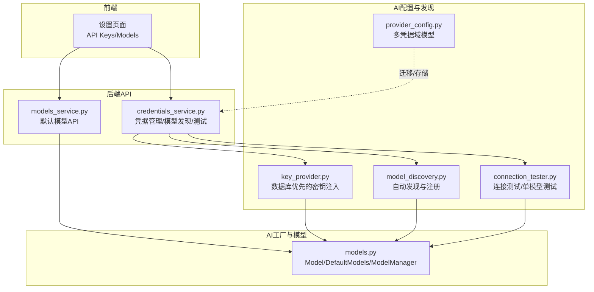
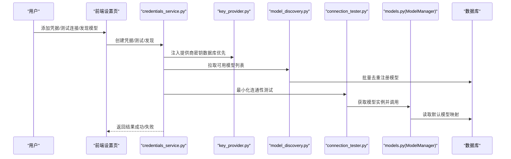
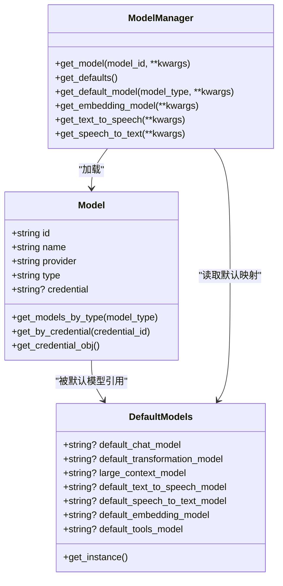
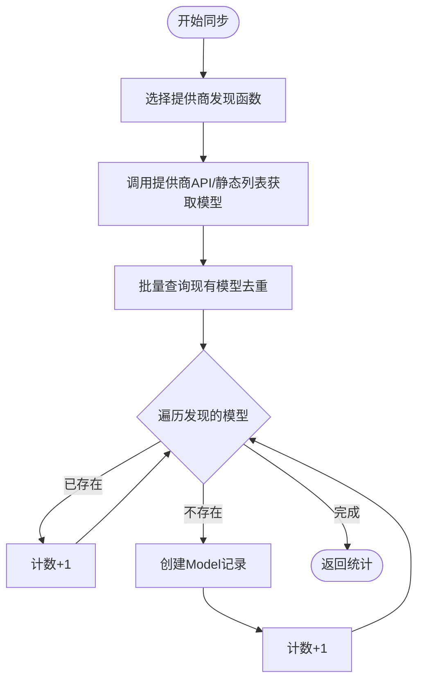
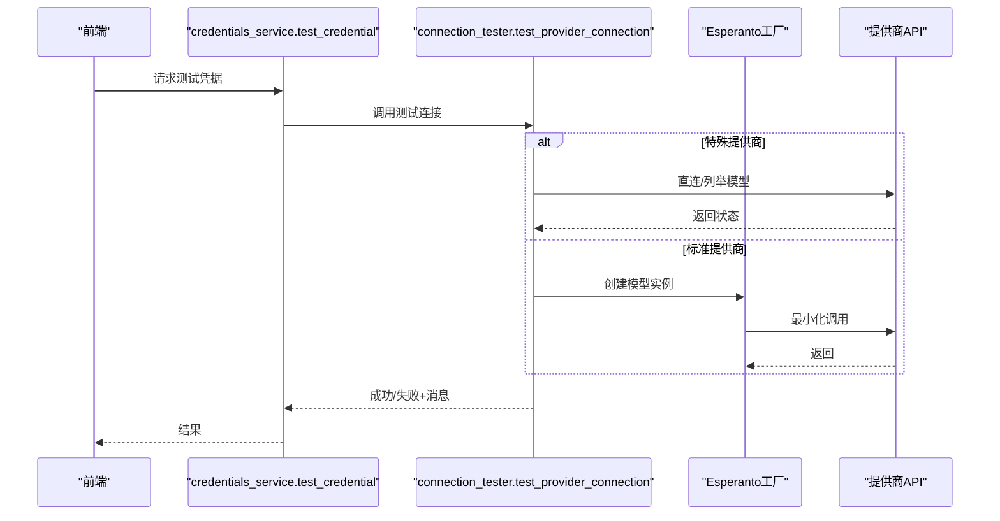
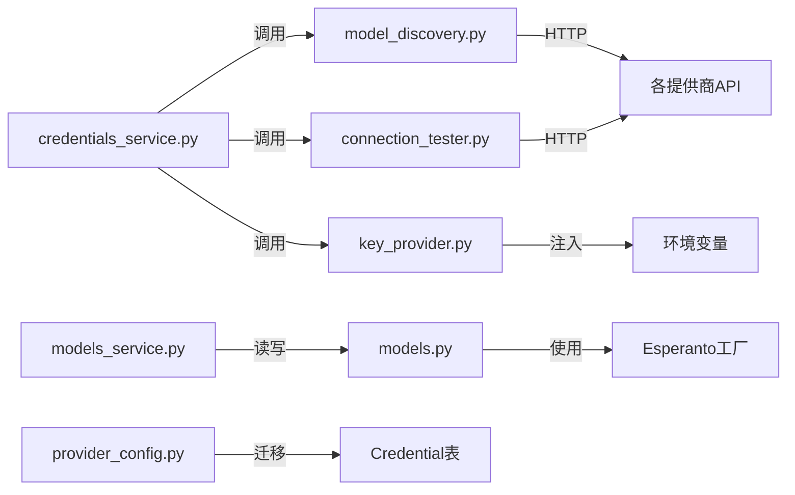

# AI提供商配置

<cite>
**本文档引用的文件**
- [open_notebook/ai/models.py](file://open_notebook/ai/models.py)
- [open_notebook/ai/model_discovery.py](file://open_notebook/ai/model_discovery.py)
- [open_notebook/ai/connection_tester.py](file://open_notebook/ai/connection_tester.py)
- [open_notebook/ai/key_provider.py](file://open_notebook/ai/key_provider.py)
- [open_notebook/domain/provider_config.py](file://open_notebook/domain/provider_config.py)
- [api/credentials_service.py](file://api/credentials_service.py)
- [api/models_service.py](file://api/models_service.py)
- [docs/4-AI-PROVIDERS/index.md](file://docs/4-AI-PROVIDERS/index.md)
- [docs/5-CONFIGURATION/ai-providers.md](file://docs/5-CONFIGURATION/ai-providers.md)
- [docs/5-CONFIGURATION/ollama.md](file://docs/5-CONFIGURATION/ollama.md)
- [docs/6-TROUBLESHOOTING/connection-issues.md](file://docs/6-TROUBLESHOOTING/connection-issues.md)
</cite>

## 目录
1. [简介](#简介)
2. [项目结构](#项目结构)
3. [核心组件](#核心组件)
4. [架构总览](#架构总览)
5. [详细组件分析](#详细组件分析)
6. [依赖关系分析](#依赖关系分析)
7. [性能考量](#性能考量)
8. [故障排除指南](#故障排除指南)
9. [结论](#结论)
10. [附录](#附录)

## 简介
本文件系统性梳理 Open Notebook 支持的16+ AI提供商配置与使用方法，覆盖从环境准备、API密钥设置、模型发现、连接测试到默认模型管理的完整流程；同时对各提供商在大模型（LLM）、嵌入（Embedding）、语音识别（STT）、文本转语音（TTS）的支持能力进行对比，并给出性能、成本与使用场景建议；最后提供本地模型（如Ollama）的配置与排障要点。

## 项目结构
Open Notebook 的 AI 提供商配置由后端服务层、领域模型、AI工厂与连接测试模块协同完成，前端通过设置页面与API交互，形成“凭据管理—模型发现—连接测试—默认模型—业务调用”的闭环。

图示来源
- [api/credentials_service.py](file://api/credentials_service.py#L1-L884)
- [api/models_service.py](file://api/models_service.py#L1-L113)
- [open_notebook/ai/key_provider.py](file://open_notebook/ai/key_provider.py#L1-L298)
- [open_notebook/ai/model_discovery.py](file://open_notebook/ai/model_discovery.py#L1-L757)
- [open_notebook/ai/connection_tester.py](file://open_notebook/ai/connection_tester.py#L1-L439)
- [open_notebook/domain/provider_config.py](file://open_notebook/domain/provider_config.py#L1-L445)
- [open_notebook/ai/models.py](file://open_notebook/ai/models.py#L1-L267)

章节来源
- [open_notebook/ai/models.py](file://open_notebook/ai/models.py#L1-L267)
- [open_notebook/ai/model_discovery.py](file://open_notebook/ai/model_discovery.py#L1-L757)
- [open_notebook/ai/connection_tester.py](file://open_notebook/ai/connection_tester.py#L1-L439)
- [open_notebook/ai/key_provider.py](file://open_notebook/ai/key_provider.py#L1-L298)
- [open_notebook/domain/provider_config.py](file://open_notebook/domain/provider_config.py#L1-L445)
- [api/credentials_service.py](file://api/credentials_service.py#L1-L884)
- [api/models_service.py](file://api/models_service.py#L1-L113)

## 核心组件
- 模型与默认模型管理：负责模型记录、默认模型映射、按类型获取模型实例。
- 模型发现：按提供商自动拉取可用模型列表并注册到数据库。
- 连接测试：验证凭据有效性、最小化调用连通性、单模型端到端测试。
- 密钥提供器：数据库优先的凭据注入，支持简单与复杂提供商（Azure/Vertex/OpenAI-Compatible）。
- 凭据域模型：ProviderConfig 多凭据存储与加密保护，支持迁移与更新。
- API服务：前端通过API进行凭据管理、模型发现、默认模型设置。

章节来源
- [open_notebook/ai/models.py](file://open_notebook/ai/models.py#L18-L267)
- [open_notebook/ai/model_discovery.py](file://open_notebook/ai/model_discovery.py#L608-L757)
- [open_notebook/ai/connection_tester.py](file://open_notebook/ai/connection_tester.py#L170-L439)
- [open_notebook/ai/key_provider.py](file://open_notebook/ai/key_provider.py#L236-L298)
- [open_notebook/domain/provider_config.py](file://open_notebook/domain/provider_config.py#L175-L445)
- [api/credentials_service.py](file://api/credentials_service.py#L314-L884)
- [api/models_service.py](file://api/models_service.py#L13-L113)

## 架构总览
Open Notebook 的 AI 提供商配置采用“凭据驱动 + 工厂模式 + 自动发现 + 测试校验”的架构：

图示来源
- [api/credentials_service.py](file://api/credentials_service.py#L356-L466)
- [open_notebook/ai/key_provider.py](file://open_notebook/ai/key_provider.py#L236-L298)
- [open_notebook/ai/model_discovery.py](file://open_notebook/ai/model_discovery.py#L632-L725)
- [open_notebook/ai/connection_tester.py](file://open_notebook/ai/connection_tester.py#L170-L300)
- [open_notebook/ai/models.py](file://open_notebook/ai/models.py#L97-L267)

## 详细组件分析

### 模型与默认模型管理（Model/DefaultModels/ModelManager）
- Model：持久化模型记录，支持按凭据关联、查询与保存。
- DefaultModels：记录默认模型映射（聊天、转换、工具、嵌入、TTS、STT、长上下文）。
- ModelManager：根据模型ID或默认类型解析配置，合并kwargs参数，调用 Esperanto 工厂创建对应模型实例；支持从凭据或环境变量注入配置。

图示来源
- [open_notebook/ai/models.py](file://open_notebook/ai/models.py#L18-L267)

章节来源
- [open_notebook/ai/models.py](file://open_notebook/ai/models.py#L18-L267)

### 模型发现与注册（model_discovery.py）
- 针对 OpenAI、Anthropic、Google、Groq、Mistral、DeepSeek、xAI、OpenRouter、Voyage、ElevenLabs、Ollama、OpenAI-Compatible 等提供商，分别实现发现函数。
- 基于命名规则与能力字段进行模型类型分类（语言、嵌入、STT、TTS）。
- 支持批量去重注册，避免重复创建；提供按提供商统计模型数量的接口。

图示来源
- [open_notebook/ai/model_discovery.py](file://open_notebook/ai/model_discovery.py#L632-L725)

章节来源
- [open_notebook/ai/model_discovery.py](file://open_notebook/ai/model_discovery.py#L1-L757)

### 连接测试（connection_tester.py）
- 提供两类测试：
  - 供应商级连接测试：验证凭据与端点可达性（最小化调用），支持 Azure、Ollama、OpenAI-Compatible 等特殊处理。
  - 单模型端到端测试：针对具体 Model 记录执行实际调用（聊天/嵌入/TTS/STT），并返回可读信息。
- 对常见错误进行归一化提示（无效密钥、配额限制、网络超时等）。

图示来源
- [api/credentials_service.py](file://api/credentials_service.py#L356-L466)
- [open_notebook/ai/connection_tester.py](file://open_notebook/ai/connection_tester.py#L170-L300)

章节来源
- [open_notebook/ai/connection_tester.py](file://open_notebook/ai/connection_tester.py#L1-L439)
- [api/credentials_service.py](file://api/credentials_service.py#L356-L466)

### 密钥提供器（key_provider.py）
- 数据库优先策略：优先从 Credential 表读取密钥与基础URL，再回退到环境变量。
- 支持简单提供商（仅API Key）与复杂提供商（Azure/Vertex/OpenAI-Compatible）的多字段注入。
- 提供一次性注入与全量注入（已弃用）两种方式。

章节来源
- [open_notebook/ai/key_provider.py](file://open_notebook/ai/key_provider.py#L1-L298)

### 凭据域模型（provider_config.py）
- ProviderConfig：以单例形式存储多个提供商的多套凭据，支持默认凭据标记、增删改查、加密存储与迁移。
- 与 Credentials Service 协作，完成从旧 ProviderConfig 到新 Credential 的迁移。

章节来源
- [open_notebook/domain/provider_config.py](file://open_notebook/domain/provider_config.py#L1-L445)
- [api/credentials_service.py](file://api/credentials_service.py#L686-L791)

### API服务（credentials_service.py / models_service.py）
- credentials_service：提供凭据状态检查、URL校验（SSRF防护）、凭据测试、模型发现（含静态列表与API）、模型注册、从 ProviderConfig 迁移到 Credential 等。
- models_service：封装默认模型的读取与更新API，便于前端操作。

章节来源
- [api/credentials_service.py](file://api/credentials_service.py#L1-L884)
- [api/models_service.py](file://api/models_service.py#L1-L113)

## 依赖关系分析
- 模块耦合：
  - ModelManager 依赖 Esperanto 工厂与数据库查询，向上为业务层提供统一模型获取入口。
  - model_discovery 依赖 httpx 与数据库查询，向下对接各提供商API。
  - connection_tester 依赖 Esperanto 工厂与各提供商测试逻辑，向上为前端提供连通性保障。
  - key_provider 与 provider_config 共同构成凭据体系，前者负责注入，后者负责存储与迁移。
- 外部依赖：
  - Esperanto：统一的AI工厂，屏蔽不同提供商SDK差异。
  - httpx：异步HTTP客户端，用于模型发现与连接测试。
  - SurrealDB：作为数据存储后端，提供模型与凭据的持久化。

图示来源
- [open_notebook/ai/models.py](file://open_notebook/ai/models.py#L97-L267)
- [open_notebook/ai/model_discovery.py](file://open_notebook/ai/model_discovery.py#L1-L757)
- [open_notebook/ai/connection_tester.py](file://open_notebook/ai/connection_tester.py#L1-L439)
- [open_notebook/ai/key_provider.py](file://open_notebook/ai/key_provider.py#L1-L298)
- [open_notebook/domain/provider_config.py](file://open_notebook/domain/provider_config.py#L1-L445)
- [api/credentials_service.py](file://api/credentials_service.py#L1-L884)
- [api/models_service.py](file://api/models_service.py#L1-L113)

## 性能考量
- 模型发现批处理：model_discovery 在注册阶段批量查询现有模型，避免 N+1 查询，提升效率。
- 默认模型缓存：ModelManager 不做本地缓存，每次从数据库读取最新默认映射，确保一致性。
- 连接测试最小化：测试时使用最小代价模型与简短调用，降低对外部API的压力。
- URL校验与SSRF防护：credentials_service 对输入URL进行严格校验，避免危险地址导致的性能与安全问题。

章节来源
- [open_notebook/ai/model_discovery.py](file://open_notebook/ai/model_discovery.py#L632-L725)
- [open_notebook/ai/models.py](file://open_notebook/ai/models.py#L97-L100)
- [api/credentials_service.py](file://api/credentials_service.py#L85-L185)

## 故障排除指南

### 通用连接问题
- 症状：无法访问API、连接被拒绝、超时。
- 排查步骤：
  - 检查服务是否运行、端口是否暴露、防火墙是否放行。
  - 使用 curl 直接访问健康检查端点，确认响应。
  - 若为反向代理，检查路由配置与协议匹配。
- 参考：[连接问题诊断](file://docs/6-TROUBLESHOOTING/connection-issues.md#L1-L448)

章节来源
- [docs/6-TROUBLESHOOTING/connection-issues.md](file://docs/6-TROUBLESHOOTING/connection-issues.md#L1-L448)

### 提供商连接测试失败
- 常见原因：API Key格式不正确、权限不足、速率限制、模型不可用、网络超时。
- 解决方案：
  - 在设置页中重新测试连接，查看归一化后的提示信息。
  - 对于 Azure/Ollama/OpenAI-Compatible，检查端点URL与鉴权参数。
  - 对于模型不可用，尝试更换测试模型或重新发现。
- 参考：[连接测试实现](file://open_notebook/ai/connection_tester.py#L170-L300)、[凭据测试API](file://api/credentials_service.py#L356-L466)

章节来源
- [open_notebook/ai/connection_tester.py](file://open_notebook/ai/connection_tester.py#L170-L300)
- [api/credentials_service.py](file://api/credentials_service.py#L356-L466)

### 本地模型（Ollama）配置问题
- 症状：Ollama 不可用、模型名称不匹配、Docker 网络解析失败。
- 解决方案：
  - 确保 Ollama 绑定到 0.0.0.0 并允许外部连接。
  - 在设置页中正确填写 base URL（根据部署场景选择 localhost/host.docker.internal/容器名/IP）。
  - 模型名称必须与 ollama list 输出完全一致（含标签）。
  - Linux 需要额外配置 extra_hosts 或使用 host 网络。
- 参考：[Ollama 设置指南](file://docs/5-CONFIGURATION/ollama.md#L1-L741)

章节来源
- [docs/5-CONFIGURATION/ollama.md](file://docs/5-CONFIGURATION/ollama.md#L1-L741)

## 结论
Open Notebook 通过“凭据驱动 + 工厂模式 + 自动发现 + 测试校验”的架构，实现了对16+ AI提供商的一致化接入与管理。前端通过设置页面即可完成密钥配置、模型发现、连接测试与默认模型设定；后端以数据库为中心，结合 Esperanto 工厂屏蔽差异，提供稳定可靠的模型调用能力。对于本地模型（如 Ollama），提供了详尽的网络与模型名称配置指导，确保私有化部署的顺畅体验。

## 附录

### 各提供商支持能力概览
- OpenAI：语言、嵌入、STT、TTS
- Anthropic：语言
- Google/Gemini：语言、嵌入
- Groq：语言、STT
- Mistral：语言、嵌入
- DeepSeek：语言
- xAI：语言
- OpenRouter：语言
- Voyage：嵌入
- ElevenLabs：TTS
- Ollama：语言、嵌入
- Azure：语言、嵌入、STT、TTS
- OpenAI-Compatible：语言、嵌入、STT、TTS

章节来源
- [api/credentials_service.py](file://api/credentials_service.py#L62-L77)
- [open_notebook/ai/model_discovery.py](file://open_notebook/ai/model_discovery.py#L135-L166)

### 配置与使用步骤清单
- 环境准备：设置加密密钥（OPEN_NOTEBOOK_ENCRYPTION_KEY）。
- 添加凭据：在设置页添加提供商凭据（API Key/端点/版本等）。
- 连接测试：点击“测试连接”，确认连通性。
- 模型发现：点击“发现模型”，选择类型并注册。
- 默认模型：在“默认模型”中设置聊天/嵌入/TTS/STT等默认项。
- 开始使用：在笔记本/转换任务中选择对应模型。

章节来源
- [docs/5-CONFIGURATION/ai-providers.md](file://docs/5-CONFIGURATION/ai-providers.md#L1-L468)
- [docs/4-AI-PROVIDERS/index.md](file://docs/4-AI-PROVIDERS/index.md#L1-L200)