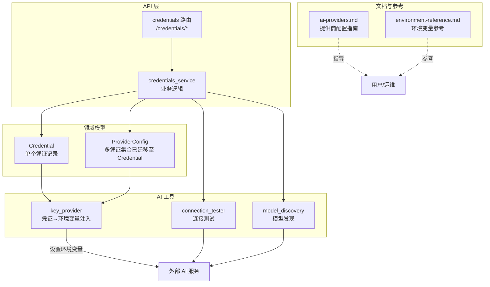
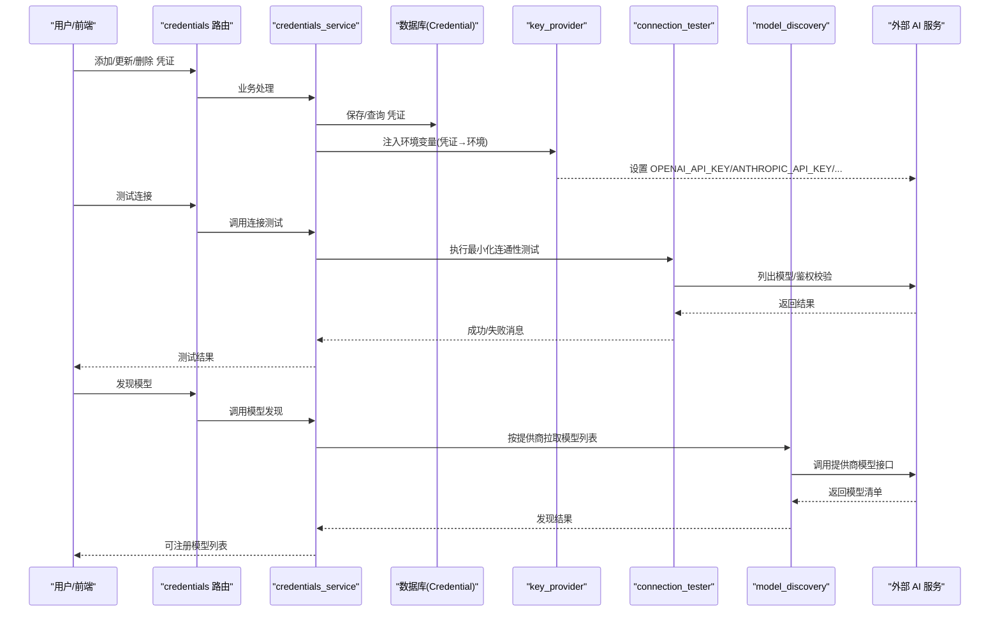
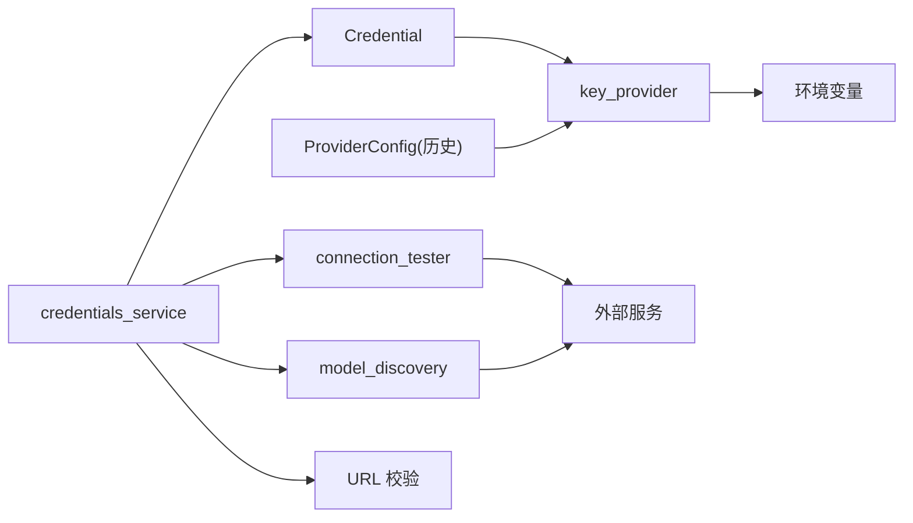

# 云提供商配置

<cite>
**本文档引用的文件**
- [api/models.py](file://api/models.py)
- [open_notebook/domain/provider_config.py](file://open_notebook/domain/provider_config.py)
- [open_notebook/domain/credential.py](file://open_notebook/domain/credential.py)
- [open_notebook/ai/key_provider.py](file://open_notebook/ai/key_provider.py)
- [open_notebook/ai/connection_tester.py](file://open_notebook/ai/connection_tester.py)
- [open_notebook/ai/model_discovery.py](file://open_notebook/ai/model_discovery.py)
- [api/routers/credentials.py](file://api/routers/credentials.py)
- [api/credentials_service.py](file://api/credentials_service.py)
- [docs/5-CONFIGURATION/ai-providers.md](file://docs/5-CONFIGURATION/ai-providers.md)
- [docs/5-CONFIGURATION/environment-reference.md](file://docs/5-CONFIGURATION/environment-reference.md)
</cite>

## 目录
1. [简介](#简介)
2. [项目结构](#项目结构)
3. [核心组件](#核心组件)
4. [架构总览](#架构总览)
5. [详细组件分析](#详细组件分析)
6. [依赖关系分析](#依赖关系分析)
7. [性能考虑](#性能考虑)
8. [故障排除指南](#故障排除指南)
9. [结论](#结论)
10. [附录](#附录)

## 简介
本文件面向需要在 Open Notebook 中配置云 AI 提供商（OpenAI、Anthropic Claude、Google Gemini、Groq、OpenRouter 等）的用户与运维人员，系统性说明以下内容：
- 各提供商的 API 密钥获取流程与环境变量映射
- 在应用中的配置方式（数据库凭证记录 + 环境变量回退）
- 连接测试步骤与常见问题定位
- 各提供商在语言模型、嵌入、语音识别等方面的支持与性能特点
- 不同使用场景下的推荐配置与成本估算
- 常见配置错误排查与最佳实践

## 项目结构
围绕“云提供商配置”的关键模块与文件如下：
- 领域模型与凭证管理：ProviderConfig、Credential
- 凭证读取与环境变量注入：key_provider
- 连接测试与模型发现：connection_tester、model_discovery
- API 层：credentials 路由与服务层逻辑
- 文档与参考：ai-providers.md、environment-reference.md

图表来源
- [api/routers/credentials.py](file://api/routers/credentials.py#L1-L387)
- [api/credentials_service.py](file://api/credentials_service.py#L1-L200)
- [open_notebook/domain/credential.py](file://open_notebook/domain/credential.py#L1-L200)
- [open_notebook/domain/provider_config.py](file://open_notebook/domain/provider_config.py#L1-L445)
- [open_notebook/ai/key_provider.py](file://open_notebook/ai/key_provider.py#L1-L298)
- [open_notebook/ai/connection_tester.py](file://open_notebook/ai/connection_tester.py#L1-L439)
- [open_notebook/ai/model_discovery.py](file://open_notebook/ai/model_discovery.py#L1-L757)
- [docs/5-CONFIGURATION/ai-providers.md](file://docs/5-CONFIGURATION/ai-providers.md#L1-L468)
- [docs/5-CONFIGURATION/environment-reference.md](file://docs/5-CONFIGURATION/environment-reference.md#L1-L275)

章节来源
- [api/routers/credentials.py](file://api/routers/credentials.py#L1-L387)
- [api/credentials_service.py](file://api/credentials_service.py#L1-L200)
- [open_notebook/domain/credential.py](file://open_notebook/domain/credential.py#L1-L200)
- [open_notebook/domain/provider_config.py](file://open_notebook/domain/provider_config.py#L1-L445)
- [open_notebook/ai/key_provider.py](file://open_notebook/ai/key_provider.py#L1-L298)
- [open_notebook/ai/connection_tester.py](file://open_notebook/ai/connection_tester.py#L1-L439)
- [open_notebook/ai/model_discovery.py](file://open_notebook/ai/model_discovery.py#L1-L757)
- [docs/5-CONFIGURATION/ai-providers.md](file://docs/5-CONFIGURATION/ai-providers.md#L1-L468)
- [docs/5-CONFIGURATION/environment-reference.md](file://docs/5-CONFIGURATION/environment-reference.md#L1-L275)

## 核心组件
- 凭证模型（Credential）：存储单个提供商的认证信息与配置字段，支持加密存储与解密读取，提供 to_esperanto_config 将其转换为 AIFactory 创建模型所需的配置字典。
- 凭证读取与环境变量注入（key_provider）：根据提供商名称映射到对应的环境变量名，优先从数据库 Credential 读取，否则回退到环境变量；同时支持 Vertex/Azure/OpenAI-Compatible 的多字段注入。
- 连接测试（connection_tester）：对各提供商进行最小化连通性测试，包括列出可用模型、验证鉴权、处理超时/限流/网络错误等，并提供针对具体模型的端到端测试。
- 模型发现（model_discovery）：按提供商调用其 API 获取可用模型列表，自动分类模型类型（语言、嵌入、语音），并可批量注册到数据库。
- API 路由与服务层（credentials 路由与 credentials_service）：提供凭证实例的增删改查、连接测试、模型发现与注册、环境状态检查、从旧 ProviderConfig 或环境变量迁移等功能。

章节来源
- [open_notebook/domain/credential.py](file://open_notebook/domain/credential.py#L1-L200)
- [open_notebook/ai/key_provider.py](file://open_notebook/ai/key_provider.py#L1-L298)
- [open_notebook/ai/connection_tester.py](file://open_notebook/ai/connection_tester.py#L1-L439)
- [open_notebook/ai/model_discovery.py](file://open_notebook/ai/model_discovery.py#L1-L757)
- [api/routers/credentials.py](file://api/routers/credentials.py#L1-L387)
- [api/credentials_service.py](file://api/credentials_service.py#L1-L200)

## 架构总览
下图展示了“凭证—环境变量—外部服务”的关键交互路径，以及“连接测试—模型发现—模型注册”的工作流。

图表来源
- [api/routers/credentials.py](file://api/routers/credentials.py#L1-L387)
- [api/credentials_service.py](file://api/credentials_service.py#L356-L439)
- [open_notebook/ai/key_provider.py](file://open_notebook/ai/key_provider.py#L236-L298)
- [open_notebook/ai/connection_tester.py](file://open_notebook/ai/connection_tester.py#L170-L300)
- [open_notebook/ai/model_discovery.py](file://open_notebook/ai/model_discovery.py#L608-L725)

## 详细组件分析

### OpenAI 配置
- API 密钥获取：平台控制台创建账户并生成以特定前缀开头的密钥，充值额度后即可使用。
- 环境变量映射：通过数据库凭证记录（Credential）保存，无需手动设置环境变量；如需回退，可使用 OPENAI_API_KEY。
- 连接测试：使用最小化模型进行鉴权与连通性验证；若返回“模型不可用”，可尝试其他模型或重新发现。
- 支持能力：语言模型、嵌入、语音识别（部分模型）、文本转语音（部分模型）。
- 性能与成本：中等偏上质量与速度平衡，适合一般用途；成本约每千令牌数美元级别，按使用量计费。
- 推荐配置：一般用途选择最新版高质量模型；测试或低成本场景选择更便宜的子型号；复杂推理任务可选专用推理模型。
- 常见问题：无效密钥、配额不足、速率限制、模型不可用。

章节来源
- [docs/5-CONFIGURATION/ai-providers.md](file://docs/5-CONFIGURATION/ai-providers.md#L25-L67)
- [open_notebook/ai/connection_tester.py](file://open_notebook/ai/connection_tester.py#L170-L300)
- [open_notebook/ai/model_discovery.py](file://open_notebook/ai/model_discovery.py#L173-L204)

### Anthropic Claude 配置
- API 密钥获取：控制台创建账户并生成以特定前缀开头的密钥。
- 环境变量映射：通过数据库凭证记录保存；如需回退，可使用 ANTHROPIC_API_KEY。
- 连接测试：最小化连通性测试，若提示服务繁忙，稍后再试。
- 支持能力：语言模型（长上下文优势明显）。
- 性能与成本：长上下文与推理能力强，成本相对较低；适合长文档与复杂问答。
- 推荐配置：一般用途选择最新一代主推模型；追求性价比可选小型号；最强大能力可选旗舰型号。
- 常见问题：无效密钥、服务过载、模型不可用。

章节来源
- [docs/5-CONFIGURATION/ai-providers.md](file://docs/5-CONFIGURATION/ai-providers.md#L70-L115)
- [open_notebook/ai/connection_tester.py](file://open_notebook/ai/connection_tester.py#L170-L300)

### Google Gemini 配置
- API 密钥获取：AI Studio 创建密钥。
- 环境变量映射：通过数据库凭证记录保存；如需回退，可使用 GOOGLE_API_KEY 或 GEMINI_API_KEY。
- 连接测试：最小化连通性测试，若提示配额不足，升级账户。
- 支持能力：语言模型、嵌入（多模态支持）。
- 性能与成本：与主流厂商相当，具备极长上下文与多模态能力，适合播客等多媒体场景。
- 推荐配置：一般用途选择最新实验性或稳定版本；追求极致性价比可选较老版本；长上下文任务可选高容量版本。
- 常见问题：无效密钥、配额不足、模型不可用。

章节来源
- [docs/5-CONFIGURATION/ai-providers.md](file://docs/5-CONFIGURATION/ai-providers.md#L118-L153)
- [open_notebook/ai/connection_tester.py](file://open_notebook/ai/connection_tester.py#L170-L300)

### Groq 配置
- API 密钥获取：控制台创建账户并生成密钥。
- 环境变量映射：通过数据库凭证记录保存；如需回退，可使用 GROQ_API_KEY。
- 连接测试：最小化连通性测试，注意免费配额限制。
- 支持能力：语言模型、语音识别（部分模型）。
- 性能与成本：推理速度极快、成本低，适合批处理与快速迭代。
- 推荐配置：追求速度与成本平衡可选主流大模型；追求极致速度可选小而快的模型。
- 常见问题：速率限制、模型不可用。

章节来源
- [docs/5-CONFIGURATION/ai-providers.md](file://docs/5-CONFIGURATION/ai-providers.md#L156-L196)
- [open_notebook/ai/connection_tester.py](file://open_notebook/ai/connection_tester.py#L170-L300)

### OpenRouter 配置
- API 密钥获取：平台创建账户并充值后生成密钥。
- 环境变量映射：通过数据库凭证记录保存；如需回退，可使用 OPENROUTER_API_KEY。
- 连接测试：最小化连通性测试，若提示余额不足，补充信用。
- 支持能力：统一接入多家模型，覆盖广泛。
- 性能与成本：按所选模型计费，适合对比与组合使用。
- 推荐配置：根据质量/速度/开源偏好选择对应上游模型路径。
- 常见问题：无效密钥、余额不足、模型路径拼写错误。

章节来源
- [docs/5-CONFIGURATION/ai-providers.md](file://docs/5-CONFIGURATION/ai-providers.md#L199-L250)
- [open_notebook/ai/connection_tester.py](file://open_notebook/ai/connection_tester.py#L170-L300)

### 自托管与兼容
- Ollama：本地运行，通过 base_url 指向本地服务；适合隐私与离线需求。
- LM Studio/自定义 OpenAI-Compatible：通过 base_url 指向本地或自建兼容服务，可配置 per-service URL 与密钥。
- 连接测试：对 Ollama 与 OpenAI-Compatible 分别进行连通性验证。

章节来源
- [docs/5-CONFIGURATION/ai-providers.md](file://docs/5-CONFIGURATION/ai-providers.md#L252-L370)
- [open_notebook/ai/connection_tester.py](file://open_notebook/ai/connection_tester.py#L97-L169)

### 企业级
- Azure OpenAI：需配置 API Key、Endpoint、API Version，可按服务类型分别指定端点。
- 连接测试：通过列出模型接口进行鉴权与连通性验证。

章节来源
- [docs/5-CONFIGURATION/ai-providers.md](file://docs/5-CONFIGURATION/ai-providers.md#L372-L400)
- [open_notebook/ai/connection_tester.py](file://open_notebook/ai/connection_tester.py#L40-L95)

## 依赖关系分析
- 凭证来源：优先从数据库 Credential 读取，其次回退到环境变量；对于 Vertex/Azure/OpenAI-Compatible 等复杂提供商，支持多字段注入。
- 连接测试：对简单提供商使用最小化模型调用，对 Azure 使用模型列表接口，对 Ollama 与 OpenAI-Compatible 使用各自标准端点。
- 模型发现：按提供商调用其公开 API 获取模型清单，自动分类模型类型并可批量注册。
- URL 安全校验：对 base_url/endpoint 等进行 URL 格式与安全地址校验，防止 SSRF。

图表来源
- [open_notebook/domain/credential.py](file://open_notebook/domain/credential.py#L67-L97)
- [open_notebook/ai/key_provider.py](file://open_notebook/ai/key_provider.py#L236-L298)
- [api/credentials_service.py](file://api/credentials_service.py#L85-L185)
- [open_notebook/ai/connection_tester.py](file://open_notebook/ai/connection_tester.py#L170-L300)
- [open_notebook/ai/model_discovery.py](file://open_notebook/ai/model_discovery.py#L608-L725)

章节来源
- [open_notebook/domain/credential.py](file://open_notebook/domain/credential.py#L1-L200)
- [open_notebook/ai/key_provider.py](file://open_notebook/ai/key_provider.py#L1-L298)
- [api/credentials_service.py](file://api/credentials_service.py#L1-L200)
- [open_notebook/ai/connection_tester.py](file://open_notebook/ai/connection_tester.py#L1-L439)
- [open_notebook/ai/model_discovery.py](file://open_notebook/ai/model_discovery.py#L1-L757)

## 性能考虑
- 连接超时与重试：可通过环境变量调整 LLM 推理超时与 SSL 校验策略，以适配网络环境。
- 并发与批处理：TTS 批处理大小可调，以平衡吞吐与资源占用。
- 代理与网络：在企业网络环境下，通过标准代理环境变量统一路由所有出站请求，减少跨域与防火墙问题。
- 模型选择：根据任务特性选择合适模型，避免不必要的大模型调用导致延迟与成本上升。

章节来源
- [docs/5-CONFIGURATION/environment-reference.md](file://docs/5-CONFIGURATION/environment-reference.md#L54-L103)
- [docs/5-CONFIGURATION/environment-reference.md](file://docs/5-CONFIGURATION/environment-reference.md#L169-L176)

## 故障排除指南
- 无效 API 密钥：检查密钥前缀与有效期，重新在设置界面保存并测试连接。
- 速率限制/配额不足：等待冷却或提升账户等级；对免费层服务关注限额。
- 模型不可用：尝试更换模型或重新发现模型；确认提供商控制台中模型已启用。
- 连接被拒/超时：检查 base_url/endpoint 是否正确，网络可达性与代理设置。
- URL 安全校验失败：确保 URL 使用 http/https，且不指向链路本地地址。
- Azure 鉴权失败：核对 API Key、Endpoint、API Version 三要素是否一致。
- Ollama 未运行：确认本地服务已启动并监听预期端口。

章节来源
- [open_notebook/ai/connection_tester.py](file://open_notebook/ai/connection_tester.py#L275-L300)
- [api/credentials_service.py](file://api/credentials_service.py#L85-L185)
- [docs/5-CONFIGURATION/ai-providers.md](file://docs/5-CONFIGURATION/ai-providers.md#L450-L468)

## 结论
通过数据库凭证记录与环境变量回退机制，Open Notebook 实现了对多提供商的统一配置与管理。配合连接测试与模型发现功能，用户可以快速完成提供商接入、验证与模型注册。建议在生产环境中：
- 必须设置加密密钥以安全存储凭证；
- 使用设置界面完成提供商配置与迁移；
- 对企业网络与合规需求，优先考虑 Azure/OpenAI-Compatible 等方案；
- 根据使用场景选择合适的提供商与模型，平衡性能、成本与隐私要求。

## 附录

### 环境变量与提供商映射参考
- OPEN_NOTEBOOK_ENCRYPTION_KEY：必须设置，用于凭证加密存储。
- 各提供商 API Key 环境变量：OPENAI_API_KEY、ANTHROPIC_API_KEY、GOOGLE_API_KEY/GEMINI_API_KEY、GROQ_API_KEY、MISTRAL_API_KEY、DEEPSEEK_API_KEY、XAI_API_KEY、OPENROUTER_API_KEY、VOYAGE_API_KEY、ELEVENLABS_API_KEY。
- 企业与自托管：OLLAMA_API_BASE、VERTEX_PROJECT/LOCATION/CREDENTIALS、AZURE_OPENAI_*、OPENAI_COMPATIBLE_*。
- 网络与代理：HTTP_PROXY/HTTPS_PROXY/NO_PROXY。
- 其他：API_URL、API_CLIENT_TIMEOUT、ESPERANTO_LLM_TIMEOUT/SSL、TTS_BATCH_SIZE 等。

章节来源
- [docs/5-CONFIGURATION/environment-reference.md](file://docs/5-CONFIGURATION/environment-reference.md#L1-L275)