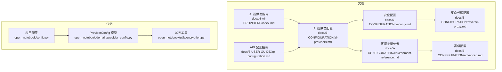
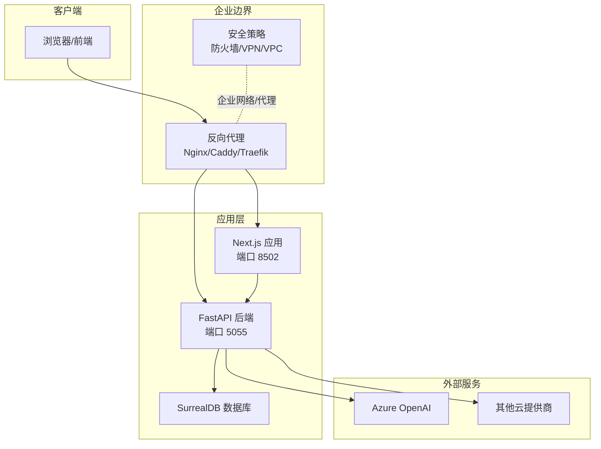
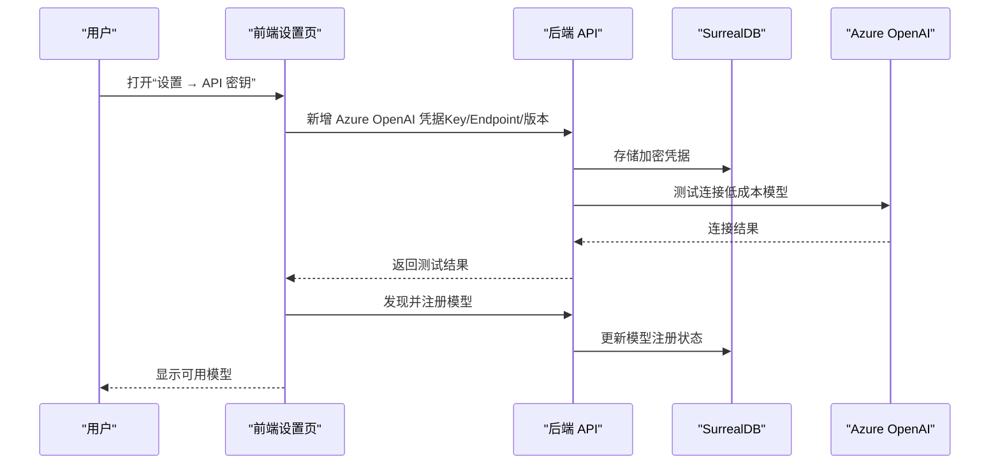
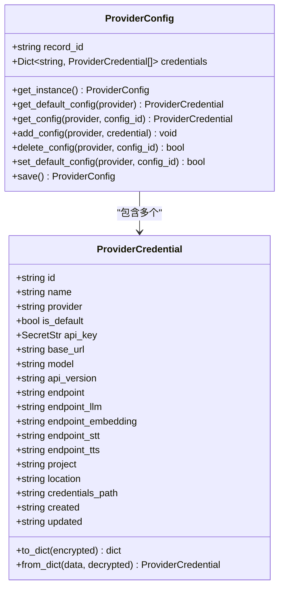
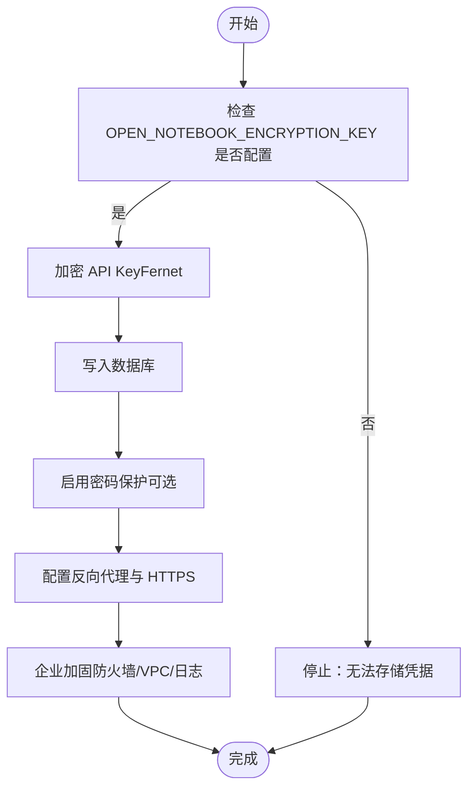
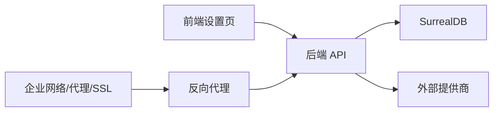

# 企业级提供商配置

<cite>
**本文档引用的文件**
- [docs/4-AI-PROVIDERS/index.md](file://docs/4-AI-PROVIDERS/index.md)
- [docs/5-CONFIGURATION/ai-providers.md](file://docs/5-CONFIGURATION/ai-providers.md)
- [docs/5-CONFIGURATION/security.md](file://docs/5-CONFIGURATION/security.md)
- [docs/5-CONFIGURATION/environment-reference.md](file://docs/5-CONFIGURATION/environment-reference.md)
- [docs/5-CONFIGURATION/reverse-proxy.md](file://docs/5-CONFIGURATION/reverse-proxy.md)
- [docs/5-CONFIGURATION/advanced.md](file://docs/5-CONFIGURATION/advanced.md)
- [docs/3-USER-GUIDE/api-configuration.md](file://docs/3-USER-GUIDE/api-configuration.md)
- [open_notebook/domain/provider_config.py](file://open_notebook/domain/provider_config.py)
- [open_notebook/utils/encryption.py](file://open_notebook/utils/encryption.py)
- [open_notebook/config.py](file://open_notebook/config.py)
</cite>

## 目录
1. [简介](#简介)
2. [项目结构](#项目结构)
3. [核心组件](#核心组件)
4. [架构总览](#架构总览)
5. [详细组件分析](#详细组件分析)
6. [依赖关系分析](#依赖关系分析)
7. [性能考量](#性能考量)
8. [故障排查指南](#故障排查指南)
9. [结论](#结论)
10. [附录](#附录)

## 简介
本文件面向企业用户，系统化阐述如何在 Open Notebook 中完成企业级 AI 提供商（以 Azure OpenAI 为代表）的配置与落地，覆盖安全加密、合规（HIPAA、SOC2）、网络架构（VPC 集成、代理）、企业认证、高可用与灾备、以及监控审计等关键主题。文档基于仓库现有配置与实现，结合前端与后端能力，给出可操作的步骤与最佳实践。

## 项目结构
围绕企业级配置的关键目录与文件包括：
- 文档层：AI 提供商选择与配置、安全与密钥管理、环境变量参考、反向代理与高级配置
- 代码层：凭证模型与加密工具、数据目录与缓存路径

**图表来源**
- [docs/4-AI-PROVIDERS/index.md](file://docs/4-AI-PROVIDERS/index.md#L1-L200)
- [docs/5-CONFIGURATION/ai-providers.md](file://docs/5-CONFIGURATION/ai-providers.md#L372-L433)
- [docs/5-CONFIGURATION/security.md](file://docs/5-CONFIGURATION/security.md#L1-L397)
- [docs/5-CONFIGURATION/environment-reference.md](file://docs/5-CONFIGURATION/environment-reference.md#L1-L275)
- [docs/5-CONFIGURATION/reverse-proxy.md](file://docs/5-CONFIGURATION/reverse-proxy.md#L1-L800)
- [docs/5-CONFIGURATION/advanced.md](file://docs/5-CONFIGURATION/advanced.md#L1-L545)
- [docs/3-USER-GUIDE/api-configuration.md](file://docs/3-USER-GUIDE/api-configuration.md#L1-L391)
- [open_notebook/domain/provider_config.py](file://open_notebook/domain/provider_config.py#L1-L445)
- [open_notebook/utils/encryption.py](file://open_notebook/utils/encryption.py#L1-L199)
- [open_notebook/config.py](file://open_notebook/config.py#L1-L18)

**章节来源**
- [docs/4-AI-PROVIDERS/index.md](file://docs/4-AI-PROVIDERS/index.md#L79-L126)
- [docs/5-CONFIGURATION/ai-providers.md](file://docs/5-CONFIGURATION/ai-providers.md#L372-L433)
- [docs/5-CONFIGURATION/security.md](file://docs/5-CONFIGURATION/security.md#L1-L397)
- [docs/5-CONFIGURATION/environment-reference.md](file://docs/5-CONFIGURATION/environment-reference.md#L1-L275)
- [docs/5-CONFIGURATION/reverse-proxy.md](file://docs/5-CONFIGURATION/reverse-proxy.md#L1-L800)
- [docs/5-CONFIGURATION/advanced.md](file://docs/5-CONFIGURATION/advanced.md#L1-L545)
- [docs/3-USER-GUIDE/api-configuration.md](file://docs/3-USER-GUIDE/api-configuration.md#L1-L391)
- [open_notebook/domain/provider_config.py](file://open_notebook/domain/provider_config.py#L1-L445)
- [open_notebook/utils/encryption.py](file://open_notebook/utils/encryption.py#L1-L199)
- [open_notebook/config.py](file://open_notebook/config.py#L1-L18)

## 核心组件
- 凭证与多提供商配置：通过 ProviderConfig 支持为同一提供商维护多个凭据，并支持默认凭据切换；凭据字段覆盖 API Key、Endpoint、API Version、服务级 Endpoint（LLM/Embedding/STT/TTS）等。
- 加密存储：使用 Fernet 对数据库中的 API Key 进行对称加密（AES-128-CBC + HMAC-SHA256），OPEN_NOTEBOOK_ENCRYPTION_KEY 为必填项。
- 前端设置界面：通过 Settings → API Keys 完成凭据添加、测试连接、发现与注册模型。
- 反向代理与 HTTPS：统一暴露前端端口，后端 API 由 Next.js 内部代理转发，支持 Nginx/Caddy/Traefik 的完整示例与超时配置。
- 环境变量与企业网络：HTTP_PROXY/HTTPS_PROXY/NO_PROXY 支持企业代理；SSL 自定义证书与禁用校验仅限开发场景。

**章节来源**
- [open_notebook/domain/provider_config.py](file://open_notebook/domain/provider_config.py#L22-L173)
- [open_notebook/domain/provider_config.py](file://open_notebook/domain/provider_config.py#L175-L445)
- [open_notebook/utils/encryption.py](file://open_notebook/utils/encryption.py#L1-L199)
- [docs/3-USER-GUIDE/api-configuration.md](file://docs/3-USER-GUIDE/api-configuration.md#L21-L68)
- [docs/5-CONFIGURATION/reverse-proxy.md](file://docs/5-CONFIGURATION/reverse-proxy.md#L7-L21)
- [docs/5-CONFIGURATION/environment-reference.md](file://docs/5-CONFIGURATION/environment-reference.md#L85-L116)

## 架构总览
下图展示企业级部署中，前端、反向代理、后端 API、数据库与外部 AI 提供商之间的交互关系，以及 Azure OpenAI 的特殊集成点。

**图表来源**
- [docs/5-CONFIGURATION/reverse-proxy.md](file://docs/5-CONFIGURATION/reverse-proxy.md#L11-L21)
- [docs/5-CONFIGURATION/environment-reference.md](file://docs/5-CONFIGURATION/environment-reference.md#L85-L116)
- [docs/5-CONFIGURATION/advanced.md](file://docs/5-CONFIGURATION/advanced.md#L176-L193)

## 详细组件分析

### Azure OpenAI 企业配置
- 必填字段：API Key、Endpoint、API Version；可选配置服务级 Endpoint（LLM/Embedding/STT/TTS）。
- 优势：企业支持、VPC 集成、合规（HIPAA、SOC2）。
- 配置流程：在前端 Settings → API Keys 添加 Azure OpenAI 凭据，填写上述字段，保存后测试连接，再发现与注册模型。

**图表来源**
- [docs/5-CONFIGURATION/ai-providers.md](file://docs/5-CONFIGURATION/ai-providers.md#L378-L387)
- [docs/3-USER-GUIDE/api-configuration.md](file://docs/3-USER-GUIDE/api-configuration.md#L116-L187)
- [open_notebook/domain/provider_config.py](file://open_notebook/domain/provider_config.py#L411-L427)

**章节来源**
- [docs/4-AI-PROVIDERS/index.md](file://docs/4-AI-PROVIDERS/index.md#L79-L126)
- [docs/5-CONFIGURATION/ai-providers.md](file://docs/5-CONFIGURATION/ai-providers.md#L372-L433)
- [docs/3-USER-GUIDE/api-configuration.md](file://docs/3-USER-GUIDE/api-configuration.md#L209-L248)

### 凭证模型与加密存储
- ProviderCredential：封装单个提供商的完整配置（含服务级 Endpoint），支持默认标记与时间戳。
- ProviderConfig：按提供商分组管理多个凭据，支持默认凭据切换、删除保护、持久化到数据库。
- 加密机制：OPEN_NOTEBOOK_ENCRYPTION_KEY 用于派生 Fernet 密钥，API Key 在入库前加密，读取时解密。

**图表来源**
- [open_notebook/domain/provider_config.py](file://open_notebook/domain/provider_config.py#L22-L173)
- [open_notebook/domain/provider_config.py](file://open_notebook/domain/provider_config.py#L175-L445)

**章节来源**
- [open_notebook/domain/provider_config.py](file://open_notebook/domain/provider_config.py#L1-L445)
- [open_notebook/utils/encryption.py](file://open_notebook/utils/encryption.py#L1-L199)
- [docs/3-USER-GUIDE/api-configuration.md](file://docs/3-USER-GUIDE/api-configuration.md#L21-L68)

### 安全与合规（HIPAA、SOC2）
- 密钥加密：API Key 采用 Fernet 对称加密，OPEN_NOTEBOOK_ENCRYPTION_KEY 必须显式配置；变更或丢失密钥会导致已存凭据不可读。
- 访问控制：基础密码保护（Bearer Token），生产建议配合反向代理与 HTTPS；文档明确指出当前方案非企业级 RBAC/审计。
- 企业加固：Docker 安全选项、防火墙规则、反向代理与 SSL、网络隔离（Docker 网络/VPC）。

**图表来源**
- [docs/5-CONFIGURATION/security.md](file://docs/5-CONFIGURATION/security.md#L7-L104)
- [docs/5-CONFIGURATION/environment-reference.md](file://docs/5-CONFIGURATION/environment-reference.md#L7-L18)
- [open_notebook/utils/encryption.py](file://open_notebook/utils/encryption.py#L62-L101)

**章节来源**
- [docs/5-CONFIGURATION/security.md](file://docs/5-CONFIGURATION/security.md#L1-L397)
- [docs/5-CONFIGURATION/environment-reference.md](file://docs/5-CONFIGURATION/environment-reference.md#L7-L18)

### 网络架构与代理（企业内网/代理）
- 代理：HTTP_PROXY/HTTPS_PROXY/NO_PROXY 支持企业代理访问外部提供商与内容抽取服务。
- 反向代理：单一端口（8502）对外，内部由 Next.js 转发至 API（5055）；提供 Nginx/Caddy/Traefik 完整示例与超时配置。
- SSL：Let’s Encrypt/Caddy 自动证书或自签证书；需确保 API_URL 使用 https。

**章节来源**
- [docs/5-CONFIGURATION/environment-reference.md](file://docs/5-CONFIGURATION/environment-reference.md#L85-L116)
- [docs/5-CONFIGURATION/reverse-proxy.md](file://docs/5-CONFIGURATION/reverse-proxy.md#L1-L800)

### 企业认证系统集成
- 基础认证：前端登录表单 + Bearer Token；适合公开云/共享网络环境。
- 企业扩展：文档建议通过 OAuth2/SAML 代理、自定义中间件实现 RBAC、审计日志、速率限制、数据静态加密等。

**章节来源**
- [docs/5-CONFIGURATION/security.md](file://docs/5-CONFIGURATION/security.md#L139-L327)

### 高可用与灾备
- 多实例与负载均衡：反向代理层实现多实例横向扩展。
- 数据备份：应用数据与 SurrealDB 数据目录，提供快速备份与恢复脚本。
- 灾难恢复：迁移脚本支持跨服务器迁移，建议配合版本控制与密钥分离备份。

**章节来源**
- [docs/5-CONFIGURATION/advanced.md](file://docs/5-CONFIGURATION/advanced.md#L400-L478)

### 监控、日志与审计
- 日志：RUST_LOG/LOGLEVEL 控制组件日志级别；LangSmith Tracing 可选开启。
- 监控：容器资源使用（docker stats）、健康检查端点（/health）。
- 审计：当前方案无内置审计日志，建议通过日志聚合服务实现企业级审计。

**章节来源**
- [docs/5-CONFIGURATION/advanced.md](file://docs/5-CONFIGURATION/advanced.md#L81-L116)
- [docs/5-CONFIGURATION/security.md](file://docs/5-CONFIGURATION/security.md#L291-L327)

## 依赖关系分析
- 前端设置页依赖后端 API 完成凭据保存、测试与模型注册。
- 后端 API 依赖数据库存储加密后的凭据，并在调用外部提供商时使用对应凭据。
- 反向代理依赖正确的 API_URL 与超时配置，避免长任务中断。
- 企业网络通过代理与 SSL 配置影响外部可达性与安全性。

**图表来源**
- [docs/5-CONFIGURATION/reverse-proxy.md](file://docs/5-CONFIGURATION/reverse-proxy.md#L11-L21)
- [docs/5-CONFIGURATION/environment-reference.md](file://docs/5-CONFIGURATION/environment-reference.md#L85-L116)
- [open_notebook/domain/provider_config.py](file://open_notebook/domain/provider_config.py#L411-L427)

**章节来源**
- [docs/5-CONFIGURATION/reverse-proxy.md](file://docs/5-CONFIGURATION/reverse-proxy.md#L1-L800)
- [docs/5-CONFIGURATION/environment-reference.md](file://docs/5-CONFIGURATION/environment-reference.md#L85-L116)
- [open_notebook/domain/provider_config.py](file://open_notebook/domain/provider_config.py#L1-L445)

## 性能考量
- 并发与重试：SURREAL_COMMANDS_MAX_TASKS、RETRY 策略与等待时间，平衡吞吐与冲突。
- 超时：API_CLIENT_TIMEOUT 与 ESPERANTO_LLM_TIMEOUT，确保长任务不被代理或应用层过早中断。
- 批处理：TTS_BATCH_SIZE 控制并发请求，不同提供商推荐值不同。
- SSL：自定义 CA Bundle 或禁用校验仅限开发场景。

**章节来源**
- [docs/5-CONFIGURATION/advanced.md](file://docs/5-CONFIGURATION/advanced.md#L7-L78)
- [docs/5-CONFIGURATION/advanced.md](file://docs/5-CONFIGURATION/advanced.md#L176-L193)

## 故障排查指南
- 凭据问题：检查 OPEN_NOTEBOOK_ENCRYPTION_KEY 是否配置；测试连接失败时核对 Key 格式与权限。
- 反向代理问题：确认 API_URL、WebSocket 升级、超时设置与错误响应 CORS 头。
- 企业网络问题：验证代理配置、NO_PROXY 白名单与防火墙放通。
- 安全问题：确认 HTTPS、强密码、Docker 安全选项与最小暴露面。

**章节来源**
- [docs/3-USER-GUIDE/api-configuration.md](file://docs/3-USER-GUIDE/api-configuration.md#L324-L357)
- [docs/5-CONFIGURATION/reverse-proxy.md](file://docs/5-CONFIGURATION/reverse-proxy.md#L502-L640)
- [docs/5-CONFIGURATION/security.md](file://docs/5-CONFIGURATION/security.md#L330-L378)

## 结论
通过 Settings → API Keys 的凭证体系与加密存储，Open Notebook 已具备企业级提供商接入的基础能力。Azure OpenAI 的配置强调 Endpoint、API Version 与服务级 Endpoint 的正确性。结合反向代理、企业代理、SSL 与安全加固，可在企业环境中实现合规、安全与可运维的部署。对于更高级的企业需求（RBAC、审计、速率限制），建议通过反向代理与日志聚合进行扩展。

## 附录
- 关键环境变量速查：OPEN_NOTEBOOK_ENCRYPTION_KEY、OPEN_NOTEBOOK_PASSWORD、API_URL、HTTP_PROXY/HTTPS_PROXY/NO_PROXY、ESPERANTO_SSL_VERIFY/CA_BUNDLE、API_CLIENT_TIMEOUT、ESPERANTO_LLM_TIMEOUT、SURREAL_COMMANDS_MAX_TASKS、TTS_BATCH_SIZE。
- 数据目录：应用数据与上传、检查点、缓存等位于数据目录，SurrealDB 数据文件独立存放。

**章节来源**
- [docs/5-CONFIGURATION/environment-reference.md](file://docs/5-CONFIGURATION/environment-reference.md#L1-L275)
- [open_notebook/config.py](file://open_notebook/config.py#L1-L18)