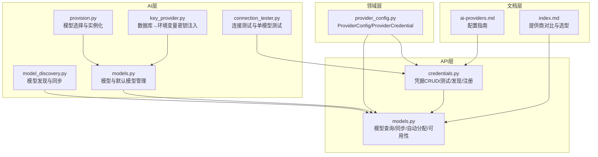
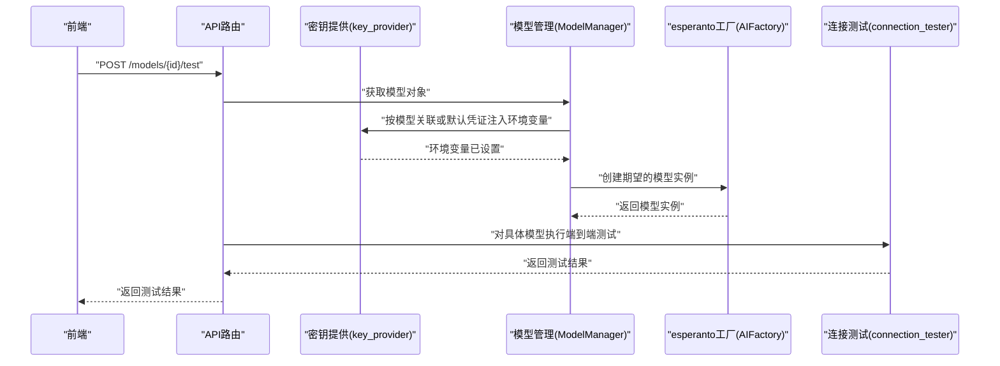
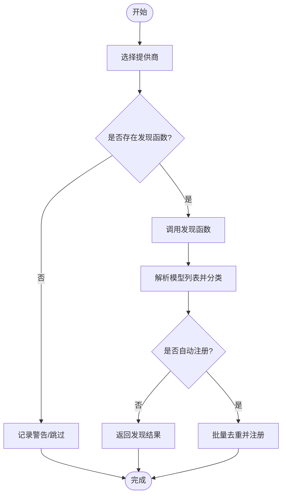
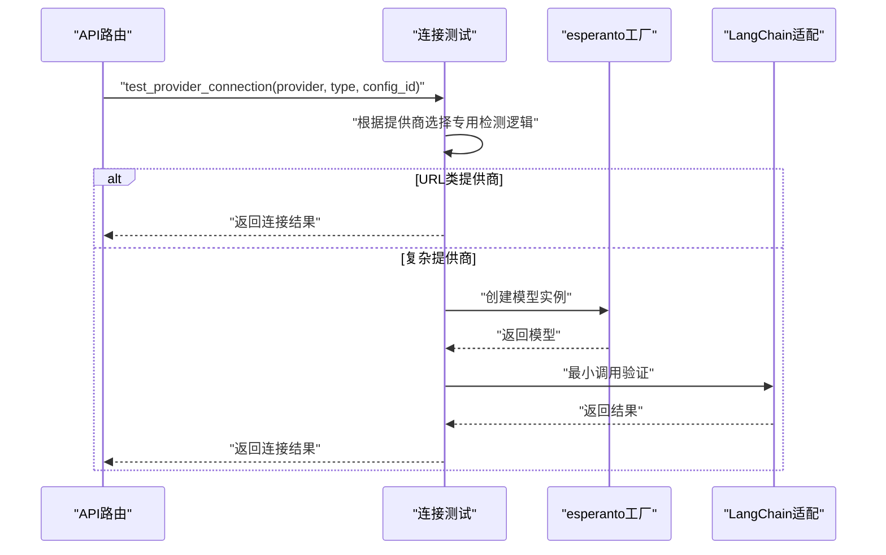
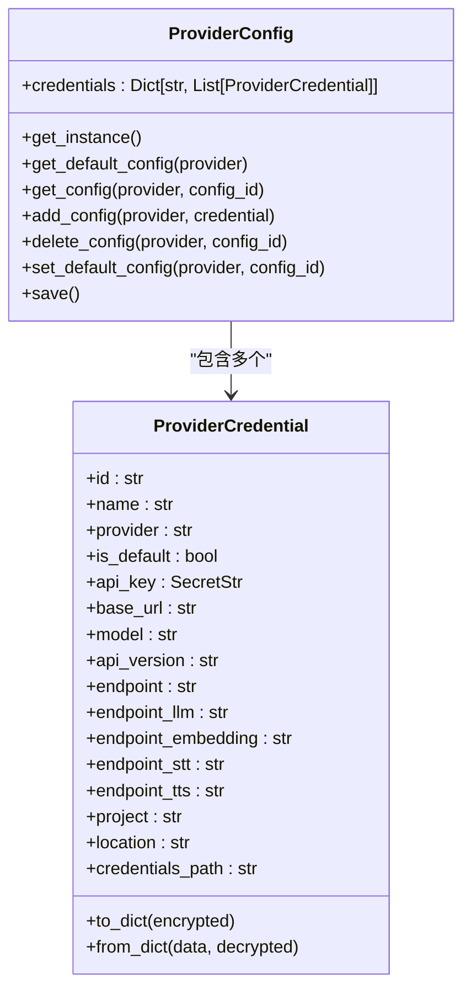
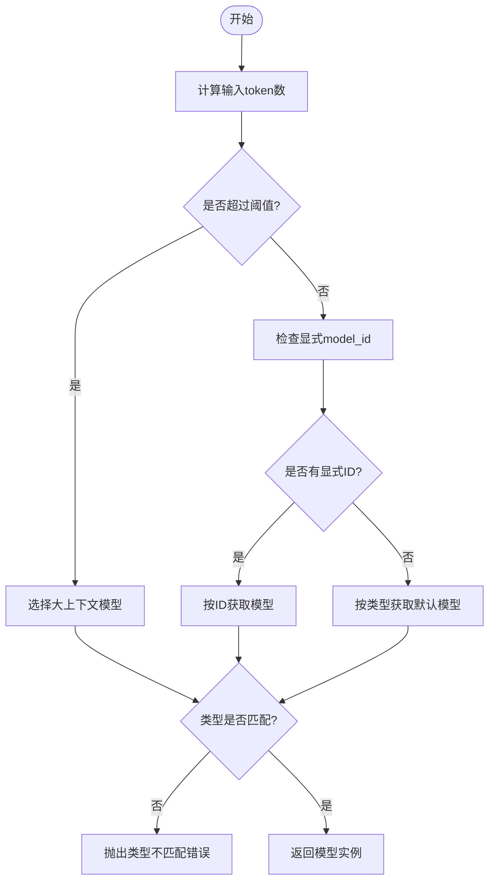
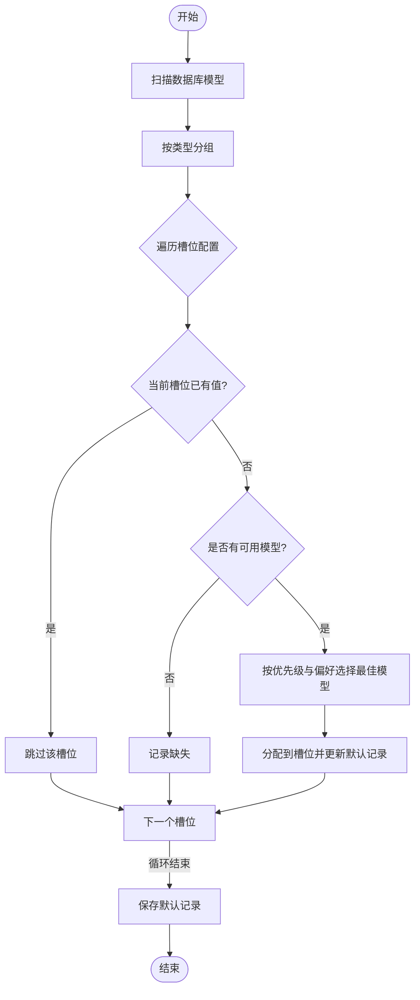
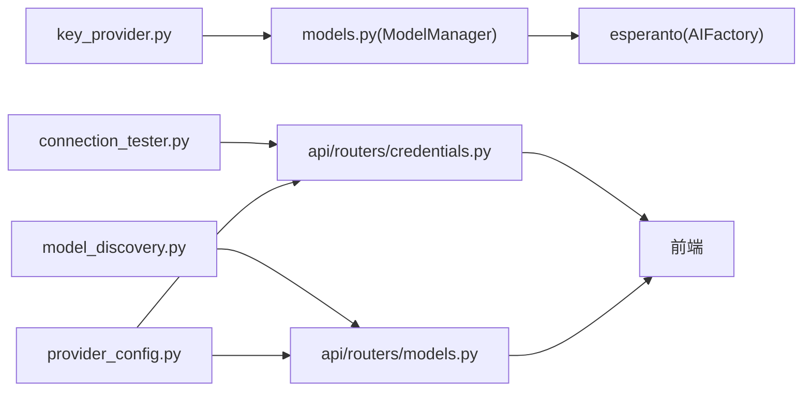

# 提供商管理与切换

<cite>
**本文档引用的文件**
- [provision.py](file://open_notebook/ai/provision.py)
- [model_discovery.py](file://open_notebook/ai/model_discovery.py)
- [connection_tester.py](file://open_notebook/ai/connection_tester.py)
- [key_provider.py](file://open_notebook/ai/key_provider.py)
- [provider_config.py](file://open_notebook/domain/provider_config.py)
- [models.py](file://open_notebook/ai/models.py)
- [credentials.py](file://api/routers/credentials.py)
- [models.py](file://api/routers/models.py)
- [ai-providers.md](file://docs/5-CONFIGURATION/ai-providers.md)
- [index.md](file://docs/4-AI-PROVIDERS/index.md)
- [token_utils.py](file://open_notebook/utils/token_utils.py)
</cite>

## 目录
1. [简介](#简介)
2. [项目结构](#项目结构)
3. [核心组件](#核心组件)
4. [架构总览](#架构总览)
5. [详细组件分析](#详细组件分析)
6. [依赖关系分析](#依赖关系分析)
7. [性能考虑](#性能考虑)
8. [故障排除指南](#故障排除指南)
9. [结论](#结论)
10. [附录](#附录)

## 简介
本文件面向需要在多个AI提供商之间进行灵活切换与管理的用户与开发者，系统性阐述Open Notebook中的提供商管理体系：包括模型发现机制、连接测试流程、健康检查方法、提供商优先级与自动分配策略、负载均衡与故障转移思路、多提供商并行使用配置、性能监控与成本分析建议，以及动态提供商切换与A/B测试的实现方案。文档以代码为依据，辅以可视化图示，帮助读者快速理解并正确配置与使用。

## 项目结构
围绕“提供商管理与切换”的核心代码主要分布在以下模块：
- AI层：模型发现、连接测试、密钥提供、模型管理
- 领域层：提供者配置（支持多凭证）
- API层：HTTP路由与前端交互接口
- 文档层：配置与选型指南

图表来源
- [provision.py](file://open_notebook/ai/provision.py#L9-L61)
- [model_discovery.py](file://open_notebook/ai/model_discovery.py#L608-L725)
- [connection_tester.py](file://open_notebook/ai/connection_tester.py#L170-L300)
- [key_provider.py](file://open_notebook/ai/key_provider.py#L236-L298)
- [models.py](file://open_notebook/ai/models.py#L97-L267)
- [provider_config.py](file://open_notebook/domain/provider_config.py#L175-L445)
- [credentials.py](file://api/routers/credentials.py#L94-L387)
- [models.py](file://api/routers/models.py#L165-L771)
- [ai-providers.md](file://docs/5-CONFIGURATION/ai-providers.md#L1-L468)
- [index.md](file://docs/4-AI-PROVIDERS/index.md#L1-L200)

章节来源
- [provision.py](file://open_notebook/ai/provision.py#L1-L61)
- [model_discovery.py](file://open_notebook/ai/model_discovery.py#L1-L757)
- [connection_tester.py](file://open_notebook/ai/connection_tester.py#L1-L439)
- [key_provider.py](file://open_notebook/ai/key_provider.py#L1-L298)
- [provider_config.py](file://open_notebook/domain/provider_config.py#L1-L445)
- [models.py](file://open_notebook/ai/models.py#L1-L267)
- [credentials.py](file://api/routers/credentials.py#L1-L387)
- [models.py](file://api/routers/models.py#L1-L771)
- [ai-providers.md](file://docs/5-CONFIGURATION/ai-providers.md#L1-L468)
- [index.md](file://docs/4-AI-PROVIDERS/index.md#L1-L200)

## 核心组件
- 模型发现与同步：按提供商自动拉取可用模型清单，并可批量注册到数据库，支持并发同步所有提供商。
- 连接测试：针对提供商API密钥有效性进行最小调用验证；支持特定模型端到端测试。
- 密钥提供：从数据库Credential记录中读取并注入环境变量，支持复杂提供商（Azure/Vertex/OpenAI-Compatible）的多字段配置。
- 模型管理：根据内容长度、显式指定或默认类型选择合适的模型实例；支持大上下文模型自动切换。
- 多凭证配置：每个提供商可维护多个凭证，支持默认凭证与按需切换。
- 自动分配与优先级：基于提供商优先级与模型偏好，自动为默认槽位分配可用模型。

章节来源
- [model_discovery.py](file://open_notebook/ai/model_discovery.py#L608-L725)
- [connection_tester.py](file://open_notebook/ai/connection_tester.py#L170-L300)
- [key_provider.py](file://open_notebook/ai/key_provider.py#L236-L298)
- [provision.py](file://open_notebook/ai/provision.py#L9-L61)
- [provider_config.py](file://open_notebook/domain/provider_config.py#L175-L445)
- [models.py](file://api/routers/models.py#L678-L771)

## 架构总览
下图展示了从HTTP请求到AI模型实例化的完整链路，包括密钥注入、模型选择与测试等关键环节。

图表来源
- [models.py](file://api/routers/models.py#L266-L287)
- [models.py](file://open_notebook/ai/models.py#L101-L176)
- [key_provider.py](file://open_notebook/ai/key_provider.py#L236-L298)
- [connection_tester.py](file://open_notebook/ai/connection_tester.py#L367-L439)

## 详细组件分析

### 模型发现与同步
- 发现机制：按提供商映射调用对应发现函数，自动分类模型类型（语言/嵌入/TTS/STT），并支持静态列表（如Anthropic）与API枚举（如OpenAI/Gemini/Ollama等）。
- 同步策略：并发调用所有提供商的发现函数，批量去重注册，避免重复写入；支持仅发现不入库的场景。
- 计数查询：按提供商分组统计各类型模型数量，便于UI展示与健康检查。

图表来源
- [model_discovery.py](file://open_notebook/ai/model_discovery.py#L608-L725)

章节来源
- [model_discovery.py](file://open_notebook/ai/model_discovery.py#L173-L204)
- [model_discovery.py](file://open_notebook/ai/model_discovery.py#L269-L299)
- [model_discovery.py](file://open_notebook/ai/model_discovery.py#L589-L605)
- [model_discovery.py](file://open_notebook/ai/model_discovery.py#L632-L697)
- [model_discovery.py](file://open_notebook/ai/model_discovery.py#L699-L725)
- [model_discovery.py](file://open_notebook/ai/model_discovery.py#L727-L757)

### 连接测试与健康检查
- 提供商连接测试：对简单提供商使用最小API调用验证；对URL类（Ollama/OpenAI-Compatible）与复杂提供商（Azure/Vertex）采用专用检测逻辑。
- 单模型测试：对具体模型执行端到端调用（语言/嵌入/TTS/STT），返回响应摘要或维度信息，便于快速验证。
- 健康检查：通过“可用性”接口汇总各提供商的凭证状态与能力矩阵，结合esperanto可用提供者集合判断支持的模型类型。

图表来源
- [connection_tester.py](file://open_notebook/ai/connection_tester.py#L170-L300)
- [connection_tester.py](file://open_notebook/ai/connection_tester.py#L367-L439)

章节来源
- [connection_tester.py](file://open_notebook/ai/connection_tester.py#L170-L300)
- [connection_tester.py](file://open_notebook/ai/connection_tester.py#L367-L439)
- [models.py](file://api/routers/models.py#L361-L474)

### 密钥提供与凭证管理
- 数据库优先：优先从Credential记录读取API密钥与基础URL等配置，注入到对应环境变量，确保esperanto工厂能正确初始化。
- 复杂提供商：对Azure/Vertex/OpenAI-Compatible分别处理多字段配置，避免单一环境变量带来的歧义。
- 凭证模型：ProviderConfig支持同一提供商的多个凭证，可设置默认凭证；ProviderCredential包含名称、提供商、密钥、基础URL、端点、模型等字段。

图表来源
- [provider_config.py](file://open_notebook/domain/provider_config.py#L175-L445)

章节来源
- [key_provider.py](file://open_notebook/ai/key_provider.py#L236-L298)
- [key_provider.py](file://open_notebook/ai/key_provider.py#L68-L103)
- [provider_config.py](file://open_notebook/domain/provider_config.py#L175-L445)

### 模型选择与默认模型管理
- 内容驱动选择：根据输入内容的token数阈值（例如超过105,000）自动切换到“大上下文模型”，否则按显式model_id或默认类型选择。
- 类型校验：确保返回的模型实例符合期望类型（语言/嵌入/TTS/STT），否则抛出错误提示。
- 默认模型：通过DefaultModels记录管理各类默认槽位（聊天、转换、工具、嵌入、语音等），ModelManager负责按类型获取默认模型。

图表来源
- [provision.py](file://open_notebook/ai/provision.py#L18-L60)
- [models.py](file://open_notebook/ai/models.py#L220-L264)

章节来源
- [provision.py](file://open_notebook/ai/provision.py#L9-L61)
- [models.py](file://open_notebook/ai/models.py#L97-L267)

### 自动分配与提供商优先级
- 优先级策略：定义提供商优先级列表（如OpenAI、Anthropic、Google、Mistral、Groq、DeepSeek、xAI、OpenRouter、Ollama、Azure、OpenAI-Compatible），优先选择高优先级提供商的可用模型。
- 模型偏好：在同提供商内按偏好列表（如OpenAI的gpt-4o/gpt-4/gpt-3.5-turbo）进一步筛选。
- 自动分配：扫描数据库中所有模型，按类型分组，依次为每个默认槽位分配最佳可用模型，返回已分配、跳过与缺失列表。

图表来源
- [models.py](file://api/routers/models.py#L678-L771)

章节来源
- [models.py](file://api/routers/models.py#L86-L109)
- [models.py](file://api/routers/models.py#L678-L771)

### 多提供商并行使用与最佳实践
- 并行发现与同步：API层提供“同步所有提供商”的端点，内部并发调用各提供商发现函数，提升初始建模效率。
- 多凭证并存：同一提供商可配置多个凭证，用于区分环境（开发/生产）、团队成员或不同用途；通过默认凭证与按需切换实现灵活管理。
- 最佳实践：
  - 使用“自动分配默认模型”功能，结合提供商优先级与模型偏好，减少手动配置。
  - 定期执行“同步所有提供商”，保持模型清单最新。
  - 对于本地/私有部署（Ollama/LM Studio），通过OpenAI-Compatible模式统一接入。

章节来源
- [models.py](file://api/routers/models.py#L539-L575)
- [provider_config.py](file://open_notebook/domain/provider_config.py#L326-L410)
- [ai-providers.md](file://docs/5-CONFIGURATION/ai-providers.md#L356-L370)

### 动态提供商切换与A/B测试
- 切换方式：
  - 通过前端或API修改默认模型槽位，实现“动态切换”到另一个提供商的模型。
  - 在同一请求中传入显式model_id，绕过默认模型选择，实现临时切换。
- A/B测试思路：
  - 将同一任务拆分为两个分支，分别使用不同提供商的默认模型或显式模型ID。
  - 收集响应质量、延迟、成本等指标，评估提供商差异。
  - 可结合“单模型测试”接口验证不同模型的端到端可用性。

章节来源
- [provision.py](file://open_notebook/ai/provision.py#L28-L33)
- [models.py](file://api/routers/models.py#L266-L287)

## 依赖关系分析
- 模块耦合：
  - ModelManager依赖Credential与KeyProvider，确保模型创建前密钥注入完成。
  - API路由依赖ModelManager与Discovery/Tester模块，提供对外服务。
  - ProviderConfig作为领域模型，被API路由与前端交互使用。
- 外部依赖：
  - esperanto工厂：统一创建各类型模型实例。
  - httpx：用于提供商API调用与发现。
  - loguru：统一日志输出。

图表来源
- [models.py](file://open_notebook/ai/models.py#L101-L176)
- [key_provider.py](file://open_notebook/ai/key_provider.py#L236-L298)
- [model_discovery.py](file://open_notebook/ai/model_discovery.py#L608-L725)
- [connection_tester.py](file://open_notebook/ai/connection_tester.py#L170-L300)
- [provider_config.py](file://open_notebook/domain/provider_config.py#L175-L445)
- [credentials.py](file://api/routers/credentials.py#L94-L387)
- [models.py](file://api/routers/models.py#L165-L771)

章节来源
- [models.py](file://open_notebook/ai/models.py#L1-L267)
- [key_provider.py](file://open_notebook/ai/key_provider.py#L1-L298)
- [model_discovery.py](file://open_notebook/ai/model_discovery.py#L1-L757)
- [connection_tester.py](file://open_notebook/ai/connection_tester.py#L1-L439)
- [provider_config.py](file://open_notebook/domain/provider_config.py#L1-L445)
- [credentials.py](file://api/routers/credentials.py#L1-L387)
- [models.py](file://api/routers/models.py#L1-L771)

## 性能考虑
- 并发优化：模型发现与同步采用异步并发，显著缩短初始建模时间。
- 缓存与去重：ModelManager通过esperanto工厂缓存模型实例；同步时批量查询现有模型，避免N+1查询。
- 资源控制：连接测试使用最小调用，避免昂贵的全量推理；对TTS/STT提供键格式验证，减少无效调用。
- 成本估算：内置token计数与成本计算工具，便于粗略估算使用成本。

章节来源
- [model_discovery.py](file://open_notebook/ai/model_discovery.py#L708-L725)
- [models.py](file://open_notebook/ai/models.py#L97-L100)
- [token_utils.py](file://open_notebook/utils/token_utils.py#L15-L47)

## 故障排除指南
- “无可用模型”：检查是否已完成“发现并注册模型”，确认提供商API密钥有效且网络可达。
- “模型类型不匹配”：确认默认模型或显式模型ID对应的类型与调用场景一致。
- “连接失败/超时”：检查提供商端点、API密钥、网络连通性；对Azure/Vertex/OpenAI-Compatible检查多字段配置。
- “速率限制/配额不足”：适当降低并发或等待配额恢复；必要时升级账户或更换提供商。
- “Ollama未运行/模型不存在”：确认Ollama服务状态与模型下载情况。

章节来源
- [provision.py](file://open_notebook/ai/provision.py#L37-L59)
- [connection_tester.py](file://open_notebook/ai/connection_tester.py#L275-L300)
- [ai-providers.md](file://docs/5-CONFIGURATION/ai-providers.md#L450-L468)

## 结论
Open Notebook通过“凭证驱动+模型发现+连接测试+默认模型管理”的体系，实现了对多提供商的灵活管理与切换。借助并发发现、自动分配与类型校验，系统在保证稳定性的同时提升了易用性。配合文档提供的配置与选型指南，用户可以快速完成提供商迁移、并行使用与A/B测试，最终达成性能、成本与隐私的平衡。

## 附录
- 快速上手步骤（参考文档）：
  - 设置加密密钥后，在“设置→API密钥”中添加凭证并测试连接。
  - 发现并注册模型，然后在“设置→模型”中查看与自动分配默认模型。
  - 使用“单模型测试”验证端到端可用性。
- 相关文档：
  - [AI提供商配置指南](file://docs/5-CONFIGURATION/ai-providers.md#L1-L468)
  - [提供商对比与选型](file://docs/4-AI-PROVIDERS/index.md#L1-L200)