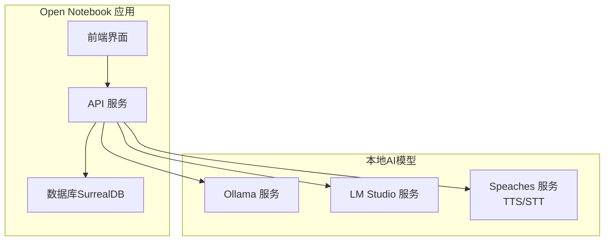
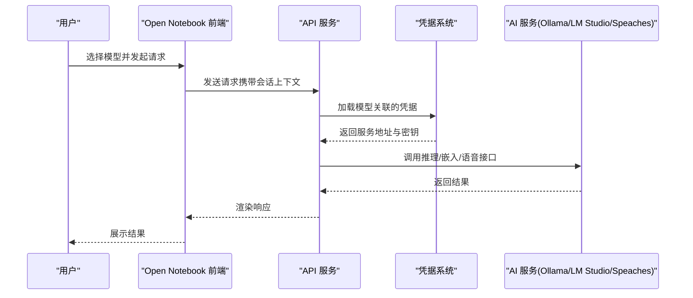
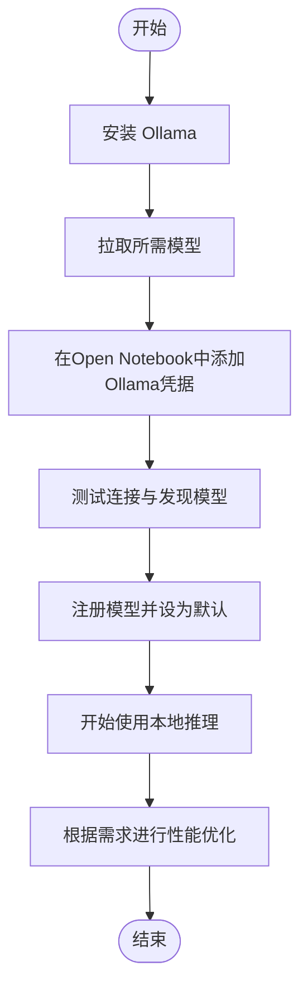
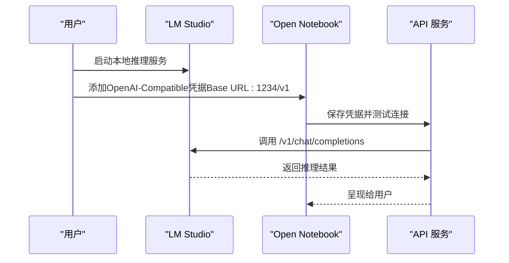
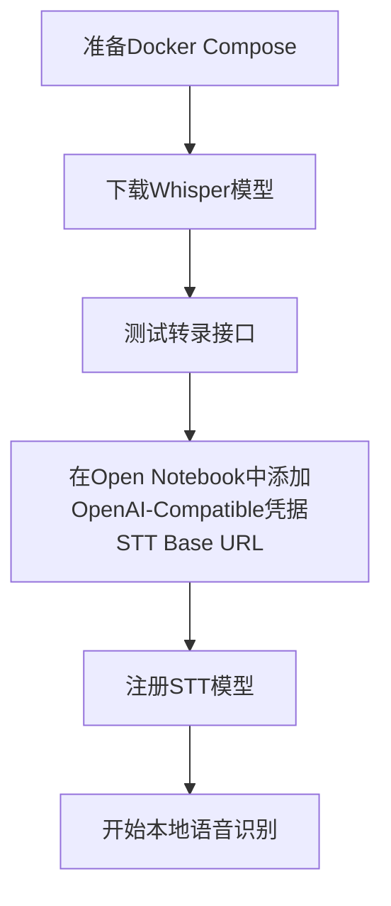
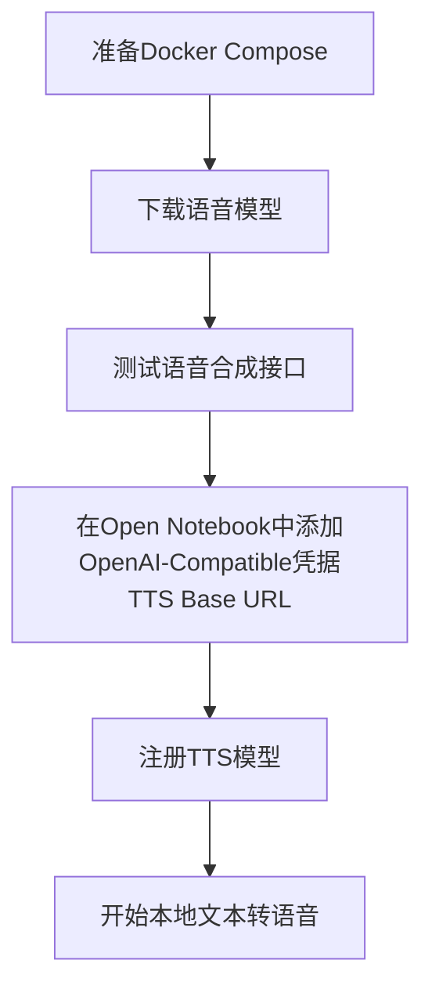
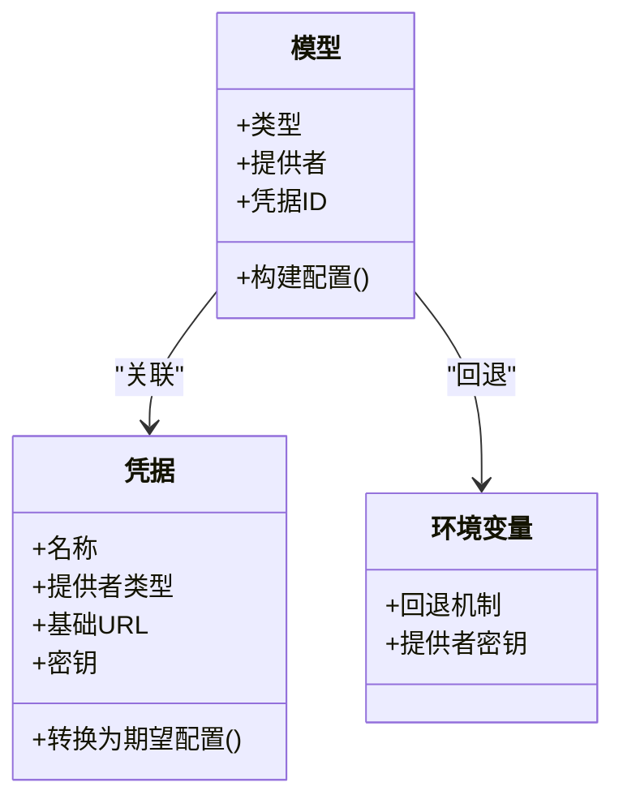

# 本地AI模型配置

<cite>
**本文档引用的文件**
- [docs/5-CONFIGURATION/ollama.md](file://docs/5-CONFIGURATION/ollama.md)
- [docs/5-CONFIGURATION/openai-compatible.md](file://docs/5-CONFIGURATION/openai-compatible.md)
- [docs/5-CONFIGURATION/local-stt.md](file://docs/5-CONFIGURATION/local-stt.md)
- [docs/5-CONFIGURATION/local-tts.md](file://docs/5-CONFIGURATION/local-tts.md)
- [docs/5-CONFIGURATION/environment-reference.md](file://docs/5-CONFIGURATION/environment-reference.md)
- [docs/5-CONFIGURATION/advanced.md](file://docs/5-CONFIGURATION/advanced.md)
- [docs/5-CONFIGURATION/security.md](file://docs/5-CONFIGURATION/security.md)
- [docs/6-TROUBLESHOOTING/ai-chat-issues.md](file://docs/6-TROUBLESHOOTING/ai-chat-issues.md)
- [docs/6-TROUBLESHOOTING/faq.md](file://docs/6-TROUBLESHOOTING/faq.md)
- [examples/docker-compose-ollama.yml](file://examples/docker-compose-ollama.yml)
- [examples/docker-compose-speaches.yml](file://examples/docker-compose-speaches.yml)
- [open_notebook/ai/models.py](file://open_notebook/ai/models.py)
</cite>

## 目录
1. [简介](#简介)
2. [项目结构](#项目结构)
3. [核心组件](#核心组件)
4. [架构总览](#架构总览)
5. [详细组件分析](#详细组件分析)
6. [依赖关系分析](#依赖关系分析)
7. [性能考虑](#性能考虑)
8. [故障排除指南](#故障排除指南)
9. [结论](#结论)
10. [附录](#附录)

## 简介
本文件面向需要在本地部署与使用AI模型的用户，系统性介绍如何在Open Notebook中配置与使用Ollama与LM Studio两类本地AI模型，并覆盖本地语音识别（STT）与文本转语音（TTS）的完整设置流程。内容包括硬件要求、模型下载与运行步骤、网络配置、GPU加速、性能优化、隐私与离线使用最佳实践，以及常见问题排查。

## 项目结构
围绕本地AI模型配置，项目提供了多份官方文档与示例Compose文件，帮助用户快速完成从安装到运行的全流程：

- Ollama配置与网络：[docs/5-CONFIGURATION/ollama.md](file://docs/5-CONFIGURATION/ollama.md)
- LM Studio与OpenAI兼容服务器：[docs/5-CONFIGURATION/openai-compatible.md](file://docs/5-CONFIGURATION/openai-compatible.md)
- 本地STT（语音识别）：[docs/5-CONFIGURATION/local-stt.md](file://docs/5-CONFIGURATION/local-stt.md)
- 本地TTS（文本转语音）：[docs/5-CONFIGURATION/local-tts.md](file://docs/5-CONFIGURATION/local-tts.md)
- 环境变量参考：[docs/5-CONFIGURATION/environment-reference.md](file://docs/5-CONFIGURATION/environment-reference.md)
- 高级配置与性能调优：[docs/5-CONFIGURATION/advanced.md](file://docs/5-CONFIGURATION/advanced.md)
- 安全与密码保护：[docs/5-CONFIGURATION/security.md](file://docs/5-CONFIGURATION/security.md)
- 常见AI聊天问题：[docs/6-TROUBLESHOOTING/ai-chat-issues.md](file://docs/6-TROUBLESHOOTING/ai-chat-issues.md)
- 常见问题FAQ：[docs/6-TROUBLESHOOTING/faq.md](file://docs/6-TROUBLESHOOTING/faq.md)
- Ollama示例Compose：[examples/docker-compose-ollama.yml](file://examples/docker-compose-ollama.yml)
- Speaches示例Compose（含TTS/STT）：[examples/docker-compose-speaches.yml](file://examples/docker-compose-speaches.yml)
- 模型配置与凭据加载逻辑：[open_notebook/ai/models.py](file://open_notebook/ai/models.py)

图示来源
- [docs/5-CONFIGURATION/ollama.md](file://docs/5-CONFIGURATION/ollama.md#L1-L741)
- [docs/5-CONFIGURATION/openai-compatible.md](file://docs/5-CONFIGURATION/openai-compatible.md#L1-L343)
- [docs/5-CONFIGURATION/local-stt.md](file://docs/5-CONFIGURATION/local-stt.md#L1-L366)
- [docs/5-CONFIGURATION/local-tts.md](file://docs/5-CONFIGURATION/local-tts.md#L1-L345)
- [examples/docker-compose-ollama.yml](file://examples/docker-compose-ollama.yml#L1-L64)
- [examples/docker-compose-speaches.yml](file://examples/docker-compose-speaches.yml#L1-L126)

章节来源
- [docs/5-CONFIGURATION/ollama.md](file://docs/5-CONFIGURATION/ollama.md#L1-L741)
- [docs/5-CONFIGURATION/openai-compatible.md](file://docs/5-CONFIGURATION/openai-compatible.md#L1-L343)
- [docs/5-CONFIGURATION/local-stt.md](file://docs/5-CONFIGURATION/local-stt.md#L1-L366)
- [docs/5-CONFIGURATION/local-tts.md](file://docs/5-CONFIGURATION/local-tts.md#L1-L345)
- [examples/docker-compose-ollama.yml](file://examples/docker-compose-ollama.yml#L1-L64)
- [examples/docker-compose-speaches.yml](file://examples/docker-compose-speaches.yml#L1-L126)

## 核心组件
- Ollama：开源本地推理引擎，支持多种开源模型，适合隐私与离线场景。
- LM Studio：桌面端本地推理GUI，便于非技术用户使用。
- Speaches：OpenAI兼容的本地TTS/STT服务，支持Whisper与语音合成。
- Open Notebook：统一的前端与后端服务，负责模型选择、凭据管理、任务调度与数据存储。

章节来源
- [docs/5-CONFIGURATION/ollama.md](file://docs/5-CONFIGURATION/ollama.md#L1-L741)
- [docs/5-CONFIGURATION/openai-compatible.md](file://docs/5-CONFIGURATION/openai-compatible.md#L1-L343)
- [docs/5-CONFIGURATION/local-stt.md](file://docs/5-CONFIGURATION/local-stt.md#L1-L366)
- [docs/5-CONFIGURATION/local-tts.md](file://docs/5-CONFIGURATION/local-tts.md#L1-L345)

## 架构总览
Open Notebook通过“凭据-模型-服务”的三层结构实现对本地与云端AI提供商的统一接入。模型配置时可选择提供者类型（如openai_compatible），并在凭据中指定具体的服务地址与密钥；若未配置凭据，则回退到环境变量方式。

图示来源
- [open_notebook/ai/models.py](file://open_notebook/ai/models.py#L112-L145)
- [docs/5-CONFIGURATION/environment-reference.md](file://docs/5-CONFIGURATION/environment-reference.md#L1-L275)

章节来源
- [open_notebook/ai/models.py](file://open_notebook/ai/models.py#L112-L145)
- [docs/5-CONFIGURATION/environment-reference.md](file://docs/5-CONFIGURATION/environment-reference.md#L1-L275)

## 详细组件分析

### Ollama 本地模型配置
- 安装与启动：支持Linux/macOS/Windows安装方式，或通过Docker运行。
- 模型推荐：提供语言模型与嵌入模型的推荐清单，便于按需选择。
- 硬件要求：给出最小与推荐配置，包含内存、存储与GPU建议。
- GPU加速：NVIDIA（CUDA）、Apple Silicon（Metal）与AMD（ROCm）平台的加速说明。
- 网络配置：针对不同部署场景（同机、容器内宿主机、同一Compose、远程、自定义端口）提供正确的Base URL。
- 故障排除：模型名称必须与`ollama list`完全一致；外部连接需开启`OLLAMA_HOST=0.0.0.0:11434`；Docker网络解析问题可通过`extra_hosts`解决。
- 性能优化：模型预热、并发与队列参数、资源限制与系统级优化。
- SSL与自签名证书：通过自定义CA或禁用校验（开发用途）处理反向代理带来的证书问题。
- 自定义模型导入：基于Modelfile创建定制模型并在Open Notebook中注册使用。

图示来源
- [docs/5-CONFIGURATION/ollama.md](file://docs/5-CONFIGURATION/ollama.md#L1-L741)

章节来源
- [docs/5-CONFIGURATION/ollama.md](file://docs/5-CONFIGURATION/ollama.md#L1-L741)

### LM Studio 本地模型配置
- 安装与启动：下载LM Studio，从应用库下载模型并启动本地服务（默认端口1234）。
- 在Open Notebook中配置：通过“OpenAI-Compatible”凭据添加，Base URL使用`http://host.docker.internal:1234/v1`（Docker）或`http://localhost:1234/v1`（本地）。
- 模型名称：需与LM Studio实际可用模型名称一致。
- 网络配置：Docker环境下使用`host.docker.internal`；Linux可采用桥接IP或host网络模式。
- 兼容性：LM Studio作为OpenAI兼容服务，可在同一凭据下配置LLM、Embedding、TTS、STT等不同服务端点。

图示来源
- [docs/5-CONFIGURATION/openai-compatible.md](file://docs/5-CONFIGURATION/openai-compatible.md#L34-L66)

章节来源
- [docs/5-CONFIGURATION/openai-compatible.md](file://docs/5-CONFIGURATION/openai-compatible.md#L1-L343)

### 本地STT（语音识别）配置
- 服务选择：推荐Speaches（OpenAI兼容），支持faster-whisper模型族。
- 快速开始：Docker Compose部署，下载Whisper模型，测试转录接口。
- 模型选择：根据速度与准确度平衡选择不同大小的Whisper模型。
- GPU加速：使用CUDA镜像并在容器中启用GPU设备映射。
- 网络配置：Docker环境下使用`host.docker.internal`或桥接IP；远程部署使用目标服务器IP。
- 语言支持：通过language参数提升特定语言的识别质量。
- 故障排除：服务无法启动、连接被拒、模型下载失败、识别质量差、速度慢等问题的定位与修复。
- 性能建议：合理分配CPU/GPU资源、SSD存储、保持模型常驻内存（WHISPER__TTL=-1）。

图示来源
- [docs/5-CONFIGURATION/local-stt.md](file://docs/5-CONFIGURATION/local-stt.md#L1-L366)

章节来源
- [docs/5-CONFIGURATION/local-stt.md](file://docs/5-CONFIGURATION/local-stt.md#L1-L366)

### 本地TTS（文本转语音）配置
- 服务选择：推荐Speaches（OpenAI兼容），内置Kokoro语音模型。
- 快速开始：Docker Compose部署，下载语音模型，测试合成接口。
- 语音选择：提供多语种与多音色选项，支持批量测试不同音色。
- GPU加速：使用CUDA镜像并在容器中启用GPU设备映射。
- 网络配置：Docker环境下使用`host.docker.internal`或桥接IP；远程部署使用目标服务器IP。
- 多说话人播客：为不同角色配置不同音色，生成更自然的播客音频。
- 故障排除：服务无法启动、连接被拒、模型缺失、音频质量差、生成速度慢等问题的定位与修复。
- 性能建议：合理分配CPU/GPU资源、SSD存储、监控容器资源使用情况。

图示来源
- [docs/5-CONFIGURATION/local-tts.md](file://docs/5-CONFIGURATION/local-tts.md#L1-L345)

章节来源
- [docs/5-CONFIGURATION/local-tts.md](file://docs/5-CONFIGURATION/local-tts.md#L1-L345)

### 示例Compose文件
- Ollama单组件示例：包含SurrealDB、Ollama与Open Notebook，演示如何在Compose中连接Ollama并设置凭据。
- Speaches单组件示例：包含SurrealDB、Speaches与Open Notebook，演示如何在Compose中连接TTS/STT并设置凭据。

章节来源
- [examples/docker-compose-ollama.yml](file://examples/docker-compose-ollama.yml#L1-L64)
- [examples/docker-compose-speaches.yml](file://examples/docker-compose-speaches.yml#L1-L126)

## 依赖关系分析
- 凭据与模型绑定：Open Notebook在构建模型配置时优先使用已关联的凭据，若无凭据则回退到环境变量方式。
- 服务发现与注册：通过“发现模型→注册模型”的流程，将可用模型暴露给前端与业务逻辑。
- 网络与端口：不同部署形态（同机、容器、远程、自定义端口）对应不同的Base URL与端口映射策略。
- 安全与加密：凭据存储依赖加密密钥；生产环境建议启用密码保护与HTTPS。

图示来源
- [open_notebook/ai/models.py](file://open_notebook/ai/models.py#L112-L145)
- [docs/5-CONFIGURATION/environment-reference.md](file://docs/5-CONFIGURATION/environment-reference.md#L1-L275)

章节来源
- [open_notebook/ai/models.py](file://open_notebook/ai/models.py#L112-L145)
- [docs/5-CONFIGURATION/environment-reference.md](file://docs/5-CONFIGURATION/environment-reference.md#L1-L275)

## 性能考虑
- 并发与重试：通过数据库并发任务数与重试策略平衡吞吐与冲突。
- 超时设置：客户端超时应大于模型推理超时并留有缓冲。
- 批量与并发：TTS批处理大小需结合提供商能力与稳定性调整。
- 资源分配：容器资源限制、系统文件句柄上限、内存与CPU配额。
- 存储与I/O：SSD存储对模型加载与缓存至关重要。
- 网络与代理：在企业防火墙或代理环境下正确配置HTTP/HTTPS代理。
- 日志与调试：启用详细日志与LangSmith追踪以定位瓶颈。

章节来源
- [docs/5-CONFIGURATION/advanced.md](file://docs/5-CONFIGURATION/advanced.md#L1-L545)
- [docs/5-CONFIGURATION/environment-reference.md](file://docs/5-CONFIGURATION/environment-reference.md#L1-L275)

## 故障排除指南
- “发送消息失败”错误：检查默认语言模型是否配置、模型名称是否与提供者输出完全一致、模型是否存在且未被删除。
- “模型不可用”或“未显示模型”：确认凭据有效、测试连接成功、切换提供者或重新发现与注册模型。
- “无效API密钥”或“未授权”：在设置中测试凭据，获取新密钥并更新，验证UI中模型可用。
- 响应缓慢：更换更快模型、减少上下文、增加超时、检查系统负载与资源限制。
- 上下文长度超限或令牌限制：选择上下文更长的模型、减少上下文或拆分文档。
- API调用失败或超时：检查提供商状态、重试操作、切换模型/提供商、检查网络连通性。
- 频繁出现幻觉：确保上下文包含事实依据、要求引用页码、使用更强模型。
- 成本过高：选择更便宜的模型、减少上下文、切换到Ollama等本地方案。
- Ollama常见问题：模型名不匹配、未启用外部连接、Docker网络解析失败、磁盘空间不足、端口冲突、模型加载慢。
- Speaches常见问题：服务无法启动、连接被拒、模型下载失败、识别/合成质量差、速度慢。

章节来源
- [docs/6-TROUBLESHOOTING/ai-chat-issues.md](file://docs/6-TROUBLESHOOTING/ai-chat-issues.md#L1-L443)
- [docs/6-TROUBLESHOOTING/faq.md](file://docs/6-TROUBLESHOOTING/faq.md#L1-L259)
- [docs/5-CONFIGURATION/ollama.md](file://docs/5-CONFIGURATION/ollama.md#L245-L741)
- [docs/5-CONFIGURATION/local-stt.md](file://docs/5-CONFIGURATION/local-stt.md#L219-L366)
- [docs/5-CONFIGURATION/local-tts.md](file://docs/5-CONFIGURATION/local-tts.md#L218-L345)

## 结论
通过Ollama与LM Studio，Open Notebook实现了对本地AI模型的无缝集成；配合Speaches，可实现完整的本地STT/TTS能力。合理的硬件配置、网络与安全设置、性能调优与故障排查流程，是保障本地AI体验的关键。建议优先采用本地方案以获得更高的隐私与离线能力，并在生产环境中启用密码保护与HTTPS。

## 附录
- 环境变量参考：涵盖API、数据库、超时、TTS批量、代理、调试等关键配置项。
- 安全配置：API密钥加密、密码保护、反向代理与防火墙、企业级加固建议。
- 示例Compose：Ollama与Speaches的完整部署示例，便于快速上手。

章节来源
- [docs/5-CONFIGURATION/environment-reference.md](file://docs/5-CONFIGURATION/environment-reference.md#L1-L275)
- [docs/5-CONFIGURATION/security.md](file://docs/5-CONFIGURATION/security.md#L1-L397)
- [examples/docker-compose-ollama.yml](file://examples/docker-compose-ollama.yml#L1-L64)
- [examples/docker-compose-speaches.yml](file://examples/docker-compose-speaches.yml#L1-L126)