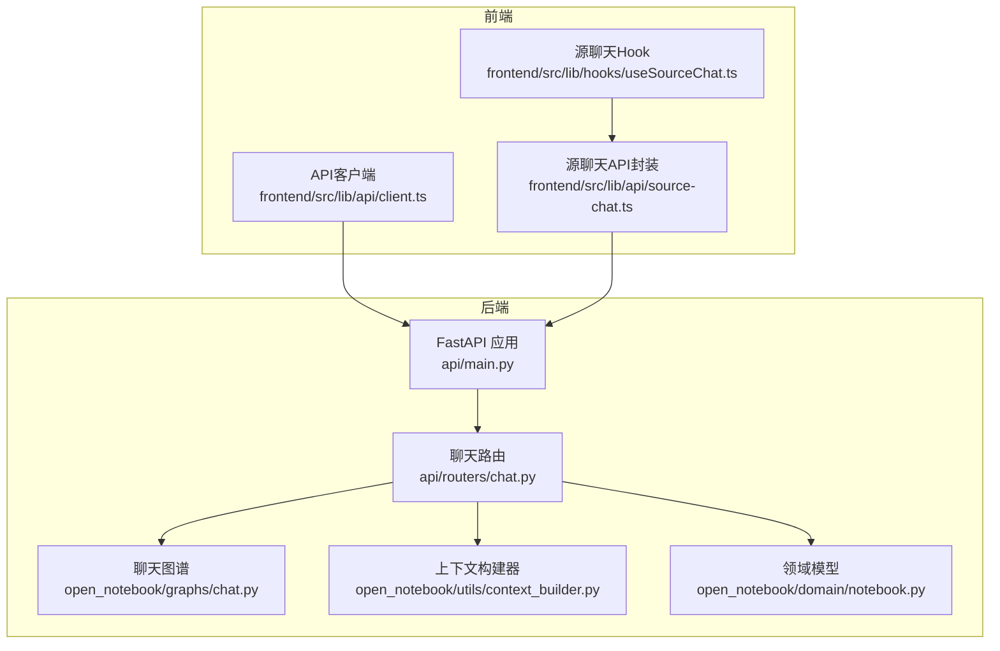
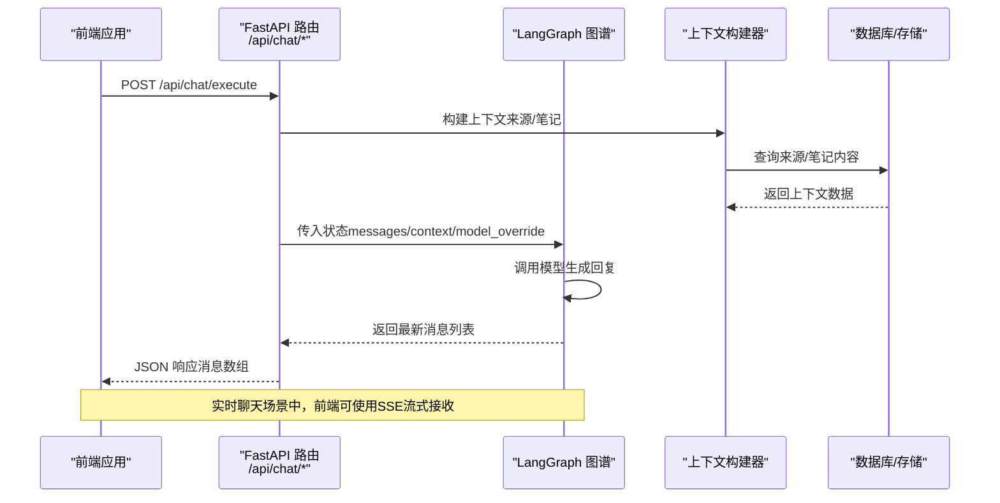
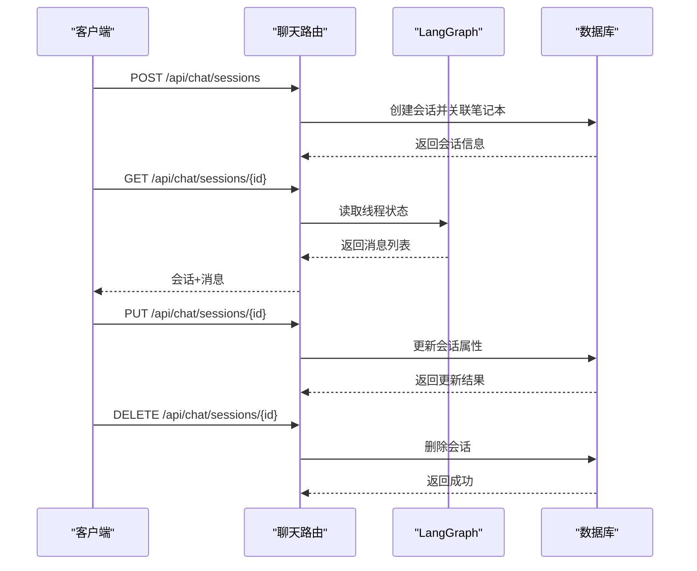
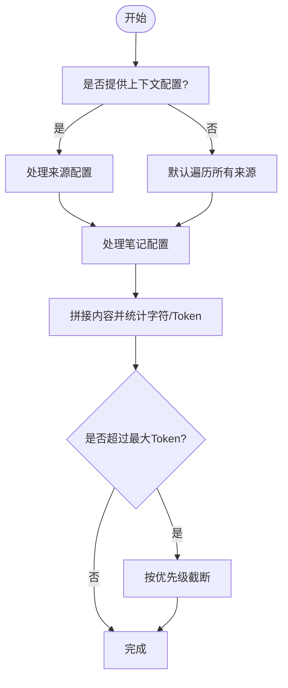
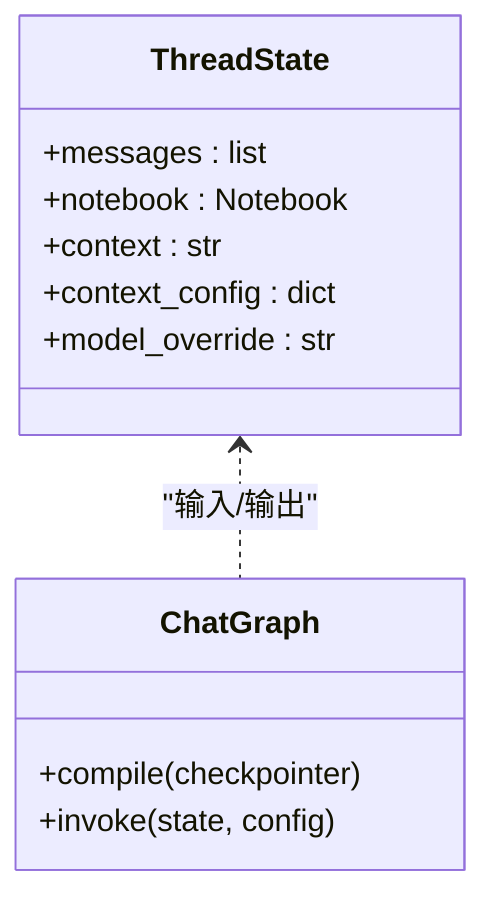
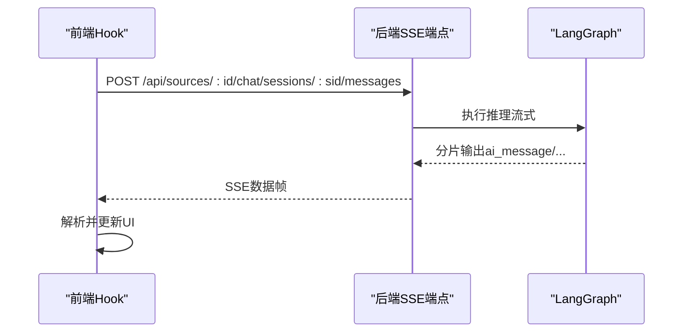
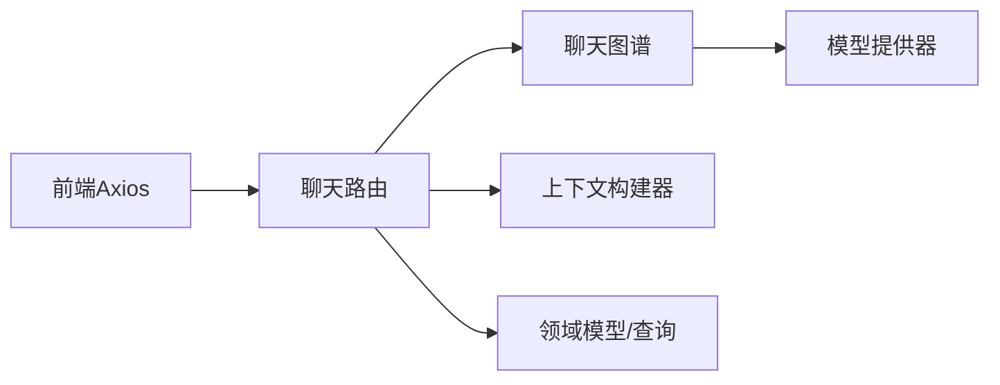

# AI聊天API

<cite>
**本文引用的文件**
- [api/main.py](file://api/main.py)
- [api/routers/chat.py](file://api/routers/chat.py)
- [api/chat_service.py](file://api/chat_service.py)
- [api/models.py](file://api/models.py)
- [open_notebook/graphs/chat.py](file://open_notebook/graphs/chat.py)
- [open_notebook/utils/context_builder.py](file://open_notebook/utils/context_builder.py)
- [open_notebook/domain/notebook.py](file://open_notebook/domain/notebook.py)
- [frontend/src/lib/api/client.ts](file://frontend/src/lib/api/client.ts)
- [frontend/src/lib/hooks/useSourceChat.ts](file://frontend/src/lib/hooks/useSourceChat.ts)
- [frontend/src/lib/api/source-chat.ts](file://frontend/src/lib/api/source-chat.ts)
</cite>

## 目录
1. [简介](#简介)
2. [项目结构](#项目结构)
3. [核心组件](#核心组件)
4. [架构总览](#架构总览)
5. [详细组件分析](#详细组件分析)
6. [依赖关系分析](#依赖关系分析)
7. [性能考量](#性能考量)
8. [故障排查指南](#故障排查指南)
9. [结论](#结论)
10. [附录](#附录)

## 简介
本文件为基于RAG（检索增强生成）的智能对话API的完整技术文档，覆盖以下要点：
- 基于LangGraph的状态化聊天图谱与会话管理
- 消息发送、会话创建/更新/删除、上下文构建
- 上下文来源（笔记与资料）选择、优先级与截断策略
- 聊天模型选择、覆盖参数与响应格式
- 多轮对话的上下文保持与记忆机制
- 实时聊天的WebSocket与SSE消息流式传输机制
- 前后端交互流程与错误处理

## 项目结构
后端采用FastAPI框架，路由集中在api/routers目录；聊天逻辑由LangGraph状态图驱动，上下文构建通过工具模块实现；前端使用Axios进行API调用，支持SSE流式接收。

图表来源
- [api/main.py](file://api/main.py#L99-L190)
- [api/routers/chat.py](file://api/routers/chat.py#L1-L517)
- [open_notebook/graphs/chat.py](file://open_notebook/graphs/chat.py#L1-L94)
- [open_notebook/utils/context_builder.py](file://open_notebook/utils/context_builder.py#L1-L496)
- [open_notebook/domain/notebook.py](file://open_notebook/domain/notebook.py#L1-L200)
- [frontend/src/lib/api/client.ts](file://frontend/src/lib/api/client.ts#L1-L66)
- [frontend/src/lib/api/source-chat.ts](file://frontend/src/lib/api/source-chat.ts#L37-L85)
- [frontend/src/lib/hooks/useSourceChat.ts](file://frontend/src/lib/hooks/useSourceChat.ts#L118-L192)

章节来源
- [api/main.py](file://api/main.py#L99-L190)
- [api/routers/chat.py](file://api/routers/chat.py#L1-L517)
- [open_notebook/graphs/chat.py](file://open_notebook/graphs/chat.py#L1-L94)
- [open_notebook/utils/context_builder.py](file://open_notebook/utils/context_builder.py#L1-L496)
- [open_notebook/domain/notebook.py](file://open_notebook/domain/notebook.py#L1-L200)
- [frontend/src/lib/api/client.ts](file://frontend/src/lib/api/client.ts#L1-L66)
- [frontend/src/lib/api/source-chat.ts](file://frontend/src/lib/api/source-chat.ts#L37-L85)
- [frontend/src/lib/hooks/useSourceChat.ts](file://frontend/src/lib/hooks/useSourceChat.ts#L118-L192)

## 核心组件
- FastAPI应用与中间件：负责CORS、认证中间件注册与全局异常处理。
- 聊天路由：提供会话管理、消息执行、上下文构建等接口。
- 聊天图谱：以LangGraph StateGraph实现状态化对话，支持SQLite检查点持久化。
- 上下文构建器：按配置聚合来源与笔记内容，计算token并截断。
- 领域模型：Notebook、Source、Note等实体及关系查询。
- 前端API客户端与Hook：Axios封装、SSE流式读取、状态管理。

章节来源
- [api/main.py](file://api/main.py#L99-L190)
- [api/routers/chat.py](file://api/routers/chat.py#L1-L517)
- [open_notebook/graphs/chat.py](file://open_notebook/graphs/chat.py#L1-L94)
- [open_notebook/utils/context_builder.py](file://open_notebook/utils/context_builder.py#L1-L496)
- [open_notebook/domain/notebook.py](file://open_notebook/domain/notebook.py#L1-L200)
- [frontend/src/lib/api/client.ts](file://frontend/src/lib/api/client.ts#L1-L66)
- [frontend/src/lib/api/source-chat.ts](file://frontend/src/lib/api/source-chat.ts#L37-L85)
- [frontend/src/lib/hooks/useSourceChat.ts](file://frontend/src/lib/hooks/useSourceChat.ts#L118-L192)

## 架构总览
后端通过FastAPI暴露REST接口，聊天请求经路由进入LangGraph状态图，结合上下文构建器提供的知识片段，调用模型生成回复。前端通过Axios发起请求，使用SSE接收流式数据，实现“所见即所得”的实时对话体验。

图表来源
- [api/routers/chat.py](file://api/routers/chat.py#L330-L409)
- [open_notebook/graphs/chat.py](file://open_notebook/graphs/chat.py#L27-L81)
- [open_notebook/utils/context_builder.py](file://open_notebook/utils/context_builder.py#L105-L141)

章节来源
- [api/routers/chat.py](file://api/routers/chat.py#L330-L409)
- [open_notebook/graphs/chat.py](file://open_notebook/graphs/chat.py#L27-L81)
- [open_notebook/utils/context_builder.py](file://open_notebook/utils/context_builder.py#L105-L141)

## 详细组件分析

### 1) 会话管理与消息执行
- 会话生命周期：创建、查询、更新（标题/模型覆盖）、删除。
- 执行流程：校验会话存在性，准备当前状态，注入用户消息与上下文，调用图谱执行，返回最新消息列表。
- 模型覆盖：支持每请求覆盖或会话级覆盖，优先级为“请求覆盖 > 会话覆盖”。

图表来源
- [api/routers/chat.py](file://api/routers/chat.py#L96-L328)

章节来源
- [api/routers/chat.py](file://api/routers/chat.py#L96-L328)

### 2) 上下文构建与RAG
- 支持按来源与笔记配置上下文，可选择“简短”或“全文”片段。
- 默认行为：遍历笔记本内所有来源与笔记，拼接内容并估算token数。
- 截断策略：根据最大token上限从低优先级项开始移除，直至满足限制。
- 输出格式：包含来源、笔记、洞察等结构化数据与统计信息。

图表来源
- [api/routers/chat.py](file://api/routers/chat.py#L411-L517)
- [open_notebook/utils/context_builder.py](file://open_notebook/utils/context_builder.py#L320-L350)

章节来源
- [api/routers/chat.py](file://api/routers/chat.py#L411-L517)
- [open_notebook/utils/context_builder.py](file://open_notebook/utils/context_builder.py#L105-L141)
- [open_notebook/utils/context_builder.py](file://open_notebook/utils/context_builder.py#L320-L350)

### 3) 聊天图谱与模型调用
- 状态结构：包含messages、notebook、context、context_config、model_override。
- 模型调用：根据配置或会话覆盖选择模型，统一调用并清理思考标签内容。
- 持久化：使用SQLite检查点保存状态，支持多轮对话记忆。

图表来源
- [open_notebook/graphs/chat.py](file://open_notebook/graphs/chat.py#L19-L25)
- [open_notebook/graphs/chat.py](file://open_notebook/graphs/chat.py#L89-L94)

章节来源
- [open_notebook/graphs/chat.py](file://open_notebook/graphs/chat.py#L19-L25)
- [open_notebook/graphs/chat.py](file://open_notebook/graphs/chat.py#L27-L81)
- [open_notebook/graphs/chat.py](file://open_notebook/graphs/chat.py#L89-L94)

### 4) 实时聊天与流式传输（SSE）
- 前端使用fetch获取ReadableStream，逐行解析"data:"前缀的数据帧。
- 数据类型：ai_message（增量内容）、context_indicators（上下文指示）、error（错误）。
- 流式渲染：首次收到ai_message时创建AI消息气泡，后续增量追加到内容。

图表来源
- [frontend/src/lib/api/source-chat.ts](file://frontend/src/lib/api/source-chat.ts#L48-L85)
- [frontend/src/lib/hooks/useSourceChat.ts](file://frontend/src/lib/hooks/useSourceChat.ts#L134-L192)

章节来源
- [frontend/src/lib/api/source-chat.ts](file://frontend/src/lib/api/source-chat.ts#L48-L85)
- [frontend/src/lib/hooks/useSourceChat.ts](file://frontend/src/lib/hooks/useSourceChat.ts#L134-L192)

### 5) 前端API客户端与认证
- 动态基础URL：首次请求时从配置接口获取运行时API地址。
- 认证头：自动从本地存储提取令牌并附加到请求头。
- 超时设置：针对本地LLM较长推理时间，前端设置较长超时。

章节来源
- [frontend/src/lib/api/client.ts](file://frontend/src/lib/api/client.ts#L1-L66)

## 依赖关系分析
- 路由层依赖图谱与上下文构建器，同时访问领域模型与数据库查询。
- 图谱层依赖模型提供器与清理工具，确保输出质量。
- 前端依赖后端REST/SSE接口，通过Axios拦截器统一处理认证与内容类型。

图表来源
- [api/routers/chat.py](file://api/routers/chat.py#L1-L517)
- [open_notebook/graphs/chat.py](file://open_notebook/graphs/chat.py#L1-L94)
- [open_notebook/utils/context_builder.py](file://open_notebook/utils/context_builder.py#L1-L496)
- [frontend/src/lib/api/client.ts](file://frontend/src/lib/api/client.ts#L1-L66)

章节来源
- [api/routers/chat.py](file://api/routers/chat.py#L1-L517)
- [open_notebook/graphs/chat.py](file://open_notebook/graphs/chat.py#L1-L94)
- [open_notebook/utils/context_builder.py](file://open_notebook/utils/context_builder.py#L1-L496)
- [frontend/src/lib/api/client.ts](file://frontend/src/lib/api/client.ts#L1-L66)

## 性能考量
- 上下文截断：在达到最大token阈值时按优先级移除低价值条目，避免超出模型上下文窗口。
- 异步与线程：图谱状态读取在独立线程中执行，避免阻塞事件循环。
- 超时配置：后端对本地模型设置较长读取超时，前端统一长超时，保障复杂问答的稳定性。
- SQLite检查点：轻量级持久化，适合单机部署；高并发场景建议评估替代方案。

章节来源
- [open_notebook/graphs/chat.py](file://open_notebook/graphs/chat.py#L34-L68)
- [open_notebook/utils/context_builder.py](file://open_notebook/utils/context_builder.py#L320-L350)
- [api/chat_service.py](file://api/chat_service.py#L137-L144)
- [frontend/src/lib/api/client.ts](file://frontend/src/lib/api/client.ts#L10-L16)

## 故障排查指南
- 404未找到：会话或笔记本不存在，检查ID与关联关系。
- 500服务器错误：查看后端日志中的堆栈信息，定位具体环节（图谱执行、上下文构建、数据库查询）。
- CORS与鉴权：确认前端已正确附加认证头，后端异常处理器已包含CORS头。
- SSE流中断：检查后端SSE端点可用性与网络代理配置，确保分片数据以"data:"前缀输出。

章节来源
- [api/routers/chat.py](file://api/routers/chat.py#L398-L408)
- [api/main.py](file://api/main.py#L132-L154)
- [frontend/src/lib/hooks/useSourceChat.ts](file://frontend/src/lib/hooks/useSourceChat.ts#L180-L187)

## 结论
该AI聊天API通过LangGraph实现状态化、可扩展的对话流程，结合灵活的上下文构建与流式传输能力，既满足本地LLM的低延迟需求，又提供良好的用户体验。通过会话级与请求级模型覆盖，以及严格的上下文截断策略，系统在准确性与性能之间取得平衡。

## 附录

### A. 接口定义与参数说明
- 获取会话列表：GET /api/chat/sessions?notebook_id=...
- 创建会话：POST /api/chat/sessions（请求体含笔记本ID、标题、模型覆盖）
- 获取会话详情：GET /api/chat/sessions/{session_id}
- 更新会话：PUT /api/chat/sessions/{session_id}（可更新标题/模型覆盖）
- 删除会话：DELETE /api/chat/sessions/{session_id}
- 执行聊天：POST /api/chat/execute（请求体含session_id、message、context、可选model_override）
- 构建上下文：POST /api/chat/context（请求体含notebook_id、context_config）

章节来源
- [api/routers/chat.py](file://api/routers/chat.py#L96-L328)
- [api/routers/chat.py](file://api/routers/chat.py#L330-L409)
- [api/routers/chat.py](file://api/routers/chat.py#L411-L517)

### B. 响应格式示例
- 会话响应：包含会话ID、标题、创建/更新时间、消息数量、模型覆盖等。
- 执行响应：返回session_id与最新的消息列表（每条消息含类型与内容）。
- 上下文响应：包含来源/笔记/洞察数据、字符计数、估算token数。

章节来源
- [api/routers/chat.py](file://api/routers/chat.py#L44-L79)
- [api/routers/chat.py](file://api/routers/chat.py#L330-L398)
- [api/routers/chat.py](file://api/routers/chat.py#L411-L517)