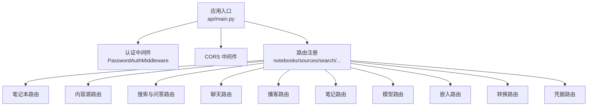
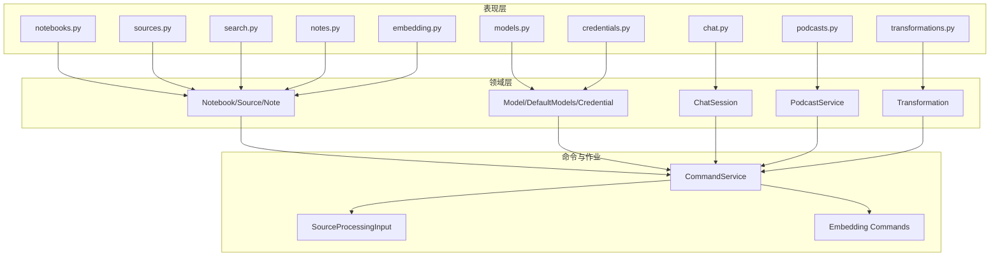
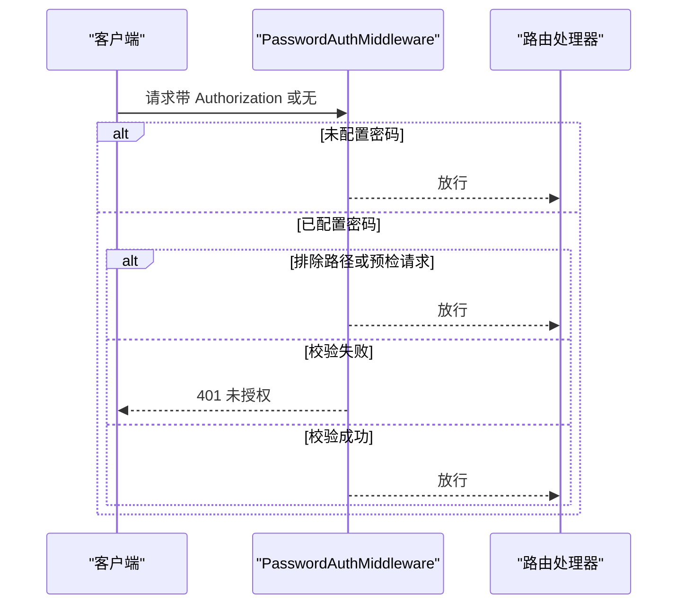
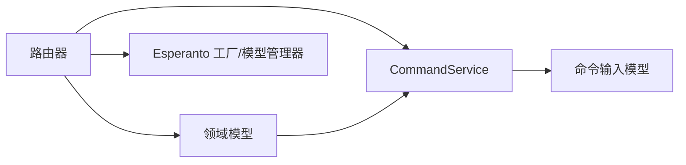

# API参考文档

<cite>
**本文档引用的文件**
- [api/main.py](file://api/main.py)
- [api/auth.py](file://api/auth.py)
- [api/client.py](file://api/client.py)
- [api/models.py](file://api/models.py)
- [api/routers/notebooks.py](file://api/routers/notebooks.py)
- [api/routers/sources.py](file://api/routers/sources.py)
- [api/routers/search.py](file://api/routers/search.py)
- [api/routers/chat.py](file://api/routers/chat.py)
- [api/routers/podcasts.py](file://api/routers/podcasts.py)
- [api/routers/notes.py](file://api/routers/notes.py)
- [api/routers/models.py](file://api/routers/models.py)
- [api/routers/embedding.py](file://api/routers/embedding.py)
- [api/routers/transformations.py](file://api/routers/transformations.py)
- [api/routers/credentials.py](file://api/routers/credentials.py)
</cite>

## 目录
1. [简介](#简介)
2. [项目结构](#项目结构)
3. [核心组件](#核心组件)
4. [架构总览](#架构总览)
5. [详细组件分析](#详细组件分析)
6. [依赖关系分析](#依赖关系分析)
7. [性能考虑](#性能考虑)
8. [故障排除指南](#故障排除指南)
9. [结论](#结论)
10. [附录](#附录)

## 简介
本文件为 Open Notebook 的完整 API 参考文档，覆盖所有 RESTful 接口，包括：
- 笔记本管理（创建、查询、更新、删除、关联资源）
- 内容源处理（上传、解析、异步处理、状态查询、下载）
- 笔记创建与管理
- AI 聊天与对话会话管理
- 搜索与问答（文本/向量）
- 嵌入与重建
- 模型与凭据管理
- 播客生成与管理
- 错误处理与认证机制

本参考文档提供每个端点的 HTTP 方法、URL 模式、请求/响应模型、认证方式、参数说明、返回值格式、错误处理以及最佳实践。

## 项目结构
Open Notebook 使用 FastAPI 构建后端服务，采用模块化路由组织，核心入口在主应用中注册各模块路由，并配置密码认证中间件与 CORS 中间件。数据模型统一定义于 models 模块，业务逻辑分布在各路由器对应的领域服务中。

**图表来源**
- [api/main.py](file://api/main.py#L99-L180)

**章节来源**
- [api/main.py](file://api/main.py#L1-L190)

## 核心组件
- 应用与中间件
  - FastAPI 应用实例，设置标题与描述，注册生命周期事件（数据库迁移）。
  - 密码认证中间件：强制 Bearer Token 认证，支持排除路径与 Docker 秘密文件。
  - CORS 中间件：允许跨域访问。
  - 自定义异常处理器：确保错误响应包含 CORS 头部。
- 数据模型
  - 统一使用 Pydantic 模型定义请求/响应结构，涵盖笔记本、源、笔记、搜索、模型、转换、嵌入、凭据、播客等。
- 客户端 SDK
  - 提供 Python 客户端封装，自动注入 Authorization 头，支持超时配置与错误处理。

**章节来源**
- [api/main.py](file://api/main.py#L99-L180)
- [api/auth.py](file://api/auth.py#L12-L76)
- [api/models.py](file://api/models.py#L1-L685)
- [api/client.py](file://api/client.py#L13-L530)

## 架构总览
系统采用分层架构：
- 表现层：FastAPI 路由器
- 领域层：笔记本、源、笔记、模型、转换、聊天、播客等领域对象
- 命令与作业：异步命令队列（CommandService），用于后台处理（如源处理、嵌入、播客生成）
- 存储：SurrealDB（通过 repository 查询与命令输入模型）
- 外部集成：AI 提供商（OpenAI、Anthropic、Google 等），通过 Esperanto 工厂与模型管理器

**图表来源**
- [api/routers/notebooks.py](file://api/routers/notebooks.py#L1-L328)
- [api/routers/sources.py](file://api/routers/sources.py#L1-L1020)
- [api/routers/search.py](file://api/routers/search.py#L1-L215)
- [api/routers/chat.py](file://api/routers/chat.py#L1-L517)
- [api/routers/podcasts.py](file://api/routers/podcasts.py#L1-L234)
- [api/routers/notes.py](file://api/routers/notes.py#L1-L188)
- [api/routers/models.py](file://api/routers/models.py#L1-L771)
- [api/routers/embedding.py](file://api/routers/embedding.py#L1-L114)
- [api/routers/transformations.py](file://api/routers/transformations.py#L1-L251)
- [api/routers/credentials.py](file://api/routers/credentials.py#L1-L387)

## 详细组件分析

### 认证与安全
- 认证方式：Bearer Token（密码），通过 Authorization: Bearer {password} 头传递。
- 默认行为：未配置密码时跳过认证；配置密码时对除特定路径外的所有请求进行校验。
- 排除路径：根路径、健康检查、Swagger 文档、Redoc、OpenAPI JSON。
- CORS：允许任意来源、凭证、方法与头。

**图表来源**
- [api/auth.py](file://api/auth.py#L12-L76)
- [api/main.py](file://api/main.py#L105-L127)

**章节来源**
- [api/auth.py](file://api/auth.py#L12-L115)
- [api/main.py](file://api/main.py#L105-L154)

### 笔记本管理（/api/notebooks）
- 获取笔记本列表
  - 方法：GET
  - 路径：/api/notebooks
  - 查询参数：archived（可选）、order_by（默认 updated desc）
  - 响应：NotebookResponse 列表
- 创建笔记本
  - 方法：POST
  - 路径：/api/notebooks
  - 请求体：NotebookCreate
  - 响应：NotebookResponse
- 获取单个笔记本
  - 方法：GET
  - 路径：/api/notebooks/{notebook_id}
  - 响应：NotebookResponse
- 更新笔记本
  - 方法：PUT
  - 路径：/api/notebooks/{notebook_id}
  - 请求体：NotebookUpdate
  - 响应：NotebookResponse
- 删除笔记本
  - 方法：DELETE
  - 路径：/api/notebooks/{notebook_id}?delete_exclusive_sources={bool}
  - 响应：NotebookDeleteResponse
- 删除预览
  - 方法：GET
  - 路径：/api/notebooks/{notebook_id}/delete-preview
  - 响应：NotebookDeletePreview
- 关联/移除内容源
  - 关联：POST /api/notebooks/{notebook_id}/sources/{source_id}
  - 移除：DELETE /api/notebooks/{notebook_id}/sources/{source_id}

请求/响应模型
- NotebookCreate：name, description
- NotebookUpdate：name?, description?, archived?
- NotebookResponse：id, name, description, archived, created, updated, source_count, note_count
- NotebookDeletePreview：notebook_id, notebook_name, note_count, exclusive_source_count, shared_source_count
- NotebookDeleteResponse：message, deleted_notes, deleted_sources, unlinked_sources

**章节来源**
- [api/routers/notebooks.py](file://api/routers/notebooks.py#L20-L328)
- [api/models.py](file://api/models.py#L6-L29)

### 内容源处理（/api/sources）
- 列出内容源
  - 方法：GET
  - 路径：/api/sources
  - 查询参数：notebook_id（可选）、limit（1-100，默认50）、offset、sort_by（created|updated）、sort_order（asc|desc）
  - 响应：SourceListResponse 列表
- 创建内容源（JSON）
  - 方法：POST
  - 路径：/api/sources/json
  - 请求体：SourceCreate
  - 响应：SourceResponse
- 创建内容源（表单）
  - 方法：POST
  - 路径：/api/sources
  - 表单字段：type、notebook_id 或 notebooks（JSON 数组）、url、content、title、transformations（JSON 数组）、embed、delete_source、async_processing、file
  - 响应：SourceResponse
- 获取单个内容源
  - 方法：GET
  - 路径：/api/sources/{source_id}
  - 响应：SourceResponse
- 获取状态
  - 方法：GET
  - 路径：/api/sources/{source_id}/status
  - 响应：SourceStatusResponse
- 下载原始文件
  - 方法：GET
  - 路径：/api/sources/{source_id}/download
  - 响应：文件流
  - HEAD：/api/sources/{source_id}/download（验证文件可用性）
- 更新内容源
  - 方法：PUT
  - 路径：/api/sources/{source_id}
  - 请求体：SourceUpdate
  - 响应：SourceResponse
- 重试处理
  - 方法：POST
  - 路径：/api/sources/{source_id}/retry
  - 响应：SourceResponse

请求/响应模型（节选）
- SourceCreate：type、notebook_id（兼容）、notebooks[]、url、file_path、content、title、transformations[]、embed、delete_source、async_processing
- SourceUpdate：title?、topics?
- SourceResponse：id、title、topics、asset、full_text、embedded、embedded_chunks、file_available、created、updated、command_id、status、processing_info、notebooks[]
- SourceStatusResponse：status、message、processing_info、command_id

**章节来源**
- [api/routers/sources.py](file://api/routers/sources.py#L152-L800)
- [api/models.py](file://api/models.py#L274-L366)

### 搜索与问答（/api/search）
- 知识库搜索
  - 方法：POST
  - 路径：/api/search
  - 请求体：SearchRequest（query、type=text|vector、limit、search_sources、search_notes、minimum_score）
  - 响应：SearchResponse（results、total_count、search_type）
- 流式问答（Server-Sent Events）
  - 方法：POST
  - 路径：/api/search/ask
  - 请求体：AskRequest（question、strategy_model、answer_model、final_answer_model）
  - 响应：text/plain（SSE），事件类型：strategy、answer、final_answer、complete
- 简单问答（非流式）
  - 方法：POST
  - 路径：/api/search/ask/simple
  - 请求体：AskRequest
  - 响应：AskResponse（answer、question）

请求/响应模型（节选）
- SearchRequest/SearchResponse
- AskRequest/AskResponse

**章节来源**
- [api/routers/search.py](file://api/routers/search.py#L17-L215)
- [api/models.py](file://api/models.py#L31-L59)

### 聊天与上下文（/api/chat）
- 获取会话列表
  - 方法：GET
  - 路径：/api/chat/sessions?notebook_id={notebook_id}
  - 响应：ChatSessionResponse 列表
- 创建会话
  - 方法：POST
  - 路径：/api/chat/sessions
  - 请求体：CreateSessionRequest（notebook_id、title、model_override）
  - 响应：ChatSessionResponse
- 获取会话详情（含消息）
  - 方法：GET
  - 路径：/api/chat/sessions/{session_id}
  - 响应：ChatSessionWithMessagesResponse
- 更新会话
  - 方法：PUT
  - 路径：/api/chat/sessions/{session_id}
  - 请求体：UpdateSessionRequest（title、model_override）
  - 响应：ChatSessionResponse
- 删除会话
  - 方法：DELETE
  - 路径：/api/chat/sessions/{session_id}
  - 响应：SuccessResponse
- 执行聊天
  - 方法：POST
  - 路径：/api/chat/execute
  - 请求体：ExecuteChatRequest（session_id、message、context、model_override）
  - 响应：ExecuteChatResponse（session_id、messages）
- 构建上下文
  - 方法：POST
  - 路径：/api/chat/context
  - 请求体：BuildContextRequest（notebook_id、context_config）
  - 响应：BuildContextResponse（context、token_count、char_count）

请求/响应模型（节选）
- CreateSessionRequest/UpdateSessionRequest
- ChatSessionResponse/ChatSessionWithMessagesResponse
- ExecuteChatRequest/ExecuteChatResponse
- BuildContextRequest/BuildContextResponse

**章节来源**
- [api/routers/chat.py](file://api/routers/chat.py#L96-L517)
- [api/models.py](file://api/models.py#L21-L94)

### 播客生成与管理（/api/podcasts）
- 生成播客
  - 方法：POST
  - 路径：/api/podcasts/generate
  - 请求体：PodcastGenerationRequest（episode_profile、speaker_profile、episode_name、notebook_id、content、briefing_suffix）
  - 响应：PodcastGenerationResponse（job_id、status、message、episode_profile、episode_name）
- 获取作业状态
  - 方法：GET
  - 路径：/api/podcasts/jobs/{job_id}
  - 响应：作业状态字典
- 列出播客剧集
  - 方法：GET
  - 路径：/api/podcasts/episodes
  - 响应：PodcastEpisodeResponse 列表
- 获取单个剧集
  - 方法：GET
  - 路径：/api/podcasts/episodes/{episode_id}
  - 响应：PodcastEpisodeResponse
- 流式播放音频
  - 方法：GET
  - 路径：/api/podcasts/episodes/{episode_id}/audio
  - 响应：音频文件流
- 删除剧集
  - 方法：DELETE
  - 路径：/api/podcasts/episodes/{episode_id}
  - 响应：删除成功消息

请求/响应模型（节选）
- PodcastEpisodeResponse：id、name、episode_profile、speaker_profile、briefing、audio_file、audio_url、transcript、outline、created、job_status

**章节来源**
- [api/routers/podcasts.py](file://api/routers/podcasts.py#L19-L234)

### 笔记管理（/api/notes）
- 获取笔记列表
  - 方法：GET
  - 路径：/api/notes
  - 查询参数：notebook_id（可选）
  - 响应：NoteResponse 列表
- 创建笔记
  - 方法：POST
  - 路径：/api/notes
  - 请求体：NoteCreate（title?、content、note_type、notebook_id?）
  - 响应：NoteResponse
- 获取单个笔记
  - 方法：GET
  - 路径：/api/notes/{note_id}
  - 响应：NoteResponse
- 更新笔记
  - 方法：PUT
  - 路径：/api/notes/{note_id}
  - 请求体：NoteUpdate（title?、content?、note_type?）
  - 响应：NoteResponse
- 删除笔记
  - 方法：DELETE
  - 路径：/api/notes/{note_id}
  - 响应：{"message":"Note deleted successfully"}

请求/响应模型（节选）
- NoteCreate/NoteUpdate/NoteResponse

**章节来源**
- [api/routers/notes.py](file://api/routers/notes.py#L13-L188)
- [api/models.py](file://api/models.py#L173-L196)

### 模型与默认模型（/api/models）
- 获取模型列表
  - 方法：GET
  - 路径：/api/models
  - 查询参数：type（可选）
  - 响应：ModelResponse 列表
- 创建模型
  - 方法：POST
  - 路径：/api/models
  - 请求体：ModelCreate（name、provider、type、credential?）
  - 响应：ModelResponse
- 删除模型
  - 方法：DELETE
  - 路径：/api/models/{model_id}
  - 响应：{"message":"Model deleted successfully"}
- 测试模型
  - 方法：POST
  - 路径：/api/models/{model_id}/test
  - 响应：ModelTestResponse
- 获取默认模型
  - 方法：GET
  - 路径：/api/models/defaults
  - 响应：DefaultModelsResponse
- 更新默认模型
  - 方法：PUT
  - 路径：/api/models/defaults
  - 请求体：DefaultModelsResponse
  - 响应：DefaultModelsResponse
- 获取提供商可用性
  - 方法：GET
  - 路径：/api/models/providers
  - 响应：ProviderAvailabilityResponse
- 发现提供商模型
  - 方法：GET
  - 路径：/api/models/discover/{provider}
  - 响应：DiscoveredModelResponse 列表
- 同步提供商模型
  - 方法：POST
  - 路径：/api/models/sync/{provider}
  - 响应：ProviderSyncResponse
- 全量同步
  - 方法：POST
  - 路径：/api/models/sync
  - 响应：AllProvidersSyncResponse
- 按提供商获取模型
  - 方法：GET
  - 路径：/api/models/by-provider/{provider}
  - 响应：ModelResponse 列表
- 模型数量统计
  - 方法：GET
  - 路径：/api/models/count/{provider}
  - 响应：ProviderModelCountResponse
- 自动分配默认模型
  - 方法：POST
  - 路径：/api/models/auto-assign
  - 响应：AutoAssignResult

请求/响应模型（节选）
- ModelCreate/ModelResponse/DefaultModelsResponse/ProviderAvailabilityResponse
- DiscoveredModelResponse/ProviderSyncResponse/AllProvidersSyncResponse
- ProviderModelCountResponse/AutoAssignResult/ModelTestResponse

**章节来源**
- [api/routers/models.py](file://api/routers/models.py#L165-L771)
- [api/models.py](file://api/models.py#L61-L94)

### 嵌入与重建（/api/embed 与 /api/embeddings）
- 单项嵌入
  - 方法：POST
  - 路径：/api/embed
  - 请求体：EmbedRequest（item_id、item_type=source|note、async_processing）
  - 响应：EmbedResponse（success、message、item_id、item_type、command_id）
- 重建嵌入（批量）
  - 方法：POST
  - 路径：/api/embeddings/rebuild
  - 请求体：RebuildRequest（mode=existing|all、include_sources、include_notes、include_insights）
  - 响应：RebuildResponse（command_id、total_items、message）
- 查询重建进度
  - 方法：GET
  - 路径：/api/embeddings/rebuild/{command_id}/status
  - 响应：RebuildStatusResponse（command_id、status、progress、stats、started_at、completed_at、error_message）

请求/响应模型（节选）
- EmbedRequest/EmbedResponse
- RebuildRequest/RebuildResponse/RebuildStatusResponse

**章节来源**
- [api/routers/embedding.py](file://api/routers/embedding.py#L12-L114)
- [api/models.py](file://api/models.py#L198-L255)

### 转换（/api/transformations）
- 获取转换列表
  - 方法：GET
  - 路径：/api/transformations
  - 响应：TransformationResponse 列表
- 创建转换
  - 方法：POST
  - 路径：/api/transformations
  - 请求体：TransformationCreate（name、title、description、prompt、apply_default）
  - 响应：TransformationResponse
- 获取单个转换
  - 方法：GET
  - 路径：/api/transformations/{transformation_id}
  - 响应：TransformationResponse
- 更新转换
  - 方法：PUT
  - 路径：/api/transformations/{transformation_id}
  - 请求体：TransformationUpdate
  - 响应：TransformationResponse
- 删除转换
  - 方法：DELETE
  - 路径：/api/transformations/{transformation_id}
  - 响应：{"message":"Transformation deleted successfully"}
- 执行转换
  - 方法：POST
  - 路径：/api/transformations/execute
  - 请求体：TransformationExecuteRequest（transformation_id、input_text、model_id）
  - 响应：TransformationExecuteResponse（output、transformation_id、model_id）
- 获取默认提示
  - 方法：GET
  - 路径：/api/transformations/default-prompt
  - 响应：DefaultPromptResponse
- 更新默认提示
  - 方法：PUT
  - 路径：/api/transformations/default-prompt
  - 请求体：DefaultPromptUpdate
  - 响应：DefaultPromptResponse

请求/响应模型（节选）
- TransformationCreate/Update/Response
- TransformationExecuteRequest/Response
- DefaultPromptResponse/Update

**章节来源**
- [api/routers/transformations.py](file://api/routers/transformations.py#L23-L251)
- [api/models.py](file://api/models.py#L104-L158)

### 凭据管理（/api/credentials）
- 获取状态
  - 方法：GET
  - 路径：/api/credentials/status
  - 响应：提供商配置与加密状态
- 获取环境状态
  - 方法：GET
  - 路径：/api/credentials/env-status
  - 响应：环境变量配置状态
- 列出凭据
  - 方法：GET
  - 路径：/api/credentials
  - 查询参数：provider（可选）
  - 响应：CredentialResponse 列表
- 按提供商列出
  - 方法：GET
  - 路径：/api/credentials/by-provider/{provider}
  - 响应：CredentialResponse 列表
- 创建凭据
  - 方法：POST
  - 路径：/api/credentials
  - 请求体：CreateCredentialRequest
  - 响应：CredentialResponse
- 获取单个凭据
  - 方法：GET
  - 路径：/api/credentials/{credential_id}
  - 响应：CredentialResponse
- 更新凭据
  - 方法：PUT
  - 路径：/api/credentials/{credential_id}
  - 请求体：UpdateCredentialRequest
  - 响应：CredentialResponse
- 删除凭据
  - 方法：DELETE
  - 路径：/api/credentials/{credential_id}?delete_models={bool}&migrate_to={id}
  - 响应：CredentialDeleteResponse
- 测试凭据
  - 方法：POST
  - 路径：/api/credentials/{credential_id}/test
  - 响应：测试结果
- 发现模型
  - 方法：POST
  - 路径：/api/credentials/{credential_id}/discover
  - 响应：DiscoverModelsResponse
- 注册模型
  - 方法：POST
  - 路径：/api/credentials/{credential_id}/register-models
  - 请求体：RegisterModelsRequest
  - 响应：RegisterModelsResponse
- 从 ProviderConfig 迁移
  - 方法：POST
  - 路径：/api/credentials/migrate-from-provider-config
  - 响应：迁移结果
- 从环境变量迁移
  - 方法：POST
  - 路径：/api/credentials/migrate-from-env
  - 响应：迁移结果

请求/响应模型（节选）
- CreateCredentialRequest/UpdateCredentialRequest/CredentialResponse
- CredentialDeleteResponse/DiscoverModelsResponse/RegisterModelsResponse

**章节来源**
- [api/routers/credentials.py](file://api/routers/credentials.py#L66-L387)
- [api/models.py](file://api/models.py#L555-L627)

### 设置与配置（/api/settings）
- 获取设置
  - 方法：GET
  - 路径：/api/settings
  - 响应：SettingsResponse
- 更新设置
  - 方法：PUT
  - 路径：/api/settings
  - 请求体：SettingsUpdate
  - 响应：SettingsResponse

请求/响应模型（节选）
- SettingsResponse/SettingsUpdate

**章节来源**
- [api/models.py](file://api/models.py#L257-L272)

### 上下文构建（/api/context）
- 构建上下文
  - 方法：POST
  - 路径：/api/notebooks/{notebook_id}/context
  - 请求体：ContextRequest（notebook_id、context_config）
  - 响应：ContextResponse（sources、notes、total_tokens）

请求/响应模型（节选）
- ContextRequest/ContextResponse

**章节来源**
- [api/models.py](file://api/models.py#L368-L390)

### 命令与作业（/api/commands）
- 通用命令提交与状态查询
  - 通过 CommandService 提交命令（如源处理、嵌入、播客生成），返回 command_id 以便后续状态轮询。

**章节来源**
- [api/routers/sources.py](file://api/routers/sources.py#L352-L426)
- [api/routers/embedding.py](file://api/routers/embedding.py#L33-L70)
- [api/routers/podcasts.py](file://api/routers/podcasts.py#L40-L62)

## 依赖关系分析
- 组件耦合
  - 路由器依赖领域模型（Notebook、Source、Note、Model、Transformation、ChatSession、Credential 等）。
  - 异步处理通过 CommandService 与命令输入模型解耦。
  - 模型发现与提供商可用性通过 Esperanto 工厂与模型管理器实现。
- 外部依赖
  - AI 提供商（OpenAI、Anthropic、Google 等）通过模型管理器与连接测试器集成。
  - 存储：SurrealDB（通过 repository 与命令输入模型）。
- 循环依赖
  - 路由器与领域模型之间为单向依赖，避免循环导入。

**图表来源**
- [api/routers/sources.py](file://api/routers/sources.py#L370-L385)
- [api/routers/models.py](file://api/routers/models.py#L19-L26)

**章节来源**
- [api/routers/sources.py](file://api/routers/sources.py#L352-L426)
- [api/routers/models.py](file://api/routers/models.py#L19-L26)

## 性能考虑
- 超时配置
  - 客户端默认超时 300 秒，可通过环境变量调整；转换、洞察、重建等长耗时操作建议增加超时。
- 异步处理
  - 源处理、嵌入、播客生成均支持异步提交与状态轮询，避免阻塞请求。
- 分页与限制
  - 源列表支持 limit（1-100）与 offset，搜索 limit 最大 1000。
- 向量搜索前置条件
  - 向量搜索需先配置嵌入模型，否则返回 400。

**章节来源**
- [api/client.py](file://api/client.py#L16-L41)
- [api/routers/search.py](file://api/routers/search.py#L21-L27)
- [api/routers/sources.py](file://api/routers/sources.py#L155-L174)

## 故障排除指南
- 401 未授权
  - 检查 Authorization 头是否为 Bearer {password}，确认密码已正确配置且未被排除在认证之外。
- 403 访问拒绝（文件下载）
  - 文件路径不在上传目录范围内，或文件不存在。
- 413 负载过大
  - 自定义异常处理器已确保 CORS 头包含在错误响应中；若反向代理提前返回 413，请在代理层添加 CORS 头。
- 搜索/问答失败
  - 向量搜索需配置嵌入模型；模型测试失败请检查提供商凭据与网络连通性。
- 源处理失败
  - 检查 command_id 对应的作业状态，查看 processing_info 中的错误信息。

**章节来源**
- [api/main.py](file://api/main.py#L130-L154)
- [api/routers/sources.py](file://api/routers/sources.py#L562-L584)
- [api/routers/search.py](file://api/routers/search.py#L21-L27)

## 结论
本 API 参考文档系统性地梳理了 Open Notebook 的 RESTful 接口，覆盖从内容源到聊天、搜索、播客生成、模型与凭据管理的全链路能力。通过统一的数据模型、明确的认证与错误处理机制、以及异步作业支持，系统在易用性与扩展性之间取得平衡。建议在生产环境中：
- 明确配置 OPEN_NOTEBOOK_PASSWORD 与 OPEN_NOTEBOOK_ENCRYPTION_KEY
- 使用异步端点处理长耗时任务
- 合理设置超时与分页参数
- 通过 /api/models/providers 与 /api/credentials/status 检查提供商可用性与配置状态

## 附录

### API 使用示例（客户端 SDK）
- 初始化客户端
  - 通过环境变量 API_BASE_URL 与 OPEN_NOTEBOOK_PASSWORD 自动注入基础 URL 与认证头。
- 常用操作
  - 获取笔记本列表、创建笔记本、创建内容源（支持 JSON 与表单）、执行转换、发起问答、生成播客等。
- 超时与错误
  - 客户端内置超时与错误包装，便于在长耗时操作（如转换、重建）中保持稳定。

**章节来源**
- [api/client.py](file://api/client.py#L13-L78)
- [api/client.py](file://api/client.py#L80-L530)

### 版本控制与向后兼容性
- 版本策略
  - 当前未显式声明 API 版本号；建议在路由前缀中引入版本号（如 /api/v1）以支持多版本并存。
- 向后兼容
  - 源创建支持旧版 notebook_id 字段（自动转换为 notebooks 数组），确保历史调用不中断。
  - 搜索端点同时支持文本与向量搜索，向量搜索需嵌入模型存在。

**章节来源**
- [api/models.py](file://api/models.py#L280-L324)
- [api/routers/search.py](file://api/routers/search.py#L21-L27)