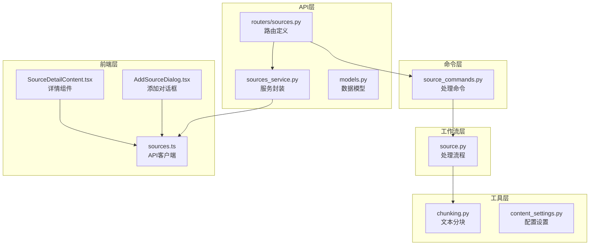
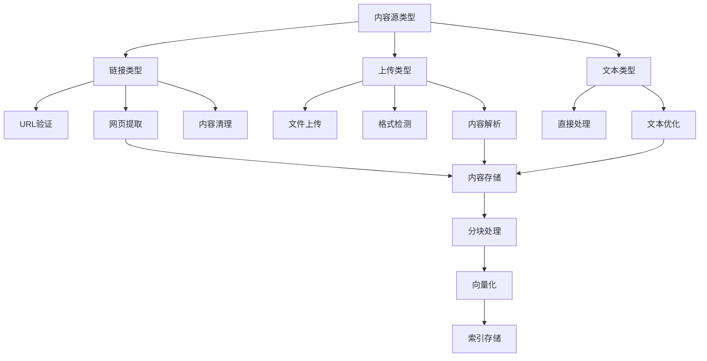
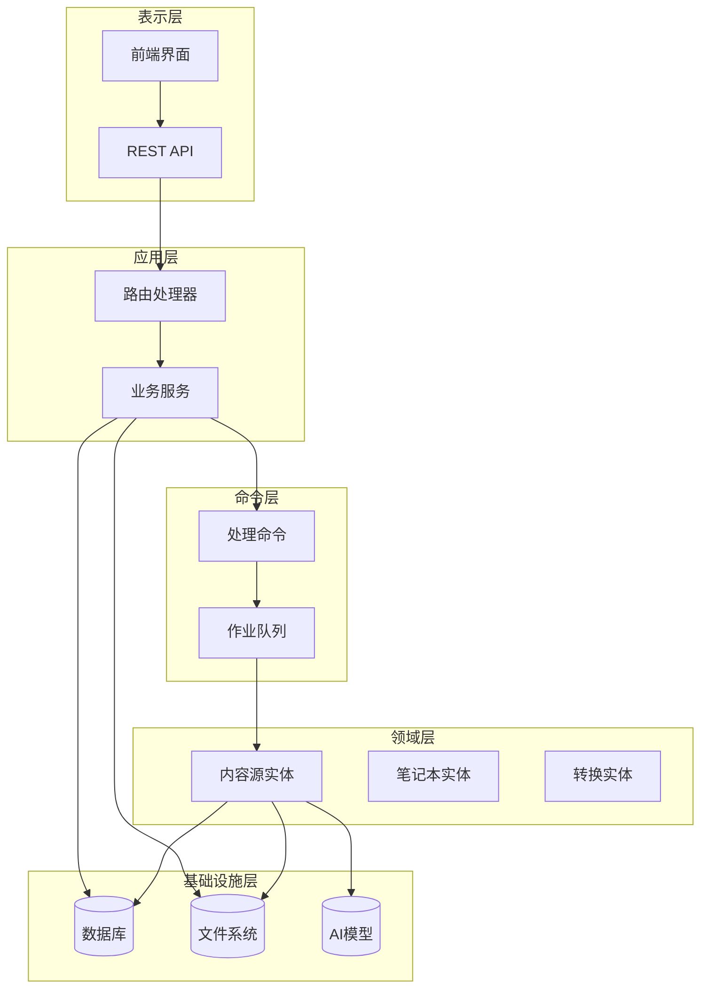
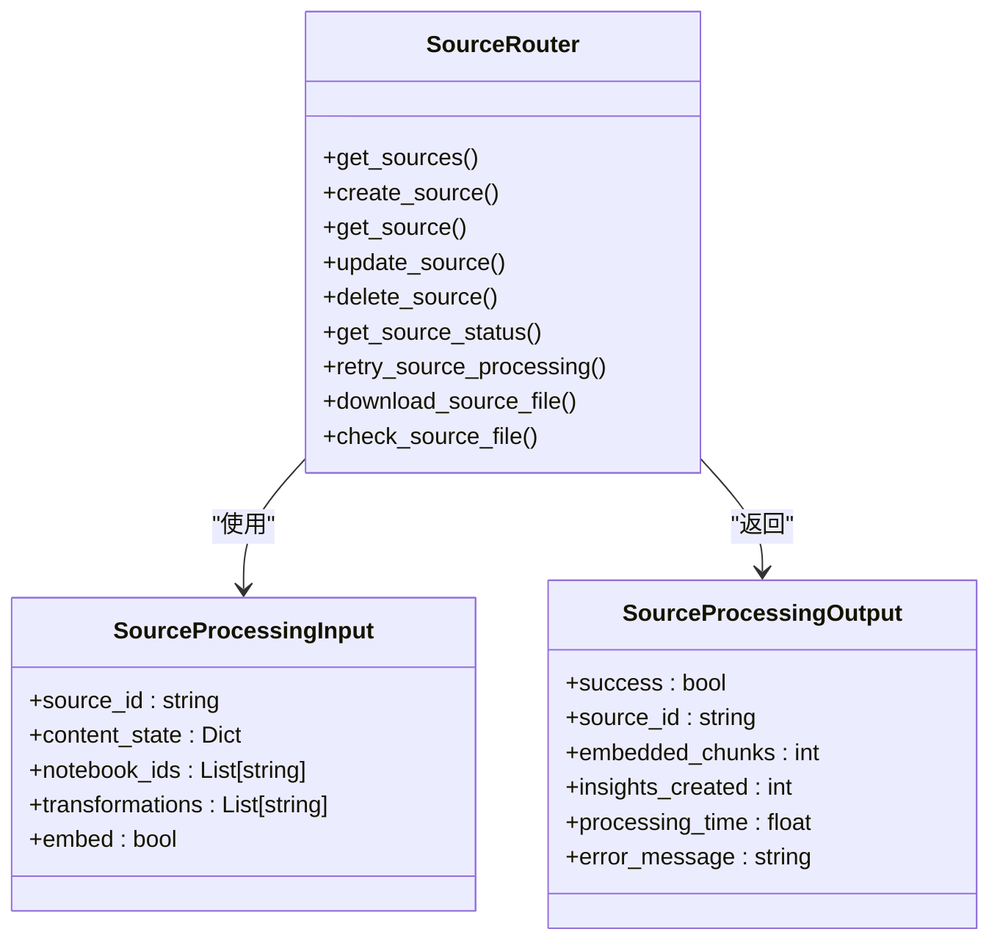
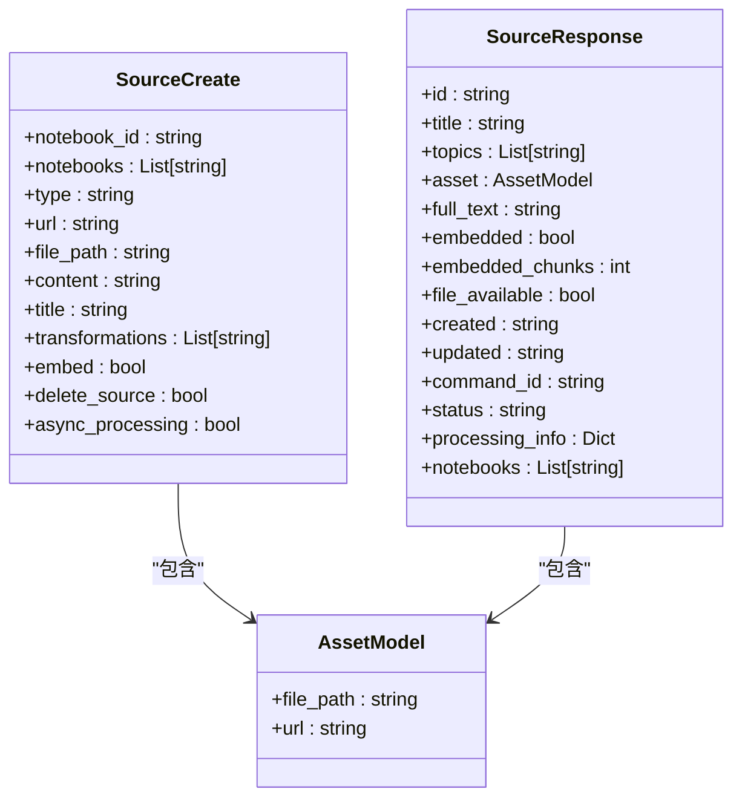
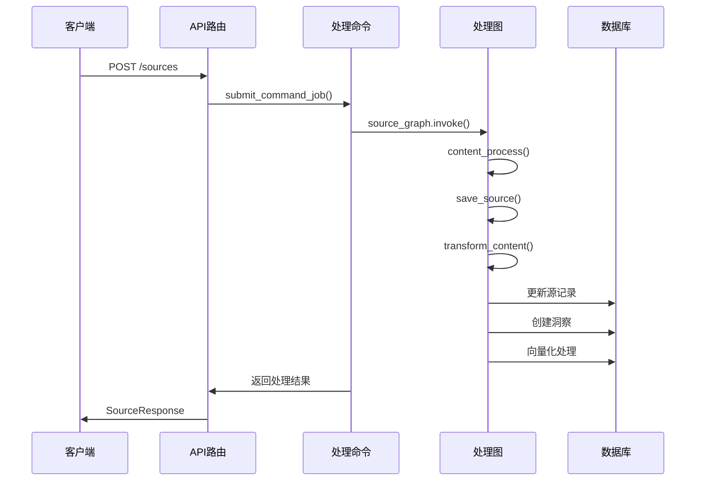
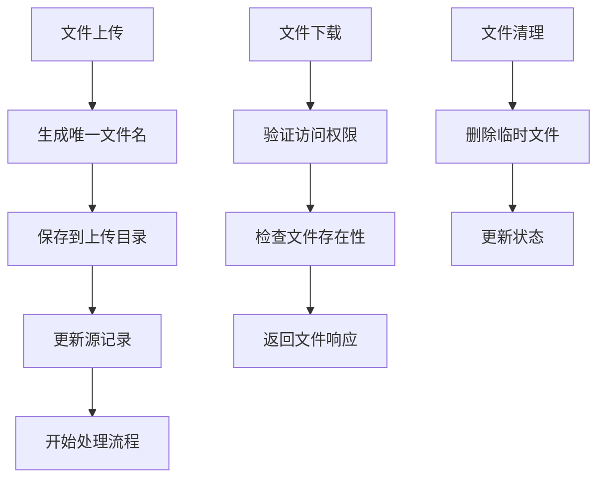
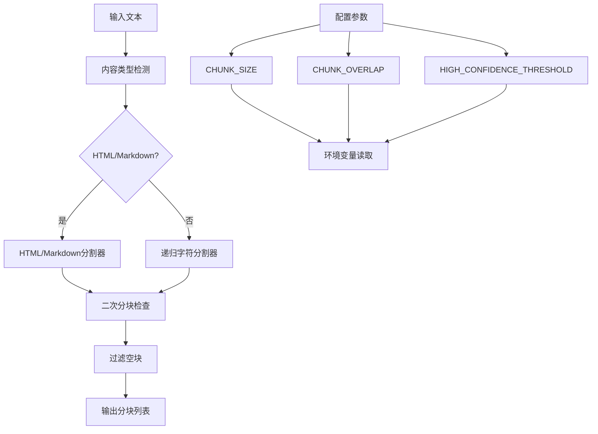
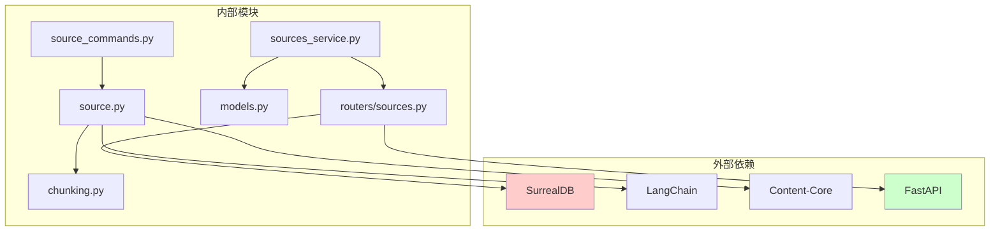
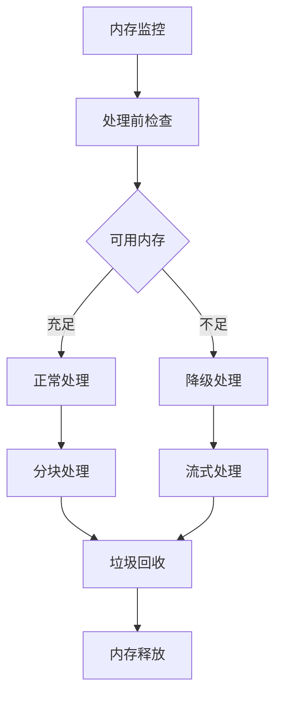

# 内容源API

<cite>
**本文档引用的文件**
- [api/routers/sources.py](file://api/routers/sources.py)
- [api/sources_service.py](file://api/sources_service.py)
- [api/models.py](file://api/models.py)
- [commands/source_commands.py](file://commands/source_commands.py)
- [open_notebook/graphs/source.py](file://open_notebook/graphs/source.py)
- [open_notebook/utils/chunking.py](file://open_notebook/utils/chunking.py)
- [open_notebook/domain/content_settings.py](file://open_notebook/domain/content_settings.py)
- [frontend/src/lib/api/sources.ts](file://frontend/src/lib/api/sources.ts)
- [frontend/src/components/sources/AddSourceDialog.tsx](file://frontend/src/components/sources/AddSourceDialog.tsx)
- [frontend/src/components/source/SourceDetailContent.tsx](file://frontend/src/components/source/SourceDetailContent.tsx)
- [docs/3-USER-GUIDE/adding-sources.md](file://docs/3-USER-GUIDE/adding-sources.md)
</cite>

## 目录
1. [简介](#简介)
2. [项目结构](#项目结构)
3. [核心组件](#核心组件)
4. [架构概览](#架构概览)
5. [详细组件分析](#详细组件分析)
6. [依赖关系分析](#依赖关系分析)
7. [性能考虑](#性能考虑)
8. [故障排除指南](#故障排除指南)
9. [结论](#结论)

## 简介

内容源API是Open Notebook系统中用于管理内容来源的核心接口层。该API支持多种内容类型（PDF、网页、音频等），提供完整的生命周期管理，包括内容添加、上传、处理、删除和状态查询。系统采用异步处理机制，支持分块上传、进度跟踪和错误恢复，确保大规模内容处理的可靠性和效率。

## 项目结构

内容源API主要分布在以下模块中：

**图表来源**
- [api/routers/sources.py](file://api/routers/sources.py#L1-L1020)
- [commands/source_commands.py](file://commands/source_commands.py#L1-L269)
- [open_notebook/graphs/source.py](file://open_notebook/graphs/source.py#L1-L168)

**章节来源**
- [api/routers/sources.py](file://api/routers/sources.py#L1-L1020)
- [api/sources_service.py](file://api/sources_service.py#L1-L325)
- [api/models.py](file://api/models.py#L270-L469)

## 核心组件

### 主要API端点

内容源API提供以下核心端点：

| 端点 | 方法 | 描述 |
|------|------|------|
| `/sources` | GET | 获取内容源列表，支持分页和排序 |
| `/sources` | POST | 创建新内容源（支持JSON和表单数据） |
| `/sources/json` | POST | 使用JSON负载创建内容源（兼容性端点） |
| `/sources/{source_id}` | GET | 获取特定内容源详情 |
| `/sources/{source_id}/download` | GET | 下载原始文件 |
| `/sources/{source_id}/status` | GET | 获取处理状态 |
| `/sources/{source_id}/retry` | POST | 重试失败的处理任务 |
| `/sources/{source_id}` | PUT | 更新内容源元数据 |
| `/sources/{source_id}` | DELETE | 删除内容源 |

### 支持的内容类型

系统支持多种内容类型，每种类型都有特定的处理流程：

**图表来源**
- [api/routers/sources.py](file://api/routers/sources.py#L314-L340)
- [open_notebook/graphs/source.py](file://open_notebook/graphs/source.py#L34-L79)

**章节来源**
- [api/routers/sources.py](file://api/routers/sources.py#L152-L278)
- [api/routers/sources.py](file://api/routers/sources.py#L280-L552)
- [docs/3-USER-GUIDE/adding-sources.md](file://docs/3-USER-GUIDE/adding-sources.md#L43-L79)

## 架构概览

内容源API采用分层架构设计，确保职责分离和可扩展性：

**图表来源**
- [api/routers/sources.py](file://api/routers/sources.py#L1-L1020)
- [api/sources_service.py](file://api/sources_service.py#L66-L325)
- [commands/source_commands.py](file://commands/source_commands.py#L48-L155)

## 详细组件分析

### 路由器组件

路由器负责HTTP请求处理和响应生成：

**图表来源**
- [api/routers/sources.py](file://api/routers/sources.py#L1-L1020)
- [commands/source_commands.py](file://commands/source_commands.py#L31-L46)

**章节来源**
- [api/routers/sources.py](file://api/routers/sources.py#L1-L1020)

### 数据模型组件

数据模型定义了API交互的数据结构：

**图表来源**
- [api/models.py](file://api/models.py#L280-L349)

**章节来源**
- [api/models.py](file://api/models.py#L274-L469)

### 处理命令组件

处理命令负责实际的内容处理逻辑：

**图表来源**
- [commands/source_commands.py](file://commands/source_commands.py#L48-L155)
- [open_notebook/graphs/source.py](file://open_notebook/graphs/source.py#L151-L168)

**章节来源**
- [commands/source_commands.py](file://commands/source_commands.py#L1-L269)
- [open_notebook/graphs/source.py](file://open_notebook/graphs/source.py#L1-L168)

### 文件上传处理

系统支持文件上传和下载功能：

**图表来源**
- [api/routers/sources.py](file://api/routers/sources.py#L41-L86)
- [api/routers/sources.py](file://api/routers/sources.py#L562-L598)

**章节来源**
- [api/routers/sources.py](file://api/routers/sources.py#L64-L86)
- [api/routers/sources.py](file://api/routers/sources.py#L562-L598)

### 分块处理机制

系统使用智能分块算法处理大文本内容：

**图表来源**
- [open_notebook/utils/chunking.py](file://open_notebook/utils/chunking.py#L30-L92)
- [open_notebook/utils/chunking.py](file://open_notebook/utils/chunking.py#L386-L446)

**章节来源**
- [open_notebook/utils/chunking.py](file://open_notebook/utils/chunking.py#L1-L446)

## 依赖关系分析

内容源API的依赖关系如下：

**图表来源**
- [api/routers/sources.py](file://api/routers/sources.py#L1-L1020)
- [commands/source_commands.py](file://commands/source_commands.py#L1-L269)
- [open_notebook/graphs/source.py](file://open_notebook/graphs/source.py#L1-L168)

**章节来源**
- [api/routers/sources.py](file://api/routers/sources.py#L1-L1020)
- [commands/source_commands.py](file://commands/source_commands.py#L1-L269)

## 性能考虑

### 异步处理策略

系统采用异步处理模式以提高吞吐量：

1. **后台作业队列**：使用作业队列处理长时间运行的任务
2. **并发控制**：限制同时处理的源数量
3. **资源池管理**：合理分配内存和CPU资源
4. **缓存策略**：缓存常用配置和中间结果

### 内存管理

### 错误恢复机制

系统具备完善的错误恢复能力：

1. **自动重试**：对临时性错误进行指数退避重试
2. **状态持久化**：确保处理状态在重启后可恢复
3. **部分成功处理**：即使部分步骤失败也能保持一致性
4. **回滚机制**：支持撤销不成功的操作

## 故障排除指南

### 常见问题及解决方案

| 问题类型 | 症状 | 可能原因 | 解决方案 |
|----------|------|----------|----------|
| 处理超时 | 源处理长时间无响应 | 文件过大或网络问题 | 增加超时时间或分块上传 |
| 格式不支持 | 上传文件被拒绝 | 不支持的文件格式 | 转换为支持的格式 |
| 内容提取失败 | 文本内容为空 | 网络访问受限或格式问题 | 检查URL可访问性或手动输入内容 |
| 向量化失败 | 搜索功能异常 | 模型配置错误 | 检查嵌入模型设置 |

### 调试工具

1. **状态查询**：使用`GET /sources/{source_id}/status`获取处理状态
2. **日志分析**：查看服务器日志了解错误详情
3. **进度跟踪**：通过`processing_info`字段监控处理进度
4. **重试机制**：使用`POST /sources/{source_id}/retry`重新处理失败的源

**章节来源**
- [api/routers/sources.py](file://api/routers/sources.py#L691-L751)
- [docs/3-USER-GUIDE/adding-sources.md](file://docs/3-USER-GUIDE/adding-sources.md#L329-L391)

## 结论

内容源API提供了完整的内容管理解决方案，支持多种内容类型和处理方式。其异步架构设计确保了系统的可扩展性和可靠性，而智能的分块处理机制则保证了大文件的高效处理。通过完善的状态管理和错误恢复机制，系统能够稳定地处理各种复杂场景，为用户提供可靠的文档管理体验。

该API的设计充分考虑了实际使用场景，提供了灵活的配置选项和强大的扩展能力，能够满足从个人用户到企业级应用的各种需求。