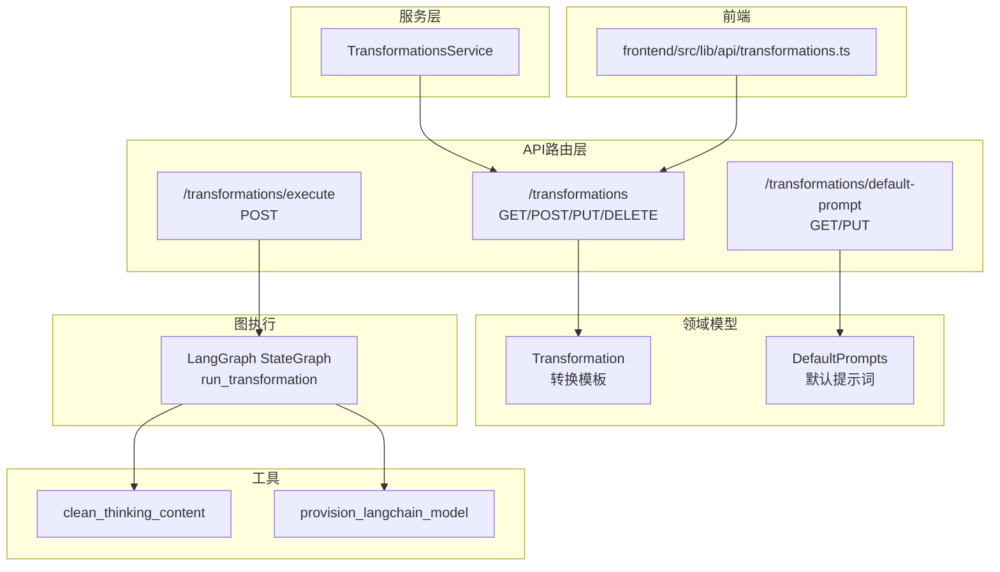
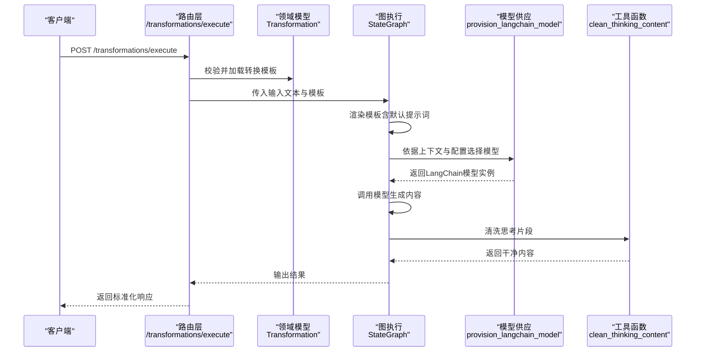
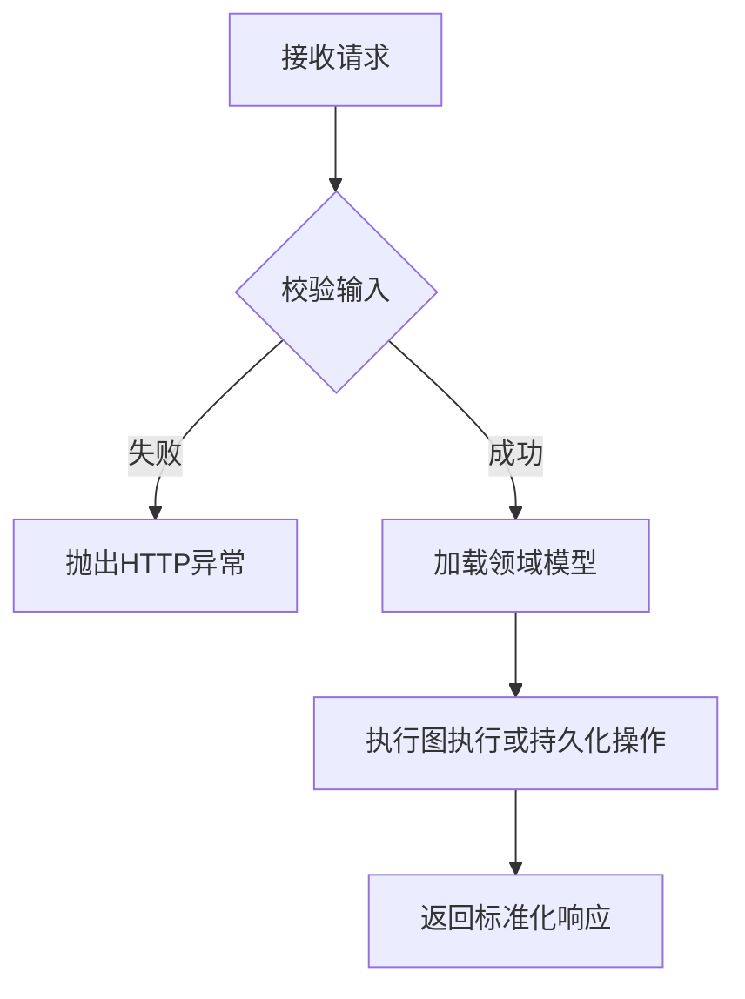
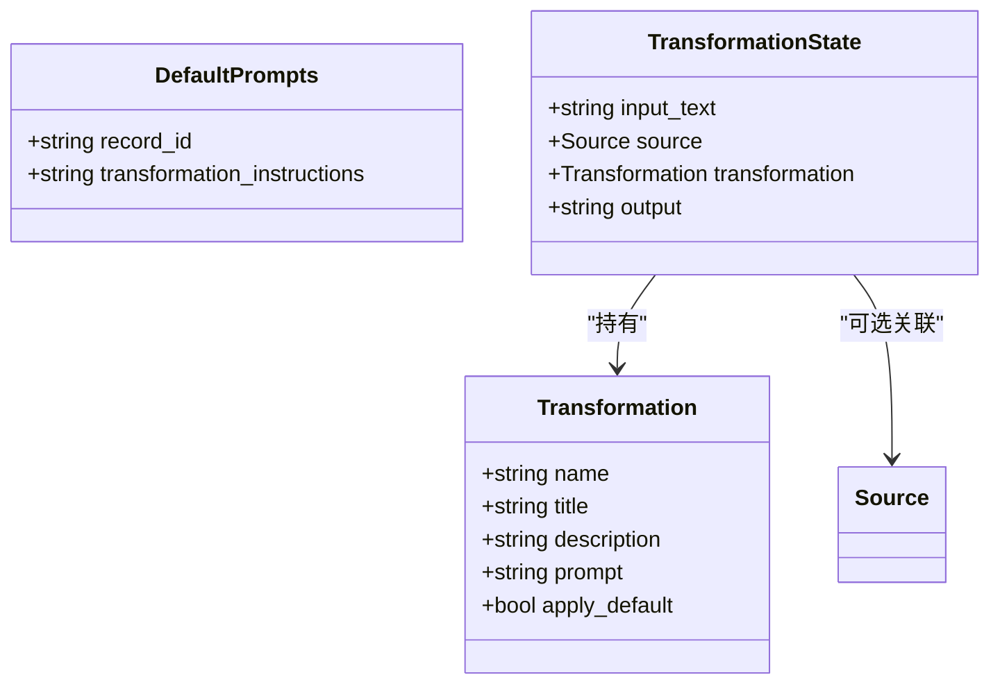
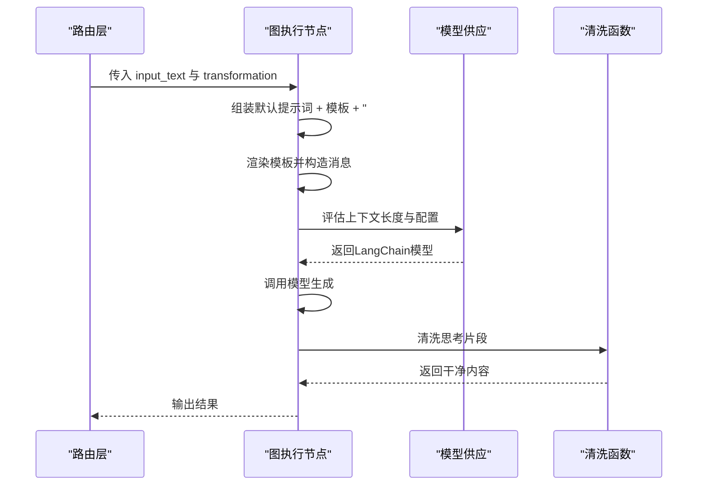
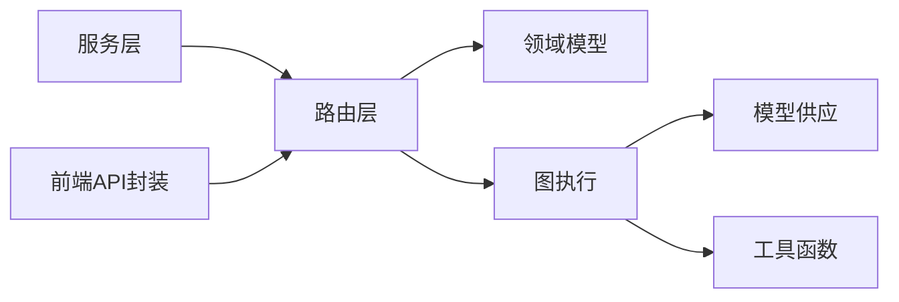

# 内容转换API

<cite>
**本文引用的文件**
- [api/routers/transformations.py](file://api/routers/transformations.py)
- [api/transformations_service.py](file://api/transformations_service.py)
- [open_notebook/domain/transformation.py](file://open_notebook/domain/transformation.py)
- [open_notebook/graphs/transformation.py](file://open_notebook/graphs/transformation.py)
- [api/models.py](file://api/models.py)
- [docs/3-USER-GUIDE/transformations.md](file://docs/3-USER-GUIDE/transformations.md)
- [open_notebook/utils/text_utils.py](file://open_notebook/utils/text_utils.py)
- [frontend/src/lib/api/transformations.ts](file://frontend/src/lib/api/transformations.ts)
- [open_notebook/ai/provision.py](file://open_notebook/ai/provision.py)
</cite>

## 目录
1. [简介](#简介)
2. [项目结构](#项目结构)
3. [核心组件](#核心组件)
4. [架构总览](#架构总览)
5. [详细组件分析](#详细组件分析)
6. [依赖关系分析](#依赖关系分析)
7. [性能考量](#性能考量)
8. [故障排查指南](#故障排查指南)
9. [结论](#结论)
10. [附录](#附录)

## 简介
本文件系统化梳理“内容转换API”的设计与实现，覆盖模板驱动的内容转换端点、转换规则的创建/编辑/删除、执行流程、默认提示词管理、以及在前端中的调用方式。文档还解释了转换模板的语法要点（变量替换、条件逻辑）、结果预览与测试思路、批量处理能力、转换历史与版本管理建议、性能监控关注点，以及如何开发与集成自定义转换器。

## 项目结构
围绕内容转换API的关键文件组织如下：
- 路由层：定义REST端点，负责请求校验、调用领域模型与图执行引擎
- 领域模型：描述转换模板与默认提示词的数据结构
- 图执行：LangGraph状态机编排，连接模板渲染与大模型推理
- 服务层：对外暴露统一的API调用封装
- 前端API封装：对后端端点进行类型化封装
- 工具函数：清洗AI输出中的思考片段，提升结果可读性
- 模型供应：根据上下文大小与配置选择合适的语言模型

图表来源
- [api/routers/transformations.py](file://api/routers/transformations.py#L23-L251)
- [open_notebook/domain/transformation.py](file://open_notebook/domain/transformation.py#L8-L22)
- [open_notebook/graphs/transformation.py](file://open_notebook/graphs/transformation.py#L13-L68)
- [api/transformations_service.py](file://api/transformations_service.py#L14-L142)
- [frontend/src/lib/api/transformations.ts](file://frontend/src/lib/api/transformations.ts#L11-L50)
- [open_notebook/utils/text_utils.py](file://open_notebook/utils/text_utils.py#L100-L120)
- [open_notebook/ai/provision.py](file://open_notebook/ai/provision.py#L9-L61)

章节来源
- [api/routers/transformations.py](file://api/routers/transformations.py#L23-L251)
- [open_notebook/domain/transformation.py](file://open_notebook/domain/transformation.py#L8-L22)
- [open_notebook/graphs/transformation.py](file://open_notebook/graphs/transformation.py#L13-L68)
- [api/transformations_service.py](file://api/transformations_service.py#L14-L142)
- [frontend/src/lib/api/transformations.ts](file://frontend/src/lib/api/transformations.ts#L11-L50)
- [open_notebook/utils/text_utils.py](file://open_notebook/utils/text_utils.py#L100-L120)
- [open_notebook/ai/provision.py](file://open_notebook/ai/provision.py#L9-L61)

## 核心组件
- 转换模板（Transformation）：包含名称、标题、描述、提示词与是否默认应用等字段
- 默认提示词（DefaultPrompts）：全局的转换指令，用于为模板注入通用上下文
- 图执行（LangGraph）：以状态机形式编排“模板渲染→模型推理→结果清洗→洞察落库”的流程
- 路由端点：提供查询、创建、更新、删除、执行与默认提示词管理
- 服务层封装：面向上层的统一调用接口
- 前端API封装：类型安全的HTTP客户端
- 工具函数：清洗AI输出中的思考片段，保证最终输出整洁

章节来源
- [open_notebook/domain/transformation.py](file://open_notebook/domain/transformation.py#L8-L22)
- [open_notebook/graphs/transformation.py](file://open_notebook/graphs/transformation.py#L13-L68)
- [api/routers/transformations.py](file://api/routers/transformations.py#L23-L251)
- [api/transformations_service.py](file://api/transformations_service.py#L14-L142)
- [frontend/src/lib/api/transformations.ts](file://frontend/src/lib/api/transformations.ts#L11-L50)
- [open_notebook/utils/text_utils.py](file://open_notebook/utils/text_utils.py#L100-L120)

## 架构总览
内容转换API采用“路由层-领域模型-图执行-工具函数”的分层设计。执行路径从HTTP请求进入，经由路由层校验与参数解析，调用领域模型与图执行引擎，最终返回标准化响应；默认提示词通过全局记录模型注入到模板中，形成可复用的上下文。

图表来源
- [api/routers/transformations.py](file://api/routers/transformations.py#L81-L117)
- [open_notebook/graphs/transformation.py](file://open_notebook/graphs/transformation.py#L20-L61)
- [open_notebook/ai/provision.py](file://open_notebook/ai/provision.py#L9-L61)
- [open_notebook/utils/text_utils.py](file://open_notebook/utils/text_utils.py#L100-L120)

## 详细组件分析

### 路由端点与数据模型
- 列表与详情：支持分页与排序的查询、按ID获取单个模板
- 创建与更新：支持部分字段更新，自动保存时间戳
- 删除：按ID删除模板
- 执行：校验模板与模型存在性，调用图执行引擎
- 默认提示词：获取与更新全局转换指令

图表来源
- [api/routers/transformations.py](file://api/routers/transformations.py#L23-L251)
- [api/models.py](file://api/models.py#L104-L171)

章节来源
- [api/routers/transformations.py](file://api/routers/transformations.py#L23-L251)
- [api/models.py](file://api/models.py#L104-L171)

### 领域模型与图执行
- 领域模型：Transformation与DefaultPrompts分别承载模板与默认提示词
- 图执行：StateGraph定义状态与节点，run_transformation完成模板渲染、消息构造、模型调用与结果清洗，并将洞察写回源

图表来源
- [open_notebook/domain/transformation.py](file://open_notebook/domain/transformation.py#L8-L22)
- [open_notebook/graphs/transformation.py](file://open_notebook/graphs/transformation.py#L13-L18)

章节来源
- [open_notebook/domain/transformation.py](file://open_notebook/domain/transformation.py#L8-L22)
- [open_notebook/graphs/transformation.py](file://open_notebook/graphs/transformation.py#L13-L68)

### 执行流程与模板语法
- 模板语法要点
  - 变量替换：模板渲染时使用状态字典（如输入文本、源对象、转换模板本身）进行变量替换
  - 条件逻辑：可在模板中嵌入条件分支（例如基于源对象是否存在），由渲染器在运行时决定拼接内容
  - 默认提示词注入：若存在默认提示词，会前置拼接到模板中，再追加“# INPUT”标记，确保模型明确区分系统提示与用户输入
- 执行流程
  - 路由层校验模板与模型
  - 图执行节点渲染模板并构造消息序列
  - 模型供应模块根据上下文长度与配置选择合适模型
  - 清洗思考片段，保留可读输出
  - 若存在源对象，将洞察写回源

图表来源
- [open_notebook/graphs/transformation.py](file://open_notebook/graphs/transformation.py#L20-L61)
- [open_notebook/ai/provision.py](file://open_notebook/ai/provision.py#L9-L61)
- [open_notebook/utils/text_utils.py](file://open_notebook/utils/text_utils.py#L100-L120)

章节来源
- [open_notebook/graphs/transformation.py](file://open_notebook/graphs/transformation.py#L20-L61)
- [open_notebook/ai/provision.py](file://open_notebook/ai/provision.py#L9-L61)
- [open_notebook/utils/text_utils.py](file://open_notebook/utils/text_utils.py#L100-L120)

### 前端调用与类型安全
- 前端通过封装好的API模块调用后端端点，涵盖列表、详情、创建、更新、删除与执行，默认提示词的获取与更新
- 类型定义来自后端Pydantic模型，确保前后端一致

章节来源
- [frontend/src/lib/api/transformations.ts](file://frontend/src/lib/api/transformations.ts#L11-L50)
- [api/models.py](file://api/models.py#L104-L171)

### 转换模板语法、变量替换与条件逻辑
- 语法要点
  - 使用模板渲染器进行变量替换，状态字典包含输入文本、源对象、转换模板
  - 在模板中可加入条件判断（如源对象存在与否），以动态拼接内容
  - 默认提示词作为全局上下文注入，增强一致性
- 实践建议
  - 明确格式要求（标题、编号、清单等）
  - 请求引用与页码，便于溯源
  - 控制输出长度，避免过长或过短
  - 先单源测试，再批量执行

章节来源
- [open_notebook/graphs/transformation.py](file://open_notebook/graphs/transformation.py#L20-L61)
- [docs/3-USER-GUIDE/transformations.md](file://docs/3-USER-GUIDE/transformations.md#L80-L131)

### 结果预览、测试与批量处理
- 预览与测试
  - 建议先在单个源上执行，检查输出质量与格式
  - 对不满足预期的模板进行迭代优化
- 批量处理
  - 支持多源并行处理，后台异步执行
  - 处理完成后为每个源生成一条笔记，便于后续编辑与归档

章节来源
- [docs/3-USER-GUIDE/transformations.md](file://docs/3-USER-GUIDE/transformations.md#L133-L166)

### 转换历史记录、版本管理与性能监控
- 历史记录与版本管理
  - 建议在模板层面维护变更日志，记录每次修改的意图与影响范围
  - 对于批量任务，建议引入命令ID与进度跟踪，便于回溯与重试
- 性能监控
  - 关注模型选择策略（上下文长度阈值、显式模型ID优先级）
  - 监控输出清洗开销与整体执行耗时
  - 对批量任务进行并发度与队列深度的调优

章节来源
- [open_notebook/ai/provision.py](file://open_notebook/ai/provision.py#L9-L61)
- [open_notebook/utils/text_utils.py](file://open_notebook/utils/text_utils.py#L100-L120)

### 自定义转换器的开发与集成
- 开发步骤
  - 设计模板：明确目标、格式、引用与长度约束
  - 编写提示词：包含系统提示与输入标记，必要时注入默认提示词
  - 测试验证：单源测试，逐步完善
  - 批量上线：小范围验证后再扩大规模
- 集成要点
  - 保持模板可读性与可维护性
  - 与默认提示词协同，确保上下文一致性
  - 通过图执行节点扩展更多状态与处理逻辑（如多轮对话、条件分支）

章节来源
- [open_notebook/graphs/transformation.py](file://open_notebook/graphs/transformation.py#L13-L68)
- [docs/3-USER-GUIDE/transformations.md](file://docs/3-USER-GUIDE/transformations.md#L80-L131)

## 依赖关系分析
- 路由层依赖领域模型与图执行引擎
- 图执行依赖模型供应与工具函数
- 服务层与前端API封装均依赖路由层提供的端点

图表来源
- [api/routers/transformations.py](file://api/routers/transformations.py#L23-L251)
- [open_notebook/graphs/transformation.py](file://open_notebook/graphs/transformation.py#L13-L68)
- [open_notebook/ai/provision.py](file://open_notebook/ai/provision.py#L9-L61)
- [open_notebook/utils/text_utils.py](file://open_notebook/utils/text_utils.py#L100-L120)
- [api/transformations_service.py](file://api/transformations_service.py#L14-L142)
- [frontend/src/lib/api/transformations.ts](file://frontend/src/lib/api/transformations.ts#L11-L50)

章节来源
- [api/routers/transformations.py](file://api/routers/transformations.py#L23-L251)
- [open_notebook/graphs/transformation.py](file://open_notebook/graphs/transformation.py#L13-L68)
- [open_notebook/ai/provision.py](file://open_notebook/ai/provision.py#L9-L61)
- [open_notebook/utils/text_utils.py](file://open_notebook/utils/text_utils.py#L100-L120)
- [api/transformations_service.py](file://api/transformations_service.py#L14-L142)
- [frontend/src/lib/api/transformations.ts](file://frontend/src/lib/api/transformations.ts#L11-L50)

## 性能考量
- 上下文长度与模型选择：当输入内容超过阈值时自动切换大上下文模型，避免截断
- 并发与批处理：批量执行时建议控制并发度，结合进度与错误重试机制
- 输出清洗：对思考片段进行清洗，减少冗余内容，提高用户体验
- 日志与可观测性：在关键路径记录模型选择原因与耗时，便于定位瓶颈

章节来源
- [open_notebook/ai/provision.py](file://open_notebook/ai/provision.py#L9-L61)
- [open_notebook/utils/text_utils.py](file://open_notebook/utils/text_utils.py#L100-L120)

## 故障排查指南
- 常见问题
  - 通用输出：提示词不够具体，建议增加格式与引用要求
  - 缺失信息：未明确要求某些细节，需在模板中显式列出
  - 格式不一致：模板中加入清晰的格式指令
  - 输出过长/过短：明确字数或段落数限制
  - 执行失败：检查源是否已完全处理、尝试简化模板或单独处理
- 错误处理
  - 路由层对不存在的模板与模型返回404
  - 输入校验失败返回400
  - 其他异常统一返回500并记录日志

章节来源
- [api/routers/transformations.py](file://api/routers/transformations.py#L81-L117)
- [docs/3-USER-GUIDE/transformations.md](file://docs/3-USER-GUIDE/transformations.md#L334-L363)

## 结论
内容转换API以模板驱动为核心，结合默认提示词与LangGraph状态机，实现了从单一到批量的高效内容处理。通过清晰的端点设计、类型化的数据模型与工具函数，系统在易用性与可扩展性之间取得平衡。建议在生产环境中配合版本管理、性能监控与完善的测试流程，持续优化模板质量与执行效率。

## 附录
- 快速参考
  - 获取所有模板：GET /transformations
  - 获取单个模板：GET /transformations/{id}
  - 创建模板：POST /transformations
  - 更新模板：PUT /transformations/{id}
  - 删除模板：DELETE /transformations/{id}
  - 执行转换：POST /transformations/execute
  - 获取默认提示词：GET /transformations/default-prompt
  - 更新默认提示词：PUT /transformations/default-prompt

章节来源
- [api/routers/transformations.py](file://api/routers/transformations.py#L23-L251)
- [api/models.py](file://api/models.py#L104-L171)