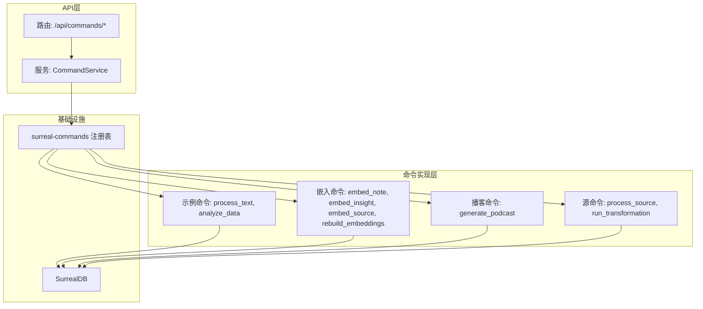
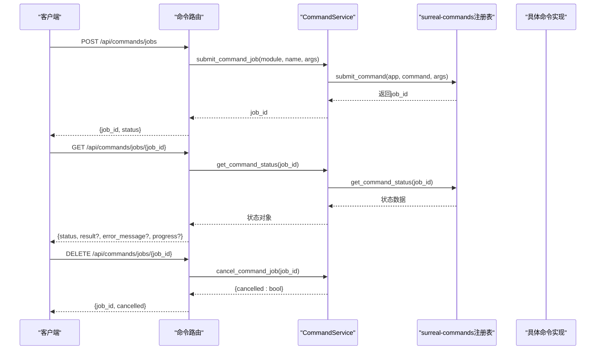
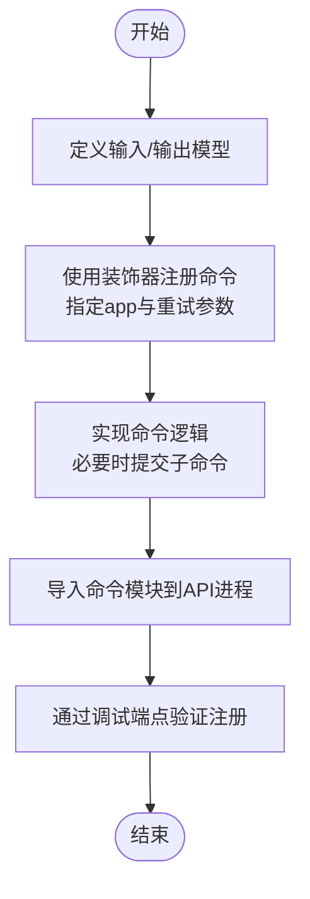
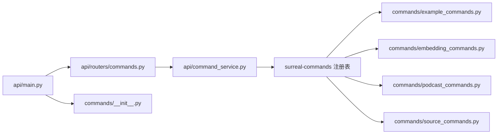

# 命令系统API

<cite>
**本文档引用的文件**
- [api/routers/commands.py](file://api/routers/commands.py)
- [api/command_service.py](file://api/command_service.py)
- [api/main.py](file://api/main.py)
- [commands/__init__.py](file://commands/__init__.py)
- [commands/example_commands.py](file://commands/example_commands.py)
- [commands/embedding_commands.py](file://commands/embedding_commands.py)
- [commands/podcast_commands.py](file://commands/podcast_commands.py)
- [commands/source_commands.py](file://commands/source_commands.py)
- [docs/5-CONFIGURATION/environment-reference.md](file://docs/5-CONFIGURATION/environment-reference.md)
- [docs/5-CONFIGURATION/advanced.md](file://docs/5-CONFIGURATION/advanced.md)
- [frontend/src/lib/api/insights.ts](file://frontend/src/lib/api/insights.ts)
</cite>

## 目录
1. [简介](#简介)
2. [项目结构](#项目结构)
3. [核心组件](#核心组件)
4. [架构总览](#架构总览)
5. [详细组件分析](#详细组件分析)
6. [依赖关系分析](#依赖关系分析)
7. [性能考虑](#性能考虑)
8. [故障排查指南](#故障排查指南)
9. [结论](#结论)
10. [附录](#附录)

## 简介
本文件面向使用与扩展异步命令系统的开发者与运维人员，系统性梳理命令提交、执行、状态查询与取消的API端点；解释命令队列管理、优先级与并发控制策略；详述进度跟踪、错误重试与超时处理机制；覆盖命令日志记录、审计跟踪与性能监控能力，并提供自定义命令的开发与注册流程。

## 项目结构
命令系统由三层组成：
- 路由层：提供REST API端点，负责请求校验与响应封装
- 服务层：封装命令提交、状态查询、列表与取消等操作
- 命令实现层：具体业务命令（文本处理、嵌入重建、播客生成、源处理等）

图表来源
- [api/routers/commands.py](file://api/routers/commands.py#L1-L167)
- [api/command_service.py](file://api/command_service.py#L1-L93)
- [commands/example_commands.py](file://commands/example_commands.py#L1-L143)
- [commands/embedding_commands.py](file://commands/embedding_commands.py#L1-L787)
- [commands/podcast_commands.py](file://commands/podcast_commands.py#L1-L188)
- [commands/source_commands.py](file://commands/source_commands.py#L1-L269)

章节来源
- [api/routers/commands.py](file://api/routers/commands.py#L1-L167)
- [api/command_service.py](file://api/command_service.py#L1-L93)
- [api/main.py](file://api/main.py#L1-L190)
- [commands/__init__.py](file://commands/__init__.py#L1-L25)

## 核心组件
- 路由器：定义命令相关的HTTP端点，包括提交、状态查询、作业列表与取消
- 服务层：封装与surreal-commands交互，负责命令提交、状态获取、列表与取消
- 命令实现：通过装饰器注册到surreal-commands注册表，支持重试、进度与上下文传递

章节来源
- [api/routers/commands.py](file://api/routers/commands.py#L1-L167)
- [api/command_service.py](file://api/command_service.py#L1-L93)
- [commands/example_commands.py](file://commands/example_commands.py#L1-L143)
- [commands/embedding_commands.py](file://commands/embedding_commands.py#L1-L787)
- [commands/podcast_commands.py](file://commands/podcast_commands.py#L1-L188)
- [commands/source_commands.py](file://commands/source_commands.py#L1-L269)

## 架构总览
命令从API提交后，经服务层调用surreal-commands提交至注册表，后台执行器按注册表调度执行。客户端通过状态查询端点轮询或一次性查询结果。

图表来源
- [api/routers/commands.py](file://api/routers/commands.py#L37-L119)
- [api/command_service.py](file://api/command_service.py#L11-L92)

## 详细组件分析

### API端点定义
- 提交命令
  - 方法与路径：POST /api/commands/jobs
  - 请求体：包含命令名、应用名与输入参数
  - 响应：返回job_id与提交状态
- 查询命令状态
  - 方法与路径：GET /api/commands/jobs/{job_id}
  - 响应：包含状态、结果、错误消息、时间戳与进度
- 列出命令作业
  - 方法与路径：GET /api/commands/jobs
  - 查询参数：command_filter、status_filter、limit
  - 响应：作业列表（当前基础阶段返回空列表）
- 取消命令作业
  - 方法与路径：DELETE /api/commands/jobs/{job_id}
  - 响应：返回取消结果布尔值
- 调试注册表
  - 方法与路径：GET /api/commands/registry/debug
  - 响应：注册的命令清单与分组

章节来源
- [api/routers/commands.py](file://api/routers/commands.py#L37-L167)

### 服务层逻辑
- 提交命令：确保命令模块导入后，调用surreal-commands提交，返回job_id
- 获取状态：封装状态查询，统一输出字段（含progress）
- 列出作业：预留接口，当前返回空列表
- 取消作业：记录尝试，返回成功标记（具体实现取决于底层支持）

章节来源
- [api/command_service.py](file://api/command_service.py#L1-L93)

### 命令注册与实现
- 示例命令：process_text、analyze_data，演示输入/输出模型与基本错误处理
- 嵌入命令：embed_note、embed_insight、embed_source、rebuild_embeddings，支持重试策略与批量处理
- 播客命令：generate_podcast，集成外部库与数据库持久化
- 源命令：process_source、run_transformation，基于图工作流与事务隔离

章节来源
- [commands/example_commands.py](file://commands/example_commands.py#L1-L143)
- [commands/embedding_commands.py](file://commands/embedding_commands.py#L1-L787)
- [commands/podcast_commands.py](file://commands/podcast_commands.py#L1-L188)
- [commands/source_commands.py](file://commands/source_commands.py#L1-L269)
- [commands/__init__.py](file://commands/__init__.py#L1-L25)

### 进度跟踪与状态模型
- 状态字段：job_id、status、result、error_message、created、updated、progress
- 进度字段：可选，用于承载命令内部的进度信息（如批处理完成数、总任务数）

章节来源
- [api/routers/commands.py](file://api/routers/commands.py#L27-L35)
- [api/command_service.py](file://api/command_service.py#L47-L68)

### 错误重试与超时处理
- 重试策略：通过装饰器参数配置最大重试次数、等待策略（指数抖动/指数/固定/随机）、最小/最大等待时间、停止条件与日志级别
- 超时配置：通过环境变量控制API客户端超时与LLM推理超时
- 冲突处理：在高并发下使用指数抖动避免“惊群效应”，并结合重试上限

章节来源
- [commands/embedding_commands.py](file://commands/embedding_commands.py#L120-L131)
- [commands/embedding_commands.py](file://commands/embedding_commands.py#L212-L223)
- [commands/embedding_commands.py](file://commands/embedding_commands.py#L306-L317)
- [commands/source_commands.py](file://commands/source_commands.py#L48-L59)
- [commands/source_commands.py](file://commands/source_commands.py#L179-L190)
- [docs/5-CONFIGURATION/environment-reference.md](file://docs/5-CONFIGURATION/environment-reference.md#L34-L51)
- [docs/5-CONFIGURATION/advanced.md](file://docs/5-CONFIGURATION/advanced.md#L25-L57)

### 并发控制与队列管理
- 最大并发：通过环境变量控制命令执行的最大并发任务数
- 队列行为：surreal-commands根据注册表与并发限制调度执行
- 批量处理：嵌入重建命令会批量提交子任务，实际执行异步进行

章节来源
- [docs/5-CONFIGURATION/environment-reference.md](file://docs/5-CONFIGURATION/environment-reference.md#L46-L51)
- [commands/embedding_commands.py](file://commands/embedding_commands.py#L621-L787)

### 日志记录、审计与监控
- 日志：Python侧使用loguru记录命令提交、状态查询、错误与调试信息
- 调试：/api/commands/registry/debug端点列出已注册命令与分组
- 监控：可通过LangSmith开启链路追踪，结合前端轮询命令状态实现用户态监控

章节来源
- [api/routers/commands.py](file://api/routers/commands.py#L122-L167)
- [api/command_service.py](file://api/command_service.py#L1-L93)
- [docs/5-CONFIGURATION/environment-reference.md](file://docs/5-CONFIGURATION/environment-reference.md#L120-L131)
- [frontend/src/lib/api/insights.ts](file://frontend/src/lib/api/insights.ts#L54-L94)

### 自定义命令开发与注册流程
- 步骤
  1) 在命令模块中定义Pydantic输入/输出模型
  2) 使用装饰器注册命令（指定app与可选重试参数）
  3) 在命令函数内实现业务逻辑，必要时提交子命令
  4) 将命令模块导入到API进程（main.py中已显式导入）
- 注意事项
  - 输入/输出模型需可序列化
  - 合理设置重试策略以应对瞬时失败
  - 记录关键事件与错误以便审计与排障

图表来源
- [api/main.py](file://api/main.py#L40-L45)
- [commands/example_commands.py](file://commands/example_commands.py#L43-L92)
- [commands/embedding_commands.py](file://commands/embedding_commands.py#L120-L131)
- [commands/source_commands.py](file://commands/source_commands.py#L48-L59)
- [commands/podcast_commands.py](file://commands/podcast_commands.py#L49-L49)

章节来源
- [api/main.py](file://api/main.py#L40-L45)
- [commands/example_commands.py](file://commands/example_commands.py#L1-L143)
- [commands/embedding_commands.py](file://commands/embedding_commands.py#L1-L787)
- [commands/source_commands.py](file://commands/source_commands.py#L1-L269)
- [commands/podcast_commands.py](file://commands/podcast_commands.py#L1-L188)

## 依赖关系分析
- 路由依赖服务层，服务层依赖surreal-commands与注册表
- 命令实现依赖领域模型与数据库访问工具
- API进程启动时导入命令模块，确保注册表在运行时可用

图表来源
- [api/routers/commands.py](file://api/routers/commands.py#L1-L167)
- [api/command_service.py](file://api/command_service.py#L1-L93)
- [api/main.py](file://api/main.py#L1-L190)
- [commands/__init__.py](file://commands/__init__.py#L1-L25)

章节来源
- [api/routers/commands.py](file://api/routers/commands.py#L1-L167)
- [api/command_service.py](file://api/command_service.py#L1-L93)
- [api/main.py](file://api/main.py#L1-L190)
- [commands/__init__.py](file://commands/__init__.py#L1-L25)

## 性能考虑
- 并发控制：通过环境变量调节最大并发任务数，平衡吞吐与冲突
- 重试策略：推荐指数抖动，降低同时重试导致的系统压力
- 超时设置：确保API客户端超时大于LLM推理超时，留足缓冲
- 批量处理：对大规模数据采用批量提交与分批处理，减少单次负载峰值

章节来源
- [docs/5-CONFIGURATION/environment-reference.md](file://docs/5-CONFIGURATION/environment-reference.md#L34-L51)
- [docs/5-CONFIGURATION/advanced.md](file://docs/5-CONFIGURATION/advanced.md#L7-L57)

## 故障排查指南
- 提交失败：检查命令模块是否正确导入，确认注册表中有对应命令
- 状态查询异常：确认job_id有效，关注error_message与progress字段
- 取消无效：当前实现为占位，具体支持取决于底层框架
- 高并发冲突：调整并发与重试策略，观察指数抖动效果
- 日志与追踪：启用详细日志与LangSmith追踪，定位问题根因

章节来源
- [api/command_service.py](file://api/command_service.py#L1-L93)
- [docs/5-CONFIGURATION/environment-reference.md](file://docs/5-CONFIGURATION/environment-reference.md#L120-L131)
- [frontend/src/lib/api/insights.ts](file://frontend/src/lib/api/insights.ts#L54-L94)

## 结论
该命令系统以surreal-commands为核心，提供统一的命令注册、提交、状态查询与取消能力。通过可配置的重试、超时与并发策略，满足不同场景下的可靠性与性能需求。建议在生产环境中结合日志与链路追踪，持续优化并发与重试参数，并通过调试端点与前端轮询实现可观测性。

## 附录

### API端点一览
- 提交命令
  - 方法：POST
  - 路径：/api/commands/jobs
  - 请求体字段：command、app、input
  - 响应字段：job_id、status、message
- 查询命令状态
  - 方法：GET
  - 路径：/api/commands/jobs/{job_id}
  - 响应字段：job_id、status、result、error_message、created、updated、progress
- 列出命令作业
  - 方法：GET
  - 路径：/api/commands/jobs
  - 查询参数：command_filter、status_filter、limit
  - 响应：作业列表（基础阶段为空）
- 取消命令作业
  - 方法：DELETE
  - 路径：/api/commands/jobs/{job_id}
  - 响应：{job_id, cancelled}
- 调试注册表
  - 方法：GET
  - 路径：/api/commands/registry/debug
  - 响应：总命令数、按应用分组的命令列表与明细

章节来源
- [api/routers/commands.py](file://api/routers/commands.py#L37-L167)