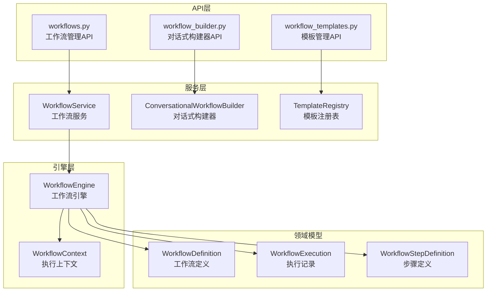
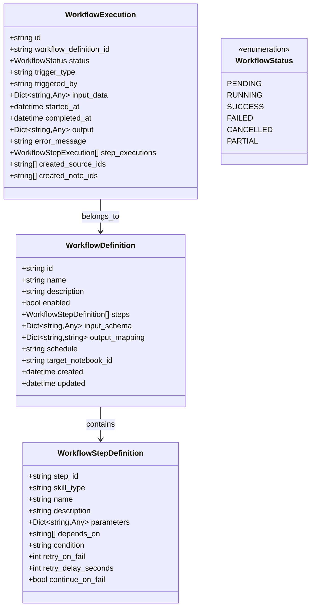
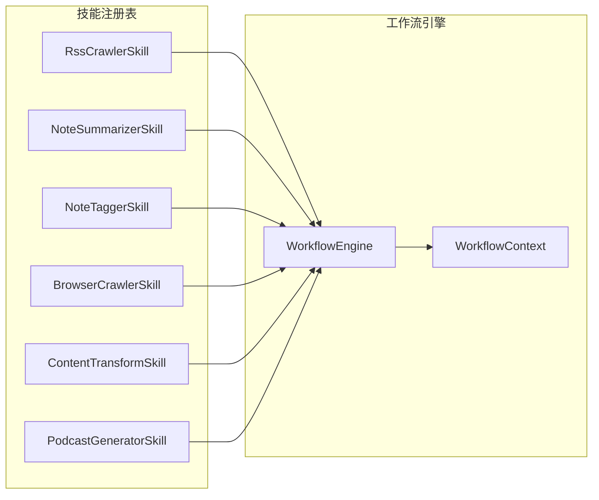
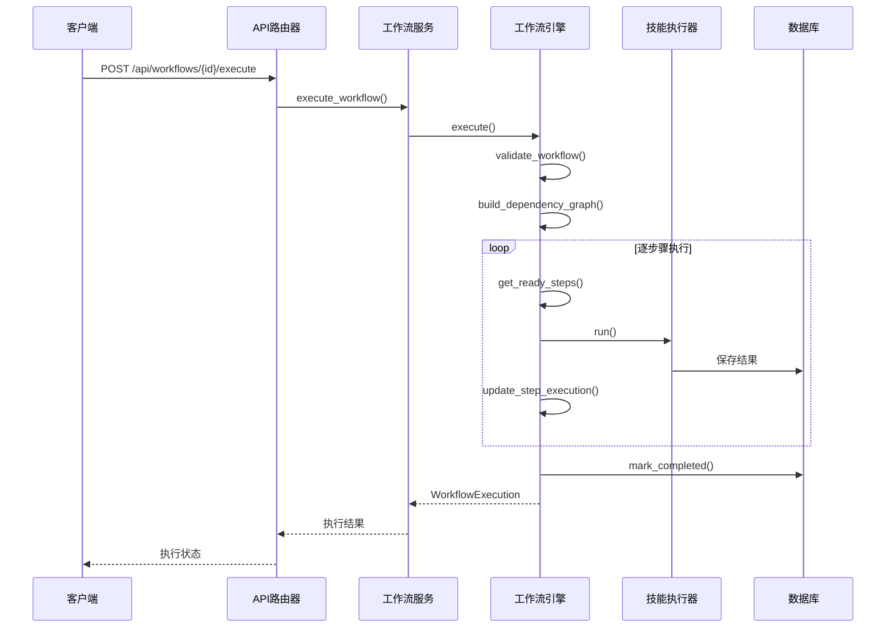
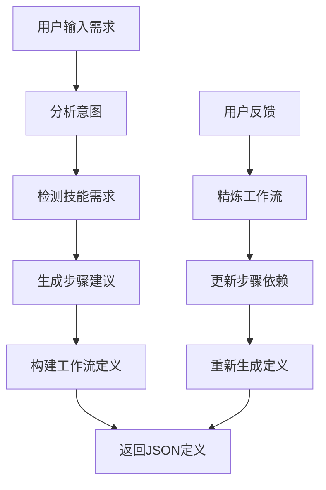
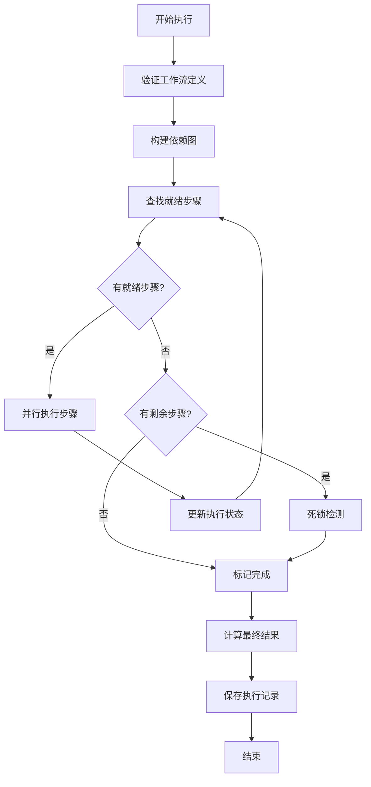
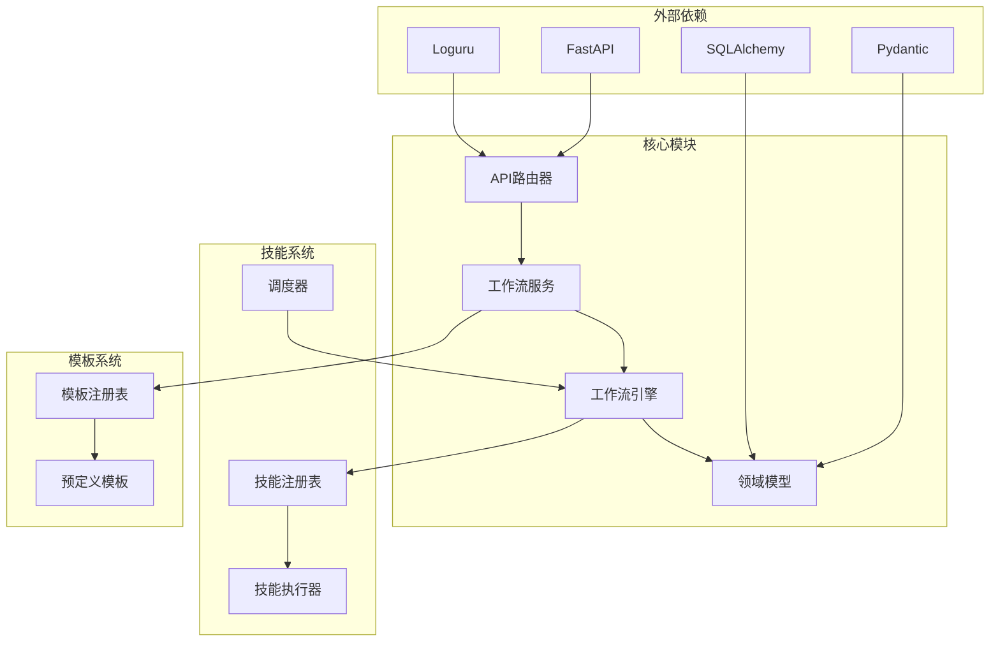

# 工作流API接口

<cite>
**本文档引用的文件**
- [api/routers/workflows.py](file://api/routers/workflows.py)
- [api/routers/workflow_builder.py](file://api/routers/workflow_builder.py)
- [api/routers/workflow_templates.py](file://api/routers/workflow_templates.py)
- [open_notebook/workflows/engine.py](file://open_notebook/workflows/engine.py)
- [open_notebook/workflows/service.py](file://open_notebook/workflows/service.py)
- [open_notebook/domain/workflow.py](file://open_notebook/domain/workflow.py)
- [open_notebook/workflows/templates.py](file://open_notebook/workflows/templates.py)
- [open_notebook/workflows/conversational.py](file://open_notebook/workflows/conversational.py)
- [open_notebook/skills/__init__.py](file://open_notebook/skills/__init__.py)
- [api/main.py](file://api/main.py)
</cite>

## 目录
1. [简介](#简介)
2. [项目结构](#项目结构)
3. [核心组件](#核心组件)
4. [架构概览](#架构概览)
5. [详细组件分析](#详细组件分析)
6. [依赖关系分析](#依赖关系分析)
7. [性能考虑](#性能考虑)
8. [故障排除指南](#故障排除指南)
9. [结论](#结论)

## 简介

Open Notebook 的工作流API接口提供了一个完整的自动化工作流管理系统，允许用户创建、执行和管理复杂的内容处理管道。该系统基于技能（Skills）的概念，通过可配置的工作流定义来协调多个自动化任务的执行。

工作流系统支持：
- 自然语言到工作流的转换
- 预构建的工作流模板
- 可视化的对话式工作流构建器
- 基于时间的调度执行
- 完整的执行历史跟踪
- 错误处理和重试机制

## 项目结构

工作流相关的代码主要分布在以下几个模块中：

**图表来源**
- [api/routers/workflows.py](file://api/routers/workflows.py#L1-L453)
- [open_notebook/workflows/service.py](file://open_notebook/workflows/service.py#L22-L240)
- [open_notebook/workflows/engine.py](file://open_notebook/workflows/engine.py#L130-L620)

**章节来源**
- [api/routers/workflows.py](file://api/routers/workflows.py#L1-L453)
- [api/routers/workflow_builder.py](file://api/routers/workflow_builder.py#L1-L305)
- [api/routers/workflow_templates.py](file://api/routers/workflow_templates.py#L1-L215)

## 核心组件

### 工作流定义模型

工作流系统的核心是基于Pydantic的数据模型，提供了强类型的安全性和自动验证：

**图表来源**
- [open_notebook/domain/workflow.py](file://open_notebook/domain/workflow.py#L68-L309)

### 技能系统集成

工作流系统通过技能注册表与各种自动化技能集成：

**图表来源**
- [open_notebook/skills/__init__.py](file://open_notebook/skills/__init__.py#L12-L52)
- [open_notebook/workflows/engine.py](file://open_notebook/workflows/engine.py#L416-L511)

**章节来源**
- [open_notebook/domain/workflow.py](file://open_notebook/domain/workflow.py#L19-L309)
- [open_notebook/skills/__init__.py](file://open_notebook/skills/__init__.py#L1-L53)

## 架构概览

工作流API采用分层架构设计，确保了清晰的关注点分离和良好的可扩展性：

**图表来源**
- [api/routers/workflows.py](file://api/routers/workflows.py#L272-L294)
- [open_notebook/workflows/service.py](file://open_notebook/workflows/service.py#L116-L142)
- [open_notebook/workflows/engine.py](file://open_notebook/workflows/engine.py#L144-L203)

## 详细组件分析

### 工作流管理API

工作流管理API提供了完整的工作流生命周期管理功能：

#### CRUD操作

| 操作 | 端点 | 方法 | 功能描述 |
|------|------|------|----------|
| 列出工作流 | `/api/workflows` | GET | 获取所有工作流定义 |
| 创建工作流 | `/api/workflows` | POST | 创建新的工作流定义 |
| 获取工作流 | `/api/workflows/{workflow_id}` | GET | 获取特定工作流定义 |
| 更新工作流 | `/api/workflows/{workflow_id}` | PATCH | 更新工作流定义 |
| 删除工作流 | `/api/workflows/{workflow_id}` | DELETE | 删除工作流定义 |
| 复制工作流 | `/api/workflows/{workflow_id}/duplicate` | POST | 复制现有工作流 |

#### 执行管理

| 操作 | 端点 | 方法 | 功能描述 |
|------|------|------|----------|
| 执行工作流 | `/api/workflows/{workflow_id}/execute` | POST | 手动执行工作流 |
| 列出执行记录 | `/api/workflows/executions` | GET | 获取执行历史 |
| 获取执行详情 | `/api/workflows/executions/{execution_id}` | GET | 获取特定执行详情 |
| 取消执行 | `/api/workflows/executions/{execution_id}/cancel` | POST | 取消运行中的执行 |

#### 统计信息

| 操作 | 端点 | 方法 | 功能描述 |
|------|------|------|----------|
| 工作流统计 | `/api/workflows/{workflow_id}/stats` | GET | 获取特定工作流统计 |
| 总体统计 | `/api/workflows/stats/overview` | GET | 获取所有工作流总体统计 |

**章节来源**
- [api/routers/workflows.py](file://api/routers/workflows.py#L199-L453)

### 对话式工作流构建器

对话式构建器允许用户通过自然语言描述来创建工作流：

**图表来源**
- [open_notebook/workflows/conversational.py](file://open_notebook/workflows/conversational.py#L122-L183)

#### 主要功能

1. **自然语言理解**：使用AI模型理解用户需求
2. **技能匹配**：根据需求自动推荐合适的技能组合
3. **依赖关系构建**：自动生成步骤间的依赖关系
4. **参数映射**：建立输入参数与步骤参数的映射
5. **工作流验证**：确保生成的工作流定义有效

**章节来源**
- [api/routers/workflow_builder.py](file://api/routers/workflow_builder.py#L84-L143)
- [open_notebook/workflows/conversational.py](file://open_notebook/workflows/conversational.py#L104-L345)

### 工作流模板系统

模板系统提供了预构建的工作流解决方案：

#### 模板分类

| 分类 | 模板ID | 描述 | 典型用途 |
|------|--------|------|----------|
| 内容监控 | `rss_to_notes` | RSS订阅到笔记 | 新闻聚合、内容监控 |
| 内容创作 | `content_repurpose` | 内容多平台适配 | 社交媒体内容生成 |
| 竞争对手监控 | `competitor_monitor` | 网站变更监控 | 市场情报收集 |
| 内容组织 | `auto_organize` | 笔记本自动整理 | 内容归档、标签化 |
| 研究摘要 | `research_digest` | 周度研究摘要 | 学术研究总结 |
| Vikki内容策略 | `vikki_content_pipeline` | 四象限内容策略 | IP内容运营 |
| 播客制作 | `podcast_from_sources` | 源内容播客生成 | 音频内容生产 |

#### 模板特点

每个模板都包含：
- **步骤定义**：明确的执行顺序和依赖关系
- **输入模式**：定义工作流需要的参数
- **输出映射**：标准化的结果格式
- **条件逻辑**：错误处理和条件执行

**章节来源**
- [api/routers/workflow_templates.py](file://api/routers/workflow_templates.py#L87-L153)
- [open_notebook/workflows/templates.py](file://open_notebook/workflows/templates.py#L54-L634)

### 工作流执行引擎

工作流执行引擎是整个系统的核心，负责协调技能的执行：

**图表来源**
- [open_notebook/workflows/engine.py](file://open_notebook/workflows/engine.py#L205-L298)

#### 关键特性

1. **依赖管理**：自动解析步骤间的依赖关系
2. **并行执行**：支持无依赖步骤的并发执行
3. **错误处理**：提供重试机制和错误恢复
4. **状态跟踪**：完整记录每个步骤的执行状态
5. **资源管理**：跟踪创建的源内容和笔记

**章节来源**
- [open_notebook/workflows/engine.py](file://open_notebook/workflows/engine.py#L130-L620)

## 依赖关系分析

工作流系统采用了清晰的依赖层次结构：

**图表来源**
- [api/main.py](file://api/main.py#L104-L120)

### 耦合度分析

- **低耦合**：API层与业务逻辑层分离良好
- **高内聚**：每个模块专注于特定的功能领域
- **清晰边界**：各层之间的职责划分明确

### 循环依赖

系统设计避免了循环依赖：
- API层不直接依赖业务逻辑
- 业务逻辑不依赖具体的API实现
- 技能系统独立于工作流系统

**章节来源**
- [api/main.py](file://api/main.py#L1-L232)

## 性能考虑

### 并行执行优化

工作流引擎支持步骤级别的并行执行，通过以下机制优化性能：

1. **依赖图构建**：在执行前构建完整的依赖关系图
2. **就绪步骤识别**：批量识别可以同时执行的步骤
3. **异步执行**：使用asyncio实现非阻塞的技能调用

### 缓存策略

- **模板缓存**：预定义模板在内存中缓存
- **技能元数据缓存**：技能注册表信息缓存
- **执行历史缓存**：常用查询结果缓存

### 错误处理

- **重试机制**：可配置的失败重试策略
- **超时控制**：防止长时间阻塞
- **资源清理**：异常情况下的资源释放

## 故障排除指南

### 常见问题

#### 工作流执行失败

**症状**：工作流状态显示为FAILED

**排查步骤**：
1. 检查步骤依赖关系是否正确
2. 验证技能参数配置
3. 查看具体步骤的错误信息
4. 检查网络连接和API密钥

#### 死锁问题

**症状**：工作流卡在PENDING或RUNNING状态

**原因分析**：
- 步骤间存在循环依赖
- 条件表达式导致步骤无法满足
- 依赖的前置步骤始终失败

#### 性能问题

**症状**：工作流执行时间过长

**优化建议**：
- 减少不必要的步骤
- 使用并行执行步骤
- 优化技能参数配置
- 检查数据库性能

**章节来源**
- [open_notebook/workflows/engine.py](file://open_notebook/workflows/engine.py#L234-L248)

### 调试工具

1. **执行历史查看**：通过API端点查看详细的执行日志
2. **状态监控**：实时监控工作流执行状态
3. **错误追踪**：定位具体的失败步骤和原因
4. **性能分析**：分析执行时间和资源使用

## 结论

Open Notebook的工作流API接口提供了一个强大而灵活的自动化工作流管理系统。通过模块化的设计和清晰的分层架构，系统能够：

- **简化复杂流程**：将复杂的多步骤任务分解为可管理的工作流
- **提高效率**：通过并行执行和智能调度提升整体性能
- **增强可靠性**：完善的错误处理和重试机制确保任务成功完成
- **保持可扩展性**：模块化设计支持新技能和新功能的添加

该系统特别适合内容创作者、研究人员和企业用户，为他们提供了从内容收集、处理到发布的完整自动化解决方案。通过预定义模板和对话式构建器，即使是技术背景有限的用户也能轻松创建复杂的工作流。

未来的发展方向包括：
- 更丰富的技能生态系统
- 更智能的工作流优化算法
- 更强大的监控和调试工具
- 更灵活的调度和触发机制