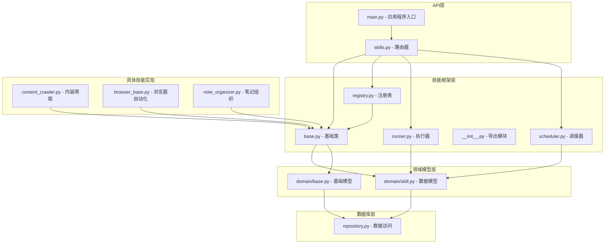
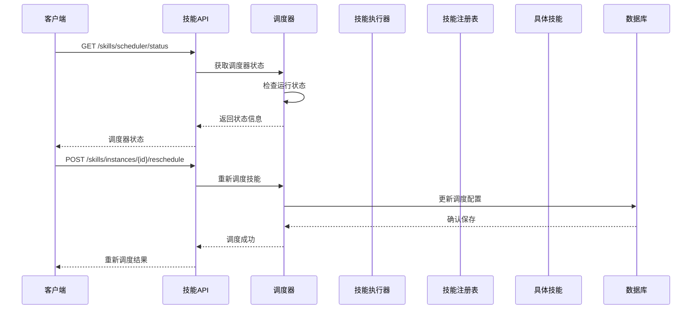
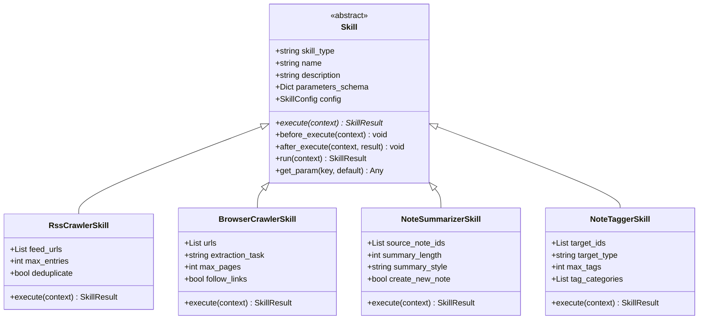
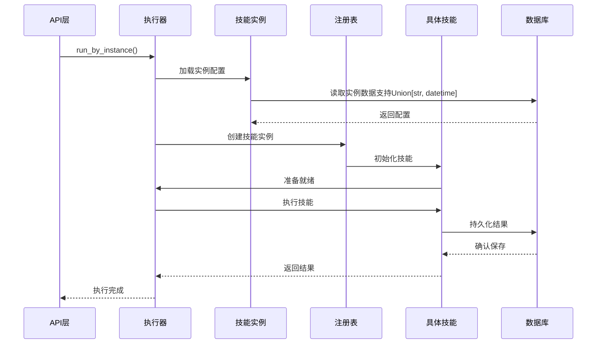
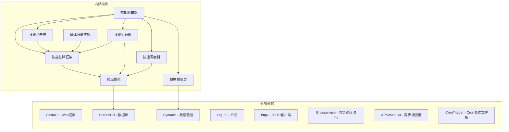

# 技能系统API

<cite>
**本文档引用的文件**
- [api/routers/skills.py](file://api/routers/skills.py)
- [open_notebook/skills/__init__.py](file://open_notebook/skills/__init__.py)
- [open_notebook/skills/base.py](file://open_notebook/skills/base.py)
- [open_notebook/skills/registry.py](file://open_notebook/skills/registry.py)
- [open_notebook/skills/runner.py](file://open_notebook/skills/runner.py)
- [open_notebook/skills/scheduler.py](file://open_notebook/skills/scheduler.py)
- [open_notebook/domain/skill.py](file://open_notebook/domain/skill.py)
- [open_notebook/skills/content_crawler.py](file://open_notebook/skills/content_crawler.py)
- [open_notebook/skills/browser_base.py](file://open_notebook/skills/browser_base.py)
- [open_notebook/skills/note_organizer.py](file://open_notebook/skills/note_organizer.py)
- [api/main.py](file://api/main.py)
- [docs/7-DEVELOPMENT/api-reference.md](file://docs/7-DEVELOPMENT/api-reference.md)
- [open_notebook/database/repository.py](file://open_notebook/database/repository.py)
- [open_notebook/domain/base.py](file://open_notebook/domain/base.py)
</cite>

## 更新摘要
**变更内容**
- 新增调度器管理API端点：/skills/scheduler/status、/skills/instances/{instance_id}/schedule、/skills/instances/{instance_id}/reschedule
- 添加调度器状态监控功能，支持获取调度器运行状态和已安排作业列表
- 实现技能调度管理功能，支持查询技能实例的调度信息和手动重新调度
- 集成APScheduler作为异步调度器，支持Cron表达式定时执行
- 增强了技能系统的自动化执行能力，提供完整的调度生命周期管理

## 目录
1. [简介](#简介)
2. [项目结构](#项目结构)
3. [核心组件](#核心组件)
4. [架构概览](#架构概览)
5. [详细组件分析](#详细组件分析)
6. [调度器API端点](#调度器api端点)
7. [依赖关系分析](#依赖关系分析)
8. [性能考虑](#性能考虑)
9. [故障排除指南](#故障排除指南)
10. [结论](#结论)

## 简介

技能系统API是Open Notebook项目中的一个核心功能模块，提供了一个灵活且可扩展的自动化技能框架。该系统允许用户创建、配置和执行各种自动化技能，包括内容爬取、浏览器自动化、笔记组织等任务。

技能系统基于FastAPI构建，提供了完整的REST API接口，支持技能实例管理、执行历史跟踪、实时状态监控和调度器管理。系统采用异步执行模式，确保长时间运行的任务不会阻塞API响应。

**更新** 技能系统现已集成了APScheduler异步调度器，提供了完整的调度器状态监控和技能调度管理功能。新增的调度器API端点包括：
- `/skills/scheduler/status` - 获取调度器状态和已安排作业列表
- `/skills/instances/{instance_id}/schedule` - 查询技能实例的调度信息
- `/skills/instances/{instance_id}/reschedule` - 手动重新调度技能实例

这些端点支持基于Cron表达式的定时执行，为技能系统提供了强大的自动化执行能力。

## 项目结构

技能系统API位于项目的`api/routers/skills.py`文件中，与核心技能框架紧密集成：



**图表来源**
- [api/routers/skills.py](file://api/routers/skills.py#L1-L507)
- [open_notebook/skills/base.py](file://open_notebook/skills/base.py#L1-L183)
- [open_notebook/skills/registry.py](file://open_notebook/skills/registry.py#L1-L133)
- [open_notebook/skills/runner.py](file://open_notebook/skills/runner.py#L1-L250)
- [open_notebook/skills/scheduler.py](file://open_notebook/skills/scheduler.py#L1-L236)
- [open_notebook/domain/base.py](file://open_notebook/domain/base.py#L1-L329)

**章节来源**
- [api/routers/skills.py](file://api/routers/skills.py#L1-L507)
- [api/main.py](file://api/main.py#L1-L202)

## 核心组件

技能系统由以下核心组件构成：

### 1. 技能路由器 (Skill Router)
提供REST API端点，处理技能相关的所有操作：
- 列出可用技能类型
- 管理技能实例（CRUD操作）
- 执行技能
- 查看执行历史
- **新增** 调度器状态监控
- **新增** 技能调度管理

### 2. 技能基础框架
定义了技能的标准接口和生命周期管理：
- 抽象基类 `Skill` 提供统一的执行接口
- `SkillConfig` 存储技能配置信息
- `SkillContext` 传递执行上下文
- `SkillResult` 记录执行结果

### 3. 技能注册表
维护技能类型的映射关系，支持动态技能发现和实例化。

### 4. 技能执行器
负责实际的技能执行，包括参数合并、上下文构建和结果记录。

### 5. **新增** 技能调度器 (SkillScheduler)
基于APScheduler的异步调度器，支持：
- Cron表达式定时执行
- 调度器状态管理
- 作业生命周期控制
- 异常处理和日志记录

### 6. 数据模型层
提供灵活的数据类型支持，特别是对日期时间字段的处理：
- `SkillInstanceResponse` - 技能实例响应模型
- `SkillExecutionResponse` - 技能执行响应模型
- **新增** `SchedulerStatusResponse` - 调度器状态响应模型
- **新增** `SkillScheduleResponse` - 技能调度响应模型
- 支持Union[str, datetime]和Any类型的灵活数据处理

**更新** 数据模型现在支持更灵活的类型注解，通过Union[str, datetime]类型处理数据库中的字符串和datetime格式，以及Any类型处理API响应中的多样化数据格式。新增的 `model_config = {"arbitrary_types_allowed": True}` 配置进一步增强了API响应模型对多样化数据类型的处理能力。

**章节来源**
- [open_notebook/skills/base.py](file://open_notebook/skills/base.py#L83-L183)
- [open_notebook/skills/registry.py](file://open_notebook/skills/registry.py#L12-L133)
- [open_notebook/skills/runner.py](file://open_notebook/skills/runner.py#L20-L250)
- [open_notebook/skills/scheduler.py](file://open_notebook/skills/scheduler.py#L31-L236)
- [api/routers/skills.py](file://api/routers/skills.py#L55-L87)

## 架构概览

技能系统的整体架构采用分层设计，确保了良好的关注点分离和可扩展性：



**图表来源**
- [api/routers/skills.py](file://api/routers/skills.py#L452-L506)
- [open_notebook/skills/scheduler.py](file://open_notebook/skills/scheduler.py#L49-L151)

### 技能生命周期

每个技能的执行都遵循标准化的生命周期：


**图表来源**
- [open_notebook/skills/runner.py](file://open_notebook/skills/runner.py#L41-L150)
- [open_notebook/skills/base.py](file://open_notebook/skills/base.py#L146-L183)

## 详细组件分析

### 技能路由器 (Skills Router)

技能路由器提供了完整的REST API接口，支持以下主要功能：

#### 1. 可用技能列表
- 端点：`GET /api/skills/available`
- 功能：列出所有可用的技能类型及其元数据
- 返回：技能类型、名称、描述

#### 2. 技能实例管理
- **创建实例**：`POST /api/skills/instances`
- **获取实例**：`GET /api/skills/instances/{id}`
- **更新实例**：`PATCH /api/skills/instances/{id}`
- **删除实例**：`DELETE /api/skills/instances/{id}`
- **列表实例**：`GET /api/skills/instances`

#### 3. 技能执行
- **执行实例**：`POST /api/skills/instances/{id}/execute`
- **直接执行**：`POST /api/skills/execute`

#### 4. 执行历史
- **历史列表**：`GET /api/skills/executions`
- **获取执行**：`GET /api/skills/executions/{id}`
- **取消执行**：`POST /api/skills/executions/{id}/cancel`

**更新** 新增调度器管理功能：
- **调度器状态**：`GET /api/skills/scheduler/status`
- **技能调度查询**：`GET /api/skills/instances/{instance_id}/schedule`
- **技能重新调度**：`POST /api/skills/instances/{instance_id}/reschedule`

**章节来源**
- [api/routers/skills.py](file://api/routers/skills.py#L110-L506)

### 技能基础框架

#### 技能抽象类 (Skill)
所有具体技能都继承自抽象基类，必须实现以下接口：



**图表来源**
- [open_notebook/skills/base.py](file://open_notebook/skills/base.py#L83-L183)
- [open_notebook/skills/content_crawler.py](file://open_notebook/skills/content_crawler.py#L20-L311)
- [open_notebook/skills/browser_base.py](file://open_notebook/skills/browser_base.py#L177-L312)
- [open_notebook/skills/note_organizer.py](file://open_notebook/skills/note_organizer.py#L19-L406)

#### 技能配置 (SkillConfig)
存储技能的持久化配置信息，包括：
- 技能类型标识符
- 显示名称和描述
- 启用状态
- 参数配置
- 调度设置
- 目标笔记本ID

#### 技能上下文 (SkillContext)
传递执行时所需的运行时信息：
- 技能ID
- 触发类型（手动、定时、事件）
- 触发时间
- 笔记本ID、源ID、用户ID
- 执行参数

#### 技能结果 (SkillResult)
记录技能执行的完整结果：
- 执行状态（待定、运行中、成功、失败、已取消）
- 开始和结束时间
- 输出数据
- 错误信息
- 创建的资源ID列表

**章节来源**
- [open_notebook/skills/base.py](file://open_notebook/skills/base.py#L17-L183)

### 技能注册表 (SkillRegistry)

注册表负责管理技能类型到具体类的映射关系：


**图表来源**
- [open_notebook/skills/registry.py](file://open_notebook/skills/registry.py#L12-L133)

注册表支持以下操作：
- 注册新的技能类型
- 验证技能类型是否已注册
- 从配置创建技能实例
- 列出所有可用技能

**章节来源**
- [open_notebook/skills/registry.py](file://open_notebook/skills/registry.py#L12-L133)

### 技能执行器 (SkillRunner)

执行器是技能系统的核心协调器，负责：

#### 1. 实例执行流程


**图表来源**
- [open_notebook/skills/runner.py](file://open_notebook/skills/runner.py#L41-L150)

#### 2. 直接执行流程
支持不创建实例的临时执行：
- 接收技能类型和参数
- 动态创建技能实例
- 执行并返回结果

#### 3. 执行状态管理
- 监控运行中的执行
- 支持取消操作
- 记录执行历史

**章节来源**
- [open_notebook/skills/runner.py](file://open_notebook/skills/runner.py#L20-L250)

### **新增** 技能调度器 (SkillScheduler)

调度器是技能系统的核心协调器，负责：

#### 1. 调度器生命周期


**图表来源**
- [open_notebook/skills/scheduler.py](file://open_notebook/skills/scheduler.py#L49-L83)

#### 2. Cron表达式调度
支持基于Cron表达式的定时执行：
- 标准Cron格式：`"0 * * * *"` (每小时)
- 自定义间隔：`"*/5 * * * *"` (每5分钟)
- 复杂调度：`"0 0 1 * *"` (每月1日)

#### 3. 作业管理
- 添加新作业：`schedule_skill()`
- 移除作业：`unschedule_skill()`
- 更新作业：`update_schedule()`
- 查询作业：`get_next_run_time()`

#### 4. 状态监控
- 运行状态：`_running`标志
- 作业统计：`scheduled_jobs`计数
- 作业详情：`get_all_scheduled_jobs()`

**章节来源**
- [open_notebook/skills/scheduler.py](file://open_notebook/skills/scheduler.py#L31-L236)

### 数据模型层

#### 技能实例响应模型 (SkillInstanceResponse)
**更新** 现在支持更灵活的日期时间字段处理：


**图表来源**
- [api/routers/skills.py](file://api/routers/skills.py#L55-L87)
- [open_notebook/domain/base.py](file://open_notebook/domain/base.py#L31-L36)

关键特性：
- `model_config = {"arbitrary_types_allowed": True}` - 允许任意类型的数据
- `created: Any = None` - 日期时间字段支持多种数据类型
- `updated: Any = None` - 日期时间字段支持多种数据类型
- 继承自 ObjectModel，获得标准的 created 和 updated 字段处理

#### 技能执行响应模型 (SkillExecutionResponse)
**更新** 现在支持灵活的日期时间字段处理，并增强了边缘情况处理能力：


**图表来源**
- [api/routers/skills.py](file://api/routers/skills.py#L71-L87)

**更新** 新增的默认空列表值增强了系统对边缘情况的处理能力：
- `created_source_ids: List[str] = []` - 默认空列表，避免None值导致的处理问题
- `created_note_ids: List[str] = []` - 默认空列表，确保API响应的一致性
- `model_config = {"arbitrary_types_allowed": True}` - 支持灵活的数据类型处理

提供技能执行历史的详细信息：
- 执行状态跟踪
- 时间戳信息（支持字符串和datetime格式）
- 结果输出
- 错误信息

#### **新增** 调度器状态响应模型 (SchedulerStatusResponse)
提供调度器运行状态和作业信息：


**图表来源**
- [api/routers/skills.py](file://api/routers/skills.py#L437-L442)

关键特性：
- `running` - 调度器是否正在运行
- `scheduled_jobs` - 已安排的作业数量
- `jobs` - 详细的作业信息列表

#### **新增** 技能调度响应模型 (SkillScheduleResponse)
提供技能实例的调度信息：


**图表来源**
- [api/routers/skills.py](file://api/routers/skills.py#L444-L450)

关键特性：
- `skill_instance_id` - 技能实例ID
- `schedule` - 当前的Cron表达式
- `next_run_time` - 下次运行时间
- `enabled` - 技能实例是否启用

#### 领域模型增强
**新增** SkillInstance和SkillExecution模型现在支持Union[str, datetime]类型：

```mermaid
classDiagram
class SkillInstance {
+table_name : str = "skill_instance"
+nullable_fields : set[str] = {"schedule", "target_notebook_id", "description", "created", "updated"}
+name : str
+skill_type : str
+description : Optional[str]
+enabled : bool
+parameters : Dict[str, Any]
+schedule : Optional[str]
+target_notebook_id : Optional[str]
+created : Optional[Union[str, datetime]]
+updated : Optional[Union[str, datetime]]
}
class SkillExecution {
+table_name : str = "skill_execution"
+nullable_fields : set[str] = {"error_message", "output", "completed_at", "started_at"}
+skill_instance_id : str
+status : str
+trigger_type : str
+triggered_by : Optional[str]
+started_at : Optional[Union[str, datetime]]
+completed_at : Optional[Union[str, datetime]]
+output : Optional[Dict[str, Any]]
+error_message : Optional[str]
+created_source_ids : List[str]
+created_note_ids : List[str]
}
```

**图表来源**
- [open_notebook/domain/skill.py](file://open_notebook/domain/skill.py#L17-L49)
- [open_notebook/domain/skill.py](file://open_notebook/domain/skill.py#L80-L106)

**章节来源**
- [api/routers/skills.py](file://api/routers/skills.py#L55-L87)
- [open_notebook/domain/skill.py](file://open_notebook/domain/skill.py#L17-L106)
- [open_notebook/domain/base.py](file://open_notebook/domain/base.py#L31-L203)

### 具体技能实现

#### 1. RSS内容爬取器 (RssCrawlerSkill)
自动从RSS源抓取内容并创建源记录：
- 支持多个RSS源
- 可配置最大条目数量
- 去重机制防止重复内容
- 支持RSS 2.0和Atom格式

#### 2. 浏览器自动化 (BrowserUseSkill)
基于browser-use库的AI驱动浏览器自动化：
- 支持无头模式运行
- 可配置超时和窗口大小
- 自动检测Chrome路径
- 支持自然语言指令

#### 3. 笔记总结器 (NoteSummarizerSkill)
使用AI自动生成笔记摘要：
- 多种摘要风格（简洁、详细、要点、高管版）
- 可配置摘要长度
- 支持创建新笔记或更新现有笔记

#### 4. 笔记标签器 (NoteTaggerSkill)
自动为笔记和源生成标签：
- 支持笔记和源两种目标类型
- 可配置标签类别
- 支持分类标签组织

**章节来源**
- [open_notebook/skills/content_crawler.py](file://open_notebook/skills/content_crawler.py#L20-L311)
- [open_notebook/skills/browser_base.py](file://open_notebook/skills/browser_base.py#L17-L312)
- [open_notebook/skills/note_organizer.py](file://open_notebook/skills/note_organizer.py#L19-L406)

## 调度器API端点

**新增** 技能系统现在提供了完整的调度器管理API端点：

### 1. 调度器状态监控

#### 端点：`GET /api/skills/scheduler/status`
获取调度器的运行状态和已安排作业的详细信息。

**请求参数**
- 无

**响应数据**
- `running` (bool): 调度器是否正在运行
- `scheduled_jobs` (int): 已安排的作业总数
- `jobs` (List[Dict]): 详细的作业信息列表

**作业信息结构**
- `skill_instance_id` (str): 技能实例ID
- `next_run_time` (datetime): 下次运行时间
- `trigger` (str): Cron触发器表达式

**示例响应**
```json
{
  "running": true,
  "scheduled_jobs": 3,
  "jobs": [
    {
      "skill_instance_id": "skill:abc123",
      "next_run_time": "2024-01-15T10:00:00Z",
      "trigger": "0 * * * *"
    }
  ]
}
```

### 2. 技能调度查询

#### 端点：`GET /api/skills/instances/{instance_id}/schedule`
获取指定技能实例的调度信息。

**请求参数**
- `instance_id` (str): 技能实例ID (路径参数)

**响应数据**
- `skill_instance_id` (str): 技能实例ID
- `schedule` (Optional[str]): 当前的Cron表达式
- `next_run_time` (Optional[datetime]): 下次运行时间
- `enabled` (bool): 技能实例是否启用

**示例响应**
```json
{
  "skill_instance_id": "skill:abc123",
  "schedule": "0 * * * *",
  "next_run_time": "2024-01-15T10:00:00Z",
  "enabled": true
}
```

### 3. 技能重新调度

#### 端点：`POST /api/skills/instances/{instance_id}/reschedule`
手动重新调度指定的技能实例。

**请求参数**
- `instance_id` (str): 技能实例ID (路径参数)
- `schedule` (str): 新的Cron表达式 (请求体)

**Cron表达式格式**
- 标准格式：`"秒 分 小时 日 月 周"`
- 示例：
  - `"0 * * * *"` - 每小时执行
  - `"0 0 * * *"` - 每天执行
  - `"0 0 1 * *"` - 每月1日执行
  - `"*/5 * * * *"` - 每5分钟执行

**响应数据**
- `message` (str): 操作结果消息
- `schedule` (str): 成功应用的新调度表达式

**示例请求**
```json
{
  "schedule": "0 0 2 * *"
}
```

**示例响应**
```json
{
  "message": "Skill rescheduled successfully",
  "schedule": "0 0 2 * *"
}
```

### 调度器管理流程


**图表来源**
- [api/routers/skills.py](file://api/routers/skills.py#L452-L506)
- [open_notebook/skills/scheduler.py](file://open_notebook/skills/scheduler.py#L109-L151)

**章节来源**
- [api/routers/skills.py](file://api/routers/skills.py#L433-L506)
- [open_notebook/skills/scheduler.py](file://open_notebook/skills/scheduler.py#L31-L236)

## 依赖关系分析

技能系统与其他模块的依赖关系如下：



**图表来源**
- [api/routers/skills.py](file://api/routers/skills.py#L10-L18)
- [open_notebook/skills/runner.py](file://open_notebook/skills/runner.py#L13-L17)
- [open_notebook/skills/scheduler.py](file://open_notebook/skills/scheduler.py#L24-L26)
- [open_notebook/domain/base.py](file://open_notebook/domain/base.py#L206-L213)

### 关键依赖特性

1. **异步支持**：所有数据库操作、网络请求和调度器都是异步的
2. **类型安全**：使用Pydantic进行输入验证和序列化
3. **错误处理**：统一的异常处理和错误响应格式
4. **日志记录**：完整的执行日志和调试信息
5. **灵活的数据类型**：通过 Union[str, datetime] 和 Any 类型支持多种数据格式
6. **调度器集成**：APScheduler提供可靠的异步调度能力

**更新** 新增的调度器依赖增强了系统的自动化执行能力：
- APScheduler提供异步调度支持
- CronTrigger解析Cron表达式
- 调度器状态监控和作业管理
- 异常处理和日志记录机制

**章节来源**
- [open_notebook/database/repository.py](file://open_notebook/database/repository.py#L1-L195)

## 性能考虑

### 1. 异步执行模型
- 所有技能执行都是异步的，避免阻塞API响应
- 使用连接池管理数据库连接
- 支持并发执行多个技能
- **新增** 调度器使用APScheduler的异步特性

### 2. 缓存策略
- 技能注册表缓存已注册的技能类型
- 执行结果可以被缓存以避免重复计算
- 浏览器会话可以复用以减少启动开销
- **新增** 调度器缓存已安排的作业信息

### 3. 资源管理
- 自动清理浏览器资源
- 数据库连接的正确关闭
- 内存使用优化
- **新增** 调度器资源的正确管理和释放

### 4. 扩展性设计
- 插件式技能架构
- 可配置的执行超时
- 支持分布式执行
- **新增** 调度器的可扩展性设计

### 5. 数据类型优化
**更新** 新增的灵活数据类型支持提高了性能：
- 减少不必要的类型转换
- 支持原生数据格式传输
- 降低序列化开销
- Union[str, datetime] 类型减少了类型检查的复杂性
- Any 类型简化了API响应的数据处理
- 默认空列表值避免了None值处理的额外开销

### 6. **新增** 调度器性能优化
- APScheduler的高效作业调度
- 异步作业执行避免阻塞
- 作业去重和冲突避免
- 内存友好的作业管理

## 故障排除指南

### 常见问题及解决方案

#### 1. 技能未找到错误
**症状**：`Unknown skill type: {skill_type}`
**原因**：技能类型未正确注册
**解决**：检查技能导入和注册

#### 2. 执行失败
**症状**：技能执行状态为FAILED
**原因**：技能逻辑错误或外部服务不可用
**解决**：查看执行历史中的错误信息

#### 3. 数据库连接问题
**症状**：技能实例无法保存
**原因**：SurrealDB连接配置错误
**解决**：检查环境变量配置

#### 4. 浏览器自动化失败
**症状**：browser-use初始化失败
**原因**：Chrome路径或权限问题
**解决**：确认Chrome安装和路径配置

#### 5. 日期时间字段处理问题
**症状**：created 或 updated 字段序列化错误
**原因**：数据类型不匹配
**解决**：使用 Union[str, datetime] 类型自动处理字符串和datetime格式

#### 6. API响应数据格式问题
**症状**：API响应中的日期时间字段格式不一致
**原因**：数据类型处理不统一
**解决**：使用 Any 类型响应模型自动处理不同格式的数据

#### 7. 边缘情况处理问题
**症状**：created_source_ids 或 created_note_ids 字段为空导致处理异常
**原因**：字段值为None而非空列表
**解决**：使用默认空列表值 `[]`，确保API响应的一致性和可靠性

#### 8. **新增** 调度器状态监控问题
**症状**：`/skills/scheduler/status` 返回错误
**原因**：调度器未启动或配置错误
**解决**：检查调度器启动状态和Cron表达式格式

#### 9. **新增** 技能调度查询失败
**症状**：`/skills/instances/{instance_id}/schedule` 返回404
**原因**：技能实例不存在或未启用
**解决**：验证技能实例ID和启用状态

#### 10. **新增** 技能重新调度失败
**症状**：`/skills/instances/{instance_id}/reschedule` 返回400
**原因**：Cron表达式格式错误或技能实例禁用
**解决**：检查Cron表达式格式和技能实例状态

#### 11. **新增** 调度器性能问题
**症状**：调度器响应缓慢或内存占用过高
**原因**：作业过多或Cron表达式过于频繁
**解决**：优化Cron表达式和作业数量

**章节来源**
- [api/routers/skills.py](file://api/routers/skills.py#L162-L169)
- [open_notebook/skills/runner.py](file://open_notebook/skills/runner.py#L133-L149)
- [api/routers/skills.py](file://api/routers/skills.py#L55-L87)
- [open_notebook/domain/skill.py](file://open_notebook/domain/skill.py#L47-L49)
- [open_notebook/skills/scheduler.py](file://open_notebook/skills/scheduler.py#L109-L151)

## 结论

技能系统API为Open Notebook提供了一个强大而灵活的自动化平台。通过模块化的架构设计和丰富的技能实现，用户可以轻松地创建、配置和执行各种自动化任务。

**更新** 最新的改进显著增强了系统的自动化执行能力，通过集成APScheduler异步调度器，系统现在提供了完整的调度器状态监控和技能调度管理功能。新增的调度器API端点包括：
- `/skills/scheduler/status` - 实时监控调度器运行状态
- `/skills/instances/{instance_id}/schedule` - 查询技能实例的调度信息
- `/skills/instances/{instance_id}/reschedule` - 手动重新调度技能实例

系统的主要优势包括：
- **高度可扩展**：支持自定义技能开发
- **易于使用**：提供直观的REST API接口
- **可靠稳定**：完善的错误处理和状态管理
- **性能优秀**：异步执行和资源优化
- **灵活的数据处理**：支持多种数据类型和格式
- **强大的调度能力**：基于Cron表达式的精确定时执行
- **完整的监控功能**：实时状态监控和作业管理

**更新** 最新的改进显著增强了系统的数据处理能力和自动化执行能力，通过Union[str, datetime]类型注解和Any类型响应模型，系统现在能够更好地处理不同格式的日期时间数据和API响应数据，为未来的扩展提供了更好的基础。新增的 `model_config = {"arbitrary_types_allowed": True}` 配置和默认空列表值进一步提升了系统的健壮性和用户体验。

未来的发展方向可能包括：
- 更多内置技能类型
- 技能编排和工作流支持
- 更强大的调度和监控功能
- 分布式执行能力
- 增强的数据类型支持和转换机制
- 更好的向后兼容性处理
- **新增** 调度器性能优化和扩展
- **新增** 更灵活的调度策略和配置选项