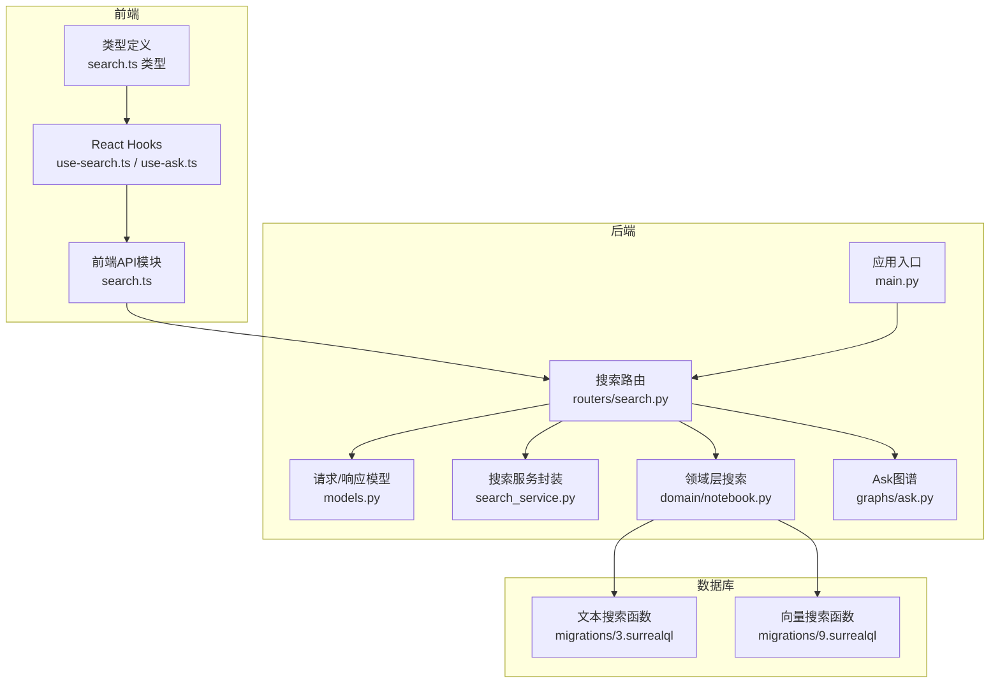
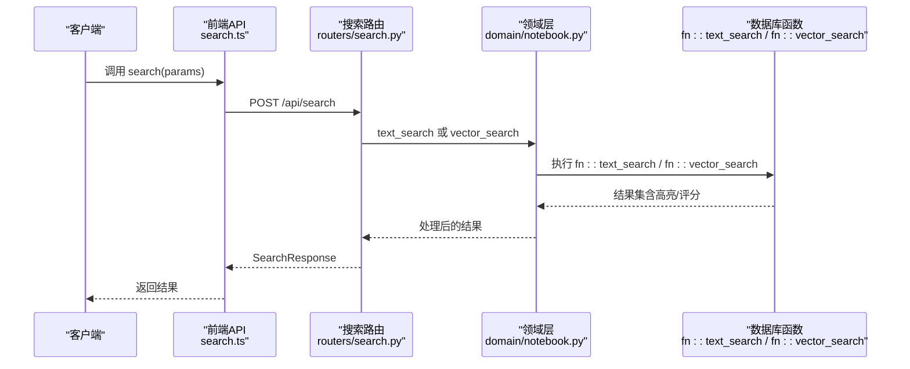
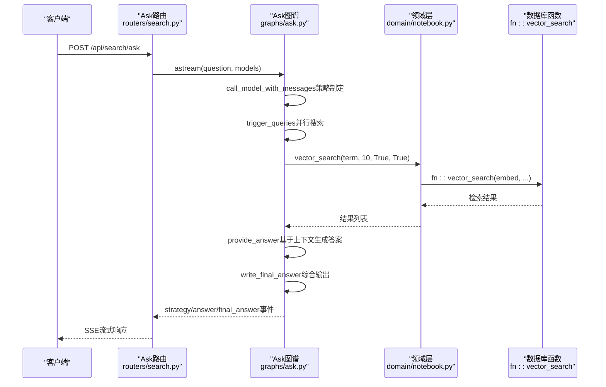
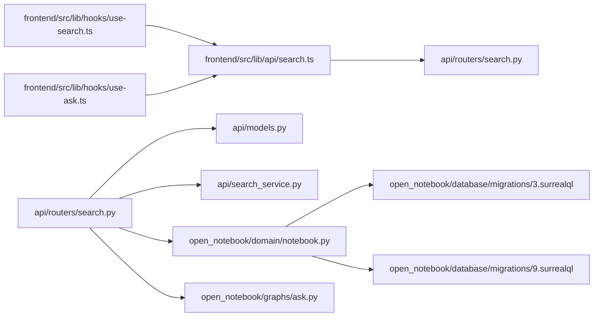
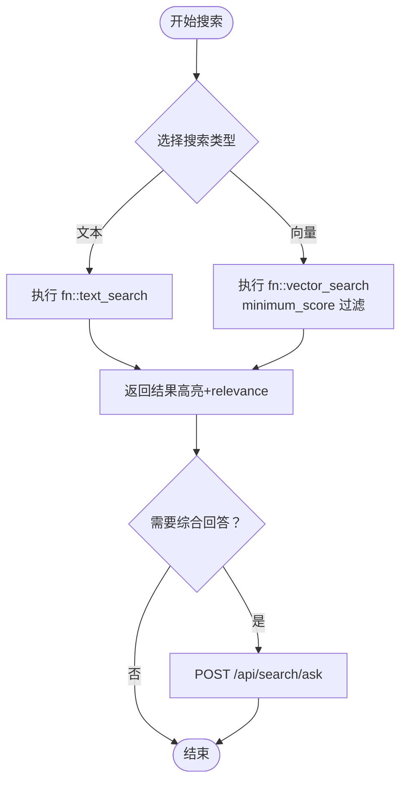

# 搜索API

<cite>
**本文档引用的文件**
- [api/routers/search.py](file://api/routers/search.py)
- [api/models.py](file://api/models.py)
- [api/main.py](file://api/main.py)
- [api/search_service.py](file://api/search_service.py)
- [open_notebook/domain/notebook.py](file://open_notebook/domain/notebook.py)
- [open_notebook/graphs/ask.py](file://open_notebook/graphs/ask.py)
- [open_notebook/database/migrations/3.surrealql](file://open_notebook/database/migrations/3.surrealql)
- [open_notebook/database/migrations/9.surrealql](file://open_notebook/database/migrations/9.surrealql)
- [docs/3-USER-GUIDE/search.md](file://docs/3-USER-GUIDE/search.md)
- [docs/7-DEVELOPMENT/api-reference.md](file://docs/7-DEVELOPMENT/api-reference.md)
- [frontend/src/lib/api/search.ts](file://frontend/src/lib/api/search.ts)
- [frontend/src/lib/hooks/use-search.ts](file://frontend/src/lib/hooks/use-search.ts)
- [frontend/src/lib/hooks/use-ask.ts](file://frontend/src/lib/hooks/use-ask.ts)
- [frontend/src/lib/types/search.ts](file://frontend/src/lib/types/search.ts)
</cite>

## 目录
1. [简介](#简介)
2. [项目结构](#项目结构)
3. [核心组件](#核心组件)
4. [架构总览](#架构总览)
5. [详细组件分析](#详细组件分析)
6. [依赖关系分析](#依赖关系分析)
7. [性能考虑](#性能考虑)
8. [故障排除指南](#故障排除指南)
9. [结论](#结论)
10. [附录](#附录)

## 简介
本文件为智能搜索API的权威技术文档，覆盖全文搜索、向量搜索与混合搜索（自动搜索）的完整能力。文档详细说明了API端点、请求/响应模型、查询语法、过滤与排序选项、结果高亮与相关性评分、上下文提取、以及Ask流式回答机制。同时提供搜索性能优化策略与大规模数据集的实践建议，并结合前端交互与后端实现进行可视化说明。

## 项目结构
搜索能力由后端FastAPI路由、领域层搜索函数、数据库函数与前端服务共同构成。核心路径如下：
- 后端路由：/api/search（全文/向量搜索）、/api/search/ask（Ask流式）、/api/search/ask/simple（Ask非流式）
- 领域层：text_search、vector_search（统一调用数据库函数）
- 数据库：fn::text_search、fn::vector_search（SurrealQL函数）
- 前端：SearchService封装API调用，React Hooks处理流式事件

图表来源
- [api/main.py](file://api/main.py#L157-L180)
- [api/routers/search.py](file://api/routers/search.py#L17-L215)
- [api/models.py](file://api/models.py#L31-L59)
- [api/search_service.py](file://api/search_service.py#L12-L59)
- [open_notebook/domain/notebook.py](file://open_notebook/domain/notebook.py#L648-L678)
- [open_notebook/graphs/ask.py](file://open_notebook/graphs/ask.py#L1-L147)
- [open_notebook/database/migrations/3.surrealql](file://open_notebook/database/migrations/3.surrealql#L79-L146)
- [open_notebook/database/migrations/9.surrealql](file://open_notebook/database/migrations/9.surrealql#L1-L35)

章节来源
- [api/main.py](file://api/main.py#L157-L180)
- [api/routers/search.py](file://api/routers/search.py#L17-L215)

## 核心组件
- 搜索路由与端点
  - POST /api/search：全文或向量搜索
  - POST /api/search/ask：Ask流式回答（Server-Sent Events）
  - POST /api/search/ask/simple：Ask非流式回答
- 请求/响应模型
  - SearchRequest/SearchResponse：搜索参数与结果
  - AskRequest/AskResponse：问题与最终答案
- 领域层搜索
  - text_search：调用fn::text_search，支持高亮与相关性评分
  - vector_search：生成向量并调用fn::vector_search，支持最小相似度阈值
- Ask图谱
  - 自动策略制定、并行搜索、答案合成与最终回答生成

章节来源
- [api/routers/search.py](file://api/routers/search.py#L17-L215)
- [api/models.py](file://api/models.py#L31-L59)
- [open_notebook/domain/notebook.py](file://open_notebook/domain/notebook.py#L648-L678)
- [open_notebook/graphs/ask.py](file://open_notebook/graphs/ask.py#L1-L147)

## 架构总览
下图展示了从客户端到后端、再到数据库函数的完整调用链路，包括流式响应与错误处理。

图表来源
- [frontend/src/lib/api/search.ts](file://frontend/src/lib/api/search.ts#L6-L9)
- [api/routers/search.py](file://api/routers/search.py#L17-L59)
- [open_notebook/domain/notebook.py](file://open_notebook/domain/notebook.py#L638-L678)
- [open_notebook/database/migrations/3.surrealql](file://open_notebook/database/migrations/3.surrealql#L79-L146)
- [open_notebook/database/migrations/9.surrealql](file://open_notebook/database/migrations/9.surrealql#L1-L35)

## 详细组件分析

### 搜索端点与请求/响应模型
- POST /api/search
  - 支持参数：query、type（text/vector）、limit、search_sources、search_notes、minimum_score
  - 返回：results、total_count、search_type
- POST /api/search/ask
  - 流式返回：strategy（策略）、answer（逐条答案）、final_answer（最终答案）、complete（完成信号）、error（错误）
- POST /api/search/ask/simple
  - 非流式返回：answer、question

章节来源
- [api/routers/search.py](file://api/routers/search.py#L17-L215)
- [api/models.py](file://api/models.py#L31-L59)
- [docs/7-DEVELOPMENT/api-reference.md](file://docs/7-DEVELOPMENT/api-reference.md#L65-L67)

### 查询语法与过滤条件
- 全文搜索（text）
  - 使用fn::text_search，支持对source.title、source.full_text、source_insight.content、note.title与note.content进行匹配
  - 结果包含高亮标记与relevance评分
- 向量搜索（vector）
  - 使用fn::vector_search，基于余弦相似度计算
  - 支持minimum_score阈值过滤
  - 结果包含similarity评分
- 过滤与范围
  - search_sources：是否包含源内容
  - search_notes：是否包含笔记内容
  - limit：最大返回数量（默认100，最大1000）

章节来源
- [open_notebook/database/migrations/3.surrealql](file://open_notebook/database/migrations/3.surrealql#L79-L146)
- [open_notebook/database/migrations/9.surrealql](file://open_notebook/database/migrations/9.surrealql#L1-L35)
- [api/models.py](file://api/models.py#L31-L40)

### 排序与结果评分
- 文本搜索：按relevance降序
- 向量搜索：按similarity降序
- 前端排序：若无内置评分字段，则使用relevance/similarity/score的组合作为final_score并降序排列

章节来源
- [open_notebook/database/migrations/3.surrealql](file://open_notebook/database/migrations/3.surrealql#L140-L142)
- [open_notebook/database/migrations/9.surrealql](file://open_notebook/database/migrations/9.surrealql#L1-L35)
- [frontend/src/lib/hooks/use-search.ts](file://frontend/src/lib/hooks/use-search.ts#L14-L26)

### 结果高亮与上下文提取
- 高亮：数据库函数使用search::highlight对匹配片段进行标记
- 上下文：Ask图谱在生成答案时会结合检索到的结果上下文进行合成

章节来源
- [open_notebook/database/migrations/3.surrealql](file://open_notebook/database/migrations/3.surrealql#L84-L84)
- [open_notebook/graphs/ask.py](file://open_notebook/graphs/ask.py#L93-L117)

### Ask工作流（自动搜索与合成）

图表来源
- [api/routers/search.py](file://api/routers/search.py#L110-L154)
- [open_notebook/graphs/ask.py](file://open_notebook/graphs/ask.py#L48-L134)
- [open_notebook/domain/notebook.py](file://open_notebook/domain/notebook.py#L648-L678)
- [open_notebook/database/migrations/9.surrealql](file://open_notebook/database/migrations/9.surrealql#L1-L35)

### 前端集成与流式处理
- search.ts：封装POST /api/search与POST /api/search/ask
- use-search.ts：对结果进行final_score计算与排序
- use-ask.ts：处理SSE事件，维护strategy、answers、finalAnswer状态

章节来源
- [frontend/src/lib/api/search.ts](file://frontend/src/lib/api/search.ts#L6-L41)
- [frontend/src/lib/hooks/use-search.ts](file://frontend/src/lib/hooks/use-search.ts#L1-L34)
- [frontend/src/lib/hooks/use-ask.ts](file://frontend/src/lib/hooks/use-ask.ts#L29-L55)
- [frontend/src/lib/types/search.ts](file://frontend/src/lib/types/search.ts#L45-L62)

## 依赖关系分析

图表来源
- [frontend/src/lib/api/search.ts](file://frontend/src/lib/api/search.ts#L1-L41)
- [frontend/src/lib/hooks/use-search.ts](file://frontend/src/lib/hooks/use-search.ts#L1-L34)
- [frontend/src/lib/hooks/use-ask.ts](file://frontend/src/lib/hooks/use-ask.ts#L1-L55)
- [api/routers/search.py](file://api/routers/search.py#L1-L215)
- [api/models.py](file://api/models.py#L1-L685)
- [api/search_service.py](file://api/search_service.py#L1-L59)
- [open_notebook/domain/notebook.py](file://open_notebook/domain/notebook.py#L1-L200)
- [open_notebook/database/migrations/3.surrealql](file://open_notebook/database/migrations/3.surrealql#L1-L146)
- [open_notebook/database/migrations/9.surrealql](file://open_notebook/database/migrations/9.surrealql#L1-L35)
- [open_notebook/graphs/ask.py](file://open_notebook/graphs/ask.py#L1-L147)

## 性能考虑
- 向量搜索前置条件
  - 必须配置嵌入模型；否则向量搜索端点会返回错误
- 查询优化建议
  - 文本搜索优先：关键词明确时优先使用text搜索以获得更快响应
  - 向量搜索阈值：通过minimum_score平衡召回与相关性
  - 结果限制：合理设置limit，避免超大结果集
  - 并行策略：Ask内部已采用并行搜索，避免重复触发
- 大规模数据集策略
  - 使用fn::vector_search的最小相似度过滤
  - 分页与分段检索：前端可结合limit与多次查询实现
  - 索引与向量化：确保source_embedding与source_insight表存在有效向量
- 用户指南要点
  - 文本搜索适合精确匹配与引文定位
  - 向量搜索适合概念发现与语义关联
  - Ask适合复杂问题的跨源综合分析

章节来源
- [docs/3-USER-GUIDE/search.md](file://docs/3-USER-GUIDE/search.md#L26-L128)
- [docs/7-DEVELOPMENT/api-reference.md](file://docs/7-DEVELOPMENT/api-reference.md#L199-L201)
- [open_notebook/database/migrations/9.surrealql](file://open_notebook/database/migrations/9.surrealql#L1-L35)

## 故障排除指南
- 常见错误与处理
  - 400：输入无效（如空查询、模型不存在）
  - 500：数据库操作失败或未知异常
  - 向量搜索需嵌入模型：未配置嵌入模型时返回错误提示
- 前端错误提示
  - use-search.ts与use-ask.ts中对错误进行本地化提示
- 日志与可观测性
  - 后端使用loguru记录异常堆栈，便于定位问题

章节来源
- [api/routers/search.py](file://api/routers/search.py#L51-L58)
- [frontend/src/lib/hooks/use-search.ts](file://frontend/src/lib/hooks/use-search.ts#L28-L32)
- [frontend/src/lib/hooks/use-ask.ts](file://frontend/src/lib/hooks/use-ask.ts#L40-L49)

## 结论
本搜索API提供了从精确文本匹配到语义向量检索，再到自动化综合问答的完整能力。通过清晰的端点设计、严谨的模型约束、数据库函数的高亮与评分支持，以及前端的流式体验与排序增强，能够满足研究场景下的多种搜索需求。配合合理的性能优化与大规模数据策略，可在实际生产环境中稳定高效地运行。

## 附录

### API端点一览
- POST /api/search
  - 请求体：SearchRequest
  - 响应体：SearchResponse
- POST /api/search/ask
  - 请求体：AskRequest
  - 响应：SSE流式事件（strategy、answer、final_answer、complete、error）
- POST /api/search/ask/simple
  - 请求体：AskRequest
  - 响应体：AskResponse

章节来源
- [docs/7-DEVELOPMENT/api-reference.md](file://docs/7-DEVELOPMENT/api-reference.md#L65-L67)
- [api/models.py](file://api/models.py#L31-L59)

### 搜索流程与决策树

图表来源
- [open_notebook/database/migrations/3.surrealql](file://open_notebook/database/migrations/3.surrealql#L79-L146)
- [open_notebook/database/migrations/9.surrealql](file://open_notebook/database/migrations/9.surrealql#L1-L35)
- [api/routers/search.py](file://api/routers/search.py#L110-L154)