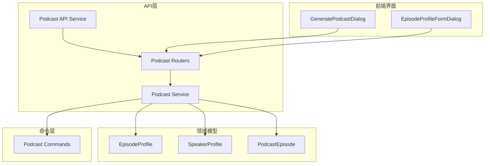
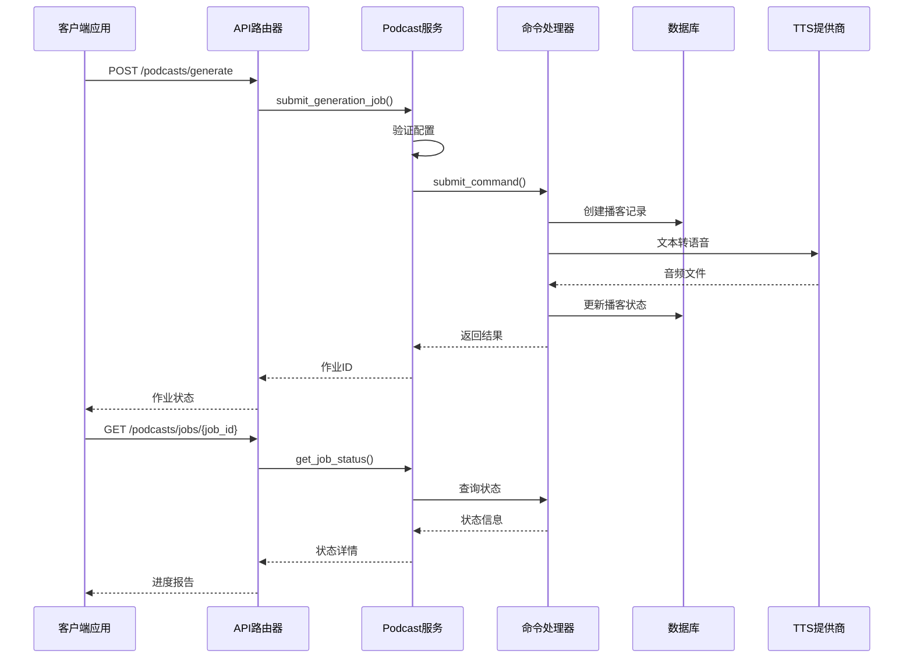
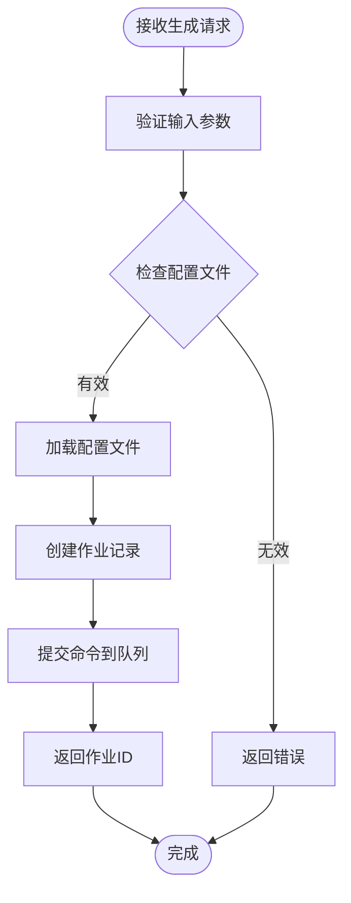
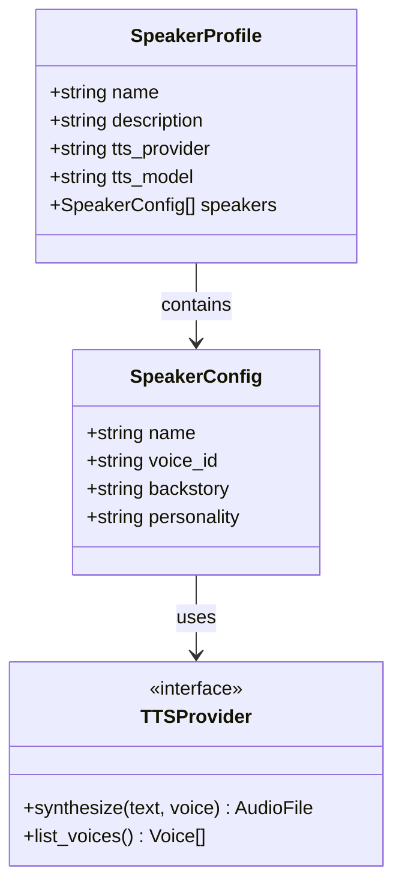
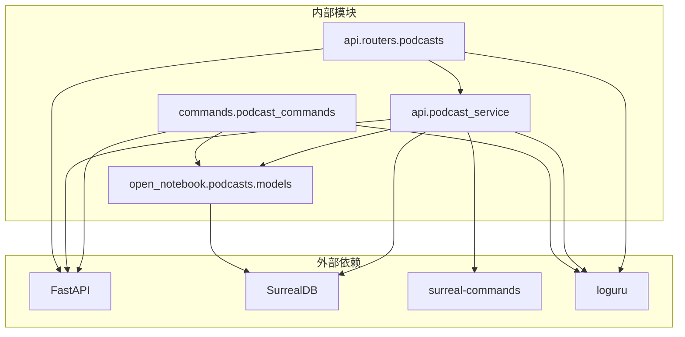

# 播客API

<cite>
**本文档引用的文件**
- [api/routers/podcasts.py](file://api/routers/podcasts.py)
- [api/podcast_service.py](file://api/podcast_service.py)
- [api/podcast_api_service.py](file://api/podcast_api_service.py)
- [api/routers/episode_profiles.py](file://api/routers/episode_profiles.py)
- [api/routers/speaker_profiles.py](file://api/routers/speaker_profiles.py)
- [open_notebook/podcasts/models.py](file://open_notebook/podcasts/models.py)
- [commands/podcast_commands.py](file://commands/podcast_commands.py)
- [docs/2-CORE-CONCEPTS/podcasts-explained.md](file://docs/2-CORE-CONCEPTS/podcasts-explained.md)
- [docs/3-USER-GUIDE/creating-podcasts.md](file://docs/3-USER-GUIDE/creating-podcasts.md)
- [frontend/src/components/podcasts/GeneratePodcastDialog.tsx](file://frontend/src/components/podcasts/GeneratePodcastDialog.tsx)
- [frontend/src/components/podcasts/forms/EpisodeProfileFormDialog.tsx](file://frontend/src/components/podcasts/forms/EpisodeProfileFormDialog.tsx)
</cite>

## 目录
1. [简介](#简介)
2. [项目结构](#项目结构)
3. [核心组件](#核心组件)
4. [架构概览](#架构概览)
5. [详细组件分析](#详细组件分析)
6. [依赖关系分析](#依赖关系分析)
7. [性能考虑](#性能考虑)
8. [故障排除指南](#故障排除指南)
9. [结论](#结论)

## 简介

Open Notebook 是一个强大的研究笔记平台，播客生成功能是其核心特性之一。该系统允许用户将研究内容转换为高质量的音频播客，支持多说话人、多种文本转语音(TTS)提供商，并提供完整的异步处理和状态跟踪机制。

播客API提供了从内容选择到最终音频导出的完整工作流程，包括：
- 播客配置和模板系统
- 角色配置和语音合成选项
- 异步生成和状态跟踪
- 内容编辑、预览和导出功能
- 元数据管理和发布设置

## 项目结构

播客功能主要分布在以下模块中：

**图表来源**
- [api/routers/podcasts.py](file://api/routers/podcasts.py#L1-L234)
- [api/podcast_service.py](file://api/podcast_service.py#L1-L207)
- [open_notebook/podcasts/models.py](file://open_notebook/podcasts/models.py#L1-L148)

**章节来源**
- [api/routers/podcasts.py](file://api/routers/podcasts.py#L1-L234)
- [api/podcast_service.py](file://api/podcast_service.py#L1-L207)
- [open_notebook/podcasts/models.py](file://open_notebook/podcasts/models.py#L1-L148)

## 核心组件

### 播客服务层

PodcastService 提供了播客生成的核心业务逻辑，包括作业提交、状态查询和资源管理。

**章节来源**
- [api/podcast_service.py](file://api/podcast_service.py#L33-L207)

### 播客模型

系统使用三个核心模型来管理播客配置：

1. **EpisodeProfile**: 定义播客的整体配置和生成参数
2. **SpeakerProfile**: 管理语音合成和说话人配置
3. **PodcastEpisode**: 存储生成的播客内容和元数据

**章节来源**
- [open_notebook/podcasts/models.py](file://open_notebook/podcasts/models.py#L10-L148)

### 命令处理器

podcast_commands.py 实现了实际的播客生成逻辑，包括内容分析、大纲生成、对话编写和音频合成。

**章节来源**
- [commands/podcast_commands.py](file://commands/podcast_commands.py#L1-L188)

## 架构概览

播客系统采用分层架构设计，确保了清晰的关注点分离和可扩展性：

**图表来源**
- [api/routers/podcasts.py](file://api/routers/podcasts.py#L40-L82)
- [api/podcast_service.py](file://api/podcast_service.py#L36-L138)
- [commands/podcast_commands.py](file://commands/podcast_commands.py#L49-L187)

## 详细组件分析

### 播客生成API

#### 生成端点

播客生成通过异步作业模式实现，避免阻塞用户界面：

**图表来源**
- [api/routers/podcasts.py](file://api/routers/podcasts.py#L40-L68)
- [api/podcast_service.py](file://api/podcast_service.py#L36-L105)

#### 状态跟踪机制

系统提供完整的作业状态跟踪功能：

**章节来源**
- [api/routers/podcasts.py](file://api/routers/podcasts.py#L71-L82)
- [api/podcast_service.py](file://api/podcast_service.py#L114-L138)

### 播客模板系统

#### 播客配置文件

EpisodeProfile 模型定义了播客的完整配置模板：

**章节来源**
- [open_notebook/podcasts/models.py](file://open_notebook/podcasts/models.py#L10-L46)
- [api/routers/episode_profiles.py](file://api/routers/episode_profiles.py#L12-L76)

#### 角色配置系统

SpeakerProfile 支持1-4个说话人的灵活配置：

**章节来源**
- [open_notebook/podcasts/models.py](file://open_notebook/podcasts/models.py#L48-L87)
- [api/routers/speaker_profiles.py](file://api/routers/speaker_profiles.py#L12-L64)

### 语音合成选项

系统支持多种TTS提供商和语音选项：

**图表来源**
- [open_notebook/podcasts/models.py](file://open_notebook/podcasts/models.py#L48-L77)
- [api/routers/speaker_profiles.py](file://api/routers/speaker_profiles.py#L75-L83)

### 内容管理功能

#### 播客内容编辑

前端提供了完整的播客内容编辑界面：

**章节来源**
- [frontend/src/components/podcasts/GeneratePodcastDialog.tsx](file://frontend/src/components/podcasts/GeneratePodcastDialog.tsx#L397-L800)

#### 预览和导出

系统支持实时预览和多种导出格式：

**章节来源**
- [api/routers/podcasts.py](file://api/routers/podcasts.py#L181-L203)

### 元数据管理

播客Episode模型包含了完整的元数据管理：

**章节来源**
- [open_notebook/podcasts/models.py](file://open_notebook/podcasts/models.py#L90-L148)

## 依赖关系分析

播客系统的依赖关系体现了清晰的分层架构：

**图表来源**
- [api/routers/podcasts.py](file://api/routers/podcasts.py#L1-L16)
- [api/podcast_service.py](file://api/podcast_service.py#L1-L10)
- [commands/podcast_commands.py](file://commands/podcast_commands.py#L1-L11)

**章节来源**
- [api/routers/podcasts.py](file://api/routers/podcasts.py#L1-L16)
- [api/podcast_service.py](file://api/podcast_service.py#L1-L10)
- [commands/podcast_commands.py](file://commands/podcast_commands.py#L1-L11)

## 性能考虑

### 异步处理优势

播客生成采用异步处理模式，具有以下优势：
- 不阻塞用户界面
- 支持并发处理多个播客
- 资源利用率高
- 用户体验流畅

### 缓存策略

系统实现了多层次的缓存机制：
- 配置文件缓存
- 生成状态缓存
- 音频文件缓存

### 扩展性设计

系统支持水平扩展：
- 多实例部署
- 负载均衡
- 数据库连接池
- 异步任务队列

## 故障排除指南

### 常见问题及解决方案

#### 生成失败

**症状**: 播客生成过程中出现错误

**可能原因**:
- TTS提供商API限制
- 配置文件缺失
- 网络连接问题
- 音频文件权限问题

**解决步骤**:
1. 检查TTS提供商API密钥
2. 验证配置文件完整性
3. 确认网络连接稳定
4. 检查音频文件存储权限

#### 状态查询异常

**症状**: 无法获取播客生成状态

**解决方法**:
1. 检查作业ID有效性
2. 验证命令系统运行状态
3. 查看日志文件获取详细错误信息

#### 音频文件访问问题

**症状**: 无法下载或播放生成的音频文件

**解决步骤**:
1. 验证文件路径存在性
2. 检查文件权限设置
3. 确认文件格式兼容性
4. 验证存储空间充足

**章节来源**
- [commands/podcast_commands.py](file://commands/podcast_commands.py#L169-L187)
- [api/routers/podcasts.py](file://api/routers/podcasts.py#L181-L203)

## 结论

Open Notebook 的播客API系统提供了一个完整、可扩展且用户友好的播客生成解决方案。通过异步处理、灵活的配置系统和丰富的TTS选项，用户可以轻松地将研究内容转换为高质量的音频播客。

系统的主要优势包括：
- **异步处理**: 不阻塞用户界面，支持后台生成
- **灵活配置**: 支持自定义播客模板和说话人配置
- **多提供商支持**: 兼容多种TTS提供商和语音选项
- **完整工作流**: 从内容选择到最终导出的完整流程
- **状态跟踪**: 实时监控生成进度和状态
- **错误处理**: 完善的错误处理和故障恢复机制

该系统为研究人员、内容创作者和教育工作者提供了一个强大的工具，使他们能够以新的方式消费和分享研究成果。