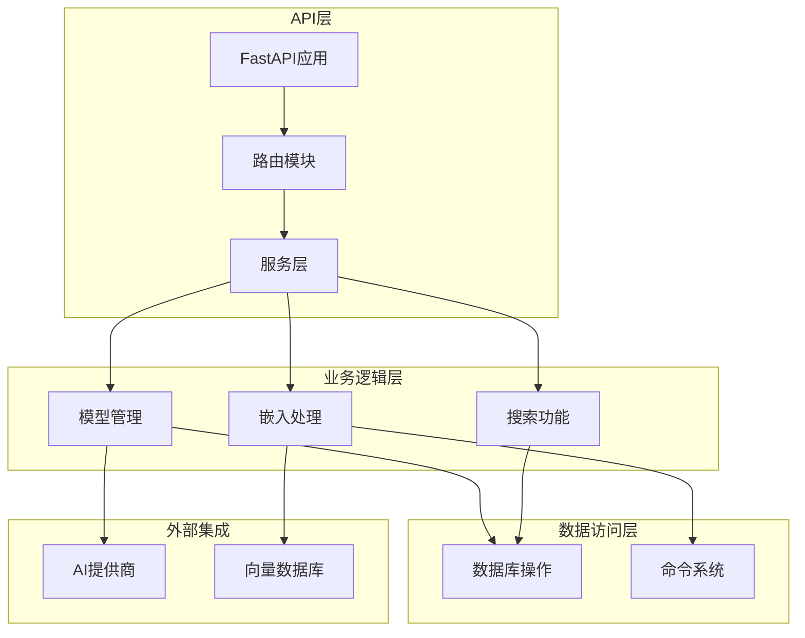
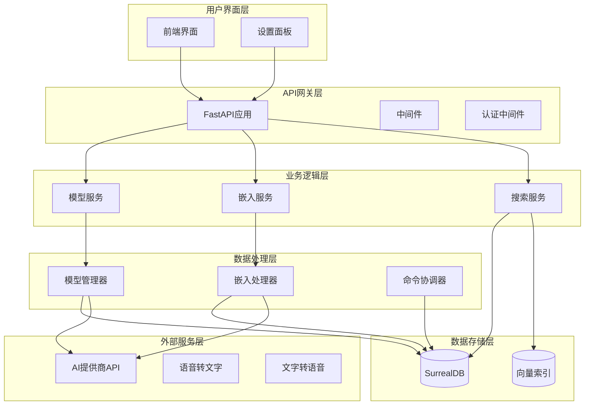
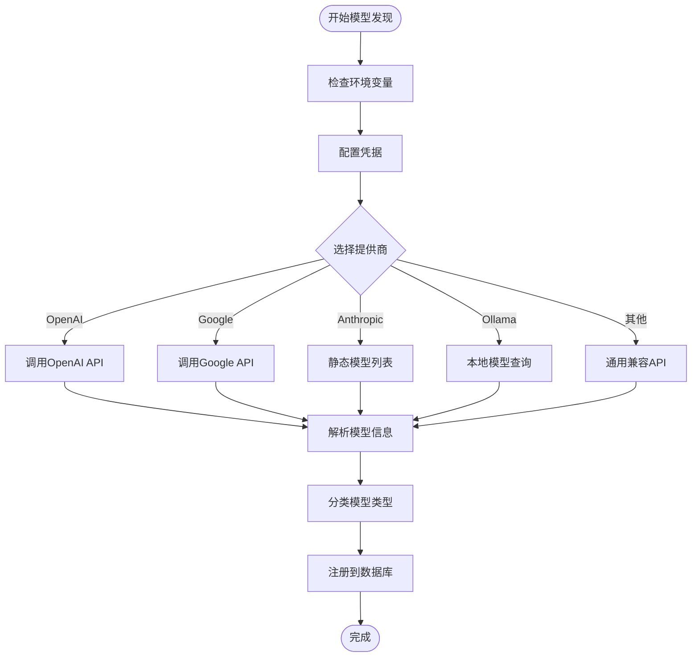
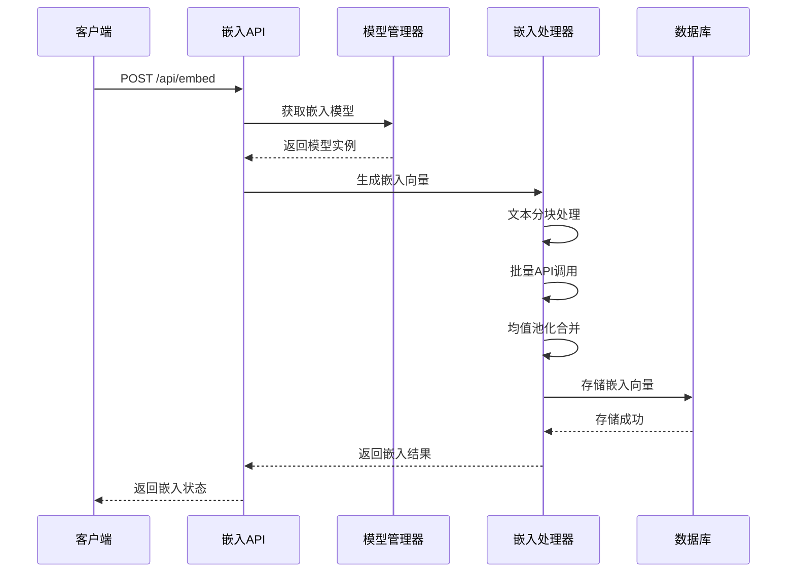
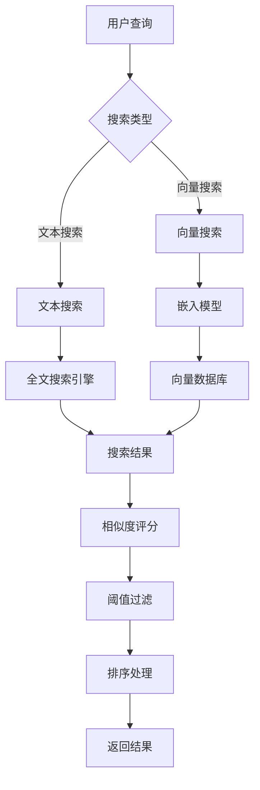
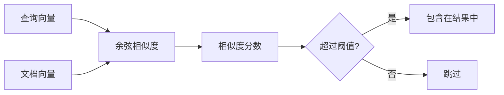
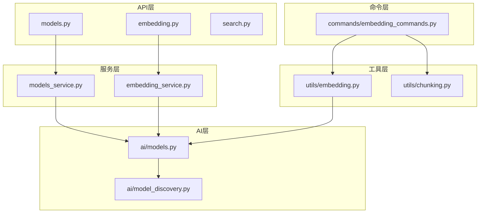
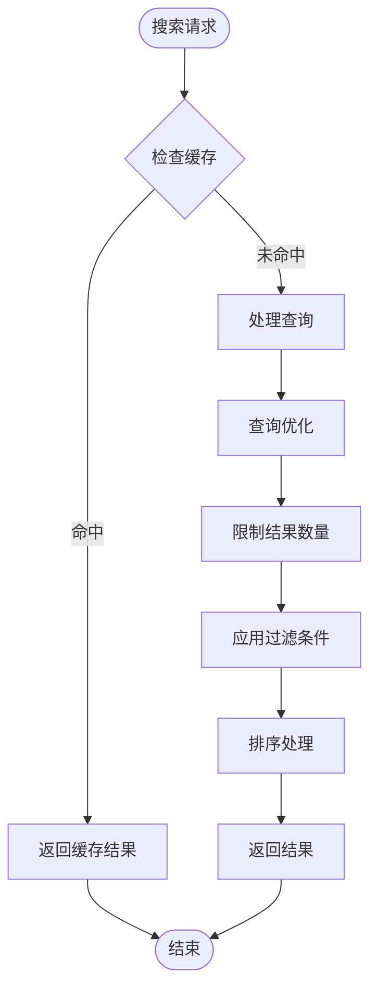
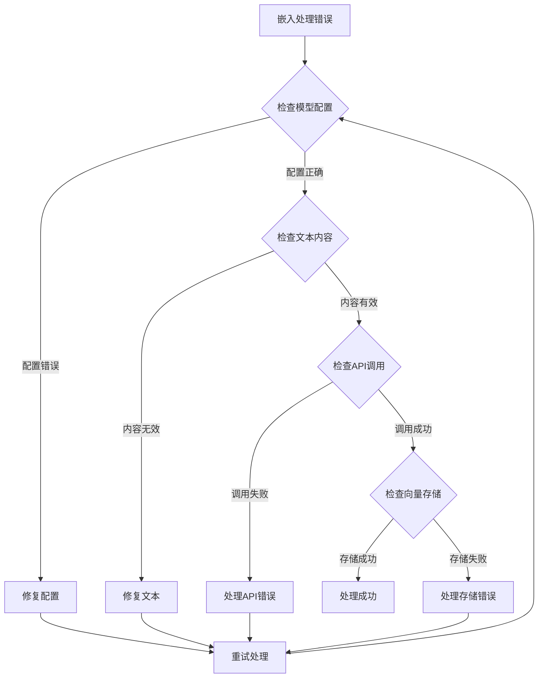

# 模型与嵌入API

<cite>
**本文档引用的文件**
- [api/main.py](file://api/main.py)
- [api/routers/models.py](file://api/routers/models.py)
- [api/routers/embedding.py](file://api/routers/embedding.py)
- [api/routers/embedding_rebuild.py](file://api/routers/embedding_rebuild.py)
- [api/routers/search.py](file://api/routers/search.py)
- [api/models.py](file://api/models.py)
- [api/models_service.py](file://api/models_service.py)
- [api/embedding_service.py](file://api/embedding_service.py)
- [open_notebook/ai/models.py](file://open_notebook/ai/models.py)
- [open_notebook/ai/model_discovery.py](file://open_notebook/ai/model_discovery.py)
- [open_notebook/utils/embedding.py](file://open_notebook/utils/embedding.py)
- [commands/embedding_commands.py](file://commands/embedding_commands.py)
- [open_notebook/domain/content_settings.py](file://open_notebook/domain/content_settings.py)
- [open_notebook/database/migrations/9.surrealql](file://open_notebook/database/migrations/9.surrealql)
</cite>

## 目录
1. [简介](#简介)
2. [项目结构](#项目结构)
3. [核心组件](#核心组件)
4. [架构概览](#架构概览)
5. [详细组件分析](#详细组件分析)
6. [依赖关系分析](#依赖关系分析)
7. [性能考虑](#性能考虑)
8. [故障排除指南](#故障排除指南)
9. [结论](#结论)

## 简介

Open Notebook是一个基于FastAPI构建的AI研究助手平台，专注于提供完整的AI模型管理和向量嵌入功能。该系统支持多种AI提供商（OpenAI、Anthropic、Google等），具备自动模型发现、动态配置切换、向量嵌入生成与存储、以及批量重建机制。

本项目的核心目标是为用户提供一个统一的AI模型管理界面，支持：
- AI模型的自动发现与注册
- 向量嵌入的生成、存储和重建
- 模型性能测试与延迟测量
- 准确性评估与相似度计算
- 动态模型配置更新与资源管理

## 项目结构

系统采用模块化架构设计，主要分为以下几个层次：

**图表来源**
- [api/main.py](file://api/main.py#L99-L190)
- [api/routers/models.py](file://api/routers/models.py#L1-L771)

**章节来源**
- [api/main.py](file://api/main.py#L1-L190)
- [api/routers/models.py](file://api/routers/models.py#L1-L771)

## 核心组件

### 模型管理系统

模型管理系统是整个AI功能的核心，负责：
- 模型发现与注册：自动从各AI提供商获取可用模型列表
- 配置管理：支持数据库和环境变量两种配置方式
- 默认模型分配：智能选择最优模型组合
- 性能测试：验证模型连接性和响应质量

### 向量嵌入引擎

向量嵌入引擎提供完整的向量化解决方案：
- 单文本嵌入：支持长文本自动分块和均值池化
- 批量嵌入：优化API调用效率
- 嵌入存储：将向量向量持久化到数据库
- 嵌入重建：支持增量和全量重建机制

### 搜索与检索

系统提供混合搜索能力：
- 文本搜索：基于关键词的全文检索
- 向量搜索：基于余弦相似度的语义检索
- 流式响应：支持实时流式输出
- 搜索优化：可配置最小相似度阈值

**章节来源**
- [open_notebook/ai/models.py](file://open_notebook/ai/models.py#L1-L267)
- [open_notebook/ai/model_discovery.py](file://open_notebook/ai/model_discovery.py#L1-L757)
- [open_notebook/utils/embedding.py](file://open_notebook/utils/embedding.py#L1-L208)

## 架构概览

系统采用分层架构，确保各组件职责清晰、耦合度低：

**图表来源**
- [api/main.py](file://api/main.py#L1-L190)
- [open_notebook/ai/models.py](file://open_notebook/ai/models.py#L97-L207)

## 详细组件分析

### 模型发现与管理

#### 自动模型发现机制

系统支持12种主流AI提供商的自动发现：

**图表来源**
- [open_notebook/ai/model_discovery.py](file://open_notebook/ai/model_discovery.py#L173-L724)

#### 模型类型分类系统

系统根据模型名称模式自动识别模型类型：

| 提供商 | 语言模型 | 嵌入模型 | 语音转文字 | 文字转语音 |
|--------|----------|----------|------------|------------|
| OpenAI | gpt-4, gpt-3.5 | text-embedding | whisper | tts |
| Google | gemini, palm | embedding, textembedding | - | - |
| Anthropic | claude系列 | - | - | - |
| Ollama | llama, mistral | nomic-embed, mxbai | - | - |
| Mistral | mistral, mixtral | mistral-embed | - | - |

**章节来源**
- [open_notebook/ai/model_discovery.py](file://open_notebook/ai/model_discovery.py#L36-L152)

### 向量嵌入处理

#### 嵌入生成流程

**图表来源**
- [api/routers/embedding.py](file://api/routers/embedding.py#L12-L114)
- [open_notebook/utils/embedding.py](file://open_notebook/utils/embedding.py#L82-L208)

#### 嵌入重建机制

系统提供灵活的嵌入重建选项：

| 模式 | 处理范围 | 适用场景 |
|------|----------|----------|
| existing | 仅处理已有嵌入的数据 | 更新模型后保持一致性 |
| all | 处理所有可嵌入内容 | 初始部署或大规模迁移 |
| sources | 文档源 | 重新生成文档向量 |
| notes | 笔记内容 | 更新笔记向量 |
| insights | 溯源洞察 | 重新生成分析向量 |

**章节来源**
- [api/routers/embedding_rebuild.py](file://api/routers/embedding_rebuild.py#L18-L193)
- [commands/embedding_commands.py](file://commands/embedding_commands.py#L621-L787)

### 搜索与检索

#### 混合搜索架构

**图表来源**
- [api/routers/search.py](file://api/routers/search.py#L17-L200)
- [open_notebook/database/migrations/9.surrealql](file://open_notebook/database/migrations/9.surrealql#L4-L35)

#### 相似度计算

系统使用余弦相似度进行向量相似度计算：

**图表来源**
- [open_notebook/database/migrations/9.surrealql](file://open_notebook/database/migrations/9.surrealql#L12-L15)

**章节来源**
- [api/routers/search.py](file://api/routers/search.py#L17-L200)
- [open_notebook/database/migrations/9.surrealql](file://open_notebook/database/migrations/9.surrealql#L1-L35)

### 模型性能测试

#### 测试框架

系统提供全面的模型测试能力：

| 测试维度 | 测试内容 | 实现方式 |
|----------|----------|----------|
| 连接测试 | 验证API密钥有效性 | 直接API调用 |
| 响应时间 | 测量请求延迟 | 时间戳记录 |
| 准确性评估 | 语义匹配质量 | 相似度阈值 |
| 批处理性能 | 并发处理能力 | 并发测试 |
| 错误处理 | 异常情况处理 | 异常捕获 |

**章节来源**
- [api/routers/models.py](file://api/routers/models.py#L266-L287)

## 依赖关系分析

### 组件间依赖

**图表来源**
- [api/routers/models.py](file://api/routers/models.py#L1-L771)
- [api/models_service.py](file://api/models_service.py#L1-L113)
- [open_notebook/ai/models.py](file://open_notebook/ai/models.py#L97-L207)

### 外部依赖

系统依赖的关键外部组件：

| 组件 | 版本 | 用途 | 依赖关系 |
|------|------|------|----------|
| FastAPI | 最新 | Web框架 | Python 3.8+ |
| Esperanto | 最新 | AI模型抽象 | 各提供商SDK |
| SurrealDB | 最新 | 数据存储 | 向量查询 |
| httpx | 最新 | HTTP客户端 | 异步请求 |
| numpy | 最新 | 数学运算 | 向量计算 |

**章节来源**
- [api/main.py](file://api/main.py#L1-L190)
- [open_notebook/ai/models.py](file://open_notebook/ai/models.py#L1-L267)

## 性能考虑

### 嵌入生成优化

系统采用多种策略优化嵌入生成性能：

1. **批量处理优化**
   - 单次API调用处理多个文本片段
   - 减少网络往返开销
   - 支持最大100个文本的批量处理

2. **智能分块策略**
   - 基于内容类型的自适应分块
   - CHUNK_SIZE参数控制分块大小
   - 均值池化减少向量维度

3. **缓存机制**
   - Esperanto模型实例缓存
   - 凭据配置缓存
   - 模型发现结果缓存

### 搜索性能优化

**图表来源**
- [api/routers/search.py](file://api/routers/search.py#L17-L200)

### 资源管理策略

系统实施以下资源管理策略：

1. **内存管理**
   - 流式处理大文本内容
   - 及时释放临时向量数据
   - 控制并发处理数量

2. **数据库优化**
   - 向量相似度查询索引
   - 分页查询避免大数据集
   - 连接池管理

3. **API配额管理**
   - 请求频率限制
   - 错误重试策略
   - 超时处理机制

## 故障排除指南

### 常见问题诊断

#### 模型配置问题

| 问题症状 | 可能原因 | 解决方案 |
|----------|----------|----------|
| 模型不可用 | 凭据配置错误 | 检查API密钥和端点 |
| 发现失败 | 网络连接问题 | 验证网络连通性 |
| 类型识别错误 | 模型名称不符合规范 | 更新模型名称模式 |
| 性能下降 | 缓存失效 | 清理缓存并重启服务 |

#### 嵌入处理问题

**图表来源**
- [commands/embedding_commands.py](file://commands/embedding_commands.py#L132-L440)

#### 搜索功能问题

1. **向量搜索无结果**
   - 检查嵌入模型配置
   - 验证最小相似度阈值
   - 确认向量数据完整性

2. **文本搜索性能差**
   - 优化查询条件
   - 增加索引
   - 调整结果限制

**章节来源**
- [commands/embedding_commands.py](file://commands/embedding_commands.py#L132-L787)

### 日志监控

系统提供详细的日志记录：
- 请求处理时间统计
- 错误堆栈跟踪
- 性能指标监控
- 用户操作审计

## 结论

Open Notebook的模型与嵌入API系统提供了完整的AI模型管理解决方案。通过模块化设计和分层架构，系统实现了：

1. **完整的模型生命周期管理**：从发现、配置到测试、切换的全流程支持
2. **高效的向量处理能力**：支持批量处理、智能分块和均值池化
3. **灵活的搜索机制**：结合文本和向量搜索的优势
4. **强大的扩展性**：支持多种AI提供商和自定义模型
5. **完善的监控体系**：提供性能测试、错误处理和资源管理

该系统为AI应用开发提供了坚实的基础，能够满足从个人研究到企业级应用的各种需求。通过持续的优化和扩展，系统将继续为用户提供更好的AI模型管理体验。