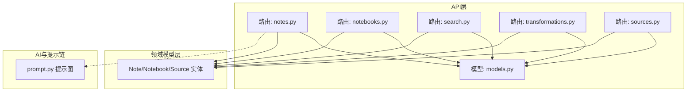
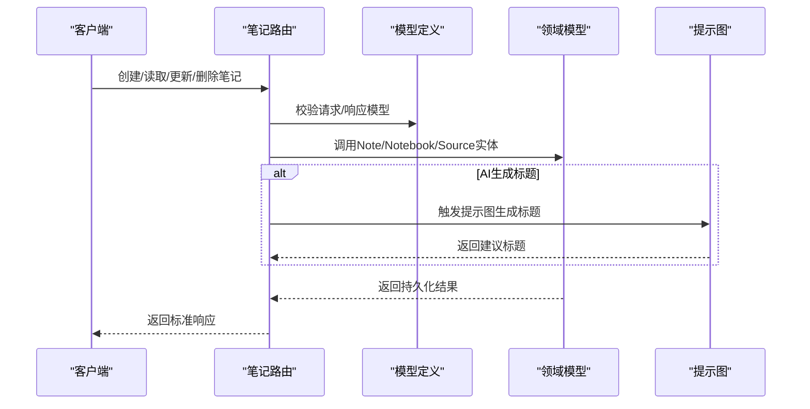
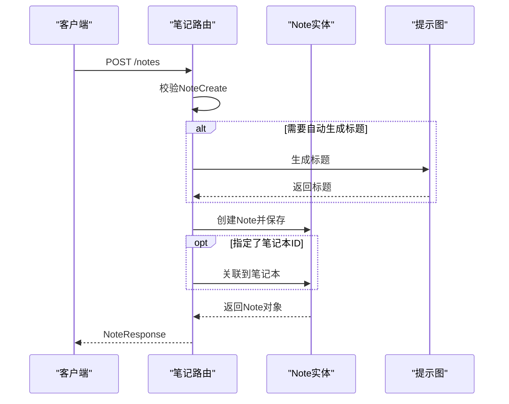
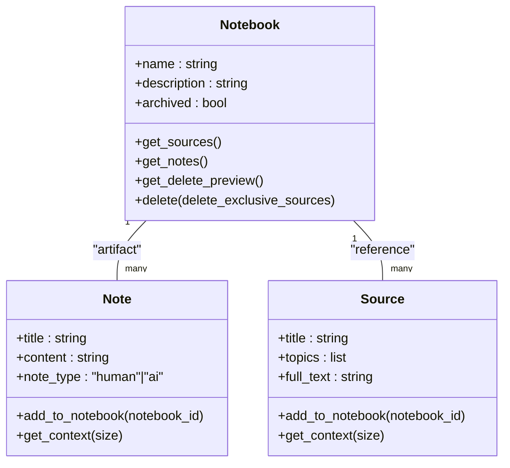
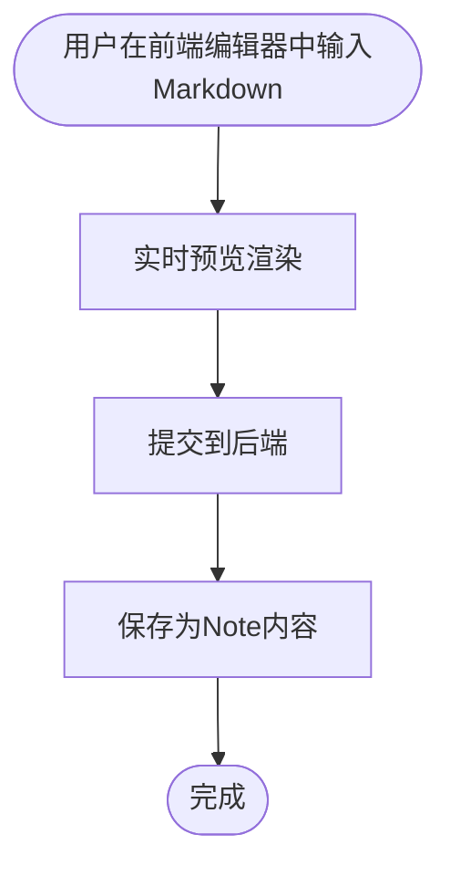
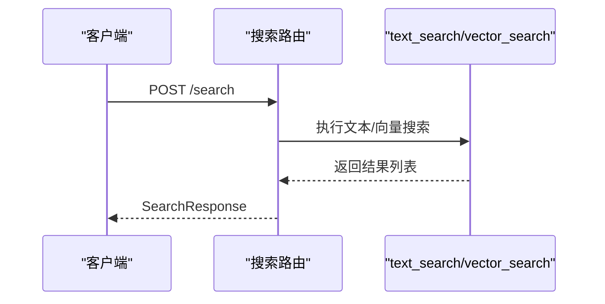
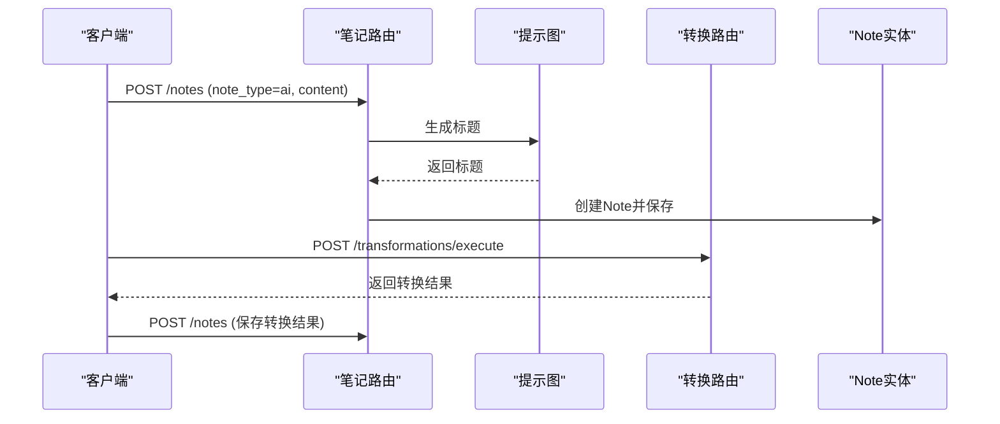
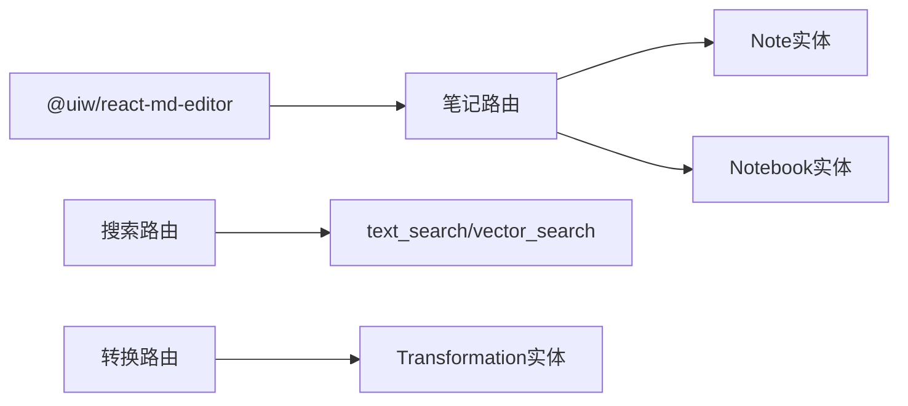

# 笔记API

<cite>
**本文档引用的文件**
- [api/routers/notes.py](file://api/routers/notes.py)
- [api/models.py](file://api/models.py)
- [open_notebook/domain/notebook.py](file://open_notebook/domain/notebook.py)
- [api/routers/search.py](file://api/routers/search.py)
- [api/routers/sources.py](file://api/routers/sources.py)
- [api/routers/notebooks.py](file://api/routers/notebooks.py)
- [api/routers/transformations.py](file://api/routers/transformations.py)
- [open_notebook/graphs/prompt.py](file://open_notebook/graphs/prompt.py)
- [docs/3-USER-GUIDE/working-with-notes.md](file://docs/3-USER-GUIDE/working-with-notes.md)
</cite>

## 目录
1. [简介](#简介)
2. [项目结构](#项目结构)
3. [核心组件](#核心组件)
4. [架构总览](#架构总览)
5. [详细组件分析](#详细组件分析)
6. [依赖关系分析](#依赖关系分析)
7. [性能考虑](#性能考虑)
8. [故障排除指南](#故障排除指南)
9. [结论](#结论)
10. [附录](#附录)

## 简介
本文件为“笔记管理API”的完整技术文档，覆盖笔记的创建、读取、更新、删除与关联操作；说明笔记与笔记本、内容源之间的关系与关联机制；提供笔记内容的富文本编辑能力（Markdown 支持）与格式化选项；介绍笔记的标签系统、分类与搜索功能；展示基于AI的笔记生成接口与自定义提示词的使用方法。

## 项目结构
该系统采用分层架构：API路由层负责HTTP端点与请求响应模型；领域模型层封装业务实体与查询逻辑；服务层提供统一的API调用封装；前端通过Markdown编辑器与后端交互，实现富文本编辑与渲染。

图表来源
- [api/routers/notes.py](file://api/routers/notes.py#L1-L188)
- [api/routers/notebooks.py](file://api/routers/notebooks.py#L1-L328)
- [api/routers/search.py](file://api/routers/search.py#L1-L215)
- [api/routers/transformations.py](file://api/routers/transformations.py#L1-L251)
- [api/routers/sources.py](file://api/routers/sources.py#L1-L1020)
- [api/models.py](file://api/models.py#L1-L685)
- [open_notebook/domain/notebook.py](file://open_notebook/domain/notebook.py#L1-L679)
- [open_notebook/graphs/prompt.py](file://open_notebook/graphs/prompt.py#L1-L46)

章节来源
- [api/routers/notes.py](file://api/routers/notes.py#L1-L188)
- [api/routers/notebooks.py](file://api/routers/notebooks.py#L1-L328)
- [api/routers/search.py](file://api/routers/search.py#L1-L215)
- [api/routers/transformations.py](file://api/routers/transformations.py#L1-L251)
- [api/routers/sources.py](file://api/routers/sources.py#L1-L1020)
- [api/models.py](file://api/models.py#L1-L685)
- [open_notebook/domain/notebook.py](file://open_notebook/domain/notebook.py#L1-L679)
- [open_notebook/graphs/prompt.py](file://open_notebook/graphs/prompt.py#L1-L46)

## 核心组件
- 笔记API路由：提供笔记的增删改查与按笔记本过滤查询。
- 笔记本API路由：提供笔记本的增删改查、与内容源的关联/解绑、删除预览与级联删除。
- 搜索API路由：提供文本/向量搜索与问答流式输出。
- 转换API路由：提供提示模板与执行转换，用于批量生成笔记。
- 领域模型：Note/Notebook/Source等实体，封装数据访问与业务关系。
- 请求/响应模型：Pydantic模型定义输入输出规范。

章节来源
- [api/routers/notes.py](file://api/routers/notes.py#L13-L188)
- [api/routers/notebooks.py](file://api/routers/notebooks.py#L20-L328)
- [api/routers/search.py](file://api/routers/search.py#L17-L215)
- [api/routers/transformations.py](file://api/routers/transformations.py#L23-L251)
- [api/models.py](file://api/models.py#L173-L196)
- [open_notebook/domain/notebook.py](file://open_notebook/domain/notebook.py#L16-L679)

## 架构总览
下图展示了笔记API在系统中的位置与与其他模块的交互：

图表来源
- [api/routers/notes.py](file://api/routers/notes.py#L49-L106)
- [api/models.py](file://api/models.py#L173-L196)
- [open_notebook/domain/notebook.py](file://open_notebook/domain/notebook.py#L555-L610)
- [open_notebook/graphs/prompt.py](file://open_notebook/graphs/prompt.py#L20-L37)

## 详细组件分析

### 笔记API端点
- 获取所有笔记（可按笔记本过滤）
  - 方法：GET /notes
  - 查询参数：notebook_id（可选）
  - 行为：若提供笔记本ID，则返回该笔记本下的笔记列表；否则返回全量笔记，按更新时间倒序
  - 响应：NoteResponse 列表
- 创建笔记
  - 方法：POST /notes
  - 请求体：NoteCreate
  - 自动行为：当note_type为ai且提供了content时，自动触发提示图生成标题
  - 关联：可选传入notebook_id，成功创建后自动加入该笔记本
  - 响应：NoteResponse
- 获取单个笔记
  - 方法：GET /notes/{note_id}
  - 响应：NoteResponse
- 更新笔记
  - 方法：PUT /notes/{note_id}
  - 请求体：NoteUpdate
  - 行为：仅更新提供的字段，note_type必须为human或ai
  - 响应：NoteResponse
- 删除笔记
  - 方法：DELETE /notes/{note_id}
  - 响应：成功消息

图表来源
- [api/routers/notes.py](file://api/routers/notes.py#L49-L106)
- [open_notebook/graphs/prompt.py](file://open_notebook/graphs/prompt.py#L20-L37)
- [open_notebook/domain/notebook.py](file://open_notebook/domain/notebook.py#L593-L596)

章节来源
- [api/routers/notes.py](file://api/routers/notes.py#L13-L188)
- [api/models.py](file://api/models.py#L173-L196)
- [open_notebook/domain/notebook.py](file://open_notebook/domain/notebook.py#L555-L610)
- [open_notebook/graphs/prompt.py](file://open_notebook/graphs/prompt.py#L1-L46)

### 笔记与笔记本、内容源的关系
- 笔记与笔记本
  - 通过“artifact”关系建立关联，创建笔记时可指定notebook_id，或后续通过实体方法添加
  - 删除笔记本时，会级联删除其下的笔记，并可选择删除仅属于该笔记本的内容源
- 笔记与内容源
  - 通过“reference”关系建立关联，将内容源加入笔记本
  - 可在笔记本层面查询其下的笔记与内容源
- 删除预览
  - 提供删除笔记本前的预览，统计将被删除的笔记数、仅属于该笔记本的内容源数、与其他笔记本共享的内容源数

图表来源
- [open_notebook/domain/notebook.py](file://open_notebook/domain/notebook.py#L16-L231)
- [open_notebook/domain/notebook.py](file://open_notebook/domain/notebook.py#L555-L610)
- [open_notebook/domain/notebook.py](file://open_notebook/domain/notebook.py#L288-L410)

章节来源
- [api/routers/notebooks.py](file://api/routers/notebooks.py#L218-L290)
- [api/routers/sources.py](file://api/routers/sources.py#L218-L290)
- [open_notebook/domain/notebook.py](file://open_notebook/domain/notebook.py#L16-L231)

### 富文本编辑与Markdown支持
- 前端编辑器
  - 使用 @uiw/react-md-editor 组件，支持实时预览、工具栏、占位符等配置
- Markdown语法
  - 支持标题、加粗、斜体、列表、引用、链接等常见Markdown语法
- 内容存储
  - 笔记内容以字符串形式存储，前端负责渲染与编辑

图表来源
- [docs/3-USER-GUIDE/working-with-notes.md](file://docs/3-USER-GUIDE/working-with-notes.md#L78-L100)
- [frontend/src/components/ui/markdown-editor.tsx](file://frontend/src/components/ui/markdown-editor.tsx#L1-L45)

章节来源
- [docs/3-USER-GUIDE/working-with-notes.md](file://docs/3-USER-GUIDE/working-with-notes.md#L78-L100)
- [frontend/src/components/ui/markdown-editor.tsx](file://frontend/src/components/ui/markdown-editor.tsx#L1-L45)

### 标签系统、分类与搜索
- 标签系统
  - 文档建议使用标签进行分类与筛选，如“primary-research”、“methodology”、“insights”等
- 分类实践
  - 支持按日期、主题、类型、来源等多种命名与组织方式
- 搜索功能
  - 文本搜索：精确短语匹配
  - 向量/语义搜索：基于嵌入模型的概念检索
  - 组合搜索：同时覆盖内容源与笔记
  - 问答接口：支持流式与非流式两种模式

图表来源
- [api/routers/search.py](file://api/routers/search.py#L17-L59)
- [open_notebook/domain/notebook.py](file://open_notebook/domain/notebook.py#L628-L679)

章节来源
- [api/routers/search.py](file://api/routers/search.py#L17-L215)
- [open_notebook/domain/notebook.py](file://open_notebook/domain/notebook.py#L628-L679)
- [docs/3-USER-GUIDE/working-with-notes.md](file://docs/3-USER-GUIDE/working-with-notes.md#L299-L318)

### AI生成笔记与自定义提示词
- 自动生成标题
  - 当创建AI笔记且未提供标题时，系统会调用提示图生成标题
- 转换模板
  - 通过“转换”功能定义提示模板，批量对内容源进行结构化提取，生成笔记
- 问答与对话
  - 支持将聊天与问答结果保存为笔记，便于后续编辑与组织

图表来源
- [api/routers/notes.py](file://api/routers/notes.py#L53-L66)
- [open_notebook/graphs/prompt.py](file://open_notebook/graphs/prompt.py#L20-L37)
- [api/routers/transformations.py](file://api/routers/transformations.py#L81-L116)
- [open_notebook/domain/notebook.py](file://open_notebook/domain/notebook.py#L568-L591)

章节来源
- [api/routers/notes.py](file://api/routers/notes.py#L49-L106)
- [api/routers/transformations.py](file://api/routers/transformations.py#L81-L116)
- [open_notebook/graphs/prompt.py](file://open_notebook/graphs/prompt.py#L1-L46)
- [docs/3-USER-GUIDE/working-with-notes.md](file://docs/3-USER-GUIDE/working-with-notes.md#L134-L188)

## 依赖关系分析
- 笔记API依赖领域模型Note/Notebook/Source，通过实体方法实现业务关系与持久化
- 搜索API依赖text_search/vector_search函数，结合嵌入模型实现语义检索
- 转换API依赖Transformation实体与提示图，实现批量结构化生成
- 前端通过Markdown编辑器与后端交互，实现富文本编辑与渲染

图表来源
- [api/routers/notes.py](file://api/routers/notes.py#L1-L188)
- [api/routers/search.py](file://api/routers/search.py#L1-L215)
- [api/routers/transformations.py](file://api/routers/transformations.py#L1-L251)
- [open_notebook/domain/notebook.py](file://open_notebook/domain/notebook.py#L1-L679)
- [frontend/src/components/ui/markdown-editor.tsx](file://frontend/src/components/ui/markdown-editor.tsx#L1-L45)

章节来源
- [api/routers/notes.py](file://api/routers/notes.py#L1-L188)
- [api/routers/search.py](file://api/routers/search.py#L1-L215)
- [api/routers/transformations.py](file://api/routers/transformations.py#L1-L251)
- [open_notebook/domain/notebook.py](file://open_notebook/domain/notebook.py#L1-L679)
- [frontend/src/components/ui/markdown-editor.tsx](file://frontend/src/components/ui/markdown-editor.tsx#L1-L45)

## 性能考虑
- 异步处理：笔记与内容源的嵌入与处理通过命令队列异步执行，避免阻塞主流程
- 分页与排序：列表查询支持分页与排序，降低单次响应体积
- 向量搜索：需要配置嵌入模型后方可使用，避免无效计算
- 前端渲染：编辑器采用客户端渲染，注意长文档的性能优化

## 故障排除指南
- 输入校验错误
  - note_type 必须为 human 或 ai
  - 标题与内容不能为空
- 资源不存在
  - 访问不存在的笔记/笔记本/内容源会返回404
- 数据库异常
  - 搜索与实体查询可能抛出数据库相关异常，需检查连接与索引
- 处理失败
  - 异步命令提交失败时会清理临时资源并返回错误信息

章节来源
- [api/routers/notes.py](file://api/routers/notes.py#L68-L74)
- [open_notebook/domain/notebook.py](file://open_notebook/domain/notebook.py#L22-L27)
- [api/routers/search.py](file://api/routers/search.py#L51-L58)

## 结论
本笔记API提供了完整的笔记生命周期管理与丰富的AI增强能力，结合笔记本与内容源的关系模型，实现了从知识采集到结构化输出的闭环。通过Markdown编辑、标签与搜索体系，用户可以高效地组织与检索个人知识库。

## 附录
- 快速参考
  - 创建笔记：POST /notes
  - 读取笔记：GET /notes/{note_id}
  - 更新笔记：PUT /notes/{note_id}
  - 删除笔记：DELETE /notes/{note_id}
  - 搜索：POST /search
  - 问答：POST /search/ask（流式）/ POST /search/ask/simple（非流式）
  - 转换：POST /transformations/execute
  - 笔记本关联：POST /notebooks/{notebook_id}/sources/{source_id}