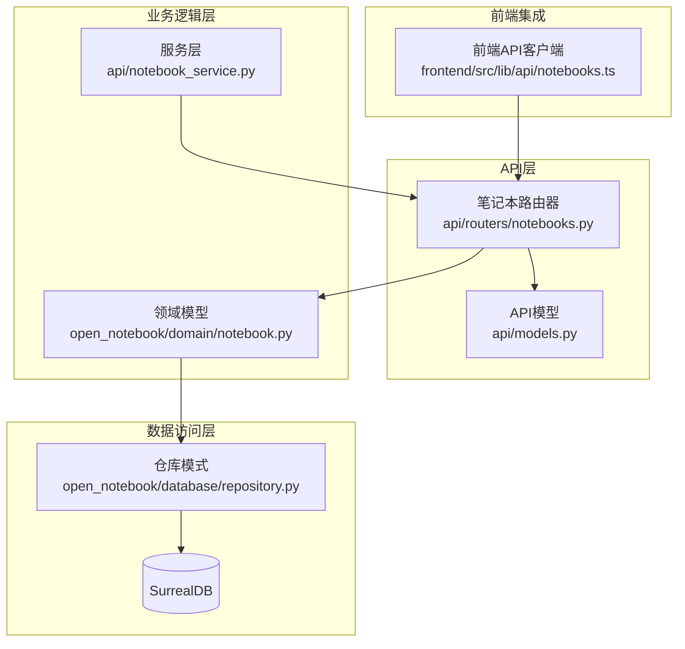
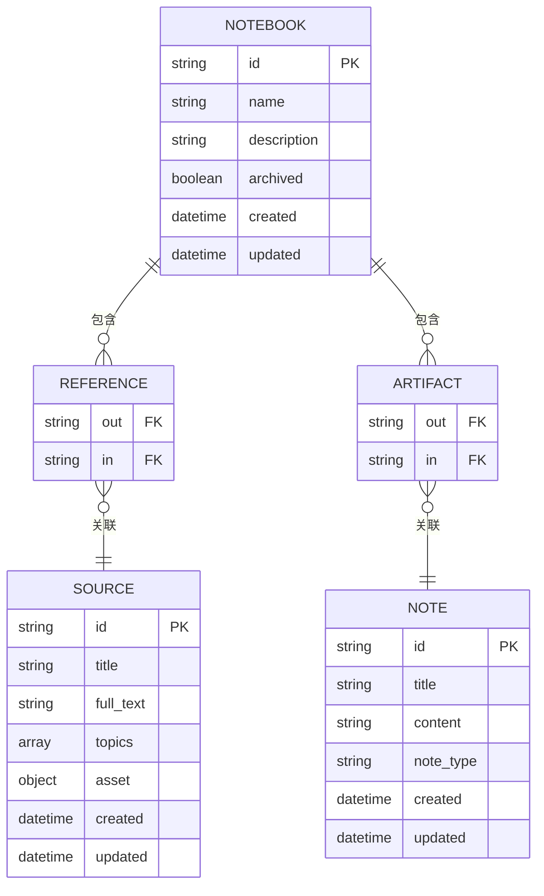
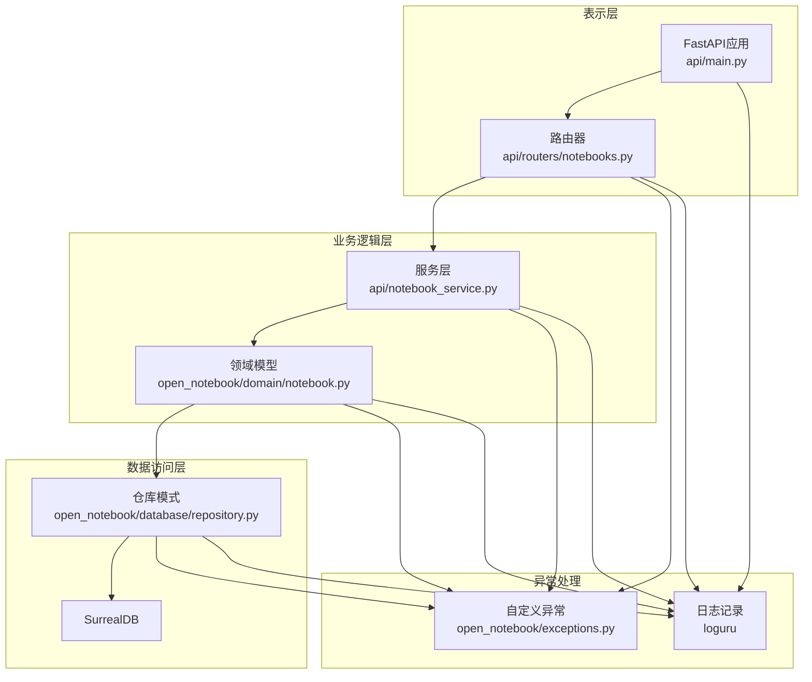
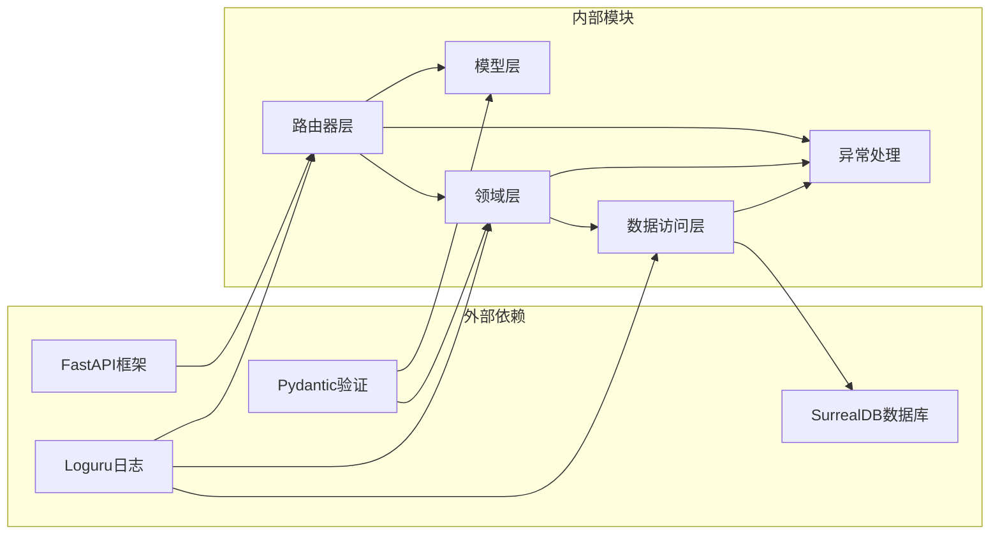
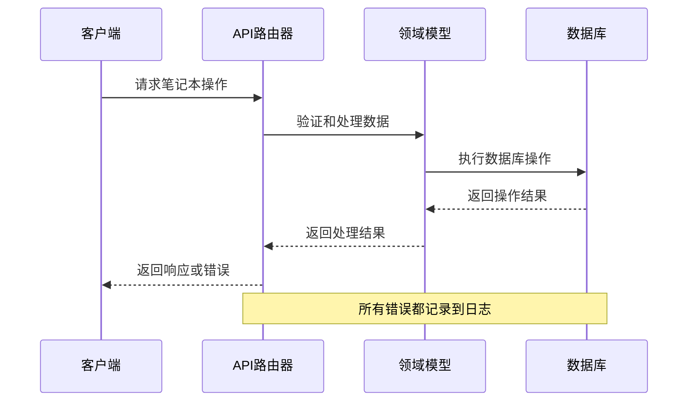

# 笔记本API

<cite>
**本文档引用的文件**
- [api/routers/notebooks.py](file://api/routers/notebooks.py)
- [api/models.py](file://api/models.py)
- [open_notebook/domain/notebook.py](file://open_notebook/domain/notebook.py)
- [open_notebook/database/repository.py](file://open_notebook/database/repository.py)
- [api/main.py](file://api/main.py)
- [frontend/src/lib/api/notebooks.ts](file://frontend/src/lib/api/notebooks.ts)
- [docs/7-DEVELOPMENT/architecture.md](file://docs/7-DEVELOPMENT/architecture.md)
- [docs/7-DEVELOPMENT/api-reference.md](file://docs/7-DEVELOPMENT/api-reference.md)
</cite>

## 目录
1. [简介](#简介)
2. [项目结构](#项目结构)
3. [核心组件](#核心组件)
4. [架构概览](#架构概览)
5. [详细组件分析](#详细组件分析)
6. [依赖关系分析](#依赖关系分析)
7. [性能考虑](#性能考虑)
8. [故障排除指南](#故障排除指南)
9. [结论](#结论)

## 简介

笔记本API是Open Notebook研究助手的核心组件，提供了完整的笔记本生命周期管理功能。该API基于FastAPI框架构建，使用SurrealDB作为数据存储，支持RESTful接口和实时交互式文档。

Open Notebook是一个智能研究助手平台，允许用户创建研究项目（笔记本），添加各种内容源（PDF、URL、文本等），并通过AI进行分析和总结。笔记本API为这些核心功能提供了完整的后端支持。

## 项目结构

Open Notebook采用模块化架构设计，笔记本API位于`api/routers/notebooks.py`文件中，与领域模型、服务层和数据库访问层分离：

**图表来源**
- [api/routers/notebooks.py](file://api/routers/notebooks.py#L1-L328)
- [api/models.py](file://api/models.py#L1-L685)
- [open_notebook/domain/notebook.py](file://open_notebook/domain/notebook.py#L1-L679)

**章节来源**
- [api/routers/notebooks.py](file://api/routers/notebooks.py#L1-L328)
- [api/main.py](file://api/main.py#L158-L179)

## 核心组件

### 数据模型

笔记本API定义了完整的数据模型体系，包括请求模型、响应模型和删除操作模型：

#### 基础模型
- **NotebookCreate**: 创建笔记本时使用的输入模型
- **NotebookUpdate**: 更新笔记本时使用的输入模型  
- **NotebookResponse**: API响应的标准输出模型

#### 删除相关模型
- **NotebookDeletePreview**: 删除预览模型，显示删除操作的影响
- **NotebookDeleteResponse**: 删除操作的响应模型

#### 关键字段说明

| 字段名 | 类型 | 描述 | 必填 |
|--------|------|------|------|
| id | string | 笔记本唯一标识符 | 否 |
| name | string | 笔记本名称 | 是 |
| description | string | 笔记本描述 | 否 |
| archived | boolean | 是否归档状态 | 否 |
| created | string | 创建时间戳 | 否 |
| updated | string | 最后更新时间戳 | 否 |
| source_count | integer | 关联的源数量 | 否 |
| note_count | integer | 关联的笔记数量 | 否 |

**章节来源**
- [api/models.py](file://api/models.py#L7-L29)
- [api/models.py](file://api/models.py#L666-L685)

### 数据库架构

笔记本系统基于SurrealDB构建，采用图数据库模式：

**图表来源**
- [docs/7-DEVELOPMENT/architecture.md](file://docs/7-DEVELOPMENT/architecture.md#L161-L174)

**章节来源**
- [docs/7-DEVELOPMENT/architecture.md](file://docs/7-DEVELOPMENT/architecture.md#L685-L738)

## 架构概览

笔记本API采用分层架构设计，确保关注点分离和代码可维护性：

**图表来源**
- [api/main.py](file://api/main.py#L99-L190)
- [api/routers/notebooks.py](file://api/routers/notebooks.py#L1-L328)

## 详细组件分析

### 笔记本路由器

笔记本路由器实现了完整的CRUD操作，包括创建、读取、更新、删除和列表查询：

#### GET /notebooks - 列表查询

**功能**: 获取所有笔记本，支持过滤和排序

**查询参数**:
- `archived`: 可选布尔值，按归档状态过滤
- `order_by`: 排序规则，默认"updated desc"

**响应**: 返回NotebookResponse对象数组

**实现细节**:
- 使用SurrealQL查询统计关联的源和笔记数量
- 支持动态排序字段和方向
- 运行时过滤归档状态

#### POST /notebooks - 创建笔记本

**功能**: 创建新的笔记本

**请求体**: NotebookCreate模型
- `name`: 必填，笔记本名称
- `description`: 可选，笔记本描述

**响应**: NotebookResponse对象

**验证规则**:
- 名称不能为空
- 自动设置创建和更新时间戳
- 默认归档状态为False

#### GET /notebooks/{notebook_id} - 读取单个笔记本

**功能**: 按ID获取特定笔记本

**路径参数**:
- `notebook_id`: 笔记本唯一标识符

**响应**: NotebookResponse对象

**错误处理**:
- 404: 找不到指定ID的笔记本

#### PUT /notebooks/{notebook_id} - 更新笔记本

**功能**: 更新现有笔记本的部分字段

**路径参数**:
- `notebook_id`: 要更新的笔记本ID

**请求体**: NotebookUpdate模型（可选字段）
- `name`: 新名称
- `description`: 新描述  
- `archived`: 新的归档状态

**响应**: 更新后的NotebookResponse对象

**实现特点**:
- 部分字段更新（仅更新提供的字段）
- 实时重新计算关联计数

#### DELETE /notebooks/{notebook_id} - 删除笔记本

**功能**: 删除笔记本及其关联数据

**路径参数**:
- `notebook_id`: 要删除的笔记本ID
- `delete_exclusive_sources`: 是否删除独占源

**响应**: NotebookDeleteResponse对象

**级联删除策略**:
- 总是删除关联的笔记
- 可选删除独占源（仅在没有其他笔记本关联时）
- 共享源仅取消关联

#### GET /notebooks/{notebook_id}/delete-preview - 删除预览

**功能**: 显示删除操作的影响预览

**响应**: NotebookDeletePreview对象

**预览信息**:
- 将删除的笔记数量
- 将删除的独占源数量
- 将取消关联的共享源数量

**章节来源**
- [api/routers/notebooks.py](file://api/routers/notebooks.py#L20-L328)

### 领域模型

笔记本领域模型继承自ObjectModel基类，提供了完整的数据验证和数据库操作能力：

#### 核心特性

1. **数据验证**: 使用Pydantic进行字段验证
2. **数据库操作**: 自动处理SurrealDB记录的CRUD
3. **关系管理**: 提供便捷的方法管理与其他实体的关系
4. **异步支持**: 完全异步的数据库操作

#### 关系方法

- `get_sources()`: 获取关联的源列表
- `get_notes()`: 获取关联的笔记列表  
- `get_delete_preview()`: 获取删除预览信息
- `delete(delete_exclusive_sources)`: 执行级联删除

**章节来源**
- [open_notebook/domain/notebook.py](file://open_notebook/domain/notebook.py#L16-L231)

### 仓库模式

仓库模式提供了统一的数据库访问接口，隐藏了具体的数据库实现细节：

#### 核心方法

- `repo_query()`: 执行查询并返回结果
- `repo_create()`: 创建新记录
- `repo_update()`: 更新现有记录
- `repo_delete()`: 删除记录
- `repo_relate()`: 创建实体间的关系

#### 数据库连接管理

- 自动连接和断开数据库
- 异常处理和重试机制
- 记录ID自动转换

**章节来源**
- [open_notebook/database/repository.py](file://open_notebook/database/repository.py#L65-L195)

## 依赖关系分析

笔记本API的依赖关系清晰明确，遵循单一职责原则：

**图表来源**
- [api/routers/notebooks.py](file://api/routers/notebooks.py#L1-L17)
- [open_notebook/domain/notebook.py](file://open_notebook/domain/notebook.py#L1-L14)

### 主要依赖

1. **FastAPI**: Web框架，提供路由、依赖注入和自动文档
2. **SurrealDB**: 图数据库，提供灵活的数据建模
3. **Pydantic**: 数据验证和序列化
4. **Loguru**: 结构化日志记录
5. **SurrealDB Python驱动**: 数据库连接和查询

**章节来源**
- [api/main.py](file://api/main.py#L1-L44)

## 性能考虑

### 查询优化

1. **批量计数查询**: 在单个查询中同时获取多个计数
2. **索引利用**: SurrealDB自动为常用查询建立索引
3. **异步操作**: 所有数据库操作都是异步的
4. **连接池**: 自动管理数据库连接

### 缓存策略

- **内存缓存**: 频繁访问的笔记本数据
- **数据库缓存**: SurrealDB内置缓存机制
- **响应缓存**: FastAPI自动缓存静态响应

### 并发处理

- **异步并发**: 支持高并发请求处理
- **事务隔离**: 数据库事务确保数据一致性
- **冲突检测**: 自动检测和处理并发冲突

## 故障排除指南

### 常见错误类型

#### HTTP 400 错误
- **原因**: 无效的输入数据
- **解决方案**: 检查请求体中的必填字段和数据格式

#### HTTP 404 错误  
- **原因**: 找不到指定ID的资源
- **解决方案**: 验证资源ID的有效性和存在性

#### HTTP 500 错误
- **原因**: 服务器内部错误
- **解决方案**: 查看服务器日志获取详细错误信息

### 日志分析

API使用Loguru框架进行结构化日志记录，所有错误都会记录到日志中：

**图表来源**
- [api/routers/notebooks.py](file://api/routers/notebooks.py#L55-L59)

### 调试技巧

1. **使用交互式文档**: 访问`/docs`端点查看实时API文档
2. **检查环境变量**: 确保数据库连接配置正确
3. **验证数据格式**: 使用Pydantic模型验证请求数据
4. **查看日志**: 检查服务器日志获取详细错误信息

**章节来源**
- [docs/7-DEVELOPMENT/api-reference.md](file://docs/7-DEVELOPMENT/api-reference.md#L1-L54)

## 结论

笔记本API提供了完整、健壮且高性能的研究助手平台核心功能。通过清晰的分层架构、严格的类型安全和完善的错误处理机制，该API能够满足复杂的研究工作流需求。

主要优势包括：
- **完整的CRUD支持**: 支持笔记本的完整生命周期管理
- **灵活的查询选项**: 支持过滤、排序和分页
- **强大的关系管理**: 优雅地处理笔记本与其他实体的关系
- **高性能设计**: 异步架构和数据库优化
- **开发友好**: 自动生成的API文档和交互式测试界面

该API为构建现代研究工具奠定了坚实的基础，支持从个人研究到团队协作的各种应用场景。