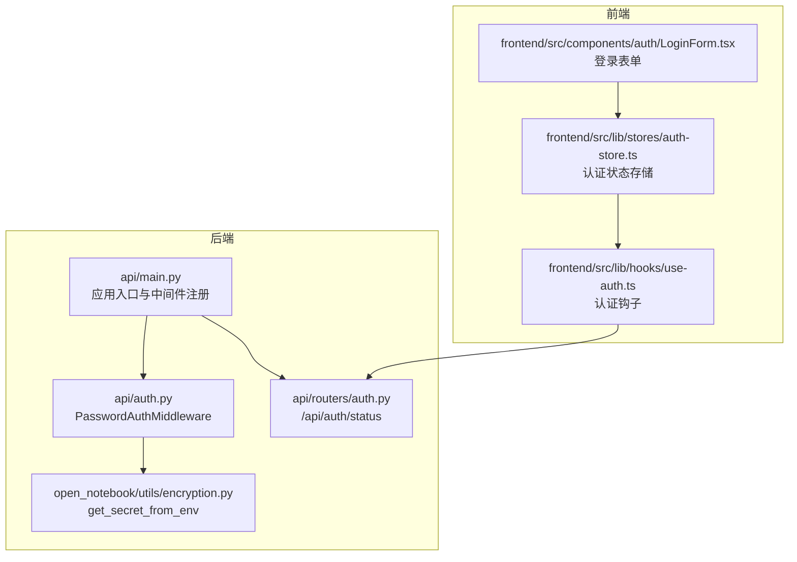
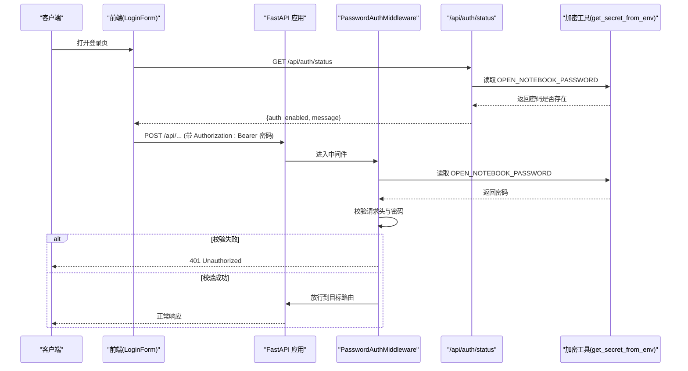
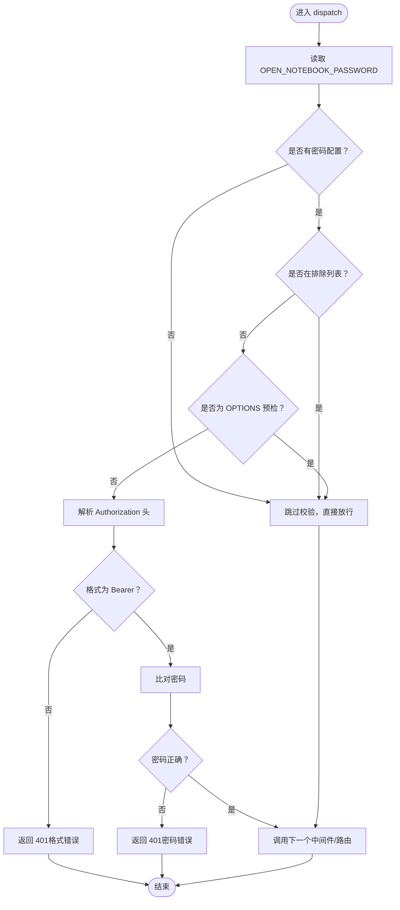
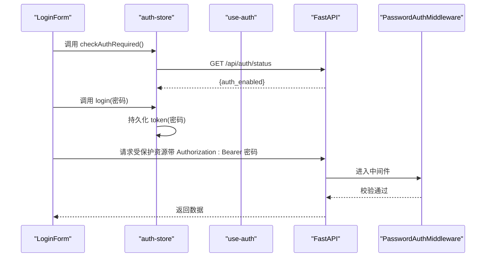
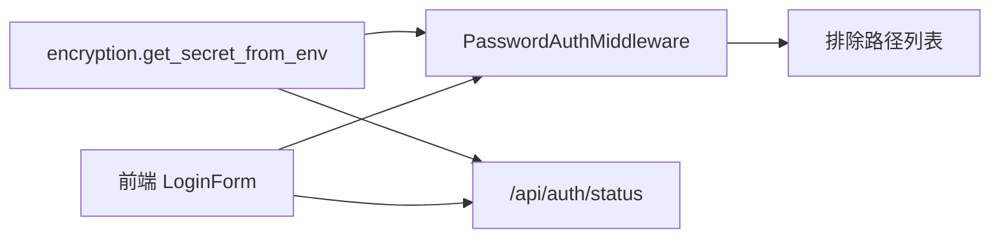

# 认证API

<cite>
**本文引用的文件**
- [api/auth.py](file://api/auth.py)
- [api/routers/auth.py](file://api/routers/auth.py)
- [api/main.py](file://api/main.py)
- [open_notebook/utils/encryption.py](file://open_notebook/utils/encryption.py)
- [frontend/src/components/auth/LoginForm.tsx](file://frontend/src/components/auth/LoginForm.tsx)
- [frontend/src/lib/stores/auth-store.ts](file://frontend/src/lib/stores/auth-store.ts)
- [frontend/src/lib/hooks/use-auth.ts](file://frontend/src/lib/hooks/use-auth.ts)
- [docs/5-CONFIGURATION/security.md](file://docs/5-CONFIGURATION/security.md)
- [.env.example](file://.env.example)
</cite>

## 目录
1. [简介](#简介)
2. [项目结构](#项目结构)
3. [核心组件](#核心组件)
4. [架构总览](#架构总览)
5. [详细组件分析](#详细组件分析)
6. [依赖关系分析](#依赖关系分析)
7. [性能考量](#性能考量)
8. [故障排查指南](#故障排查指南)
9. [结论](#结论)
10. [附录](#附录)

## 简介
本文件系统性地记录了 Open Notebook 的认证与访问控制方案，覆盖以下方面：
- 认证端点：/api/auth/status（认证状态检查）
- 认证中间件：PasswordAuthMiddleware（全局密码校验）
- 请求与响应规范：请求头 Authorization: Bearer {password} 的使用方式
- 错误处理与返回结构
- 安全最佳实践与常见问题排查
- 前后端协作流程（前端如何检测是否需要认证、如何存储会话）

注意：当前实现采用“密码即令牌”的简单访问控制模型，不包含传统 JWT 令牌签发与刷新机制。该设计适合单用户或受限环境，生产部署建议配合反向代理启用 HTTPS 并考虑更严格的访问控制。

## 项目结构
与认证相关的关键文件分布如下：
- 后端
  - 中间件与工具：api/auth.py、open_notebook/utils/encryption.py
  - 路由注册与应用入口：api/main.py、api/routers/auth.py
- 前端
  - 登录页与表单：frontend/src/components/auth/LoginForm.tsx
  - 认证状态与会话管理：frontend/src/lib/stores/auth-store.ts、frontend/src/lib/hooks/use-auth.ts

图表来源
- [api/main.py](file://api/main.py#L107-L118)
- [api/auth.py](file://api/auth.py#L12-L76)
- [open_notebook/utils/encryption.py](file://open_notebook/utils/encryption.py#L29-L59)
- [api/routers/auth.py](file://api/routers/auth.py#L10-L27)
- [frontend/src/components/auth/LoginForm.tsx](file://frontend/src/components/auth/LoginForm.tsx#L15-L187)
- [frontend/src/lib/stores/auth-store.ts](file://frontend/src/lib/stores/auth-store.ts#L1-L222)
- [frontend/src/lib/hooks/use-auth.ts](file://frontend/src/lib/hooks/use-auth.ts#L1-L68)

章节来源
- [api/main.py](file://api/main.py#L107-L118)
- [api/auth.py](file://api/auth.py#L12-L76)
- [open_notebook/utils/encryption.py](file://open_notebook/utils/encryption.py#L29-L59)
- [api/routers/auth.py](file://api/routers/auth.py#L10-L27)
- [frontend/src/components/auth/LoginForm.tsx](file://frontend/src/components/auth/LoginForm.tsx#L15-L187)
- [frontend/src/lib/stores/auth-store.ts](file://frontend/src/lib/stores/auth-store.ts#L1-L222)
- [frontend/src/lib/hooks/use-auth.ts](file://frontend/src/lib/hooks/use-auth.ts#L1-L68)

## 核心组件
- PasswordAuthMiddleware：全局中间件，对所有受保护路径进行密码校验；支持排除路径、CORS 预检请求跳过、Docker secrets 文件读取。
- check_api_password：可选的路由级依赖函数，用于在特定接口中显式校验密码。
- /api/auth/status：返回当前是否启用密码认证，支持 Docker secrets。
- 前端认证流程：登录页通过 /api/auth/status 判断是否需要认证；登录成功后在本地持久化 token（即密码），后续请求由中间件统一校验。

章节来源
- [api/auth.py](file://api/auth.py#L12-L76)
- [api/auth.py](file://api/auth.py#L82-L115)
- [api/routers/auth.py](file://api/routers/auth.py#L10-L27)
- [frontend/src/lib/stores/auth-store.ts](file://frontend/src/lib/stores/auth-store.ts#L37-L140)

## 架构总览
下图展示了从客户端到后端的认证交互，以及中间件如何拦截请求并进行密码校验。

图表来源
- [api/main.py](file://api/main.py#L107-L118)
- [api/auth.py](file://api/auth.py#L30-L75)
- [api/routers/auth.py](file://api/routers/auth.py#L13-L27)
- [open_notebook/utils/encryption.py](file://open_notebook/utils/encryption.py#L29-L59)
- [frontend/src/components/auth/LoginForm.tsx](file://frontend/src/components/auth/LoginForm.tsx#L128-L138)

## 详细组件分析

### 密码认证中间件 PasswordAuthMiddleware
- 功能要点
  - 全局拦截所有 API 请求，校验 Authorization 头中的 Bearer 密码
  - 若未配置 OPEN_NOTEBOOK_PASSWORD，则跳过校验（等同于关闭认证）
  - 支持排除路径列表（如 /、/health、/docs、/openapi.json、/redoc、/api/auth/status、/api/config）
  - 对 CORS 预检请求（OPTIONS）直接放行
  - 支持 Docker secrets：通过 OPEN_NOTEBOOK_PASSWORD_FILE 读取密码
- 错误处理
  - 缺少 Authorization 头：返回 401，并携带 WWW-Authenticate: Bearer
  - 头格式不正确或非 Bearer 方案：返回 401
  - 密码不匹配：返回 401
- 性能与行为
  - 每次请求都会解析 Authorization 头并比较字符串，复杂度 O(1)
  - 排除路径与 OPTIONS 预检避免不必要的开销

图表来源
- [api/auth.py](file://api/auth.py#L19-L75)
- [open_notebook/utils/encryption.py](file://open_notebook/utils/encryption.py#L29-L59)

章节来源
- [api/auth.py](file://api/auth.py#L12-L76)
- [open_notebook/utils/encryption.py](file://open_notebook/utils/encryption.py#L29-L59)

### 认证状态检查端点 /api/auth/status
- 路由定义
  - 路由前缀：/api
  - 标签：auth
  - 端点：GET /api/auth/status
- 行为说明
  - 读取 OPEN_NOTEBOOK_PASSWORD 是否存在，决定 auth_enabled 字段
  - 返回消息字段提示当前是否需要认证
  - 支持 Docker secrets 文件读取
- 响应结构
  - auth_enabled: 布尔值
  - message: 文本提示
- 使用场景
  - 前端在首次加载时判断是否显示登录表单
  - 登录成功后将密码作为 token 存储，后续请求由中间件统一校验

章节来源
- [api/routers/auth.py](file://api/routers/auth.py#L10-L27)
- [open_notebook/utils/encryption.py](file://open_notebook/utils/encryption.py#L29-L59)

### 路由级密码校验依赖 check_api_password
- 用途
  - 可作为路由依赖，在个别接口中显式要求密码校验
- 行为
  - 无密码配置则直接放行
  - 缺少凭据或密码不匹配时抛出 401 异常
- 适用场景
  - 需要细粒度控制的敏感接口

章节来源
- [api/auth.py](file://api/auth.py#L82-L115)

### 前端认证流程与会话管理
- 登录页逻辑
  - 首次加载时调用 /api/auth/status 判断是否需要认证
  - 用户输入密码后触发登录流程
- 会话存储
  - 将密码作为 token 存储在本地（浏览器会话期间有效）
  - 后续请求通过 Authorization: Bearer {password} 发送
- 钩子与状态
  - useAuth 钩子负责登录/登出与重定向
  - useAuthStore 统一管理认证状态、错误信息与持久化

图表来源
- [frontend/src/components/auth/LoginForm.tsx](file://frontend/src/components/auth/LoginForm.tsx#L37-L69)
- [frontend/src/lib/stores/auth-store.ts](file://frontend/src/lib/stores/auth-store.ts#L37-L140)
- [frontend/src/lib/hooks/use-auth.ts](file://frontend/src/lib/hooks/use-auth.ts#L41-L59)
- [api/auth.py](file://api/auth.py#L30-L75)

章节来源
- [frontend/src/components/auth/LoginForm.tsx](file://frontend/src/components/auth/LoginForm.tsx#L15-L187)
- [frontend/src/lib/stores/auth-store.ts](file://frontend/src/lib/stores/auth-store.ts#L1-L222)
- [frontend/src/lib/hooks/use-auth.ts](file://frontend/src/lib/hooks/use-auth.ts#L1-L68)

## 依赖关系分析
- 中间件依赖
  - 读取 OPEN_NOTEBOOK_PASSWORD 或其文件形式（OPEN_NOTEBOOK_PASSWORD_FILE）
  - 排除路径列表在应用启动时注入
- 路由依赖
  - /api/auth/status 依赖密码配置以判断是否启用认证
- 前端依赖
  - 通过 /api/auth/status 决定是否需要登录
  - 将密码作为 token 存储并在后续请求中发送

图表来源
- [api/auth.py](file://api/auth.py#L19-L28)
- [api/main.py](file://api/main.py#L107-L118)
- [api/routers/auth.py](file://api/routers/auth.py#L20-L26)
- [open_notebook/utils/encryption.py](file://open_notebook/utils/encryption.py#L29-L59)
- [frontend/src/components/auth/LoginForm.tsx](file://frontend/src/components/auth/LoginForm.tsx#L43-L68)

章节来源
- [api/auth.py](file://api/auth.py#L12-L76)
- [api/main.py](file://api/main.py#L107-L118)
- [api/routers/auth.py](file://api/routers/auth.py#L10-L27)
- [open_notebook/utils/encryption.py](file://open_notebook/utils/encryption.py#L29-L59)
- [frontend/src/components/auth/LoginForm.tsx](file://frontend/src/components/auth/LoginForm.tsx#L37-L69)

## 性能考量
- 中间件开销极低：每次请求仅做字符串比较与少量条件判断，时间复杂度 O(1)
- 排除路径与 OPTIONS 预检提前放行，减少无效校验
- 建议
  - 在高并发场景下，优先使用反向代理缓存静态资源与健康检查端点
  - 将 /api/auth/status 作为轻量接口，避免频繁重复调用（前端已内置缓存策略）

## 故障排查指南
- 401 未授权
  - 检查请求头 Authorization 是否为 Bearer {password}
  - 确认 OPEN_NOTEBOOK_PASSWORD 与 OPEN_NOTEBOOK_PASSWORD_FILE 配置正确
  - 排查排除路径是否命中（如 /api/auth/status、/api/config）
- 无法访问 /api/auth/status
  - 确认应用已注册该路由且未被排除
- 生产部署建议
  - 必须启用 HTTPS，避免密码明文传输
  - 使用强密码（推荐长度 20+，混合大小写、数字、符号）
  - 结合反向代理限制端口暴露与防火墙规则

章节来源
- [api/auth.py](file://api/auth.py#L46-L71)
- [docs/5-CONFIGURATION/security.md](file://docs/5-CONFIGURATION/security.md#L330-L378)

## 结论
当前认证体系采用“密码即令牌”的简单模型，具备以下特点：
- 易于部署与理解：无需额外鉴权服务
- 适合单用户或受限网络：前端将密码作为会话 token 使用
- 安全边界有限：不提供会话超时、多用户、审计日志等能力
生产部署务必配合 HTTPS、强密码与网络隔离策略，必要时引入企业级鉴权方案。

## 附录

### API 端点一览
- GET /api/auth/status
  - 功能：检查是否启用密码认证
  - 成功响应字段：auth_enabled（布尔）、message（文本）
  - 示例请求：GET /api/auth/status
  - 示例响应：{"auth_enabled": true, "message": "Authentication is required"}

章节来源
- [api/routers/auth.py](file://api/routers/auth.py#L13-L27)

### 请求与响应规范
- 请求头
  - Authorization: Bearer {password}
- 成功响应
  - 由具体业务路由返回标准 JSON 数据
- 错误响应
  - 401 Unauthorized：缺少或无效的 Authorization 头、密码错误
  - 404/其他：由具体路由或 FastAPI 默认处理

章节来源
- [api/auth.py](file://api/auth.py#L46-L71)
- [docs/5-CONFIGURATION/security.md](file://docs/5-CONFIGURATION/security.md#L172-L240)

### 中间件配置与排除路径
- 中间件注册位置：应用启动时添加
- 排除路径（默认）：/, /health, /docs, /openapi.json, /redoc, /api/auth/status, /api/config
- Docker 秘密文件：OPEN_NOTEBOOK_PASSWORD_FILE

章节来源
- [api/main.py](file://api/main.py#L107-L118)
- [api/auth.py](file://api/auth.py#L19-L28)

### 安全最佳实践
- 强密码与定期轮换
- 仅在 HTTPS 下传输
- 限制网络暴露与端口访问
- 使用反向代理与防火墙加固
- 不在客户端存储长期会话令牌（当前实现以密码为 token，注意浏览器会话清理）

章节来源
- [docs/5-CONFIGURATION/security.md](file://docs/5-CONFIGURATION/security.md#L243-L327)