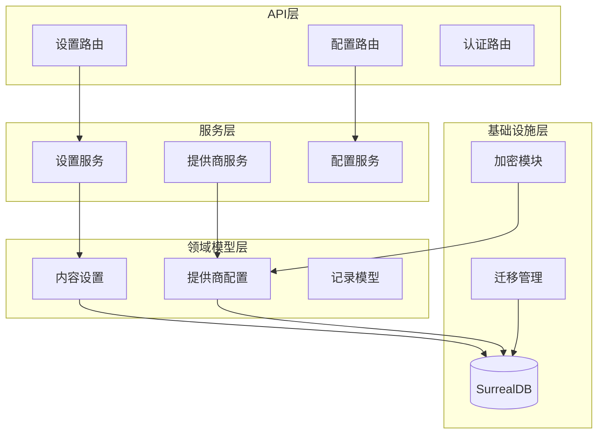
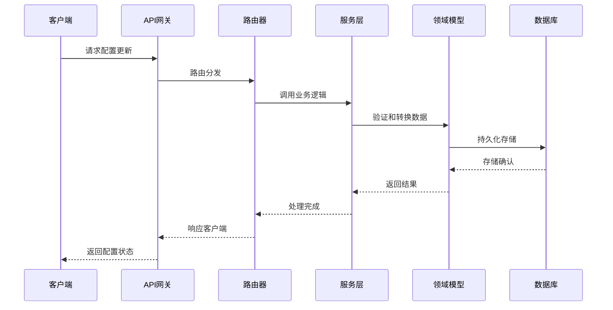
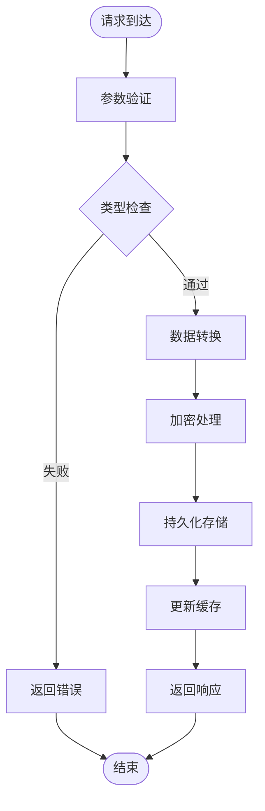
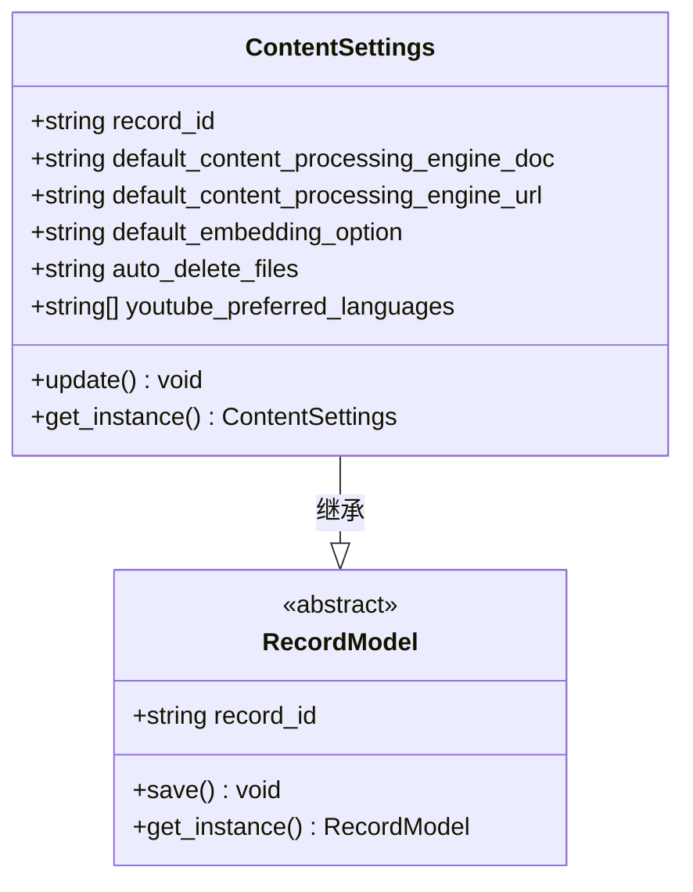
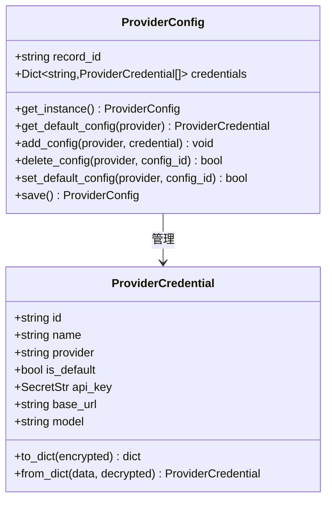
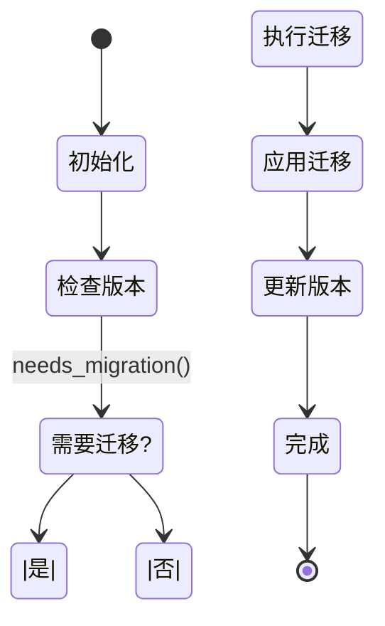
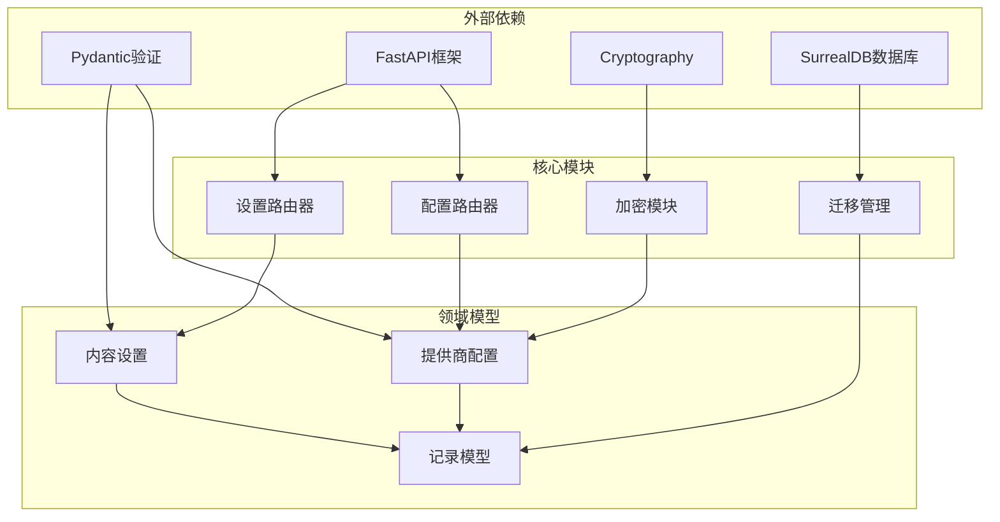

# 设置与配置API

<cite>
**本文档引用的文件**
- [api/routers/settings.py](file://api/routers/settings.py)
- [api/routers/config.py](file://api/routers/config.py)
- [api/models.py](file://api/models.py)
- [api/settings_service.py](file://api/settings_service.py)
- [open_notebook/domain/content_settings.py](file://open_notebook/domain/content_settings.py)
- [open_notebook/domain/provider_config.py](file://open_notebook/domain/provider_config.py)
- [open_notebook/utils/encryption.py](file://open_notebook/utils/encryption.py)
- [open_notebook/database/async_migrate.py](file://open_notebook/database/async_migrate.py)
- [open_notebook/config.py](file://open_notebook/config.py)
- [api/main.py](file://api/main.py)
- [docs/5-CONFIGURATION/index.md](file://docs/5-CONFIGURATION/index.md)
- [docs/5-CONFIGURATION/environment-reference.md](file://docs/5-CONFIGURATION/environment-reference.md)
- [docs/5-CONFIGURATION/advanced.md](file://docs/5-CONFIGURATION/advanced.md)
</cite>

## 目录
1. [简介](#简介)
2. [项目结构](#项目结构)
3. [核心组件](#核心组件)
4. [架构概览](#架构概览)
5. [详细组件分析](#详细组件分析)
6. [依赖关系分析](#依赖关系分析)
7. [性能考虑](#性能考虑)
8. [故障排除指南](#故障排除指南)
9. [结论](#结论)
10. [附录](#附录)

## 简介

Open Notebook 的设置与配置API提供了完整的系统配置管理能力，包括AI提供商配置、数据库设置、安全配置和性能调优等功能。该API支持动态配置更新、加密存储、版本管理和备份恢复等高级特性。

本API主要服务于以下核心功能：
- **AI提供商配置管理**：支持多种AI服务提供商的密钥和参数配置
- **应用设置管理**：内容处理引擎、嵌入选项、文件删除策略等
- **数据库配置**：SurrealDB连接和迁移管理
- **安全配置**：密码保护、API认证、敏感信息加密
- **性能调优**：超时设置、并发控制、缓存策略

## 项目结构

系统采用分层架构设计，主要组件分布如下：

**图表来源**
- [api/routers/settings.py](file://api/routers/settings.py#L1-L89)
- [api/routers/config.py](file://api/routers/config.py#L1-L161)
- [open_notebook/domain/content_settings.py](file://open_notebook/domain/content_settings.py#L1-L26)
- [open_notebook/domain/provider_config.py](file://open_notebook/domain/provider_config.py#L1-L445)

**章节来源**
- [api/routers/settings.py](file://api/routers/settings.py#L1-L89)
- [api/routers/config.py](file://api/routers/config.py#L1-L161)
- [api/main.py](file://api/main.py#L1-L190)

## 核心组件

### 设置管理API

设置管理API提供对应用配置的完整生命周期管理：

**GET /api/settings** - 获取当前设置
- 返回所有配置项的当前状态
- 包括内容处理引擎、嵌入选项、文件删除策略等
- 支持实时查看配置状态

**PUT /api/settings** - 更新设置
- 支持部分字段更新（仅提供需要修改的字段）
- 强类型验证和默认值处理
- 动态配置更新机制

### 配置检查API

配置检查API提供系统健康状态和版本信息：

**GET /api/config** - 获取配置信息
- 版本号查询和更新检查
- 数据库连接状态检测
- 健康状态监控

### 提供商配置管理

提供商配置系统支持多提供商、多配置的复杂场景：

- **多配置支持**：同一提供商可配置多个不同环境的凭据
- **默认配置管理**：自动选择默认配置和手动切换
- **加密存储**：敏感API密钥的安全存储
- **动态加载**：运行时配置变更无需重启

**章节来源**
- [api/routers/settings.py](file://api/routers/settings.py#L11-L89)
- [api/routers/config.py](file://api/routers/config.py#L123-L161)
- [open_notebook/domain/content_settings.py](file://open_notebook/domain/content_settings.py#L8-L26)
- [open_notebook/domain/provider_config.py](file://open_notebook/domain/provider_config.py#L175-L445)

## 架构概览

系统采用模块化设计，各组件职责清晰分离：

**图表来源**
- [api/routers/settings.py](file://api/routers/settings.py#L31-L89)
- [api/settings_service.py](file://api/settings_service.py#L43-L75)

### 数据流架构

**图表来源**
- [open_notebook/domain/provider_config.py](file://open_notebook/domain/provider_config.py#L411-L427)
- [open_notebook/utils/encryption.py](file://open_notebook/utils/encryption.py#L128-L143)

## 详细组件分析

### 内容设置模型

内容设置模型定义了应用的核心配置参数：

**图表来源**
- [open_notebook/domain/content_settings.py](file://open_notebook/domain/content_settings.py#L8-L26)

**配置项说明**：
- **default_content_processing_engine_doc**: 文档内容处理引擎，默认值为"auto"
- **default_content_processing_engine_url**: URL内容处理引擎，默认值为"auto"  
- **default_embedding_option**: 向量搜索嵌入选项，默认值为"ask"
- **auto_delete_files**: 自动删除上传文件，默认值为"yes"
- **youtube_preferred_languages**: YouTube字幕首选语言列表，默认包含多种语言

### 提供商配置系统

提供商配置系统支持复杂的多配置管理：

**图表来源**
- [open_notebook/domain/provider_config.py](file://open_notebook/domain/provider_config.py#L175-L445)

**核心特性**：
- **多配置支持**：同一提供商可配置多个不同环境的凭据
- **默认配置机制**：智能选择默认配置和手动切换
- **加密存储**：使用Fernet对称加密保护敏感信息
- **动态加载**：运行时从数据库加载最新配置

### 加密存储机制

系统采用Fernet对称加密确保敏感信息的安全存储：

**图表来源**
- [open_notebook/utils/encryption.py](file://open_notebook/utils/encryption.py#L104-L125)
- [open_notebook/utils/encryption.py](file://open_notebook/utils/encryption.py#L167-L199)

**加密特性**：
- **Fernet对称加密**：AES-128-CBC + HMAC-SHA256
- **密钥派生**：任意字符串通过SHA-256派生有效密钥
- **令牌验证**：自动识别加密令牌格式
- **兼容性**：支持Docker secrets文件模式

### 数据库迁移管理

系统内置异步迁移管理器，确保数据库结构的一致性：

**图表来源**
- [open_notebook/database/async_migrate.py](file://open_notebook/database/async_migrate.py#L169-L189)

**迁移特性**：
- **异步执行**：非阻塞的数据库迁移操作
- **版本管理**：自动跟踪和更新数据库版本
- **回滚支持**：支持向后迁移和版本降级
- **幂等性**：重复执行不会产生副作用

**章节来源**
- [open_notebook/domain/content_settings.py](file://open_notebook/domain/content_settings.py#L1-L26)
- [open_notebook/domain/provider_config.py](file://open_notebook/domain/provider_config.py#L1-L445)
- [open_notebook/utils/encryption.py](file://open_notebook/utils/encryption.py#L1-L199)
- [open_notebook/database/async_migrate.py](file://open_notebook/database/async_migrate.py#L1-L229)

## 依赖关系分析

系统组件间的依赖关系呈现清晰的分层结构：

**图表来源**
- [api/routers/settings.py](file://api/routers/settings.py#L1-L89)
- [api/routers/config.py](file://api/routers/config.py#L1-L161)
- [open_notebook/domain/content_settings.py](file://open_notebook/domain/content_settings.py#L1-L26)
- [open_notebook/domain/provider_config.py](file://open_notebook/domain/provider_config.py#L1-L445)

**依赖特性**：
- **松耦合设计**：各模块间依赖关系清晰，便于维护
- **接口抽象**：通过抽象基类实现模块间解耦
- **异常隔离**：错误处理在适当层级进行
- **资源管理**：数据库连接和加密资源的生命周期管理

**章节来源**
- [api/routers/settings.py](file://api/routers/settings.py#L1-L89)
- [api/routers/config.py](file://api/routers/config.py#L1-L161)
- [open_notebook/domain/content_settings.py](file://open_notebook/domain/content_settings.py#L1-L26)
- [open_notebook/domain/provider_config.py](file://open_notebook/domain/provider_config.py#L1-L445)

## 性能考虑

系统在设计时充分考虑了性能优化和资源管理：

### 缓存策略
- **版本检查缓存**：24小时缓存机制避免频繁的GitHub版本检查
- **配置实例缓存**：ProviderConfig单例模式减少数据库查询开销
- **内存缓存**：敏感配置在内存中缓存以提高访问速度

### 连接管理
- **数据库连接池**：SurrealDB连接的高效复用
- **超时控制**：合理的超时设置防止资源泄露
- **健康检查**：定期的数据库连接状态检查

### 并发处理
- **异步操作**：数据库迁移和配置检查的异步执行
- **任务队列**：后台任务的有序处理
- **资源限制**：最大并发任务数的配置

## 故障排除指南

### 常见问题诊断

**配置更新失败**
- 检查OPEN_NOTEBOOK_ENCRYPTION_KEY是否正确设置
- 验证数据库连接状态
- 查看日志中的具体错误信息

**API密钥存储问题**
- 确认加密密钥未被更改或丢失
- 检查数据库中是否存在provider_configs记录
- 验证Fernet密钥派生过程

**数据库迁移失败**
- 检查SurrealDB服务状态
- 验证数据库权限配置
- 查看迁移脚本的执行日志

### 性能优化建议

**配置优化**
- 合理设置API_CLIENT_TIMEOUT参数
- 调整SURREAL_COMMANDS_MAX_TASKS提升并发处理能力
- 配置适当的TTS_BATCH_SIZE优化音频处理

**监控指标**
- 监控数据库连接池使用情况
- 跟踪API响应时间和错误率
- 观察内存使用和垃圾回收频率

**章节来源**
- [docs/5-CONFIGURATION/environment-reference.md](file://docs/5-CONFIGURATION/environment-reference.md#L1-L275)
- [docs/5-CONFIGURATION/advanced.md](file://docs/5-CONFIGURATION/advanced.md#L423-L512)

## 结论

Open Notebook的设置与配置API提供了一个完整、安全、高性能的配置管理系统。通过模块化设计和严格的分层架构，系统实现了以下关键目标：

**安全性保障**
- 敏感信息的加密存储和传输
- 多层次的身份验证和授权机制
- 完善的错误处理和日志记录

**可扩展性**
- 模块化的组件设计支持功能扩展
- 异步架构支持高并发场景
- 数据库迁移系统确保Schema演进

**易用性**
- 直观的RESTful API设计
- 完善的错误处理和响应格式
- 详细的文档和示例代码

该API系统为Open Notebook提供了坚实的基础，支持从个人使用到企业部署的各种场景需求。

## 附录

### API端点参考

**设置管理**
- GET `/api/settings` - 获取当前配置
- PUT `/api/settings` - 更新配置

**配置检查**
- GET `/api/config` - 获取系统配置信息

### 配置参数说明

**环境变量**
- OPEN_NOTEBOOK_ENCRYPTION_KEY: 加密密钥（必需）
- SURREAL_URL: 数据库连接URL（必需）
- API_URL: API服务地址
- OPEN_NOTEBOOK_PASSWORD: 密码保护

**默认值**
- API_CLIENT_TIMEOUT: 300秒
- SURREAL_COMMANDS_MAX_TASKS: 5个并发任务
- TTS_BATCH_SIZE: 5个并发请求

### 备份和恢复

系统支持完整的数据备份和恢复流程：

**备份策略**
- 定期自动备份脚本
- 数据库和文件系统的完整备份
- 版本化备份管理和清理

**恢复流程**
- 服务停止和数据清理
- 备份文件解压和恢复
- 服务启动和验证

**章节来源**
- [docs/5-CONFIGURATION/index.md](file://docs/5-CONFIGURATION/index.md#L1-L329)
- [docs/5-CONFIGURATION/environment-reference.md](file://docs/5-CONFIGURATION/environment-reference.md#L1-L275)
- [docs/5-CONFIGURATION/advanced.md](file://docs/5-CONFIGURATION/advanced.md#L423-L512)