# API集成

<cite>
**本文档引用的文件**
- [api/main.py](file://api/main.py)
- [api/routers/__init__.py](file://api/routers/__init__.py)
- [api/routers/auth.py](file://api/routers/auth.py)
- [api/routers/notebooks.py](file://api/routers/notebooks.py)
- [api/routers/search.py](file://api/routers/search.py)
- [api/routers/chat.py](file://api/routers/chat.py)
- [api/routers/sources.py](file://api/routers/sources.py)
- [api/routers/p0_scheduler.py](file://api/routers/p0_scheduler.py)
- [api/routers/p3_evolution.py](file://api/routers/p3_evolution.py)
- [api/routers/personal_ip.py](file://api/routers/personal_ip.py)
- [api/routers/platform_accounts.py](file://api/routers/platform_accounts.py)
- [api/routers/publish.py](file://api/routers/publish.py)
- [api/models.py](file://api/models.py)
- [api/auth.py](file://api/auth.py)
- [api/client.py](file://api/client.py)
- [open_notebook/domain/notebook.py](file://open_notebook/domain/notebook.py)
- [open_notebook/ai/models.py](file://open_notebook/ai/models.py)
- [run_api.py](file://run_api.py)
</cite>

## 更新摘要
**变更内容**
- 新增5个高级功能路由器模块的详细分析
- 更新路由器系统架构图以包含新增模块
- 添加个人IP管理、平台账户管理、自动发布系统的API端点说明
- 更新数据流架构图以反映新的业务流程
- 增强了AI系统集成的详细说明

## 目录
1. [简介](#简介)
2. [项目结构](#项目结构)
3. [核心组件](#核心组件)
4. [架构概览](#架构概览)
5. [详细组件分析](#详细组件分析)
6. [新增功能模块](#新增功能模块)
7. [依赖关系分析](#依赖关系分析)
8. [性能考虑](#性能考虑)
9. [故障排除指南](#故障排除指南)
10. [结论](#结论)

## 简介

OpenNotebook是一个智能研究助手平台，提供完整的API集成解决方案。该系统基于FastAPI构建，支持多模态AI模型、向量搜索、聊天会话管理和内容处理等功能。

**更新** 本项目现已扩展为包含5个新增的高级功能模块，涵盖个人IP管理、平台账户集成、自动发布系统和AI系统调度等企业级功能。

本项目的核心目标是为用户提供一个统一的API接口，用于管理知识库、执行AI操作、处理多媒体内容、进行智能搜索以及管理复杂的个人IP运营生态系统。

## 项目结构

OpenNotebook的API架构采用分层设计模式，主要包含以下核心层次：

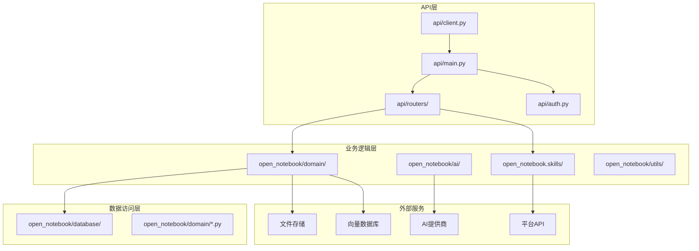

**图表来源**
- [api/main.py](file://api/main.py#L173-L275)
- [api/routers/__init__.py](file://api/routers/__init__.py#L1-L56)

**章节来源**
- [api/main.py](file://api/main.py#L1-L275)
- [api/routers/__init__.py](file://api/routers/__init__.py#L1-L56)

## 核心组件

### API应用实例

主应用程序实例配置了完整的中间件栈和路由系统：

- **生命周期管理**：自动数据库迁移、AI提供商初始化、技能调度器启动
- **安全中间件**：密码认证中间件，支持Docker secrets
- **CORS配置**：跨域资源共享支持
- **异常处理**：自定义HTTP异常处理器

### 路由器系统

**更新** 系统现已包含25个专门的路由器，每个负责特定功能领域：

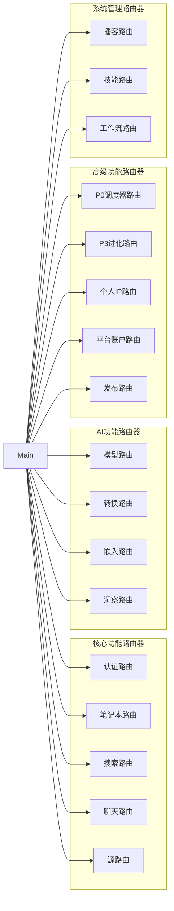

**图表来源**
- [api/main.py](file://api/main.py#L29-L44)
- [api/routers/__init__.py](file://api/routers/__init__.py#L3-L28)

### 数据模型系统

统一的数据模型定义确保了API的一致性和类型安全性：

- **请求/响应模型**：Pydantic模型定义
- **验证规则**：字段验证和约束
- **序列化支持**：JSON序列化兼容

**章节来源**
- [api/main.py](file://api/main.py#L173-L275)
- [api/models.py](file://api/models.py#L1-L200)

## 架构概览

OpenNotebook采用现代微服务架构，结合了以下关键技术特性：

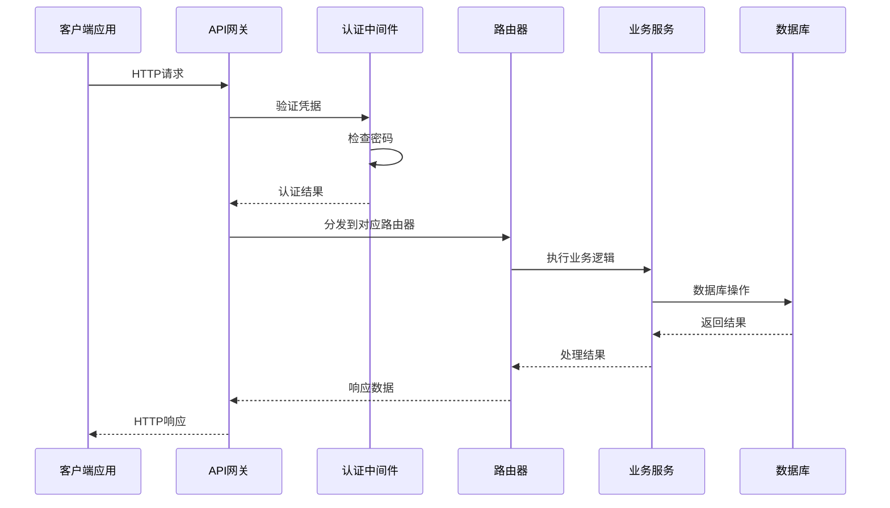

**图表来源**
- [api/main.py](file://api/main.py#L179-L228)
- [api/auth.py](file://api/auth.py#L12-L76)

### 中间件架构

系统实现了多层次的中间件处理：

1. **密码认证中间件**：全局请求拦截
2. **CORS中间件**：跨域请求处理
3. **异常处理中间件**：错误响应标准化

**章节来源**
- [api/main.py](file://api/main.py#L179-L228)
- [api/auth.py](file://api/auth.py#L12-L115)

## 详细组件分析

### 认证系统

密码认证中间件提供了灵活的安全机制：

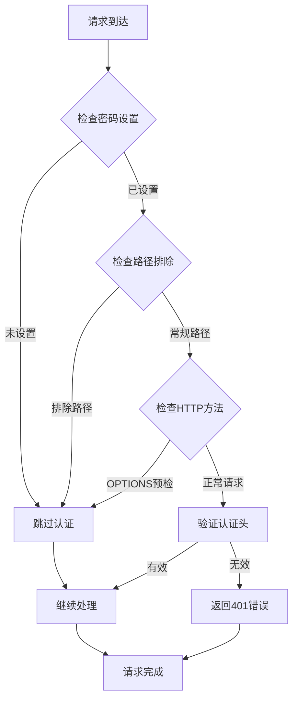

**图表来源**
- [api/auth.py](file://api/auth.py#L30-L75)

### 笔记本管理

笔记本路由提供了完整的CRUD操作：

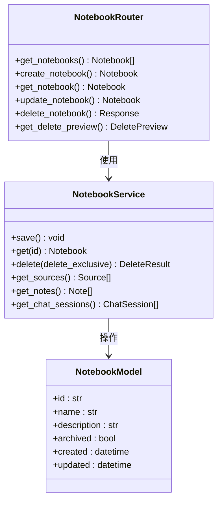

**图表来源**
- [api/routers/notebooks.py](file://api/routers/notebooks.py#L20-L200)
- [open_notebook/domain/notebook.py](file://open_notebook/domain/notebook.py#L16-L137)

### 搜索引擎

搜索功能支持文本和向量两种搜索模式：

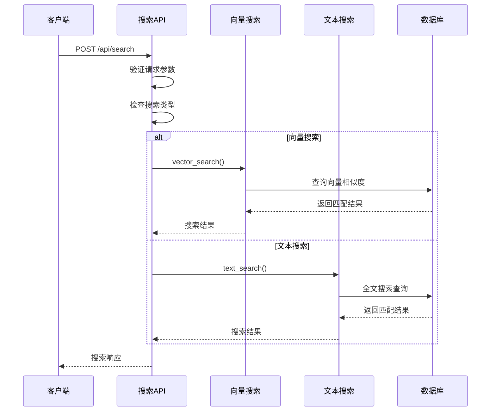

**图表来源**
- [api/routers/search.py](file://api/routers/search.py#L17-L59)

### 聊天系统

聊天会话管理支持实时对话和上下文维护：

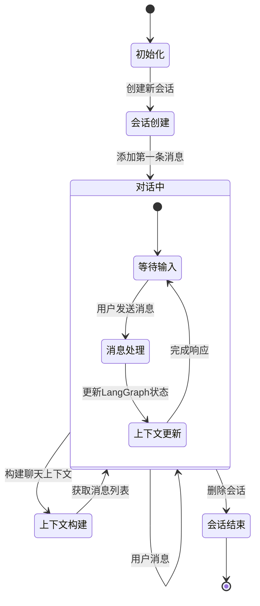

**图表来源**
- [api/routers/chat.py](file://api/routers/chat.py#L96-L200)

### 源文件处理

源文件路由支持多种内容类型和异步处理：

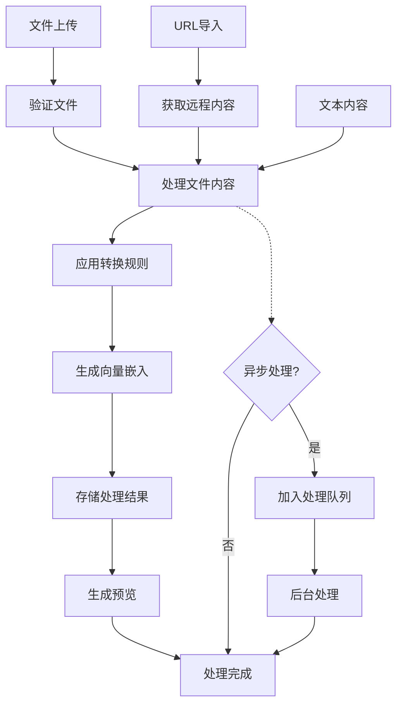

**图表来源**
- [api/routers/sources.py](file://api/routers/sources.py#L64-L150)

**章节来源**
- [api/routers/notebooks.py](file://api/routers/notebooks.py#L20-L200)
- [api/routers/search.py](file://api/routers/search.py#L17-L200)
- [api/routers/chat.py](file://api/routers/chat.py#L96-L200)
- [api/routers/sources.py](file://api/routers/sources.py#L64-L200)

## 新增功能模块

### P0每日同步调度器

**更新** 新增的P0调度器模块提供了完整的AI系统调度管理功能：

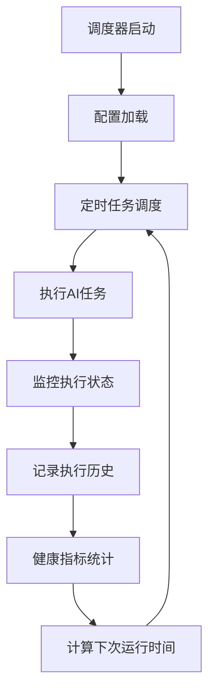

**图表来源**
- [api/routers/p0_scheduler.py](file://api/routers/p0_scheduler.py#L98-L141)

#### 核心功能
- **简单时间配置**：支持HH:MM格式的日常同步时间设置
- **Cron表达式支持**：高级调度配置选项
- **手动触发**：立即执行同步任务的能力
- **健康监控**：执行成功率、平均时长等关键指标
- **信号管理**：从共享内存获取活跃信号

#### API端点
- `POST /api/p0-scheduler/start` - 启动调度器（简单配置）
- `POST /api/p0-scheduler/start/cron` - 启动调度器（Cron配置）
- `POST /api/p0-scheduler/stop` - 停止调度器
- `GET /api/p0-scheduler/status` - 获取调度器状态
- `POST /api/p0-scheduler/trigger` - 手动触发同步
- `GET /api/p0-scheduler/history` - 查看执行历史
- `GET /api/p0-scheduler/health` - 获取健康指标
- `PATCH /api/p0-scheduler/schedule` - 更新调度时间
- `GET /api/p0-scheduler/signals/active` - 获取活跃信号

### P3进化层管理

**更新** P3进化层模块提供了AI系统的自我进化能力：

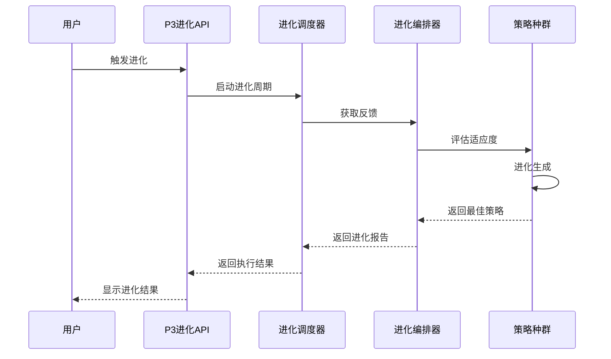

**图表来源**
- [api/routers/p3_evolution.py](file://api/routers/p3_evolution.py#L127-L139)

#### 核心功能
- **自动进化调度**：支持每日、每周、反馈驱动的进化模式
- **手动触发**：立即启动进化周期
- **策略种群管理**：管理不同代理类型的策略种群
- **部署推荐**：基于适应度阈值的策略部署建议
- **元学习**：积累和应用进化过程中的经验

#### API端点
- `POST /api/p3-evolution/initialize` - 初始化进化系统
- `POST /api/p3-evolution/start` - 启动进化调度器
- `POST /api/p3-evolution/stop` - 停止进化调度器
- `POST /api/p3-evolution/trigger` - 手动触发进化
- `GET /api/p3-evolution/status` - 获取进化状态
- `POST /api/p3-evolution/config` - 更新进化配置
- `GET /api/p3-evolution/populations` - 列出策略种群
- `GET /api/p3-evolution/populations/{key}` - 获取种群详情
- `POST /api/p3-evolution/populations/{key}/evolve` - 进化特定种群
- `GET /api/p3-evolution/reports/latest` - 获取最新报告
- `GET /api/p3-evolution/meta-learnings` - 获取元学习
- `POST /api/p3-evolution/deploy` - 部署策略
- `GET /api/p3-evolution/memory` - 获取长期记忆
- `POST /api/p3-evolution/memory/consolidate` - 合并记忆

### 个人IP指挥中心

**更新** 个人IP管理模块提供了完整的10维个人品牌管理体系：

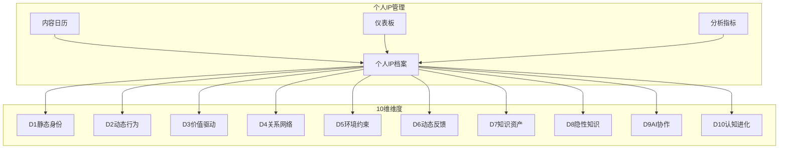

**图表来源**
- [api/routers/personal_ip.py](file://api/routers/personal_ip.py#L70-L86)

#### 核心功能
- **10维档案管理**：静态身份、动态行为、价值驱动等10个维度
- **内容日历**：计划和跟踪内容发布
- **仪表板**：综合性能指标展示
- **维度健康度**：评估各维度完整性
- **平台集成**：支持多平台内容发布

#### API端点
- `POST /api/personal-ip/profiles` - 创建个人IP档案
- `GET /api/personal-ip/profiles` - 列出所有档案
- `GET /api/personal-ip/profiles/{id}` - 获取档案详情
- `GET /api/personal-ip/profiles/{id}/summary` - 获取档案摘要
- `PUT /api/personal-ip/profiles/{id}/dimensions/{dim}` - 更新维度
- `DELETE /api/personal-ip/profiles/{id}` - 删除档案
- `POST /api/personal-ip/calendar` - 创建日历条目
- `GET /api/personal-ip/calendar` - 列出日历条目
- `GET /api/personal-ip/calendar/upcoming` - 获取即将到来的内容
- `GET /api/personal-ip/calendar/{id}` - 获取日历条目详情
- `PUT /api/personal-ip/calendar/{id}` - 更新日历条目
- `POST /api/personal-ip/calendar/{id}/publish` - 标记为已发布
- `DELETE /api/personal-ip/calendar/{id}` - 删除日历条目
- `GET /api/personal-ip/dashboard/{id}/metrics` - 获取仪表板指标
- `GET /api/personal-ip/dashboard/{id}/quadrants` - 获取象限分布
- `GET /api/personal-ip/dashboard/{id}/pipeline` - 获取内容管道
- `GET /api/personal-ip/dashboard/{id}/dimension-health` - 获取维度健康度

### 平台账户管理

**更新** 平台账户管理模块提供了社交平台账户的统一管理：

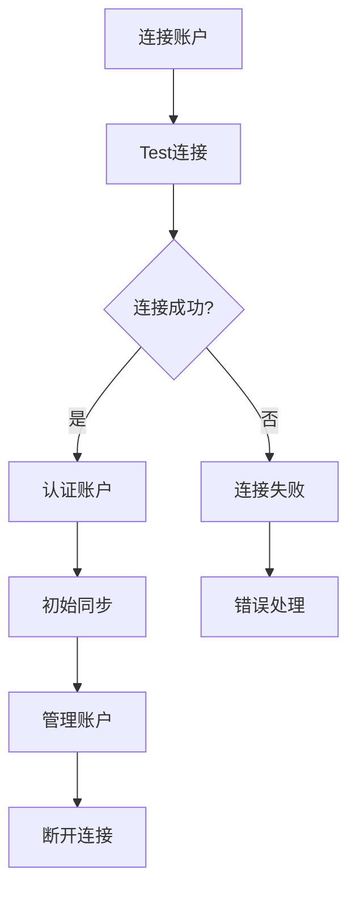

**图表来源**
- [api/routers/platform_accounts.py](file://api/routers/platform_accounts.py#L89-L142)

#### 核心功能
- **多平台支持**：微博、小红书等主流社交平台
- **认证管理**：Cookie、OAuth等多种认证方式
- **内容同步**：自动获取平台内容
- **账户分析**：获取平台数据分析
- **批量操作**：支持批量同步和管理

#### API端点
- `GET /api/platform-accounts/platforms` - 列出支持的平台
- `POST /api/platform-accounts/connect` - 连接平台账户
- `GET /api/platform-accounts/accounts` - 列出连接的账户
- `GET /api/platform-accounts/accounts/{id}` - 获取账户详情
- `POST /api/platform-accounts/accounts/{id}/sync` - 同步账户内容
- `POST /api/platform-accounts/accounts/{id}/test` - 测试账户连接
- `PUT /api/platform-accounts/accounts/{id}/settings` - 更新账户设置
- `DELETE /api/platform-accounts/accounts/{id}` - 断开账户
- `GET /api/platform-accounts/accounts/{id}/content` - 获取账户内容
- `GET /api/platform-accounts/accounts/{id}/analytics` - 获取账户分析
- `POST /api/platform-accounts/sync-all` - 同步所有账户

### 自动发布系统

**更新** 自动发布系统提供了跨平台内容发布的完整解决方案：

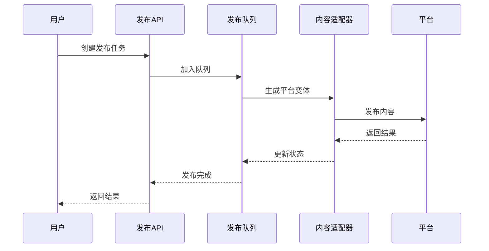

**图表来源**
- [api/routers/publish.py](file://api/routers/publish.py#L67-L93)

#### 核心功能
- **多平台发布**：支持微博、小红书等多个平台
- **内容适配**：根据平台特点生成内容变体
- **队列管理**：异步处理发布任务
- **调度功能**：支持定时发布
- **错误处理**：自动重试和错误恢复

#### API端点
- `POST /api/publish/jobs` - 创建发布任务
- `POST /api/publish/jobs/{id}/publish-now` - 立即发布
- `POST /api/publish/jobs/{id}/schedule` - 定时发布
- `POST /api/publish/jobs/{id}/cancel` - 取消发布
- `GET /api/publish/jobs` - 列出发布任务
- `GET /api/publish/jobs/{id}` - 获取任务详情
- `POST /api/publish/jobs/{id}/preview` - 预览平台变体
- `POST /api/publish/publish-all` - 一键多平台发布
- `GET /api/publish/queue/status` - 获取队列状态

**章节来源**
- [api/routers/p0_scheduler.py](file://api/routers/p0_scheduler.py#L1-L308)
- [api/routers/p3_evolution.py](file://api/routers/p3_evolution.py#L1-L346)
- [api/routers/personal_ip.py](file://api/routers/personal_ip.py#L1-L537)
- [api/routers/platform_accounts.py](file://api/routers/platform_accounts.py#L1-L421)
- [api/routers/publish.py](file://api/routers/publish.py#L1-L387)

## 依赖关系分析

系统采用松耦合的设计模式，通过清晰的依赖层次实现了模块化：

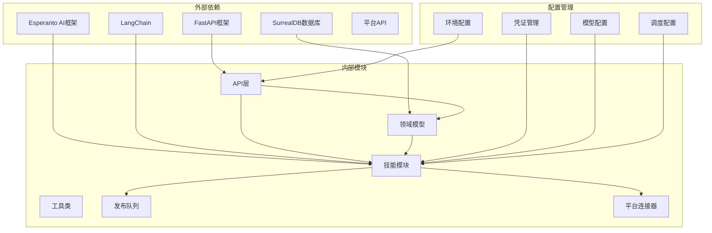

**图表来源**
- [api/main.py](file://api/main.py#L46-L147)
- [open_notebook/ai/models.py](file://open_notebook/ai/models.py#L97-L200)

### 数据流架构

**更新** 新增功能模块的数据流架构：

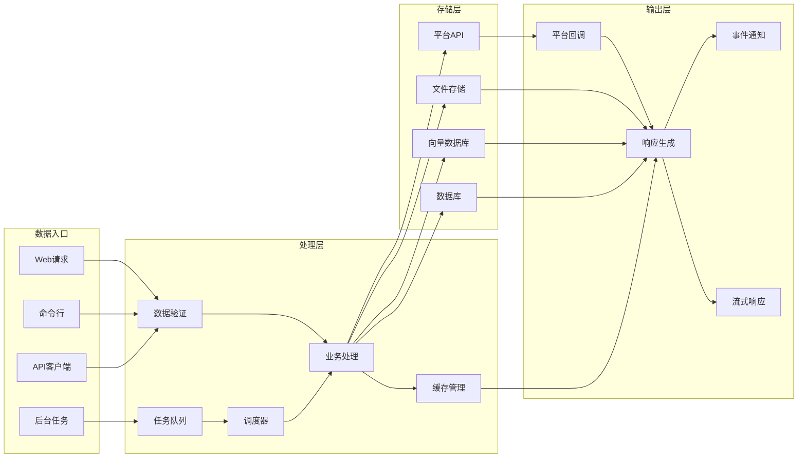

**图表来源**
- [api/client.py](file://api/client.py#L13-L78)
- [open_notebook/domain/notebook.py](file://open_notebook/domain/notebook.py#L1-L200)

**章节来源**
- [api/main.py](file://api/main.py#L46-L147)
- [open_notebook/ai/models.py](file://open_notebook/ai/models.py#L97-L200)

## 性能考虑

### 缓存策略

系统实现了多层次的缓存机制：

- **模型实例缓存**：Esperanto框架自动缓存AI模型实例
- **数据库查询缓存**：常用查询结果缓存
- **响应缓存**：静态内容和重复请求缓存
- **调度器状态缓存**：P0/P3调度器状态缓存

### 异步处理

**更新** 新增异步处理机制：

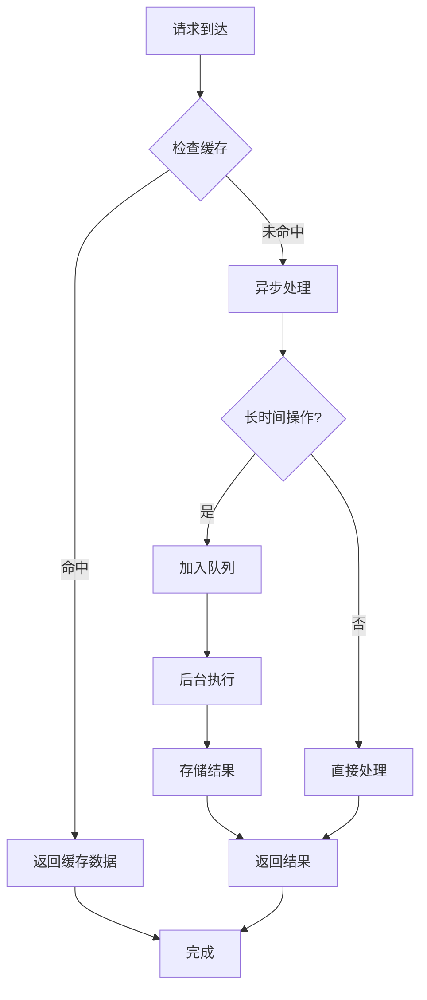

### 资源管理

- **连接池管理**：数据库连接池优化
- **内存管理**：及时释放临时对象
- **并发控制**：限制同时处理的请求数量
- **发布队列管理**：控制平台API调用频率

## 故障排除指南

### 常见问题诊断

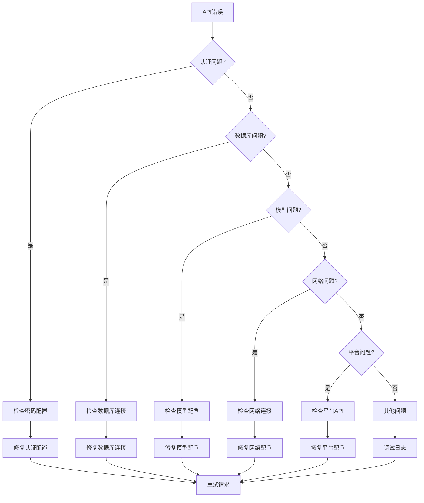

### 错误处理机制

系统提供了完善的错误处理和恢复机制：

- **HTTP状态码标准化**：统一的错误响应格式
- **日志记录**：详细的错误日志和堆栈跟踪
- **优雅降级**：部分功能失败时的降级策略
- **重试机制**：平台API调用的自动重试

**章节来源**
- [api/main.py](file://api/main.py#L204-L228)
- [api/auth.py](file://api/auth.py#L46-L75)

## 结论

OpenNotebook的API集成为现代AI应用开发提供了完整的基础设施。通过模块化的架构设计、强大的中间件系统和灵活的扩展机制，该系统能够满足各种复杂的应用场景需求。

**更新** 本次更新显著增强了系统的功能完整性，新增的5个高级功能模块为企业级应用提供了强有力的支持：

### 主要优势

1. **模块化设计**：清晰的组件分离和职责划分
2. **安全性**：多层次的安全防护和认证机制
3. **可扩展性**：插件化的AI提供商支持和自定义扩展
4. **性能优化**：异步处理和缓存策略
5. **开发友好**：完善的API文档和示例代码
6. **企业级功能**：个人IP管理、平台集成、自动发布等高级功能

### 新增功能特色

- **智能调度系统**：P0/P3调度器提供自动化AI系统管理
- **个人IP生态**：完整的10维个人品牌管理体系
- **平台集成**：统一的多平台账户和内容管理
- **发布自动化**：跨平台内容发布的完整解决方案
- **进化学习**：AI系统的自我优化和适应能力

### 未来发展方向

- **微服务化**：进一步拆分功能模块为独立服务
- **容器化部署**：优化Docker配置和Kubernetes支持
- **监控增强**：添加APM和性能监控功能
- **API版本控制**：支持向后兼容的API版本管理
- **扩展生态**：支持更多平台和第三方服务集成

该API集成方案为构建下一代智能应用奠定了坚实的技术基础，为开发者提供了强大而灵活的工具集。