# API集成

<cite>
**本文档引用的文件**
- [api/main.py](file://api/main.py)
- [api/routers/__init__.py](file://api/routers/__init__.py)
- [api/routers/auth.py](file://api/routers/auth.py)
- [api/routers/notebooks.py](file://api/routers/notebooks.py)
- [api/routers/search.py](file://api/routers/search.py)
- [api/routers/chat.py](file://api/routers/chat.py)
- [api/routers/sources.py](file://api/routers/sources.py)
- [api/models.py](file://api/models.py)
- [api/auth.py](file://api/auth.py)
- [api/client.py](file://api/client.py)
- [open_notebook/domain/notebook.py](file://open_notebook/domain/notebook.py)
- [open_notebook/ai/models.py](file://open_notebook/ai/models.py)
- [run_api.py](file://run_api.py)
</cite>

## 目录
1. [简介](#简介)
2. [项目结构](#项目结构)
3. [核心组件](#核心组件)
4. [架构概览](#架构概览)
5. [详细组件分析](#详细组件分析)
6. [依赖关系分析](#依赖关系分析)
7. [性能考虑](#性能考虑)
8. [故障排除指南](#故障排除指南)
9. [结论](#结论)

## 简介

OpenNotebook是一个智能研究助手平台，提供完整的API集成解决方案。该系统基于FastAPI构建，支持多模态AI模型、向量搜索、聊天会话管理和内容处理等功能。

本项目的核心目标是为用户提供一个统一的API接口，用于管理知识库、执行AI操作、处理多媒体内容和进行智能搜索。系统采用模块化设计，通过清晰的API路由组织实现了高度可扩展的功能架构。

## 项目结构

OpenNotebook的API架构采用分层设计模式，主要包含以下核心层次：

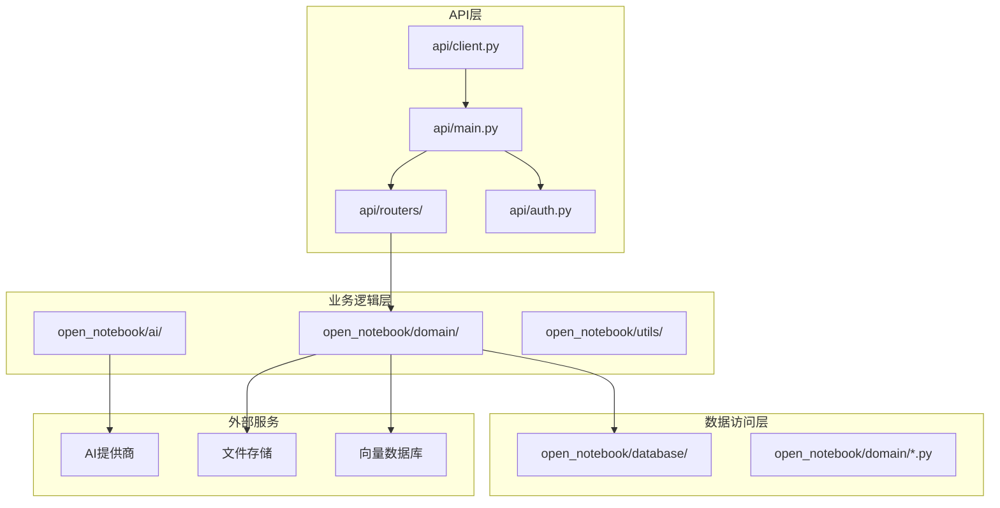

**图表来源**
- [api/main.py](file://api/main.py#L173-L273)
- [api/routers/__init__.py](file://api/routers/__init__.py#L1-L56)

**章节来源**
- [api/main.py](file://api/main.py#L1-L273)
- [api/routers/__init__.py](file://api/routers/__init__.py#L1-L56)

## 核心组件

### API应用实例

主应用程序实例配置了完整的中间件栈和路由系统：

- **生命周期管理**：自动数据库迁移、AI提供商初始化
- **安全中间件**：密码认证中间件，支持Docker secrets
- **CORS配置**：跨域资源共享支持
- **异常处理**：自定义HTTP异常处理器

### 路由器系统

系统包含20多个专门的路由器，每个负责特定功能领域：

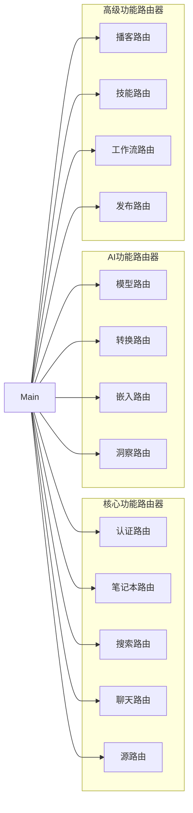

**图表来源**
- [api/main.py](file://api/main.py#L15-L45)
- [api/routers/__init__.py](file://api/routers/__init__.py#L3-L28)

### 数据模型系统

统一的数据模型定义确保了API的一致性和类型安全性：

- **请求/响应模型**：Pydantic模型定义
- **验证规则**：字段验证和约束
- **序列化支持**：JSON序列化兼容

**章节来源**
- [api/main.py](file://api/main.py#L173-L273)
- [api/models.py](file://api/models.py#L1-L200)

## 架构概览

OpenNotebook采用现代微服务架构，结合了以下关键技术特性：

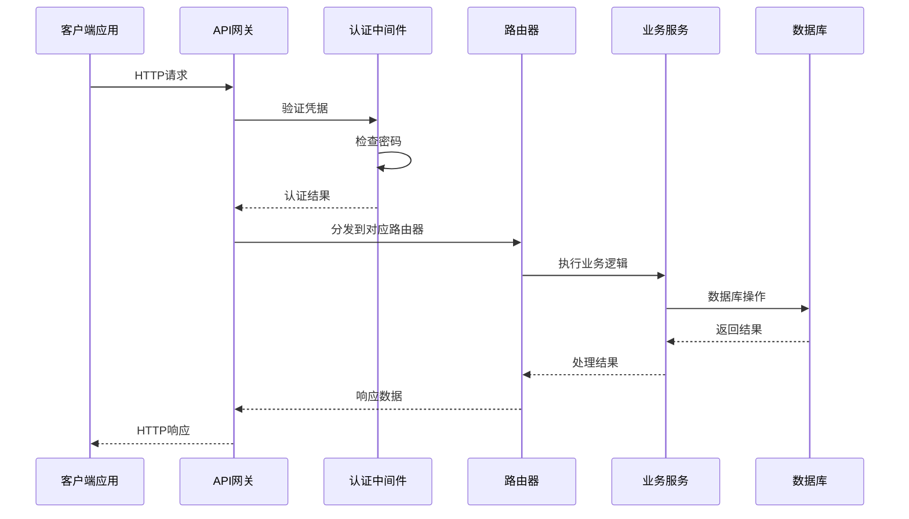

**图表来源**
- [api/main.py](file://api/main.py#L179-L228)
- [api/auth.py](file://api/auth.py#L12-L76)

### 中间件架构

系统实现了多层次的中间件处理：

1. **密码认证中间件**：全局请求拦截
2. **CORS中间件**：跨域请求处理
3. **异常处理中间件**：错误响应标准化

**章节来源**
- [api/main.py](file://api/main.py#L179-L228)
- [api/auth.py](file://api/auth.py#L12-L115)

## 详细组件分析

### 认证系统

密码认证中间件提供了灵活的安全机制：

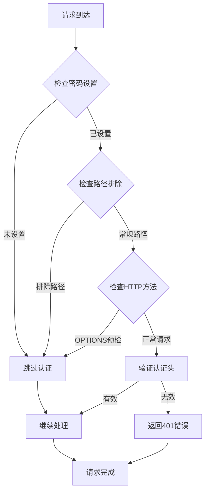

**图表来源**
- [api/auth.py](file://api/auth.py#L30-L75)

### 笔记本管理

笔记本路由提供了完整的CRUD操作：

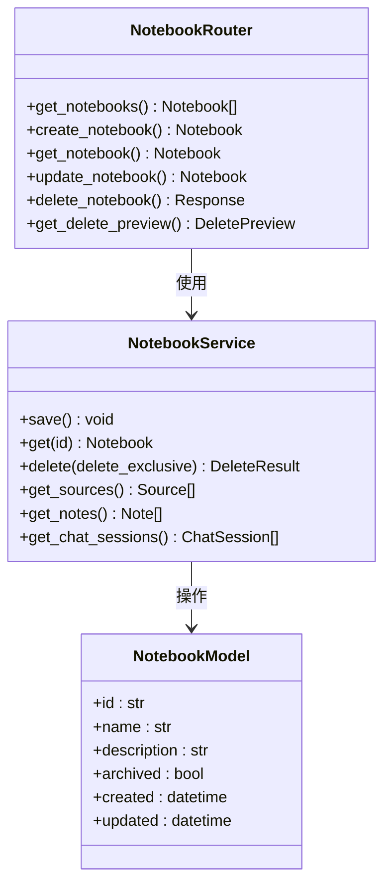

**图表来源**
- [api/routers/notebooks.py](file://api/routers/notebooks.py#L20-L200)
- [open_notebook/domain/notebook.py](file://open_notebook/domain/notebook.py#L16-L137)

### 搜索引擎

搜索功能支持文本和向量两种搜索模式：

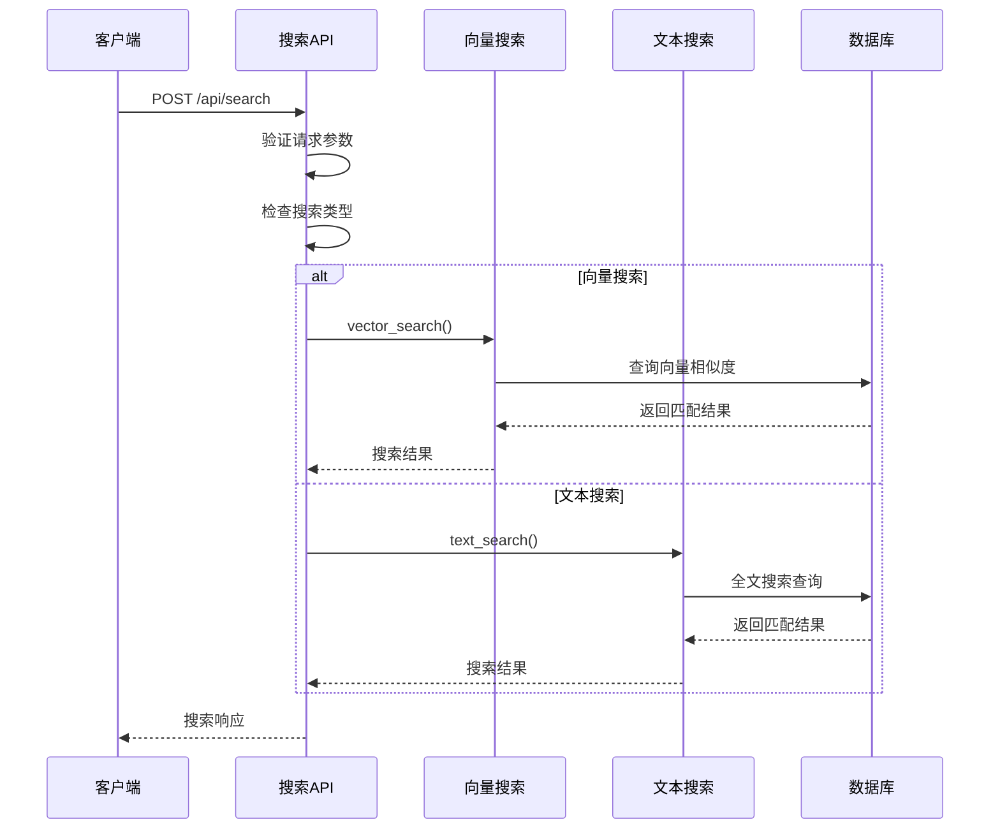

**图表来源**
- [api/routers/search.py](file://api/routers/search.py#L17-L59)

### 聊天系统

聊天会话管理支持实时对话和上下文维护：

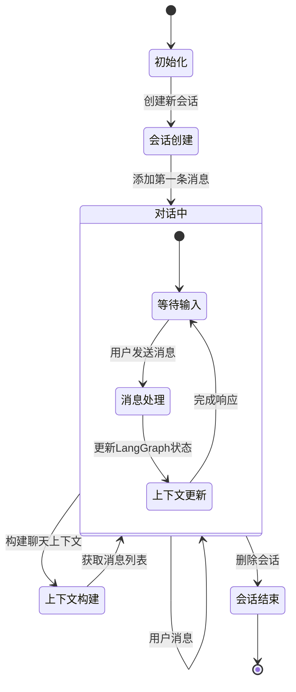

**图表来源**
- [api/routers/chat.py](file://api/routers/chat.py#L96-L200)

### 源文件处理

源文件路由支持多种内容类型和异步处理：

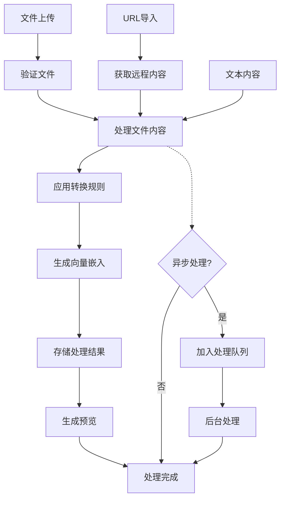

**图表来源**
- [api/routers/sources.py](file://api/routers/sources.py#L64-L150)

**章节来源**
- [api/routers/notebooks.py](file://api/routers/notebooks.py#L20-L200)
- [api/routers/search.py](file://api/routers/search.py#L17-L200)
- [api/routers/chat.py](file://api/routers/chat.py#L96-L200)
- [api/routers/sources.py](file://api/routers/sources.py#L64-L200)

## 依赖关系分析

系统采用松耦合的设计模式，通过清晰的依赖层次实现了模块化：

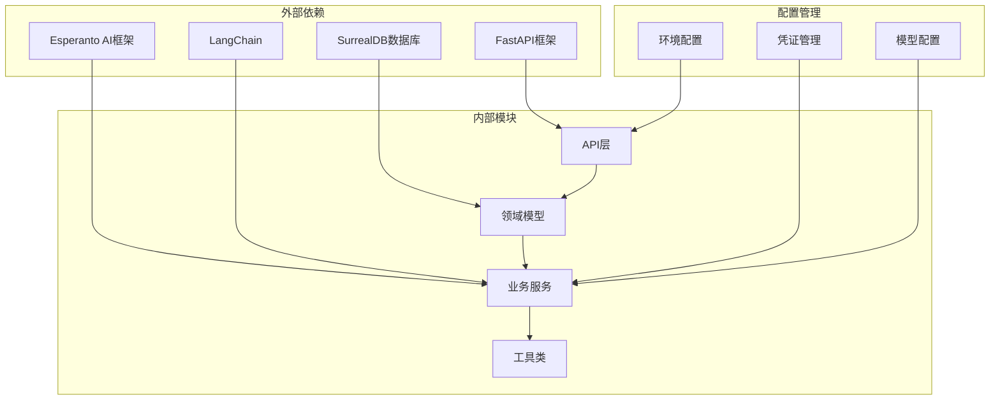

**图表来源**
- [api/main.py](file://api/main.py#L46-L107)
- [open_notebook/ai/models.py](file://open_notebook/ai/models.py#L97-L200)

### 数据流架构

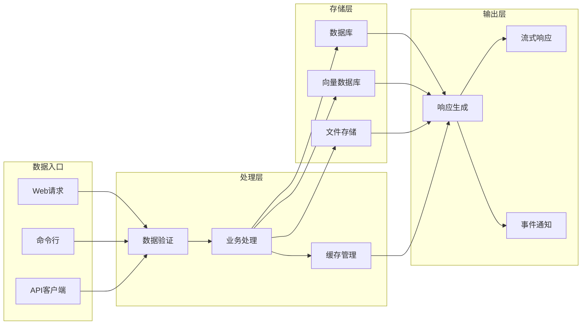

**图表来源**
- [api/client.py](file://api/client.py#L13-L78)
- [open_notebook/domain/notebook.py](file://open_notebook/domain/notebook.py#L1-L200)

**章节来源**
- [api/main.py](file://api/main.py#L46-L147)
- [open_notebook/ai/models.py](file://open_notebook/ai/models.py#L97-L200)

## 性能考虑

### 缓存策略

系统实现了多层次的缓存机制：

- **模型实例缓存**：Esperanto框架自动缓存AI模型实例
- **数据库查询缓存**：常用查询结果缓存
- **响应缓存**：静态内容和重复请求缓存

### 异步处理

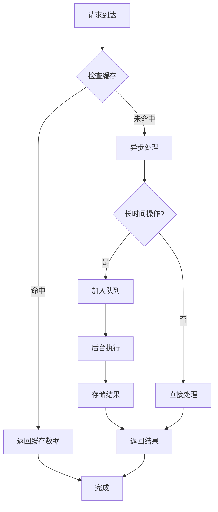

### 资源管理

- **连接池管理**：数据库连接池优化
- **内存管理**：及时释放临时对象
- **并发控制**：限制同时处理的请求数量

## 故障排除指南

### 常见问题诊断

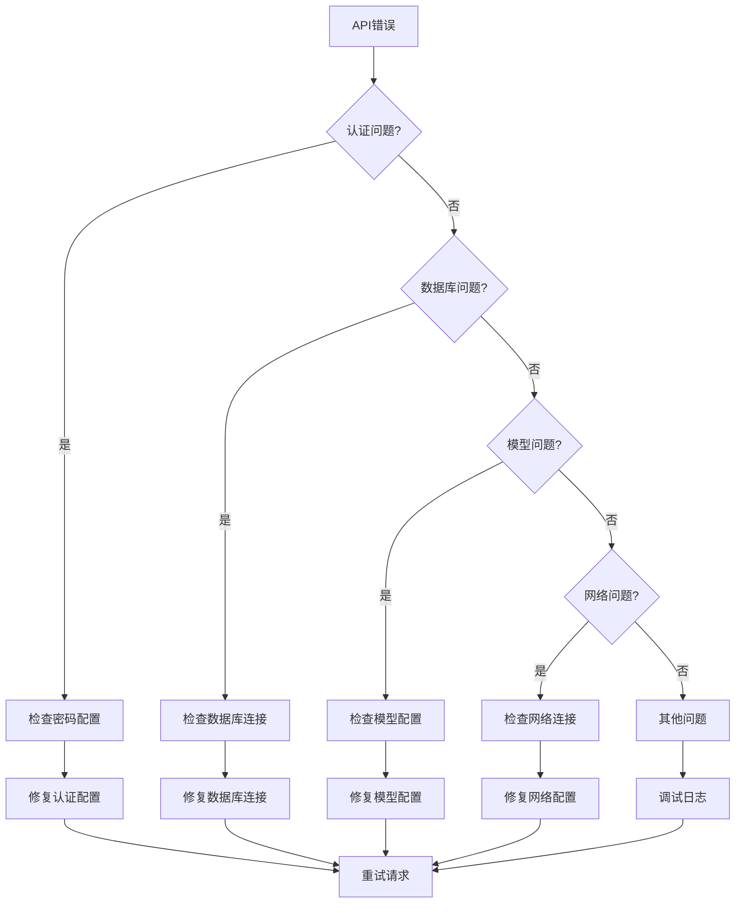

### 错误处理机制

系统提供了完善的错误处理和恢复机制：

- **HTTP状态码标准化**：统一的错误响应格式
- **日志记录**：详细的错误日志和堆栈跟踪
- **优雅降级**：部分功能失败时的降级策略

**章节来源**
- [api/main.py](file://api/main.py#L204-L228)
- [api/auth.py](file://api/auth.py#L46-L75)

## 结论

OpenNotebook的API集成为现代AI应用开发提供了完整的基础设施。通过模块化的架构设计、强大的中间件系统和灵活的扩展机制，该系统能够满足各种复杂的应用场景需求。

### 主要优势

1. **模块化设计**：清晰的组件分离和职责划分
2. **安全性**：多层次的安全防护和认证机制
3. **可扩展性**：插件化的AI提供商支持和自定义扩展
4. **性能优化**：异步处理和缓存策略
5. **开发友好**：完善的API文档和示例代码

### 未来发展方向

- **微服务化**：进一步拆分功能模块为独立服务
- **容器化部署**：优化Docker配置和Kubernetes支持
- **监控增强**：添加APM和性能监控功能
- **API版本控制**：支持向后兼容的API版本管理

该API集成方案为构建下一代智能应用奠定了坚实的技术基础，为开发者提供了强大而灵活的工具集。