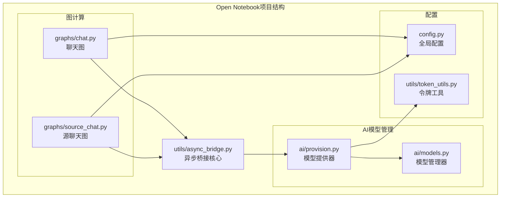
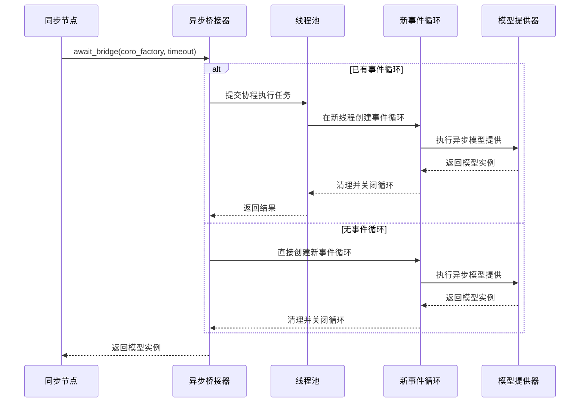
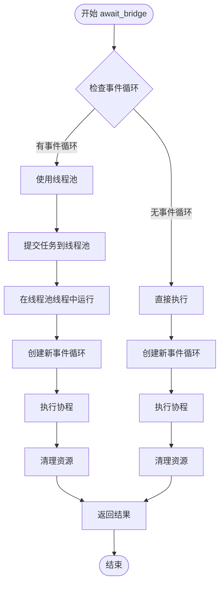
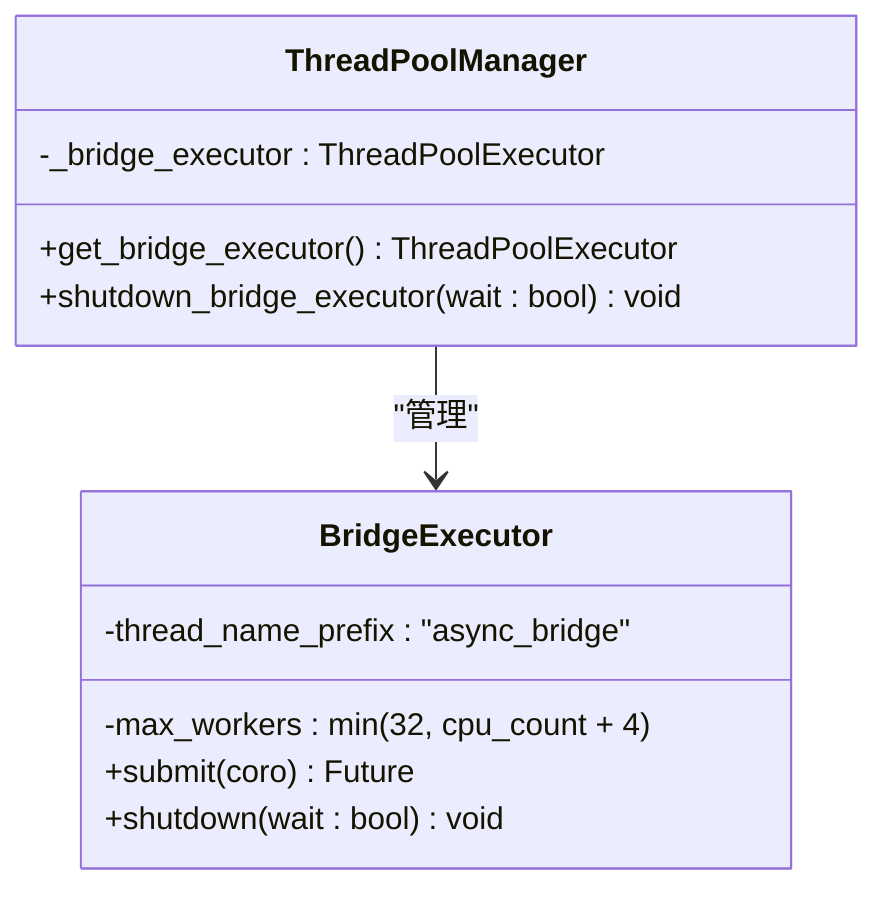
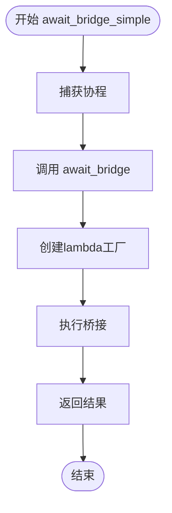
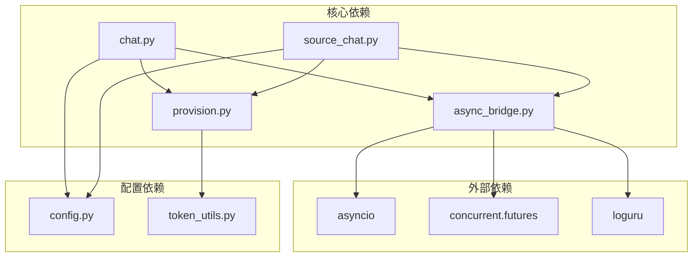

# 异步桥接实用程序

<cite>
**本文档引用的文件**
- [async_bridge.py](file://open_notebook/utils/async_bridge.py)
- [chat.py](file://open_notebook/graphs/chat.py)
- [source_chat.py](file://open_notebook/graphs/source_chat.py)
- [provision.py](file://open_notebook/ai/provision.py)
- [config.py](file://open_notebook/config.py)
- [token_utils.py](file://open_notebook/utils/token_utils.py)
</cite>

## 目录
1. [简介](#简介)
2. [项目结构](#项目结构)
3. [核心组件](#核心组件)
4. [架构概览](#架构概览)
5. [详细组件分析](#详细组件分析)
6. [依赖关系分析](#依赖关系分析)
7. [性能考虑](#性能考虑)
8. [故障排除指南](#故障排除指南)
9. [结论](#结论)

## 简介

异步桥接实用程序是Open Notebook项目中的一个关键组件，专门用于在同步上下文中安全地调用异步函数。该模块解决了LangGraph节点（运行在同步环境中）与需要异步执行的AI模型提供功能之间的兼容性问题。

该实用程序提供了线程安全的机制，允许同步代码调用异步协程函数，同时具备超时处理和资源清理功能。它主要用于LangGraph节点中进行AI模型的动态配置和提供。

## 项目结构

Open Notebook项目采用模块化架构，异步桥接实用程序位于`open_notebook/utils/`目录下，与AI模型管理和图计算功能紧密集成：

**图表来源**
- [async_bridge.py](file://open_notebook/utils/async_bridge.py#L1-L180)
- [provision.py](file://open_notebook/ai/provision.py#L1-L62)
- [chat.py](file://open_notebook/graphs/chat.py#L1-L67)
- [source_chat.py](file://open_notebook/graphs/source_chat.py#L1-L196)

**章节来源**
- [async_bridge.py](file://open_notebook/utils/async_bridge.py#L1-L180)
- [provision.py](file://open_notebook/ai/provision.py#L1-L62)

## 核心组件

异步桥接实用程序包含以下核心组件：

### 主要功能模块

1. **全局线程池管理** - 提供线程安全的ThreadPoolExecutor实例
2. **异步协程执行器** - 在新事件循环中安全执行协程
3. **同步到异步桥接器** - 处理同步上下文中的异步调用
4. **简化桥接器** - 提供便捷的协程直接调用接口

### 关键特性

- **线程安全** - 使用全局ThreadPoolExecutor确保多线程环境下的安全性
- **资源管理** - 自动清理事件循环和挂起的任务
- **超时控制** - 支持可配置的超时机制
- **错误处理** - 完善的异常传播和资源清理

**章节来源**
- [async_bridge.py](file://open_notebook/utils/async_bridge.py#L24-L60)

## 架构概览

异步桥接实用程序在整个系统架构中扮演着桥梁角色，连接同步的LangGraph节点和异步的AI模型提供功能：

**图表来源**
- [async_bridge.py](file://open_notebook/utils/async_bridge.py#L96-L148)
- [provision.py](file://open_notebook/ai/provision.py#L10-L62)

## 详细组件分析

### 异步桥接器 (await_bridge)

这是主要的桥接函数，负责在同步上下文中安全地执行异步协程：

**图表来源**
- [async_bridge.py](file://open_notebook/utils/async_bridge.py#L96-L148)

#### 核心参数说明

- **coro_factory**: 返回协程的可调用对象，通常使用lambda捕获参数
- **timeout**: 最大等待时间（秒），默认30.0秒，设置为None禁用超时
- **返回值**: 协程执行结果
- **异常**: TimeoutError（超时）、任何协程抛出的异常

### 线程池管理器

全局线程池确保跨多个调用的资源重用：

**图表来源**
- [async_bridge.py](file://open_notebook/utils/async_bridge.py#L24-L60)

#### 线程池配置

- **最大工作线程数**: min(32, CPU核心数 + 4)
- **线程名称前缀**: "async_bridge"
- **延迟初始化**: 仅在首次使用时创建
- **资源共享**: 全局唯一实例供所有调用共享

### 简化桥接器 (await_bridge_simple)

提供便捷的协程直接调用接口：

**图表来源**
- [async_bridge.py](file://open_notebook/utils/async_bridge.py#L151-L179)

**章节来源**
- [async_bridge.py](file://open_notebook/utils/async_bridge.py#L96-L179)

## 依赖关系分析

异步桥接实用程序与系统其他组件存在密切的依赖关系：

**图表来源**
- [async_bridge.py](file://open_notebook/utils/async_bridge.py#L11-L15)
- [chat.py](file://open_notebook/graphs/chat.py#L12-L16)
- [source_chat.py](file://open_notebook/graphs/source_chat.py#L12-L16)

### 使用场景分析

异步桥接实用程序主要在以下场景中使用：

1. **聊天图中的模型提供**: LangGraph节点需要动态获取AI模型
2. **源聊天图中的上下文处理**: 处理复杂的源内容和上下文信息
3. **超时控制**: 防止长时间阻塞影响用户体验

**章节来源**
- [chat.py](file://open_notebook/graphs/chat.py#L34-L40)
- [source_chat.py](file://open_notebook/graphs/source_chat.py#L98-L107)

## 性能考虑

异步桥接实用程序在设计时充分考虑了性能优化：

### 线程池优化

- **自适应线程数量**: 基于CPU核心数动态调整工作线程数
- **延迟初始化**: 避免不必要的资源分配
- **资源共享**: 全局线程池避免重复创建销毁开销

### 资源管理

- **事件循环清理**: 确保每个协程执行后正确清理
- **挂起任务取消**: 及时取消未完成的任务
- **内存泄漏防护**: 完整的finally块确保资源释放

### 性能基准

- **默认超时**: 30秒的合理超时设置平衡了响应性和可靠性
- **线程池大小**: min(32, CPU核心数 + 4)提供最佳并发性能
- **异步模式检测**: 智能检测现有事件循环避免不必要的线程切换

## 故障排除指南

### 常见问题及解决方案

#### 超时问题

**症状**: 调用await_bridge时抛出TimeoutError
**原因**: 协程执行时间超过指定超时限制
**解决方案**: 
- 增加timeout参数值
- 优化被调用的异步函数
- 检查网络连接和API响应时间

#### 线程池耗尽

**症状**: 多个并发调用导致线程池阻塞
**原因**: 线程池工作线程被长时间占用
**解决方案**:
- 实施适当的超时机制
- 优化协程执行效率
- 考虑增加线程池大小（谨慎）

#### 资源泄漏

**症状**: 应用内存持续增长
**原因**: 事件循环或任务未正确清理
**解决方案**:
- 确保正确调用shutdown_bridge_executor
- 检查异常路径中的资源清理
- 监控线程池状态

### 调试技巧

1. **启用详细日志**: 利用loguru记录桥接器操作
2. **监控线程池**: 观察线程池使用情况和队列长度
3. **性能分析**: 分析协程执行时间和资源消耗

**章节来源**
- [async_bridge.py](file://open_notebook/utils/async_bridge.py#L46-L60)

## 结论

异步桥接实用程序是Open Notebook项目中解决同步与异步代码兼容性的关键组件。通过精心设计的线程池管理和事件循环清理机制，它成功地消除了LangGraph节点与异步AI模型提供功能之间的技术障碍。

该实用程序的主要优势包括：

- **线程安全**: 全局线程池确保多线程环境下的稳定性
- **资源管理**: 完善的清理机制防止资源泄漏
- **性能优化**: 自适应线程池和智能超时控制
- **易用性**: 简洁的API设计降低使用复杂度

在未来的发展中，该组件可以进一步扩展以支持更复杂的异步场景，并提供更精细的性能监控和调优选项。