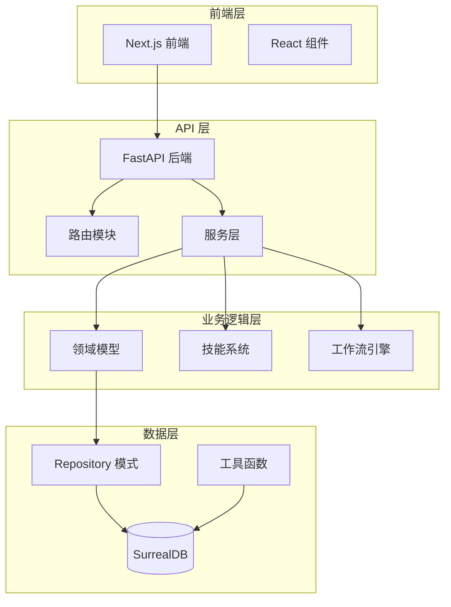
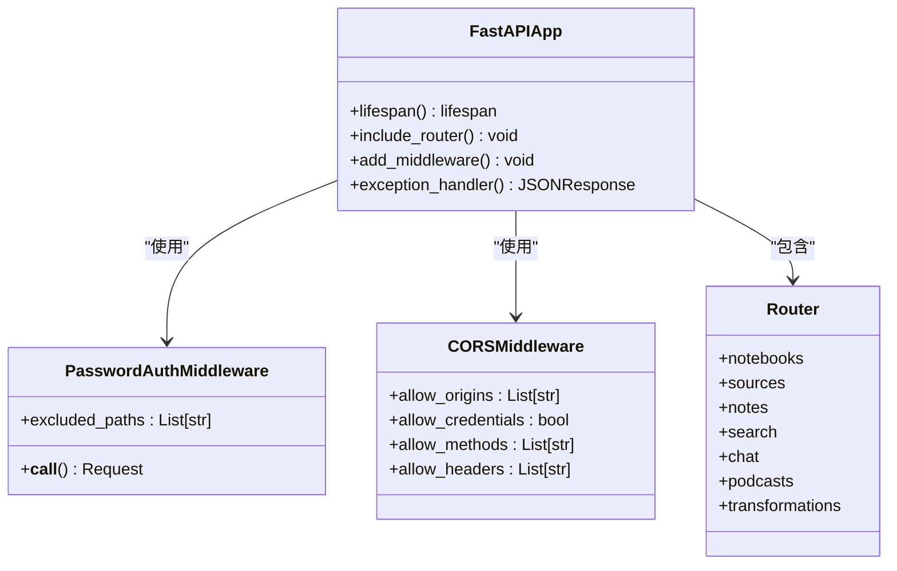
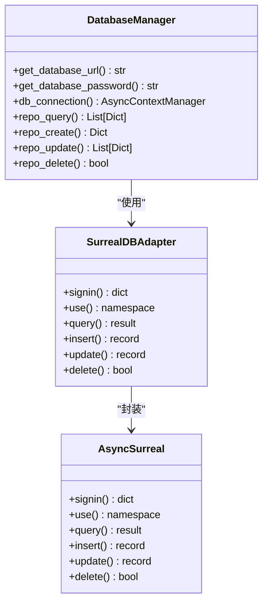
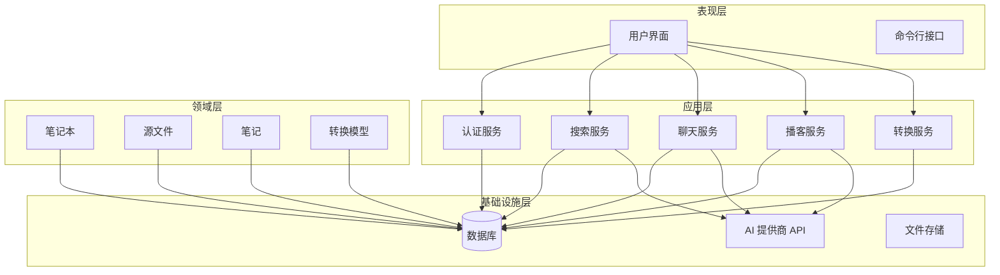
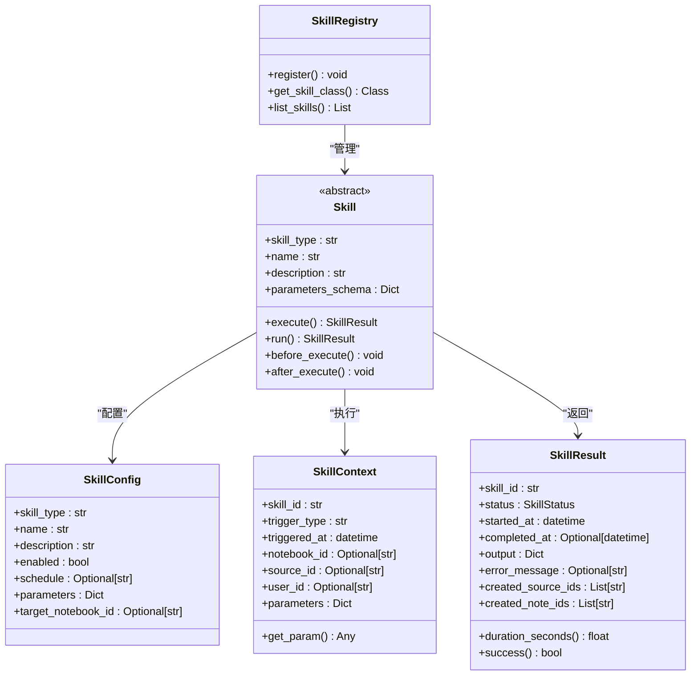
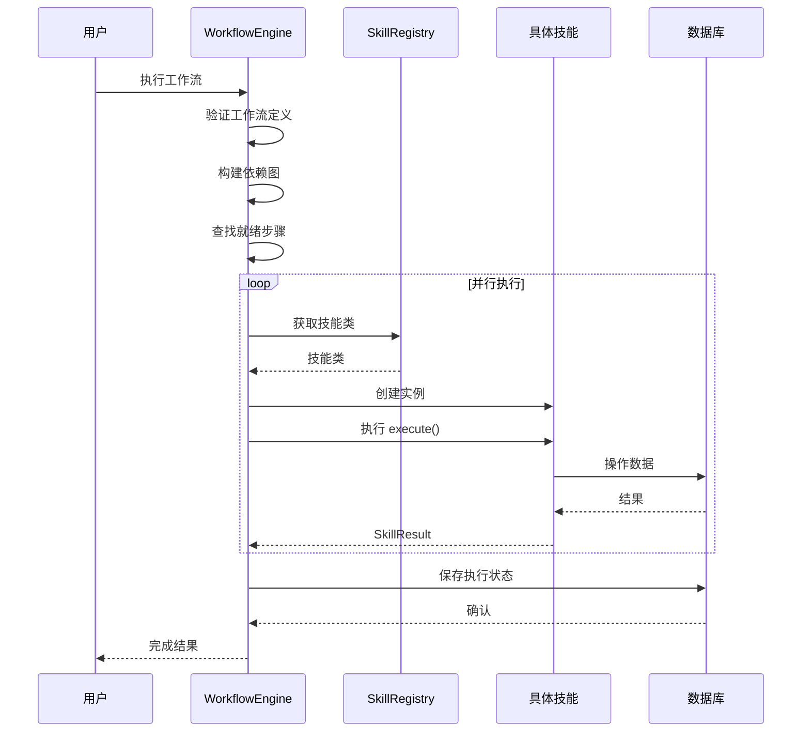
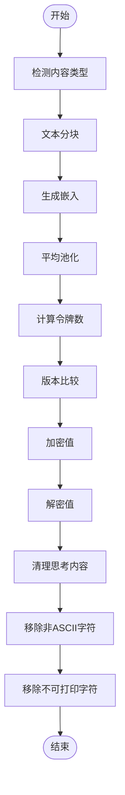
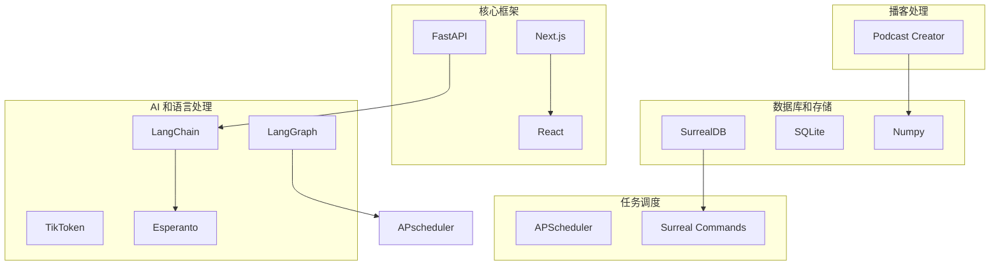
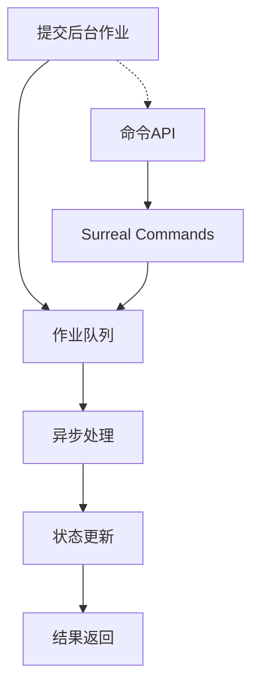

# 开发者指南

<cite>
**本文档引用的文件**
- [README.md](file://README.md)
- [run_api.py](file://run_api.py)
- [api/main.py](file://api/main.py)
- [frontend/package.json](file://frontend/package.json)
- [pyproject.toml](file://pyproject.toml)
- [open_notebook/config.py](file://open_notebook/config.py)
- [open_notebook/database/repository.py](file://open_notebook/database/repository.py)
- [open_notebook/utils/__init__.py](file://open_notebook/utils/__init__.py)
- [api/models.py](file://api/models.py)
- [open_notebook/domain/notebook.py](file://open_notebook/domain/notebook.py)
- [open_notebook/domain/transformation.py](file://open_notebook/domain/transformation.py)
- [open_notebook/workflows/engine.py](file://open_notebook/workflows/engine.py)
- [open_notebook/skills/base.py](file://open_notebook/skills/base.py)
</cite>

## 目录
1. [简介](#简介)
2. [项目结构](#项目结构)
3. [核心组件](#核心组件)
4. [架构概览](#架构概览)
5. [详细组件分析](#详细组件分析)
6. [依赖分析](#依赖分析)
7. [性能考虑](#性能考虑)
8. [故障排除指南](#故障排除指南)
9. [结论](#结论)

## 简介

Open Notebook 是一个开源、隐私优先的研究助手平台，旨在替代 Google Notebook LM。该项目提供了一个完整的本地化解决方案，支持多模态内容处理、AI 模型选择、播客生成、智能搜索等功能。

### 主要特性
- 🔒 **隐私优先**：完全自托管，数据完全私有
- 🤖 **多模型支持**：支持 16+ AI 提供商（OpenAI、Anthropic、Ollama 等）
- 📚 **多模态内容**：PDF、视频、音频、网页等
- 🎙️ **专业播客生成**：多说话人播客生成
- 🔍 **智能搜索**：全文和向量搜索
- 💬 **上下文聊天**：基于研究材料的 AI 对话

## 项目结构

项目采用模块化架构，主要分为以下几个核心部分：



**图表来源**
- [api/main.py](file://api/main.py#L174-L275)
- [open_notebook/database/repository.py](file://open_notebook/database/repository.py#L47-L63)

**章节来源**
- [README.md](file://README.md#L93-L96)
- [pyproject.toml](file://pyproject.toml#L1-L44)

## 核心组件

### API 服务器架构

Open Notebook 的 API 服务器基于 FastAPI 构建，提供了完整的 RESTful 接口：



**图表来源**
- [api/main.py](file://api/main.py#L174-L202)
- [api/main.py](file://api/main.py#L232-L264)

### 数据库连接模式

系统使用 Repository 模式来管理数据库连接：



**图表来源**
- [open_notebook/database/repository.py](file://open_notebook/database/repository.py#L12-L63)

**章节来源**
- [api/main.py](file://api/main.py#L57-L172)
- [open_notebook/database/repository.py](file://open_notebook/database/repository.py#L1-L195)

## 架构概览

Open Notebook 采用了分层架构设计，确保了良好的可维护性和扩展性：



**图表来源**
- [api/main.py](file://api/main.py#L15-L46)
- [open_notebook/domain/notebook.py](file://open_notebook/domain/notebook.py#L16-L28)

## 详细组件分析

### 技能系统架构

Open Notebook 的技能系统是其核心自动化能力的基础：



**图表来源**
- [open_notebook/skills/base.py](file://open_notebook/skills/base.py#L83-L183)

### 工作流引擎

工作流引擎负责协调复杂的自动化流程：



**图表来源**
- [open_notebook/workflows/engine.py](file://open_notebook/workflows/engine.py#L143-L202)
- [open_notebook/workflows/engine.py](file://open_notebook/workflows/engine.py#L415-L510)

**章节来源**
- [open_notebook/workflows/engine.py](file://open_notebook/workflows/engine.py#L1-L619)
- [open_notebook/skills/base.py](file://open_notebook/skills/base.py#L1-L183)

### 领域模型

系统的核心领域模型包括笔记本、源文件和笔记：

```mermaid
classDiagram
class Notebook {
+table_name : str = "notebook"
+name : str
+description : str
+archived : Optional[bool]
+get_sources() List[Source]
+get_notes() List[Note]
+get_chat_sessions() List[ChatSession]
+get_delete_preview() Dict
+delete() Dict
}
class Source {
+table_name : str = "source"
+asset : Optional[Asset]
+title : Optional[str]
+topics : Optional[List[str]]
+full_text : Optional[str]
+command : Optional[Union]
+get_status() Optional[str]
+get_processing_progress() Optional[Dict]
+get_context() Dict
+get_embedded_chunks() int
+get_insights() List[SourceInsight]
+add_to_notebook() Any
+vectorize() str
+add_insight() Optional[str]
+delete() bool
}
class Note {
+table_name : str = "note"
+title : Optional[str]
+note_type : Optional[Literal]
+content : Optional[str]
+save() Optional[str]
+add_to_notebook() Any
+get_context() Dict
}
class ChatSession {
+table_name : str = "chat_session"
+nullable_fields : set[str] = {"model_override"}
+title : Optional[str]
+model_override : Optional[str]
+relate_to_notebook() Any
+relate_to_source() Any
}
Notebook --> Source : "包含"
Notebook --> Note : "包含"
Source --> Note : "关联"
```

**图表来源**
- [open_notebook/domain/notebook.py](file://open_notebook/domain/notebook.py#L16-L28)
- [open_notebook/domain/notebook.py](file://open_notebook/domain/notebook.py#L288-L553)

**章节来源**
- [open_notebook/domain/notebook.py](file://open_notebook/domain/notebook.py#L1-L679)

### 工具函数系统

系统提供了丰富的工具函数来支持各种操作：



**图表来源**
- [open_notebook/utils/__init__.py](file://open_notebook/utils/__init__.py#L12-L69)

**章节来源**
- [open_notebook/utils/__init__.py](file://open_notebook/utils/__init__.py#L1-L70)

## 依赖分析

### 外部依赖关系

项目使用了多种关键的外部依赖来实现其功能：



**图表来源**
- [pyproject.toml](file://pyproject.toml#L15-L44)
- [frontend/package.json](file://frontend/package.json#L14-L56)

**章节来源**
- [pyproject.toml](file://pyproject.toml#L1-L101)
- [frontend/package.json](file://frontend/package.json#L1-L77)

### 环境配置

系统支持灵活的环境配置：

| 环境变量 | 描述 | 默认值 |
|---------|------|--------|
| `OPEN_NOTEBOOK_ENCRYPTION_KEY` | 加密密钥 | 必需 |
| `SURREAL_URL` | 数据库连接URL | ws://localhost:8000/rpc |
| `SURREAL_USER` | 数据库用户名 | root |
| `SURREAL_PASSWORD` | 数据库密码 | root |
| `API_HOST` | API服务器主机 | 127.0.0.1 |
| `API_PORT` | API服务器端口 | 5055 |
| `API_RELOAD` | 开发模式热重载 | true |

**章节来源**
- [api/main.py](file://api/main.py#L68-L74)
- [run_api.py](file://run_api.py#L18-L20)

## 性能考虑

### 缓存策略

系统实现了多层次的缓存机制来优化性能：

1. **TikToken 缓存**：缓存令牌化结果以避免重复计算
2. **嵌入向量缓存**：缓存生成的向量以提高搜索性能
3. **数据库查询缓存**：对频繁访问的数据进行缓存

### 异步处理

为了处理大量数据和长时间运行的任务，系统广泛使用异步编程：



**图表来源**
- [open_notebook/domain/notebook.py](file://open_notebook/domain/notebook.py#L411-L456)

### 资源管理

系统通过以下方式管理资源：

- **连接池管理**：合理配置数据库连接池大小
- **内存优化**：使用生成器和流式处理减少内存占用
- **并发控制**：限制同时运行的作业数量

## 故障排除指南

### 常见问题诊断

#### 数据库连接问题

**症状**：API 启动时出现数据库连接错误

**解决方案**：
1. 检查 `SURREAL_URL` 环境变量是否正确设置
2. 验证数据库凭据配置
3. 确认数据库服务正在运行

#### AI 模型配置问题

**症状**：AI 模型无法初始化或调用失败

**解决方案**：
1. 验证 API 密钥配置
2. 检查网络连接
3. 确认模型提供商服务可用性

#### 文件上传问题

**症状**：文件上传失败或超时

**解决方案**：
1. 检查文件大小限制
2. 验证磁盘空间
3. 检查文件权限

**章节来源**
- [api/main.py](file://api/main.py#L94-L98)
- [open_notebook/database/repository.py](file://open_notebook/database/repository.py#L70-L82)

### 日志和监控

系统使用 Loguru 进行日志记录，建议：

1. **开发环境**：设置 `DEBUG` 级别日志
2. **生产环境**：设置 `INFO` 级别日志
3. **性能监控**：定期检查慢查询和异常

## 结论

Open Notebook 提供了一个功能完整、架构清晰的研究助手平台。其模块化设计使得开发者可以轻松理解和扩展系统功能。通过合理的架构设计和性能优化，该系统能够满足从个人研究到团队协作的各种需求。

### 最佳实践建议

1. **代码组织**：遵循现有的模块化结构
2. **错误处理**：使用统一的异常处理机制
3. **测试覆盖**：为新功能编写充分的测试
4. **文档维护**：保持文档与代码同步更新
5. **安全考虑**：始终验证用户输入和权限

该指南为开发者提供了深入理解 Open Notebook 架构和实现细节的完整参考，有助于高效地进行二次开发和功能扩展。