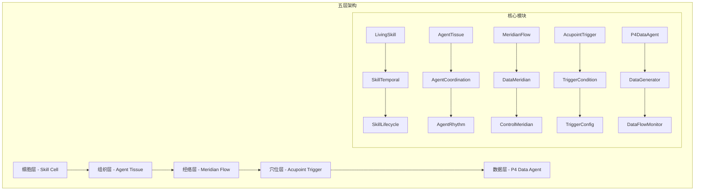
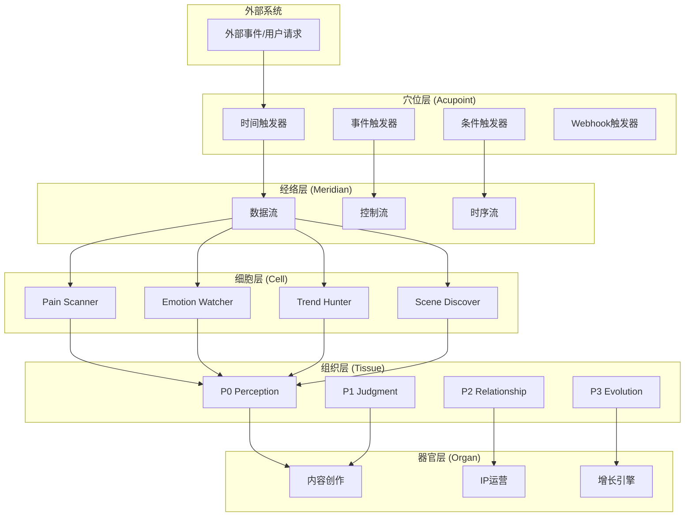
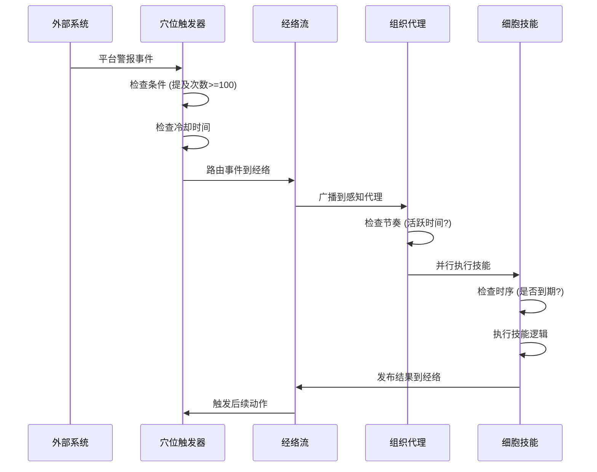
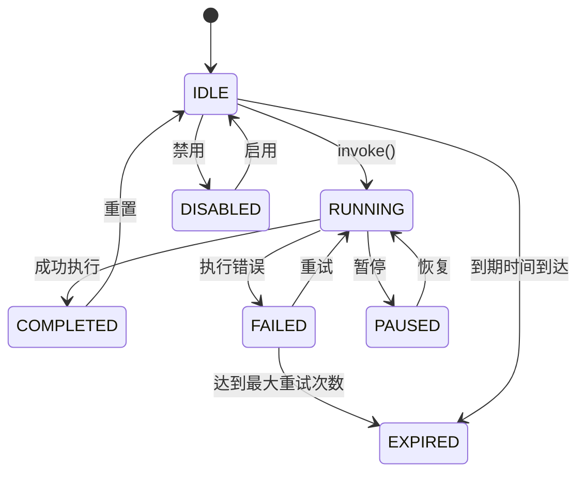
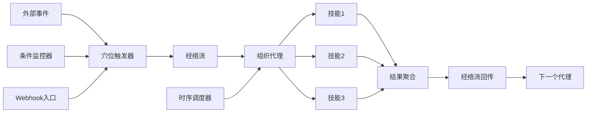
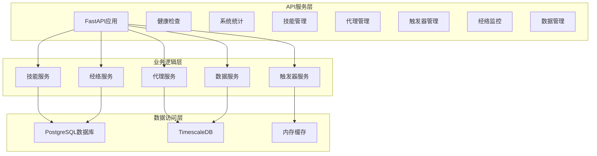
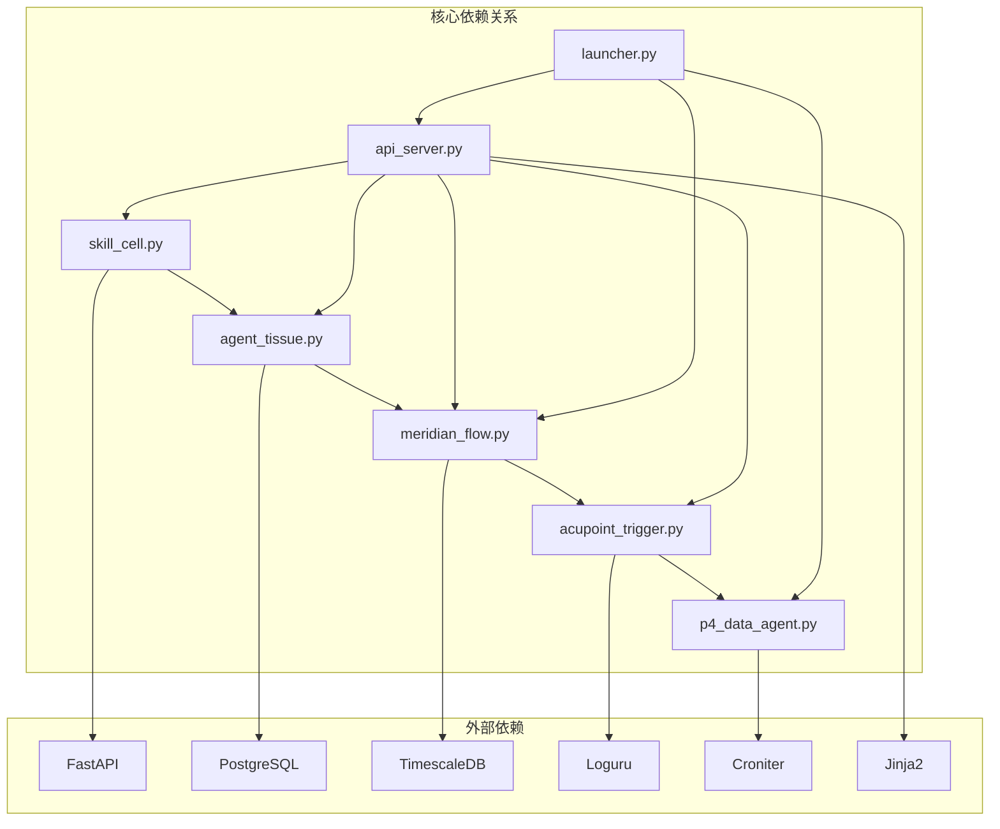

# 活体知识系统实施总结

<cite>
**本文档引用的文件**
- [living_system_implementation_summary.md](file://docs/living_system_implementation_summary.md)
- [living_system_architecture.md](file://docs/living_system_architecture.md)
- [README.md](file://open_notebook/skills/living/README.md)
- [__init__.py](file://open_notebook/skills/living/__init__.py)
- [p0_p4_integration.py](file://open_notebook/skills/living/p0_p4_integration.py)
- [skill_cell.py](file://open_notebook/skills/living/skill_cell.py)
- [agent_tissue.py](file://open_notebook/skills/living/agent_tissue.py)
- [meridian_flow.py](file://open_notebook/skills/living/meridian_flow.py)
- [acupoint_trigger.py](file://open_notebook/skills/living/acupoint_trigger.py)
- [p4_data_agent.py](file://open_notebook/skills/living/p4_data_agent.py)
- [p0_perception_organ.py](file://open_notebook/skills/living/examples/p0_perception_organ.py)
- [memory.py](file://open_notebook/skills/living/database/memory.py)
- [api_server.py](file://open_notebook/skills/living/api_server.py)
- [launcher.py](file://open_notebook/skills/living/launcher.py)
- [start_living.sh](file://scripts/start_living.sh)
- [docker-compose.living.yml](file://docker-compose.living.yml)
</cite>

## 目录
1. [简介](#简介)
2. [项目结构](#项目结构)
3. [核心组件](#核心组件)
4. [架构概览](#架构概览)
5. [详细组件分析](#详细组件分析)
6. [依赖关系分析](#依赖关系分析)
7. [性能考虑](#性能考虑)
8. [故障排除指南](#故障排除指南)
9. [结论](#结论)
10. [附录](#附录)

## 简介

活体知识系统（Living Knowledge System）是一个基于生物学启发的智能体架构，将知识管理系统类比为人体组织，实现自组织、自运行的有机系统。该系统通过五层架构模拟生物体的组织结构，包括细胞层、组织层、经络层、穴位层和数据层。

系统的核心设计理念是将软件组件映射到生物类比：
- **Skill** → **Cell (细胞)**：基本功能单元
- **Agent** → **Tissue (组织)**：协作单元组合  
- **System** → **Organ (器官)**：复杂功能系统
- **Flow** → **Meridian (经络)**：数据/控制/时序流
- **Trigger** → **Acupoint (穴位)**：外部刺激接入点

## 项目结构

活体知识系统采用模块化的五层架构设计，每个层级都有明确的职责和接口：

**图表来源**
- [README.md](file://open_notebook/skills/living/README.md#L1-L33)
- [__init__.py](file://open_notebook/skills/living/__init__.py#L11-L87)

**章节来源**
- [README.md](file://open_notebook/skills/living/README.md#L1-L33)
- [__init__.py](file://open_notebook/skills/living/__init__.py#L1-L88)

## 核心组件

### 细胞层（Skill Cell）
细胞层是系统的基本功能单元，模拟生物细胞的特性。每个技能都有完整的生命周期管理、时序调度和资源加载能力。

**主要特性：**
- **生命周期管理**：支持IDLE、RUNNING、COMPLETED、FAILED、PAUSED、EXPIRED、DISABLED等状态
- **时序调度**：支持Cron表达式、固定间隔、延迟执行等多种调度方式
- **资源管理**：支持Python脚本、Jinja2模板、JSON数据等多种资源类型
- **依赖管理**：定义输入输出依赖关系，确保执行顺序

**章节来源**
- [skill_cell.py](file://open_notebook/skills/living/skill_cell.py#L29-L160)
- [README.md](file://open_notebook/skills/living/README.md#L143-L170)

### 组织层（Agent Tissue）
组织层由多个协作的技能单元组成，模拟生物组织的功能。Agent负责协调多个技能的执行模式。

**协调模式：**
- **SEQUENCE**：顺序执行，一个接一个
- **PARALLEL**：并行执行，同时运行  
- **PIPELINE**：管道模式，前一输出作为后一输入
- **CONDITIONAL**：条件执行，满足条件才执行
- **LOOP**：循环执行，直到条件满足
- **VOTING**：投票模式，多个结果投票决定
- **RACE**：竞争模式，第一个完成的获胜

**章节来源**
- [agent_tissue.py](file://open_notebook/skills/living/agent_tissue.py#L19-L38)
- [README.md](file://open_notebook/skills/living/README.md#L171-L182)

### 经络层（Meridian Flow）
经络层连接各个组件，模拟生物体内循环系统的作用。提供多种类型的流通道用于不同的数据传输需求。

**流类型：**
- **DATA**：数据流，传输信息
- **CONTROL**：控制流，传输命令
- **TEMPORAL**：时序流，同步时间
- **ENERGY**：能量流，资源分配

**章节来源**
- [meridian_flow.py](file://open_notebook/skills/living/meridian_flow.py#L23-L29)
- [README.md](file://open_notebook/skills/living/README.md#L183-L191)

### 穴位层（Acupoint Trigger）
穴位层是外部事件的接入点，模拟针灸穴位的作用。支持多种触发方式来激活内部系统。

**触发类型：**
- **TEMPORAL**：时间触发，Cron/间隔
- **EVENT**：事件触发，数据到达/状态变更
- **CONDITION**：条件触发，阈值/模式匹配
- **MANUAL**：手动触发，API/UI/CLI
- **AGENTLY**：Agently工作流触发
- **WEBHOOK**：Webhook外部触发

**章节来源**
- [acupoint_trigger.py](file://open_notebook/skills/living/acupoint_trigger.py#L30-L38)
- [README.md](file://open_notebook/skills/living/README.md#L192-L202)

### 数据层（P4 Data Agent）
数据层作为系统的"免疫系统"，管理数据的生命周期、质量监控和容量管理。

**核心功能：**
- **数据生成**：跟踪数据来源和生成规则
- **质量监控**：确保数据健康和一致性
- **容量管理**：防止数据膨胀
- **血缘追踪**：记录数据的来源和去向

**章节来源**
- [p4_data_agent.py](file://open_notebook/skills/living/p4_data_agent.py#L25-L58)
- [README.md](file://open_notebook/skills/living/README.md#L280-L286)

## 架构概览

系统采用分层架构设计，每层都有明确的职责边界和交互方式：

**图表来源**
- [living_system_architecture.md](file://docs/living_system_architecture.md#L5-L58)
- [living_system_architecture.md](file://docs/living_system_architecture.md#L185-L241)

## 详细组件分析

### P0 感知系统详细架构

P0感知系统是系统的第一层，负责检测来自各种来源的信息。该系统展示了完整的五层架构如何协同工作。

**图表来源**
- [living_system_architecture.md](file://docs/living_system_architecture.md#L242-L264)

### 技能生命周期管理

技能具有完整的生命周期，支持状态转换和健康监控：

**图表来源**
- [living_system_architecture.md](file://docs/living_system_architecture.md#L62-L76)

**章节来源**
- [skill_cell.py](file://open_notebook/skills/living/skill_cell.py#L122-L159)

### 数据流架构

系统采用事件驱动的数据流架构，支持复杂的异步处理：

**图表来源**
- [living_system_architecture.md](file://docs/living_system_architecture.md#L103-L118)

**章节来源**
- [meridian_flow.py](file://open_notebook/skills/living/meridian_flow.py#L133-L189)

### API服务架构

系统提供RESTful API服务，支持完整的系统管理功能：

**图表来源**
- [api_server.py](file://open_notebook/skills/living/api_server.py#L153-L158)

**章节来源**
- [api_server.py](file://open_notebook/skills/living/api_server.py#L174-L200)

## 依赖关系分析

系统采用模块化设计，各组件之间通过清晰的接口进行交互：

**图表来源**
- [__init__.py](file://open_notebook/skills/living/__init__.py#L11-L49)

**章节来源**
- [__init__.py](file://open_notebook/skills/living/__init__.py#L1-L88)

## 性能考虑

### 异步处理架构
系统采用完全的异步处理架构，支持高并发和低延迟操作：

- **事件驱动**：基于事件的异步处理，避免阻塞等待
- **并发控制**：支持技能的并行执行和资源限制
- **内存管理**：合理的内存使用和垃圾回收策略

### 数据库优化
- **时序数据库**：使用TimescaleDB优化时间序列数据存储
- **连接池**：数据库连接池管理，减少连接开销
- **索引策略**：针对查询模式优化数据库索引

### 缓存策略
- **内存缓存**：热点数据缓存，减少数据库访问
- **分布式缓存**：支持多节点部署的缓存同步

## 故障排除指南

### 常见问题诊断

**系统启动失败**
1. 检查数据库连接配置
2. 验证PostgreSQL服务状态
3. 查看日志文件定位具体错误

**技能执行异常**
1. 检查技能资源加载
2. 验证时序配置正确性
3. 查看技能执行日志

**经络通信问题**
1. 检查节点连接状态
2. 验证流量控制设置
3. 监控队列深度和延迟

**章节来源**
- [start_living.sh](file://scripts/start_living.sh#L1-L77)
- [docker-compose.living.yml](file://docker-compose.living.yml#L1-L148)

### 监控和调试

系统提供了完善的监控和调试功能：

- **健康检查**：完整的系统健康状态监控
- **性能指标**：详细的执行时间和资源使用统计
- **错误追踪**：完整的错误日志和堆栈跟踪
- **调试接口**：提供系统状态查询和诊断工具

## 结论

活体知识系统成功实现了基于生物学启发的智能体架构，通过五层设计实现了高度模块化和可扩展的知识管理系统。系统的主要优势包括：

1. **自组织性**：技能可以自主决定执行时机，实现真正的自动化
2. **自愈合能力**：代理监控技能健康状态，自动处理失败和重试
3. **可扩展性**：新增技能和代理只需简单注册即可集成
4. **可观测性**：完整的生命周期追踪和指标监控
5. **事件驱动**：灵活的触发机制支持多种外部事件接入

系统的实施为知识管理系统的未来发展提供了新的思路和技术路径，特别是在AI时代对智能化、自动化知识处理的需求方面具有重要价值。

## 附录

### 部署和配置

系统支持多种部署方式，包括开发模式和生产模式：

**开发模式特点：**
- 使用本地PostgreSQL实例
- 简化的配置管理
- 便于调试和测试

**生产模式特点：**
- 完整的Docker容器化部署
- 高可用性和可扩展性
- 完善的监控和日志系统

**章节来源**
- [living_system_implementation_summary.md](file://docs/living_system_implementation_summary.md#L43-L73)
- [docker-compose.living.yml](file://docker-compose.living.yml#L1-L148)

### API参考

系统提供完整的RESTful API接口，支持所有核心功能的操作和管理。

**核心端点：**
- `/` - 系统信息查询
- `/health` - 健康检查
- `/stats` - 系统统计
- `/cells` - 技能管理
- `/agents` - 代理管理
- `/triggers` - 触发器管理
- `/meridians` - 经络监控

**章节来源**
- [living_system_implementation_summary.md](file://docs/living_system_implementation_summary.md#L74-L91)