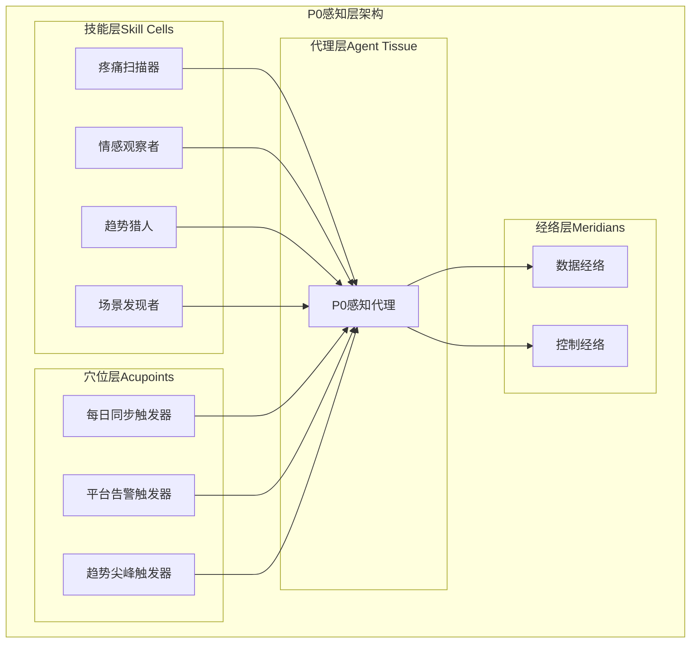
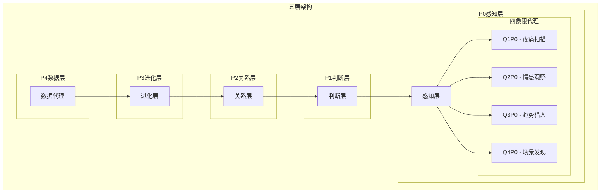
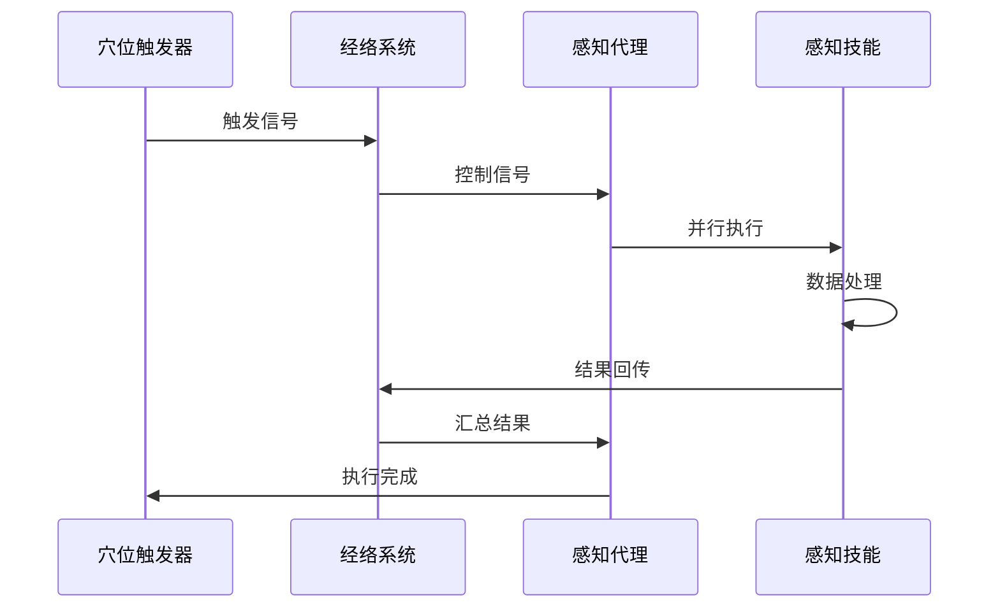
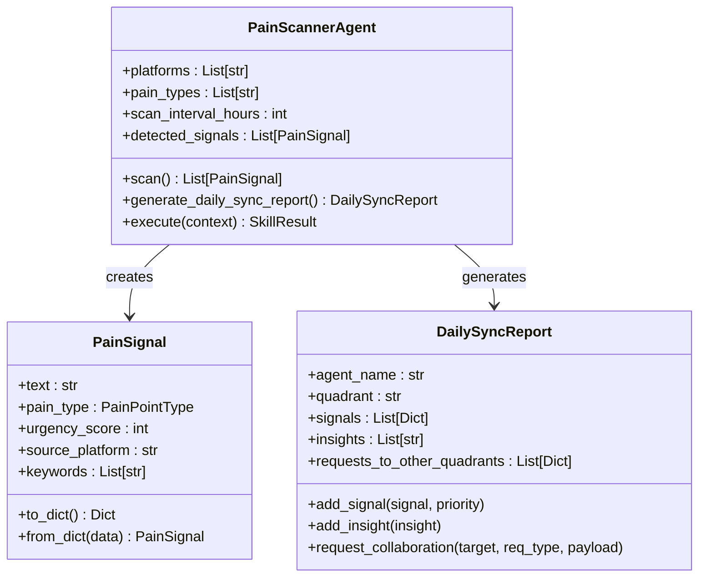
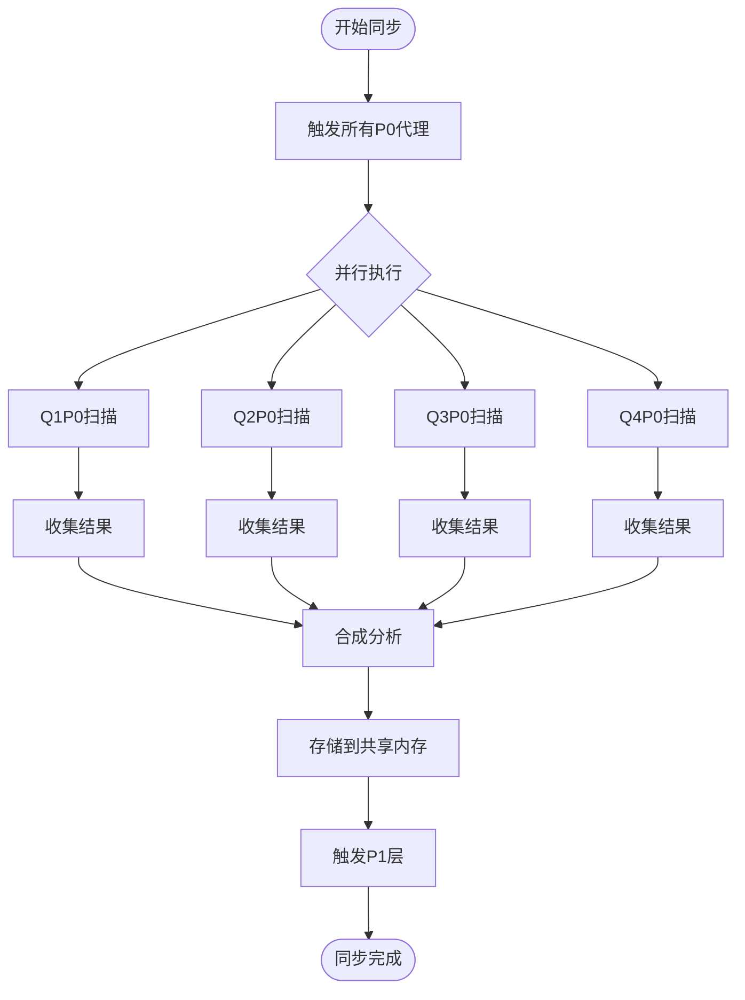
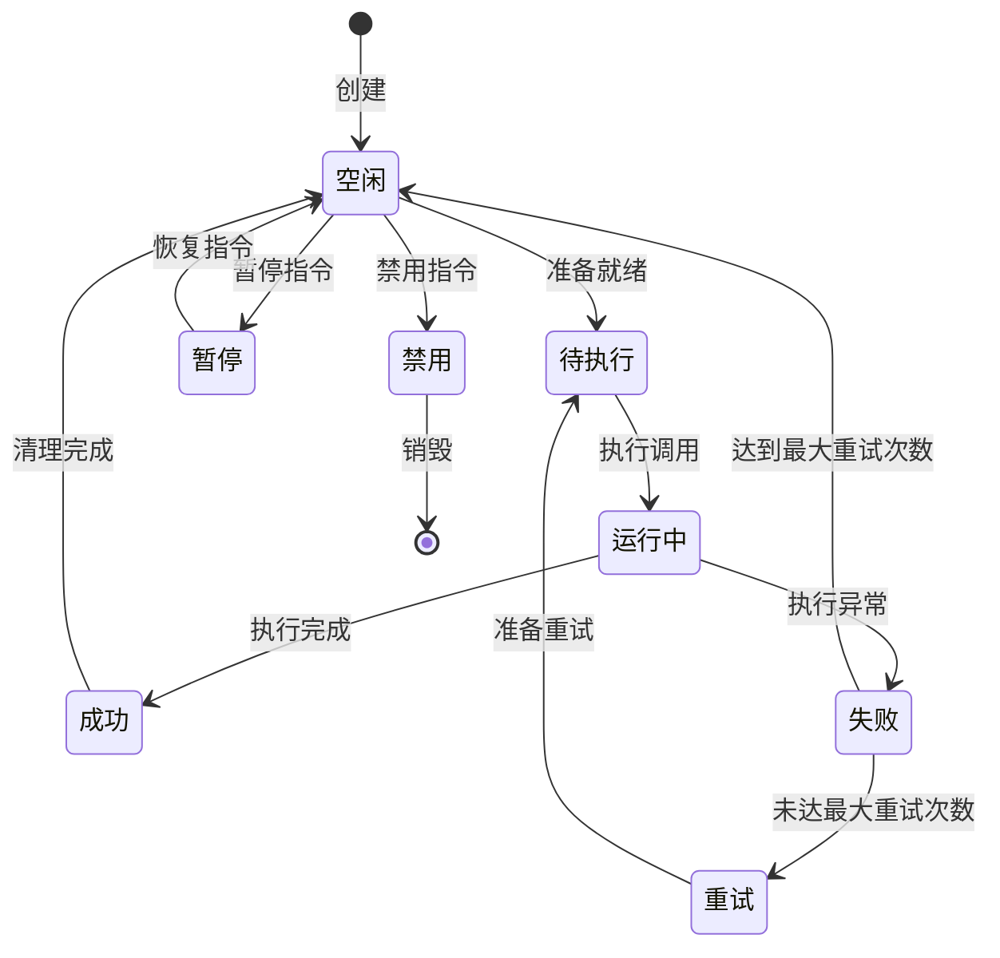
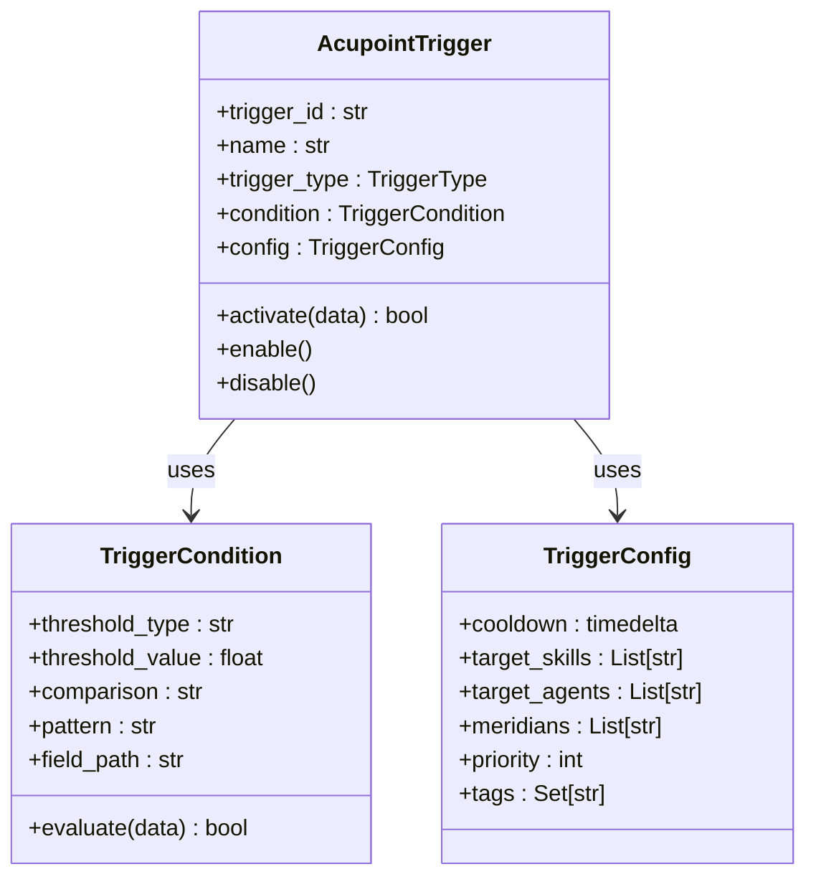
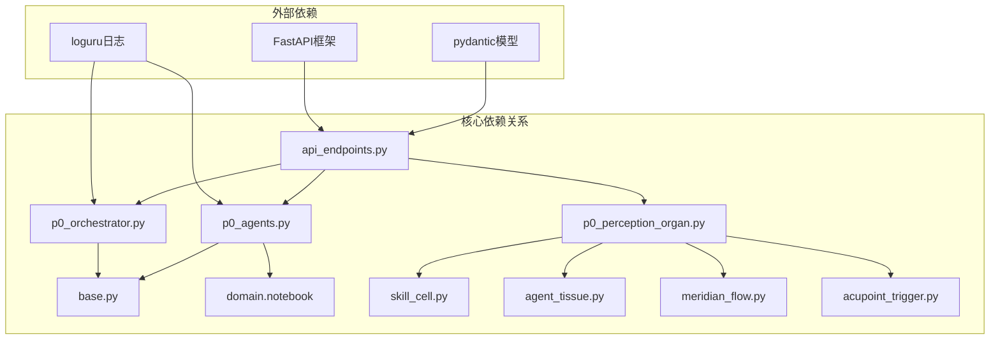

# P0感知层

<cite>
**本文档引用的文件**
- [p0_agents.py](file://open_notebook/skills/p0_agents.py)
- [p0_orchestrator.py](file://open_notebook/skills/p0_orchestrator.py)
- [p0_perception_organ.py](file://open_notebook/skills/living/examples/p0_perception_organ.py)
- [base.py](file://open_notebook/skills/base.py)
- [skill_cell.py](file://open_notebook/skills/living/skill_cell.py)
- [agent_tissue.py](file://open_notebook/skills/living/agent_tissue.py)
- [meridian_flow.py](file://open_notebook/skills/living/meridian_flow.py)
- [acupoint_trigger.py](file://open_notebook/skills/living/acupoint_trigger.py)
- [api_endpoints.py](file://open_notebook/skills/living/api_endpoints.py)
- [README.md](file://open_notebook/skills/living/README.md)
</cite>

## 目录
1. [简介](#简介)
2. [项目结构](#项目结构)
3. [核心组件](#核心组件)
4. [架构概览](#架构概览)
5. [详细组件分析](#详细组件分析)
6. [依赖关系分析](#依赖关系分析)
7. [性能考虑](#性能考虑)
8. [故障排除指南](#故障排除指南)
9. [结论](#结论)

## 简介

P0感知层是Open Notebook活体知识系统中的第一层，负责收集和处理来自各个平台的市场情报。该层采用生物启发式架构，模拟人体的感知系统，通过四个象限的感知代理来识别用户痛点、情感趋势、流行话题和使用场景。

该系统的核心理念是将软件组件类比为生物体的组成部分：
- **Skill（细胞）**：基本功能单元
- **Agent（组织）**：协作单元组合  
- **Organ（器官）**：复杂功能系统
- **Meridian（经络）**：数据/控制/时序流
- **Acupoint（穴位）**：外部刺激接入点

## 项目结构

P0感知层主要包含以下核心模块：

**图表来源**
- [p0_perception_organ.py](file://open_notebook/skills/living/examples/p0_perception_organ.py#L42-L298)
- [agent_tissue.py](file://open_notebook/skills/living/agent_tissue.py#L127-L181)
- [meridian_flow.py](file://open_notebook/skills/living/meridian_flow.py#L63-L132)
- [acupoint_trigger.py](file://open_notebook/skills/living/acupoint_trigger.py#L173-L212)

**章节来源**
- [p0_perception_organ.py](file://open_notebook/skills/living/examples/p0_perception_organ.py#L1-L557)
- [README.md](file://open_notebook/skills/living/README.md#L1-L286)

## 核心组件

### 四象限感知代理

P0感知层包含四个专门的感知代理，每个代理负责不同的感知维度：

#### Q1P0 疼痛扫描器（PainScannerAgent）
负责扫描用户痛点，包括即时性、持续性和隐性痛点。该代理能够：
- 分析社交媒体平台内容
- 识别用户需求和问题
- 计算痛点紧迫度评分
- 提取关键词和相关问题

#### Q2P0 情感观察者（EmotionWatcherAgent）
监控用户情感趋势和情绪变化，包括：
- 情感强度分析
- 情绪模式识别
- 情感趋势预测

#### Q3P0 趋势猎人（TrendHunterAgent）  
追踪流行话题和趋势，包括：
- 社交媒体趋势分析
- 搜索关键词热度监测
- 内容传播模式识别

#### Q4P0 场景发现者（SceneDiscoverAgent）
发现潜在的使用场景和机会，包括：
- 用户场景分析
- 市场机会识别
- 用户行为模式分析

**章节来源**
- [p0_agents.py](file://open_notebook/skills/p0_agents.py#L147-L800)
- [p0_perception_organ.py](file://open_notebook/skills/living/examples/p0_perception_organ.py#L42-L298)

### 日常同步协调器

P0协调器负责管理四个感知代理的日常同步，实现跨象限智能：
- 触发所有P0代理执行扫描
- 收集和合成各代理的报告
- 检测跨象限模式和关联
- 生成跨象限信号
- 管理共享内存状态

**章节来源**
- [p0_orchestrator.py](file://open_notebook/skills/p0_orchestrator.py#L177-L800)

## 架构概览

P0感知层采用五层架构，每层都有特定的功能和职责：

**图表来源**
- [README.md](file://open_notebook/skills/living/README.md#L17-L33)
- [p0_orchestrator.py](file://open_notebook/skills/p0_orchestrator.py#L1-L29)

### 经络系统

经络系统是P0感知层的数据和控制流基础设施：

**图表来源**
- [meridian_flow.py](file://open_notebook/skills/living/meridian_flow.py#L191-L238)
- [acupoint_trigger.py](file://open_notebook/skills/living/acupoint_trigger.py#L213-L277)

**章节来源**
- [meridian_flow.py](file://open_notebook/skills/living/meridian_flow.py#L1-L444)
- [acupoint_trigger.py](file://open_notebook/skills/living/acupoint_trigger.py#L1-L596)

## 详细组件分析

### 疼痛扫描器组件

疼痛扫描器是P0层的核心组件，负责识别用户痛点：

**图表来源**
- [p0_agents.py](file://open_notebook/skills/p0_agents.py#L147-L800)

#### 疼痛类型分类

系统支持三种类型的痛点识别：

| 痛点类型 | 描述 | 关键词示例 | 紧迫度特征 |
|---------|------|-----------|-----------|
| 即时性痛点 | 紧急、时间敏感的问题 | "来不及了"、"马上"、"现在" | 高紧迫度，需要立即解决 |
| 持续性痛点 | 长期存在、反复出现的问题 | "总是"、"一直"、"每天" | 中等紧迫度，需要持续关注 |
| 隐性痛点 | 用户不愿意表达的深层需求 | "希望能"、"秘密"、"不好意思" | 低紧迫度但高价值 |

**章节来源**
- [p0_agents.py](file://open_notebook/skills/p0_agents.py#L37-L100)
- [p0_agents.py](file://open_notebook/skills/p0_agents.py#L192-L228)

### 感知代理协调机制

感知代理采用并行协调模式，确保高效的数据收集：

**图表来源**
- [p0_orchestrator.py](file://open_notebook/skills/p0_orchestrator.py#L722-L789)

**章节来源**
- [p0_orchestrator.py](file://open_notebook/skills/p0_orchestrator.py#L326-L368)
- [p0_orchestrator.py](file://open_notebook/skills/p0_orchestrator.py#L500-L534)

### 活体知识系统实现

活体知识系统提供了完整的P0感知层实现：

#### 技能细胞（LivingSkill）

技能细胞是系统的基本执行单元，具有完整的生命周期管理：

**图表来源**
- [skill_cell.py](file://open_notebook/skills/living/skill_cell.py#L29-L39)

#### 代理组织（AgentTissue）

代理组织协调多个技能细胞的协作执行：

| 协调模式 | 特征 | 适用场景 |
|---------|------|----------|
| 顺序执行 | 严格按顺序执行 | 需要数据依赖的任务 |
| 并行执行 | 同时执行多个任务 | 独立且耗时的任务 |
| 管道执行 | 前一输出作为后一输入 | 数据处理流水线 |
| 条件执行 | 满足条件才执行 | 动态决策场景 |
| 竞执行 | 第一个完成的获胜 | 需要快速响应的场景 |

**章节来源**
- [skill_cell.py](file://open_notebook/skills/living/skill_cell.py#L211-L474)
- [agent_tissue.py](file://open_notebook/skills/living/agent_tissue.py#L127-L489)

### 触发器系统

触发器系统提供多种外部刺激接入点：

**图表来源**
- [acupoint_trigger.py](file://open_notebook/skills/living/acupoint_trigger.py#L173-L354)

**章节来源**
- [acupoint_trigger.py](file://open_notebook/skills/living/acupoint_trigger.py#L30-L596)

## 依赖关系分析

P0感知层的组件间依赖关系如下：

**图表来源**
- [p0_agents.py](file://open_notebook/skills/p0_agents.py#L32-L35)
- [p0_orchestrator.py](file://open_notebook/skills/p0_orchestrator.py#L40-L43)
- [api_endpoints.py](file://open_notebook/skills/living/api_endpoints.py#L15-L28)

**章节来源**
- [base.py](file://open_notebook/skills/base.py#L1-L183)
- [p0_perception_organ.py](file://open_notebook/skills/living/examples/p0_perception_organ.py#L11-L35)

## 性能考虑

### 并行处理优化

P0感知层采用并行处理策略来提高性能：
- **并发扫描**：四个象限代理可以同时执行扫描任务
- **异步I/O**：使用asyncio处理网络请求和数据处理
- **资源池管理**：合理配置最大并发数避免系统过载

### 内存管理

系统采用分层内存管理策略：
- **短期缓存**：最近24小时的信号存储在内存中
- **共享内存**：跨代理共享的状态数据
- **持久化存储**：重要的分析结果和历史数据

### 扩展性设计

系统具备良好的扩展性：
- **插件化架构**：新的感知代理可以轻松添加
- **配置驱动**：通过配置文件调整参数
- **动态加载**：支持运行时加载新的技能和代理

## 故障排除指南

### 常见问题及解决方案

#### 1. 代理执行失败

**症状**：某个或某些感知代理执行失败
**原因**：
- 网络连接问题
- 平台API限制
- 数据格式不正确

**解决方案**：
- 检查网络连接和API密钥
- 查看日志获取详细错误信息
- 验证输入数据格式

#### 2. 同步延迟

**症状**：P0同步执行时间过长
**原因**：
- 平台数据获取缓慢
- 并发任务过多
- 系统资源不足

**解决方案**：
- 调整并发参数
- 优化数据获取逻辑
- 增加系统资源

#### 3. 触发器失效

**症状**：外部触发器无法正常工作
**原因**：
- 触发器配置错误
- 条件不满足
- 冷却时间未过

**解决方案**：
- 检查触发器配置
- 验证触发条件
- 等待冷却时间结束

**章节来源**
- [p0_agents.py](file://open_notebook/skills/p0_agents.py#L745-L752)
- [p0_orchestrator.py](file://open_notebook/skills/p0_orchestrator.py#L784-L789)

## 结论

P0感知层通过生物启发式的五层架构，实现了智能化的市场情报收集和处理系统。该系统的主要优势包括：

1. **模块化设计**：四个象限代理各司其职，协同工作
2. **自适应能力**：通过反馈循环不断优化性能
3. **扩展性强**：支持新功能的快速集成
4. **可靠性高**：完善的错误处理和重试机制
5. **可视化监控**：完整的状态跟踪和指标收集

该系统为后续的P1判断层、P2关系层、P3进化层和P4数据层奠定了坚实的基础，形成了完整的活体知识生态系统。通过持续的优化和扩展，P0感知层将继续为用户提供高质量的市场洞察和决策支持。