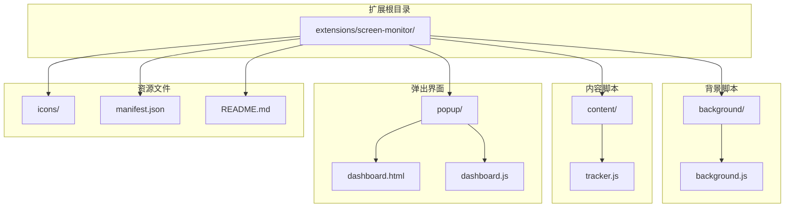
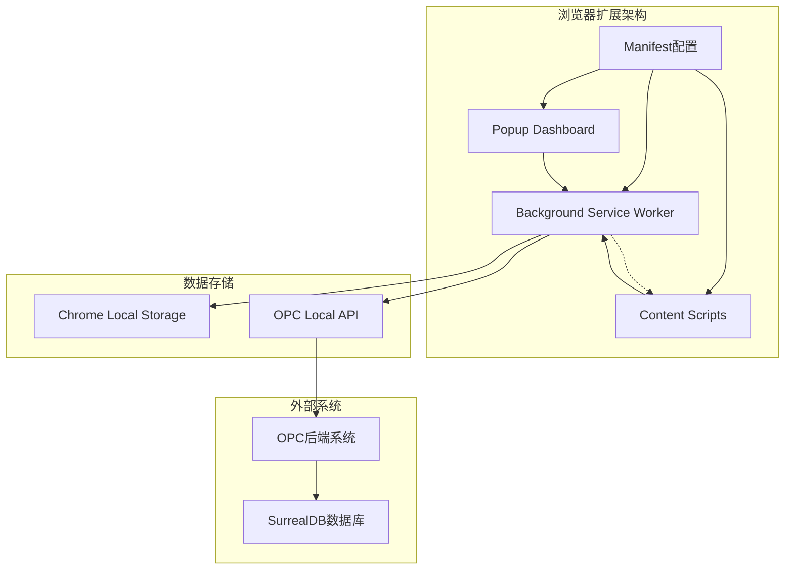
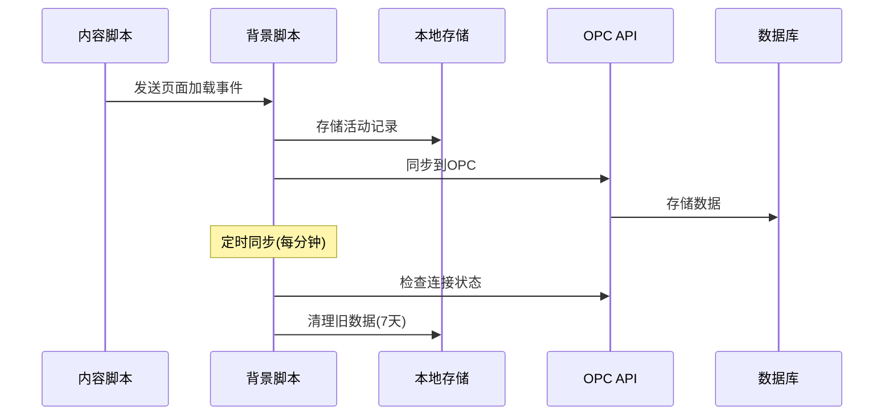
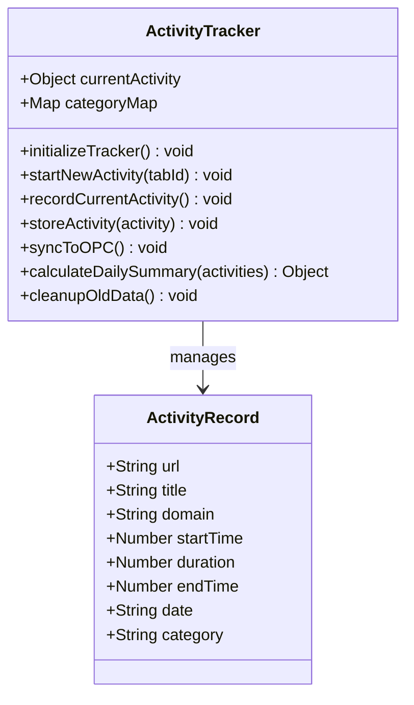
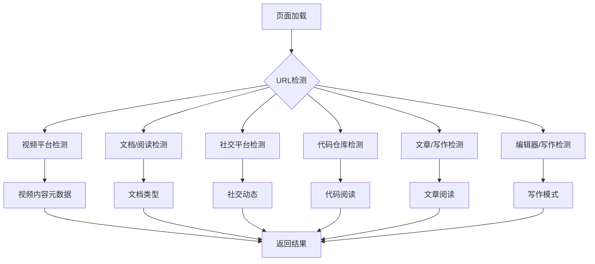
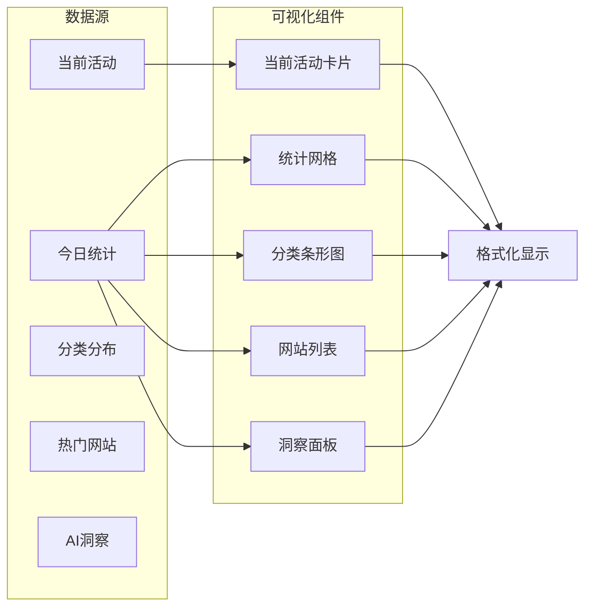
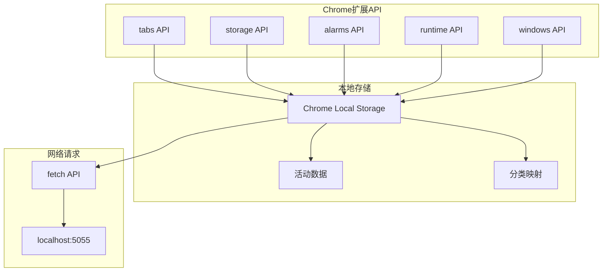
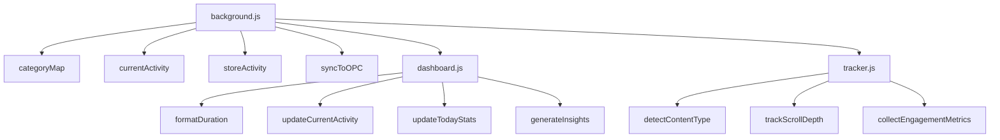

# OPC活动监控浏览器扩展

<cite>
**本文档引用的文件**
- [manifest.json](file://extensions/screen-monitor/manifest.json)
- [background.js](file://extensions/screen-monitor/background/background.js)
- [tracker.js](file://extensions/screen-monitor/content/tracker.js)
- [dashboard.html](file://extensions/screen-monitor/popup/dashboard.html)
- [dashboard.js](file://extensions/screen-monitor/popup/dashboard.js)
- [README.md](file://extensions/screen-monitor/README.md)
</cite>

## 目录
1. [项目概述](#项目概述)
2. [项目结构](#项目结构)
3. [核心组件](#核心组件)
4. [架构概览](#架构概览)
5. [详细组件分析](#详细组件分析)
6. [依赖关系分析](#依赖关系分析)
7. [性能考虑](#性能考虑)
8. [故障排除指南](#故障排除指南)
9. [结论](#结论)

## 项目概述

OPC活动监控浏览器扩展是一个隐私优先的数字行为追踪工具，旨在帮助超级个体更好地理解自己的数字活动模式。该扩展通过Chrome扩展架构实现，采用MVP（最小可行产品）设计理念，专注于基础活动追踪和行为洞察功能。

### 主要特性

- **实时活动追踪**：自动记录浏览器标签切换和停留时间
- **隐私优先**：所有数据本地存储，不上传云端
- **行为洞察**：AI分析工作模式，提供效率建议
- **OPC集成**：可选同步到本地OPC系统
- **多类别分类**：智能识别和分类不同类型的在线活动

## 项目结构

扩展项目采用标准的Chrome扩展目录结构，包含三个核心部分：

**图表来源**
- [manifest.json](file://extensions/screen-monitor/manifest.json#L1-L39)
- [background.js](file://extensions/screen-monitor/background/background.js#L1-L294)
- [tracker.js](file://extensions/screen-monitor/content/tracker.js#L1-L154)
- [dashboard.html](file://extensions/screen-monitor/popup/dashboard.html#L1-L381)
- [dashboard.js](file://extensions/screen-monitor/popup/dashboard.js#L1-L304)

**章节来源**
- [manifest.json](file://extensions/screen-monitor/manifest.json#L1-L39)
- [README.md](file://extensions/screen-monitor/README.md#L1-L72)

## 核心组件

### 1. Manifest配置文件

扩展的核心配置文件定义了权限、权限范围、服务工作者和内容脚本等关键设置。

### 2. 背景服务工作者

负责监听浏览器事件、管理活动状态和执行数据同步逻辑。

### 3. 内容脚本

在网页中注入，用于检测页面类型和收集用户参与指标。

### 4. 弹出式仪表板

提供用户友好的界面来查看活动统计数据和洞察。

**章节来源**
- [manifest.json](file://extensions/screen-monitor/manifest.json#L6-L11)
- [background.js](file://extensions/screen-monitor/background/background.js#L8-L15)
- [tracker.js](file://extensions/screen-monitor/content/tracker.js#L8-L13)
- [dashboard.html](file://extensions/screen-monitor/popup/dashboard.html#L296-L381)

## 架构概览

扩展采用Chrome扩展的标准架构模式，实现了清晰的职责分离：

**图表来源**
- [manifest.json](file://extensions/screen-monitor/manifest.json#L16-L25)
- [background.js](file://extensions/screen-monitor/background/background.js#L68-L76)
- [dashboard.js](file://extensions/screen-monitor/popup/dashboard.js#L288-L303)

### 通信机制

扩展内部采用消息传递机制进行组件间通信：

**图表来源**
- [background.js](file://extensions/screen-monitor/background/background.js#L78-L104)
- [background.js](file://extensions/screen-monitor/background/background.js#L184-L219)
- [background.js](file://extensions/screen-monitor/background/background.js#L247-L264)

## 详细组件分析

### 背景服务工作者 (background.js)

#### 活动跟踪状态管理

**图表来源**
- [background.js](file://extensions/screen-monitor/background/background.js#L9-L15)
- [background.js](file://extensions/screen-monitor/background/background.js#L107-L129)

#### 事件监听器

背景脚本监听多种浏览器事件来捕获用户活动：

| 事件类型 | 触发条件 | 功能 |
|---------|----------|------|
| `onActivated` | 标签页切换 | 开始新活动记录 |
| `onUpdated` | 页面URL变化 | 更新活动状态 |
| `onFocusChanged` | 窗口焦点变化 | 暂停/恢复跟踪 |
| `onAlarm` | 定时器触发 | 同步数据到OPC |

**章节来源**
- [background.js](file://extensions/screen-monitor/background/background.js#L78-L104)
- [background.js](file://extensions/screen-monitor/background/background.js#L267-L271)

### 内容脚本 (tracker.js)

#### 页面类型检测系统

内容脚本实现了智能的页面类型检测机制：

**图表来源**
- [tracker.js](file://extensions/screen-monitor/content/tracker.js#L16-L53)

#### 用户参与指标收集

内容脚本收集以下参与指标：

| 指标类型 | 收集方式 | 用途 |
|---------|----------|------|
| 滚动深度 | 监听滚动事件 | 衡量内容参与度 |
| 复制操作 | 监听copy事件 | 标识有价值内容 |
| 文本选择 | 监听selectionchange | 评估阅读强度 |
| 页面停留 | 定时报告 | 统计活动时长 |

**章节来源**
- [tracker.js](file://extensions/screen-monitor/content/tracker.js#L68-L132)

### 弹出式仪表板 (dashboard.js)

#### 数据可视化组件

仪表板提供了丰富的数据可视化功能：

**图表来源**
- [dashboard.js](file://extensions/screen-monitor/popup/dashboard.js#L57-L89)
- [dashboard.js](file://extensions/screen-monitor/popup/dashboard.js#L91-L137)

#### AI洞察生成算法

仪表板根据统计数据生成个性化的洞察建议：

| 洞察类型 | 判断条件 | 建议内容 |
|---------|----------|----------|
| 深度工作状态 | 专注时间占比 > 60% | 继续保持高质量产出 |
| 注意力分散 | 专注时间占比 < 30% | 尝试番茄工作法 |
| 频繁切换 | 平均会话时间 < 2分钟 | 减少多任务切换 |
| 良好沉浸度 | 平均会话时间 > 10分钟 | 这种深度工作模式效率很高 |
| 多元探索 | 涉及多个领域 | 跨领域学习有助于创新思维 |
| 单一专注 | 仅聚焦一个领域且时间>1小时 | 单点突破适合攻坚难题 |

**章节来源**
- [dashboard.js](file://extensions/screen-monitor/popup/dashboard.js#L205-L266)

## 依赖关系分析

### 外部依赖

扩展依赖于Chrome扩展API和本地存储：

**图表来源**
- [manifest.json](file://extensions/screen-monitor/manifest.json#L6-L11)
- [background.js](file://extensions/screen-monitor/background/background.js#L170-L182)

### 内部模块依赖

扩展内部模块之间的依赖关系：

**图表来源**
- [background.js](file://extensions/screen-monitor/background/background.js#L170-L182)
- [dashboard.js](file://extensions/screen-monitor/popup/dashboard.js#L45-L55)
- [tracker.js](file://extensions/screen-monitor/content/tracker.js#L16-L53)

**章节来源**
- [manifest.json](file://extensions/screen-monitor/manifest.json#L1-L39)
- [background.js](file://extensions/screen-monitor/background/background.js#L1-L294)
- [dashboard.js](file://extensions/screen-monitor/popup/dashboard.js#L1-L304)
- [tracker.js](file://extensions/screen-monitor/content/tracker.js#L1-L154)

## 性能考虑

### 内存管理

- **活动状态重置**：每次活动结束后重置当前活动状态，避免内存泄漏
- **数据清理**：自动清理7天前的旧数据，控制存储空间使用
- **异步操作**：所有存储和网络操作都使用异步模式，避免阻塞主线程

### 网络优化

- **定时同步**：每分钟检查一次同步状态，避免频繁网络请求
- **失败重试**：网络请求失败时静默处理，等待下次定时器触发
- **数据压缩**：仅发送必要的活动数据和摘要信息

### 用户体验优化

- **防抖处理**：文本选择检测使用2秒防抖，避免误触发
- **被动事件监听**：滚动事件使用passive选项，提升滚动性能
- **增量更新**：仪表板每5秒刷新一次，平衡实时性和性能

## 故障排除指南

### 常见问题及解决方案

| 问题类型 | 症状 | 解决方案 |
|---------|------|----------|
| 扩展未响应 | 仪表板空白 | 检查扩展是否启用，重新加载扩展 |
| 数据未同步 | OPC状态显示为本地存储 | 确认OPC后端服务正在运行 |
| 权限不足 | 无法访问某些网站 | 在扩展设置中授予必要权限 |
| 存储空间不足 | 活动记录丢失 | 清理旧数据或增加存储配额 |

### 调试方法

1. **打开扩展开发工具**：
   - 访问 `chrome://extensions/`
   - 启用"开发者模式"
   - 点击"详细信息"查看错误日志

2. **检查控制台输出**：
   - 打开开发者工具
   - 查看Console标签页中的错误信息

3. **验证权限配置**：
   - 确认manifest.json中的权限声明
   - 检查host_permissions是否正确配置

**章节来源**
- [background.js](file://extensions/screen-monitor/background/background.js#L215-L218)
- [dashboard.js](file://extensions/screen-monitor/popup/dashboard.js#L268-L286)

## 结论

OPC活动监控浏览器扩展是一个设计精良的隐私优先工具，成功实现了以下目标：

### 技术成就

- **架构清晰**：采用标准的Chrome扩展架构，职责分离明确
- **性能优化**：合理的异步处理和内存管理策略
- **用户体验**：直观的可视化界面和及时的洞察反馈
- **隐私保护**：完全本地化的数据处理和存储

### 功能特色

- **智能分类**：基于域名的活动分类系统
- **多维度统计**：涵盖时间分布、网站使用和行为模式
- **AI洞察**：基于统计数据的个性化建议
- **可扩展性**：模块化的架构支持未来功能扩展

### 发展前景

该扩展为OPC生态系统提供了重要的数据采集基础，为后续的功能扩展（如屏幕录制、应用进程监控、预测性建议等）奠定了坚实的技术基础。其隐私优先的设计理念和开源的架构为整个超级个体工具箱项目提供了重要的技术支撑。