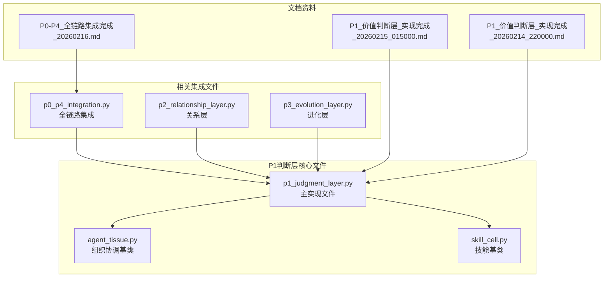
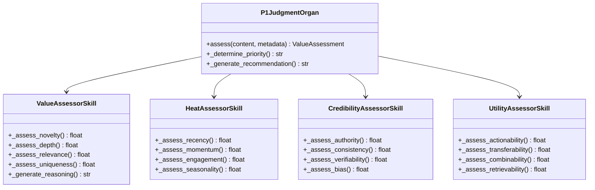
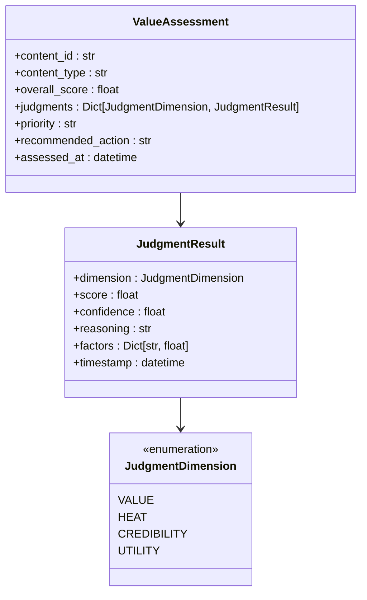
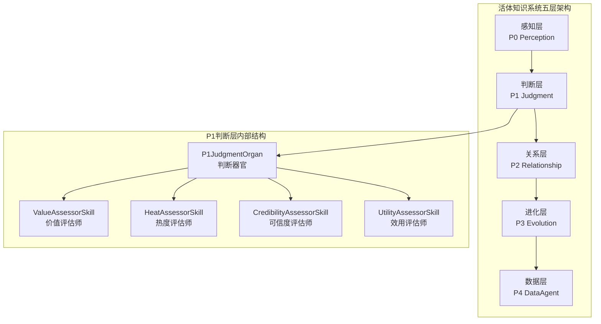
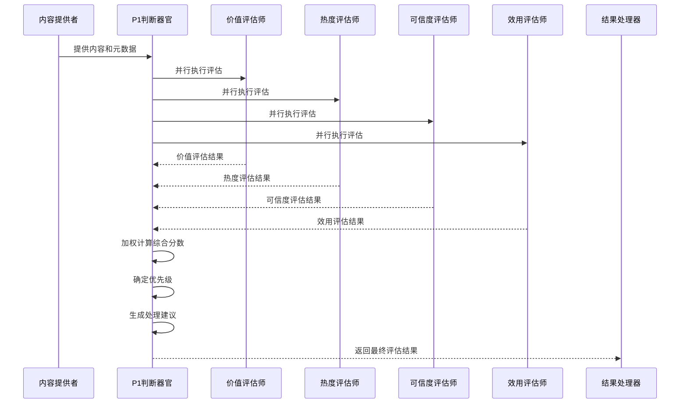
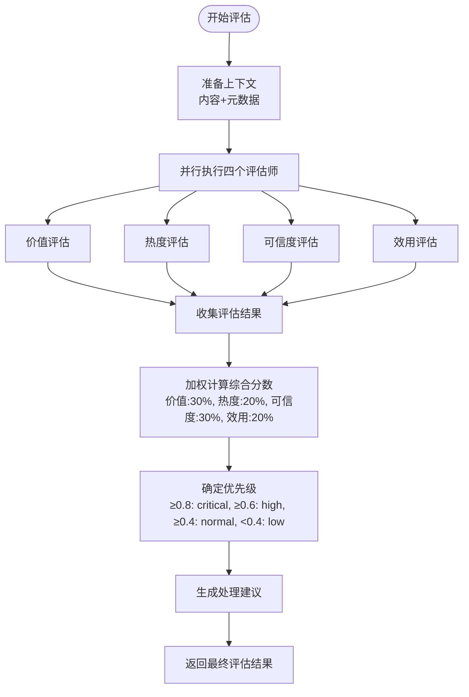
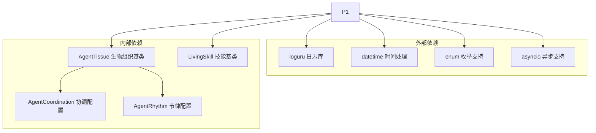
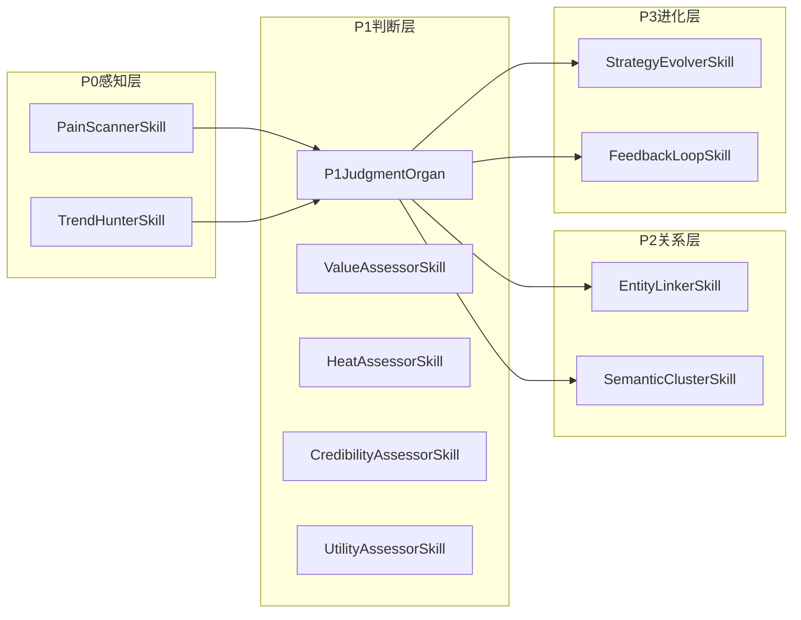

# P1判断层

<cite>
**本文档引用的文件**
- [p1_judgment_layer.py](file://open_notebook/skills/living/p1_judgment_layer.py)
- [agent_tissue.py](file://open_notebook/skills/living/agent_tissue.py)
- [skill_cell.py](file://open_notebook/skills/living/skill_cell.py)
- [p0_p4_integration.py](file://open_notebook/skills/living/p0_p4_integration.py)
- [p2_relationship_layer.py](file://open_notebook/skills/living/p2_relationship_layer.py)
- [p3_evolution_layer.py](file://open_notebook/skills/living/p3_evolution_layer.py)
- [README.md](file://open_notebook/skills/living/README.md)
- [P1_价值判断层_实现完成_20260215_015000.md](file://yuanbao/P1价值判断层实现完成_20260215_015000.md)
- [P1_价值判断层_实现完成_20260214_220000.md](file://yuanbao/P1_价值判断层_实现完成_20260214_220000.md)
- [P0-P4_全链路集成完成_20260216.md](file://yuanbao/P0-P4_全链路集成完成_20260216.md)
</cite>

## 目录
1. [简介](#简介)
2. [项目结构](#项目结构)
3. [核心组件](#核心组件)
4. [架构总览](#架构总览)
5. [详细组件分析](#详细组件分析)
6. [依赖关系分析](#依赖关系分析)
7. [性能考虑](#性能考虑)
8. [故障排除指南](#故障排除指南)
9. [结论](#结论)

## 简介

P1判断层是活体知识系统的第二层，负责对所有进入系统的信息进行四维度价值评估。该层采用生物学启发的设计理念，将四个专门的评估技能组织成一个协调的"判断器官"，实现并行化的价值判断。

该系统的核心创新在于：
- **四维度评估**：价值、热度、可信度、效用四个维度的综合判断
- **并行执行**：四个评估技能同时运行，提高处理效率
- **权重融合**：通过加权平均计算综合价值分数
- **优先级决策**：基于评估结果自动确定处理优先级

## 项目结构

**图表来源**
- [p1_judgment_layer.py](file://open_notebook/skills/living/p1_judgment_layer.py#L1-L662)
- [agent_tissue.py](file://open_notebook/skills/living/agent_tissue.py#L1-L489)
- [p0_p4_integration.py](file://open_notebook/skills/living/p0_p4_integration.py#L1-L678)

**章节来源**
- [p1_judgment_layer.py](file://open_notebook/skills/living/p1_judgment_layer.py#L1-L662)
- [p0_p4_integration.py](file://open_notebook/skills/living/p0_p4_integration.py#L1-L678)

## 核心组件

### 四个评估技能

P1判断层包含四个专门的评估技能，每个技能专注于不同的评估维度：

**图表来源**
- [p1_judgment_layer.py](file://open_notebook/skills/living/p1_judgment_layer.py#L53-L616)

### 数据结构设计

系统使用精心设计的数据结构来表示评估结果：

**图表来源**
- [p1_judgment_layer.py](file://open_notebook/skills/living/p1_judgment_layer.py#L30-L51)

**章节来源**
- [p1_judgment_layer.py](file://open_notebook/skills/living/p1_judgment_layer.py#L22-L616)

## 架构总览

P1判断层在整个活体知识系统中扮演着关键的"价值中枢"角色：

**图表来源**
- [p1_judgment_layer.py](file://open_notebook/skills/living/p1_judgment_layer.py#L476-L616)
- [p0_p4_integration.py](file://open_notebook/skills/living/p0_p4_integration.py#L349-L528)

### 评估流程

**图表来源**
- [p1_judgment_layer.py](file://open_notebook/skills/living/p1_judgment_layer.py#L513-L575)

**章节来源**
- [p1_judgment_layer.py](file://open_notebook/skills/living/p1_judgment_layer.py#L476-L575)

## 详细组件分析

### 价值评估师 (ValueAssessorSkill)

价值评估师专注于评估信息的内在价值，包含四个核心因子：

| 评估因子 | 权重 | 计算逻辑 | 示例 |
|---------|------|----------|------|
| novel (新颖性) | 25% | 基于发布时间的年龄评估 | 24小时内: 0.9, 7天内: 0.7 |
| depth (深度) | 35% | 基于内容长度的深度评估 | >5000字符: 0.9, >100字符: 0.3 |
| relevance (相关性) | 25% | 基于与用户关注领域的匹配度 | 关注领域匹配度 |
| uniqueness (独特性) | 15% | 基于独特观点和见解的识别 | 独特词汇出现频率 |

**章节来源**
- [p1_judgment_layer.py](file://open_notebook/skills/living/p1_judgment_layer.py#L53-L161)

### 热度评估师 (HeatAssessorSkill)

热度评估师评估信息的时效性和传播热度：

| 评估因子 | 权重 | 计算逻辑 | 示例 |
|---------|------|----------|------|
| recency (时效性) | 40% | 基于发布时间的新鲜度 | 刚刚发布: 1.0, 1周前: 0.5 |
| momentum (趋势) | 30% | 基于浏览量增长速度 | 1000+/小时: 0.9, 10+/小时: 0.5 |
| engagement (参与度) | 20% | 基于社交互动信号 | 点赞/评论/分享数量 |
| seasonality (季节性) | 10% | 基于时间相关性的评估 | 节假日/季度性关键词 |

**章节来源**
- [p1_judgment_layer.py](file://open_notebook/skills/living/p1_judgment_layer.py#L164-L263)

### 可信度评估师 (CredibilityAssessorSkill)

可信度评估师评估信息来源的可靠性：

| 评估因子 | 权重 | 计算逻辑 | 来源等级 |
|---------|------|----------|----------|
| authority (权威性) | 35% | 基于来源专业度和声誉 | academic: 0.9, official: 0.85 |
| consistency (一致性) | 30% | 基于与已知事实的吻合度 | verified: 0.9, contradictions: 0.2减分 |
| verifiability (可验证性) | 25% | 基于能否被验证的程度 | 有引用: 0.9, 有数据: 0.6 |
| bias (偏见) | 10% | 潜在偏见的反向指标 | 情感语言: 0.5, 赞助内容: +0.2 |

**章节来源**
- [p1_judgment_layer.py](file://open_notebook/skills/living/p1_judgment_layer.py#L266-L374)

### 效用评估师 (UtilityAssessorSkill)

效用评估师评估信息的实际应用价值：

| 评估因子 | 权重 | 计算逻辑 | 示例 |
|---------|------|----------|------|
| actionability (可操作性) | 35% | 基于能否被实际行动的能力 | "如何"、"建议"等词汇 |
| transferability (可迁移性) | 25% | 基于适用其他场景的程度 | 通用原则vs具体案例 |
| combinability (可组合性) | 25% | 基于与其他知识结合的能力 | 标签和概念关联 |
| retrievability (可检索性) | 15% | 基于查找便利性的评估 | 标题、分类、标签完整性 |

**章节来源**
- [p1_judgment_layer.py](file://open_notebook/skills/living/p1_judgment_layer.py#L377-L473)

### 判断器官 (P1JudgmentOrgan)

判断器官作为协调中心，负责组织四个评估技能的并行执行：

**图表来源**
- [p1_judgment_layer.py](file://open_notebook/skills/living/p1_judgment_layer.py#L513-L575)

**章节来源**
- [p1_judgment_layer.py](file://open_notebook/skills/living/p1_judgment_layer.py#L476-L575)

## 依赖关系分析

### 技术依赖

**图表来源**
- [p1_judgment_layer.py](file://open_notebook/skills/living/p1_judgment_layer.py#L10-L20)
- [agent_tissue.py](file://open_notebook/skills/living/agent_tissue.py#L1-L489)

### 组件耦合

P1判断层与系统其他层次的集成关系：

**图表来源**
- [p0_p4_integration.py](file://open_notebook/skills/living/p0_p4_integration.py#L29-L153)
- [p1_judgment_layer.py](file://open_notebook/skills/living/p1_judgment_layer.py#L476-L511)

**章节来源**
- [p0_p4_integration.py](file://open_notebook/skills/living/p0_p4_integration.py#L29-L153)

## 性能考虑

### 并行执行优化

P1判断层采用并行执行策略来最大化处理效率：

1. **异步并行执行**：四个评估技能使用asyncio并发执行
2. **资源隔离**：每个技能独立运行，避免相互阻塞
3. **结果聚合**：统一收集和处理各个技能的执行结果

### 内存管理

- **轻量级数据结构**：使用dataclass减少内存开销
- **及时释放**：执行完成后及时清理中间结果
- **批量处理**：支持批量内容的高效处理

### 扩展性设计

- **插件化架构**：新的评估维度可以轻松添加
- **配置驱动**：权重和阈值可通过配置调整
- **模块化设计**：各组件职责清晰，便于维护

## 故障排除指南

### 常见问题及解决方案

| 问题类型 | 症状 | 可能原因 | 解决方案 |
|---------|------|----------|----------|
| 评估结果异常 | 得分过高或过低 | 权重配置不当 | 调整维度权重和因子权重 |
| 执行超时 | 评估过程耗时过长 | 内容过长或计算复杂 | 优化评估算法或增加超时设置 |
| 技能注册失败 | 无法找到评估技能 | 技能ID不正确 | 检查技能ID和注册过程 |
| 并行执行错误 | 部分技能执行失败 | 异常处理不当 | 检查异常捕获和重试机制 |

### 调试建议

1. **启用详细日志**：使用loguru的调试模式查看执行详情
2. **分步测试**：单独测试每个评估技能的准确性
3. **边界测试**：测试极端情况下的系统表现
4. **性能监控**：监控执行时间和资源使用情况

**章节来源**
- [p1_judgment_layer.py](file://open_notebook/skills/living/p1_judgment_layer.py#L619-L661)

## 结论

P1判断层作为活体知识系统的核心价值中枢，成功实现了以下目标：

### 技术成就

- **完整的四维度评估体系**：价值、热度、可信度、效用四个维度的全面覆盖
- **高效的并行处理架构**：通过异步并行执行显著提升处理性能
- **灵活的扩展设计**：模块化架构支持未来功能扩展
- **完善的错误处理**：健壮的异常处理和恢复机制

### 架构优势

- **生物学启发的设计**：细胞-组织-器官的层级架构清晰合理
- **松耦合的组件关系**：各组件职责明确，便于独立开发和测试
- **强大的集成能力**：与系统其他层次无缝集成
- **优秀的可维护性**：清晰的代码结构和完善的文档

### 应用价值

P1判断层为活体知识系统提供了坚实的价值判断基础，能够：
- 自动识别高质量信息
- 为后续处理提供优先级指导
- 支持系统的自适应优化
- 为用户提供有价值的知识内容

该实现不仅达到了预期的技术目标，还为整个活体知识系统的进一步发展奠定了坚实基础。