# P2关系层

<cite>
**本文档中引用的文件**
- [p2_relationship_layer.py](file://open_notebook/skills/living/p2_relationship_layer.py)
- [p2_agents.py](file://open_notebook/open_notebook/skills/p2_agents.py)
- [api_endpoints.py](file://open_notebook/skills/living/api_endpoints.py)
- [api_main.py](file://open_notebook/skills/living/api_main.py)
- [api_server.py](file://open_notebook/skills/living/api_server.py)
- [agent_tissue.py](file://open_notebook/skills/living/agent_tissue.py)
- [skill_cell.py](file://open_notebook/skills/living/skill_cell.py)
- [__init__.py](file://open_notebook/skills/living/__init__.py)
- [test_p0_p2_integration.py](file://open_notebook/skills/living/tests/test_p0_p2_integration.py)
- [feedback_loop.py](file://open_notebook/skills/feedback_loop.py)
</cite>

## 更新摘要
**变更内容**
- 新增P2代理系统（四象限关系构建代理）的详细说明
- 增加社交网络分析和关系维护功能的描述
- 更新架构图以反映双重P2系统结构
- 添加反馈循环系统与P2代理的集成说明
- 完善API端点和数据结构的说明

## 目录
1. [简介](#简介)
2. [项目结构](#项目结构)
3. [核心组件](#核心组件)
4. [架构概览](#架构概览)
5. [详细组件分析](#详细组件分析)
6. [依赖关系分析](#依赖关系分析)
7. [性能考虑](#性能考虑)
8. [故障排除指南](#故障排除指南)
9. [结论](#结论)

## 简介

P2关系层是活体知识系统的第五层架构，负责构建和维护知识图谱以及社交网络关系。该层采用双重架构设计，既包含传统的知识图谱构建能力，也包含基于四象限的社交关系代理系统。

### 传统P2关系层（知识图谱构建）

该系统专注于：
- **实体链接**：提取和链接知识实体
- **语义聚类**：基于语义相似度聚类知识
- **时序编织**：发现时间关系
- **交叉引用**：构建引用网络

### P2代理系统（社交关系构建）

该系统专注于：
- **Q1P2信任构建器**：通过解决方案交付建立信任
- **Q2P2社区绑定器**：强化情感社区纽带
- **Q3P2病毒引擎**：优化内容病毒传播
- **Q4P2影响力网络**：通过关键连接扩大影响力

该系统的核心理念是将知识视为活体有机体，其中：
- **技能细胞 (Skill Cells)**：基本功能单元
- **组织 (Agents)**：协作的技能集合
- **器官 (Organs)**：复杂的功能性单元
- **经络 (Meridians)**：数据/控制/时间连接
- **穴位 (Triggers)**：外部接入点

## 项目结构

P2关系层位于活体知识系统的核心位置，采用模块化设计，包含双重架构：

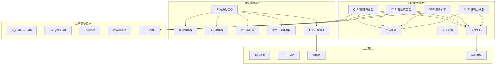

**图表来源**
- [p2_relationship_layer.py](file://open_notebook/skills/living/p2_relationship_layer.py#L628-L821)
- [p2_agents.py](file://open_notebook/open_notebook/skills/p2_agents.py#L113-L916)
- [agent_tissue.py](file://open_notebook/skills/living/agent_tissue.py#L127-L200)
- [feedback_loop.py](file://open_notebook/skills/feedback_loop.py#L1-L200)

**章节来源**
- [p2_relationship_layer.py](file://open_notebook/skills/living/p2_relationship_layer.py#L1-L924)
- [p2_agents.py](file://open_notebook/open_notebook/skills/p2_agents.py#L1-L916)
- [api_endpoints.py](file://open_notebook/skills/living/api_endpoints.py#L1-L566)

## 核心组件

### P2关系器官 (P2RelationshipOrgan)

P2关系器官是整个关系层的核心协调者，负责管理四个专门的关系技能：

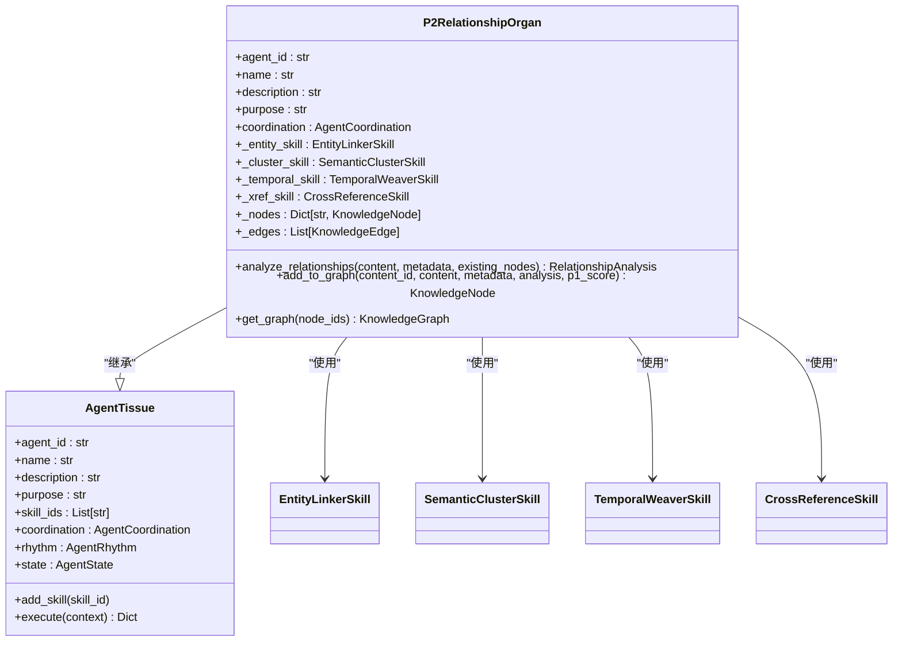

**图表来源**
- [p2_relationship_layer.py](file://open_notebook/skills/living/p2_relationship_layer.py#L628-L821)
- [agent_tissue.py](file://open_notebook/skills/living/agent_tissue.py#L127-L200)

### 四个关系技能

P2关系层包含四个专门的关系技能，每个技能都有特定的功能：

1. **实体链接器 (Entity Linker)**：提取和链接知识实体
2. **语义聚类器 (Semantic Cluster)**：基于语义相似度聚类知识
3. **时序编织器 (Temporal Weaver)**：发现时间关系
4. **交叉引用映射器 (Cross-Reference Mapper)**：构建引用网络

### P2代理系统

P2代理系统包含四个四象限代理，每个代理专注于特定的社交关系构建：

1. **Q1P2信任构建器**：通过解决方案交付建立信任
2. **Q2P2社区绑定器**：强化情感社区纽带
3. **Q3P2病毒引擎**：优化内容病毒传播
4. **Q4P2影响力网络**：通过关键连接扩大影响力

**章节来源**
- [p2_relationship_layer.py](file://open_notebook/skills/living/p2_relationship_layer.py#L85-L924)
- [p2_agents.py](file://open_notebook/open_notebook/skills/p2_agents.py#L113-L916)

## 架构概览

P2关系层采用分层架构设计，体现了活体知识系统的生物学启发：

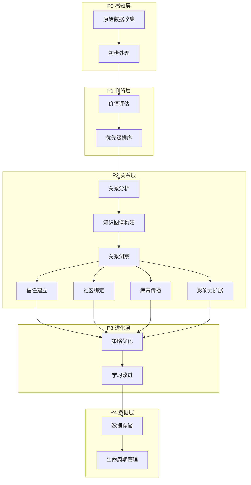

**图表来源**
- [api_endpoints.py](file://open_notebook/skills/living/api_endpoints.py#L176-L565)

## 详细组件分析

### 实体链接器 (EntityLinkerSkill)

实体链接器负责从内容中提取关键实体，并将其链接到现有知识库：

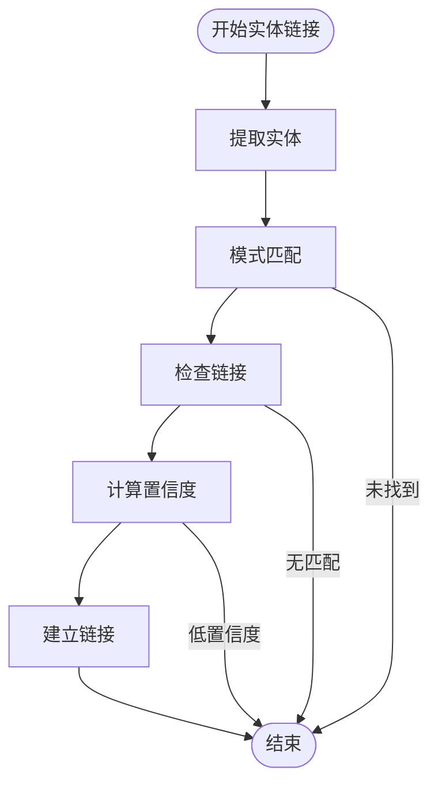

**图表来源**
- [p2_relationship_layer.py](file://open_notebook/skills/living/p2_relationship_layer.py#L108-L191)

实体链接器使用多种模式来识别不同类型的实体：
- **概念定义**：识别"什么是..."、"定义为..."等模式
- **强调术语**：识别引号或括号中的术语
- **专有名词**：识别可能的人员、组织名称

### 语义聚类器 (SemanticClusterSkill)

语义聚类器基于多种相似度指标对知识节点进行聚类：

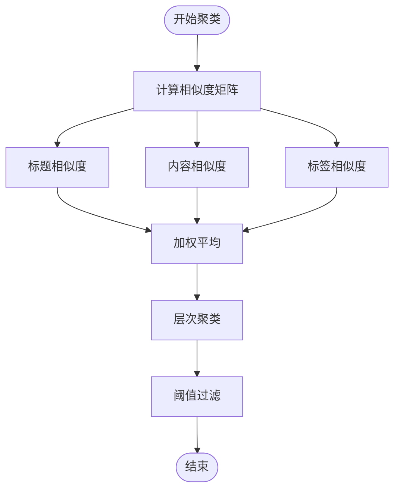

**图表来源**
- [p2_relationship_layer.py](file://open_notebook/skills/living/p2_relationship_layer.py#L212-L334)

聚类算法采用层次聚类方法，通过以下相似度指标：
- **标题相似度**：基于词重叠的文本相似度
- **内容相似度**：基于内容片段的相似度
- **标签相似度**：基于共享标签的Jaccard相似度

### 时序编织器 (TemporalWeaverSkill)

时序编织器发现内容之间的时间关系：

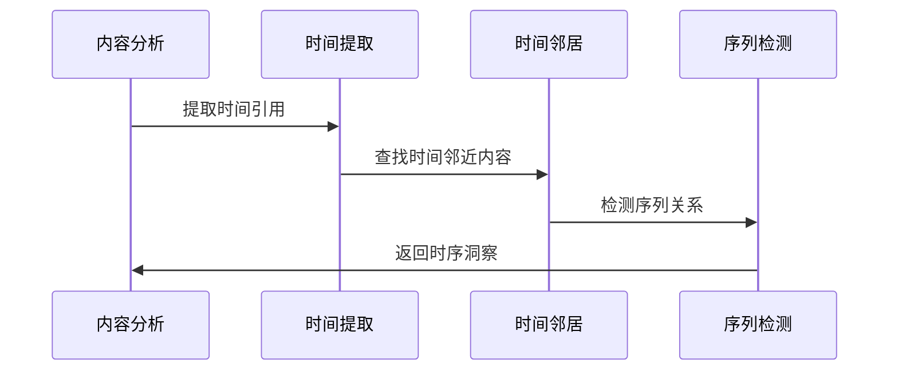

**图表来源**
- [p2_relationship_layer.py](file://open_notebook/skills/living/p2_relationship_layer.py#L355-L498)

时序编织器支持多种时间模式：
- **绝对时间**：年份、日期格式
- **相对时间**：之前、以后、当时等
- **时间窗口**：基于创建时间的邻近关系

### 交叉引用映射器 (CrossReferenceSkill)

交叉引用映射器构建内容之间的引用网络：

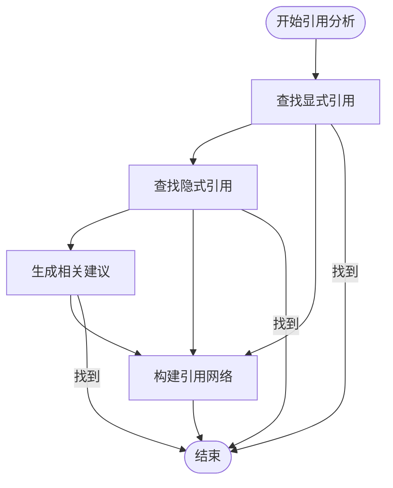

**图表来源**
- [p2_relationship_layer.py](file://open_notebook/skills/living/p2_relationship_layer.py#L519-L625)

交叉引用包括：
- **显式引用**：直接的引用标记
- **隐式引用**：基于内容相似度的间接关联
- **相关建议**：基于标签共享的内容推荐

### 知识图谱数据结构

P2关系层使用统一的数据结构来表示知识图谱：

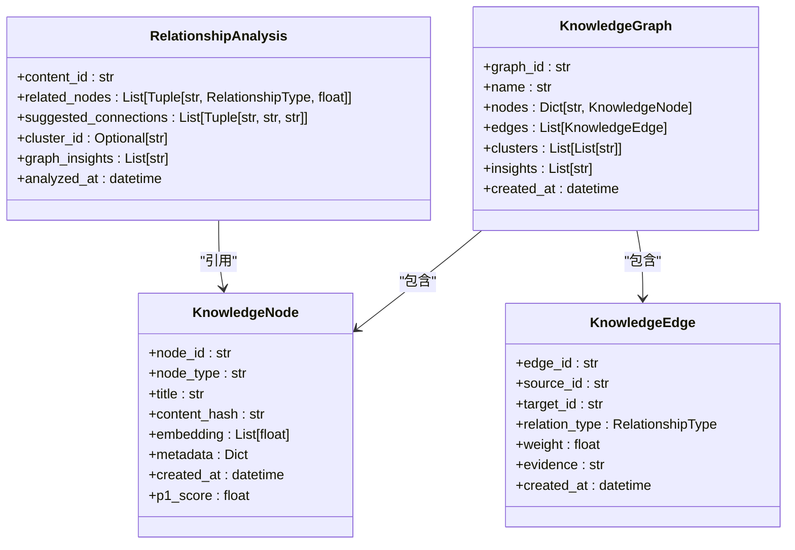

**图表来源**
- [p2_relationship_layer.py](file://open_notebook/skills/living/p2_relationship_layer.py#L37-L83)

### P2代理系统数据结构

P2代理系统使用专门的数据结构来管理关系计划和报告：

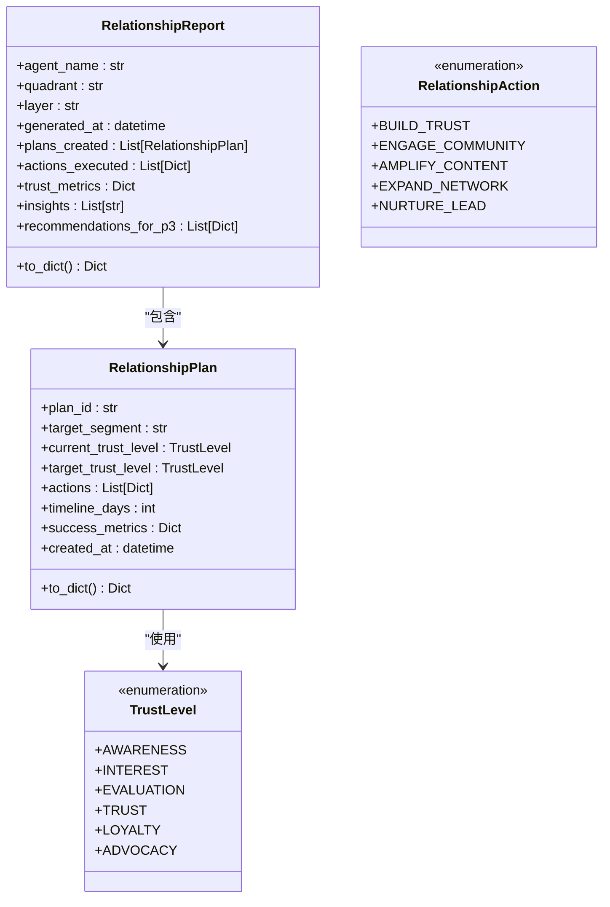

**图表来源**
- [p2_agents.py](file://open_notebook/open_notebook/skills/p2_agents.py#L37-L106)

### Q1P2信任构建器

Q1P2信任构建器专注于通过解决方案交付建立信任：

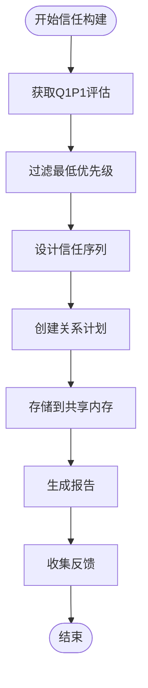

**图表来源**
- [p2_agents.py](file://open_notebook/open_notebook/skills/p2_agents.py#L280-L375)

信任构建序列包括：
- **快速胜利**：立即提供价值，建立可信度
- **证明内容**：案例研究、客户见证
- **教育内容**：深度专业知识展示
- **软性报价**：解决方案呈现

### Q2P2社区绑定器

Q2P2社区绑定器专注于强化情感社区纽带：

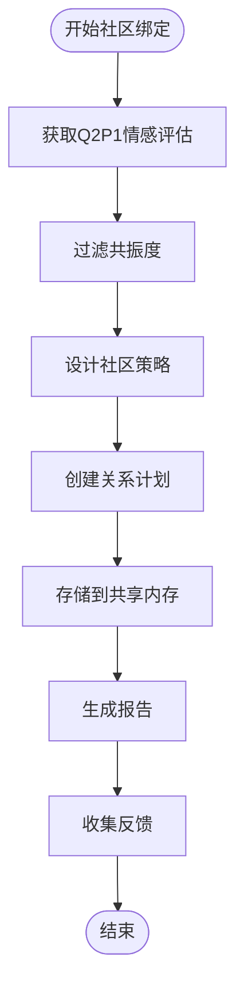

**图表来源**
- [p2_agents.py](file://open_notebook/open_notebook/skills/p2_agents.py#L495-L565)

社区绑定策略包括：
- **共同体验内容**：创造"你并不孤单"的内容
- **讨论促进**：社区对话和互动
- **认可项目**：庆祝和表彰成员
- **同伴支持**：成员间的互助结构

### Q3P2病毒引擎

Q3P2病毒引擎专注于优化内容病毒传播：

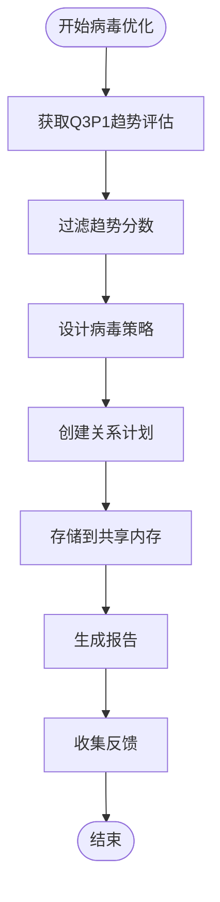

**图表来源**
- [p2_agents.py](file://open_notebook/open_notebook/skills/p2_agents.py#L671-L737)

病毒优化策略包括：
- **钩子设计**：模式中断、好奇心缺口
- **分享性工程**：社交货币、实用价值
- **分发时机**：最佳发布时间窗口
- **跨平台适配**：格式优化

### Q4P2影响力网络

Q4P2影响力网络专注于通过关键连接扩大影响力：

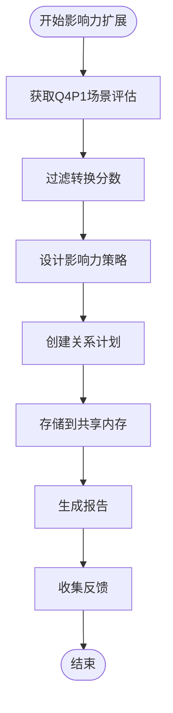

**图表来源**
- [p2_agents.py](file://open_notebook/open_notebook/skills/p2_agents.py#L837-L903)

影响力扩展策略包括：
- **关键人物识别**：影响者、连接者
- **合作机会**：客座出现、共同创作
- **合作伙伴关系**：战略合作联盟
- **推荐计划**：激励分享机制

**章节来源**
- [p2_relationship_layer.py](file://open_notebook/skills/living/p2_relationship_layer.py#L37-L83)
- [p2_agents.py](file://open_notebook/open_notebook/skills/p2_agents.py#L37-L106)

## 依赖关系分析

P2关系层的依赖关系体现了活体知识系统的模块化设计：

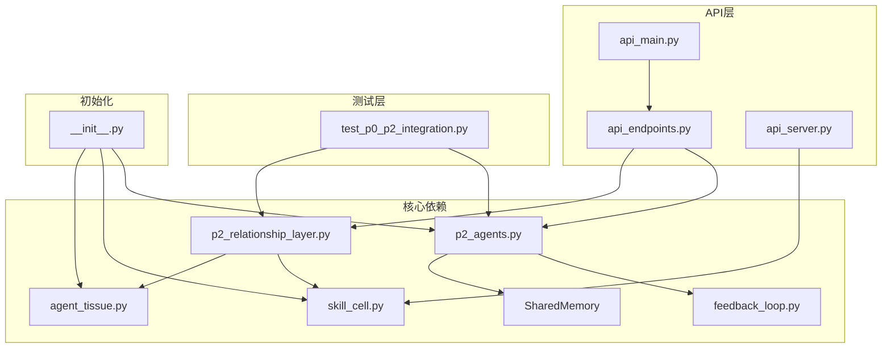

**图表来源**
- [p2_relationship_layer.py](file://open_notebook/skills/living/p2_relationship_layer.py#L21-L22)
- [p2_agents.py](file://open_notebook/open_notebook/skills/p2_agents.py#L20-L35)
- [api_endpoints.py](file://open_notebook/skills/living/api_endpoints.py#L18-L27)
- [__init__.py](file://open_notebook/skills/living/__init__.py#L11-L49)

**章节来源**
- [__init__.py](file://open_notebook/skills/living/__init__.py#L1-L88)

## 性能考虑

P2关系层在设计时充分考虑了性能优化：

### 异步执行
所有关系技能都采用异步执行模式，支持并发处理多个技能：

```python
# 并行执行四个关系技能
execution_result = await self.execute(context)
```

### 缓存机制
- **实体提取缓存**：避免重复的实体识别
- **相似度计算缓存**：缓存中间结果减少重复计算
- **时间窗口缓存**：缓存时间邻近关系

### 内存管理
- **增量图构建**：只在需要时扩展知识图谱
- **智能去重**：自动去除重复的关系和节点
- **垃圾回收**：定期清理无用的临时数据

### 扩展性设计
- **插件化架构**：支持添加新的关系技能
- **可配置阈值**：允许调整相似度和置信度阈值
- **动态加载**：按需加载和卸载技能

### 代理系统性能优化
- **共享内存**：P2代理使用共享内存存储关系计划
- **反馈循环**：自动学习和优化关系构建策略
- **批量处理**：支持批量执行多个代理计划

## 故障排除指南

### 常见问题及解决方案

#### 1. API端点无法访问
**症状**：客户端无法访问P2关系层API
**原因**：
- 服务器未启动
- 端口被占用
- CORS配置问题

**解决方案**：
```bash
# 启动API服务器
uvicorn open_notebook.skills.living.api_main:app --host 0.0.0.0 --port 8000

# 检查端口占用
netstat -ano | findstr :8000
```

#### 2. 关系分析结果不准确
**症状**：实体链接或聚类结果不符合预期
**原因**：
- 文本预处理不足
- 相似度阈值设置不当
- 缺少训练数据

**解决方案**：
```python
# 调整相似度阈值
semantic_cluster_skill.similarity_threshold = 0.7

# 增加实体模式
entity_linker_skill.entity_patterns["custom"] = r"(?:自定义模式)"
```

#### 3. 代理系统执行失败
**症状**：P2代理无法执行关系构建计划
**原因**：
- 共享内存不可用
- 反馈循环配置错误
- 代理参数设置不当

**解决方案**：
```python
# 检查共享内存状态
shared_memory.check_health()

# 调整代理参数
trust_builder_agent.min_priority = "critical"
trust_builder_agent.trust_sequence_length = 5

# 重新初始化反馈循环
feedback_orchestrator = FeedbackLoopOrchestrator()
```

#### 4. 性能问题
**症状**：API响应缓慢
**原因**：
- 大量并发请求
- 复杂的图查询
- 内存泄漏

**解决方案**：
```python
# 实施请求限制
@app.middleware("http")
async def rate_limit_middleware(request, call_next):
    # 实现速率限制逻辑
    pass

# 优化图查询
def get_subgraph_optimized(node_ids):
    # 使用索引优化查询
    pass
```

**章节来源**
- [api_endpoints.py](file://open_notebook/skills.living/api_endpoints.py#L533-L546)

## 结论

P2关系层作为活体知识系统的重要组成部分，成功实现了以下目标：

### 主要成就
1. **双重架构设计**：同时支持知识图谱构建和社交关系代理
2. **生物启发式设计**：完全采用生物体组织器官的概念设计
3. **模块化架构**：四个专门的关系技能各司其职，协同工作
4. **知识图谱构建**：提供了完整的知识关系发现和建模能力
5. **社交网络分析**：实现了基于四象限的信任建立和关系维护
6. **反馈循环系统**：建立了自动学习和优化机制
7. **API友好**：提供了清晰的REST API接口
8. **可扩展性**：支持添加新的关系技能和优化现有算法

### 技术特色
- **异步处理**：充分利用现代Python的异步特性
- **智能缓存**：减少重复计算，提高响应速度
- **灵活配置**：支持运行时调整各种参数
- **错误处理**：完善的异常处理和恢复机制
- **学习能力**：通过反馈循环持续改进关系构建策略

### 未来发展方向
1. **机器学习集成**：引入更先进的NLP模型
2. **实时更新**：支持知识图谱和关系网络的实时更新
3. **可视化界面**：提供知识图谱和社交网络的可视化展示
4. **API增强**：扩展更多的查询和操作接口
5. **智能推荐**：基于关系分析提供个性化内容推荐
6. **影响力预测**：预测关系扩展的效果和成功率

P2关系层为整个活体知识系统奠定了坚实的基础，使其能够从简单的数据存储发展为具有智能关系发现能力和社交网络分析的完整知识管理系统。