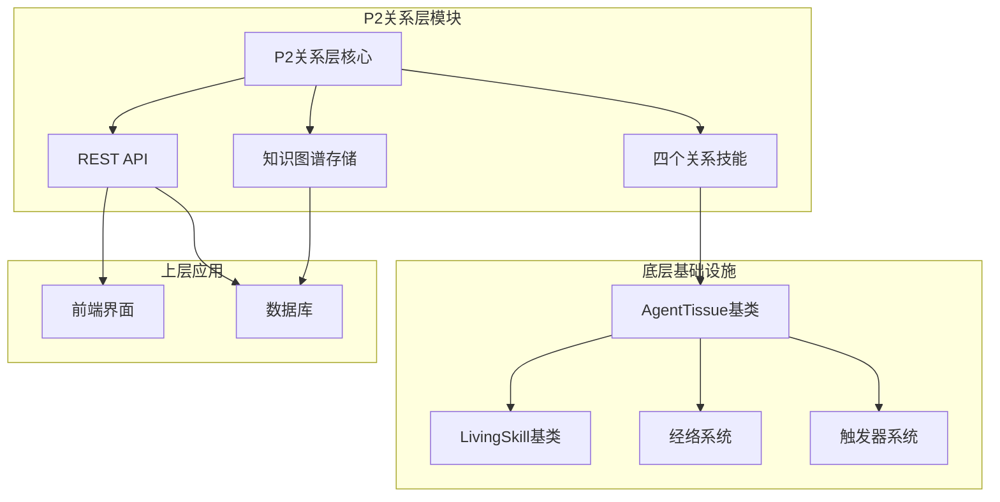
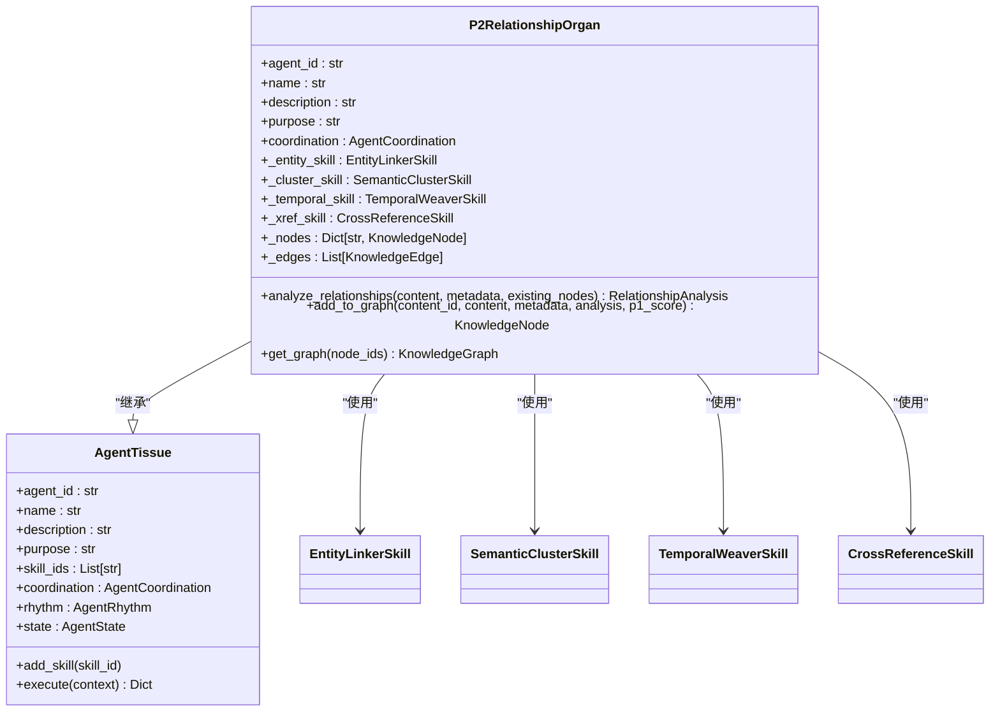
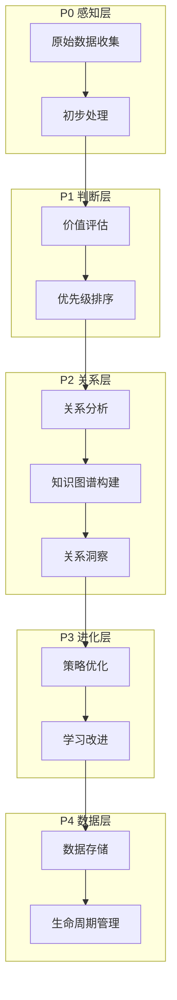
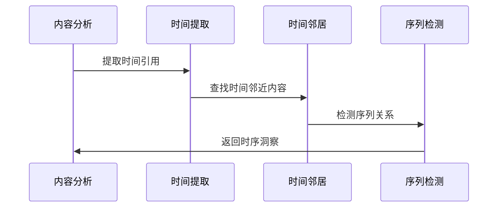
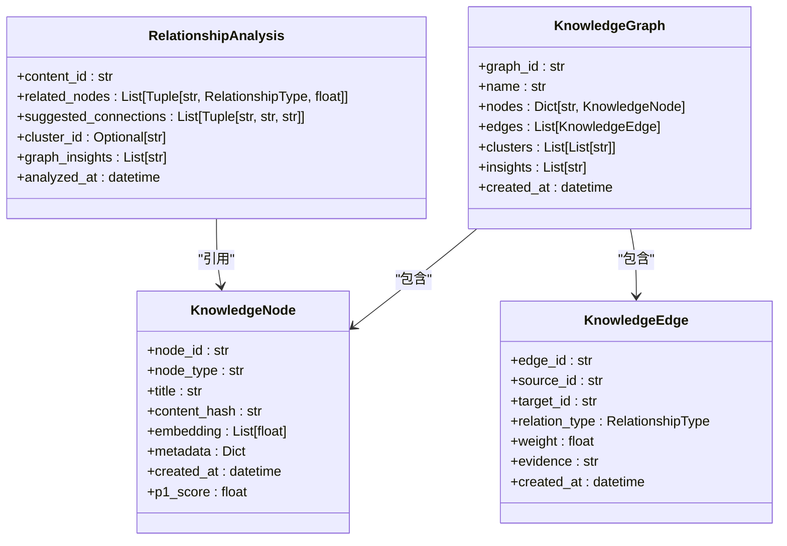
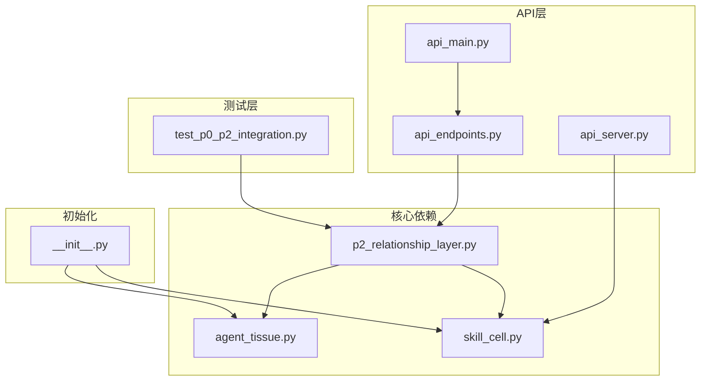

# P2关系层

<cite>
**本文档中引用的文件**
- [p2_relationship_layer.py](file://open_notebook/skills/living/p2_relationship_layer.py)
- [api_endpoints.py](file://open_notebook/skills/living/api_endpoints.py)
- [api_main.py](file://open_notebook/skills/living/api_main.py)
- [api_server.py](file://open_notebook/skills/living/api_server.py)
- [agent_tissue.py](file://open_notebook/skills/living/agent_tissue.py)
- [skill_cell.py](file://open_notebook/skills/living/skill_cell.py)
- [__init__.py](file://open_notebook/skills/living/__init__.py)
- [test_p0_p2_integration.py](file://open_notebook/skills/living/tests/test_p0_p2_integration.py)
</cite>

## 目录
1. [简介](#简介)
2. [项目结构](#项目结构)
3. [核心组件](#核心组件)
4. [架构概览](#架构概览)
5. [详细组件分析](#详细组件分析)
6. [依赖关系分析](#依赖关系分析)
7. [性能考虑](#性能考虑)
8. [故障排除指南](#故障排除指南)
9. [结论](#结论)

## 简介

P2关系层是活体知识系统的第五层架构，负责构建和维护知识图谱，发现知识节点之间的复杂关系。该层采用生物启发式设计，模拟生物体中组织器官的功能，通过四个专门的关系技能来实现全面的知识关系分析。

该系统的核心理念是将知识视为活体有机体，其中：
- **技能细胞 (Skill Cells)**：基本功能单元
- **组织 (Agents)**：协作的技能集合
- **器官 (Organs)**：复杂的功能性单元
- **经络 (Meridians)**：数据/控制/时间连接
- **穴位 (Triggers)**：外部接入点

## 项目结构

P2关系层位于活体知识系统的核心位置，采用模块化设计：



**图表来源**
- [p2_relationship_layer.py](file://open_notebook/skills/living/p2_relationship_layer.py#L1-L924)
- [agent_tissue.py](file://open_notebook/skills/living/agent_tissue.py#L1-L489)
- [skill_cell.py](file://open_notebook/skills/living/skill_cell.py#L1-L474)

**章节来源**
- [p2_relationship_layer.py](file://open_notebook/skills/living/p2_relationship_layer.py#L1-L924)
- [api_endpoints.py](file://open_notebook/skills/living/api_endpoints.py#L1-L566)

## 核心组件

### P2关系器官 (P2RelationshipOrgan)

P2关系器官是整个关系层的核心协调者，负责管理四个专门的关系技能：



**图表来源**
- [p2_relationship_layer.py](file://open_notebook/skills/living/p2_relationship_layer.py#L628-L821)
- [agent_tissue.py](file://open_notebook/skills/living/agent_tissue.py#L127-L200)

### 四个关系技能

P2关系层包含四个专门的关系技能，每个技能都有特定的功能：

1. **实体链接器 (Entity Linker)**：提取和链接知识实体
2. **语义聚类器 (Semantic Cluster)**：基于语义相似度聚类知识
3. **时序编织器 (Temporal Weaver)**：发现时间关系
4. **交叉引用映射器 (Cross-Reference Mapper)**：构建引用网络

**章节来源**
- [p2_relationship_layer.py](file://open_notebook/skills/living/p2_relationship_layer.py#L85-L924)

## 架构概览

P2关系层采用分层架构设计，体现了活体知识系统的生物学启发：



**图表来源**
- [api_endpoints.py](file://open_notebook/skills/living/api_endpoints.py#L176-L565)

## 详细组件分析

### 实体链接器 (EntityLinkerSkill)

实体链接器负责从内容中提取关键实体，并将其链接到现有知识库：


**图表来源**
- [p2_relationship_layer.py](file://open_notebook/skills/living/p2_relationship_layer.py#L108-L191)

实体链接器使用多种模式来识别不同类型的实体：
- **概念定义**：识别"什么是..."、"定义为..."等模式
- **强调术语**：识别引号或括号中的术语
- **专有名词**：识别可能的人员、组织名称

### 语义聚类器 (SemanticClusterSkill)

语义聚类器基于多种相似度指标对知识节点进行聚类：


**图表来源**
- [p2_relationship_layer.py](file://open_notebook/skills/living/p2_relationship_layer.py#L212-L334)

聚类算法采用层次聚类方法，通过以下相似度指标：
- **标题相似度**：基于词重叠的文本相似度
- **内容相似度**：基于内容片段的相似度
- **标签相似度**：基于共享标签的Jaccard相似度

### 时序编织器 (TemporalWeaverSkill)

时序编织器发现内容之间的时间关系：



**图表来源**
- [p2_relationship_layer.py](file://open_notebook/skills/living/p2_relationship_layer.py#L355-L498)

时序编织器支持多种时间模式：
- **绝对时间**：年份、日期格式
- **相对时间**：之前、以后、当时等
- **时间窗口**：基于创建时间的邻近关系

### 交叉引用映射器 (CrossReferenceSkill)

交叉引用映射器构建内容之间的引用网络：


**图表来源**
- [p2_relationship_layer.py](file://open_notebook/skills/living/p2_relationship_layer.py#L519-L625)

交叉引用包括：
- **显式引用**：直接的引用标记
- **隐式引用**：基于内容相似度的间接关联
- **相关建议**：基于标签共享的内容推荐

### 知识图谱数据结构

P2关系层使用统一的数据结构来表示知识图谱：



**图表来源**
- [p2_relationship_layer.py](file://open_notebook/skills/living/p2_relationship_layer.py#L37-L83)

**章节来源**
- [p2_relationship_layer.py](file://open_notebook/skills/living/p2_relationship_layer.py#L37-L83)

## 依赖关系分析

P2关系层的依赖关系体现了活体知识系统的模块化设计：



**图表来源**
- [p2_relationship_layer.py](file://open_notebook/skills/living/p2_relationship_layer.py#L21-L22)
- [api_endpoints.py](file://open_notebook/skills/living/api_endpoints.py#L18-L27)
- [__init__.py](file://open_notebook/skills/living/__init__.py#L11-L49)

**章节来源**
- [__init__.py](file://open_notebook/skills/living/__init__.py#L1-L88)

## 性能考虑

P2关系层在设计时充分考虑了性能优化：

### 异步执行
所有关系技能都采用异步执行模式，支持并发处理多个技能：

```python
# 并行执行四个关系技能
execution_result = await self.execute(context)
```

### 缓存机制
- **实体提取缓存**：避免重复的实体识别
- **相似度计算缓存**：缓存中间结果减少重复计算
- **时间窗口缓存**：缓存时间邻近关系

### 内存管理
- **增量图构建**：只在需要时扩展知识图谱
- **智能去重**：自动去除重复的关系和节点
- **垃圾回收**：定期清理无用的临时数据

### 扩展性设计
- **插件化架构**：支持添加新的关系技能
- **可配置阈值**：允许调整相似度和置信度阈值
- **动态加载**：按需加载和卸载技能

## 故障排除指南

### 常见问题及解决方案

#### 1. API端点无法访问
**症状**：客户端无法访问P2关系层API
**原因**：
- 服务器未启动
- 端口被占用
- CORS配置问题

**解决方案**：
```bash
# 启动API服务器
uvicorn open_notebook.skills.living.api_main:app --host 0.0.0.0 --port 8000

# 检查端口占用
netstat -ano | findstr :8000
```

#### 2. 关系分析结果不准确
**症状**：实体链接或聚类结果不符合预期
**原因**：
- 文本预处理不足
- 相似度阈值设置不当
- 缺少训练数据

**解决方案**：
```python
# 调整相似度阈值
semantic_cluster_skill.similarity_threshold = 0.7

# 增加实体模式
entity_linker_skill.entity_patterns["custom"] = r"(?:自定义模式)"
```

#### 3. 性能问题
**症状**：API响应缓慢
**原因**：
- 大量并发请求
- 复杂的图查询
- 内存泄漏

**解决方案**：
```python
# 实施请求限制
@app.middleware("http")
async def rate_limit_middleware(request, call_next):
    # 实现速率限制逻辑
    pass

# 优化图查询
def get_subgraph_optimized(node_ids):
    # 使用索引优化查询
    pass
```

**章节来源**
- [api_endpoints.py](file://open_notebook/skills/living/api_endpoints.py#L533-L546)

## 结论

P2关系层作为活体知识系统的重要组成部分，成功实现了以下目标：

### 主要成就
1. **生物启发式设计**：完全采用生物体组织器官的概念设计
2. **模块化架构**：四个专门的关系技能各司其职，协同工作
3. **知识图谱构建**：提供了完整的知识关系发现和建模能力
4. **API友好**：提供了清晰的REST API接口
5. **可扩展性**：支持添加新的关系技能和优化现有算法

### 技术特色
- **异步处理**：充分利用现代Python的异步特性
- **智能缓存**：减少重复计算，提高响应速度
- **灵活配置**：支持运行时调整各种参数
- **错误处理**：完善的异常处理和恢复机制

### 未来发展方向
1. **机器学习集成**：引入更先进的NLP模型
2. **实时更新**：支持知识图谱的实时更新
3. **可视化界面**：提供知识图谱的可视化展示
4. **API增强**：扩展更多的查询和操作接口

P2关系层为整个活体知识系统奠定了坚实的基础，使其能够从简单的数据存储发展为具有智能关系发现能力的知识管理系统。