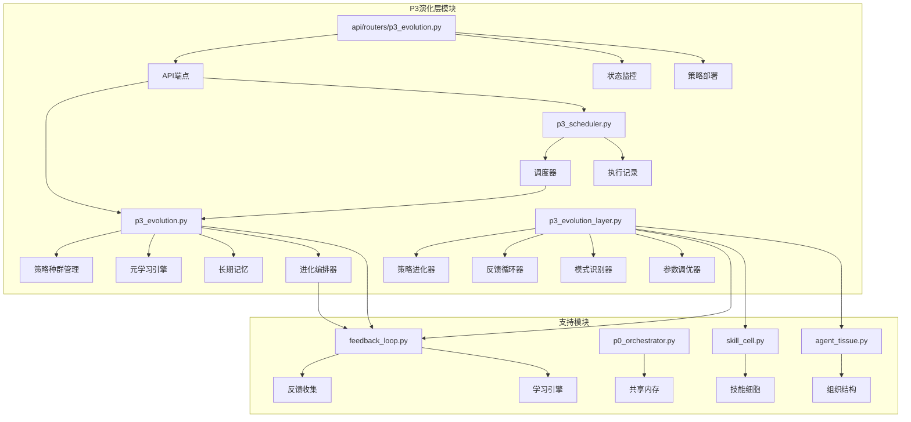
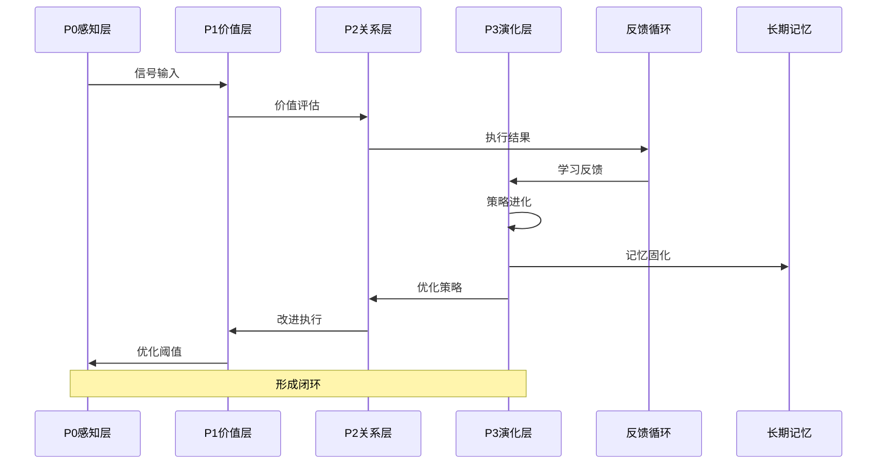
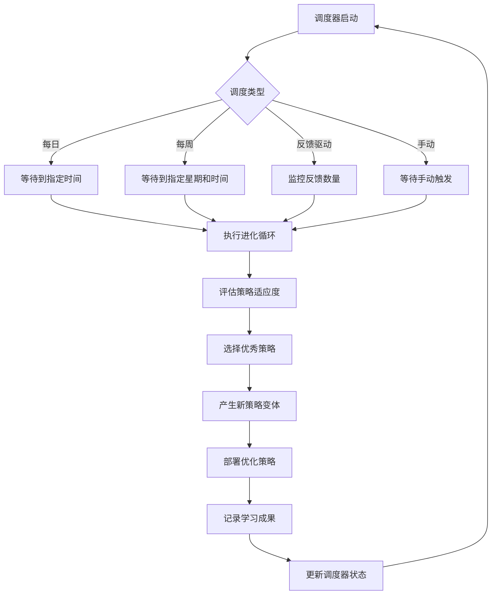
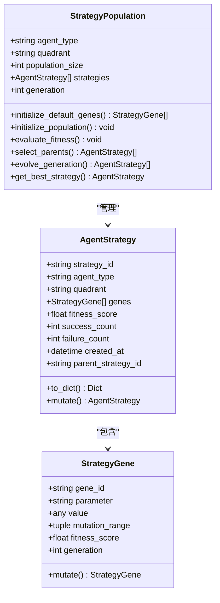
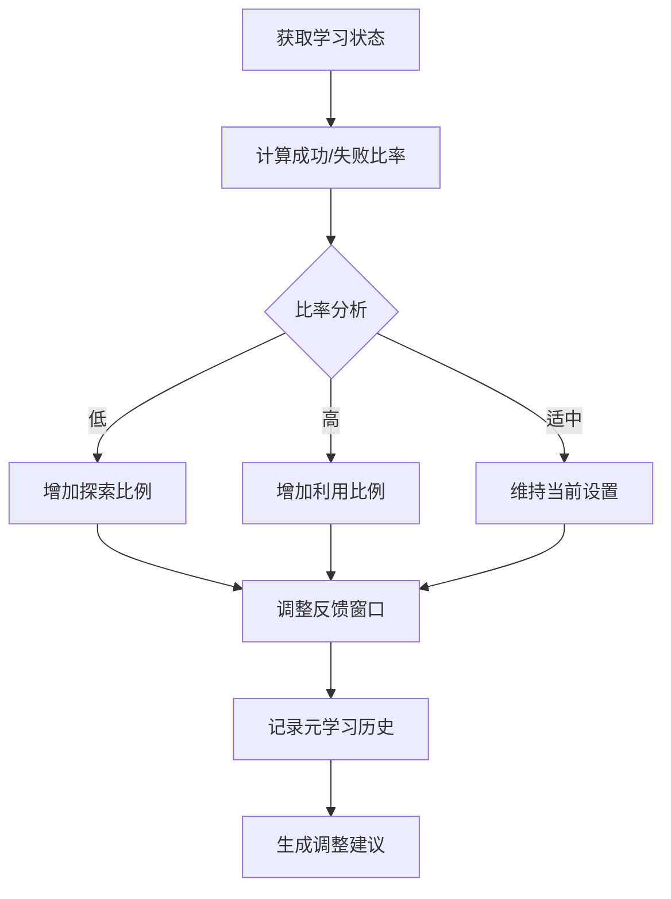
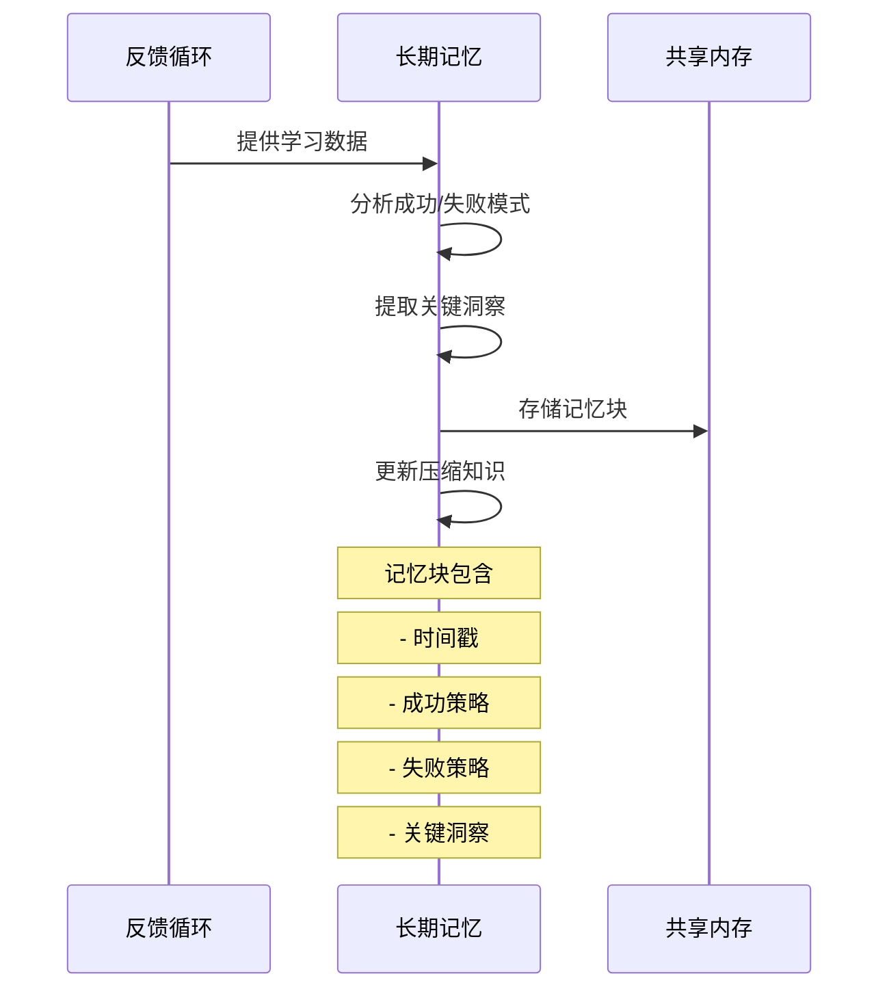
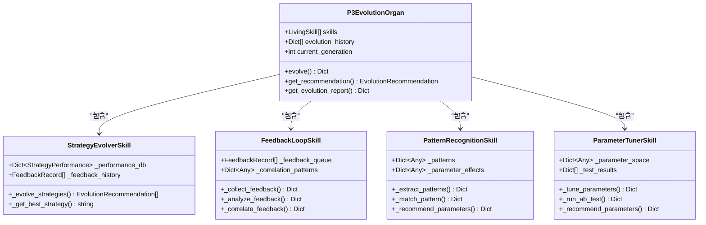
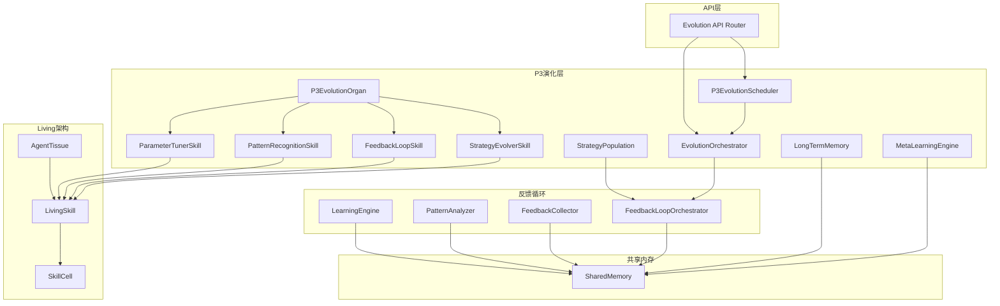

# P3演化层

<cite>
**本文档引用的文件**
- [p3_evolution.py](file://open_notebook/skills/p3_evolution.py)
- [p3_evolution_layer.py](file://open_notebook/skills/living/p3_evolution_layer.py)
- [p3_scheduler.py](file://open_notebook/skills/p3_scheduler.py)
- [p3_evolution.py](file://api/routers/p3_evolution.py)
- [feedback_loop.py](file://open_notebook/skills/feedback_loop.py)
- [p0_orchestrator.py](file://open_notebook/skills/p0_orchestrator.py)
- [P3_进化层_实现完成_20260214_224000.md](file://yuanbao/P3_进化层_实现完成_20260214_224000.md)
- [skill_cell.py](file://open_notebook/skills/living/skill_cell.py)
- [agent_tissue.py](file://open_notebook/skills/living/agent_tissue.py)
</cite>

## 更新摘要
**所做更改**
- 新增了基于Living架构的P3演化层实现分析
- 添加了认知学习和适应性进化的新组件
- 更新了四维演化技能的详细说明
- 增强了适应性进化的技术实现描述

## 目录
1. [简介](#简介)
2. [项目结构](#项目结构)
3. [核心组件](#核心组件)
4. [架构概览](#架构概览)
5. [详细组件分析](#详细组件分析)
6. [认知学习与适应性进化](#认知学习与适应性进化)
7. [依赖关系分析](#依赖关系分析)
8. [性能考虑](#性能考虑)
9. [故障排除指南](#故障排除指南)
10. [结论](#结论)

## 简介

P3演化层是OpenNotebook有机增长系统中的第四层，负责系统的自我进化和持续优化。该层实现了完整的反馈循环机制，通过遗传算法、元学习、长期记忆等技术，使系统能够自动学习和改进其策略和参数配置。

**更新** 新增了基于Living架构的认知学习和适应性进化实现，包括四维演化技能系统。

P3演化层的核心目标包括：
- **策略进化**：使用遗传算法优化代理策略
- **元学习**：学习如何更有效地学习
- **长期记忆**：跨会话的知识积累和压缩
- **自动部署**：将优化后的策略自动应用到系统中
- **认知学习**：通过反馈循环实现智能学习
- **适应性进化**：动态调整系统行为以适应环境变化

## 项目结构

P3演化层在代码库中的组织结构如下：

**图表来源**
- [p3_evolution.py](file://open_notebook/skills/p3_evolution.py#L1-L653)
- [p3_evolution_layer.py](file://open_notebook/skills/living/p3_evolution_layer.py#L1-L971)
- [p3_scheduler.py](file://open_notebook/skills/p3_scheduler.py#L1-L296)
- [skill_cell.py](file://open_notebook/skills/living/skill_cell.py#L1-L474)
- [agent_tissue.py](file://open_notebook/skills/living/agent_tissue.py#L1-L489)

**章节来源**
- [p3_evolution.py](file://open_notebook/skills/p3_evolution.py#L1-L50)
- [p3_evolution_layer.py](file://open_notebook/skills/living/p3_evolution_layer.py#L1-L20)

## 核心组件

### 1. 策略种群管理器（StrategyPopulation）

策略种群管理器是P3演化层的核心组件，负责管理不同代理类型的策略种群。每个代理类型都有独立的基因库，包含可配置的策略参数。

**更新** 新增了基于Living架构的策略进化器实现，支持更精细的策略管理和进化。

关键特性：
- **多代理支持**：支持8种不同的代理类型（PainScanner、EmotionWatcher、TrendHunter等）
- **基因系统**：每个策略由多个基因组成，代表不同的可配置参数
- **遗传算法**：实现选择、变异、交叉等操作
- **适应度评估**：基于成功率和失败率计算策略适应度
- **实时学习**：支持基于反馈的实时策略调整

### 2. 元学习引擎（MetaLearningEngine）

元学习引擎负责分析当前学习算法的效果，并动态调整学习参数。

**更新** 新增了基于反馈循环的元学习实现，支持自适应学习参数调整。

主要功能：
- **学习效果分析**：分析成功/失败比率、学习速度等指标
- **参数自适应调整**：根据分析结果调整探索/利用比例、反馈窗口等
- **学习历史记录**：记录每次元学习的调整和效果
- **智能参数优化**：动态调整学习速率、置信度阈值等关键参数

### 3. 长期记忆系统（LongTermMemory）

长期记忆系统负责跨会话的知识积累和压缩。

**更新** 新增了基于Living架构的长期记忆实现，支持更高效的跨会话学习。

核心能力：
- **记忆固化**：将短期反馈转化为长期记忆
- **模式提取**：从大量数据中提取关键洞察
- **知识压缩**：将复杂信息压缩为可操作的原则
- **跨会话访问**：提供历史数据的查询接口
- **智能检索**：支持基于上下文的相关记忆检索

### 4. 进化编排器（EvolutionOrchestrator）

进化编排器协调整个P3演化过程，管理多个策略种群的同步进化。

**更新** 新增了基于Living架构的四维演化技能系统，提供更精细的演化控制。

职责包括：
- **周期管理**：控制进化循环的执行时机
- **策略部署**：将优化后的策略应用到系统中
- **报告生成**：生成详细的进化报告和建议
- **状态监控**：跟踪系统整体演化状态
- **技能协调**：协调四个演化技能的协同工作

**章节来源**
- [p3_evolution.py](file://open_notebook/skills/p3_evolution.py#L196-L318)
- [p3_evolution.py](file://open_notebook/skills/p3_evolution.py#L320-L404)
- [p3_evolution.py](file://open_notebook/skills/p3_evolution.py#L406-L488)
- [p3_evolution.py](file://open_notebook/skills/p3_evolution.py#L490-L637)

## 架构概览

P3演化层采用分层架构设计，实现了完整的自我进化闭环：

**图表来源**
- [p3_evolution.py](file://open_notebook/skills/p3_evolution.py#L16-L23)
- [feedback_loop.py](file://open_notebook/skills/feedback_loop.py#L447-L496)

### 调度架构

P3演化层提供了灵活的调度机制，支持多种运行模式：

**图表来源**
- [p3_scheduler.py](file://open_notebook/skills/p3_scheduler.py#L116-L188)
- [p3_scheduler.py](file://open_notebook/skills/p3_scheduler.py#L189-L242)

**章节来源**
- [p3_scheduler.py](file://open_notebook/skills/p3_scheduler.py#L78-L141)

## 详细组件分析

### 策略种群管理系统

策略种群管理系统是P3演化层的基础，实现了完整的遗传算法框架：

#### 基因系统设计

**图表来源**
- [p3_evolution.py](file://open_notebook/skills/p3_evolution.py#L60-L140)
- [p3_evolution.py](file://open_notebook/skills/p3_evolution.py#L196-L318)

#### 遗传算法实现

策略种群管理器实现了标准的遗传算法流程：

1. **初始化**：为每个代理类型创建默认基因
2. **适应度评估**：基于成功率计算策略适应度
3. **选择**：使用锦标赛选择法选择优秀策略
4. **变异**：对父代策略进行基因变异
5. **精英保留**：保留最优秀的策略不参与变异

**章节来源**
- [p3_evolution.py](file://open_notebook/skills/p3_evolution.py#L238-L311)

### 元学习引擎

元学习引擎是P3演化层的智能核心，负责学习如何更有效地学习：

#### 学习效果分析

**图表来源**
- [p3_evolution.py](file://open_notebook/skills/p3_evolution.py#L333-L366)
- [p3_evolution.py](file://open_notebook/skills/p3_evolution.py#L368-L399)

#### 元参数调整机制

元学习引擎维护以下关键参数：
- **学习速率**：控制策略更新的速度
- **探索比例**：平衡探索新策略和利用已知策略
- **反馈窗口**：决定用于学习的历史数据范围
- **置信度阈值**：判断学习效果的标准

**章节来源**
- [p3_evolution.py](file://open_notebook/skills/p3_evolution.py#L320-L404)

### 长期记忆系统

长期记忆系统实现了跨会话的学习能力：

#### 记忆固化流程

**图表来源**
- [p3_evolution.py](file://open_notebook/skills/p3_evolution.py#L413-L445)
- [p3_evolution.py](file://open_notebook/skills/p3_evolution.py#L466-L487)

#### 知识压缩机制

长期记忆系统能够将大量的学习经验压缩为可操作的原则：

1. **模式识别**：从成功和失败的模式中识别共同特征
2. **原则提取**：形成通用的成功指导原则
3. **参数推荐**：提供针对特定场景的最佳参数设置
4. **知识存储**：将压缩后的知识保存到共享内存中

**章节来源**
- [p3_evolution.py](file://open_notebook/skills/p3_evolution.py#L406-L488)

### P3演化层（Living版本）

**新增** 在Living架构中，P3演化层采用了更加模块化的设计，实现了四维演化技能系统：

#### 四维演化技能

**图表来源**
- [p3_evolution_layer.py](file://open_notebook/skills/living/p3_evolution_layer.py#L694-L733)
- [p3_evolution_layer.py](file://open_notebook/skills/living/p3_evolution_layer.py#L73-L191)
- [p3_evolution_layer.py](file://open_notebook/skills/living/p3_evolution_layer.py#L193-L391)
- [p3_evolution_layer.py](file://open_notebook/skills/living/p3_evolution_layer.py#L393-L556)
- [p3_evolution_layer.py](file://open_notebook/skills/living/p3_evolution_layer.py#L558-L692)

#### 演化流程

Living版本的P3演化层实现了更加精细的演化流程：

1. **反馈收集**：收集执行结果和用户反馈
2. **策略演进**：基于性能数据识别最优策略
3. **模式提取**：从成功案例中提取可复用的模式
4. **参数推荐**：为不同任务类型推荐最优参数配置
5. **认知学习**：通过多维度技能协作实现智能学习
6. **适应性进化**：动态调整系统行为以适应环境变化

**章节来源**
- [p3_evolution_layer.py](file://open_notebook/skills/living/p3_evolution_layer.py#L735-L802)

## 认知学习与适应性进化

**新增** P3演化层的核心创新在于实现了认知学习和适应性进化机制：

### 认知学习机制

P3演化层通过四维演化技能系统实现了真正的认知学习：

#### 1. 策略进化器（StrategyEvolverSkill）
- **实时学习**：基于最新反馈数据实时调整策略
- **性能监控**：跟踪每个策略的使用次数、成功率、执行时间
- **智能推荐**：当检测到显著改进时自动推荐策略切换
- **趋势分析**：识别策略性能的改善趋势

#### 2. 反馈循环器（FeedbackLoopSkill）
- **自动反馈生成**：从执行结果中自动生成成功评分
- **多维度分析**：分析执行时间、资源使用、输出质量等指标
- **模式关联**：识别输入模式与成功结果之间的关联
- **批量处理**：支持大量反馈数据的高效处理

#### 3. 模式识别器（PatternRecognitionSkill）
- **特征提取**：从成功案例中提取共同特征
- **参数分析**：分析参数设置对成功的影响
- **模式匹配**：将新输入与历史模式进行匹配
- **智能推荐**：基于模式相似度推荐最佳参数

#### 4. 参数调优器（ParameterTunerSkill）
- **网格搜索**：系统性地测试参数组合
- **A/B测试**：比较不同配置的效果
- **启发式推荐**：基于任务类型提供参数建议
- **自适应调整**：根据学习结果动态调整搜索范围

### 适应性进化机制

P3演化层实现了多层次的适应性进化：

#### 1. 策略层面的适应
- **实时调整**：根据当前环境动态调整策略
- **学习迁移**：将学到的知识迁移到新场景
- **风险控制**：在探索新策略时控制风险

#### 2. 系统层面的适应
- **架构优化**：根据使用情况调整系统结构
- **资源配置**：动态分配计算资源
- **性能调优**：优化系统整体性能

#### 3. 学习层面的适应
- **元学习**：学习如何更好地学习
- **知识压缩**：将复杂知识简化为可操作原则
- **经验积累**：建立长期记忆和知识库

**章节来源**
- [p3_evolution_layer.py](file://open_notebook/skills/living/p3_evolution_layer.py#L73-L191)
- [p3_evolution_layer.py](file://open_notebook/skills/living/p3_evolution_layer.py#L193-L391)
- [p3_evolution_layer.py](file://open_notebook/skills/living/p3_evolution_layer.py#L393-L556)
- [p3_evolution_layer.py](file://open_notebook/skills/living/p3_evolution_layer.py#L558-L692)

## 依赖关系分析

P3演化层与其他系统组件的依赖关系如下：

**图表来源**
- [p3_evolution.py](file://open_notebook/skills/p3_evolution.py#L35-L41)
- [p3_evolution.py](file://open_notebook/skills/p3_evolution.py#L497-L498)
- [p3_scheduler.py](file://open_notebook/skills/p3_scheduler.py#L15-L21)
- [feedback_loop.py](file://open_notebook/skills/feedback_loop.py#L30-L31)
- [p3_evolution_layer.py](file://open_notebook/skills/living/p3_evolution_layer.py#L694-L733)

### 关键依赖说明

1. **反馈循环依赖**：P3演化层完全依赖于反馈循环系统提供的学习数据
2. **共享内存依赖**：所有组件都通过共享内存进行数据交换
3. **API依赖**：外部系统通过API接口控制和监控P3演化层
4. **调度依赖**：P3演化层需要调度器来控制执行时机
5. **Living架构依赖**：新的实现依赖于Living技能细胞和组织结构

**章节来源**
- [p3_evolution.py](file://open_notebook/skills/p3_evolution.py#L35-L41)
- [p3_scheduler.py](file://open_notebook/skills/p3_scheduler.py#L15-L21)
- [p3_evolution_layer.py](file://open_notebook/skills/living/p3_evolution_layer.py#L20-L22)

## 性能考虑

### 计算复杂度分析

P3演化层的性能特点：

1. **策略种群评估**：O(N × M)，其中N是种群大小，M是评估指标数量
2. **遗传算法**：每代操作复杂度为O(P × G)，其中P是策略数量，G是基因数量
3. **元学习分析**：O(K)，其中K是学习历史记录数量
4. **长期记忆压缩**：O(M × N)，其中M是记忆块数量，N是模式特征数
5. **Living技能协作**：O(S)，其中S是技能数量的线性复杂度

### 内存使用优化

1. **基因池管理**：定期清理低适应度策略，保持种群规模稳定
2. **学习历史限制**：限制元学习历史记录数量，避免内存泄漏
3. **记忆块轮转**：定期清理过期的记忆块，控制长期记忆大小
4. **缓存策略**：使用共享内存缓存频繁访问的数据
5. **技能状态管理**：优化Living技能的状态存储和访问

### 并发处理

P3演化层支持异步并发执行：
- **调度器并发**：多个调度任务可以同时运行
- **策略评估并发**：不同代理类型的策略可以并行评估
- **反馈处理并发**：反馈收集和分析可以异步进行
- **技能协作并发**：Living架构下的技能可以并行执行

## 故障排除指南

### 常见问题及解决方案

#### 1. 策略进化停滞

**症状**：策略适应度不再提升或提升缓慢

**可能原因**：
- 种群多样性不足
- 变异率过低
- 适应度函数设计不合理
- Feedback数据质量差

**解决方法**：
- 增加变异率或引入新的基因
- 调整适应度评估权重
- 引入外部干扰增加多样性
- 改善反馈数据收集质量

#### 2. 元学习参数不稳定

**症状**：元学习参数频繁大幅波动

**可能原因**：
- 学习数据不足
- 反馈窗口设置不当
- 探索/利用比例配置不合理
- 系统负载过高

**解决方法**：
- 增加学习数据收集量
- 调整反馈窗口大小
- 设置合理的参数调整幅度上限
- 优化系统性能和资源分配

#### 3. 长期记忆失效

**症状**：学习成果无法跨会话保留

**可能原因**：
- 共享内存配置错误
- TTL设置过短
- 记忆固化流程中断
- 内存泄漏

**解决方法**：
- 检查共享内存连接状态
- 增加记忆块的TTL时间
- 验证记忆固化流程的完整性
- 实施内存泄漏检测和修复

#### 4. 调度器异常

**症状**：进化周期无法按时执行

**可能原因**：
- 系统时间不同步
- 调度配置错误
- 任务队列阻塞
- 资源不足

**解决方法**：
- 同步系统时间
- 检查调度配置参数
- 清理阻塞的任务
- 增加系统资源

#### 5. Living技能协作失败

**症状**：四维演化技能无法正常协作

**可能原因**：
- 技能注册失败
- 协调配置错误
- 资源竞争
- 依赖缺失

**解决方法**：
- 检查技能注册状态
- 验证协调配置
- 实施资源隔离
- 确保依赖项完整

**章节来源**
- [p3_evolution.py](file://open_notebook/skills/p3_evolution.py#L522-L583)
- [p3_scheduler.py](file://open_notebook/skills/p3_scheduler.py#L116-L141)
- [p3_evolution_layer.py](file://open_notebook/skills/living/p3_evolution_layer.py#L873-L971)

## 结论

P3演化层是OpenNotebook有机增长系统的重要组成部分，它实现了系统的自我进化能力。通过策略种群管理、元学习、长期记忆和智能调度等机制，P3演化层使系统能够：

1. **自动优化**：系统能够自动发现和应用更好的策略
2. **持续学习**：通过反馈循环实现持续的知识积累
3. **智能适应**：根据环境变化动态调整系统行为
4. **高效部署**：将优化后的策略快速应用到生产环境中
5. **认知学习**：通过多维度技能协作实现真正的智能学习
6. **适应性进化**：动态调整系统结构和行为以适应新环境

**更新** 新的Living架构实现进一步增强了P3演化层的能力，通过四维演化技能系统实现了更精细的认知学习和适应性进化机制。这种设计不仅保持了原有功能的完整性，还增加了实时学习、智能推荐、模式识别等高级功能。

P3演化层的设计体现了有机系统的特征，即通过多层次的反馈和学习机制，实现系统的持续改进和自我完善。随着系统的不断运行和学习，P3演化层将变得越来越智能，能够处理更复杂的任务和场景，为用户提供更好的服务体验。

这种基于认知学习和适应性进化的演化系统为构建真正智能的自动化系统提供了重要的技术基础，标志着OpenNotebook系统向更高层次的智能化迈出了重要一步。