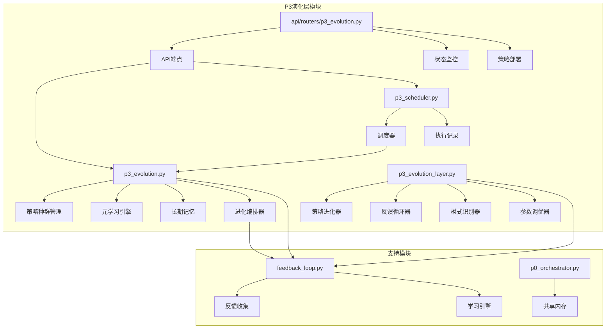
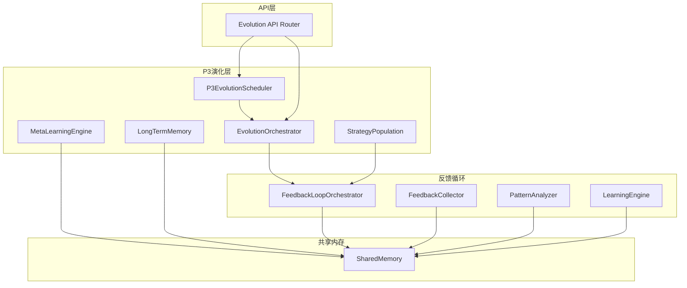

# P3演化层

<cite>
**本文档引用的文件**
- [p3_evolution.py](file://open_notebook/skills/p3_evolution.py)
- [p3_evolution_layer.py](file://open_notebook/skills/living/p3_evolution_layer.py)
- [p3_scheduler.py](file://open_notebook/skills/p3_scheduler.py)
- [p3_evolution.py](file://api/routers/p3_evolution.py)
- [feedback_loop.py](file://open_notebook/skills/feedback_loop.py)
- [p0_orchestrator.py](file://open_notebook/skills/p0_orchestrator.py)
- [P3_进化层_实现完成_20260214_224000.md](file://yuanbao/P3_进化层_实现完成_20260214_224000.md)
</cite>

## 目录
1. [简介](#简介)
2. [项目结构](#项目结构)
3. [核心组件](#核心组件)
4. [架构概览](#架构概览)
5. [详细组件分析](#详细组件分析)
6. [依赖关系分析](#依赖关系分析)
7. [性能考虑](#性能考虑)
8. [故障排除指南](#故障排除指南)
9. [结论](#结论)

## 简介

P3演化层是OpenNotebook有机增长系统中的第四层，负责系统的自我进化和持续优化。该层实现了完整的反馈循环机制，通过遗传算法、元学习、长期记忆等技术，使系统能够自动学习和改进其策略和参数配置。

P3演化层的核心目标包括：
- **策略进化**：使用遗传算法优化代理策略
- **元学习**：学习如何更有效地学习
- **长期记忆**：跨会话的知识积累和压缩
- **自动部署**：将优化后的策略自动应用到系统中

## 项目结构

P3演化层在代码库中的组织结构如下：

**图表来源**
- [p3_evolution.py](file://open_notebook/skills/p3_evolution.py#L1-L653)
- [p3_evolution_layer.py](file://open_notebook/skills/living/p3_evolution_layer.py#L1-L971)
- [p3_scheduler.py](file://open_notebook/skills/p3_scheduler.py#L1-L296)

**章节来源**
- [p3_evolution.py](file://open_notebook/skills/p3_evolution.py#L1-L50)
- [p3_evolution_layer.py](file://open_notebook/skills/living/p3_evolution_layer.py#L1-L20)

## 核心组件

### 1. 策略种群管理器（StrategyPopulation）

策略种群管理器是P3演化层的核心组件，负责管理不同代理类型的策略种群。每个代理类型都有独立的基因库，包含可配置的策略参数。

关键特性：
- **多代理支持**：支持8种不同的代理类型（PainScanner、EmotionWatcher、TrendHunter等）
- **基因系统**：每个策略由多个基因组成，代表不同的可配置参数
- **遗传算法**：实现选择、变异、交叉等操作
- **适应度评估**：基于成功率和失败率计算策略适应度

### 2. 元学习引擎（MetaLearningEngine）

元学习引擎负责分析当前学习算法的效果，并动态调整学习参数。

主要功能：
- **学习效果分析**：分析成功/失败比率、学习速度等指标
- **参数自适应调整**：根据分析结果调整探索/利用比例、反馈窗口等
- **学习历史记录**：记录每次元学习的调整和效果

### 3. 长期记忆系统（LongTermMemory）

长期记忆系统负责跨会话的知识积累和压缩。

核心能力：
- **记忆固化**：将短期反馈转化为长期记忆
- **模式提取**：从大量数据中提取关键洞察
- **知识压缩**：将复杂信息压缩为可操作的原则
- **跨会话访问**：提供历史数据的查询接口

### 4. 进化编排器（EvolutionOrchestrator）

进化编排器协调整个P3演化过程，管理多个策略种群的同步进化。

职责包括：
- **周期管理**：控制进化循环的执行时机
- **策略部署**：将优化后的策略应用到系统中
- **报告生成**：生成详细的进化报告和建议
- **状态监控**：跟踪系统整体演化状态

**章节来源**
- [p3_evolution.py](file://open_notebook/skills/p3_evolution.py#L196-L318)
- [p3_evolution.py](file://open_notebook/skills/p3_evolution.py#L320-L404)
- [p3_evolution.py](file://open_notebook/skills/p3_evolution.py#L406-L488)
- [p3_evolution.py](file://open_notebook/skills/p3_evolution.py#L490-L637)

## 架构概览

P3演化层采用分层架构设计，实现了完整的自我进化闭环：

**图表来源**
- [p3_evolution.py](file://open_notebook/skills/p3_evolution.py#L16-L23)
- [feedback_loop.py](file://open_notebook/skills/feedback_loop.py#L447-L496)

### 调度架构

P3演化层提供了灵活的调度机制，支持多种运行模式：

**图表来源**
- [p3_scheduler.py](file://open_notebook/skills/p3_scheduler.py#L116-L188)
- [p3_scheduler.py](file://open_notebook/skills/p3_scheduler.py#L189-L242)

**章节来源**
- [p3_scheduler.py](file://open_notebook/skills/p3_scheduler.py#L78-L141)

## 详细组件分析

### 策略种群管理系统

策略种群管理系统是P3演化层的基础，实现了完整的遗传算法框架：

#### 基因系统设计

**图表来源**
- [p3_evolution.py](file://open_notebook/skills/p3_evolution.py#L60-L140)
- [p3_evolution.py](file://open_notebook/skills/p3_evolution.py#L196-L318)

#### 遗传算法实现

策略种群管理器实现了标准的遗传算法流程：

1. **初始化**：为每个代理类型创建默认基因
2. **适应度评估**：基于成功率计算策略适应度
3. **选择**：使用锦标赛选择法选择优秀策略
4. **变异**：对父代策略进行基因变异
5. **精英保留**：保留最优秀的策略不参与变异

**章节来源**
- [p3_evolution.py](file://open_notebook/skills/p3_evolution.py#L238-L311)

### 元学习引擎

元学习引擎是P3演化层的智能核心，负责学习如何更有效地学习：

#### 学习效果分析

**图表来源**
- [p3_evolution.py](file://open_notebook/skills/p3_evolution.py#L333-L366)
- [p3_evolution.py](file://open_notebook/skills/p3_evolution.py#L368-L399)

#### 元参数调整机制

元学习引擎维护以下关键参数：
- **学习速率**：控制策略更新的速度
- **探索比例**：平衡探索新策略和利用已知策略
- **反馈窗口**：决定用于学习的历史数据范围
- **置信度阈值**：判断学习效果的标准

**章节来源**
- [p3_evolution.py](file://open_notebook/skills/p3_evolution.py#L320-L404)

### 长期记忆系统

长期记忆系统实现了跨会话的学习能力：

#### 记忆固化流程

**图表来源**
- [p3_evolution.py](file://open_notebook/skills/p3_evolution.py#L413-L445)
- [p3_evolution.py](file://open_notebook/skills/p3_evolution.py#L466-L487)

#### 知识压缩机制

长期记忆系统能够将大量的学习经验压缩为可操作的原则：

1. **模式识别**：从成功和失败的模式中识别共同特征
2. **原则提取**：形成通用的成功指导原则
3. **参数推荐**：提供针对特定场景的最佳参数设置
4. **知识存储**：将压缩后的知识保存到共享内存中

**章节来源**
- [p3_evolution.py](file://open_notebook/skills/p3_evolution.py#L406-L488)

### P3演化层（Living版本）

在Living架构中，P3演化层采用了更加模块化的设计：

#### 四维演化技能

**图表来源**
- [p3_evolution_layer.py](file://open_notebook/skills/living/p3_evolution_layer.py#L694-L733)
- [p3_evolution_layer.py](file://open_notebook/skills/living/p3_evolution_layer.py#L73-L191)
- [p3_evolution_layer.py](file://open_notebook/skills/living/p3_evolution_layer.py#L193-L391)
- [p3_evolution_layer.py](file://open_notebook/skills/living/p3_evolution_layer.py#L393-L556)
- [p3_evolution_layer.py](file://open_notebook/skills/living/p3_evolution_layer.py#L558-L692)

#### 演化流程

Living版本的P3演化层实现了更加精细的演化流程：

1. **反馈收集**：收集执行结果和用户反馈
2. **策略演进**：基于性能数据识别最优策略
3. **模式提取**：从成功案例中提取可复用的模式
4. **参数推荐**：为不同任务类型推荐最优参数配置

**章节来源**
- [p3_evolution_layer.py](file://open_notebook/skills/living/p3_evolution_layer.py#L735-L802)

## 依赖关系分析

P3演化层与其他系统组件的依赖关系如下：

**图表来源**
- [p3_evolution.py](file://open_notebook/skills/p3_evolution.py#L35-L41)
- [p3_evolution.py](file://open_notebook/skills/p3_evolution.py#L497-L498)
- [p3_scheduler.py](file://open_notebook/skills/p3_scheduler.py#L15-L21)
- [feedback_loop.py](file://open_notebook/skills/feedback_loop.py#L30-L31)

### 关键依赖说明

1. **反馈循环依赖**：P3演化层完全依赖于反馈循环系统提供的学习数据
2. **共享内存依赖**：所有组件都通过共享内存进行数据交换
3. **API依赖**：外部系统通过API接口控制和监控P3演化层
4. **调度依赖**：P3演化层需要调度器来控制执行时机

**章节来源**
- [p3_evolution.py](file://open_notebook/skills/p3_evolution.py#L35-L41)
- [p3_scheduler.py](file://open_notebook/skills/p3_scheduler.py#L15-L21)

## 性能考虑

### 计算复杂度分析

P3演化层的性能特点：

1. **策略种群评估**：O(N × M)，其中N是种群大小，M是评估指标数量
2. **遗传算法**：每代操作复杂度为O(P × G)，其中P是策略数量，G是基因数量
3. **元学习分析**：O(K)，其中K是学习历史记录数量
4. **长期记忆压缩**：O(M × N)，其中M是记忆块数量，N是模式特征数

### 内存使用优化

1. **基因池管理**：定期清理低适应度策略，保持种群规模稳定
2. **学习历史限制**：限制元学习历史记录数量，避免内存泄漏
3. **记忆块轮转**：定期清理过期的记忆块，控制长期记忆大小
4. **缓存策略**：使用共享内存缓存频繁访问的数据

### 并发处理

P3演化层支持异步并发执行：
- **调度器并发**：多个调度任务可以同时运行
- **策略评估并发**：不同代理类型的策略可以并行评估
- **反馈处理并发**：反馈收集和分析可以异步进行

## 故障排除指南

### 常见问题及解决方案

#### 1. 策略进化停滞

**症状**：策略适应度不再提升或提升缓慢

**可能原因**：
- 种群多样性不足
- 变异率过低
- 适应度函数设计不合理

**解决方法**：
- 增加变异率或引入新的基因
- 调整适应度评估权重
- 引入外部干扰增加多样性

#### 2. 元学习参数不稳定

**症状**：元学习参数频繁大幅波动

**可能原因**：
- 学习数据不足
- 反馈窗口设置不当
- 探索/利用比例配置不合理

**解决方法**：
- 增加学习数据收集量
- 调整反馈窗口大小
- 设置合理的参数调整幅度上限

#### 3. 长期记忆失效

**症状**：学习成果无法跨会话保留

**可能原因**：
- 共享内存配置错误
- TTL设置过短
- 记忆固化流程中断

**解决方法**：
- 检查共享内存连接状态
- 增加记忆块的TTL时间
- 验证记忆固化流程的完整性

#### 4. 调度器异常

**症状**：进化周期无法按时执行

**可能原因**：
- 系统时间不同步
- 调度配置错误
- 任务队列阻塞

**解决方法**：
- 同步系统时间
- 检查调度配置参数
- 清理阻塞的任务

**章节来源**
- [p3_evolution.py](file://open_notebook/skills/p3_evolution.py#L522-L583)
- [p3_scheduler.py](file://open_notebook/skills/p3_scheduler.py#L116-L141)

## 结论

P3演化层是OpenNotebook有机增长系统的重要组成部分，它实现了系统的自我进化能力。通过策略种群管理、元学习、长期记忆和智能调度等机制，P3演化层使系统能够：

1. **自动优化**：系统能够自动发现和应用更好的策略
2. **持续学习**：通过反馈循环实现持续的知识积累
3. **智能适应**：根据环境变化动态调整系统行为
4. **高效部署**：将优化后的策略快速应用到生产环境中

P3演化层的设计体现了有机系统的特征，即通过多层次的反馈和学习机制，实现系统的持续改进和自我完善。这种设计为构建真正智能的自动化系统提供了重要的技术基础。

随着系统的不断运行和学习，P3演化层将变得越来越智能，能够处理更复杂的任务和场景，为用户提供更好的服务体验。