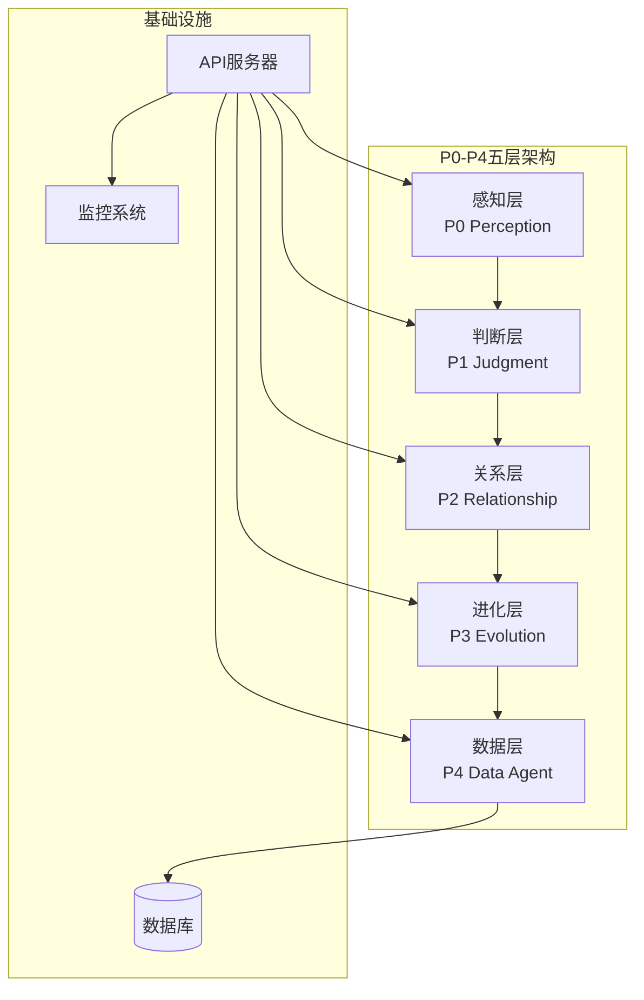
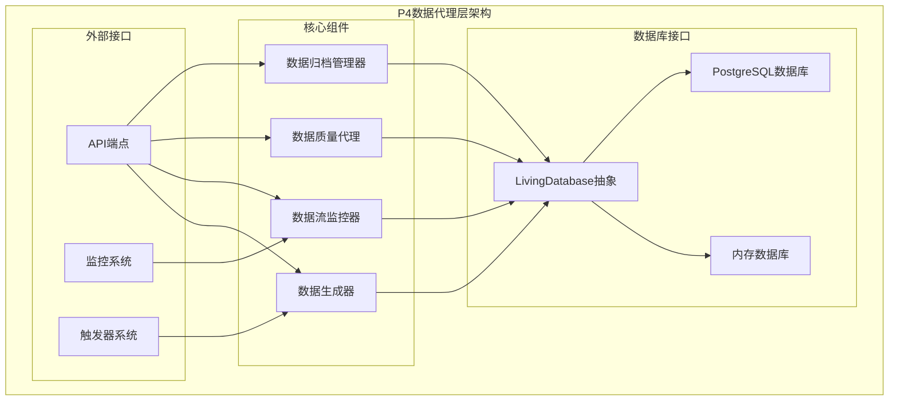
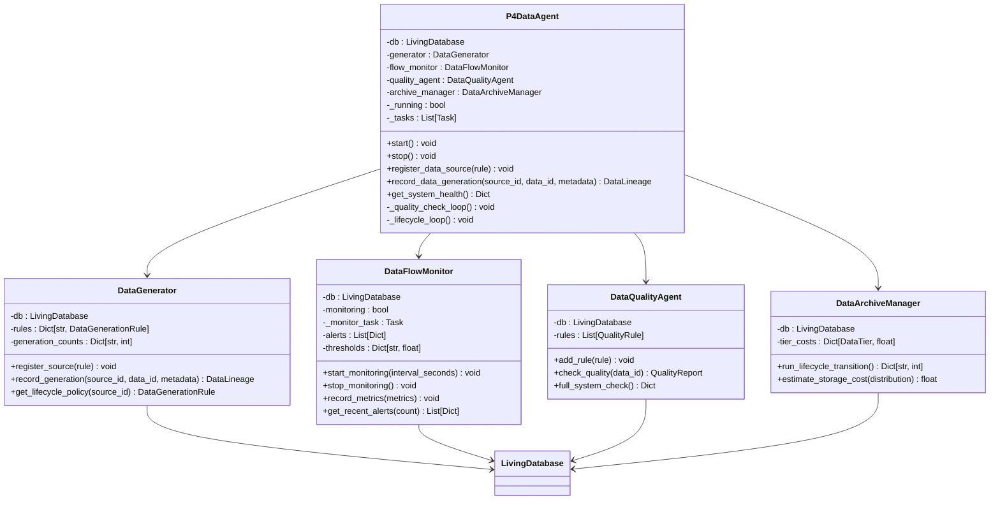
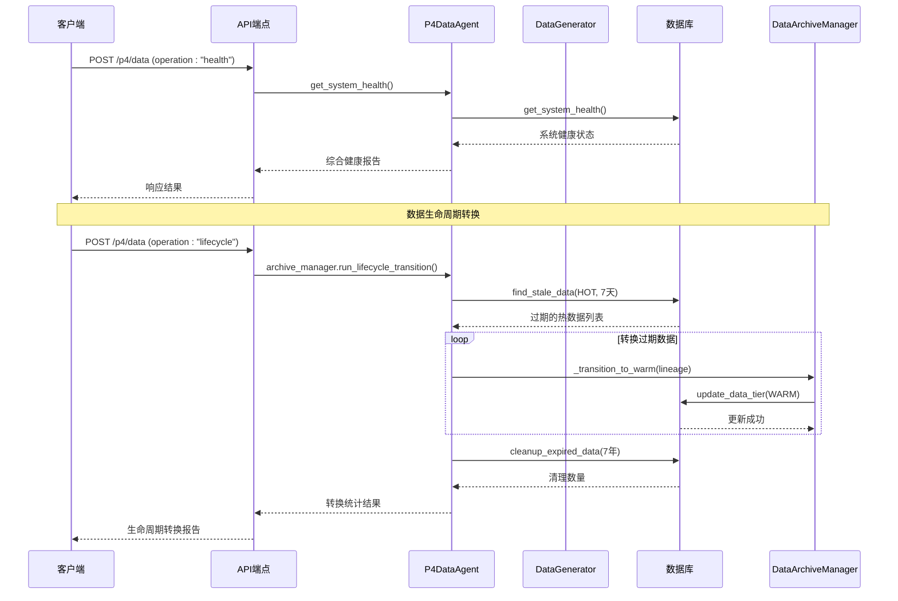
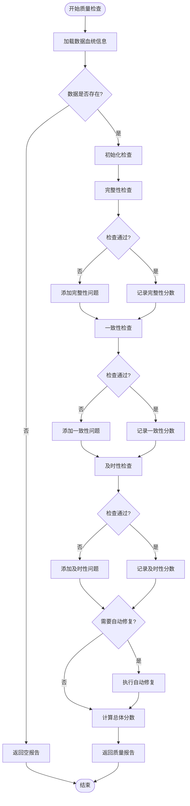
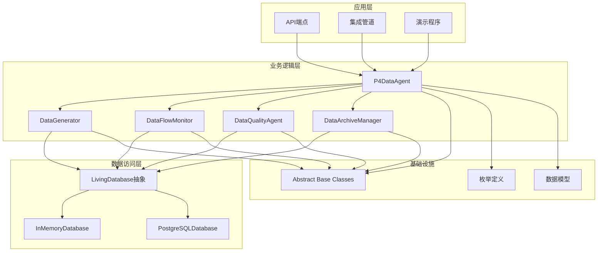

# P4数据代理层

<cite>
**本文档引用的文件**
- [p4_data_agent.py](file://open_notebook/skills/living/p4_data_agent.py)
- [p0_p4_integration.py](file://open_notebook/skills/living/p0_p4_integration.py)
- [api_endpoints.py](file://open_notebook/skills/living/api_endpoints.py)
- [api_server.py](file://open_notebook/skills/living/api_server.py)
- [api_postgres.py](file://open_notebook/skills/living/api_postgres.py)
- [abstract.py](file://open_notebook/skills/living/database/abstract.py)
- [memory.py](file://open_notebook/skills/living/database/memory.py)
- [postgresql.py](file://open_notebook/skills/living/database/postgresql.py)
- [skill_cell.py](file://open_notebook/skills/living/skill_cell.py)
- [agent_tissue.py](file://open_notebook/skills/living/agent_tissue.py)
</cite>

## 目录
1. [简介](#简介)
2. [项目结构](#项目结构)
3. [核心组件](#核心组件)
4. [架构概览](#架构概览)
5. [详细组件分析](#详细组件分析)
6. [依赖关系分析](#依赖关系分析)
7. [性能考虑](#性能考虑)
8. [故障排除指南](#故障排除指南)
9. [结论](#结论)

## 简介

P4数据代理层是OpenNotebook活体知识系统中的第五层，负责数据生命周期管理。它被设计为系统的"免疫系统"，承担着数据代谢、质量监控、容量管理和血统追踪等核心职责。

该层通过四个主要组件协同工作：数据生成器（DataGenerator）负责数据创建和血统追踪、数据流监控器（DataFlowMonitor）负责流量监控和告警、数据质量代理（DataQualityAgent）负责数据质量检查、数据归档管理器（DataArchiveManager）负责数据生命周期转换。

## 项目结构

OpenNotebook项目采用模块化的五层架构设计，每层都有明确的职责分工：

**图表来源**
- [p0_p4_integration.py](file://open_notebook/skills/living/p0_p4_integration.py#L349-L528)
- [api_server.py](file://open_notebook/skills/living/api_server.py#L119-L150)

**章节来源**
- [p0_p4_integration.py](file://open_notebook/skills/living/p0_p4_integration.py#L1-L12)
- [api_server.py](file://open_notebook/skills/living/api_server.py#L1-L11)

## 核心组件

P4数据代理层的核心由四个主要组件构成，每个组件都有特定的功能和职责：

### 数据生成器（DataGenerator）
负责管理所有数据生成源，注册数据生成规则，并记录数据生成事件。它维护数据源规则映射和生成计数器。

### 数据流监控器（DataFlowMonitor）
持续监控数据流通过经络的状态，设置阈值警告机制，记录性能指标并提供告警功能。

### 数据质量代理（DataQualityAgent）
执行数据质量检查，包括完整性、一致性、及时性和准确性检查，支持自动修复功能。

### 数据归档管理器（DataArchiveManager）
管理数据生命周期转换，包括热数据到温数据、温数据到冷数据、冷数据到冻结数据的转换过程。

**章节来源**
- [p4_data_agent.py](file://open_notebook/skills/living/p4_data_agent.py#L59-L383)

## 架构概览

P4数据代理层采用分层架构设计，确保各组件间的松耦合和高内聚：

**图表来源**
- [p4_data_agent.py](file://open_notebook/skills/living/p4_data_agent.py#L385-L493)
- [abstract.py](file://open_notebook/skills/living/database/abstract.py#L98-L257)

**章节来源**
- [p4_data_agent.py](file://open_notebook/skills/living/p4_data_agent.py#L385-L493)
- [abstract.py](file://open_notebook/skills/living/database/abstract.py#L1-L258)

## 详细组件分析

### P4DataAgent主控制器

P4DataAgent是数据代理层的主控制器，协调所有子组件的工作：

**图表来源**
- [p4_data_agent.py](file://open_notebook/skills/living/p4_data_agent.py#L25-L493)

**章节来源**
- [p4_data_agent.py](file://open_notebook/skills/living/p4_data_agent.py#L385-L493)

### 数据生命周期管理流程

数据生命周期管理是P4层的核心功能，涉及数据从创建到销毁的完整过程：

**图表来源**
- [p4_data_agent.py](file://open_notebook/skills/living/p4_data_agent.py#L314-L357)
- [api_endpoints.py](file://open_notebook/skills/living/api_endpoints.py#L380-L430)

**章节来源**
- [p4_data_agent.py](file://open_notebook/skills/living/p4_data_agent.py#L314-L357)
- [api_endpoints.py](file://open_notebook/skills/living/api_endpoints.py#L380-L430)

### 数据质量检查算法

数据质量检查是确保系统数据质量的重要机制：

**图表来源**
- [p4_data_agent.py](file://open_notebook/skills/living/p4_data_agent.py#L230-L265)

**章节来源**
- [p4_data_agent.py](file://open_notebook/skills/living/p4_data_agent.py#L230-L299)

### 数据存储层级架构

系统采用四层存储架构，优化成本和性能：

| 存储层级 | 用途 | 存储介质 | 压缩方式 | 成本系数 |
|---------|------|----------|----------|----------|
| HOT | 活跃数据 | SSD | 无压缩 | 3.0 |
| WARM | 不活跃数据 | SSD | LZ4 | 1.0 |
| COLD | 偶尔访问数据 | HDD | ZSTD | 0.3 |
| FROZEN | 归档数据 | 对象存储 | 高级压缩 | 0.12 |

**章节来源**
- [p4_data_agent.py](file://open_notebook/skills/living/p4_data_agent.py#L307-L382)

## 依赖关系分析

P4数据代理层的依赖关系体现了清晰的分层架构：

**图表来源**
- [p4_data_agent.py](file://open_notebook/skills/living/p4_data_agent.py#L17-L22)
- [abstract.py](file://open_notebook/skills/living/database/abstract.py#L1-L258)

**章节来源**
- [p4_data_agent.py](file://open_notebook/skills/living/p4_data_agent.py#L17-L22)
- [abstract.py](file://open_notebook/skills/living/database/abstract.py#L1-L258)

## 性能考虑

P4数据代理层在设计时充分考虑了性能优化：

### 异步操作设计
- 所有数据库操作都使用异步模式，提高并发处理能力
- 使用连接池管理数据库连接，减少连接开销
- 采用后台任务处理周期性检查，不阻塞主线程

### 缓存策略
- 内存数据库用于演示和测试，提供快速的数据访问
- PostgreSQL数据库支持缓存和索引优化
- 数据血统信息在内存中缓存，减少数据库查询

### 监控和告警
- 实时监控数据流指标，设置合理的阈值
- 提供详细的性能指标和健康状态报告
- 支持告警通知和历史记录

## 故障排除指南

### 常见问题诊断

**数据库连接问题**
- 检查PostgreSQL服务状态
- 验证连接参数配置
- 查看连接池状态和错误日志

**数据质量检查失败**
- 检查数据血统信息是否正确
- 验证数据格式和完整性
- 查看质量检查规则配置

**生命周期转换异常**
- 检查存储空间和配额
- 验证数据访问权限
- 查看转换过程中的错误日志

**章节来源**
- [api_server.py](file://open_notebook/skills/living/api_server.py#L185-L206)
- [api_postgres.py](file://open_notebook/skills/living/api_postgres.py#L133-L149)

## 结论

P4数据代理层作为OpenNotebook活体知识系统的核心组件，通过精心设计的架构实现了数据生命周期的自动化管理。其四大核心组件各司其职，形成了完整的数据管理体系。

该层的设计体现了以下优势：
- **模块化设计**：清晰的职责分离和接口定义
- **可扩展性**：支持多种数据库后端和存储策略
- **可观测性**：全面的监控和告警机制
- **可靠性**：异步处理和错误恢复机制

通过P4数据代理层，系统能够实现数据的智能管理，确保数据质量和系统性能，为上层的感知、判断、关系和进化功能提供坚实的数据基础。