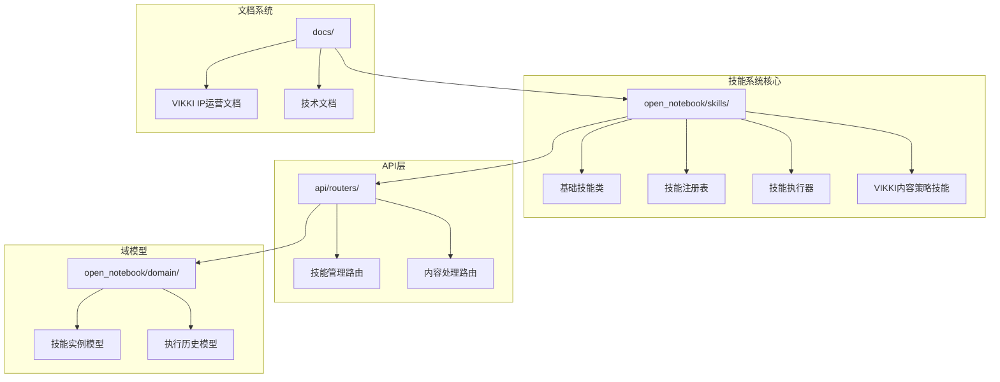
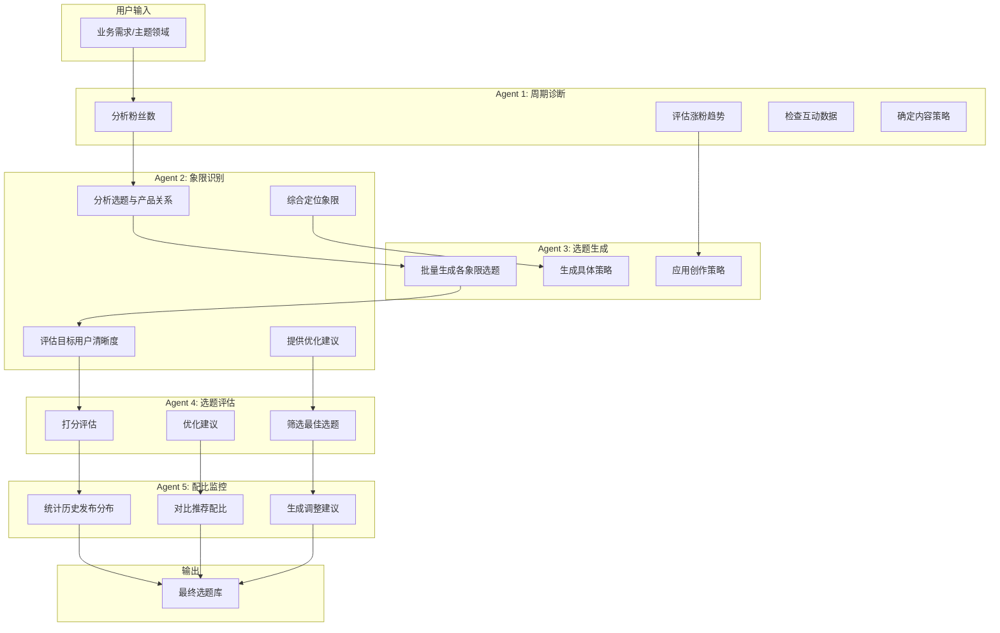
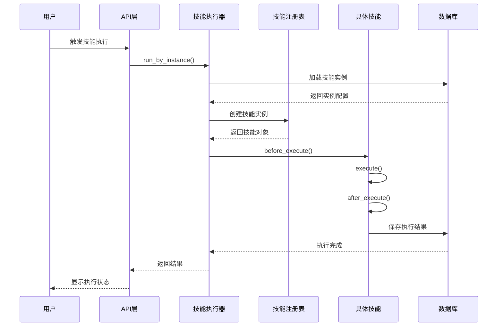
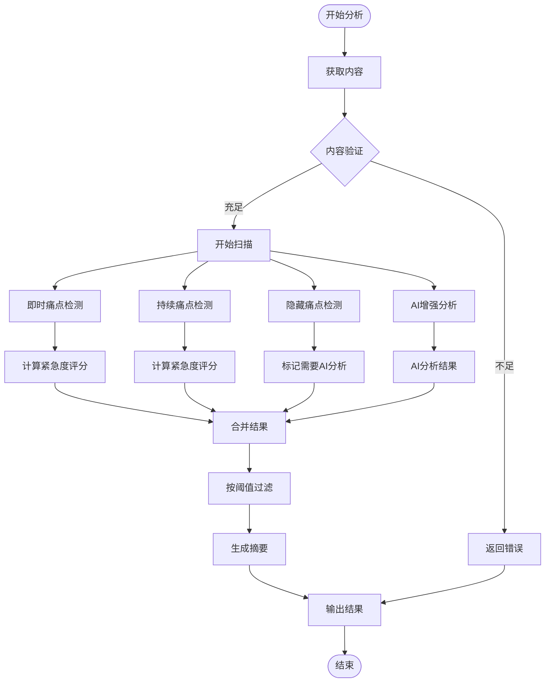
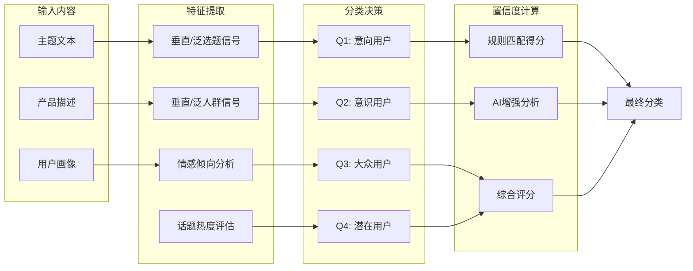
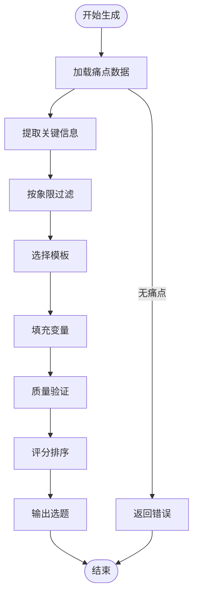
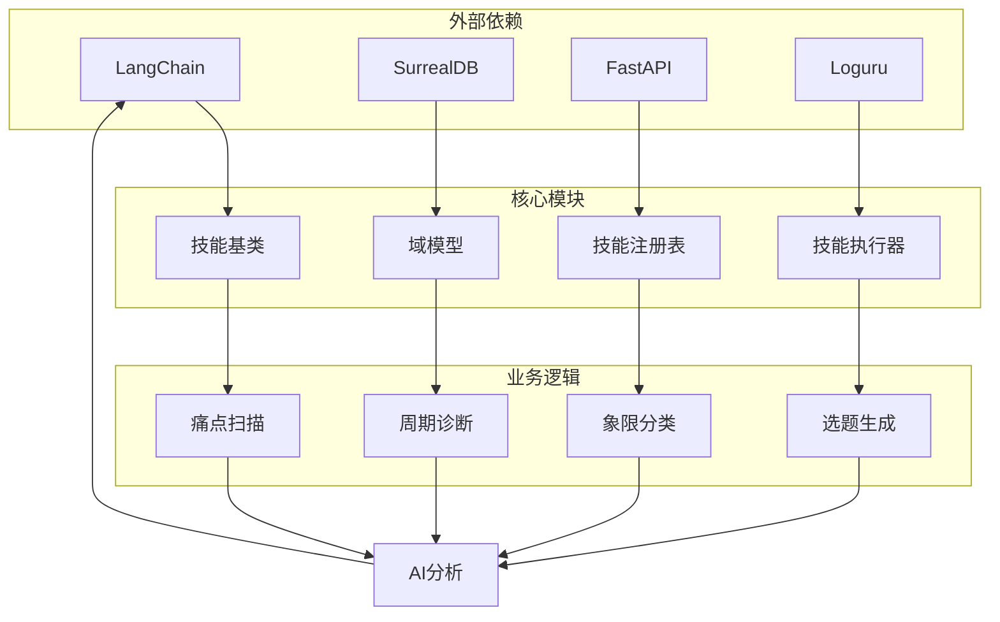
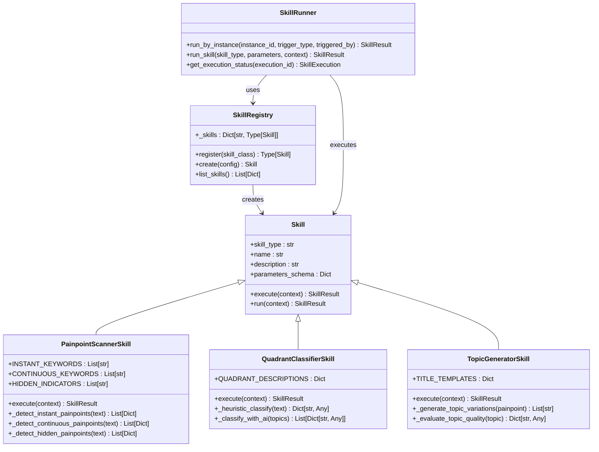

# Phase C多代理内容策略技能

<cite>
**本文档引用的文件**
- [open_notebook/skills/vikki_content_ops.py](file://open_notebook/skills/vikki_content_ops.py)
- [open_notebook/skills/base.py](file://open_notebook/skills/base.py)
- [open_notebook/skills/registry.py](file://open_notebook/skills/registry.py)
- [open_notebook/skills/runner.py](file://open_notebook/skills/runner.py)
- [open_notebook/domain/skill.py](file://open_notebook/domain/skill.py)
- [api/routers/skills.py](file://api/routers/skills.py)
- [open_notebook/skills/__init__.py](file://open_notebook/skills/__init__.py)
- [docs/vikki的IP运营/Skill化架构设计-可复用可共享.md](file://docs/vikki的IP运营/Skill化架构设计-可复用可共享.md)
- [docs/vikki的IP运营/行动纲领-VIKKI选题框架.md](file://docs/vikki的IP运营/行动纲领-VIKKI选题框架.md)
- [README.md](file://README.md)
- [docs/index.md](file://docs/index.md)
</cite>

## 目录
1. [简介](#简介)
2. [项目结构](#项目结构)
3. [核心组件](#核心组件)
4. [架构概览](#架构概览)
5. [详细组件分析](#详细组件分析)
6. [依赖关系分析](#依赖关系分析)
7. [性能考虑](#性能考虑)
8. [故障排除指南](#故障排除指南)
9. [结论](#结论)

## 简介

Phase C多代理内容策略技能是Open Notebook项目中的高级内容创作自动化系统，基于VIKKI IP运营方法论构建。该系统实现了四象限内容策略框架，通过多个专门的AI代理（Agent）协同工作，为内容创作者和OPC（一人公司）提供系统化的高ROI内容主题生成和管理能力。

该技能系统的核心理念是将复杂的内容策略分解为可组合、可复用的独立技能模块，每个技能专注于特定的功能领域，通过标准化的接口实现灵活的组合和调度。

## 项目结构

Open Notebook采用模块化的技能架构设计，主要目录结构如下：

**图表来源**
- [open_notebook/skills/__init__.py](file://open_notebook/skills/__init__.py#L16-L52)
- [api/routers/skills.py](file://api/routers/skills.py#L1-L200)

**章节来源**
- [open_notebook/skills/__init__.py](file://open_notebook/skills/__init__.py#L1-L53)
- [README.md](file://README.md#L1-L200)

## 核心组件

### 四象限内容策略框架

系统基于VIKKI四象限模型，将内容策略分为四个维度：

- **Q1（意向用户）**："你有问题，我有解决方案"（高转化）
- **Q2（意识用户）**："你知道这个领域，我来深化你的理解"（教育）
- **Q3（大众用户）**："你不知道你需要这个"（认知）
- **Q4（潜在用户）**："扩展使用场景"（发现）

### 痛点类型分类

系统支持三种痛点类型的识别和分析：

- **即时痛点**：紧急需要立即解决的问题
- **持续痛点**：长期存在的困扰和问题  
- **隐藏痛点**：用户未表达但真实存在的需求

**章节来源**
- [open_notebook/skills/vikki_content_ops.py](file://open_notebook/skills/vikki_content_ops.py#L1-L16)

## 架构概览

### 多代理协作架构

**图表来源**
- [docs/vikki的IP运营/行动纲领-VIKKI选题框架.md](file://docs/vikki的IP运营/行动纲领-VIKKI选题框架.md#L688-L744)

### 技能执行生命周期

**图表来源**
- [open_notebook/skills/runner.py](file://open_notebook/skills/runner.py#L41-L150)
- [open_notebook/skills/base.py](file://open_notebook/skills/base.py#L146-L183)

**章节来源**
- [open_notebook/skills/runner.py](file://open_notebook/skills/runner.py#L1-L250)
- [open_notebook/skills/base.py](file://open_notebook/skills/base.py#L83-L183)

## 详细组件分析

### PainpointScannerSkill（痛点扫描器）

痛点扫描器是内容策略系统的核心组件之一，负责识别和分析内容中的各种痛点类型。

#### 核心功能特性

- **多类型痛点检测**：支持即时、持续、隐藏三种痛点类型的自动识别
- **双模式分析**：结合规则匹配和AI增强分析，提高检测准确性
- **紧急度评分**：为每个识别的痛点提供紧急度评分
- **语境提取**：生成用户场景描述，帮助理解痛点背景

#### 痛点检测算法

**图表来源**
- [open_notebook/skills/vikki_content_ops.py](file://open_notebook/skills/vikki_content_ops.py#L318-L395)

#### 关键参数配置

| 参数名称 | 类型 | 默认值 | 描述 |
|---------|------|--------|------|
| source_ids | Array[String] | [] | 要分析的源ID列表 |
| note_ids | Array[String] | [] | 要分析的笔记ID列表 |
| text_content | String | "" | 直接分析的文本内容 |
| painpoint_types | Array[String] | ["instant","continuous","hidden"] | 检测的痛点类型 |
| min_urgency_score | Integer | 50 | 最低紧急度阈值 |
| max_painpoints | Integer | 10 | 每种类型的最大数量 |

**章节来源**
- [open_notebook/skills/vikki_content_ops.py](file://open_notebook/skills/vikki_content_ops.py#L30-L124)

### QuadrantClassifierSkill（象限分类器）

象限分类器负责将内容主题映射到四象限框架中，为内容策略提供方向指导。

#### 分类决策机制

**图表来源**
- [open_notebook/skills/vikki_content_ops.py](file://open_notebook/skills/vikki_content_ops.py#L522-L558)

#### 分类特征矩阵

| 象限 | 特征关键词 | 内容示例 | 目标受众 |
|------|------------|----------|----------|
| Q1 | how to, fix, solve, best | "如何解决..." | 高意向用户 |
| Q2 | deep dive, advanced, guide, understand | "深入探讨..." | 专业领域用户 |
| Q3 | why, truth, everyone, secret | "为什么..." | 广泛受众 |
| Q4 | hidden, unusual, unexpected, creative | "隐藏功能..." | 探索性用户 |

**章节来源**
- [open_notebook/skills/vikki_content_ops.py](file://open_notebook/skills/vikki_content_ops.py#L422-L508)

### TopicGeneratorSkill（选题生成器）

选题生成器基于四象限框架和识别的痛点，自动生成高ROI的内容主题。

#### 生成策略模板

系统为每个象限提供了专门的标题生成模板：

**Q1（意向用户）模板：**
- "如何在{时间段}内{解决方案}"
- "{问题}？这里有答案"
- "停止{坏行为}。这样做"

**Q2（意识用户）模板：**
- "{主题}完全指南"
- "理解{主题}：深度解析"
- "{主题}的科学原理"

**Q3（大众用户）模板：**
- "为什么每个人都在{行为}"
- "{主题}的真相"
- "停止{行为}，开始{积极行为}"

**Q4（潜在用户）模板：**
- "{主题}的10种意外用法"
- "你不知道可以用{物品}做{用途}"
- "{物品}的隐藏功能"

#### 生成流程

**图表来源**
- [open_notebook/skills/vikki_content_ops.py](file://open_notebook/skills/vikki_content_ops.py#L761-L824)

**章节来源**
- [open_notebook/skills/vikki_content_ops.py](file://open_notebook/skills/vikki_content_ops.py#L761-L824)

### 辅助技能组件

#### CycleDiagnosticianSkill（周期诊断器）

周期诊断器分析当前业务状态，确定内容创作所处的发展阶段，并推荐相应的象限配比策略。

#### TopicEvaluatorSkill（选题评估器）

选题评估器对生成的选题进行质量评估，提供改进建议和优先级排序。

#### RatioMonitorSkill（配比监控器）

配比监控器跟踪历史内容发布分布，与推荐配比进行对比，提供优化建议。

**章节来源**
- [open_notebook/skills/vikki_content_ops.py](file://open_notebook/skills/vikki_content_ops.py#L837-L2621)

## 依赖关系分析

### 技术架构依赖

**图表来源**
- [open_notebook/skills/base.py](file://open_notebook/skills/base.py#L1-L183)
- [open_notebook/skills/registry.py](file://open_notebook/skills/registry.py#L1-L133)
- [open_notebook/skills/runner.py](file://open_notebook/skills/runner.py#L1-L250)

### API集成架构

**图表来源**
- [open_notebook/skills/base.py](file://open_notebook/skills/base.py#L83-L183)
- [open_notebook/skills/registry.py](file://open_notebook/skills/registry.py#L12-L133)
- [open_notebook/skills/runner.py](file://open_notebook/skills/runner.py#L20-L250)

**章节来源**
- [open_notebook/skills/registry.py](file://open_notebook/skills/registry.py#L1-L133)
- [open_notebook/skills/runner.py](file://open_notebook/skills/runner.py#L1-L250)

## 性能考虑

### 异步执行优化

系统采用异步编程模型，通过以下机制提升性能：

- **并发处理**：多个技能可以并行执行，充分利用AI模型资源
- **流式响应**：长耗时操作支持进度反馈和中断机制
- **缓存策略**：对重复的AI调用结果进行缓存，减少重复计算

### 资源管理

- **内存优化**：及时释放不再使用的中间结果和临时数据
- **连接池管理**：数据库和API调用使用连接池，避免频繁建立连接
- **超时控制**：为所有外部调用设置合理的超时时间

### 扩展性设计

- **插件化架构**：新的技能可以轻松添加，无需修改核心代码
- **配置驱动**：通过配置文件控制技能行为，支持动态调整
- **负载均衡**：支持多实例部署，实现技能执行的水平扩展

## 故障排除指南

### 常见问题诊断

#### 技能执行失败

**症状**：技能执行返回FAILED状态

**可能原因**：
1. 配置参数不正确
2. AI模型连接失败
3. 数据库访问异常
4. 权限不足

**解决步骤**：
1. 检查技能配置参数的完整性
2. 验证AI提供商的API密钥有效性
3. 确认数据库连接状态
4. 查看详细的错误日志信息

#### 内容分析不准确

**症状**：痛点识别或象限分类结果不合理

**可能原因**：
1. 输入内容质量差
2. 关键词匹配过于严格
3. AI模型配置不当

**解决步骤**：
1. 提供更清晰、具体的输入内容
2. 调整min_urgency_score参数
3. 尝试不同的AI模型配置
4. 手动验证关键的匹配规则

#### 性能问题

**症状**：技能执行时间过长

**可能原因**：
1. 外部API响应慢
2. 内容量过大
3. 资源限制

**解决步骤**：
1. 检查网络连接和API响应时间
2. 减少同时处理的内容量
3. 增加系统资源或优化配置
4. 考虑启用缓存机制

**章节来源**
- [open_notebook/skills/runner.py](file://open_notebook/skills/runner.py#L198-L238)

## 结论

Phase C多代理内容策略技能代表了Open Notebook项目在内容创作自动化领域的先进实践。通过将复杂的四象限内容策略分解为可组合的独立技能模块，系统实现了高度的灵活性和可扩展性。

该技能系统的核心价值在于：

1. **系统化的内容策略**：基于VIKKI方法论，提供完整的四象限内容规划框架
2. **智能化的痛点识别**：通过规则匹配和AI分析相结合的方式，提高痛点检测的准确性
3. **可组合的技能架构**：遵循单一职责原则，支持灵活的技能组合和重用
4. **标准化的执行流程**：提供统一的技能生命周期管理和监控机制

随着系统的不断完善，它将为内容创作者和OPC团队提供强大的自动化工具，帮助他们构建高质量、高ROI的内容营销体系。通过持续的优化和扩展，该系统有望成为内容创作领域的标杆解决方案。