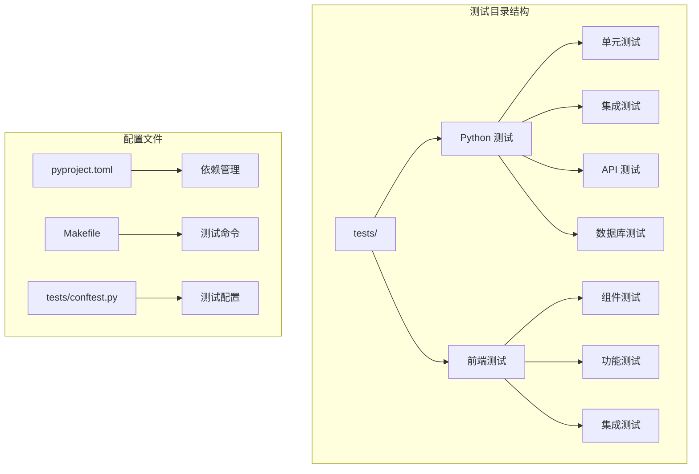
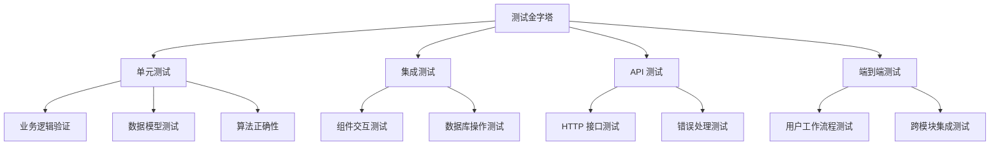
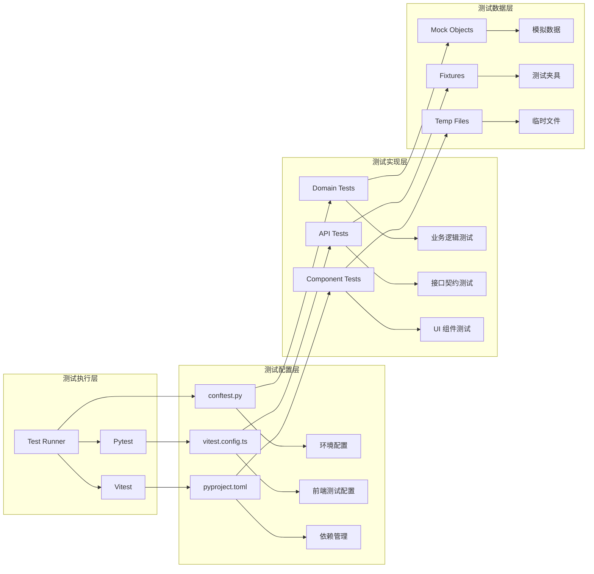
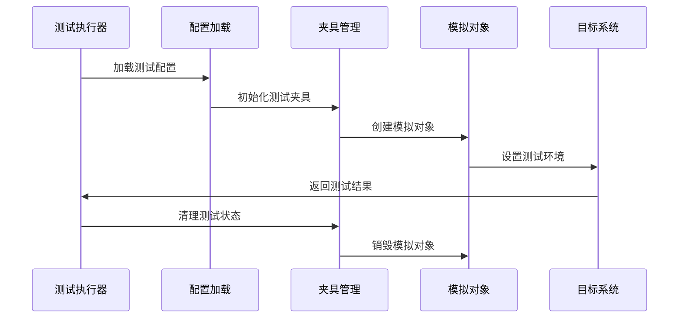
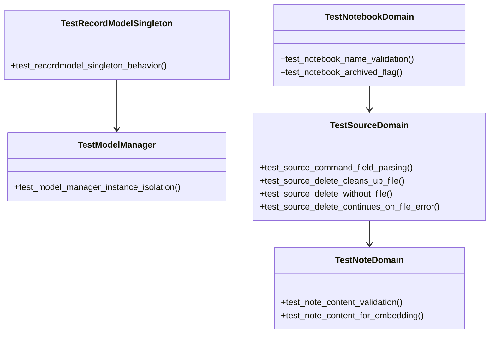
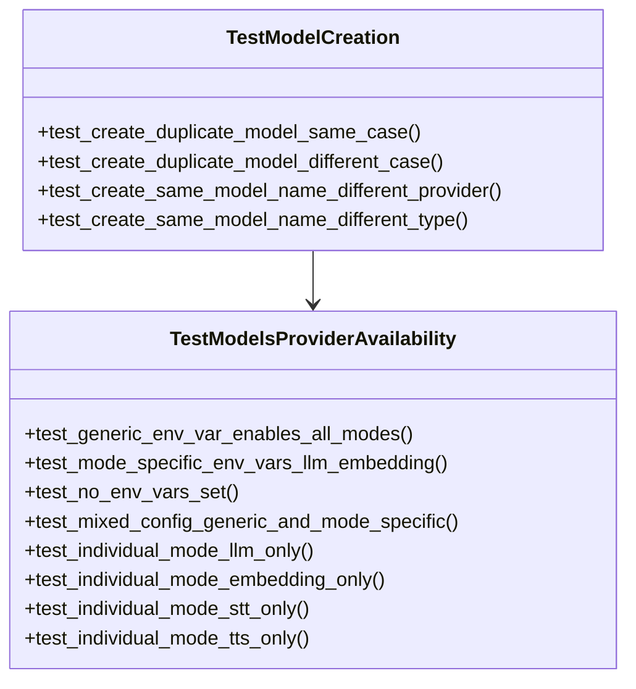
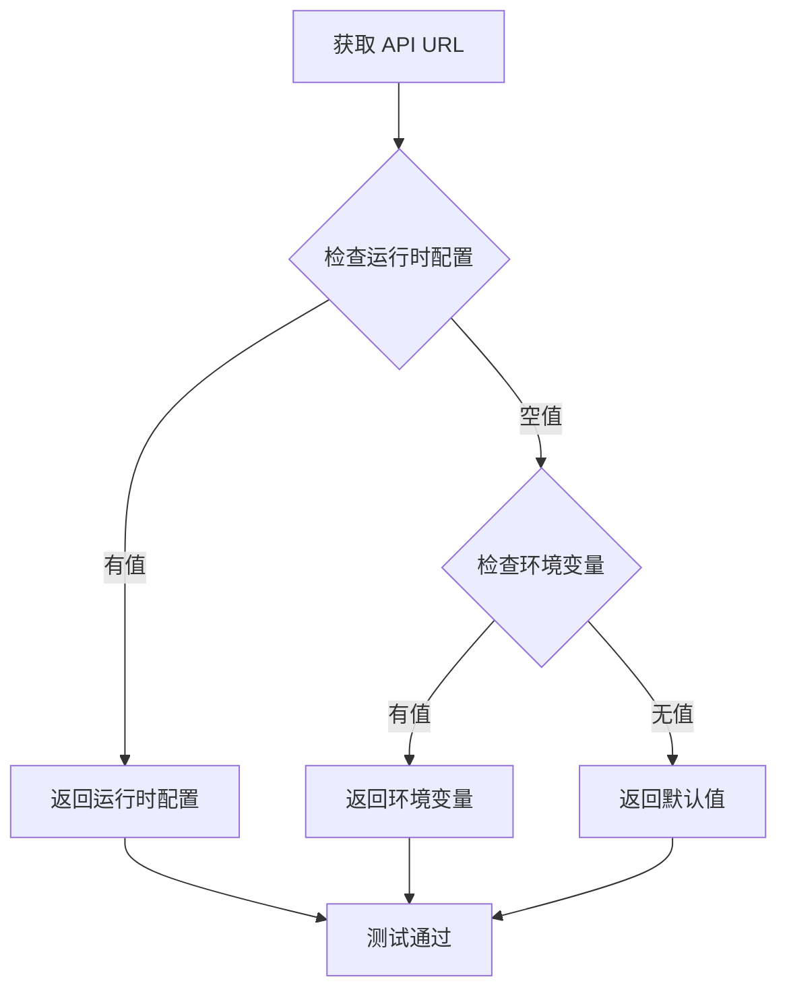
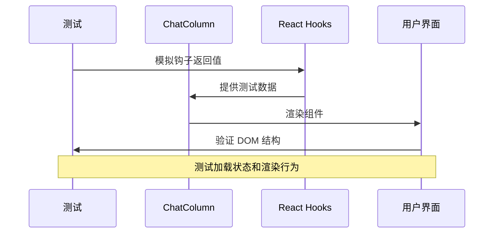
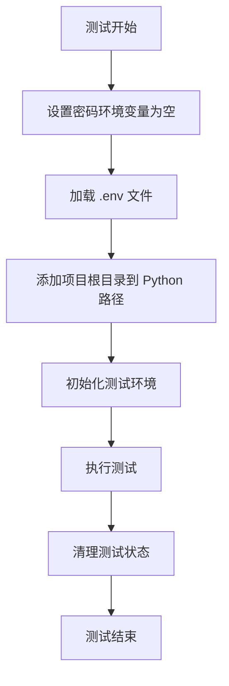
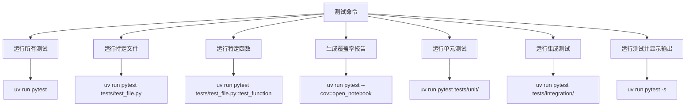

# 测试策略

<cite>
**本文档引用的文件**
- [README.md](file://README.md)
- [docs/7-DEVELOPMENT/testing.md](file://docs/7-DEVELOPMENT/testing.md)
- [tests/README.md](file://tests/README.md)
- [tests/conftest.py](file://tests/conftest.py)
- [tests/test_domain.py](file://tests/test_domain.py)
- [tests/test_models_api.py](file://tests/test_models_api.py)
- [frontend/src/lib/config.test.ts](file://frontend/src/lib/config.test.ts)
- [frontend/vitest.config.ts](file://frontend/vitest.config.ts)
- [frontend/src/test/setup.ts](file://frontend/src/test/setup.ts)
- [frontend/src/app/(dashboard)/notebooks/components/ChatColumn.test.tsx](file://frontend/src/app/(dashboard)/notebooks/components/ChatColumn.test.tsx)
- [pyproject.toml](file://pyproject.toml)
- [Makefile](file://Makefile)
</cite>

## 目录
1. [引言](#引言)
2. [项目结构](#项目结构)
3. [核心组件](#核心组件)
4. [架构概览](#架构概览)
5. [详细组件分析](#详细组件分析)
6. [依赖分析](#依赖分析)
7. [性能考虑](#性能考虑)
8. [故障排除指南](#故障排除指南)
9. [结论](#结论)

## 引言

Open Notebook 项目采用多层次的测试策略，确保系统的可靠性、稳定性和可维护性。该项目支持多种测试类型，包括单元测试、集成测试、API 测试和数据库测试，并且在前端使用 Vitest 进行 React 组件测试。

项目的核心测试哲学强调关注业务逻辑、API 合同、关键工作流程、数据持久性和错误处理条件。测试策略避免测试框架代码、第三方库实现、简单 getter/setter 和视图/展示层渲染（除非包含逻辑）。

## 项目结构

项目采用分层的测试组织结构：



**图表来源**
- [pyproject.toml](file://pyproject.toml#L50-L71)
- [Makefile](file://Makefile#L1-L210)
- [tests/conftest.py](file://tests/conftest.py#L1-L32)

**章节来源**
- [pyproject.toml](file://pyproject.toml#L1-L101)
- [Makefile](file://Makefile#L1-L210)

## 核心组件

### 测试框架配置

项目使用 Pytest 作为主要的 Python 测试框架，支持异步测试和覆盖率报告。前端测试使用 Vitest 和 jsdom 环境。

关键配置特点：
- **环境变量管理**：通过 `conftest.py` 确保测试环境的隔离和一致性
- **异步支持**：使用 `pytest-asyncio` 扩展支持异步函数测试
- **覆盖率报告**：支持 `--cov` 参数生成覆盖率报告
- **测试分类**：按功能模块组织测试文件

### 测试分类体系

项目实现了完整的测试金字塔结构：



**章节来源**
- [docs/7-DEVELOPMENT/testing.md](file://docs/7-DEVELOPMENT/testing.md#L58-L125)

## 架构概览

### 测试架构设计



**图表来源**
- [tests/conftest.py](file://tests/conftest.py#L1-L32)
- [frontend/vitest.config.ts](file://frontend/vitest.config.ts#L1-L16)
- [pyproject.toml](file://pyproject.toml#L50-L71)

### 测试数据流



**图表来源**
- [tests/conftest.py](file://tests/conftest.py#L12-L27)
- [frontend/src/test/setup.ts](file://frontend/src/test/setup.ts#L1-L70)

## 详细组件分析

### Python 测试组件

#### 域模型测试

域模型测试专注于业务逻辑验证和数据结构测试：



**图表来源**
- [tests/test_domain.py](file://tests/test_domain.py#L28-L399)

**章节来源**
- [tests/test_domain.py](file://tests/test_domain.py#L1-L399)

#### API 测试组件

API 测试组件验证 HTTP 接口的行为和错误处理：



**图表来源**
- [tests/test_models_api.py](file://tests/test_models_api.py#L15-L392)

**章节来源**
- [tests/test_models_api.py](file://tests/test_models_api.py#L1-L392)

### 前端测试组件

#### 配置优先级测试

前端配置测试验证运行时配置、环境变量和默认值的优先级：



**图表来源**
- [frontend/src/lib/config.test.ts](file://frontend/src/lib/config.test.ts#L22-L99)

**章节来源**
- [frontend/src/lib/config.test.ts](file://frontend/src/lib/config.test.ts#L1-L101)

#### 组件测试

聊天列组件测试验证数据加载状态和渲染行为：



**图表来源**
- [frontend/src/app/(dashboard)/notebooks/components/ChatColumn.test.tsx](file://frontend/src/app/(dashboard)/notebooks/components/ChatColumn.test.tsx#L44-L74)

**章节来源**
- [frontend/src/app/(dashboard)/notebooks/components/ChatColumn.test.tsx](file://frontend/src/app/(dashboard)/notebooks/components/ChatColumn.test.tsx#L1-L75)

### 测试配置管理

#### 环境变量配置

测试配置文件确保测试环境的隔离和一致性：



**图表来源**
- [tests/conftest.py](file://tests/conftest.py#L12-L31)

**章节来源**
- [tests/conftest.py](file://tests/conftest.py#L1-L32)

## 依赖分析

### 测试依赖关系

```mermaid
graph TB
subgraph "Python 测试依赖"
A[pytest] --> B[pytest-asyncio]
A --> C[pytest-cov]
A --> D[httpx]
E[fastapi] --> F[TestClient]
G[pydantic] --> H[数据验证]
I[surrealdb] --> J[数据库测试]
end
subgraph "前端测试依赖"
K[vitest] --> L[jsdom]
K --> M[@testing-library/react]
N[next.js] --> O[路由模拟]
P[react] --> Q[组件测试]
end
subgraph "开发工具"
R[mypy] --> S[类型检查]
T[ruff] --> U[代码格式化]
V[pre-commit] --> W[Git 钩子]
end
```

**图表来源**
- [pyproject.toml](file://pyproject.toml#L15-L44)
- [pyproject.toml](file://pyproject.toml#L50-L71)

### 测试命令和工具

Makefile 提供了完整的测试和开发工作流：



**图表来源**
- [Makefile](file://Makefile#L155-L172)
- [docs/7-DEVELOPMENT/testing.md](file://docs/7-DEVELOPMENT/testing.md#L155-L203)

**章节来源**
- [pyproject.toml](file://pyproject.toml#L50-L71)
- [Makefile](file://Makefile#L1-L210)

## 性能考虑

### 测试性能优化

项目在测试策略中考虑了多个性能因素：

1. **异步测试优化**：使用 `pytest-asyncio` 减少异步操作的开销
2. **测试隔离**：通过夹具和模拟对象减少外部依赖
3. **缓存清理**：提供专门的缓存清理命令
4. **并行执行**：支持并发测试执行以提高效率

### 覆盖率目标

项目设定了明确的覆盖率目标：
- 整体覆盖率目标：70%+
- 关键业务逻辑覆盖率：90%+
- 重点关注有意义的测试而非追求 100%

## 故障排除指南

### 常见测试问题

#### 异步测试错误

**问题**：`event loop is closed` 错误
**解决方案**：正确使用异步夹具和 `pytest.mark.asyncio` 装饰器

**问题**：`object is not awaitable` 错误  
**解决方案**：确保在测试中使用 `await` 关键字

#### 环境配置问题

**问题**：测试环境变量冲突
**解决方案**：检查 `conftest.py` 中的环境变量设置

#### 前端测试问题

**问题**：DOM 测试失败
**解决方案**：检查 jsdom 环境配置和组件渲染逻辑

**章节来源**
- [docs/7-DEVELOPMENT/testing.md](file://docs/7-DEVELOPMENT/testing.md#L394-L418)

## 结论

Open Notebook 项目的测试策略体现了现代软件开发的最佳实践，具有以下特点：

1. **全面的测试金字塔**：从单元测试到端到端测试的完整覆盖
2. **清晰的测试分类**：按功能模块组织的测试结构
3. **强大的配置管理**：灵活的测试环境配置和依赖管理
4. **高效的执行机制**：支持异步测试和并发执行
5. **完善的工具链**：从代码检查到测试执行的完整工具链

该测试策略确保了系统的高质量和稳定性，为项目的持续发展提供了坚实的基础。通过遵循既定的测试哲学和最佳实践，开发者可以有效地维护代码质量和功能完整性。