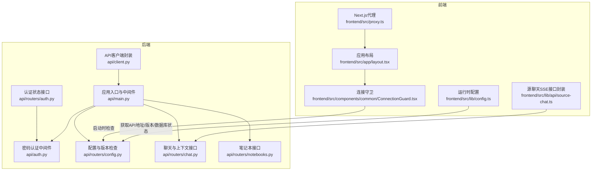
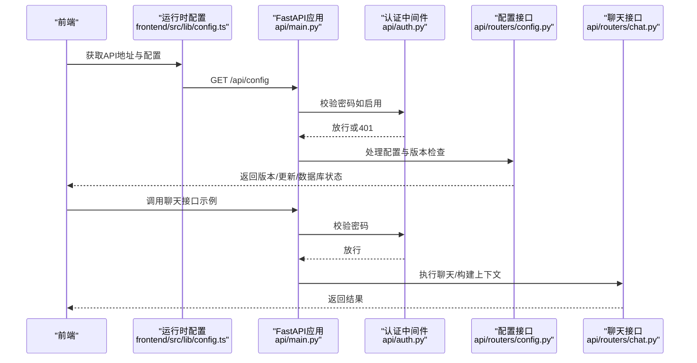
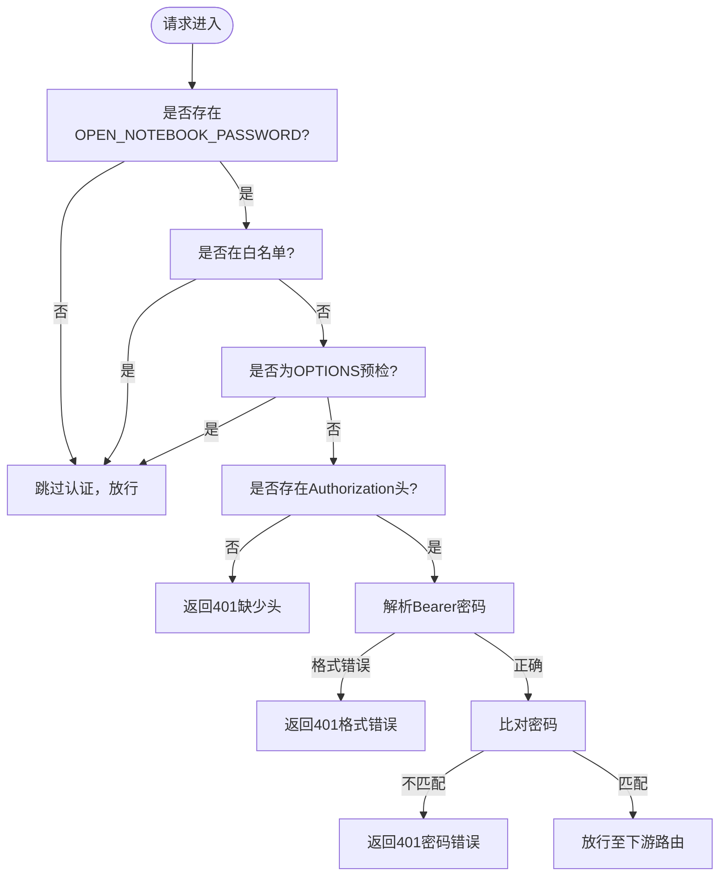
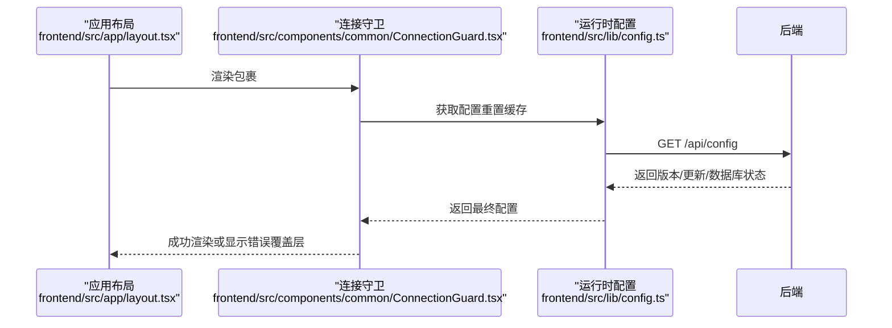
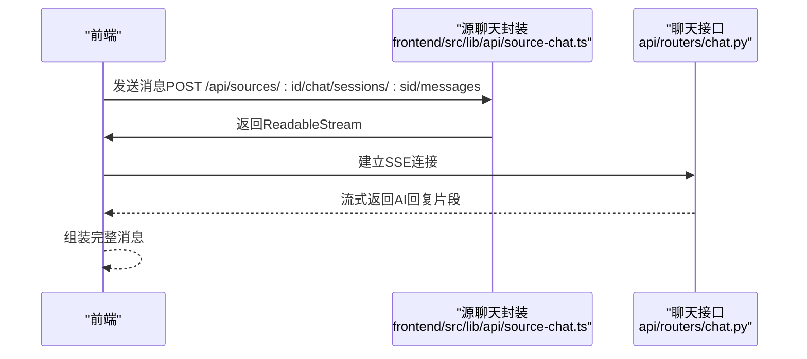
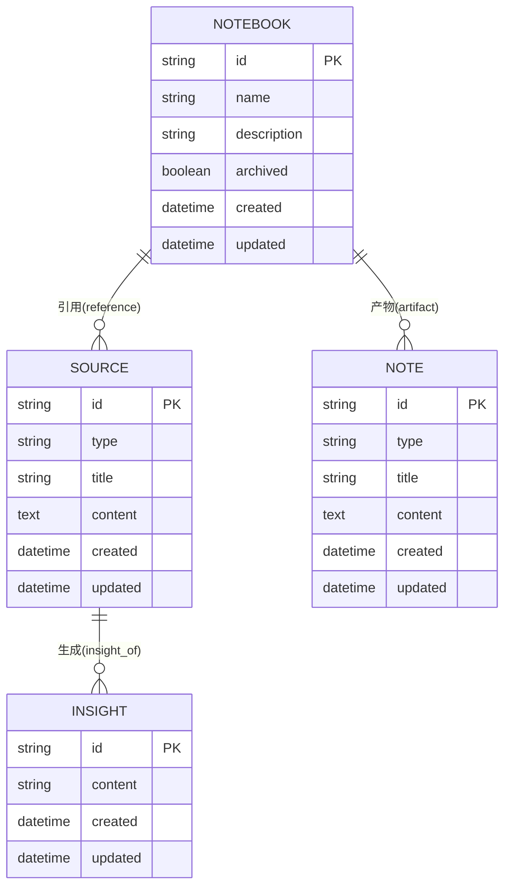
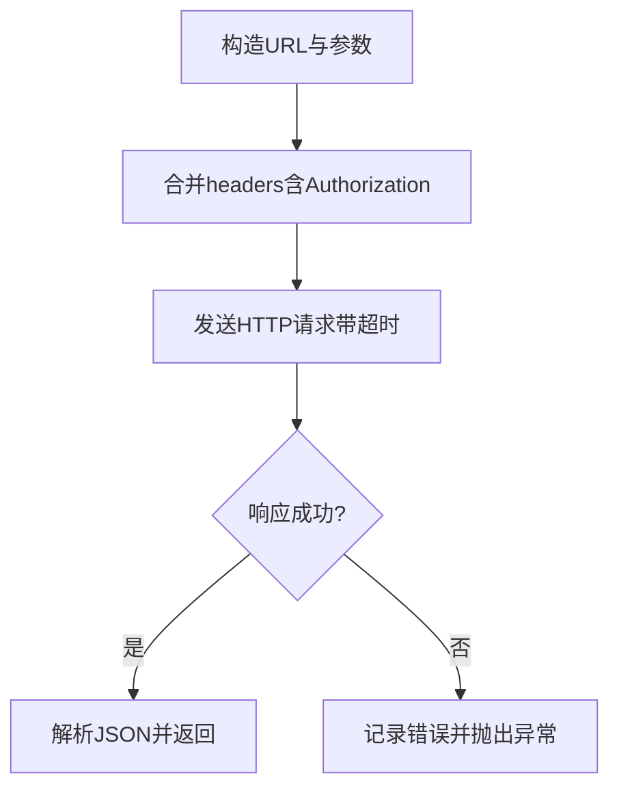
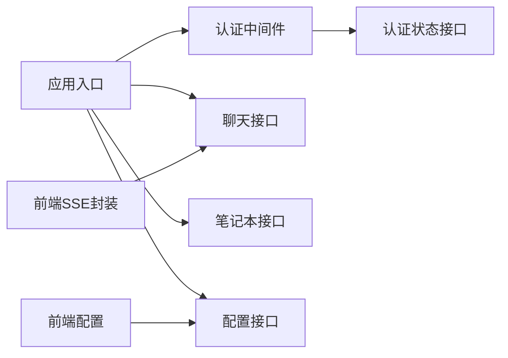

# API集成

<cite>
**本文引用的文件**
- [api/main.py](file://api/main.py)
- [api/client.py](file://api/client.py)
- [api/auth.py](file://api/auth.py)
- [api/routers/auth.py](file://api/routers/auth.py)
- [api/routers/chat.py](file://api/routers/chat.py)
- [api/routers/config.py](file://api/routers/config.py)
- [api/routers/notebooks.py](file://api/routers/notebooks.py)
- [frontend/src/lib/config.ts](file://frontend/src/lib/config.ts)
- [frontend/src/components/common/ConnectionGuard.tsx](file://frontend/src/components/common/ConnectionGuard.tsx)
- [frontend/src/app/layout.tsx](file://frontend/src/app/layout.tsx)
- [frontend/src/proxy.ts](file://frontend/src/proxy.ts)
- [frontend/src/lib/api/source-chat.ts](file://frontend/src/lib/api/source-chat.ts)
</cite>

## 目录
1. [简介](#简介)
2. [项目结构](#项目结构)
3. [核心组件](#核心组件)
4. [架构总览](#架构总览)
5. [详细组件分析](#详细组件分析)
6. [依赖关系分析](#依赖关系分析)
7. [性能考量](#性能考量)
8. [故障排查指南](#故障排查指南)
9. [结论](#结论)
10. [附录](#附录)

## 简介
本文件面向需要在前端与后端之间集成 Open Notebook API 的开发者，系统性说明前后端交互模式、数据流管理、认证机制、错误处理与重试策略、实时通信（含 SSE）、API 版本管理、缓存策略与性能优化，并提供调用最佳实践与调试技巧。内容基于仓库中的 FastAPI 后端与 Next.js 前端实现进行提炼与可视化。

## 项目结构
- 后端采用 FastAPI，通过中间件统一处理认证与CORS，按功能模块划分路由器，提供 REST 接口与内部服务。
- 前端使用 Next.js，通过运行时配置动态解析 API 地址，配合连接守卫组件在启动阶段检测后端可用性与数据库健康状态。

**图表来源**
- [api/main.py](file://api/main.py#L99-L190)
- [api/auth.py](file://api/auth.py#L12-L76)
- [api/routers/config.py](file://api/routers/config.py#L123-L161)
- [api/routers/auth.py](file://api/routers/auth.py#L13-L27)
- [api/routers/chat.py](file://api/routers/chat.py#L96-L517)
- [api/routers/notebooks.py](file://api/routers/notebooks.py#L20-L328)
- [frontend/src/lib/config.ts](file://frontend/src/lib/config.ts#L59-L140)
- [frontend/src/components/common/ConnectionGuard.tsx](file://frontend/src/components/common/ConnectionGuard.tsx#L18-L76)
- [frontend/src/app/layout.tsx](file://frontend/src/app/layout.tsx#L19-L45)
- [frontend/src/proxy.ts](file://frontend/src/proxy.ts#L4-L19)
- [frontend/src/lib/api/source-chat.ts](file://frontend/src/lib/api/source-chat.ts#L49-L84)

**章节来源**
- [api/main.py](file://api/main.py#L99-L190)
- [frontend/src/lib/config.ts](file://frontend/src/lib/config.ts#L59-L140)

## 核心组件
- 后端应用与中间件
  - 应用生命周期：启动时执行数据库迁移，失败则快速退出；关闭时清理日志。
  - 密码认证中间件：对除白名单外的路径强制校验 Bearer 密码头；支持 Docker 秘钥文件。
  - CORS 中间件：允许任意来源/凭证/方法/头，便于开发与跨域访问。
  - 自定义异常处理器：确保错误响应包含 CORS 头，尤其针对上传类 413。
  - 路由器注册：集中挂载 auth、config、notebooks、search、models、transformations、notes、embedding、settings、context、sources、insights、commands、podcasts、episode-profiles、speaker-profiles、chat、source-chat、credentials 等。
- API 客户端
  - 支持环境变量配置基础地址与超时；自动注入 Authorization 头（若设置 OPEN_NOTEBOOK_PASSWORD）。
  - 针对长耗时操作（转换、洞察、嵌入重建等）提供可配置超时与更高超时策略。
  - 封装笔记本、搜索、模型、转换、笔记、嵌入、设置、上下文、来源、洞察、播客、会话等常用接口。
- 前端配置与连接守卫
  - 运行时优先从后端 /api/config 获取配置，回退到构建期环境变量或相对路径（利用 Next.js 重写避免 CORS）。
  - 连接守卫在启动阶段检测 API 可达性与数据库健康状态，失败时以覆盖层提示并支持键盘重试。

**章节来源**
- [api/main.py](file://api/main.py#L47-L96)
- [api/auth.py](file://api/auth.py#L12-L76)
- [api/client.py](file://api/client.py#L16-L47)
- [frontend/src/lib/config.ts](file://frontend/src/lib/config.ts#L22-L140)
- [frontend/src/components/common/ConnectionGuard.tsx](file://frontend/src/components/common/ConnectionGuard.tsx#L18-L76)

## 架构总览
下图展示从前端到后端的关键交互链路，包括认证、CORS、配置获取、数据库健康检查与聊天执行。

**图表来源**
- [frontend/src/lib/config.ts](file://frontend/src/lib/config.ts#L59-L140)
- [api/main.py](file://api/main.py#L107-L127)
- [api/auth.py](file://api/auth.py#L30-L75)
- [api/routers/config.py](file://api/routers/config.py#L123-L161)
- [api/routers/chat.py](file://api/routers/chat.py#L330-L409)

## 详细组件分析

### 认证与安全
- 密码认证中间件
  - 当未配置 OPEN_NOTEBOOK_PASSWORD 时跳过校验；否则对非 OPTIONS 且非白名单路径要求 Bearer 密码头。
  - 白名单路径包括根、健康检查、文档与 /api/auth/status 等。
- 认证状态接口
  - 返回是否启用认证及提示信息，支持 Docker 秘钥文件读取。
- 自定义异常处理
  - 对 HTTP 异常统一返回 JSON，并附加 CORS 头，解决反向代理返回 413 时的跨域问题。

**图表来源**
- [api/auth.py](file://api/auth.py#L12-L76)
- [api/routers/auth.py](file://api/routers/auth.py#L13-L27)
- [api/main.py](file://api/main.py#L132-L154)

**章节来源**
- [api/auth.py](file://api/auth.py#L12-L76)
- [api/routers/auth.py](file://api/routers/auth.py#L13-L27)
- [api/main.py](file://api/main.py#L132-L154)

### 前端配置与连接守卫
- 运行时配置优先级：后端 /api/config 返回的 apiUrl > 构建期 NEXT_PUBLIC_API_URL > 相对路径（利用 Next.js 重写）。
- 连接守卫在应用启动时拉取配置并检查数据库状态，若离线或不可达则显示覆盖层并支持键盘 R 键重试。
- Next.js 代理将根路径重定向到笔记本页面，避免静态资源误拦截。

**图表来源**
- [frontend/src/app/layout.tsx](file://frontend/src/app/layout.tsx#L34-L37)
- [frontend/src/components/common/ConnectionGuard.tsx](file://frontend/src/components/common/ConnectionGuard.tsx#L18-L76)
- [frontend/src/lib/config.ts](file://frontend/src/lib/config.ts#L59-L140)

**章节来源**
- [frontend/src/lib/config.ts](file://frontend/src/lib/config.ts#L22-L140)
- [frontend/src/components/common/ConnectionGuard.tsx](file://frontend/src/components/common/ConnectionGuard.tsx#L18-L76)
- [frontend/src/proxy.ts](file://frontend/src/proxy.ts#L4-L19)

### 聊天与上下文（含SSE）
- 路由器提供会话查询、创建、更新、删除与消息执行；支持按会话/请求级别模型覆盖。
- 上下文构建支持选择来源与笔记片段，估算字符数与 Token 数，便于控制上下文大小。
- 源聊天（Source Chat）SSE 实现：前端通过 fetch 返回 ReadableStream 接收事件流，自动携带本地存储的令牌头。

**图表来源**
- [frontend/src/lib/api/source-chat.ts](file://frontend/src/lib/api/source-chat.ts#L49-L84)
- [api/routers/chat.py](file://api/routers/chat.py#L330-L409)

**章节来源**
- [api/routers/chat.py](file://api/routers/chat.py#L96-L517)
- [frontend/src/lib/api/source-chat.ts](file://frontend/src/lib/api/source-chat.ts#L49-L84)

### 数据模型与关系

**图表来源**
- [api/routers/notebooks.py](file://api/routers/notebooks.py#L218-L290)

**章节来源**
- [api/routers/notebooks.py](file://api/routers/notebooks.py#L20-L328)

### API 客户端与请求拦截
- 基础配置：支持通过环境变量设置 API_BASE_URL 与 API_CLIENT_TIMEOUT；自动注入 Authorization 头。
- 请求拦截：在发起请求前合并自定义头与全局头，捕获网络与状态码异常并抛出统一错误。
- 长耗时操作：对 ask、transformations、embeddings 等操作使用更高超时或双倍超时策略，避免早期中断。

**图表来源**
- [api/client.py](file://api/client.py#L48-L78)

**章节来源**
- [api/client.py](file://api/client.py#L16-L47)
- [api/client.py](file://api/client.py#L48-L78)

## 依赖关系分析
- 中间件耦合
  - 密码认证中间件与认证状态接口存在直接依赖：后者用于告知前端是否启用认证。
- 路由器内聚
  - chat、notebooks、config 等路由器各自职责清晰，通过统一前缀 /api 暴露接口。
- 前后端耦合点
  - 前端通过 /api/config 获取版本与数据库状态；聊天接口支持 SSE 流式响应。
- 外部依赖
  - FastAPI、Starlette、Loguru、httpx、LangChain Graph 等。

**图表来源**
- [api/main.py](file://api/main.py#L107-L127)
- [api/auth.py](file://api/auth.py#L12-L76)
- [api/routers/auth.py](file://api/routers/auth.py#L13-L27)
- [api/routers/chat.py](file://api/routers/chat.py#L96-L517)
- [api/routers/notebooks.py](file://api/routers/notebooks.py#L20-L328)
- [api/routers/config.py](file://api/routers/config.py#L123-L161)
- [frontend/src/lib/config.ts](file://frontend/src/lib/config.ts#L59-L140)
- [frontend/src/lib/api/source-chat.ts](file://frontend/src/lib/api/source-chat.ts#L49-L84)

**章节来源**
- [api/main.py](file://api/main.py#L157-L180)
- [api/routers/config.py](file://api/routers/config.py#L123-L161)

## 性能考量
- 超时策略
  - 客户端默认较长超时，针对 ask、transformations、embeddings 等操作采用更高或双倍超时，避免慢硬件或远程 API 导致的提前中断。
- 缓存策略
  - 版本检查结果在内存中缓存 24 小时，减少对外部 GitHub 的频繁请求。
- 数据库健康检查
  - 配置接口对数据库进行轻量查询并限制 2 秒超时，快速判断在线/离线状态。
- 上下文估算
  - 构建上下文时估算字符数与 Token 数，便于控制上下文大小，降低模型成本与延迟。

**章节来源**
- [api/client.py](file://api/client.py#L18-L40)
- [api/routers/config.py](file://api/routers/config.py#L19-L28)
- [api/routers/config.py](file://api/routers/config.py#L102-L121)
- [api/routers/chat.py](file://api/routers/chat.py#L498-L511)

## 故障排查指南
- 认证失败
  - 确认 OPEN_NOTEBOOK_PASSWORD 是否正确设置；检查请求头 Authorization 是否为 Bearer 格式；确认路径不在白名单。
- CORS 与 413
  - 若反向代理提前返回 413，请在代理层添加 CORS 头；后端已提供自定义异常处理器确保错误响应包含 CORS 头。
- 连接不可达
  - 使用连接守卫提供的键盘重试（R 键）；检查 /api/config 是否可达；查看数据库健康状态。
- SSE 连接
  - 确保前端使用相对路径与 Next.js 重写；检查 Authorization 头是否正确传递；确认后端聊天接口已启用。

**章节来源**
- [api/auth.py](file://api/auth.py#L30-L75)
- [api/main.py](file://api/main.py#L132-L154)
- [frontend/src/components/common/ConnectionGuard.tsx](file://frontend/src/components/common/ConnectionGuard.tsx#L18-L76)
- [frontend/src/lib/api/source-chat.ts](file://frontend/src/lib/api/source-chat.ts#L49-L84)

## 结论
本文档梳理了 Open Notebook 的前后端 API 集成要点：认证中间件与状态接口、CORS 与异常处理、运行时配置与连接守卫、聊天与上下文接口、SSE 实时通信、版本与缓存策略以及性能优化建议。遵循本文的最佳实践与调试流程，可有效提升集成稳定性与用户体验。

## 附录
- API 调用最佳实践
  - 使用运行时配置获取 API 地址，优先相对路径以避免 CORS。
  - 针对长耗时操作设置合理超时，必要时提高 API_CLIENT_TIMEOUT。
  - 在前端统一处理认证头与错误覆盖层，提供用户可感知的反馈。
- 调试技巧
  - 开发阶段利用连接守卫的键盘重试（R 键）快速刷新状态。
  - 关注后端日志与异常处理器输出，定位认证与 CORS 相关问题。
  - 对于 SSE，使用浏览器开发者工具的 Network 面板观察事件流与头部。