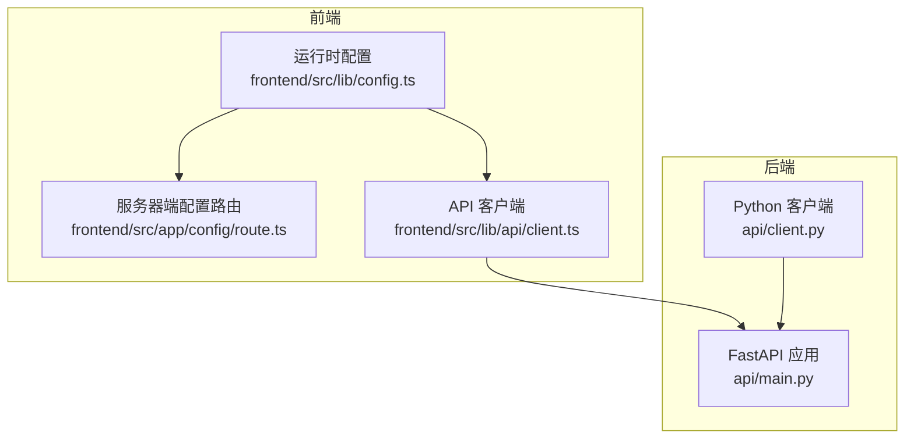
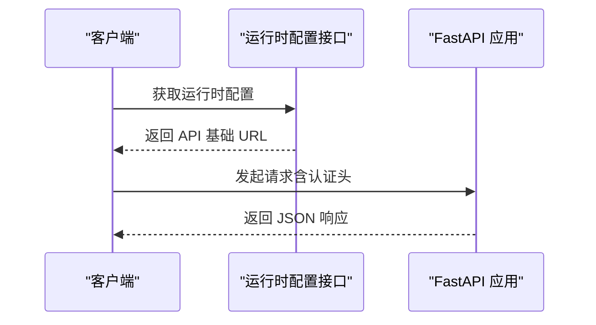
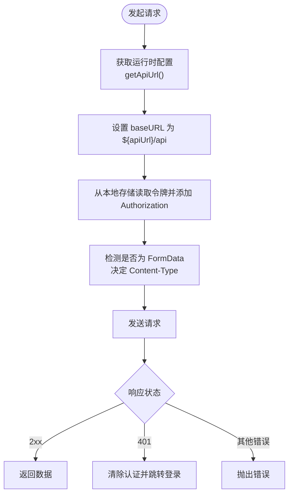
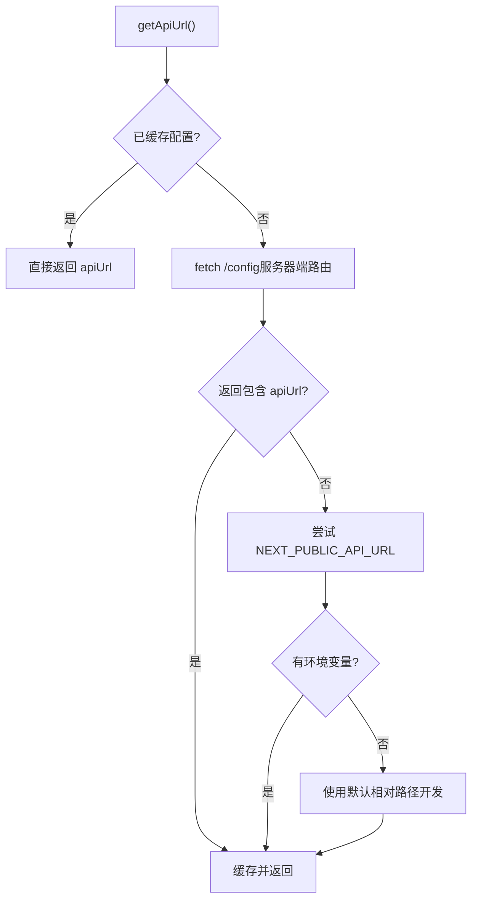
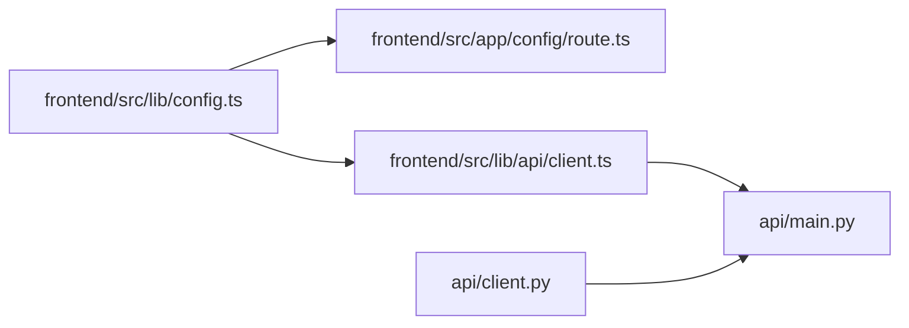

# HTTP客户端

<cite>
**本文档引用的文件**
- [api/client.py](file://api/client.py)
- [frontend/src/lib/api/client.ts](file://frontend/src/lib/api/client.ts)
- [frontend/src/lib/config.ts](file://frontend/src/lib/config.ts)
- [frontend/src/app/config/route.ts](file://frontend/src/app/config/route.ts)
- [frontend/src/lib/types/config.ts](file://frontend/src/lib/types/config.ts)
- [api/main.py](file://api/main.py)
- [.env.example](file://.env.example)
- [docs/7-DEVELOPMENT/api-reference.md](file://docs/7-DEVELOPMENT/api-reference.md)
- [docs/5-CONFIGURATION/security.md](file://docs/5-CONFIGURATION/security.md)
</cite>

## 目录
1. [简介](#简介)
2. [项目结构](#项目结构)
3. [核心组件](#核心组件)
4. [架构总览](#架构总览)
5. [详细组件分析](#详细组件分析)
6. [依赖关系分析](#依赖关系分析)
7. [性能考虑](#性能考虑)
8. [故障排除指南](#故障排除指南)
9. [结论](#结论)

## 简介
本文件面向开发者与运维人员，系统化阐述 Open Notebook 的 HTTP 客户端实现与使用方式，覆盖以下主题：
- 初始化配置：基础 URL 设置、运行时配置优先级、环境变量注入
- 请求拦截器：请求头管理、认证令牌处理、内容类型自动适配
- 响应拦截：错误处理、状态码映射、401 自动登出
- 超时与重试：客户端超时配置、长耗时操作的超时策略
- 数据转换与缓存：JSON 序列化/反序列化、FormData 自动处理、无内置缓存策略
- RESTful API 调用示例：GET、POST、PUT、DELETE 操作路径
- 版本控制与向后兼容：当前版本策略、兼容性设计原则

## 项目结构
Open Notebook 提供两套 HTTP 客户端：
- 后端 Python 客户端（用于内部服务间通信或命令行工具）
- 前端 JavaScript 客户端（基于 axios，支持运行时配置与拦截器）

**图表来源**
- [frontend/src/lib/config.ts](file://frontend/src/lib/config.ts#L14-L54)
- [frontend/src/app/config/route.ts](file://frontend/src/app/config/route.ts#L25-L68)
- [frontend/src/lib/api/client.ts](file://frontend/src/lib/api/client.ts#L10-L16)
- [api/client.py](file://api/client.py#L16-L47)
- [api/main.py](file://api/main.py#L99-L127)

**章节来源**
- [frontend/src/lib/config.ts](file://frontend/src/lib/config.ts#L14-L54)
- [frontend/src/app/config/route.ts](file://frontend/src/app/config/route.ts#L25-L68)
- [frontend/src/lib/api/client.ts](file://frontend/src/lib/api/client.ts#L10-L16)
- [api/client.py](file://api/client.py#L16-L47)
- [api/main.py](file://api/main.py#L99-L127)

## 核心组件
- 前端 axios 客户端
  - 动态 baseURL：通过运行时配置接口获取，支持相对路径代理
  - 认证头：从本地存储读取令牌并附加到请求头
  - 内容类型：自动处理 JSON 与 FormData
  - 超时：默认 600 秒，适合大模型推理
  - 错误拦截：401 自动清除认证并跳转登录
- 后端 httpx 客户端
  - 基础 URL：可由构造函数传入或从环境变量读取
  - 认证头：从环境变量读取密码并生成 Bearer 头
  - 超时：默认 300 秒，可通过环境变量调整，带上下限校验
  - 错误处理：统一捕获网络与 HTTP 错误并抛出标准化异常

**章节来源**
- [frontend/src/lib/api/client.ts](file://frontend/src/lib/api/client.ts#L10-L16)
- [frontend/src/lib/api/client.ts](file://frontend/src/lib/api/client.ts#L18-L49)
- [frontend/src/lib/api/client.ts](file://frontend/src/lib/api/client.ts#L51-L64)
- [api/client.py](file://api/client.py#L16-L47)
- [api/client.py](file://api/client.py#L48-L78)

## 架构总览
前端与后端客户端均通过 FastAPI 提供的 REST 接口交互。前端支持运行时配置优先级，后端通过中间件与路由组织 API。

**图表来源**
- [frontend/src/lib/config.ts](file://frontend/src/lib/config.ts#L59-L140)
- [frontend/src/app/config/route.ts](file://frontend/src/app/config/route.ts#L25-L68)
- [api/main.py](file://api/main.py#L157-L180)

**章节来源**
- [frontend/src/lib/config.ts](file://frontend/src/lib/config.ts#L59-L140)
- [frontend/src/app/config/route.ts](file://frontend/src/app/config/route.ts#L25-L68)
- [api/main.py](file://api/main.py#L157-L180)

## 详细组件分析

### 前端 axios 客户端
- 初始化与超时
  - 默认超时 600 秒，适合长耗时推理
  - withCredentials 关闭，避免跨域携带凭据
- 请求拦截器
  - 首次请求动态解析运行时配置，设置 baseURL 为 `${apiUrl}/api`
  - 从本地存储读取认证令牌并添加 Authorization 头
  - 自动处理 FormData 与 JSON 的 Content-Type
- 响应拦截器
  - 401 时清理本地认证并跳转登录页

**图表来源**
- [frontend/src/lib/api/client.ts](file://frontend/src/lib/api/client.ts#L18-L49)
- [frontend/src/lib/api/client.ts](file://frontend/src/lib/api/client.ts#L51-L64)

**章节来源**
- [frontend/src/lib/api/client.ts](file://frontend/src/lib/api/client.ts#L10-L16)
- [frontend/src/lib/api/client.ts](file://frontend/src/lib/api/client.ts#L18-L49)
- [frontend/src/lib/api/client.ts](file://frontend/src/lib/api/client.ts#L51-L64)

### 后端 httpx 客户端
- 初始化
  - 基础 URL：优先构造函数参数，其次环境变量，最后默认值
  - 认证头：若存在密码环境变量则自动附加 Bearer 头
  - 超时：从环境变量读取秒数，限制在 30s~3600s，越界则警告并取边界值
- 请求流程
  - 合并用户传入头与全局头
  - 使用 with 语句创建 httpx.Client 并执行请求
  - 统一异常处理：网络错误、HTTP 状态错误、其他异常
- 方法映射
  - 提供笔记本、笔记、源、洞察、嵌入、模型、变换等资源的 CRUD 方法
  - 长耗时操作（如变换、问答、嵌入）显式使用类实例超时

**图表来源**
- [api/client.py](file://api/client.py#L13-L529)

**章节来源**
- [api/client.py](file://api/client.py#L16-L47)
- [api/client.py](file://api/client.py#L48-L78)
- [api/client.py](file://api/client.py#L79-L529)

### 运行时配置与基础 URL
- 优先级
  - 服务器端配置路由：优先返回显式设置的 API_URL 或自动推断
  - 浏览器端配置：首次请求时拉取服务器端配置，随后缓存
  - 环境变量回退：NEXT_PUBLIC_API_URL
  - 默认回退：开发环境下相对路径（通过 Next.js 重写）
- 类型定义
  - 后端配置响应仅包含版本等元信息，实际 apiUrl 由前端运行时确定

**图表来源**
- [frontend/src/lib/config.ts](file://frontend/src/lib/config.ts#L22-L54)
- [frontend/src/lib/config.ts](file://frontend/src/lib/config.ts#L59-L140)
- [frontend/src/app/config/route.ts](file://frontend/src/app/config/route.ts#L25-L68)
- [frontend/src/lib/types/config.ts](file://frontend/src/lib/types/config.ts#L6-L24)

**章节来源**
- [frontend/src/lib/config.ts](file://frontend/src/lib/config.ts#L14-L54)
- [frontend/src/lib/config.ts](file://frontend/src/lib/config.ts#L59-L140)
- [frontend/src/app/config/route.ts](file://frontend/src/app/config/route.ts#L25-L68)
- [frontend/src/lib/types/config.ts](file://frontend/src/lib/types/config.ts#L6-L24)

### 认证与安全
- 前端
  - 从本地存储读取令牌并附加 Authorization: Bearer
  - 401 自动清除认证并跳转登录
- 后端
  - 密码认证中间件保护除健康检查与配置外的路由
  - 支持环境变量 OPEN_NOTEBOOK_PASSWORD 注入认证头

**章节来源**
- [frontend/src/lib/api/client.ts](file://frontend/src/lib/api/client.ts#L26-L38)
- [frontend/src/lib/api/client.ts](file://frontend/src/lib/api/client.ts#L51-L64)
- [api/main.py](file://api/main.py#L105-L118)
- [docs/5-CONFIGURATION/security.md](file://docs/5-CONFIGURATION/security.md#L148-L160)

### 错误处理与响应拦截
- 前端
  - 401 清理本地认证并跳转登录
  - 其他错误保持原样抛出，便于上层处理
- 后端
  - 统一捕获网络错误与 HTTP 状态错误，记录日志并抛出标准化异常

**章节来源**
- [frontend/src/lib/api/client.ts](file://frontend/src/lib/api/client.ts#L51-L64)
- [api/client.py](file://api/client.py#L60-L78)

### 超时配置与长耗时操作
- 前端
  - 默认 600 秒，适合大模型推理
- 后端
  - 默认 300 秒，可通过 API_CLIENT_TIMEOUT 调整，范围 30~3600 秒
  - 长耗时操作（变换、问答、嵌入、重建）显式使用类实例超时

**章节来源**
- [frontend/src/lib/api/client.ts](file://frontend/src/lib/api/client.ts#L6-L11)
- [api/client.py](file://api/client.py#L18-L40)
- [api/client.py](file://api/client.py#L151-L154)
- [api/client.py](file://api/client.py#L245-L248)
- [api/client.py](file://api/client.py#L301-L302)
- [api/client.py](file://api/client.py#L322-L326)

### 请求/响应数据转换与缓存策略
- 数据转换
  - 前端：JSON 序列化；FormData 自动移除 Content-Type 以让浏览器设置边界
  - 后端：统一 JSON 反序列化
- 缓存
  - 客户端未实现缓存策略；建议在业务层按需实现

**章节来源**
- [frontend/src/lib/api/client.ts](file://frontend/src/lib/api/client.ts#L40-L46)
- [api/client.py](file://api/client.py#L64-L64)

### RESTful API 调用示例（路径）
以下示例展示常见 CRUD 操作的端点路径（以交互式文档为准）：

- 列表与创建
  - GET/POST /api/notebooks
  - GET/POST /api/notes
  - GET/POST /api/sources
  - GET/POST /api/models
  - GET/POST /api/transformations
- 读取、更新、删除
  - GET/PUT/DELETE /api/notebooks/{id}
  - GET/PUT/DELETE /api/notes/{id}
  - GET/PUT/DELETE /api/sources/{id}
  - GET/PUT/DELETE /api/models/{id}
  - GET/PUT/DELETE /api/transformations/{id}
- 搜索与问答
  - POST /api/search
  - POST /api/search/ask/simple
- 嵌入与重建
  - POST /api/embed
  - POST /api/embeddings/rebuild
  - GET /api/embeddings/rebuild/{command_id}/status
- 上下文
  - POST /api/notebooks/{notebook_id}/context
- 洞察
  - GET /api/sources/{source_id}/insights
  - GET /api/insights/{id}
  - DELETE /api/insights/{id}
  - POST /api/insights/{id}/save-as-note
  - POST /api/sources/{source_id}/insights
- 配置与设置
  - GET /api/config
  - GET /api/settings
  - PUT /api/settings

**章节来源**
- [docs/7-DEVELOPMENT/api-reference.md](file://docs/7-DEVELOPMENT/api-reference.md#L42-L91)
- [docs/7-DEVELOPMENT/api-reference.md](file://docs/7-DEVELOPMENT/api-reference.md#L173-L190)

### API 版本控制与向后兼容
- 当前策略
  - 未实现显式 API 版本号；通过交互式文档与路由组织维护接口稳定性
- 设计原则
  - 避免破坏性变更，提供迁移路径，确保数据库与接口演进一致

**章节来源**
- [docs/7-DEVELOPMENT/api-reference.md](file://docs/7-DEVELOPMENT/api-reference.md#L215-L221)
- [docs/7-DEVELOPMENT/design-principles.md](file://docs/7-DEVELOPMENT/design-principles.md#L236-L246)

## 依赖关系分析

**图表来源**
- [frontend/src/lib/config.ts](file://frontend/src/lib/config.ts#L59-L140)
- [frontend/src/app/config/route.ts](file://frontend/src/app/config/route.ts#L25-L68)
- [frontend/src/lib/api/client.ts](file://frontend/src/lib/api/client.ts#L10-L16)
- [api/client.py](file://api/client.py#L16-L47)
- [api/main.py](file://api/main.py#L157-L180)

**章节来源**
- [frontend/src/lib/config.ts](file://frontend/src/lib/config.ts#L59-L140)
- [frontend/src/app/config/route.ts](file://frontend/src/app/config/route.ts#L25-L68)
- [frontend/src/lib/api/client.ts](file://frontend/src/lib/api/client.ts#L10-L16)
- [api/client.py](file://api/client.py#L16-L47)
- [api/main.py](file://api/main.py#L157-L180)

## 性能考虑
- 超时设置
  - 前端：默认 600 秒，满足复杂推理场景
  - 后端：默认 300 秒，可通过环境变量调整，避免过短导致失败
- 长耗时操作
  - 变换、问答、嵌入、重建等操作显式使用类实例超时，避免阻塞
- CORS 与代理
  - 开发环境允许所有来源；生产需限制来源并启用 HTTPS
- 缓存
  - 客户端未内置缓存；建议在业务层按需实现

[本节为通用指导，无需特定文件引用]

## 故障排除指南
- 前端
  - 401 自动登出：检查本地存储中的认证状态与令牌有效性
  - 运行时配置失败：确认 /config 路由可用、环境变量 API_URL/NEXT_PUBLIC_API_URL 正确
  - CORS 问题：生产环境限制来源，确保代理正确转发头部
- 后端
  - 连接失败：检查 API_BASE_URL 与 API_CLIENT_TIMEOUT 是否合理
  - HTTP 错误：查看日志中的状态码与响应文本，定位具体接口
  - 密码认证：确认 OPEN_NOTEBOOK_PASSWORD 已正确设置且未被中间件排除

**章节来源**
- [frontend/src/lib/api/client.ts](file://frontend/src/lib/api/client.ts#L51-L64)
- [frontend/src/lib/config.ts](file://frontend/src/lib/config.ts#L59-L140)
- [api/client.py](file://api/client.py#L60-L78)
- [api/main.py](file://api/main.py#L105-L118)

## 结论
Open Notebook 的 HTTP 客户端在前后端分别提供了简洁可靠的实现：
- 前端 axios 客户端具备运行时配置、认证拦截与长超时能力，适合浏览器端使用
- 后端 httpx 客户端具备环境变量驱动的基础 URL 与认证头、严格的超时校验与统一错误处理，适合服务端集成
结合交互式 API 文档与安全配置指南，可快速完成 RESTful 调用与部署。