# WebSocket连接

<cite>
**本文档引用的文件**
- [api/routers/source_chat.py](file://api/routers/source_chat.py)
- [frontend/src/lib/api/source-chat.ts](file://frontend/src/lib/api/source-chat.ts)
- [frontend/src/lib/hooks/useSourceChat.ts](file://frontend/src/lib/hooks/useSourceChat.ts)
- [frontend/src/lib/api/client.ts](file://frontend/src/lib/api/client.ts)
- [frontend/src/lib/config.ts](file://frontend/src/lib/config.ts)
- [frontend/src/components/common/ConnectionGuard.tsx](file://frontend/src/components/common/ConnectionGuard.tsx)
- [frontend/src/components/errors/ConnectionErrorOverlay.tsx](file://frontend/src/components/errors/ConnectionErrorOverlay.tsx)
- [frontend/src/lib/types/api.ts](file://frontend/src/lib/types/api.ts)
- [open_notebook/database/repository.py](file://open_notebook/database/repository.py)
</cite>

## 目录
1. [简介](#简介)
2. [项目结构](#项目结构)
3. [核心组件](#核心组件)
4. [架构概览](#架构概览)
5. [详细组件分析](#详细组件分析)
6. [依赖关系分析](#依赖关系分析)
7. [性能考虑](#性能考虑)
8. [故障排除指南](#故障排除指南)
9. [结论](#结论)

## 简介

Open Notebook 是一个基于 FastAPI 和 React 的智能笔记应用，支持实时聊天功能。本文档详细说明了系统的实时通信机制，包括 WebSocket 连接的建立过程、连接管理、断线重连机制以及消息格式和事件类型。

系统采用 Server-Sent Events (SSE) 技术实现近似 WebSocket 的实时通信效果，通过 HTTP 流式响应实现实时消息传输。这种设计避免了传统 WebSocket 的复杂性，同时提供了相似的用户体验。

## 项目结构

系统由三个主要部分组成：

```mermaid
graph TB
subgraph "前端层"
FE[React 前端]
API[API 客户端]
Hooks[自定义 Hook]
Utils[工具函数]
end
subgraph "后端层"
FastAPI[FastAPI 应用]
Routers[路由处理器]
Graphs[LangGraph 图]
DB[(数据库)]
end
subgraph "通信层"
SSE[Server-Sent Events]
HTTP[HTTP 流]
Auth[认证系统]
end
FE --> API
API --> FastAPI
FastAPI --> Routers
Routers --> Graphs
Graphs --> DB
FE <- --> SSE
SSE < --> HTTP
API --> Auth
```

**图表来源**
- [frontend/src/lib/api/source-chat.ts](file://frontend/src/lib/api/source-chat.ts#L1-L86)
- [api/routers/source_chat.py](file://api/routers/source_chat.py#L1-L550)

**章节来源**
- [frontend/src/lib/api/source-chat.ts](file://frontend/src/lib/api/source-chat.ts#L1-L86)
- [api/routers/source_chat.py](file://api/routers/source_chat.py#L1-L550)

## 核心组件

### 实时通信架构

系统采用 Server-Sent Events (SSE) 实现实时通信，这是对传统 WebSocket 的轻量级替代方案：

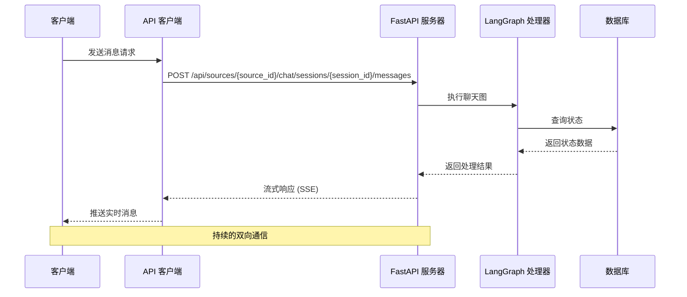

**图表来源**
- [frontend/src/lib/api/source-chat.ts](file://frontend/src/lib/api/source-chat.ts#L48-L84)
- [api/routers/source_chat.py](file://api/routers/source_chat.py#L478-L550)

### 消息格式和事件类型

系统定义了标准的消息格式和事件类型：

| 事件类型 | 描述 | 数据结构 |
|---------|------|----------|
| `user_message` | 用户发送的消息 | `{ type: "user_message", content: string, timestamp: string }` |
| `ai_message` | AI 响应消息 | `{ type: "ai_message", content: string, timestamp: string }` |
| `context_indicators` | 上下文指示器 | `{ type: "context_indicators", data: ContextIndicator }` |
| `complete` | 传输完成信号 | `{ type: "complete" }` |
| `error` | 错误事件 | `{ type: "error", message: string }` |

**章节来源**
- [frontend/src/lib/types/api.ts](file://frontend/src/lib/types/api.ts#L181-L187)
- [api/routers/source_chat.py](file://api/routers/source_chat.py#L415-L476)

## 架构概览

### 整体系统架构

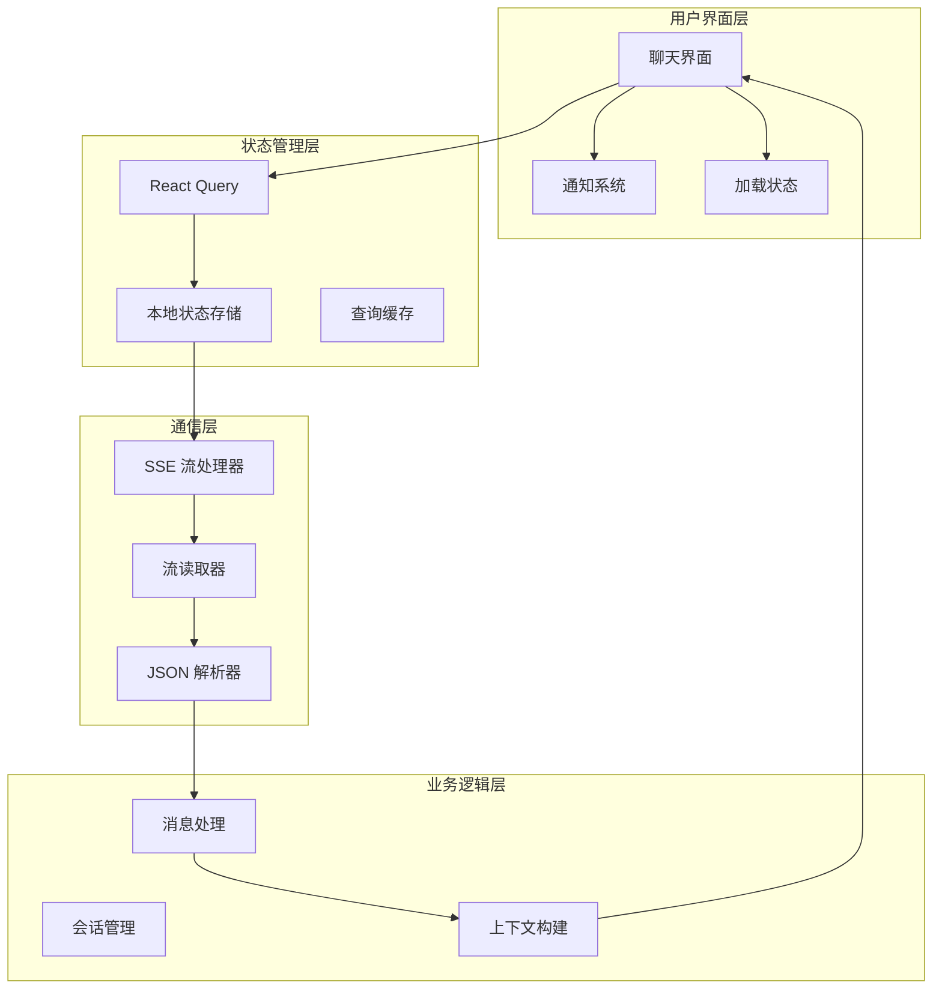

**图表来源**
- [frontend/src/lib/hooks/useSourceChat.ts](file://frontend/src/lib/hooks/useSourceChat.ts#L1-L252)
- [frontend/src/lib/api/source-chat.ts](file://frontend/src/lib/api/source-chat.ts#L1-L86)

### 连接生命周期管理

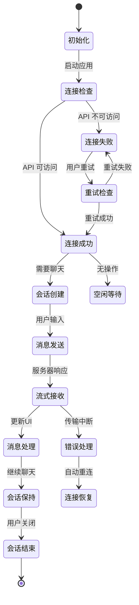

**图表来源**
- [frontend/src/lib/hooks/useSourceChat.ts](file://frontend/src/lib/hooks/useSourceChat.ts#L104-L201)
- [frontend/src/components/common/ConnectionGuard.tsx](file://frontend/src/components/common/ConnectionGuard.tsx#L12-L108)

## 详细组件分析

### 前端 API 客户端

#### 源聊天 API 客户端

源聊天 API 客户端提供了完整的实时通信接口：

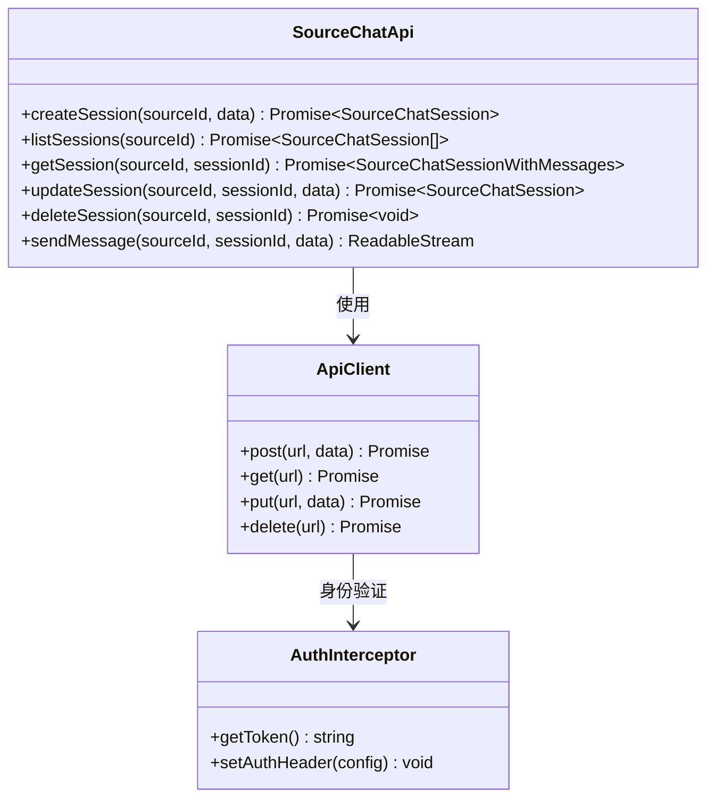

**图表来源**
- [frontend/src/lib/api/source-chat.ts](file://frontend/src/lib/api/source-chat.ts#L10-L85)
- [frontend/src/lib/api/client.ts](file://frontend/src/lib/api/client.ts#L1-L66)

#### 自定义 Hook 实现

useSourceChat Hook 提供了完整的实时聊天功能：

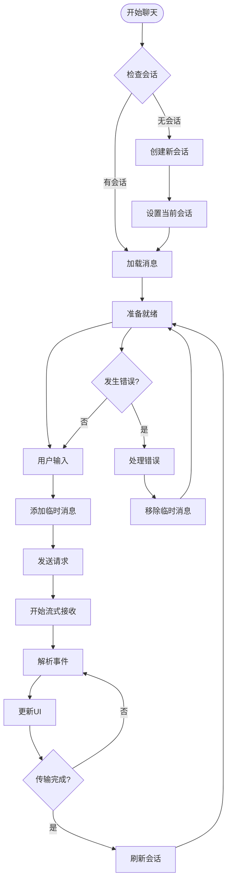

**图表来源**
- [frontend/src/lib/hooks/useSourceChat.ts](file://frontend/src/lib/hooks/useSourceChat.ts#L104-L201)

**章节来源**
- [frontend/src/lib/api/source-chat.ts](file://frontend/src/lib/api/source-chat.ts#L1-L86)
- [frontend/src/lib/hooks/useSourceChat.ts](file://frontend/src/lib/hooks/useSourceChat.ts#L1-L252)

### 后端路由处理器

#### 源聊天路由实现

后端使用 FastAPI 实现了完整的 SSE 流式响应：

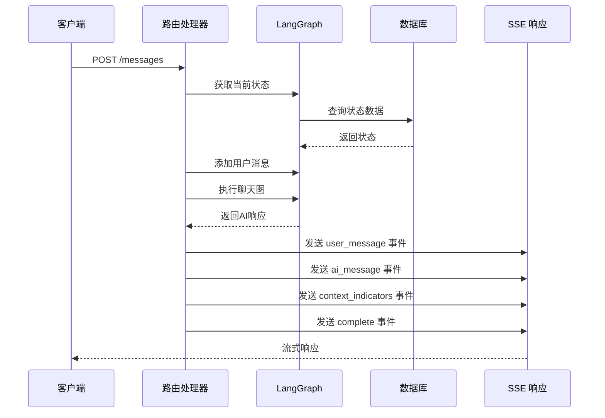

**图表来源**
- [api/routers/source_chat.py](file://api/routers/source_chat.py#L415-L476)

#### 会话管理机制

后端实现了完整的会话生命周期管理：

| 操作 | 端点 | 方法 | 功能描述 |
|------|------|------|----------|
| 创建会话 | `/sources/{source_id}/chat/sessions` | POST | 创建新的聊天会话 |
| 获取会话列表 | `/sources/{source_id}/chat/sessions` | GET | 获取源的所有会话 |
| 获取会话详情 | `/sources/{source_id}/chat/sessions/{session_id}` | GET | 获取会话及其消息 |
| 更新会话 | `/sources/{source_id}/chat/sessions/{session_id}` | PUT | 更新会话标题或模型 |
| 删除会话 | `/sources/{source_id}/chat/sessions/{session_id}` | DELETE | 删除指定会话 |
| 发送消息 | `/sources/{source_id}/chat/sessions/{session_id}/messages` | POST | 发送消息并获取流式响应 |

**章节来源**
- [api/routers/source_chat.py](file://api/routers/source_chat.py#L87-L413)

### 认证和授权

系统使用 Bearer Token 进行身份验证：

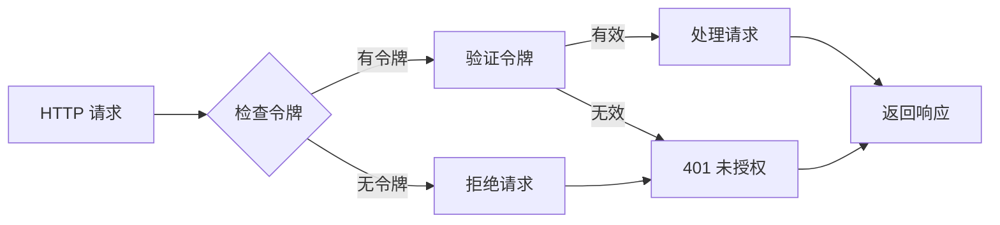

**图表来源**
- [frontend/src/lib/api/client.ts](file://frontend/src/lib/api/client.ts#L26-L38)

**章节来源**
- [frontend/src/lib/api/client.ts](file://frontend/src/lib/api/client.ts#L1-L66)

## 依赖关系分析

### 组件依赖图

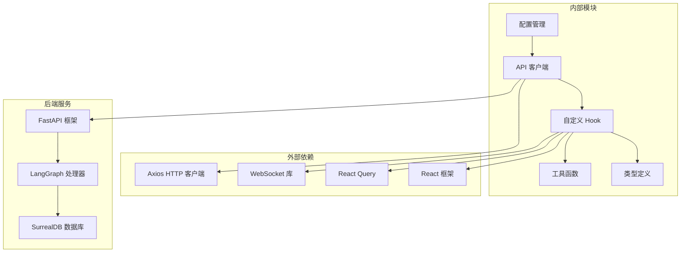

**图表来源**
- [frontend/src/lib/config.ts](file://frontend/src/lib/config.ts#L1-L149)
- [frontend/src/lib/api/client.ts](file://frontend/src/lib/api/client.ts#L1-L66)

### 错误处理和重试机制

系统实现了多层次的错误处理和重试机制：

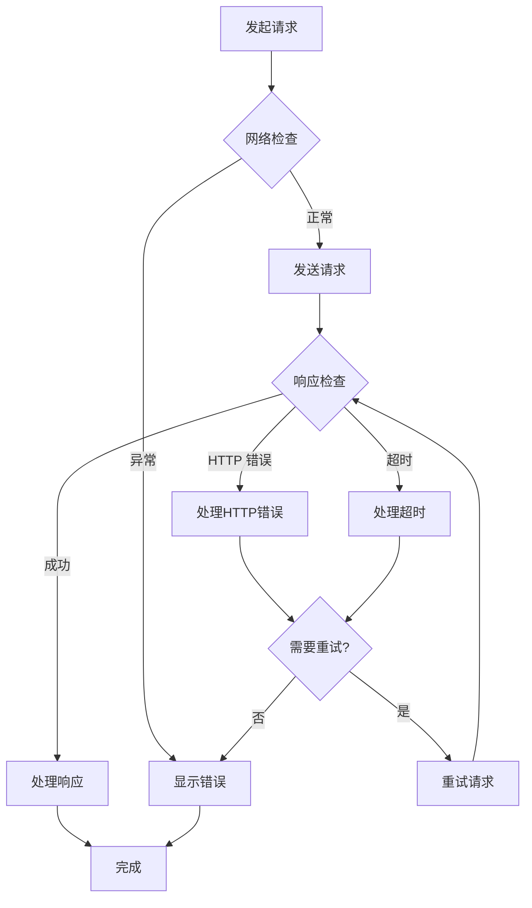

**图表来源**
- [frontend/src/lib/hooks/useSourceChat.ts](file://frontend/src/lib/hooks/useSourceChat.ts#L190-L201)
- [frontend/src/components/common/ConnectionGuard.tsx](file://frontend/src/components/common/ConnectionGuard.tsx#L18-L76)

**章节来源**
- [frontend/src/lib/hooks/useSourceChat.ts](file://frontend/src/lib/hooks/useSourceChat.ts#L1-L252)
- [frontend/src/components/common/ConnectionGuard.tsx](file://frontend/src/components/common/ConnectionGuard.tsx#L1-L108)

## 性能考虑

### 连接优化策略

系统采用了多种性能优化策略：

1. **连接池管理**: 使用持久连接减少连接建立开销
2. **流式处理**: 采用 SSE 流式响应避免大体积数据传输
3. **缓存策略**: React Query 实现智能缓存和自动刷新
4. **并发控制**: 限制同时进行的请求数量
5. **资源清理**: 自动清理未使用的连接和内存

### 内存管理

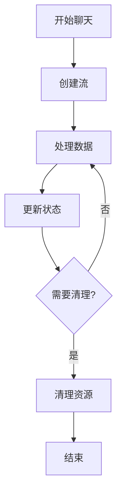

**图表来源**
- [frontend/src/lib/hooks/useSourceChat.ts](file://frontend/src/lib/hooks/useSourceChat.ts#L204-L209)

### 并发控制

系统实现了以下并发控制机制：

- **请求去重**: 防止重复发送相同请求
- **会话隔离**: 每个会话独立管理其状态
- **资源限制**: 控制同时活跃的连接数量
- **超时管理**: 设置合理的请求超时时间

## 故障排除指南

### 常见问题诊断

#### 连接问题

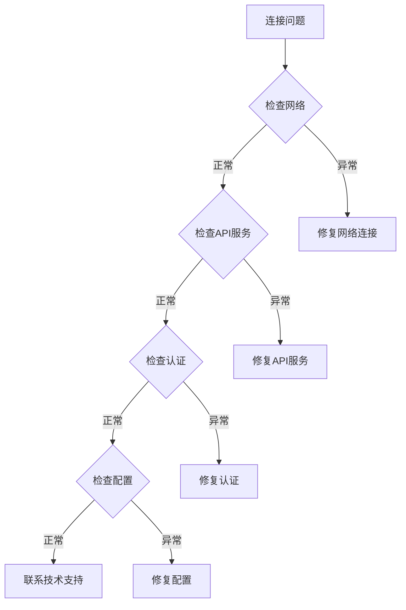

#### 错误事件处理

系统定义了完整的错误事件处理机制：

| 错误类型 | 触发条件 | 处理方式 |
|----------|----------|----------|
| `api-unreachable` | API 无法访问 | 显示连接错误界面，提供重试选项 |
| `database-offline` | 数据库离线 | 显示数据库错误界面，建议检查数据库服务 |
| `stream-error` | 流传输错误 | 自动重连，显示错误通知 |
| `timeout-error` | 请求超时 | 重试请求，增加超时时间 |
| `authentication-error` | 认证失败 | 清除认证信息，跳转登录页面 |

**章节来源**
- [frontend/src/components/errors/ConnectionErrorOverlay.tsx](file://frontend/src/components/errors/ConnectionErrorOverlay.tsx#L1-L176)
- [frontend/src/components/common/ConnectionGuard.tsx](file://frontend/src/components/common/ConnectionGuard.tsx#L1-L108)

### 调试技巧

1. **启用调试模式**: 在开发环境中启用详细的日志记录
2. **检查网络请求**: 使用浏览器开发者工具监控网络活动
3. **验证认证令牌**: 确保 Bearer Token 正确设置和有效
4. **监控流状态**: 检查 SSE 连接是否正常建立和维护
5. **数据库连接**: 验证数据库连接参数和权限设置

## 结论

Open Notebook 的实时通信系统通过精心设计的架构实现了高效、可靠的实时聊天功能。系统采用 SSE 技术替代传统的 WebSocket，提供了更好的兼容性和更低的复杂度。

### 主要优势

1. **简单可靠**: SSE 技术栈简单，易于维护和扩展
2. **高性能**: 流式响应避免了大体积数据传输的开销
3. **容错性强**: 完善的错误处理和重试机制确保系统稳定性
4. **用户体验佳**: 实时消息传输提供流畅的交互体验

### 未来改进方向

1. **WebSocket 支持**: 考虑在未来版本中添加原生 WebSocket 支持
2. **连接池优化**: 进一步优化连接池管理和资源复用
3. **监控增强**: 添加更详细的性能监控和指标收集
4. **扩展性提升**: 设计支持大规模并发连接的架构

该系统为实时通信应用提供了一个优秀的参考实现，展示了如何在保证功能完整性的同时实现简洁高效的架构设计。