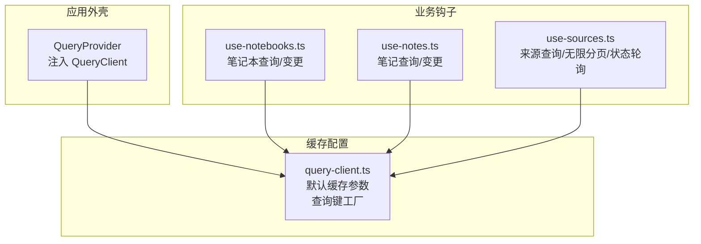
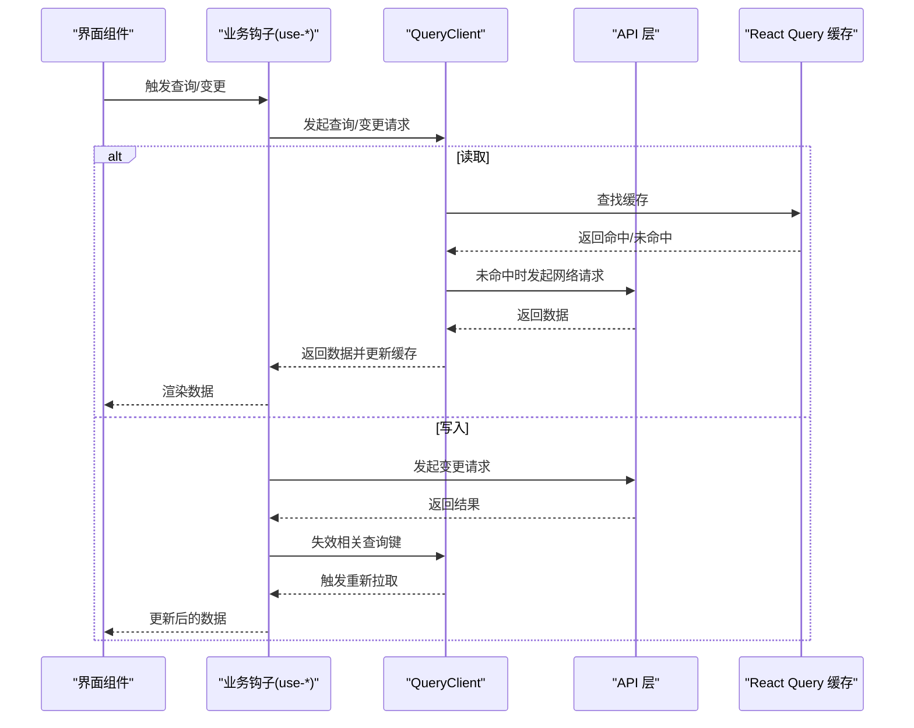
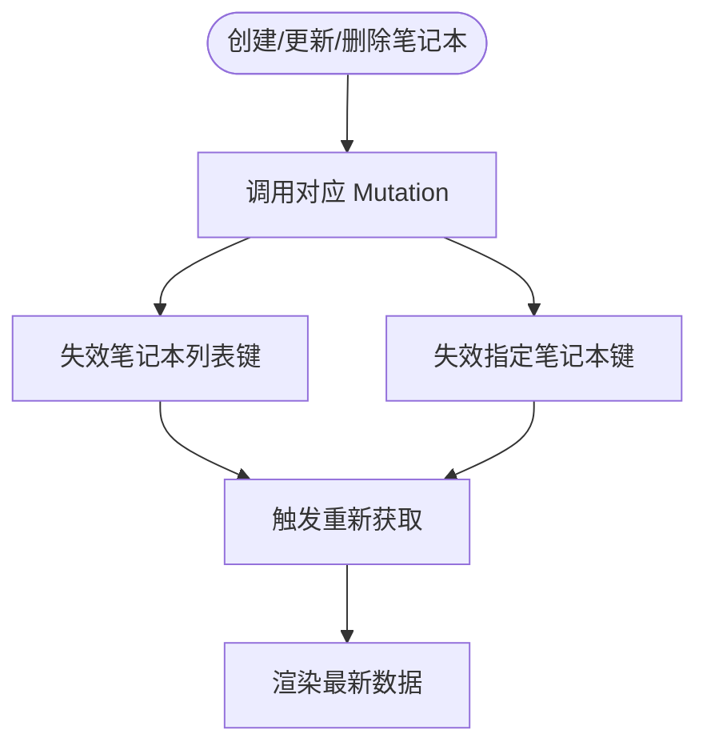
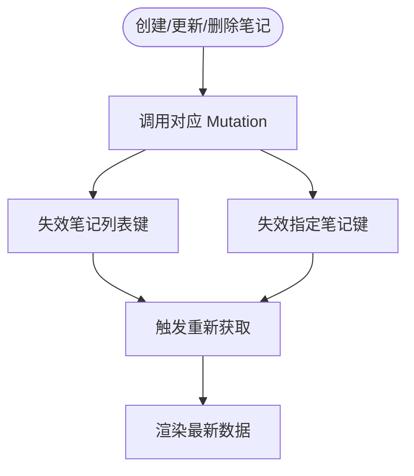
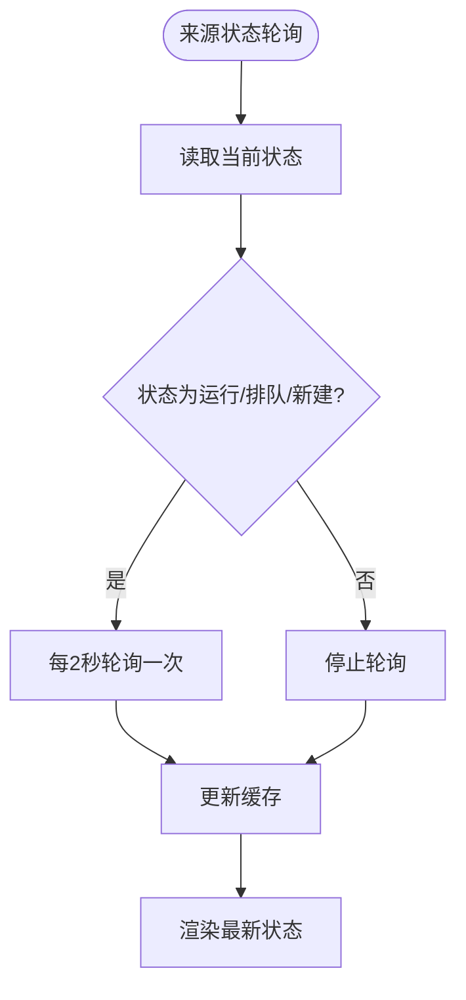
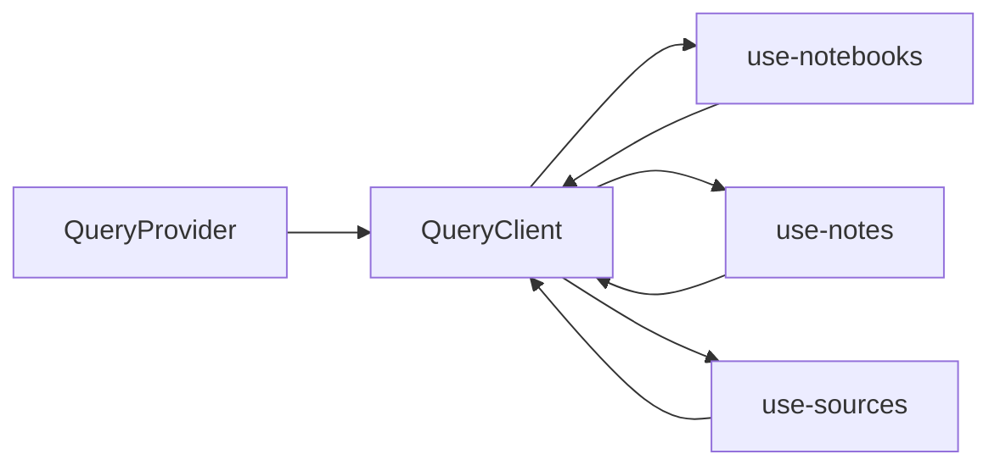

# 数据缓存

<cite>
**本文引用的文件**
- [frontend/src/components/providers/QueryProvider.tsx](file://frontend/src/components/providers/QueryProvider.tsx)
- [frontend/src/lib/api/query-client.ts](file://frontend/src/lib/api/query-client.ts)
- [frontend/src/lib/hooks/use-notebooks.ts](file://frontend/src/lib/hooks/use-notebooks.ts)
- [frontend/src/lib/hooks/use-notes.ts](file://frontend/src/lib/hooks/use-notes.ts)
- [frontend/src/lib/hooks/use-sources.ts](file://frontend/src/lib/hooks/use-sources.ts)
</cite>

## 目录
1. [简介](#简介)
2. [项目结构](#项目结构)
3. [核心组件](#核心组件)
4. [架构总览](#架构总览)
5. [详细组件分析](#详细组件分析)
6. [依赖关系分析](#依赖关系分析)
7. [性能考量](#性能考量)
8. [故障排查指南](#故障排查指南)
9. [结论](#结论)
10. [附录](#附录)

## 简介
本文件系统性梳理 Open Notebook 前端的数据缓存策略，围绕 React Query 的缓存配置、缓存键设计与失效策略展开；同时结合实际代码实现，说明本地状态管理、内存缓存与持久化存储的边界，覆盖缓存更新机制、并发控制与数据一致性保障，并给出性能优化、内存管理与垃圾回收建议，以及调试与监控方法。

## 项目结构
前端采用按功能域组织的结构：页面路由位于 app 目录，UI 组件与业务逻辑位于 components 与 lib 目录。与缓存相关的关键位置如下：
- 提供者层：在 providers 中通过 QueryProvider 注入全局 QueryClient
- 缓存配置：lib/api/query-client.ts 定义默认缓存参数与查询键工厂
- 业务钩子：lib/hooks 下的 use-*.ts 将查询键与 API 调用绑定，并在变更后进行精确失效

图表来源
- [frontend/src/components/providers/QueryProvider.tsx](file://frontend/src/components/providers/QueryProvider.tsx#L1-L16)
- [frontend/src/lib/api/query-client.ts](file://frontend/src/lib/api/query-client.ts#L1-L35)
- [frontend/src/lib/hooks/use-notebooks.ts](file://frontend/src/lib/hooks/use-notebooks.ts#L1-L112)
- [frontend/src/lib/hooks/use-notes.ts](file://frontend/src/lib/hooks/use-notes.ts#L1-L102)
- [frontend/src/lib/hooks/use-sources.ts](file://frontend/src/lib/hooks/use-sources.ts#L1-L375)

章节来源
- [frontend/src/components/providers/QueryProvider.tsx](file://frontend/src/components/providers/QueryProvider.tsx#L1-L16)
- [frontend/src/lib/api/query-client.ts](file://frontend/src/lib/api/query-client.ts#L1-L35)

## 核心组件
- 全局缓存客户端
  - 默认参数：查询过期时间、垃圾回收时间、重试次数、窗口焦点重取等
  - 查询键工厂：统一生成可序列化的查询键，便于精确失效
- 业务钩子
  - 使用 useQuery/useMutation/useInfiniteQuery 管理读写操作
  - 在成功回调中使用 queryClient.invalidateQueries 进行细粒度失效
  - 针对实时场景（来源状态）使用 refetchInterval 与自定义 staleTime

章节来源
- [frontend/src/lib/api/query-client.ts](file://frontend/src/lib/api/query-client.ts#L3-L15)
- [frontend/src/lib/api/query-client.ts](file://frontend/src/lib/api/query-client.ts#L17-L34)
- [frontend/src/lib/hooks/use-notebooks.ts](file://frontend/src/lib/hooks/use-notebooks.ts#L1-L112)
- [frontend/src/lib/hooks/use-notes.ts](file://frontend/src/lib/hooks/use-notes.ts#L1-L102)
- [frontend/src/lib/hooks/use-sources.ts](file://frontend/src/lib/hooks/use-sources.ts#L1-L375)

## 架构总览
React Query 在应用入口注入为全局缓存层，业务层通过钩子以“查询键 + API 调用”的方式读取或写入缓存。变更操作通过精确失效确保多视图一致。

图表来源
- [frontend/src/components/providers/QueryProvider.tsx](file://frontend/src/components/providers/QueryProvider.tsx#L10-L16)
- [frontend/src/lib/api/query-client.ts](file://frontend/src/lib/api/query-client.ts#L3-L15)
- [frontend/src/lib/hooks/use-notebooks.ts](file://frontend/src/lib/hooks/use-notebooks.ts#L24-L46)
- [frontend/src/lib/hooks/use-notes.ts](file://frontend/src/lib/hooks/use-notes.ts#L26-L50)
- [frontend/src/lib/hooks/use-sources.ts](file://frontend/src/lib/hooks/use-sources.ts#L89-L139)

## 详细组件分析

### 缓存配置与查询键设计
- 默认缓存参数
  - 查询过期时间、垃圾回收时间、重试次数、窗口焦点重取等均在全局配置中设定，形成一致的缓存行为基线
- 查询键工厂
  - 以数组形式表达层级关系，支持可选参数（如笔记本 ID、分页参数）
  - 通过函数式工厂生成带参数的键，便于在不同页面或列表中区分缓存条目
- 键设计原则
  - 基于资源类型与标识符组合，避免跨资源键冲突
  - 对于分页/无限滚动场景，将“分页”维度纳入键，防止不同页间污染
  - 对于实时状态，使用独立键并配合 refetchInterval

章节来源
- [frontend/src/lib/api/query-client.ts](file://frontend/src/lib/api/query-client.ts#L3-L15)
- [frontend/src/lib/api/query-client.ts](file://frontend/src/lib/api/query-client.ts#L17-L34)

### 笔记本缓存策略
- 列表与详情
  - 列表查询键包含“归档”过滤条件，避免不同筛选下缓存混淆
  - 详情查询键包含 ID，启用条件加载（当 ID 存在时才发起请求）
- 变更与失效
  - 创建/更新/删除后，分别失效对应列表与单条记录键
  - 删除笔记本时，额外失效来源列表，避免残留关联数据
- 并发与一致性
  - 通过精确失效保证多个视图同步更新
  - 列表查询在窗口焦点时自动重取，提升一致性

图表来源
- [frontend/src/lib/hooks/use-notebooks.ts](file://frontend/src/lib/hooks/use-notebooks.ts#L24-L46)
- [frontend/src/lib/hooks/use-notebooks.ts](file://frontend/src/lib/hooks/use-notebooks.ts#L82-L112)

章节来源
- [frontend/src/lib/hooks/use-notebooks.ts](file://frontend/src/lib/hooks/use-notebooks.ts#L9-L22)
- [frontend/src/lib/hooks/use-notebooks.ts](file://frontend/src/lib/hooks/use-notebooks.ts#L24-L46)
- [frontend/src/lib/hooks/use-notebooks.ts](file://frontend/src/lib/hooks/use-notebooks.ts#L82-L112)

### 笔记缓存策略
- 列表与详情
  - 列表查询键包含笔记本 ID，启用条件加载
  - 详情查询键包含 ID，支持显式禁用加载
- 变更与失效
  - 创建/更新/删除后，分别失效对应列表与单条记录键
  - 删除时失效通用“笔记”键，避免遗漏
- 并发与一致性
  - 通过精确失效与自动重取，保证多视图一致性

图表来源
- [frontend/src/lib/hooks/use-notes.ts](file://frontend/src/lib/hooks/use-notes.ts#L26-L50)
- [frontend/src/lib/hooks/use-notes.ts](file://frontend/src/lib/hooks/use-notes.ts#L52-L76)
- [frontend/src/lib/hooks/use-notes.ts](file://frontend/src/lib/hooks/use-notes.ts#L78-L102)

章节来源
- [frontend/src/lib/hooks/use-notes.ts](file://frontend/src/lib/hooks/use-notes.ts#L9-L24)
- [frontend/src/lib/hooks/use-notes.ts](file://frontend/src/lib/hooks/use-notes.ts#L26-L50)
- [frontend/src/lib/hooks/use-notes.ts](file://frontend/src/lib/hooks/use-notes.ts#L78-L102)

### 来源缓存策略（含无限分页与实时状态）
- 列表与无限分页
  - 普通列表：基于笔记本 ID 的查询键，短过期时间与窗口焦点重取
  - 无限分页：使用 useInfiniteQuery，键包含“无限”维度与笔记本 ID；通过 flatMap 合并页数据
- 单条来源
  - 查询键包含 ID，短过期时间与窗口焦点重取
- 实时状态
  - 使用 refetchInterval 动态轮询，依据状态值决定轮询间隔
  - 状态键独立，staleTime 设为 0 以保证实时性
  - 自定义重试策略，避免对 404 的无效重试
- 变更与失效
  - 创建/更新/删除后，失效通用“来源”键与具体来源键
  - 批量添加/移除来源时，失效所有来源键并针对受影响来源单独失效
- 并发与一致性
  - 通过 refetchType: 'active' 强制立即刷新受影响的活跃查询
  - 无限分页提供 refetch 重置到第一页的能力

图表来源
- [frontend/src/lib/hooks/use-sources.ts](file://frontend/src/lib/hooks/use-sources.ts#L222-L247)

章节来源
- [frontend/src/lib/hooks/use-sources.ts](file://frontend/src/lib/hooks/use-sources.ts#L18-L26)
- [frontend/src/lib/hooks/use-sources.ts](file://frontend/src/lib/hooks/use-sources.ts#L32-L77)
- [frontend/src/lib/hooks/use-sources.ts](file://frontend/src/lib/hooks/use-sources.ts#L79-L87)
- [frontend/src/lib/hooks/use-sources.ts](file://frontend/src/lib/hooks/use-sources.ts#L222-L247)
- [frontend/src/lib/hooks/use-sources.ts](file://frontend/src/lib/hooks/use-sources.ts#L89-L139)
- [frontend/src/lib/hooks/use-sources.ts](file://frontend/src/lib/hooks/use-sources.ts#L141-L166)
- [frontend/src/lib/hooks/use-sources.ts](file://frontend/src/lib/hooks/use-sources.ts#L168-L193)
- [frontend/src/lib/hooks/use-sources.ts](file://frontend/src/lib/hooks/use-sources.ts#L280-L340)
- [frontend/src/lib/hooks/use-sources.ts](file://frontend/src/lib/hooks/use-sources.ts#L342-L375)

### 本地状态管理、内存缓存与持久化存储
- 本地状态管理
  - React Query 作为集中式缓存，替代传统组件内局部状态
  - 通过查询键与失效策略，避免跨组件状态同步难题
- 内存缓存
  - 默认 GC 时间与过期时间由全局配置统一管理
  - 无限分页与实时轮询会增加内存占用，需结合业务场景调整 staleTime/gcTime
- 持久化存储
  - 仓库未见浏览器端持久化存储实现；缓存主要驻留在内存中
  - 若需跨会话保留，可在业务层引入本地存储并在应用启动时回填缓存

章节来源
- [frontend/src/lib/api/query-client.ts](file://frontend/src/lib/api/query-client.ts#L3-L15)

### 缓存更新机制、并发控制与数据一致性
- 更新机制
  - 写操作完成后，使用 queryClient.invalidateQueries 对相关键进行失效
  - 对于批量操作，使用 Promise.allSettled 并在成功回调中统一失效
- 并发控制
  - 同一查询键的并发请求由 React Query 自动合并
  - 通过 refetchType: 'active' 强制活跃查询立即刷新
- 数据一致性
  - 窗口焦点重取与状态轮询确保 UI 与服务端保持一致
  - 列表/详情键分离避免互相污染

章节来源
- [frontend/src/lib/hooks/use-notebooks.ts](file://frontend/src/lib/hooks/use-notebooks.ts#L31-L37)
- [frontend/src/lib/hooks/use-notes.ts](file://frontend/src/lib/hooks/use-notes.ts#L33-L41)
- [frontend/src/lib/hooks/use-sources.ts](file://frontend/src/lib/hooks/use-sources.ts#L96-L116)
- [frontend/src/lib/hooks/use-sources.ts](file://frontend/src/lib/hooks/use-sources.ts#L289-L299)

### 复杂数据结构与实时更新场景
- 无限分页
  - 使用 useInfiniteQuery 与 getNextPageParam 控制分页游标
  - 通过 useMemo 合并页数据，避免重复渲染
- 实时状态
  - refetchInterval 动态根据状态值调整轮询频率
  - 独立键避免与其他来源状态相互影响
- 批量操作
  - 使用 Promise.allSettled 处理部分失败，保证整体流程可控

章节来源
- [frontend/src/lib/hooks/use-sources.ts](file://frontend/src/lib/hooks/use-sources.ts#L32-L77)
- [frontend/src/lib/hooks/use-sources.ts](file://frontend/src/lib/hooks/use-sources.ts#L222-L247)
- [frontend/src/lib/hooks/use-sources.ts](file://frontend/src/lib/hooks/use-sources.ts#L289-L299)

## 依赖关系分析
- QueryProvider 仅负责注入 QueryClient，不直接参与业务逻辑
- 各业务钩子依赖统一的查询键工厂与全局缓存参数
- API 层通过钩子暴露的查询键进行数据读写，变更后通过失效策略联动更新

图表来源
- [frontend/src/components/providers/QueryProvider.tsx](file://frontend/src/components/providers/QueryProvider.tsx#L10-L16)
- [frontend/src/lib/api/query-client.ts](file://frontend/src/lib/api/query-client.ts#L3-L15)
- [frontend/src/lib/hooks/use-notebooks.ts](file://frontend/src/lib/hooks/use-notebooks.ts#L1-L112)
- [frontend/src/lib/hooks/use-notes.ts](file://frontend/src/lib/hooks/use-notes.ts#L1-L102)
- [frontend/src/lib/hooks/use-sources.ts](file://frontend/src/lib/hooks/use-sources.ts#L1-L375)

章节来源
- [frontend/src/components/providers/QueryProvider.tsx](file://frontend/src/components/providers/QueryProvider.tsx#L1-L16)
- [frontend/src/lib/api/query-client.ts](file://frontend/src/lib/api/query-client.ts#L1-L35)
- [frontend/src/lib/hooks/use-notebooks.ts](file://frontend/src/lib/hooks/use-notebooks.ts#L1-L112)
- [frontend/src/lib/hooks/use-notes.ts](file://frontend/src/lib/hooks/use-notes.ts#L1-L102)
- [frontend/src/lib/hooks/use-sources.ts](file://frontend/src/lib/hooks/use-sources.ts#L1-L375)

## 性能考量
- 默认参数
  - 查询过期时间与垃圾回收时间平衡了新鲜度与内存占用
  - 重试次数限制避免频繁抖动
- 实时场景优化
  - 状态轮询仅在必要时开启，状态稳定后停止
  - 短过期时间与窗口焦点重取提升响应速度
- 无限分页
  - 合理设置分页大小与合并策略，减少不必要的渲染
- 内存与垃圾回收
  - 长时间后台运行时，适当缩短 gcTime 以释放内存
  - 对不常用列表可考虑手动清理或延迟加载

## 故障排查指南
- 常见问题
  - 查询未更新：确认是否正确失效了相关键；检查 enabled 条件是否满足
  - 重复请求：检查查询键是否唯一；避免不必要的键扩展
  - 内存增长：检查无限分页与轮询策略；适当缩短 staleTime/gcTime
- 调试与监控
  - 使用 React Query Devtools 检查缓存命中率、失效链路与重取频率
  - 在日志中打印查询键与状态变化，定位失效范围
  - 对批量操作，记录成功/失败计数，辅助排障

## 结论
本项目通过统一的缓存配置与查询键工厂，结合精确的失效策略，实现了高效、一致且可维护的前端缓存体系。针对实时与无限分页场景，采用动态轮询与分页合并等手段，在性能与体验之间取得良好平衡。建议在后续迭代中引入持久化存储与更精细的监控指标，进一步提升稳定性与可观测性。

## 附录
- 最佳实践清单
  - 明确查询键的层级与参数，避免键冲突
  - 在变更后立即失效相关键，必要时使用 refetchType: 'active'
  - 对实时状态使用独立键与动态轮询，避免干扰其他查询
  - 无限分页使用 getNextPageParam 与合并策略，减少渲染开销
  - 合理设置 staleTime/gcTime，兼顾新鲜度与内存占用
  - 对批量操作使用 Promise.allSettled 并在成功回调中统一失效
  - 引入 Devtools 与日志，持续监控缓存健康度