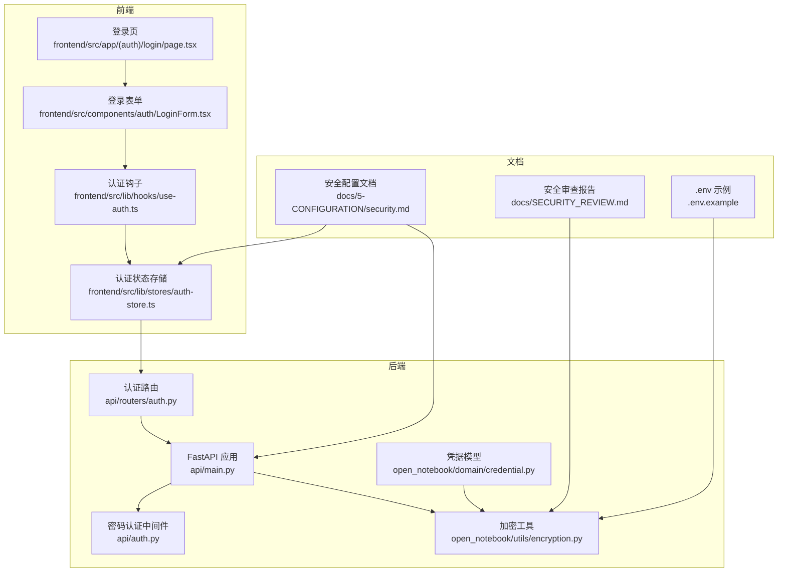
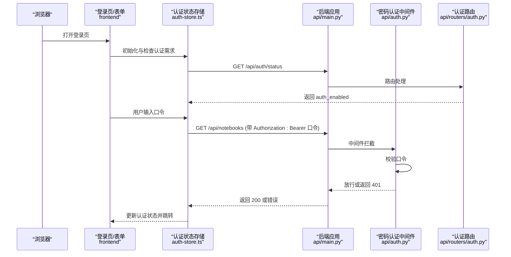
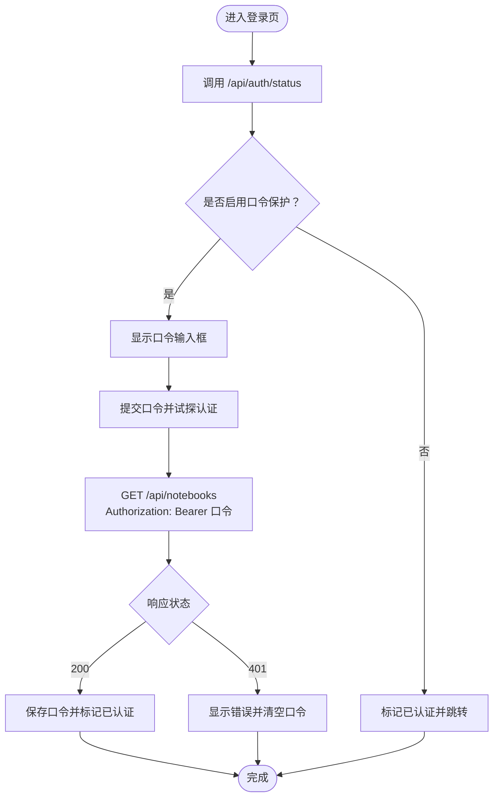
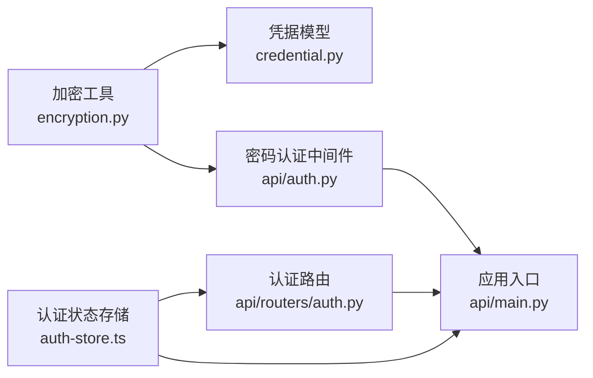

# 认证与授权

<cite>
**本文引用的文件**
- [api/main.py](file://api/main.py)
- [api/auth.py](file://api/auth.py)
- [api/routers/auth.py](file://api/routers/auth.py)
- [open_notebook/utils/encryption.py](file://open_notebook/utils/encryption.py)
- [open_notebook/domain/credential.py](file://open_notebook/domain/credential.py)
- [frontend/src/app/(auth)/login/page.tsx](file://frontend/src/app/(auth)/login/page.tsx)
- [frontend/src/components/auth/LoginForm.tsx](file://frontend/src/components/auth/LoginForm.tsx)
- [frontend/src/lib/stores/auth-store.ts](file://frontend/src/lib/stores/auth-store.ts)
- [frontend/src/lib/hooks/use-auth.ts](file://frontend/src/lib/hooks/use-auth.ts)
- [docs/5-CONFIGURATION/security.md](file://docs/5-CONFIGURATION/security.md)
- [docs/SECURITY_REVIEW.md](file://docs/SECURITY_REVIEW.md)
- [.env.example](file://.env.example)
</cite>

## 目录
1. [简介](#简介)
2. [项目结构](#项目结构)
3. [核心组件](#核心组件)
4. [架构总览](#架构总览)
5. [组件详解](#组件详解)
6. [依赖关系分析](#依赖关系分析)
7. [性能考量](#性能考量)
8. [故障排查指南](#故障排查指南)
9. [结论](#结论)
10. [附录](#附录)

## 简介
本文件系统性阐述 Open Notebook 的认证与授权体系，覆盖登录流程、令牌管理与会话维护、密码加密与安全存储、传输保护、API 访问控制与 CORS 配置、以及常见安全问题的预防与解决。当前实现采用“口令保护”模式：所有受保护路由均要求在请求头中携带 Bearer 口令；该口令即为服务端配置的密码。系统未内置 JWT 令牌生成与刷新机制，也不支持多因素认证、角色与权限模型、会话超时与自动登出等高级特性。本文将对现有实现进行深入解析，并给出安全最佳实践与改进建议。

## 项目结构
认证与授权相关代码主要分布在以下位置：
- 后端 FastAPI 应用与中间件：api/main.py、api/auth.py、api/routers/auth.py
- 加密与密钥管理：open_notebook/utils/encryption.py
- 凭据模型与数据库持久化：open_notebook/domain/credential.py
- 前端登录与状态管理：frontend/src/components/auth/LoginForm.tsx、frontend/src/lib/stores/auth-store.ts、frontend/src/lib/hooks/use-auth.ts、frontend/src/app/(auth)/login/page.tsx
- 安全配置与使用说明：docs/5-CONFIGURATION/security.md、docs/SECURITY_REVIEW.md、.env.example

图表来源
- [api/main.py](file://api/main.py#L99-L127)
- [api/auth.py](file://api/auth.py#L12-L75)
- [api/routers/auth.py](file://api/routers/auth.py#L10-L27)
- [open_notebook/utils/encryption.py](file://open_notebook/utils/encryption.py#L29-L126)
- [open_notebook/domain/credential.py](file://open_notebook/domain/credential.py#L29-L199)
- [frontend/src/app/(auth)/login/page.tsx](file://frontend/src/app/(auth)/login/page.tsx#L1-L10)
- [frontend/src/components/auth/LoginForm.tsx](file://frontend/src/components/auth/LoginForm.tsx#L15-L187)
- [frontend/src/lib/stores/auth-store.ts](file://frontend/src/lib/stores/auth-store.ts#L21-L222)
- [frontend/src/lib/hooks/use-auth.ts](file://frontend/src/lib/hooks/use-auth.ts#L7-L68)
- [docs/5-CONFIGURATION/security.md](file://docs/5-CONFIGURATION/security.md#L1-L397)
- [docs/SECURITY_REVIEW.md](file://docs/SECURITY_REVIEW.md#L1-L97)
- [.env.example](file://.env.example#L1-L60)

章节来源
- [api/main.py](file://api/main.py#L99-L127)
- [api/auth.py](file://api/auth.py#L12-L75)
- [api/routers/auth.py](file://api/routers/auth.py#L10-L27)
- [open_notebook/utils/encryption.py](file://open_notebook/utils/encryption.py#L29-L126)
- [open_notebook/domain/credential.py](file://open_notebook/domain/credential.py#L29-L199)
- [frontend/src/app/(auth)/login/page.tsx](file://frontend/src/app/(auth)/login/page.tsx#L1-L10)
- [frontend/src/components/auth/LoginForm.tsx](file://frontend/src/components/auth/LoginForm.tsx#L15-L187)
- [frontend/src/lib/stores/auth-store.ts](file://frontend/src/lib/stores/auth-store.ts#L21-L222)
- [frontend/src/lib/hooks/use-auth.ts](file://frontend/src/lib/hooks/use-auth.ts#L7-L68)
- [docs/5-CONFIGURATION/security.md](file://docs/5-CONFIGURATION/security.md#L1-L397)
- [docs/SECURITY_REVIEW.md](file://docs/SECURITY_REVIEW.md#L1-L97)
- [.env.example](file://.env.example#L1-L60)

## 核心组件
- 密码认证中间件：全局拦截请求，校验 Authorization 头中的 Bearer 口令是否匹配配置的密码；支持排除路径与 CORS 预检请求豁免。
- 认证状态接口：提供 /api/auth/status 查询是否启用口令保护；用于前端判断是否显示登录页。
- 前端认证状态管理：通过 Zustand 存储 token 与认证状态；登录时向受保护端点发起试探请求以验证口令有效性；支持本地持久化与缓存。
- 加密工具：提供对称加密/解密能力，用于 API Key 等敏感数据的数据库存储；支持 Docker 秘钥文件读取。
- 凭据模型：封装 Credential 数据模型，保存与读取时自动加密/解密 API Key 字段。

章节来源
- [api/auth.py](file://api/auth.py#L12-L75)
- [api/routers/auth.py](file://api/routers/auth.py#L13-L27)
- [frontend/src/lib/stores/auth-store.ts](file://frontend/src/lib/stores/auth-store.ts#L37-L140)
- [open_notebook/utils/encryption.py](file://open_notebook/utils/encryption.py#L29-L126)
- [open_notebook/domain/credential.py](file://open_notebook/domain/credential.py#L115-L199)

## 架构总览
下图展示从浏览器到后端 API 的认证交互流程，包括前端登录、状态检查、试探认证、以及后端中间件校验。

图表来源
- [frontend/src/lib/stores/auth-store.ts](file://frontend/src/lib/stores/auth-store.ts#L37-L140)
- [api/routers/auth.py](file://api/routers/auth.py#L13-L27)
- [api/auth.py](file://api/auth.py#L30-L75)
- [api/main.py](file://api/main.py#L105-L118)

## 组件详解

### 登录流程与会话维护
- 前端登录页加载后，先调用 /api/auth/status 判断是否需要口令保护；若不需要则直接标记已认证。
- 用户提交口令后，前端向任一受保护端点发起试探请求（如 GET /api/notebooks），并在请求头中携带 Authorization: Bearer <口令>。
- 若试探成功，前端将口令存入本地持久化存储，标记已认证；若失败，提示错误信息。
- 前端后续访问受保护端点时，自动附加 Authorization 头；响应拦截器在收到 401 时清除本地认证状态并重定向至登录页。

图表来源
- [frontend/src/lib/stores/auth-store.ts](file://frontend/src/lib/stores/auth-store.ts#L37-L140)
- [frontend/src/components/auth/LoginForm.tsx](file://frontend/src/components/auth/LoginForm.tsx#L128-L138)
- [frontend/src/lib/hooks/use-auth.ts](file://frontend/src/lib/hooks/use-auth.ts#L41-L54)

章节来源
- [frontend/src/app/(auth)/login/page.tsx](file://frontend/src/app/(auth)/login/page.tsx#L1-L10)
- [frontend/src/components/auth/LoginForm.tsx](file://frontend/src/components/auth/LoginForm.tsx#L15-L187)
- [frontend/src/lib/stores/auth-store.ts](file://frontend/src/lib/stores/auth-store.ts#L37-L140)
- [frontend/src/lib/hooks/use-auth.ts](file://frontend/src/lib/hooks/use-auth.ts#L7-L68)

### 令牌管理与会话维护
- 当前实现不涉及 JWT 令牌生成与刷新。口令即为会话凭证，存储于前端本地持久化状态中，随浏览器关闭而失效。
- 前端对认证状态进行缓存（默认 30 秒内复用），减少重复试探请求。
- 响应拦截器在 401 时自动清理本地认证状态并跳转登录页，实现“自动登出”。

章节来源
- [frontend/src/lib/stores/auth-store.ts](file://frontend/src/lib/stores/auth-store.ts#L150-L209)
- [frontend/src/lib/hooks/use-auth.ts](file://frontend/src/lib/hooks/use-auth.ts#L56-L59)

### JWT 生成、验证与刷新机制
- 当前代码库未实现基于 JWT 的令牌签发、签名与刷新流程。系统采用“口令即令牌”的简单模式，不提供 JWT 的生成、验证与刷新逻辑。
- 若需引入 JWT，建议在登录成功后签发短期访问令牌与可选刷新令牌，配合后端中间件验证访问令牌，并在过期时允许使用刷新令牌换取新令牌。

章节来源
- [api/auth.py](file://api/auth.py#L12-L75)
- [frontend/src/lib/stores/auth-store.ts](file://frontend/src/lib/stores/auth-store.ts#L77-L140)

### 密码加密、安全存储与传输保护
- API Key 等敏感数据在数据库层采用对称加密存储，使用 Fernet（AES-128-CBC + HMAC-SHA256）。加密密钥来自环境变量，必须显式配置，不提供默认值。
- 加密工具支持 Docker 秘钥文件读取（_FILE 后缀），便于生产部署。
- 文档明确指出：口令传输为明文（务必使用 HTTPS），用户管理为单一口令，无会话超时与审计日志。

章节来源
- [open_notebook/utils/encryption.py](file://open_notebook/utils/encryption.py#L29-L126)
- [open_notebook/domain/credential.py](file://open_notebook/domain/credential.py#L115-L199)
- [docs/5-CONFIGURATION/security.md](file://docs/5-CONFIGURATION/security.md#L1-L397)
- [docs/SECURITY_REVIEW.md](file://docs/SECURITY_REVIEW.md#L1-L97)
- [.env.example](file://.env.example#L8-L10)

### 多因素认证、权限检查与角色管理
- 当前实现未提供多因素认证（MFA）、细粒度权限检查与角色管理。所有受保护端点仅依赖口令校验。
- 如需扩展，可在后端引入用户/角色模型与权限中间件，并结合 JWT 实现基于角色的访问控制（RBAC）。

章节来源
- [api/auth.py](file://api/auth.py#L12-L75)
- [api/main.py](file://api/main.py#L105-L118)

### API 端点访问控制与 CORS 配置
- 全局中间件对所有受保护端点强制要求 Authorization: Bearer 口令；对健康检查与文档端点放行。
- CORS 中间件允许任意来源、凭据、方法与头部；生产环境建议限制允许来源。
- 自定义异常处理器确保错误响应包含 CORS 头部，尤其针对上传类错误。

章节来源
- [api/main.py](file://api/main.py#L105-L154)
- [api/auth.py](file://api/auth.py#L19-L28)

### 认证状态管理、自动登出与安全最佳实践
- 前端使用 Zustand 持久化认证状态；登录成功后缓存口令；30 秒内复用认证结果；401 时自动清理并跳转登录。
- 最佳实践：始终使用 HTTPS；设置强口令；限制暴露端口；防火墙与反向代理加固；定期轮换口令与密钥；监控日志与异常。

章节来源
- [frontend/src/lib/stores/auth-store.ts](file://frontend/src/lib/stores/auth-store.ts#L150-L209)
- [docs/5-CONFIGURATION/security.md](file://docs/5-CONFIGURATION/security.md#L243-L312)

## 依赖关系分析
- 后端应用依赖中间件与认证路由；中间件依赖加密工具读取口令；凭据模型依赖加密工具进行字段加解密。
- 前端依赖认证状态存储与钩子，通过认证路由与受保护端点完成试探认证。

图表来源
- [open_notebook/utils/encryption.py](file://open_notebook/utils/encryption.py#L29-L126)
- [open_notebook/domain/credential.py](file://open_notebook/domain/credential.py#L115-L199)
- [api/auth.py](file://api/auth.py#L12-L75)
- [api/main.py](file://api/main.py#L99-L127)
- [api/routers/auth.py](file://api/routers/auth.py#L10-L27)
- [frontend/src/lib/stores/auth-store.ts](file://frontend/src/lib/stores/auth-store.ts#L37-L140)

章节来源
- [open_notebook/utils/encryption.py](file://open_notebook/utils/encryption.py#L29-L126)
- [open_notebook/domain/credential.py](file://open_notebook/domain/credential.py#L115-L199)
- [api/auth.py](file://api/auth.py#L12-L75)
- [api/main.py](file://api/main.py#L99-L127)
- [api/routers/auth.py](file://api/routers/auth.py#L10-L27)
- [frontend/src/lib/stores/auth-store.ts](file://frontend/src/lib/stores/auth-store.ts#L37-L140)

## 性能考量
- 前端认证状态缓存（30 秒）可显著降低试探请求频率，提升用户体验。
- 中间件仅做口令比对，逻辑轻量；建议避免在高并发场景下频繁触发试探请求。
- 生产环境建议开启 HTTPS 与反向代理缓存，减少不必要的后端压力。

## 故障排查指南
- 无法访问受保护端点
  - 确认 Authorization 头格式为 Bearer 口令且与服务端配置一致。
  - 使用 /api/auth/status 检查是否启用口令保护。
- 401 未授权
  - 检查口令是否正确；确认未被代理或网关篡改。
  - 查看后端日志定位中间件拒绝原因。
- CORS 错误
  - 确认自定义异常处理器已生效；若由反向代理提前返回错误，需在代理层添加 CORS 头。
- 无法登录
  - 清理浏览器缓存与持久化存储；尝试隐身/无痕模式；确认口令长度与字符集。
- API Key 无法保存
  - 检查 OPEN_NOTEBOOK_ENCRYPTION_KEY 是否配置；更换密钥会导致旧数据不可读。

章节来源
- [docs/5-CONFIGURATION/security.md](file://docs/5-CONFIGURATION/security.md#L330-L378)
- [api/auth.py](file://api/auth.py#L43-L75)
- [api/main.py](file://api/main.py#L130-L154)

## 结论
Open Notebook 当前采用“口令保护”作为认证与授权方案，具备实现简单、易于部署的特点。其核心优势在于：
- 明确的口令校验与排除路径策略；
- 前端状态持久化与自动登出；
- API Key 的数据库对称加密存储；
- 文档化的安全配置与生产加固建议。

局限性在于：
- 不提供 JWT、MFA、RBAC、会话超时与审计日志；
- 口令传输为明文，需依赖 HTTPS 与网络边界防护。

建议在生产环境中：
- 强制 HTTPS 与反向代理加固；
- 设置强口令与最小暴露面；
- 引入企业级安全能力（SSO、RBAC、审计、限流）以满足更高合规与安全要求。

## 附录
- 环境变量参考与示例：OPEN_NOTEBOOK_ENCRYPTION_KEY、OPEN_NOTEBOOK_PASSWORD 等。
- 安全配置与加固要点：端口绑定、防火墙、反向代理、密钥管理与轮换。

章节来源
- [.env.example](file://.env.example#L8-L10)
- [docs/5-CONFIGURATION/security.md](file://docs/5-CONFIGURATION/security.md#L243-L312)