# 错误处理

<cite>
**本文引用的文件**
- [open_notebook/exceptions.py](file://open_notebook/exceptions.py)
- [api/main.py](file://api/main.py)
- [api/routers/sources.py](file://api/routers/sources.py)
- [open_notebook/database/repository.py](file://open_notebook/database/repository.py)
- [frontend/src/lib/utils/error-handler.ts](file://frontend/src/lib/utils/error-handler.ts)
- [frontend/src/components/common/ErrorBoundary.tsx](file://frontend/src/components/common/ErrorBoundary.tsx)
- [frontend/src/components/errors/ConnectionErrorOverlay.tsx](file://frontend/src/components/errors/ConnectionErrorOverlay.tsx)
- [frontend/src/lib/config.ts](file://frontend/src/lib/config.ts)
- [frontend/src/lib/types/config.ts](file://frontend/src/lib/types/config.ts)
- [frontend/src/lib/api/search.ts](file://frontend/src/lib/api/search.ts)
- [frontend/src/lib/hooks/use-sources.ts](file://frontend/src/lib/hooks/use-sources.ts)
- [commands/source_commands.py](file://commands/source_commands.py)
</cite>

## 目录
1. [简介](#简介)
2. [项目结构](#项目结构)
3. [核心组件](#核心组件)
4. [架构总览](#架构总览)
5. [详细组件分析](#详细组件分析)
6. [依赖关系分析](#依赖关系分析)
7. [性能考量](#性能考量)
8. [故障排查指南](#故障排查指南)
9. [结论](#结论)
10. [附录](#附录)

## 简介
本文件系统化梳理 Open Notebook 的错误处理体系，覆盖全局错误边界、网络错误捕获与 API 错误响应、错误分类与错误码映射、用户友好提示、重试与降级策略、故障转移、错误日志与监控告警、诊断信息收集，以及开发与生产环境差异。目标是帮助开发者与运维人员在不同阶段都能以一致、可预期的方式处理异常，提升系统的稳定性与用户体验。

## 项目结构
错误处理涉及三层：
- 后端（FastAPI）：统一异常处理、CORS 错误响应头、路由层错误包装
- 前端（Next.js + React）：全局错误边界、连接错误 Overlay、API 层错误格式化与 i18n 映射、查询状态重试
- 命令执行（Python）：命令层重试策略与幂等性控制

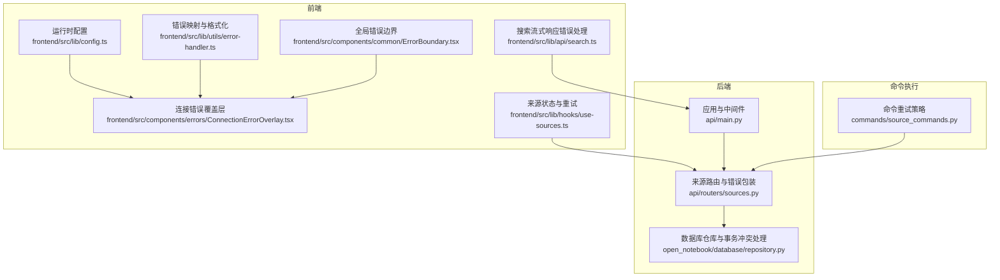

图表来源
- [frontend/src/lib/config.ts](file://frontend/src/lib/config.ts#L22-L140)
- [frontend/src/lib/utils/error-handler.ts](file://frontend/src/lib/utils/error-handler.ts#L1-L69)
- [frontend/src/components/common/ErrorBoundary.tsx](file://frontend/src/components/common/ErrorBoundary.tsx#L1-L105)
- [frontend/src/components/errors/ConnectionErrorOverlay.tsx](file://frontend/src/components/errors/ConnectionErrorOverlay.tsx#L1-L176)
- [frontend/src/lib/hooks/use-sources.ts](file://frontend/src/lib/hooks/use-sources.ts#L231-L271)
- [frontend/src/lib/api/search.ts](file://frontend/src/lib/api/search.ts#L38-L62)
- [api/main.py](file://api/main.py#L129-L154)
- [api/routers/sources.py](file://api/routers/sources.py#L938-L1020)
- [open_notebook/database/repository.py](file://open_notebook/database/repository.py#L170-L195)
- [commands/source_commands.py](file://commands/source_commands.py#L182-L222)

章节来源
- [frontend/src/lib/config.ts](file://frontend/src/lib/config.ts#L22-L140)
- [api/main.py](file://api/main.py#L129-L154)
- [api/routers/sources.py](file://api/routers/sources.py#L938-L1020)
- [open_notebook/database/repository.py](file://open_notebook/database/repository.py#L170-L195)
- [frontend/src/lib/utils/error-handler.ts](file://frontend/src/lib/utils/error-handler.ts#L1-L69)
- [frontend/src/components/common/ErrorBoundary.tsx](file://frontend/src/components/common/ErrorBoundary.tsx#L1-L105)
- [frontend/src/components/errors/ConnectionErrorOverlay.tsx](file://frontend/src/components/errors/ConnectionErrorOverlay.tsx#L1-L176)
- [frontend/src/lib/hooks/use-sources.ts](file://frontend/src/lib/hooks/use-sources.ts#L231-L271)
- [frontend/src/lib/api/search.ts](file://frontend/src/lib/api/search.ts#L38-L62)
- [commands/source_commands.py](file://commands/source_commands.py#L182-L222)

## 核心组件
- 全局错误边界（React）：捕获前端渲染错误，提供“重试”“刷新页面”入口，开发模式下显示错误详情，避免整页崩溃
- 连接错误覆盖层（React）：区分 API 不可达与数据库离线，提供排障建议、技术细节折叠面板、重试按钮
- API 错误映射与格式化（React）：将后端英文错误消息映射为 i18n key，支持精确与前缀匹配，统一格式化错误文本
- 应用与中间件（FastAPI）：自定义 HTTP 异常处理器确保 CORS 头在错误响应中生效；路由层对业务异常进行包装并记录日志
- 数据库仓库（Python）：对事务冲突进行调试级别日志与可重试处理，其他异常统一转为运行时错误
- 命令重试（Python）：命令装饰器提供指数抖动退避、最大尝试次数、停止条件（如验证类错误不重试）
- 查询状态重试（React Query）：来源状态轮询在失败时自动重试，404 不重试，避免无效请求

章节来源
- [frontend/src/components/common/ErrorBoundary.tsx](file://frontend/src/components/common/ErrorBoundary.tsx#L23-L97)
- [frontend/src/components/errors/ConnectionErrorOverlay.tsx](file://frontend/src/components/errors/ConnectionErrorOverlay.tsx#L20-L175)
- [frontend/src/lib/utils/error-handler.ts](file://frontend/src/lib/utils/error-handler.ts#L34-L68)
- [api/main.py](file://api/main.py#L130-L154)
- [open_notebook/database/repository.py](file://open_notebook/database/repository.py#L180-L194)
- [commands/source_commands.py](file://commands/source_commands.py#L182-L222)
- [frontend/src/lib/hooks/use-sources.ts](file://frontend/src/lib/hooks/use-sources.ts#L238-L245)

## 架构总览
整体错误处理流程如下：
- 前端通过运行时配置确定 API 地址，发起请求
- 后端统一异常处理器保证错误响应包含 CORS 头
- 路由层捕获业务异常并返回标准错误体
- 前端根据响应状态与内容格式化错误，映射到 i18n key 并展示连接错误覆盖层或通用错误提示
- 对于可恢复的网络/服务问题，前端触发重试或命令层指数抖动重试
- 数据库事务冲突按需重试，非冲突错误统一转为运行时错误

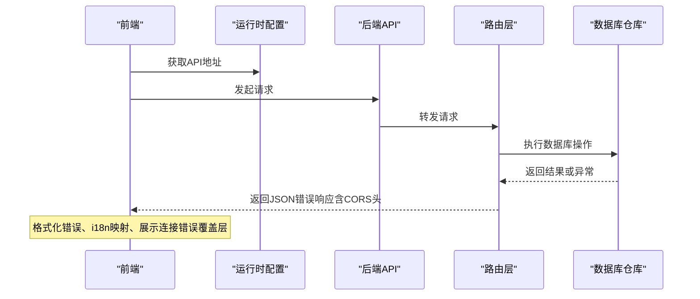

图表来源
- [frontend/src/lib/config.ts](file://frontend/src/lib/config.ts#L59-L140)
- [api/main.py](file://api/main.py#L130-L154)
- [api/routers/sources.py](file://api/routers/sources.py#L938-L1020)
- [open_notebook/database/repository.py](file://open_notebook/database/repository.py#L170-L195)

## 详细组件分析

### 全局错误边界（前端）
- 功能：捕获子树渲染错误，阻止错误冒泡至整页，提供“重试”“刷新页面”按钮
- 开发模式：显示错误堆栈与详情，便于定位问题
- 使用场景：根组件包裹，确保关键 UI 出错时仍可恢复

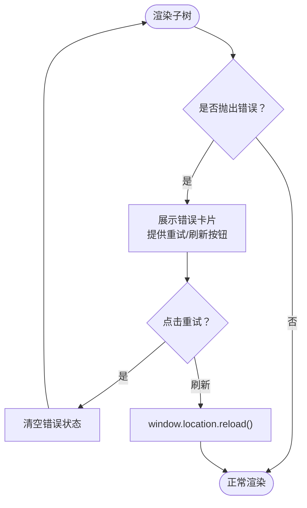

图表来源
- [frontend/src/components/common/ErrorBoundary.tsx](file://frontend/src/components/common/ErrorBoundary.tsx#L23-L97)

章节来源
- [frontend/src/components/common/ErrorBoundary.tsx](file://frontend/src/components/common/ErrorBoundary.tsx#L23-L97)

### 连接错误覆盖层（前端）
- 功能：区分 API 不可达与数据库离线，提供排障步骤、快速修复建议、技术细节折叠面板、重试按钮
- 技术细节：可展示尝试的 URL、消息、技术消息、堆栈，便于诊断
- 使用场景：首次加载或网络波动导致的连接失败

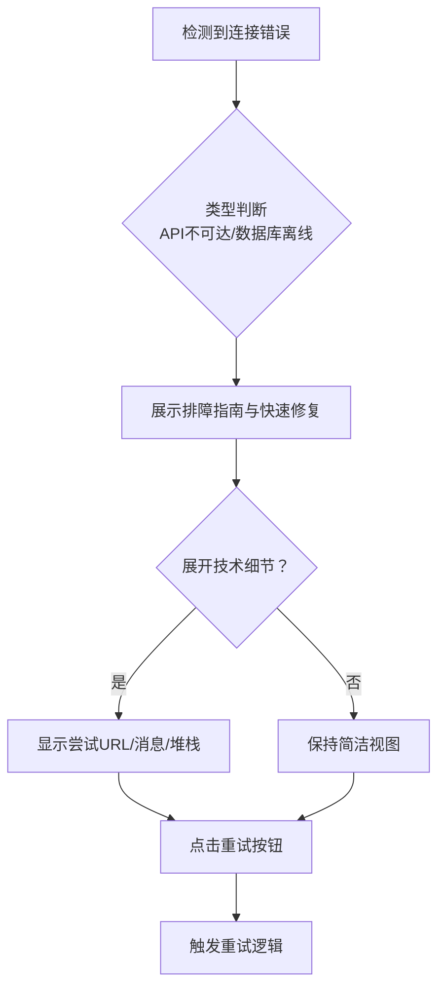

图表来源
- [frontend/src/components/errors/ConnectionErrorOverlay.tsx](file://frontend/src/components/errors/ConnectionErrorOverlay.tsx#L20-L175)
- [frontend/src/lib/types/config.ts](file://frontend/src/lib/types/config.ts#L29-L37)

章节来源
- [frontend/src/components/errors/ConnectionErrorOverlay.tsx](file://frontend/src/components/errors/ConnectionErrorOverlay.tsx#L20-L175)
- [frontend/src/lib/types/config.ts](file://frontend/src/lib/types/config.ts#L29-L37)

### API 错误映射与格式化（前端）
- 功能：将后端英文错误消息映射为 i18n key，支持精确匹配与前缀匹配，统一格式化错误文本
- 适用范围：所有 API 错误响应，用于生成用户可读提示
- 与连接错误覆盖层配合：当无法获取后端错误详情时，仍能给出通用错误提示

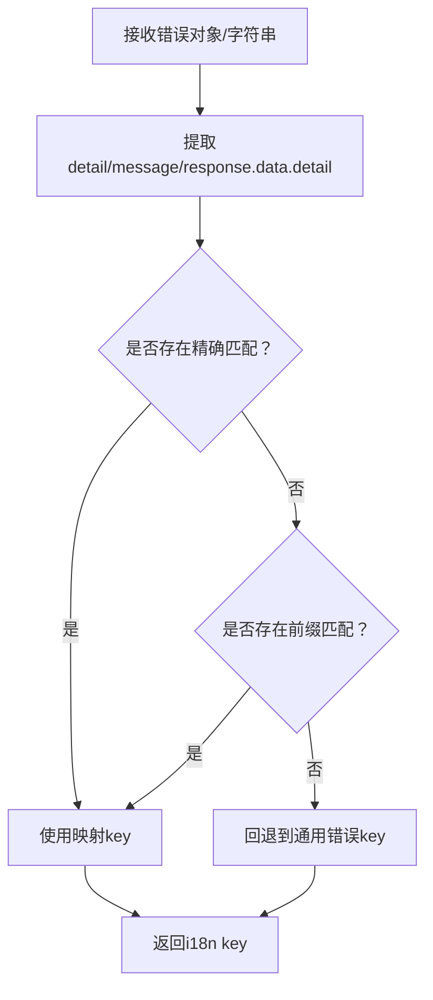

图表来源
- [frontend/src/lib/utils/error-handler.ts](file://frontend/src/lib/utils/error-handler.ts#L34-L68)

章节来源
- [frontend/src/lib/utils/error-handler.ts](file://frontend/src/lib/utils/error-handler.ts#L1-L69)

### 应用与中间件（后端）
- 自定义 HTTP 异常处理器：确保错误响应包含 CORS 头，尤其对上传过大等 413 场景
- 路由层错误包装：捕获业务异常，记录日志并返回标准错误体
- 数据库迁移：启动阶段失败直接终止，避免 schema 不一致导致的隐性错误

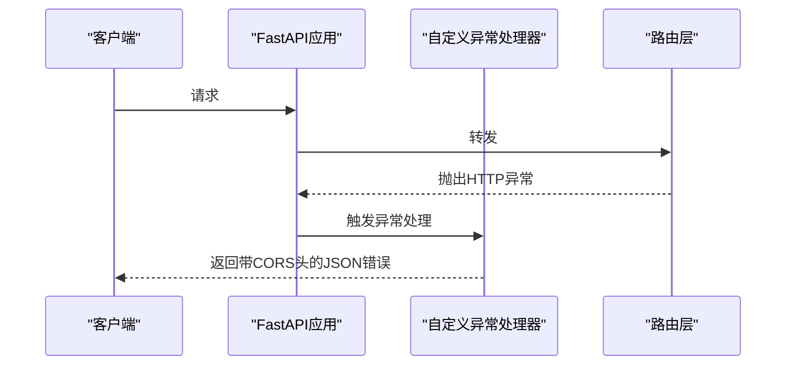

图表来源
- [api/main.py](file://api/main.py#L129-L154)
- [api/routers/sources.py](file://api/routers/sources.py#L938-L1020)

章节来源
- [api/main.py](file://api/main.py#L129-L154)
- [api/routers/sources.py](file://api/routers/sources.py#L938-L1020)

### 数据库仓库（Python）
- 事务冲突：调试级别日志，允许重试
- 其他异常：统一记录并抛出运行时错误，避免吞掉真实问题
- 幂等性：忽略重复键插入的特定场景

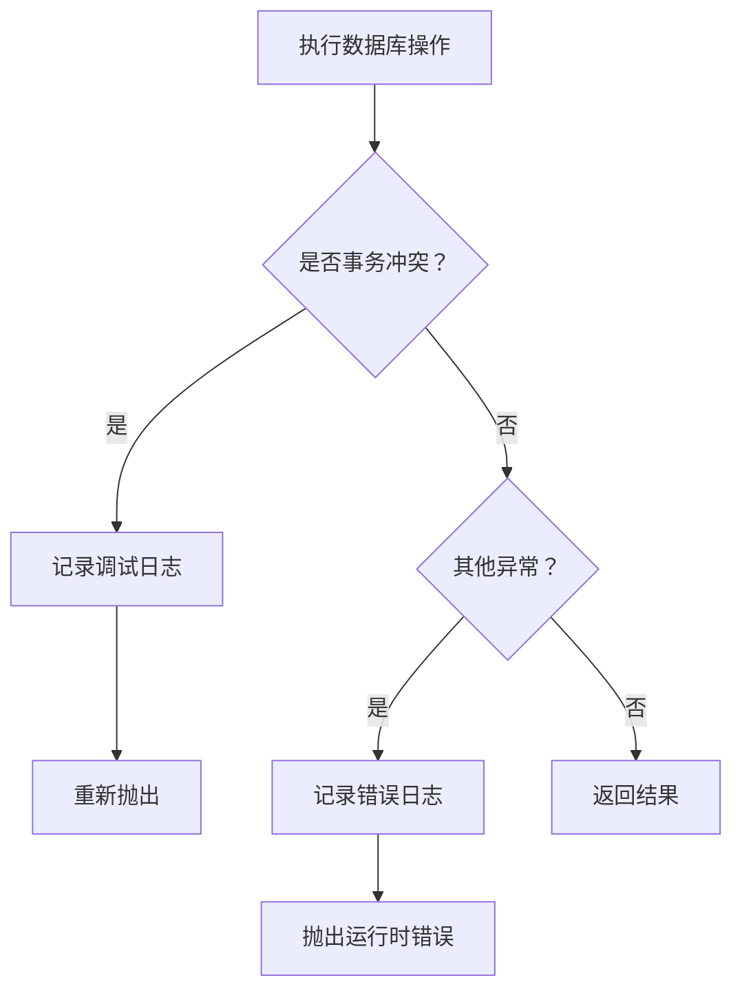

图表来源
- [open_notebook/database/repository.py](file://open_notebook/database/repository.py#L180-L194)

章节来源
- [open_notebook/database/repository.py](file://open_notebook/database/repository.py#L170-L195)

### 命令重试（Python）
- 指数抖动退避：最小/最大等待时间，避免雪崩
- 最大尝试次数：限制重试成本
- 停止条件：对验证类错误不重试，避免无意义循环
- 日志级别：重试过程以调试级别记录，最终失败以错误级别记录

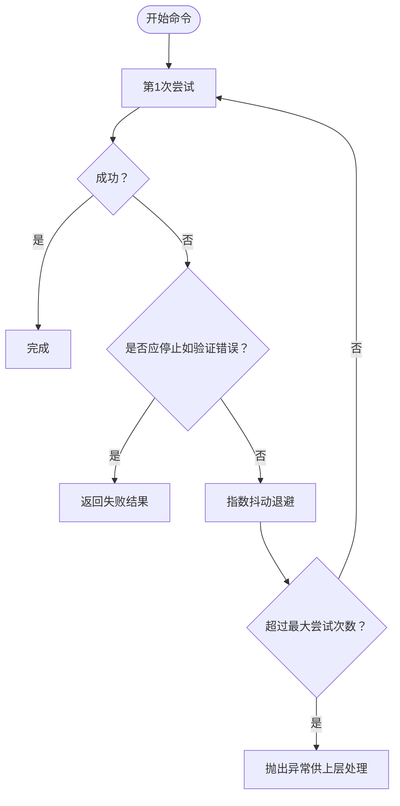

图表来源
- [commands/source_commands.py](file://commands/source_commands.py#L182-L222)

章节来源
- [commands/source_commands.py](file://commands/source_commands.py#L182-L222)

### 查询状态重试（前端）
- 来源状态轮询：运行中/排队中的任务每 2 秒刷新一次
- 失败重试：最多 3 次，404 不重试
- 成功后取消自动刷新，避免资源浪费

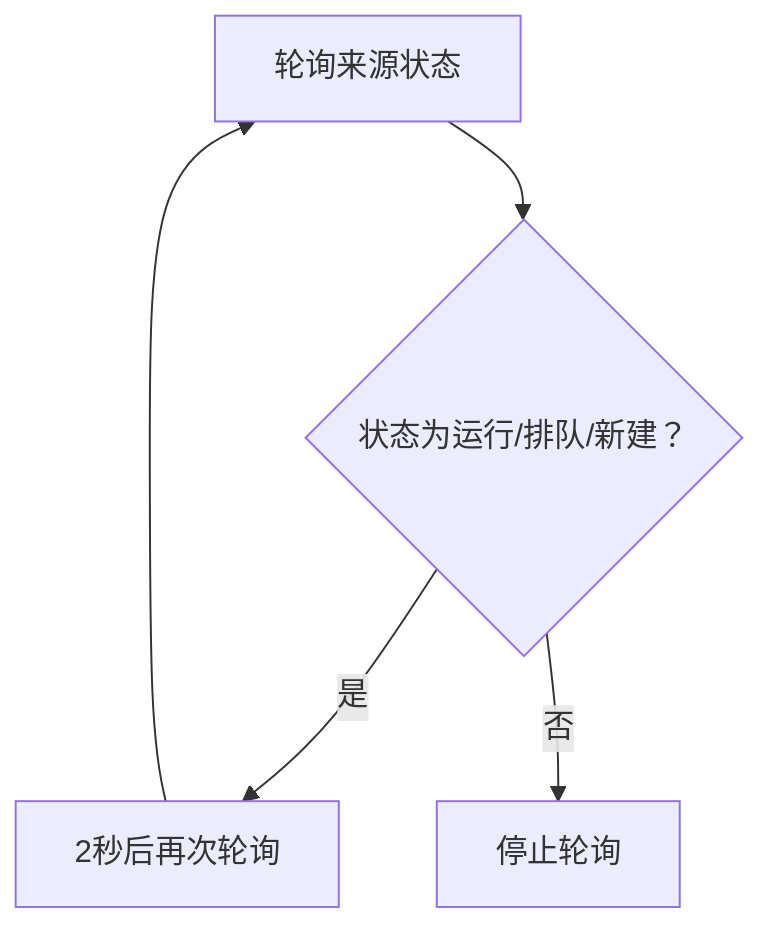

图表来源
- [frontend/src/lib/hooks/use-sources.ts](file://frontend/src/lib/hooks/use-sources.ts#L231-L245)

章节来源
- [frontend/src/lib/hooks/use-sources.ts](file://frontend/src/lib/hooks/use-sources.ts#L231-L271)

### 流式搜索错误处理（前端）
- 非 2xx 状态：尝试解析 JSON 中的 detail 或 message，否则使用状态文本
- 无响应体：抛出明确错误，避免静默失败

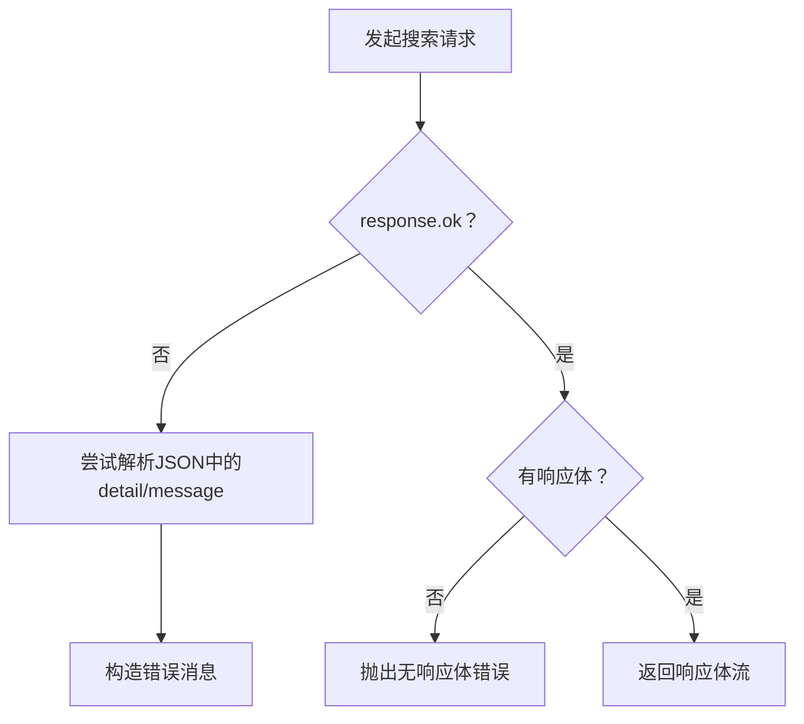

图表来源
- [frontend/src/lib/api/search.ts](file://frontend/src/lib/api/search.ts#L38-L62)

章节来源
- [frontend/src/lib/api/search.ts](file://frontend/src/lib/api/search.ts#L38-L62)

## 依赖关系分析
- 前端错误处理依赖运行时配置与 i18n 映射，确保错误提示本地化且可追踪
- 后端异常处理器依赖日志框架，保证错误响应具备 CORS 头
- 路由层依赖数据库仓库与命令系统，异常路径统一包装
- 命令层依赖外部服务（LLM），通过重试策略提升鲁棒性

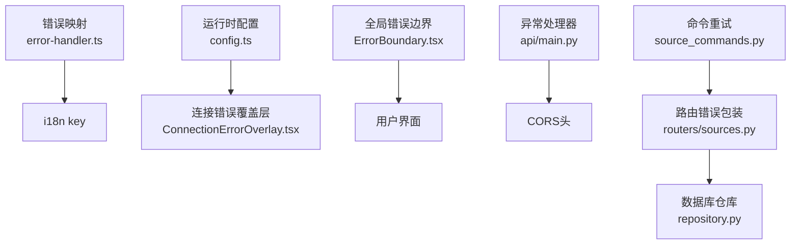

图表来源
- [frontend/src/lib/utils/error-handler.ts](file://frontend/src/lib/utils/error-handler.ts#L1-L69)
- [frontend/src/lib/config.ts](file://frontend/src/lib/config.ts#L22-L140)
- [frontend/src/components/errors/ConnectionErrorOverlay.tsx](file://frontend/src/components/errors/ConnectionErrorOverlay.tsx#L1-L176)
- [frontend/src/components/common/ErrorBoundary.tsx](file://frontend/src/components/common/ErrorBoundary.tsx#L1-L105)
- [api/main.py](file://api/main.py#L129-L154)
- [api/routers/sources.py](file://api/routers/sources.py#L938-L1020)
- [open_notebook/database/repository.py](file://open_notebook/database/repository.py#L170-L195)
- [commands/source_commands.py](file://commands/source_commands.py#L182-L222)

章节来源
- [frontend/src/lib/utils/error-handler.ts](file://frontend/src/lib/utils/error-handler.ts#L1-L69)
- [frontend/src/lib/config.ts](file://frontend/src/lib/config.ts#L22-L140)
- [frontend/src/components/errors/ConnectionErrorOverlay.tsx](file://frontend/src/components/errors/ConnectionErrorOverlay.tsx#L1-L176)
- [frontend/src/components/common/ErrorBoundary.tsx](file://frontend/src/components/common/ErrorBoundary.tsx#L1-L105)
- [api/main.py](file://api/main.py#L129-L154)
- [api/routers/sources.py](file://api/routers/sources.py#L938-L1020)
- [open_notebook/database/repository.py](file://open_notebook/database/repository.py#L170-L195)
- [commands/source_commands.py](file://commands/source_commands.py#L182-L222)

## 性能考量
- 指数抖动退避：降低并发重试导致的级联失败风险
- 最大尝试次数：限制重试成本，避免资源耗尽
- 前端轮询间隔：仅在必要时轮询，减少不必要的请求
- 数据库事务冲突日志级别：调试级别记录，避免生产日志噪声

## 故障排查指南
- API 不可达
  - 检查运行时配置优先级：服务端 /config > 构建期环境变量 > 智能默认
  - 查看连接错误覆盖层的技术细节（尝试 URL、消息、堆栈）
  - 参考排障指南与快速修复建议
- 数据库离线
  - 检查数据库服务状态与日志
  - 关注事务冲突日志（调试级别）
- 404 资源不存在
  - 前端查询状态不会重试，确认资源 ID 是否正确
- 413 上传过大
  - 确认反向代理已正确转发并添加 CORS 头
- 命令执行失败
  - 检查命令重试策略与停止条件
  - 关注调试日志与最终失败日志

章节来源
- [frontend/src/lib/config.ts](file://frontend/src/lib/config.ts#L59-L140)
- [frontend/src/components/errors/ConnectionErrorOverlay.tsx](file://frontend/src/components/errors/ConnectionErrorOverlay.tsx#L58-L103)
- [frontend/src/lib/hooks/use-sources.ts](file://frontend/src/lib/hooks/use-sources.ts#L238-L245)
- [api/main.py](file://api/main.py#L130-L154)
- [open_notebook/database/repository.py](file://open_notebook/database/repository.py#L180-L194)
- [commands/source_commands.py](file://commands/source_commands.py#L182-L222)

## 结论
Open Notebook 的错误处理体系在前后端与命令层形成闭环：前端负责用户可见的错误提示与重试，后端保证错误响应的一致性与可观测性，命令层通过可配置的重试策略提升可靠性。结合事务冲突的调试日志与严格的启动校验，系统在开发与生产环境中均能提供稳定、可诊断的错误处理体验。

## 附录

### 错误分类与错误码映射（前端）
- 分类：认证、授权、输入、资源不存在、文件操作、网络、外部服务、速率限制、数据库、未分类
- 映射：将后端英文错误消息映射为 i18n key，支持精确与前缀匹配，回退到通用错误 key

章节来源
- [open_notebook/exceptions.py](file://open_notebook/exceptions.py#L1-L71)
- [frontend/src/lib/utils/error-handler.ts](file://frontend/src/lib/utils/error-handler.ts#L4-L28)

### 开发与生产环境差异
- 开发环境
  - 全局错误边界显示错误详情与堆栈
  - 运行时配置优先尝试服务端 /config，便于容器内动态配置
- 生产环境
  - 严格日志级别，避免泄露敏感信息
  - 反向代理需正确转发 CORS 头，确保 413 等错误响应可用

章节来源
- [frontend/src/components/common/ErrorBoundary.tsx](file://frontend/src/components/common/ErrorBoundary.tsx#L68-L75)
- [frontend/src/lib/config.ts](file://frontend/src/lib/config.ts#L67-L90)
- [api/main.py](file://api/main.py#L130-L154)