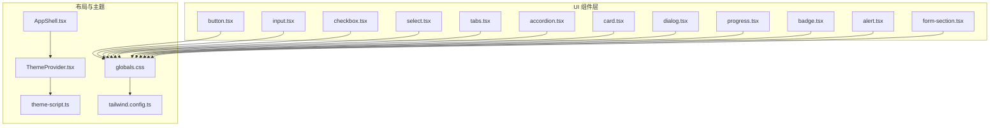
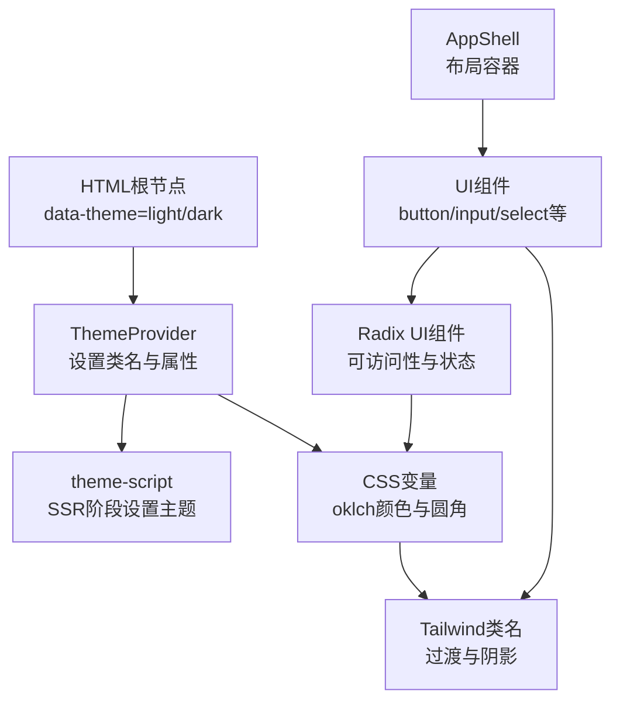
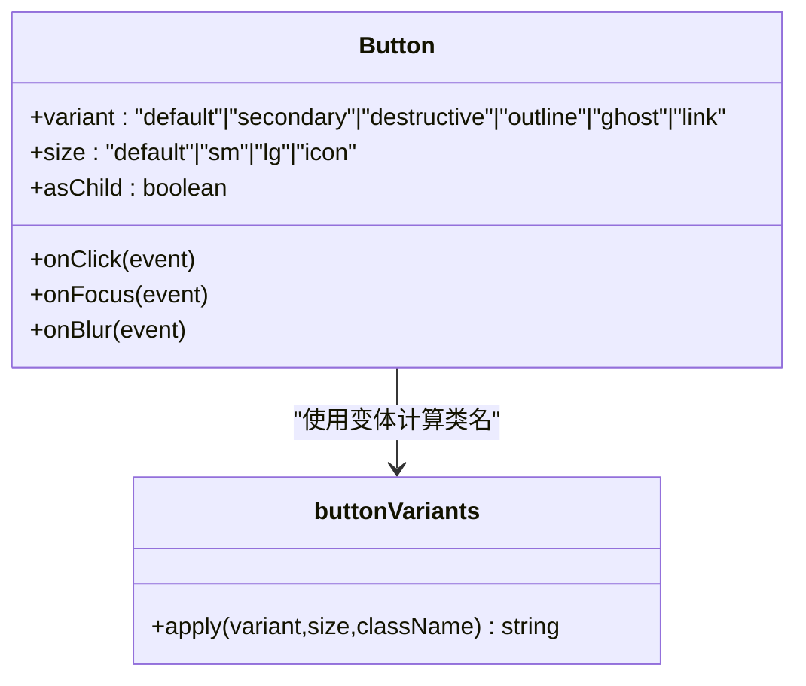
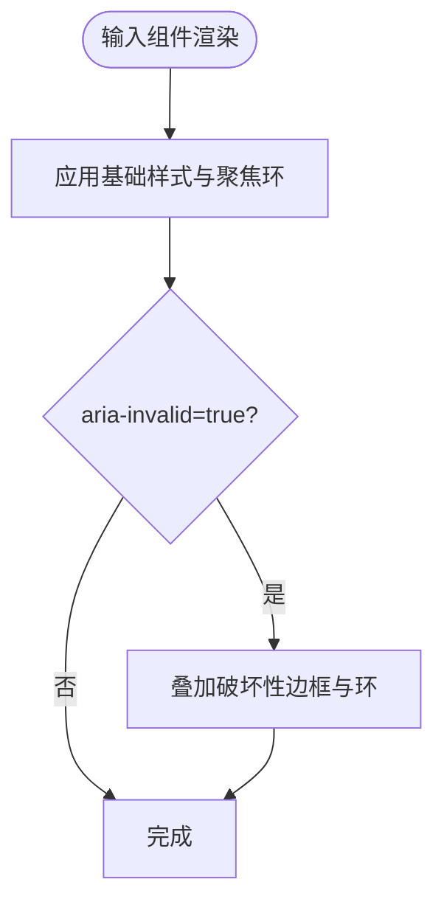
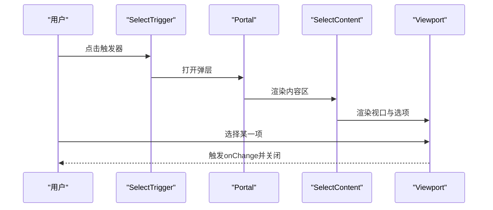
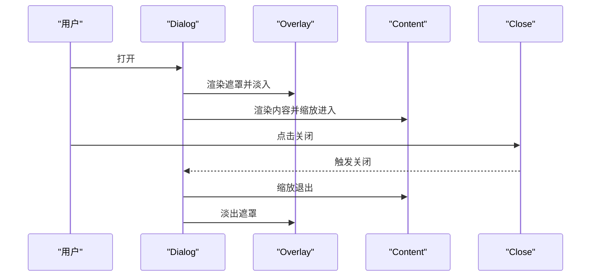
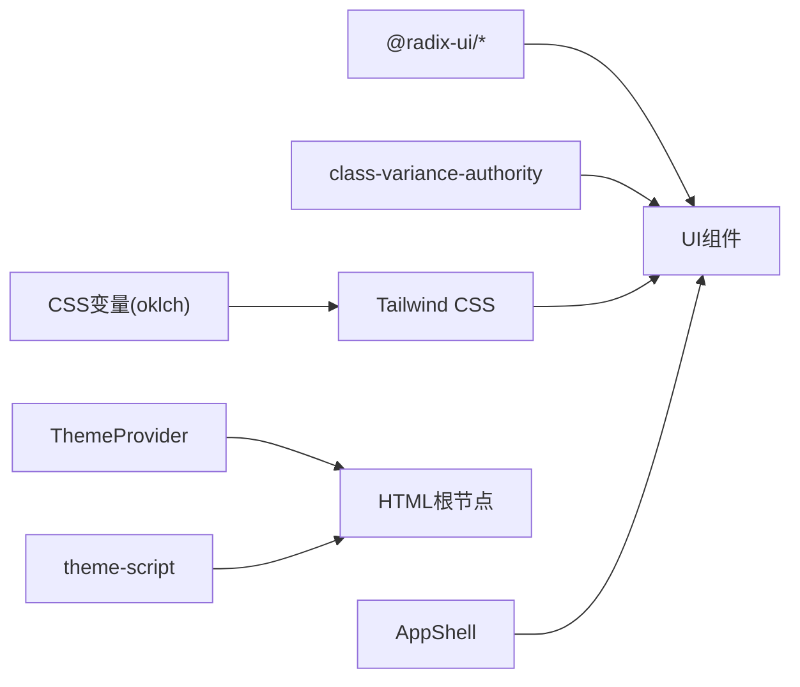

# UI组件库

<cite>
**本文引用的文件**
- [frontend/src/components/ui/button.tsx](file://frontend/src/components/ui/button.tsx)
- [frontend/src/components/ui/dialog.tsx](file://frontend/src/components/ui/dialog.tsx)
- [frontend/src/components/ui/input.tsx](file://frontend/src/components/ui/input.tsx)
- [frontend/src/components/ui/form-section.tsx](file://frontend/src/components/ui/form-section.tsx)
- [frontend/src/components/ui/accordion.tsx](file://frontend/src/components/ui/accordion.tsx)
- [frontend/src/components/ui/card.tsx](file://frontend/src/components/ui/card.tsx)
- [frontend/src/components/ui/checkbox.tsx](file://frontend/src/components/ui/checkbox.tsx)
- [frontend/src/components/ui/select.tsx](file://frontend/src/components/ui/select.tsx)
- [frontend/src/components/ui/tabs.tsx](file://frontend/src/components/ui/tabs.tsx)
- [frontend/src/components/ui/badge.tsx](file://frontend/src/components/ui/badge.tsx)
- [frontend/src/components/ui/alert.tsx](file://frontend/src/components/ui/alert.tsx)
- [frontend/src/components/ui/progress.tsx](file://frontend/src/components/ui/progress.tsx)
- [frontend/src/lib/theme-script.ts](file://frontend/src/lib/theme-script.ts)
- [frontend/src/components/providers/ThemeProvider.tsx](file://frontend/src/components/providers/ThemeProvider.tsx)
- [frontend/src/components/layout/AppShell.tsx](file://frontend/src/components/layout/AppShell.tsx)
- [frontend/src/app/globals.css](file://frontend/src/app/globals.css)
- [frontend/tailwind.config.ts](file://frontend/tailwind.config.ts)
</cite>

## 目录
1. [简介](#简介)
2. [项目结构](#项目结构)
3. [核心组件](#核心组件)
4. [架构总览](#架构总览)
5. [组件详解](#组件详解)
6. [依赖关系分析](#依赖关系分析)
7. [性能考量](#性能考量)
8. [故障排查指南](#故障排查指南)
9. [结论](#结论)
10. [附录](#附录)

## 简介
本文件为 Open Notebook 前端 UI 组件库的开发与使用文档，聚焦于自定义 UI 组件的设计原则、实现规范与最佳实践。内容覆盖通用组件（按钮、输入、选择器、标签页、进度条等）、布局组件（应用外壳）以及主题系统与样式体系，并提供组件开发指南与使用示例路径，帮助开发者在保持一致视觉与交互体验的同时，高效扩展与维护组件库。

## 项目结构
UI 组件主要位于 frontend/src/components/ui 下，采用“原子化组件 + 组合容器”的分层组织方式：基础元素（如按钮、输入、复选框）作为原子组件，复合容器（如卡片、对话框、手风琴）作为组合组件；同时通过 Provider 提供主题与状态管理能力，全局样式通过 Tailwind 与 CSS 变量统一治理。

图表来源
- [frontend/src/components/ui/button.tsx](file://frontend/src/components/ui/button.tsx#L1-L60)
- [frontend/src/components/ui/dialog.tsx](file://frontend/src/components/ui/dialog.tsx#L1-L144)
- [frontend/src/components/ui/input.tsx](file://frontend/src/components/ui/input.tsx#L1-L22)
- [frontend/src/components/ui/form-section.tsx](file://frontend/src/components/ui/form-section.tsx#L1-L46)
- [frontend/src/components/ui/accordion.tsx](file://frontend/src/components/ui/accordion.tsx#L1-L83)
- [frontend/src/components/ui/card.tsx](file://frontend/src/components/ui/card.tsx#L1-L93)
- [frontend/src/components/ui/checkbox.tsx](file://frontend/src/components/ui/checkbox.tsx#L1-L33)
- [frontend/src/components/ui/select.tsx](file://frontend/src/components/ui/select.tsx#L1-L186)
- [frontend/src/components/ui/tabs.tsx](file://frontend/src/components/ui/tabs.tsx#L1-L67)
- [frontend/src/components/ui/badge.tsx](file://frontend/src/components/ui/badge.tsx#L1-L47)
- [frontend/src/components/ui/alert.tsx](file://frontend/src/components/ui/alert.tsx#L1-L59)
- [frontend/src/components/ui/progress.tsx](file://frontend/src/components/ui/progress.tsx#L1-L32)
- [frontend/src/components/layout/AppShell.tsx](file://frontend/src/components/layout/AppShell.tsx#L1-L21)
- [frontend/src/components/providers/ThemeProvider.tsx](file://frontend/src/components/providers/ThemeProvider.tsx#L1-L45)
- [frontend/src/lib/theme-script.ts](file://frontend/src/lib/theme-script.ts#L1-L18)
- [frontend/src/app/globals.css](file://frontend/src/app/globals.css#L1-L193)
- [frontend/tailwind.config.ts](file://frontend/tailwind.config.ts#L1-L17)

章节来源
- [frontend/src/components/ui/button.tsx](file://frontend/src/components/ui/button.tsx#L1-L60)
- [frontend/src/components/ui/dialog.tsx](file://frontend/src/components/ui/dialog.tsx#L1-L144)
- [frontend/src/components/ui/input.tsx](file://frontend/src/components/ui/input.tsx#L1-L22)
- [frontend/src/components/ui/form-section.tsx](file://frontend/src/components/ui/form-section.tsx#L1-L46)
- [frontend/src/components/ui/accordion.tsx](file://frontend/src/components/ui/accordion.tsx#L1-L83)
- [frontend/src/components/ui/card.tsx](file://frontend/src/components/ui/card.tsx#L1-L93)
- [frontend/src/components/ui/checkbox.tsx](file://frontend/src/components/ui/checkbox.tsx#L1-L33)
- [frontend/src/components/ui/select.tsx](file://frontend/src/components/ui/select.tsx#L1-L186)
- [frontend/src/components/ui/tabs.tsx](file://frontend/src/components/ui/tabs.tsx#L1-L67)
- [frontend/src/components/ui/badge.tsx](file://frontend/src/components/ui/badge.tsx#L1-L47)
- [frontend/src/components/ui/alert.tsx](file://frontend/src/components/ui/alert.tsx#L1-L59)
- [frontend/src/components/ui/progress.tsx](file://frontend/src/components/ui/progress.tsx#L1-L32)
- [frontend/src/components/layout/AppShell.tsx](file://frontend/src/components/layout/AppShell.tsx#L1-L21)
- [frontend/src/components/providers/ThemeProvider.tsx](file://frontend/src/components/providers/ThemeProvider.tsx#L1-L45)
- [frontend/src/lib/theme-script.ts](file://frontend/src/lib/theme-script.ts#L1-L18)
- [frontend/src/app/globals.css](file://frontend/src/app/globals.css#L1-L193)
- [frontend/tailwind.config.ts](file://frontend/tailwind.config.ts#L1-L17)

## 核心组件
- 按钮 Button：支持多种变体与尺寸，具备可选的 asChild 渲染与焦点/禁用态样式。
- 输入 Input：统一的文本输入样式，支持禁用、焦点与错误态。
- 复选框 Checkbox：基于 Radix 的可访问性复选框，支持指示器与错误态。
- 选择器 Select：下拉选择器，支持分组、标签、滚动按钮与弹出定位。
- 标签页 Tabs：选项卡容器，支持列表与触发器样式。
- 手风琴 Accordion：可展开/折叠的内容区域，带旋转指示器与动画。
- 卡片 Card：卡片容器及头部/标题/描述/内容/底部等子组件。
- 对话框 Dialog：基于 Radix 的模态框，含遮罩、内容区、关闭按钮与国际化文案。
- 进度条 Progress：基于 Radix 的进度指示器，支持数值驱动的进度变换。
- 徽章 Badge：轻量标签，支持变体与 asChild。
- 警告 Alert：警示容器，支持默认与破坏性样式。
- 表单区块 FormSection：用于组织表单字段的语义化区块，支持标题、描述与可选的 Label 关联。

章节来源
- [frontend/src/components/ui/button.tsx](file://frontend/src/components/ui/button.tsx#L1-L60)
- [frontend/src/components/ui/input.tsx](file://frontend/src/components/ui/input.tsx#L1-L22)
- [frontend/src/components/ui/checkbox.tsx](file://frontend/src/components/ui/checkbox.tsx#L1-L33)
- [frontend/src/components/ui/select.tsx](file://frontend/src/components/ui/select.tsx#L1-L186)
- [frontend/src/components/ui/tabs.tsx](file://frontend/src/components/ui/tabs.tsx#L1-L67)
- [frontend/src/components/ui/accordion.tsx](file://frontend/src/components/ui/accordion.tsx#L1-L83)
- [frontend/src/components/ui/card.tsx](file://frontend/src/components/ui/card.tsx#L1-L93)
- [frontend/src/components/ui/dialog.tsx](file://frontend/src/components/ui/dialog.tsx#L1-L144)
- [frontend/src/components/ui/progress.tsx](file://frontend/src/components/ui/progress.tsx#L1-L32)
- [frontend/src/components/ui/badge.tsx](file://frontend/src/components/ui/badge.tsx#L1-L47)
- [frontend/src/components/ui/alert.tsx](file://frontend/src/components/ui/alert.tsx#L1-L59)
- [frontend/src/components/ui/form-section.tsx](file://frontend/src/components/ui/form-section.tsx#L1-L46)

## 架构总览
组件库遵循以下架构与设计原则：
- 统一样式系统：通过 Tailwind 与 CSS 变量（oklch 颜色空间）统一颜色、半径、阴影等视觉变量，确保明暗主题一致性。
- 组件风格：以 Radix UI 为基础，保证可访问性与跨浏览器一致性；使用 class-variance-authority 实现变体与尺寸的组合式样式。
- 主题系统：服务端预渲染脚本与客户端 Provider 双通道初始化主题，避免闪烁；支持系统主题跟随与手动切换。
- 布局系统：AppShell 将侧边栏与主内容区组合，配合全局样式与数据属性实现主题继承。

图表来源
- [frontend/src/components/providers/ThemeProvider.tsx](file://frontend/src/components/providers/ThemeProvider.tsx#L1-L45)
- [frontend/src/lib/theme-script.ts](file://frontend/src/lib/theme-script.ts#L1-L18)
- [frontend/src/app/globals.css](file://frontend/src/app/globals.css#L1-L193)
- [frontend/tailwind.config.ts](file://frontend/tailwind.config.ts#L1-L17)

## 组件详解

### 按钮 Button
- 设计原则：通过变体（default/secondary/destructive/outline/ghost/link）与尺寸（default/sm/lg/icon）控制外观与密度；支持 asChild 以嵌入链接或自定义元素。
- 属性接口：className、variant、size、asChild、原生 button 属性。
- 事件处理：透传 onClick 等原生事件；支持禁用态与焦点态样式。
- 样式要点：统一的圆角、阴影与过渡；错误态通过 aria-invalid 与 destructiv e系列变量联动。

图表来源
- [frontend/src/components/ui/button.tsx](file://frontend/src/components/ui/button.tsx#L1-L60)

章节来源
- [frontend/src/components/ui/button.tsx](file://frontend/src/components/ui/button.tsx#L1-L60)

### 输入 Input
- 设计原则：统一的边框、背景与选中高亮；聚焦时显示 ring 效果；错误态通过 aria-invalid 与 destructive 变量联动。
- 属性接口：className、type、原生 input 属性。
- 事件处理：透传 onChange/onFocus/onBlur 等事件；支持禁用态。

图表来源
- [frontend/src/components/ui/input.tsx](file://frontend/src/components/ui/input.tsx#L1-L22)

章节来源
- [frontend/src/components/ui/input.tsx](file://frontend/src/components/ui/input.tsx#L1-L22)

### 复选框 Checkbox
- 设计原则：基于 Radix 的可访问性实现；选中态自动切换背景与前景色；错误态与焦点态一致。
- 属性接口：className、原生 checkbox 属性。
- 事件处理：透传 onChange 等事件；支持禁用态。

章节来源
- [frontend/src/components/ui/checkbox.tsx](file://frontend/src/components/ui/checkbox.tsx#L1-L33)

### 选择器 Select
- 设计原则：触发器支持大小尺寸；内容区支持弹出定位与滚动按钮；项支持指示器与禁用态。
- 属性接口：Select/Trigger/Content/Item/Label/Separator 等组件各自属性。
- 事件处理：通过 SelectPrimitive 提供的回调与状态管理。

图表来源
- [frontend/src/components/ui/select.tsx](file://frontend/src/components/ui/select.tsx#L1-L186)

章节来源
- [frontend/src/components/ui/select.tsx](file://frontend/src/components/ui/select.tsx#L1-L186)

### 标签页 Tabs
- 设计原则：列表容器与触发器统一风格；激活态高亮与阴影；禁用态不可交互。
- 属性接口：Tabs/TabsList/TabsTrigger/TabsContent 各自属性。
- 事件处理：内部通过 TabsPrimitive 管理激活状态。

章节来源
- [frontend/src/components/ui/tabs.tsx](file://frontend/src/components/ui/tabs.tsx#L1-L67)

### 手风琴 Accordion
- 设计原则：触发器带旋转箭头指示展开状态；内容区使用动画展开/收起。
- 属性接口：Accordion/AccordionItem/AccordionHeader/AccordionTrigger/AccordionContent。
- 事件处理：由 AccordionPrimitive 管理状态与动画。

章节来源
- [frontend/src/components/ui/accordion.tsx](file://frontend/src/components/ui/accordion.tsx#L1-L83)

### 卡片 Card
- 设计原则：卡片容器统一圆角与阴影；头部支持操作区栅格布局；内容区与底部区提供占位与分隔。
- 属性接口：Card/CardHeader/CardTitle/CardDescription/CardAction/CardContent/CardFooter。
- 事件处理：无内置事件，支持点击等原生事件透传。

章节来源
- [frontend/src/components/ui/card.tsx](file://frontend/src/components/ui/card.tsx#L1-L93)

### 对话框 Dialog
- 设计原则：遮罩与内容区均支持动画入场/出场；支持可选关闭按钮与国际化文案；Portal 确保层级与可访问性。
- 属性接口：Dialog/DialogTrigger/DialogPortal/DialogOverlay/DialogContent/DialogHeader/DialogFooter/DialogTitle/DialogDescription。
- 事件处理：通过 DialogPrimitive 控制打开/关闭状态。

图表来源
- [frontend/src/components/ui/dialog.tsx](file://frontend/src/components/ui/dialog.tsx#L1-L144)

章节来源
- [frontend/src/components/ui/dialog.tsx](file://frontend/src/components/ui/dialog.tsx#L1-L144)

### 进度条 Progress
- 设计原则：基于 Radix 的进度指示器；通过数值计算指示器位移。
- 属性接口：className、value、原生属性。
- 事件处理：无内置事件，支持原生属性透传。

章节来源
- [frontend/src/components/ui/progress.tsx](file://frontend/src/components/ui/progress.tsx#L1-L32)

### 徽章 Badge
- 设计原则：支持变体与 asChild；紧凑内边距与圆角；支持图标与溢出隐藏。
- 属性接口：className、variant、asChild、原生 span 属性。
- 事件处理：透传原生事件。

章节来源
- [frontend/src/components/ui/badge.tsx](file://frontend/src/components/ui/badge.tsx#L1-L47)

### 警告 Alert
- 设计原则：默认与破坏性两种样式；标题与描述语义清晰。
- 属性接口：Alert/AlertTitle/AlertDescription。
- 事件处理：无内置事件。

章节来源
- [frontend/src/components/ui/alert.tsx](file://frontend/src/components/ui/alert.tsx#L1-L59)

### 表单区块 FormSection
- 设计原则：用于组织表单字段，支持标题、描述与可选 Label 关联；内部使用 Label 组件。
- 属性接口：title、description、children、className、htmlFor。
- 事件处理：无内置事件。

章节来源
- [frontend/src/components/ui/form-section.tsx](file://frontend/src/components/ui/form-section.tsx#L1-L46)

## 依赖关系分析
- 组件依赖 Radix UI：所有交互型组件（Dialog、Select、Tabs、Accordion、Checkbox、Progress 等）均基于 Radix，确保可访问性与状态一致性。
- 样式依赖 Tailwind 与 CSS 变量：组件通过 cn 组合 Tailwind 类与 CSS 变量，实现主题与尺寸的统一。
- 主题依赖 Provider 与 SSR 脚本：ThemeProvider 在客户端初始化主题，theme-script 在 SSR 阶段避免闪烁。
- 布局依赖 AppShell：应用外壳负责侧边栏与主内容区的组合，配合全局样式实现主题继承。

图表来源
- [frontend/src/components/ui/dialog.tsx](file://frontend/src/components/ui/dialog.tsx#L1-L144)
- [frontend/src/components/ui/select.tsx](file://frontend/src/components/ui/select.tsx#L1-L186)
- [frontend/src/components/ui/tabs.tsx](file://frontend/src/components/ui/tabs.tsx#L1-L67)
- [frontend/src/components/ui/accordion.tsx](file://frontend/src/components/ui/accordion.tsx#L1-L83)
- [frontend/src/components/ui/checkbox.tsx](file://frontend/src/components/ui/checkbox.tsx#L1-L33)
- [frontend/src/components/ui/progress.tsx](file://frontend/src/components/ui/progress.tsx#L1-L32)
- [frontend/src/components/providers/ThemeProvider.tsx](file://frontend/src/components/providers/ThemeProvider.tsx#L1-L45)
- [frontend/src/lib/theme-script.ts](file://frontend/src/lib/theme-script.ts#L1-L18)
- [frontend/src/app/globals.css](file://frontend/src/app/globals.css#L1-L193)
- [frontend/tailwind.config.ts](file://frontend/tailwind.config.ts#L1-L17)
- [frontend/src/components/layout/AppShell.tsx](file://frontend/src/components/layout/AppShell.tsx#L1-L21)

章节来源
- [frontend/src/components/ui/dialog.tsx](file://frontend/src/components/ui/dialog.tsx#L1-L144)
- [frontend/src/components/ui/select.tsx](file://frontend/src/components/ui/select.tsx#L1-L186)
- [frontend/src/components/ui/tabs.tsx](file://frontend/src/components/ui/tabs.tsx#L1-L67)
- [frontend/src/components/ui/accordion.tsx](file://frontend/src/components/ui/accordion.tsx#L1-L83)
- [frontend/src/components/ui/checkbox.tsx](file://frontend/src/components/ui/checkbox.tsx#L1-L33)
- [frontend/src/components/ui/progress.tsx](file://frontend/src/components/ui/progress.tsx#L1-L32)
- [frontend/src/components/providers/ThemeProvider.tsx](file://frontend/src/components/providers/ThemeProvider.tsx#L1-L45)
- [frontend/src/lib/theme-script.ts](file://frontend/src/lib/theme-script.ts#L1-L18)
- [frontend/src/app/globals.css](file://frontend/src/app/globals.css#L1-L193)
- [frontend/tailwind.config.ts](file://frontend/tailwind.config.ts#L1-L17)
- [frontend/src/components/layout/AppShell.tsx](file://frontend/src/components/layout/AppShell.tsx#L1-L21)

## 性能考量
- 动画与过渡：组件普遍使用 CSS 过渡与 Radix 动画，建议在低端设备上谨慎使用复杂阴影与大范围缩放。
- 主题切换：SSR 阶段通过 theme-script 设置主题，避免 Hydration 不匹配导致的闪烁与重绘。
- 样式体积：通过 Tailwind 与 CSS 变量按需生成样式，避免引入未使用的类名。
- 可访问性：组件基于 Radix UI，天然具备键盘导航与屏幕阅读器支持，减少额外负担。

## 故障排查指南
- 主题闪烁：确认 SSR 阶段已注入 theme-script，且客户端 ThemeProvider 初始化逻辑正确。
- 对话框无法关闭：检查 DialogTrigger/DialogClose 的使用是否正确，Portal 是否存在。
- 选择器选项不显示：确认 SelectContent 的 position 与 Portal 使用正确，Viewport 容量与触发器尺寸一致。
- 错误态无效：确认表单控件的 aria-invalid 属性与 destructive 变量联动生效。
- 卡片点击无反馈：检查全局样式中的 hover 效果与 clickable-card 类是否按需启用。

章节来源
- [frontend/src/lib/theme-script.ts](file://frontend/src/lib/theme-script.ts#L1-L18)
- [frontend/src/components/providers/ThemeProvider.tsx](file://frontend/src/components/providers/ThemeProvider.tsx#L1-L45)
- [frontend/src/components/ui/dialog.tsx](file://frontend/src/components/ui/dialog.tsx#L1-L144)
- [frontend/src/components/ui/select.tsx](file://frontend/src/components/ui/select.tsx#L1-L186)
- [frontend/src/app/globals.css](file://frontend/src/app/globals.css#L1-L193)

## 结论
该 UI 组件库以 Radix 为核心，结合 Tailwind 与 CSS 变量，构建了统一、可扩展且具备良好可访问性的组件体系。通过 Provider 与 SSR 脚本保障主题一致性，借助 AppShell 与全局样式实现布局与主题继承。建议在新增组件时遵循现有变体与尺寸模式、保持可访问性与动画简洁、并在必要时提供 asChild 与 aria-* 属性以增强互操作性。

## 附录
- 组件开发指南
  - 变体与尺寸：优先使用 class-variance-authority 定义变体与尺寸组合，确保样式可组合与可维护。
  - 可访问性：基于 Radix 组件封装，确保键盘可达与状态同步。
  - 样式策略：统一使用 cn 组合 Tailwind 类与 CSS 变量，避免硬编码颜色与尺寸。
  - 动画与过渡：仅在必要时添加过渡与动画，注意性能影响。
  - 事件透传：保持原生事件透传，避免隐藏行为。
- 使用示例路径
  - 按钮：[frontend/src/components/ui/button.tsx](file://frontend/src/components/ui/button.tsx#L1-L60)
  - 输入：[frontend/src/components/ui/input.tsx](file://frontend/src/components/ui/input.tsx#L1-L22)
  - 复选框：[frontend/src/components/ui/checkbox.tsx](file://frontend/src/components/ui/checkbox.tsx#L1-L33)
  - 选择器：[frontend/src/components/ui/select.tsx](file://frontend/src/components/ui/select.tsx#L1-L186)
  - 标签页：[frontend/src/components/ui/tabs.tsx](file://frontend/src/components/ui/tabs.tsx#L1-L67)
  - 手风琴：[frontend/src/components/ui/accordion.tsx](file://frontend/src/components/ui/accordion.tsx#L1-L83)
  - 卡片：[frontend/src/components/ui/card.tsx](file://frontend/src/components/ui/card.tsx#L1-L93)
  - 对话框：[frontend/src/components/ui/dialog.tsx](file://frontend/src/components/ui/dialog.tsx#L1-L144)
  - 进度条：[frontend/src/components/ui/progress.tsx](file://frontend/src/components/ui/progress.tsx#L1-L32)
  - 徽章：[frontend/src/components/ui/badge.tsx](file://frontend/src/components/ui/badge.tsx#L1-L47)
  - 警告：[frontend/src/components/ui/alert.tsx](file://frontend/src/components/ui/alert.tsx#L1-L59)
  - 表单区块：[frontend/src/components/ui/form-section.tsx](file://frontend/src/components/ui/form-section.tsx#L1-L46)
  - 应用外壳：[frontend/src/components/layout/AppShell.tsx](file://frontend/src/components/layout/AppShell.tsx#L1-L21)
  - 主题提供者：[frontend/src/components/providers/ThemeProvider.tsx](file://frontend/src/components/providers/ThemeProvider.tsx#L1-L45)
  - 主题脚本：[frontend/src/lib/theme-script.ts](file://frontend/src/lib/theme-script.ts#L1-L18)
  - 全局样式：[frontend/src/app/globals.css](file://frontend/src/app/globals.css#L1-L193)
  - Tailwind 配置：[frontend/tailwind.config.ts](file://frontend/tailwind.config.ts#L1-L17)