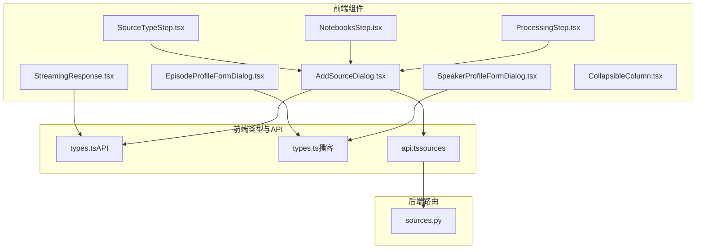
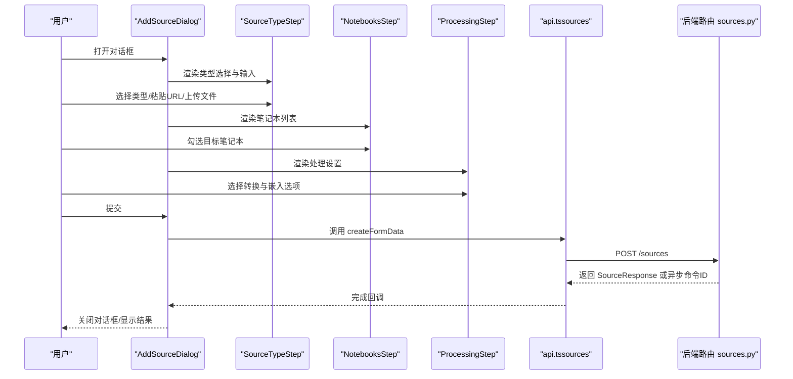
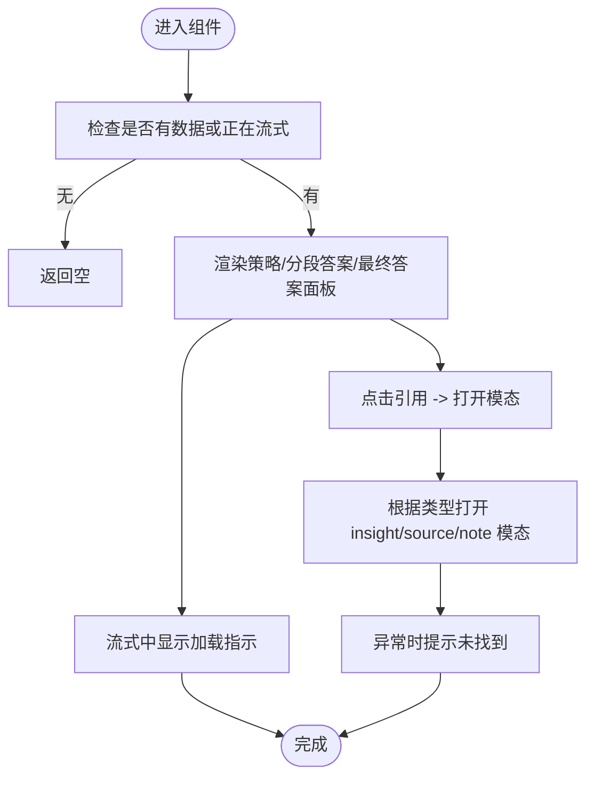
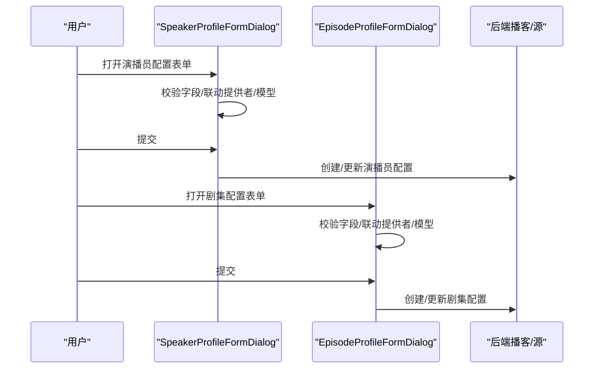
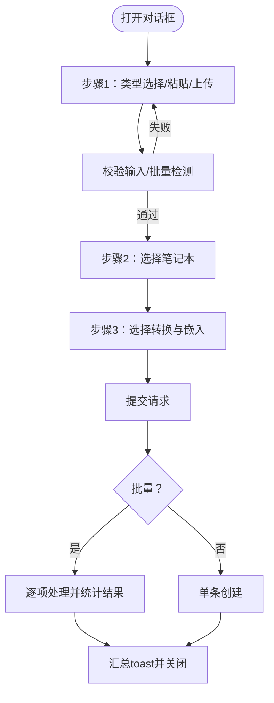
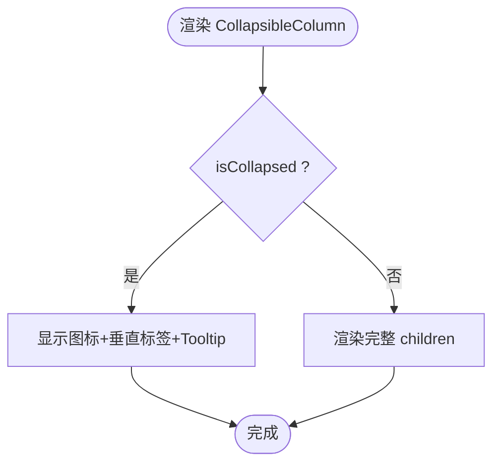
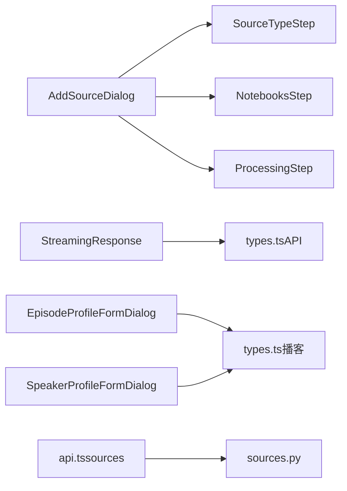

# 专用组件

<cite>
**本文档引用的文件**
- [StreamingResponse.tsx](file://frontend/src/components/search/StreamingResponse.tsx)
- [EpisodeProfileFormDialog.tsx](file://frontend/src/components/podcasts/forms/EpisodeProfileFormDialog.tsx)
- [SpeakerProfileFormDialog.tsx](file://frontend/src/components/podcasts/forms/SpeakerProfileFormDialog.tsx)
- [AddSourceDialog.tsx](file://frontend/src/components/sources/AddSourceDialog.tsx)
- [SourceTypeStep.tsx](file://frontend/src/components/sources/steps/SourceTypeStep.tsx)
- [NotebooksStep.tsx](file://frontend/src/components/sources/steps/NotebooksStep.tsx)
- [ProcessingStep.tsx](file://frontend/src/components/sources/steps/ProcessingStep.tsx)
- [CollapsibleColumn.tsx](file://frontend/src/components/notebooks/CollapsibleColumn.tsx)
- [api.ts](file://frontend/src/lib/api/sources.ts)
- [types.ts（API）](file://frontend/src/lib/types/api.ts)
- [types.ts（播客）](file://frontend/src/lib/types/podcasts.ts)
- [sources.py](file://api/routers/sources.py)
</cite>

## 目录
1. [简介](#简介)
2. [项目结构](#项目结构)
3. [核心组件](#核心组件)
4. [架构总览](#架构总览)
5. [详细组件分析](#详细组件分析)
6. [依赖关系分析](#依赖关系分析)
7. [性能考量](#性能考量)
8. [故障排查指南](#故障排查指南)
9. [结论](#结论)
10. [附录](#附录)

## 简介
本文件聚焦于四个专用前端组件与后端服务的协同：搜索流式响应、播客表单（演播员与剧集配置）、内容源添加（向导式多步流程）、笔记本折叠列。这些组件面向专业场景，强调数据处理、状态同步、用户交互与可扩展性。文档将从功能特性、实现细节、配置参数、事件处理与状态同步等方面进行系统化说明，并提供使用示例与集成方案。

## 项目结构
以下为与本文相关的关键文件与模块关系概览：

**图表来源**
- [StreamingResponse.tsx](file://frontend/src/components/search/StreamingResponse.tsx#L1-L198)
- [EpisodeProfileFormDialog.tsx](file://frontend/src/components/podcasts/forms/EpisodeProfileFormDialog.tsx#L1-L452)
- [SpeakerProfileFormDialog.tsx](file://frontend/src/components/podcasts/forms/SpeakerProfileFormDialog.tsx#L1-L406)
- [AddSourceDialog.tsx](file://frontend/src/components/sources/AddSourceDialog.tsx#L1-L635)
- [SourceTypeStep.tsx](file://frontend/src/components/sources/steps/SourceTypeStep.tsx#L1-L357)
- [NotebooksStep.tsx](file://frontend/src/components/sources/steps/NotebooksStep.tsx#L1-L44)
- [ProcessingStep.tsx](file://frontend/src/components/sources/steps/ProcessingStep.tsx#L1-L127)
- [CollapsibleColumn.tsx](file://frontend/src/components/notebooks/CollapsibleColumn.tsx#L1-L94)
- [api.ts](file://frontend/src/lib/api/sources.ts#L1-L50)
- [types.ts（API）](file://frontend/src/lib/types/api.ts#L1-L242)
- [types.ts（播客）](file://frontend/src/lib/types/podcasts.ts#L1-L134)
- [sources.py](file://api/routers/sources.py#L327-L552)

**章节来源**
- [StreamingResponse.tsx](file://frontend/src/components/search/StreamingResponse.tsx#L1-L198)
- [AddSourceDialog.tsx](file://frontend/src/components/sources/AddSourceDialog.tsx#L1-L635)
- [EpisodeProfileFormDialog.tsx](file://frontend/src/components/podcasts/forms/EpisodeProfileFormDialog.tsx#L1-L452)
- [SpeakerProfileFormDialog.tsx](file://frontend/src/components/podcasts/forms/SpeakerProfileFormDialog.tsx#L1-L406)
- [CollapsibleColumn.tsx](file://frontend/src/components/notebooks/CollapsibleColumn.tsx#L1-L94)
- [api.ts](file://frontend/src/lib/api/sources.ts#L1-L50)
- [types.ts（API）](file://frontend/src/lib/types/api.ts#L1-L242)
- [types.ts（播客）](file://frontend/src/lib/types/podcasts.ts#L1-L134)
- [sources.py](file://api/routers/sources.py#L327-L552)

## 核心组件
- 搜索流式响应：以卡片与可折叠面板组织策略、分段答案与最终答案，支持引用点击打开上下文模态框，无障碍区域标记与加载指示。
- 播客表单：演播员配置表单与剧集配置表单，联动提供者与模型选择，字段校验与动态默认值，支持批量/单个创建与编辑。
- 内容源添加：向导式三步流程（类型选择/上传、笔记本关联、处理设置），支持批量链接/文件处理与进度反馈。
- 笔记本折叠列：侧栏折叠/展开逻辑与工具提示，提供卡片头部折叠按钮工厂方法，兼顾移动端与桌面端体验。

**章节来源**
- [StreamingResponse.tsx](file://frontend/src/components/search/StreamingResponse.tsx#L21-L159)
- [EpisodeProfileFormDialog.tsx](file://frontend/src/components/podcasts/forms/EpisodeProfileFormDialog.tsx#L53-L452)
- [SpeakerProfileFormDialog.tsx](file://frontend/src/components/podcasts/forms/SpeakerProfileFormDialog.tsx#L59-L406)
- [AddSourceDialog.tsx](file://frontend/src/components/sources/AddSourceDialog.tsx#L70-L635)
- [CollapsibleColumn.tsx](file://frontend/src/components/notebooks/CollapsibleColumn.tsx#L9-L94)

## 架构总览
下图展示“内容源添加”向导在前端与后端之间的调用链与数据流：

**图表来源**
- [AddSourceDialog.tsx](file://frontend/src/components/sources/AddSourceDialog.tsx#L385-L422)
- [SourceTypeStep.tsx](file://frontend/src/components/sources/steps/SourceTypeStep.tsx#L100-L357)
- [NotebooksStep.tsx](file://frontend/src/components/sources/steps/NotebooksStep.tsx#L15-L44)
- [ProcessingStep.tsx](file://frontend/src/components/sources/steps/ProcessingStep.tsx#L32-L127)
- [api.ts](file://frontend/src/lib/api/sources.ts#L30-L50)
- [sources.py](file://api/routers/sources.py#L327-L552)

## 详细组件分析

### 组件一：搜索流式响应（StreamingResponse）
- 专业用途
  - 面向问答/检索场景，实时呈现推理策略、中间答案与最终答案；支持引用跳转到上下文详情。
- 数据处理
  - 接收策略对象、分段答案数组与最终答案字符串；内部将引用标记转换为可点击链接。
- 用户交互
  - 可折叠面板分别展示策略与分段答案；最终答案区域渲染 Markdown 并适配表格样式；流式中显示加载指示。
- 配置参数
  - isStreaming：是否处于流式阶段
  - strategy：包含 reasoning 与 searches 数组
  - answers：中间答案数组
  - finalAnswer：最终答案字符串
- 事件与状态
  - 引用点击通过 openModal 触发上下文模态；无障碍属性标注区域与忙状态；错误时通过 toast 提示“未找到”。

**图表来源**
- [StreamingResponse.tsx](file://frontend/src/components/search/StreamingResponse.tsx#L28-L159)

**章节来源**
- [StreamingResponse.tsx](file://frontend/src/components/search/StreamingResponse.tsx#L16-L198)

### 组件二：播客表单（演播员与剧集配置）
- 专业用途
  - 为播客生成提供“演播员配置”和“剧集配置”，统一管理 TTS 提供者/模型、大纲与转录模型、默认简报与分段数等。
- 数据处理与联动
  - 演播员配置表单支持多演播员，字段包括姓名、voice_id、背景故事与个性；剧集配置表单联动提供者与模型下拉，自动修正无效模型。
- 用户交互
  - 创建/编辑模式切换；提供者为空时禁用提交；字段必填校验与范围限制（如分段数 3–20）。
- 配置参数
  - 演播员配置：name、voice_id、backstory、personality
  - 剧集配置：name、description、speaker_config、outline_provider、outline_model、transcript_provider、transcript_model、default_briefing、num_segments
- 事件与状态
  - 表单提交触发创建/更新钩子；提交中禁用按钮；提供者/模型变化时自动重置模型选项。

**图表来源**
- [SpeakerProfileFormDialog.tsx](file://frontend/src/components/podcasts/forms/SpeakerProfileFormDialog.tsx#L67-L406)
- [EpisodeProfileFormDialog.tsx](file://frontend/src/components/podcasts/forms/EpisodeProfileFormDialog.tsx#L62-L452)

**章节来源**
- [SpeakerProfileFormDialog.tsx](file://frontend/src/components/podcasts/forms/SpeakerProfileFormDialog.tsx#L39-L406)
- [EpisodeProfileFormDialog.tsx](file://frontend/src/components/podcasts/forms/EpisodeProfileFormDialog.tsx#L36-L452)
- [types.ts（播客）](file://frontend/src/lib/types/podcasts.ts#L11-L52)

### 组件三：内容源添加（向导式添加）
- 专业用途
  - 支持链接、文本、上传三种来源类型；可批量处理；可选择关联笔记本与应用转换；支持嵌入与异步处理。
- 数据处理与流程
  - 步骤一：解析并验证 URL/文件数量，检测批量模式；文本需标题。
  - 步骤二：勾选目标笔记本（可多选）。
  - 步骤三：选择转换与嵌入策略；根据设置决定默认嵌入选项。
  - 提交：单条或批量创建，异步处理时返回命令ID，前端显示进度与汇总结果。
- 用户交互
  - 向导导航（上一步/下一步/完成）；批量模式提示与限制；文件预览与 URL 错误高亮。
- 配置参数
  - CreateSourceRequest：type、url/content/file、title、notebooks、transformations、embed、async_processing
- 事件与状态
  - 处理中显示进度条与当前项；失败/成功/部分成功提示；清理定时器避免内存泄漏。

**图表来源**
- [AddSourceDialog.tsx](file://frontend/src/components/sources/AddSourceDialog.tsx#L88-L635)
- [SourceTypeStep.tsx](file://frontend/src/components/sources/steps/SourceTypeStep.tsx#L100-L357)
- [NotebooksStep.tsx](file://frontend/src/components/sources/steps/NotebooksStep.tsx#L15-L44)
- [ProcessingStep.tsx](file://frontend/src/components/sources/steps/ProcessingStep.tsx#L32-L127)
- [api.ts](file://frontend/src/lib/api/sources.ts#L30-L50)
- [sources.py](file://api/routers/sources.py#L327-L552)

**章节来源**
- [AddSourceDialog.tsx](file://frontend/src/components/sources/AddSourceDialog.tsx#L30-L635)
- [SourceTypeStep.tsx](file://frontend/src/components/sources/steps/SourceTypeStep.tsx#L27-L357)
- [NotebooksStep.tsx](file://frontend/src/components/sources/steps/NotebooksStep.tsx#L8-L44)
- [ProcessingStep.tsx](file://frontend/src/components/sources/steps/ProcessingStep.tsx#L23-L127)
- [types.ts（API）](file://frontend/src/lib/types/api.ts#L96-L112)
- [api.ts](file://frontend/src/lib/api/sources.ts#L30-L50)
- [sources.py](file://api/routers/sources.py#L327-L552)

### 组件四：笔记本折叠列（CollapsibleColumn）
- 专业用途
  - 在笔记页面侧栏提供折叠/展开能力，减少空间占用；为卡片头部提供折叠按钮。
- 数据处理与交互
  - 折叠时仅显示图标与垂直标签；展开时渲染完整内容；提供 Tooltip 提示与无障碍标签。
- 配置参数
  - isCollapsed、onToggle、collapsedIcon、collapsedLabel、children
- 事件与状态
  - 点击触发 onToggle；卡片头部折叠按钮阻止事件冒泡，避免误触容器。

**图表来源**
- [CollapsibleColumn.tsx](file://frontend/src/components/notebooks/CollapsibleColumn.tsx#L17-L94)

**章节来源**
- [CollapsibleColumn.tsx](file://frontend/src/components/notebooks/CollapsibleColumn.tsx#L9-L94)

## 依赖关系分析
- 组件间耦合
  - AddSourceDialog 作为容器，组合 SourceTypeStep、NotebooksStep、ProcessingStep 三个步骤组件，形成强内聚弱耦合的向导结构。
  - StreamingResponse 与表单组件均依赖通用 UI 组件（卡片、折叠、输入、选择、提示等）。
- 外部依赖
  - 播客表单依赖类型定义（播客）与国际化键；内容源表单依赖类型定义（API）与设置项。
  - 前端 API 层封装后端接口，AddSourceDialog 通过该层发起创建请求；后端路由负责业务逻辑与命令调度。

**图表来源**
- [AddSourceDialog.tsx](file://frontend/src/components/sources/AddSourceDialog.tsx#L546-L584)
- [SourceTypeStep.tsx](file://frontend/src/components/sources/steps/SourceTypeStep.tsx#L100-L357)
- [NotebooksStep.tsx](file://frontend/src/components/sources/steps/NotebooksStep.tsx#L15-L44)
- [ProcessingStep.tsx](file://frontend/src/components/sources/steps/ProcessingStep.tsx#L32-L127)
- [StreamingResponse.tsx](file://frontend/src/components/search/StreamingResponse.tsx#L21-L159)
- [EpisodeProfileFormDialog.tsx](file://frontend/src/components/podcasts/forms/EpisodeProfileFormDialog.tsx#L53-L452)
- [SpeakerProfileFormDialog.tsx](file://frontend/src/components/podcasts/forms/SpeakerProfileFormDialog.tsx#L59-L406)
- [api.ts](file://frontend/src/lib/api/sources.ts#L1-L50)
- [types.ts（API）](file://frontend/src/lib/types/api.ts#L96-L112)
- [types.ts（播客）](file://frontend/src/lib/types/podcasts.ts#L11-L52)
- [sources.py](file://api/routers/sources.py#L327-L552)

**章节来源**
- [AddSourceDialog.tsx](file://frontend/src/components/sources/AddSourceDialog.tsx#L118-L121)
- [api.ts](file://frontend/src/lib/api/sources.ts#L30-L50)
- [sources.py](file://api/routers/sources.py#L327-L552)

## 性能考量
- 流式渲染
  - StreamingResponse 使用可折叠面板与滚动容器，避免一次性渲染大量内容导致卡顿；Markdown 渲染按需进行。
- 批量处理
  - AddSourceDialog 对批量 URL/文件进行分步处理，逐项提交并更新进度，避免长时间阻塞 UI。
- 状态清理
  - 添加对话框在卸载时清理定时器，防止内存泄漏；表单重置时恢复默认值与选择。
- 依赖优化
  - 使用 useMemo 缓存派生数据（如可用模型列表、批次数），减少不必要的重渲染。

[本节为通用指导，无需特定文件引用]

## 故障排查指南
- 引用点击无反应
  - 检查 openModal 的类型映射与模态组件是否存在；确认 handleReferenceClick 的错误捕获分支是否触发 toast。
- URL 批量导入失败
  - 查看 SourceTypeStep 中的 URL 解析与校验错误列表；确保每行有效且不超过最大批次限制。
- 提交后无进度反馈
  - 确认 isBatchMode 判断与 batchProgress 更新逻辑；检查 ProcessingStep 的设置项对嵌入策略的影响。
- 播客表单提交被禁用
  - 检查提供者/模型选项是否为空；演播员数量是否满足最小/最大限制；必填字段是否填写完整。
- 折叠列无法展开
  - 确认 isCollapsed 状态与 onToggle 回调；检查 Tooltip 是否正确包裹按钮。

**章节来源**
- [StreamingResponse.tsx](file://frontend/src/components/search/StreamingResponse.tsx#L39-L51)
- [SourceTypeStep.tsx](file://frontend/src/components/sources/steps/SourceTypeStep.tsx#L134-L156)
- [ProcessingStep.tsx](file://frontend/src/components/sources/steps/ProcessingStep.tsx#L67-L121)
- [SpeakerProfileFormDialog.tsx](file://frontend/src/components/podcasts/forms/SpeakerProfileFormDialog.tsx#L182-L184)
- [CollapsibleColumn.tsx](file://frontend/src/components/notebooks/CollapsibleColumn.tsx#L24-L64)

## 结论
上述专用组件围绕“流式信息呈现、播客配置管理、内容源批量接入、侧栏布局控制”四大专业场景构建，具备清晰的数据流、稳健的状态管理与良好的可扩展性。通过向导式与可折叠交互提升复杂任务的可用性，配合后端异步处理与命令队列，满足大规模内容处理需求。

[本节为总结性内容，无需特定文件引用]

## 附录
- 使用示例与集成方案
  - 搜索流式响应：在问答页面挂载组件，传入 isStreaming、strategy、answers、finalAnswer；引用点击回调中打开对应模态。
  - 播客表单：先创建演播员配置，再创建剧集配置；在生成播客时选择对应配置。
  - 内容源添加：在笔记本/搜索页面触发对话框；根据设置默认嵌入策略；批量导入时关注进度与失败项。
  - 笔记本折叠列：在笔记页面侧栏使用 CollapsibleColumn 包裹内容；为卡片头部注入折叠按钮。

[本节为概念性内容，无需特定文件引用]