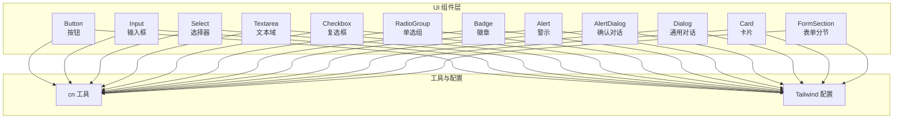
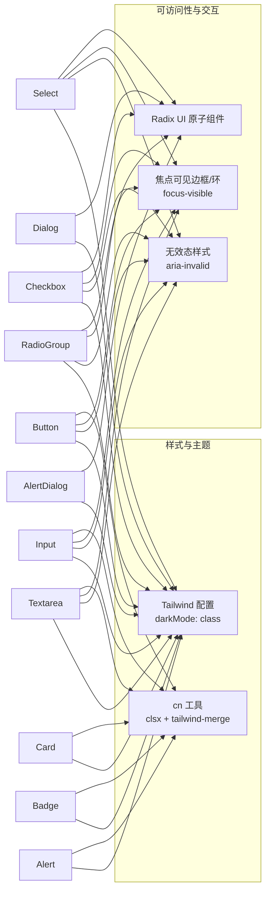
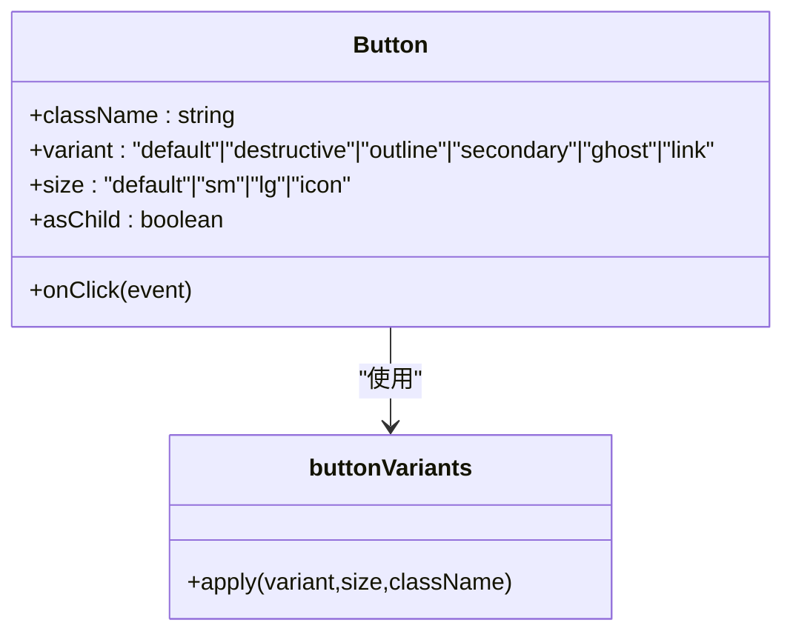
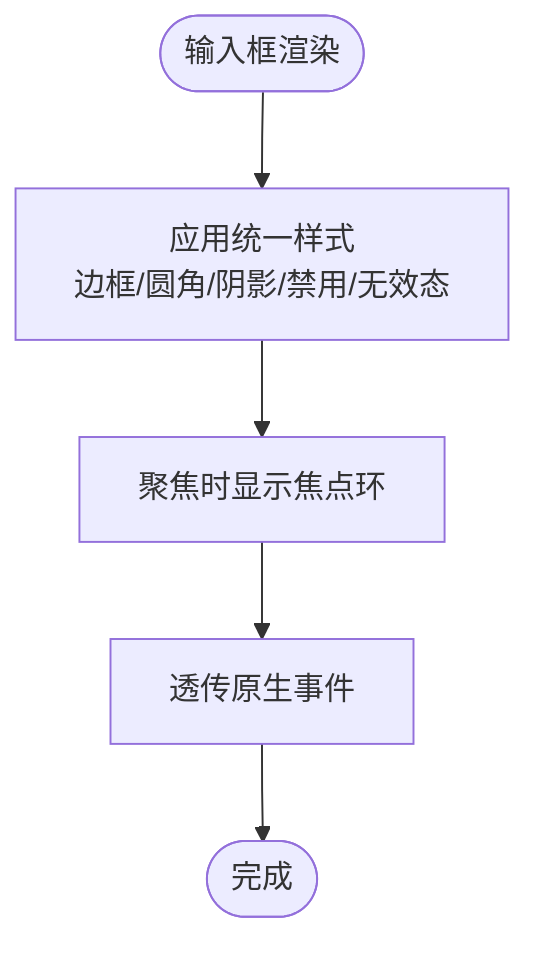
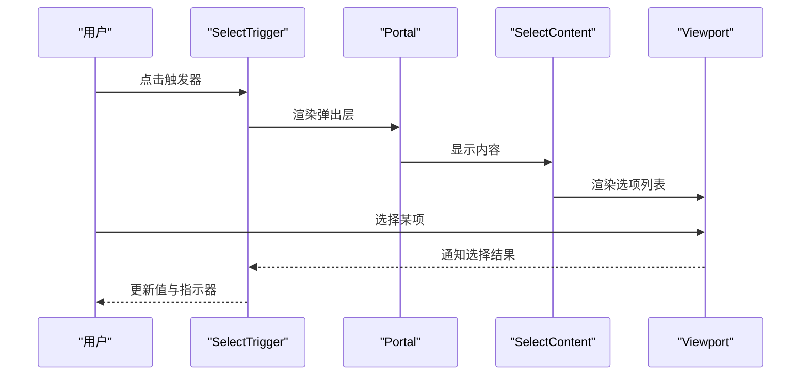
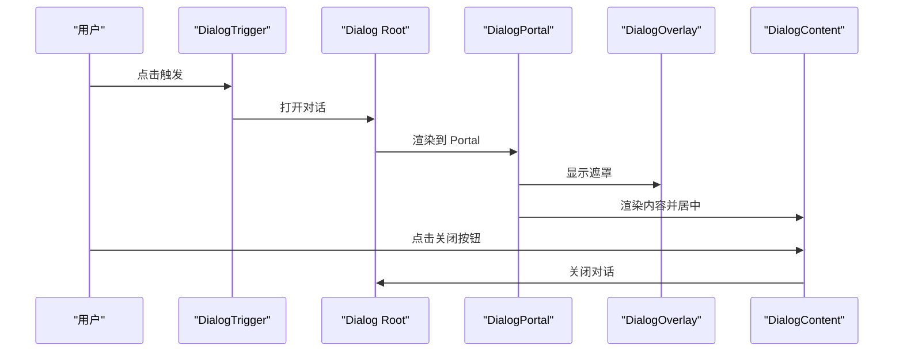
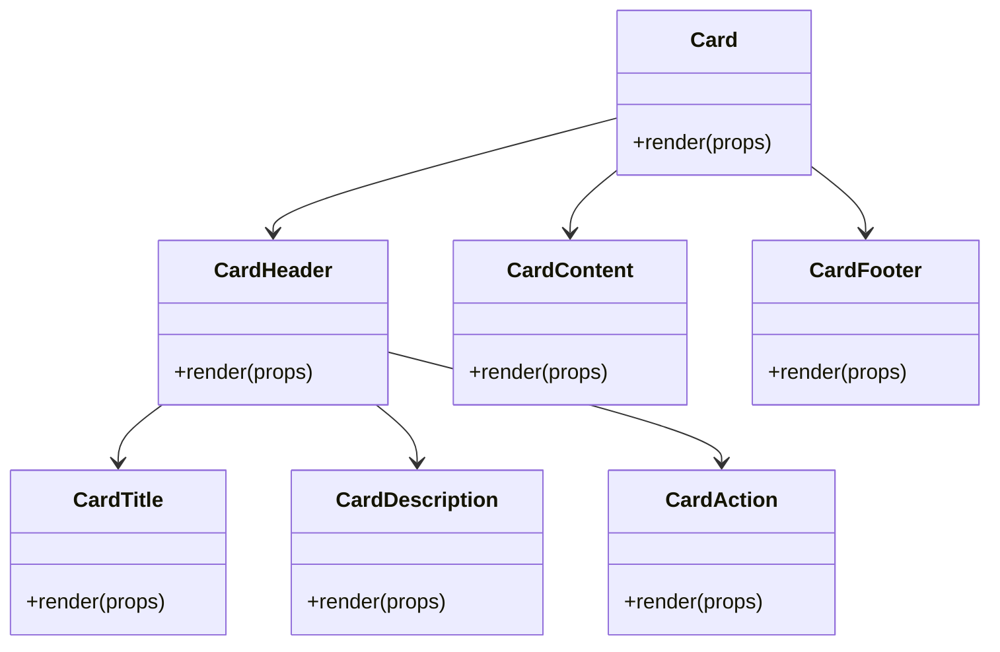
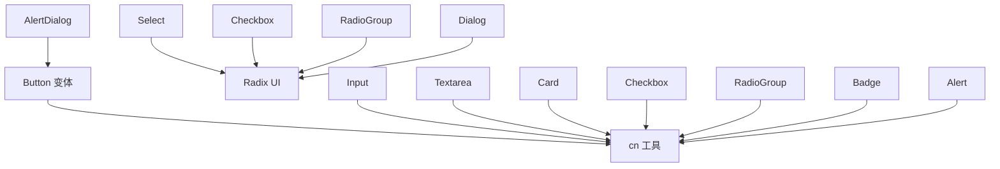

# 基础UI组件

<cite>
**本文引用的文件**
- [frontend/src/components/ui/button.tsx](file://frontend/src/components/ui/button.tsx)
- [frontend/src/components/ui/input.tsx](file://frontend/src/components/ui/input.tsx)
- [frontend/src/components/ui/select.tsx](file://frontend/src/components/ui/select.tsx)
- [frontend/src/components/ui/textarea.tsx](file://frontend/src/components/ui/textarea.tsx)
- [frontend/src/components/ui/dialog.tsx](file://frontend/src/components/ui/dialog.tsx)
- [frontend/src/components/ui/card.tsx](file://frontend/src/components/ui/card.tsx)
- [frontend/src/components/ui/checkbox.tsx](file://frontend/src/components/ui/checkbox.tsx)
- [frontend/src/components/ui/radio-group.tsx](file://frontend/src/components/ui/radio-group.tsx)
- [frontend/src/components/ui/form-section.tsx](file://frontend/src/components/ui/form-section.tsx)
- [frontend/src/components/ui/badge.tsx](file://frontend/src/components/ui/badge.tsx)
- [frontend/src/components/ui/alert.tsx](file://frontend/src/components/ui/alert.tsx)
- [frontend/src/components/ui/alert-dialog.tsx](file://frontend/src/components/ui/alert-dialog.tsx)
- [frontend/src/lib/utils.ts](file://frontend/src/lib/utils.ts)
- [frontend/tailwind.config.ts](file://frontend/tailwind.config.ts)
</cite>

## 目录
1. [简介](#简介)
2. [项目结构](#项目结构)
3. [核心组件](#核心组件)
4. [架构总览](#架构总览)
5. [组件详解](#组件详解)
6. [依赖关系分析](#依赖关系分析)
7. [性能与可访问性](#性能与可访问性)
8. [故障排查指南](#故障排查指南)
9. [结论](#结论)
10. [附录：最佳实践与示例路径](#附录最佳实践与示例路径)

## 简介
本文件系统化梳理前端基础UI组件库，覆盖按钮、输入框、选择器、文本域、对话框、卡片、复选框、单选组、表单分节、徽章、警示与确认对话等常用组件。内容包括：
- 设计规范与使用方法
- 组件属性接口与事件处理要点
- 样式定制选项（主题、尺寸、变体）
- 可访问性支持与响应式行为
- 状态管理、错误处理与交互模式
- 完整示例路径与最佳实践

## 项目结构
UI组件集中于 frontend/src/components/ui 目录，采用“原子化组件 + 组合容器”的分层设计：
- 原子组件：button、input、select、textarea、checkbox、radio-group、badge、alert、alert-dialog、dialog 等
- 复用工具：cn 合并类名、Tailwind 配置
- 组合容器：card、form-section 等用于布局与语义组织

图表来源
- [frontend/src/components/ui/button.tsx](file://frontend/src/components/ui/button.tsx#L1-L60)
- [frontend/src/components/ui/input.tsx](file://frontend/src/components/ui/input.tsx#L1-L22)
- [frontend/src/components/ui/select.tsx](file://frontend/src/components/ui/select.tsx#L1-L186)
- [frontend/src/components/ui/textarea.tsx](file://frontend/src/components/ui/textarea.tsx#L1-L19)
- [frontend/src/components/ui/dialog.tsx](file://frontend/src/components/ui/dialog.tsx#L1-L144)
- [frontend/src/components/ui/card.tsx](file://frontend/src/components/ui/card.tsx#L1-L93)
- [frontend/src/components/ui/checkbox.tsx](file://frontend/src/components/ui/checkbox.tsx#L1-L33)
- [frontend/src/components/ui/radio-group.tsx](file://frontend/src/components/ui/radio-group.tsx#L1-L46)
- [frontend/src/components/ui/form-section.tsx](file://frontend/src/components/ui/form-section.tsx#L1-L46)
- [frontend/src/components/ui/badge.tsx](file://frontend/src/components/ui/badge.tsx#L1-L47)
- [frontend/src/components/ui/alert.tsx](file://frontend/src/components/ui/alert.tsx#L1-L59)
- [frontend/src/components/ui/alert-dialog.tsx](file://frontend/src/components/ui/alert-dialog.tsx#L1-L158)
- [frontend/src/lib/utils.ts](file://frontend/src/lib/utils.ts#L1-L7)
- [frontend/tailwind.config.ts](file://frontend/tailwind.config.ts#L1-L17)

章节来源
- [frontend/src/components/ui/button.tsx](file://frontend/src/components/ui/button.tsx#L1-L60)
- [frontend/src/components/ui/input.tsx](file://frontend/src/components/ui/input.tsx#L1-L22)
- [frontend/src/components/ui/select.tsx](file://frontend/src/components/ui/select.tsx#L1-L186)
- [frontend/src/components/ui/textarea.tsx](file://frontend/src/components/ui/textarea.tsx#L1-L19)
- [frontend/src/components/ui/dialog.tsx](file://frontend/src/components/ui/dialog.tsx#L1-L144)
- [frontend/src/components/ui/card.tsx](file://frontend/src/components/ui/card.tsx#L1-L93)
- [frontend/src/components/ui/checkbox.tsx](file://frontend/src/components/ui/checkbox.tsx#L1-L33)
- [frontend/src/components/ui/radio-group.tsx](file://frontend/src/components/ui/radio-group.tsx#L1-L46)
- [frontend/src/components/ui/form-section.tsx](file://frontend/src/components/ui/form-section.tsx#L1-L46)
- [frontend/src/components/ui/badge.tsx](file://frontend/src/components/ui/badge.tsx#L1-L47)
- [frontend/src/components/ui/alert.tsx](file://frontend/src/components/ui/alert.tsx#L1-L59)
- [frontend/src/components/ui/alert-dialog.tsx](file://frontend/src/components/ui/alert-dialog.tsx#L1-L158)
- [frontend/src/lib/utils.ts](file://frontend/src/lib/utils.ts#L1-L7)
- [frontend/tailwind.config.ts](file://frontend/tailwind.config.ts#L1-L17)

## 核心组件
- 按钮 Button：支持多种变体与尺寸，支持作为容器渲染；具备焦点可见边框与禁用态样式。
- 输入框 Input：统一边框、聚焦环、禁用态与无效态样式；支持文件输入与占位符。
- 选择器 Select：基于 Radix UI 的组合组件，支持分组、标签、滚动按钮、内容定位。
- 文本域 Textarea：多行文本输入，统一边框、聚焦环与禁用态。
- 对话框 Dialog：通用模态容器，支持关闭按钮、标题、描述与布局容器。
- 卡片 Card：卡片容器与头部/标题/描述/内容/底部/操作区组合。
- 复选框 Checkbox：受控指示器，支持无效态与焦点环。
- 单选组 RadioGroup：组合单选项，支持指示器。
- 表单分节 FormSection：标题、描述与子项容器，支持 Label 关联。
- 徽章 Badge：轻量标签，支持变体与作为容器渲染。
- 警示 Alert：信息提示容器，支持默认与破坏性样式。
- 确认对话 AlertDialog：强调动作的确认流程，内置 Action 与 Cancel。

章节来源
- [frontend/src/components/ui/button.tsx](file://frontend/src/components/ui/button.tsx#L38-L57)
- [frontend/src/components/ui/input.tsx](file://frontend/src/components/ui/input.tsx#L5-L19)
- [frontend/src/components/ui/select.tsx](file://frontend/src/components/ui/select.tsx#L9-L185)
- [frontend/src/components/ui/textarea.tsx](file://frontend/src/components/ui/textarea.tsx#L5-L16)
- [frontend/src/components/ui/dialog.tsx](file://frontend/src/components/ui/dialog.tsx#L10-L143)
- [frontend/src/components/ui/card.tsx](file://frontend/src/components/ui/card.tsx#L5-L92)
- [frontend/src/components/ui/checkbox.tsx](file://frontend/src/components/ui/checkbox.tsx#L9-L30)
- [frontend/src/components/ui/radio-group.tsx](file://frontend/src/components/ui/radio-group.tsx#L9-L45)
- [frontend/src/components/ui/form-section.tsx](file://frontend/src/components/ui/form-section.tsx#L15-L45)
- [frontend/src/components/ui/badge.tsx](file://frontend/src/components/ui/badge.tsx#L28-L46)
- [frontend/src/components/ui/alert.tsx](file://frontend/src/components/ui/alert.tsx#L22-L58)
- [frontend/src/components/ui/alert-dialog.tsx](file://frontend/src/components/ui/alert-dialog.tsx#L9-L157)

## 架构总览
组件遵循统一的样式策略与可访问性约定：
- 使用 Tailwind 类与 cn 合并工具实现一致的视觉与交互体验
- 通过 data-slot 标记 DOM 结构，便于测试与样式覆盖
- 以 Radix UI 提供无障碍与跨浏览器一致性
- 支持深色模式与无效态反馈

图表来源
- [frontend/src/lib/utils.ts](file://frontend/src/lib/utils.ts#L4-L6)
- [frontend/tailwind.config.ts](file://frontend/tailwind.config.ts#L10-L10)
- [frontend/src/components/ui/button.tsx](file://frontend/src/components/ui/button.tsx#L7-L36)
- [frontend/src/components/ui/input.tsx](file://frontend/src/components/ui/input.tsx#L10-L15)
- [frontend/src/components/ui/select.tsx](file://frontend/src/components/ui/select.tsx#L39-L42)
- [frontend/src/components/ui/textarea.tsx](file://frontend/src/components/ui/textarea.tsx#L9-L12)
- [frontend/src/components/ui/dialog.tsx](file://frontend/src/components/ui/dialog.tsx#L34-L48)
- [frontend/src/components/ui/card.tsx](file://frontend/src/components/ui/card.tsx#L9-L12)
- [frontend/src/components/ui/checkbox.tsx](file://frontend/src/components/ui/checkbox.tsx#L16-L19)
- [frontend/src/components/ui/radio-group.tsx](file://frontend/src/components/ui/radio-group.tsx#L29-L32)
- [frontend/src/components/ui/alert-dialog.tsx](file://frontend/src/components/ui/alert-dialog.tsx#L31-L45)

## 组件详解

### 按钮 Button
- 属性接口
  - className: 字符串，追加自定义样式
  - variant: 变体，支持 default、destructive、outline、secondary、ghost、link
  - size: 尺寸，支持 default、sm、lg、icon
  - asChild: 是否以子节点容器渲染
  - 其余原生 button 属性透传
- 事件处理
  - onClick 等标准事件透传
- 样式定制
  - 通过 variant/size 控制外观与尺寸
  - 支持禁用态与焦点环
- 示例路径
  - [frontend/src/components/ui/button.tsx](file://frontend/src/components/ui/button.tsx#L38-L57)

图表来源
- [frontend/src/components/ui/button.tsx](file://frontend/src/components/ui/button.tsx#L7-L36)
- [frontend/src/components/ui/button.tsx](file://frontend/src/components/ui/button.tsx#L38-L57)

章节来源
- [frontend/src/components/ui/button.tsx](file://frontend/src/components/ui/button.tsx#L7-L36)
- [frontend/src/components/ui/button.tsx](file://frontend/src/components/ui/button.tsx#L38-L57)

### 输入框 Input
- 属性接口
  - className: 字符串
  - type: 原生 input type
  - 其余原生 input 属性透传
- 事件处理
  - onChange、onFocus、onBlur 等透传
- 样式定制
  - 统一边框、圆角、阴影、禁用态与无效态
  - 支持文件输入与占位符
- 示例路径
  - [frontend/src/components/ui/input.tsx](file://frontend/src/components/ui/input.tsx#L5-L19)

图表来源
- [frontend/src/components/ui/input.tsx](file://frontend/src/components/ui/input.tsx#L10-L15)

章节来源
- [frontend/src/components/ui/input.tsx](file://frontend/src/components/ui/input.tsx#L5-L19)

### 选择器 Select
- 组件族
  - Select、SelectTrigger、SelectValue、SelectContent、SelectLabel、SelectItem、SelectSeparator、SelectScrollUpButton、SelectScrollDownButton、SelectGroup
- 属性接口
  - SelectTrigger 支持 size: sm/default
  - SelectContent 支持 position: popper 或其他 Radix 位置策略
- 事件处理
  - 由 Radix UI 提供开合与选择事件
- 样式定制
  - 触发器与选项统一尺寸与动画
  - 支持滚动按钮与分隔线
- 示例路径
  - [frontend/src/components/ui/select.tsx](file://frontend/src/components/ui/select.tsx#L9-L185)

图表来源
- [frontend/src/components/ui/select.tsx](file://frontend/src/components/ui/select.tsx#L35-L85)

章节来源
- [frontend/src/components/ui/select.tsx](file://frontend/src/components/ui/select.tsx#L9-L185)

### 文本域 Textarea
- 属性接口
  - className: 字符串
  - 其余原生 textarea 属性透传
- 事件处理
  - onChange、onFocus、onBlur 等透传
- 样式定制
  - 统一边框、圆角、阴影、禁用态与无效态
- 示例路径
  - [frontend/src/components/ui/textarea.tsx](file://frontend/src/components/ui/textarea.tsx#L5-L16)

章节来源
- [frontend/src/components/ui/textarea.tsx](file://frontend/src/components/ui/textarea.tsx#L5-L16)

### 对话框 Dialog
- 组件族
  - Dialog、DialogTrigger、DialogPortal、DialogOverlay、DialogContent、DialogHeader、DialogFooter、DialogTitle、DialogDescription、DialogClose
- 属性接口
  - DialogContent 支持 showCloseButton: boolean
- 事件处理
  - 由 Radix UI 提供开合事件
- 样式定制
  - 背景遮罩、居中网格布局、关闭按钮与无障碍标签
- 示例路径
  - [frontend/src/components/ui/dialog.tsx](file://frontend/src/components/ui/dialog.tsx#L10-L143)

图表来源
- [frontend/src/components/ui/dialog.tsx](file://frontend/src/components/ui/dialog.tsx#L50-L81)

章节来源
- [frontend/src/components/ui/dialog.tsx](file://frontend/src/components/ui/dialog.tsx#L10-L143)

### 卡片 Card
- 组件族
  - Card、CardHeader、CardTitle、CardDescription、CardContent、CardFooter、CardAction
- 属性接口
  - 通用 div 属性透传
- 样式定制
  - 统一圆角、边框、阴影与内间距
  - Header 支持右侧操作区与分隔线
- 示例路径
  - [frontend/src/components/ui/card.tsx](file://frontend/src/components/ui/card.tsx#L5-L92)

图表来源
- [frontend/src/components/ui/card.tsx](file://frontend/src/components/ui/card.tsx#L5-L92)

章节来源
- [frontend/src/components/ui/card.tsx](file://frontend/src/components/ui/card.tsx#L5-L92)

### 复选框 Checkbox
- 属性接口
  - className: 字符串
  - 其余原生元素属性透传
- 事件处理
  - 由 Radix UI 提供选中状态切换
- 样式定制
  - 统一尺寸、圆角、边框、阴影与无效态
- 示例路径
  - [frontend/src/components/ui/checkbox.tsx](file://frontend/src/components/ui/checkbox.tsx#L9-L30)

章节来源
- [frontend/src/components/ui/checkbox.tsx](file://frontend/src/components/ui/checkbox.tsx#L9-L30)

### 单选组 RadioGroup
- 组件族
  - RadioGroup、RadioGroupItem
- 属性接口
  - RadioGroupItem 支持指示器
- 事件处理
  - 由 Radix UI 提供选中状态
- 样式定制
  - 统一尺寸、边框、阴影与无效态
- 示例路径
  - [frontend/src/components/ui/radio-group.tsx](file://frontend/src/components/ui/radio-group.tsx#L9-L45)

章节来源
- [frontend/src/components/ui/radio-group.tsx](file://frontend/src/components/ui/radio-group.tsx#L9-L45)

### 表单分节 FormSection
- 属性接口
  - title: 标题字符串
  - description?: 描述字符串
  - children: 子项集合
  - htmlFor?: 关联的 Label id
- 事件处理
  - 无直接事件，通过子组件传递
- 样式定制
  - 标题与描述层级、子项垂直间距
- 示例路径
  - [frontend/src/components/ui/form-section.tsx](file://frontend/src/components/ui/form-section.tsx#L15-L45)

章节来源
- [frontend/src/components/ui/form-section.tsx](file://frontend/src/components/ui/form-section.tsx#L15-L45)

### 徽章 Badge
- 属性接口
  - className: 字符串
  - variant: 变体，支持 default、secondary、destructive、outline
  - asChild: 是否以子节点容器渲染
  - 其余原生 span 属性透传
- 事件处理
  - 透传原生事件
- 样式定制
  - 通过 variant 控制背景与边框
- 示例路径
  - [frontend/src/components/ui/badge.tsx](file://frontend/src/components/ui/badge.tsx#L28-L46)

章节来源
- [frontend/src/components/ui/badge.tsx](file://frontend/src/components/ui/badge.tsx#L28-L46)

### 警示 Alert
- 组件族
  - Alert、AlertTitle、AlertDescription
- 属性接口
  - variant: default/destructive
- 事件处理
  - 透传 div/p 标签事件
- 样式定制
  - 默认与破坏性两种风格
- 示例路径
  - [frontend/src/components/ui/alert.tsx](file://frontend/src/components/ui/alert.tsx#L22-L58)

章节来源
- [frontend/src/components/ui/alert.tsx](file://frontend/src/components/ui/alert.tsx#L22-L58)

### 确认对话 AlertDialog
- 组件族
  - AlertDialog、AlertDialogTrigger、AlertDialogPortal、AlertDialogOverlay、AlertDialogContent、AlertDialogHeader、AlertDialogFooter、AlertDialogTitle、AlertDialogDescription、AlertDialogAction、AlertDialogCancel
- 属性接口
  - AlertDialogAction 内部使用 Button 变体
  - AlertDialogCancel 使用 outline 变体
- 事件处理
  - 由 Radix UI 提供开合事件
- 样式定制
  - 强调动作的对话框布局与按钮变体
- 示例路径
  - [frontend/src/components/ui/alert-dialog.tsx](file://frontend/src/components/ui/alert-dialog.tsx#L9-L157)

章节来源
- [frontend/src/components/ui/alert-dialog.tsx](file://frontend/src/components/ui/alert-dialog.tsx#L9-L157)

## 依赖关系分析
- 组件间耦合
  - AlertDialog 内部复用 Button 变体，保持一致的按钮风格
  - Select/Checkbox/RadioGroup 基于 Radix UI，确保可访问性与跨浏览器一致性
  - 所有组件均通过 cn 工具合并类名，避免样式冲突
- 外部依赖
  - class-variance-authority：变体样式生成
  - @radix-ui/react-*：可访问性与状态管理
  - lucide-react：图标
  - Tailwind CSS：原子化样式

图表来源
- [frontend/src/components/ui/alert-dialog.tsx](file://frontend/src/components/ui/alert-dialog.tsx#L7-L7)
- [frontend/src/components/ui/select.tsx](file://frontend/src/components/ui/select.tsx#L3-L5)
- [frontend/src/components/ui/checkbox.tsx](file://frontend/src/components/ui/checkbox.tsx#L3-L5)
- [frontend/src/components/ui/radio-group.tsx](file://frontend/src/components/ui/radio-group.tsx#L3-L5)
- [frontend/src/components/ui/button.tsx](file://frontend/src/components/ui/button.tsx#L2-L3)
- [frontend/src/lib/utils.ts](file://frontend/src/lib/utils.ts#L4-L6)

章节来源
- [frontend/src/components/ui/alert-dialog.tsx](file://frontend/src/components/ui/alert-dialog.tsx#L7-L7)
- [frontend/src/components/ui/select.tsx](file://frontend/src/components/ui/select.tsx#L3-L5)
- [frontend/src/components/ui/checkbox.tsx](file://frontend/src/components/ui/checkbox.tsx#L3-L5)
- [frontend/src/components/ui/radio-group.tsx](file://frontend/src/components/ui/radio-group.tsx#L3-L5)
- [frontend/src/components/ui/button.tsx](file://frontend/src/components/ui/button.tsx#L2-L3)
- [frontend/src/lib/utils.ts](file://frontend/src/lib/utils.ts#L4-L6)

## 性能与可访问性
- 性能特性
  - 组件均为轻量函数组件，按需渲染
  - 使用 Portal 渲染对话框内容，减少 DOM 层级影响
  - 通过 data-slot 标记结构，利于样式覆盖与测试
- 可访问性支持
  - 基于 Radix UI，提供键盘导航、焦点管理与 ARIA 属性
  - 统一焦点环与无效态样式，提升可用性
  - 对话框组件提供关闭按钮的无障碍标签
- 响应式行为
  - Tailwind 配置启用暗色模式与断点，组件样式随类名自动适配
  - 选择器与对话框内容根据视口尺寸自适应

章节来源
- [frontend/src/components/ui/dialog.tsx](file://frontend/src/components/ui/dialog.tsx#L58-L76)
- [frontend/src/components/ui/select.tsx](file://frontend/src/components/ui/select.tsx#L58-L85)
- [frontend/tailwind.config.ts](file://frontend/tailwind.config.ts#L10-L10)

## 故障排查指南
- 焦点环与无效态不生效
  - 检查是否正确设置 aria-invalid 与 focus-visible 样式
  - 确认 Tailwind darkMode 设置为 class
- 对话框无法关闭或遮罩点击无效
  - 确保 DialogTrigger/DialogClose 正确绑定
  - 检查 Portal 渲染与 z-index 层级
- 选择器选项不显示或滚动异常
  - 确认 SelectContent 的 position 与 Portal 使用
  - 检查 Viewport 尺寸与滚动按钮
- 样式冲突或覆盖失败
  - 使用 cn 工具合并类名，避免重复覆盖
  - 避免在父级强制覆盖 data-slot 标记的结构

章节来源
- [frontend/src/components/ui/dialog.tsx](file://frontend/src/components/ui/dialog.tsx#L50-L81)
- [frontend/src/components/ui/select.tsx](file://frontend/src/components/ui/select.tsx#L58-L85)
- [frontend/src/lib/utils.ts](file://frontend/src/lib/utils.ts#L4-L6)
- [frontend/tailwind.config.ts](file://frontend/tailwind.config.ts#L10-L10)

## 结论
该基础UI组件库以统一的样式策略、可访问性保障与轻量实现为核心，覆盖了常见的表单与交互场景。通过 cn 工具与 Tailwind 原子类，组件具备良好的可定制性；借助 Radix UI，确保跨浏览器与无障碍一致性。建议在实际项目中遵循本文档的属性接口、事件处理与样式定制建议，结合最佳实践路径快速集成与扩展。

## 附录：最佳实践与示例路径
- 按钮
  - 变体与尺寸选择：优先使用 default/secondary；危险操作使用 destructive；仅图标使用 icon
  - 示例路径：[frontend/src/components/ui/button.tsx](file://frontend/src/components/ui/button.tsx#L38-L57)
- 输入框
  - 错误状态：配合 aria-invalid 与无效态样式
  - 示例路径：[frontend/src/components/ui/input.tsx](file://frontend/src/components/ui/input.tsx#L5-L19)
- 选择器
  - 大列表：使用滚动按钮与 popper 定位
  - 示例路径：[frontend/src/components/ui/select.tsx](file://frontend/src/components/ui/select.tsx#L58-L85)
- 文本域
  - 自适应高度：利用最小高度与换行控制
  - 示例路径：[frontend/src/components/ui/textarea.tsx](file://frontend/src/components/ui/textarea.tsx#L5-L16)
- 对话框
  - 关闭按钮：始终提供可访问的关闭方式
  - 示例路径：[frontend/src/components/ui/dialog.tsx](file://frontend/src/components/ui/dialog.tsx#L72-L77)
- 卡片
  - 结构化内容：使用 Header/Title/Description/Content/Footer 组织
  - 示例路径：[frontend/src/components/ui/card.tsx](file://frontend/src/components/ui/card.tsx#L5-L92)
- 复选框与单选组
  - 语义化：与 Label 关联，提供清晰的指示器
  - 示例路径：[frontend/src/components/ui/checkbox.tsx](file://frontend/src/components/ui/checkbox.tsx#L9-L30)、[frontend/src/components/ui/radio-group.tsx](file://frontend/src/components/ui/radio-group.tsx#L9-L45)
- 表单分节
  - 分组与描述：使用 FormSection 组织表单项
  - 示例路径：[frontend/src/components/ui/form-section.tsx](file://frontend/src/components/ui/form-section.tsx#L15-L45)
- 徽章
  - 轻量信息：使用 default/secondary；强调使用 destructive
  - 示例路径：[frontend/src/components/ui/badge.tsx](file://frontend/src/components/ui/badge.tsx#L28-L46)
- 警示与确认对话
  - 信息提示：Alert；重要操作：AlertDialog
  - 示例路径：[frontend/src/components/ui/alert.tsx](file://frontend/src/components/ui/alert.tsx#L22-L58)、[frontend/src/components/ui/alert-dialog.tsx](file://frontend/src/components/ui/alert-dialog.tsx#L9-L157)