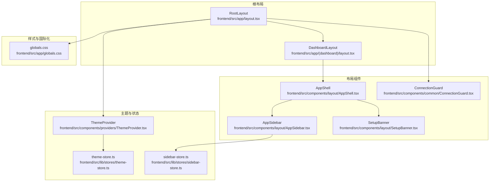
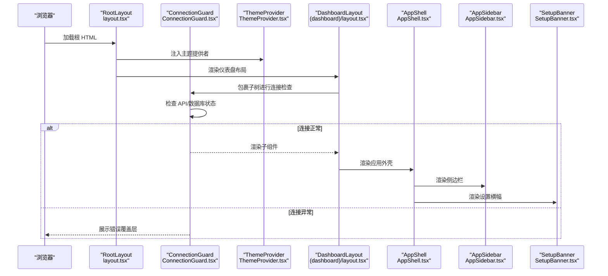
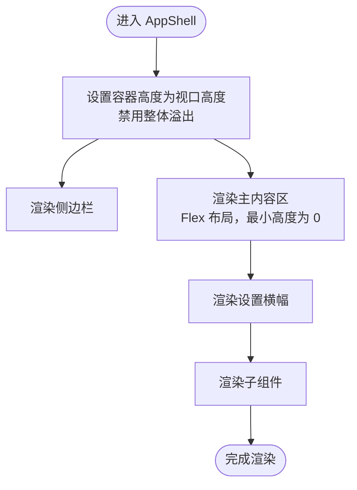
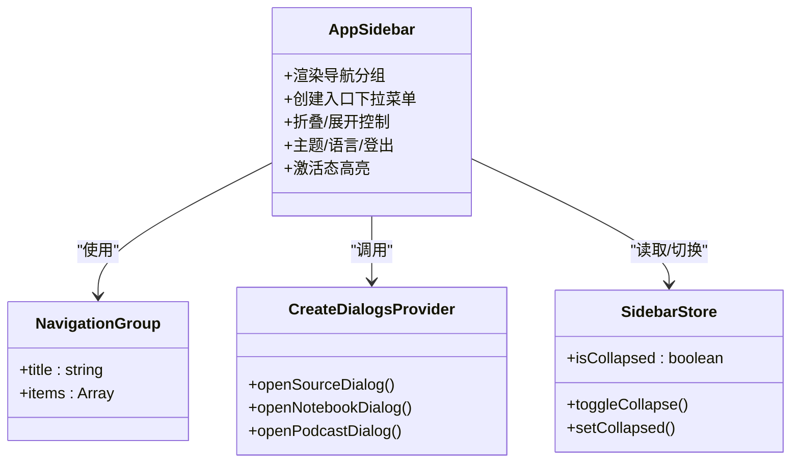
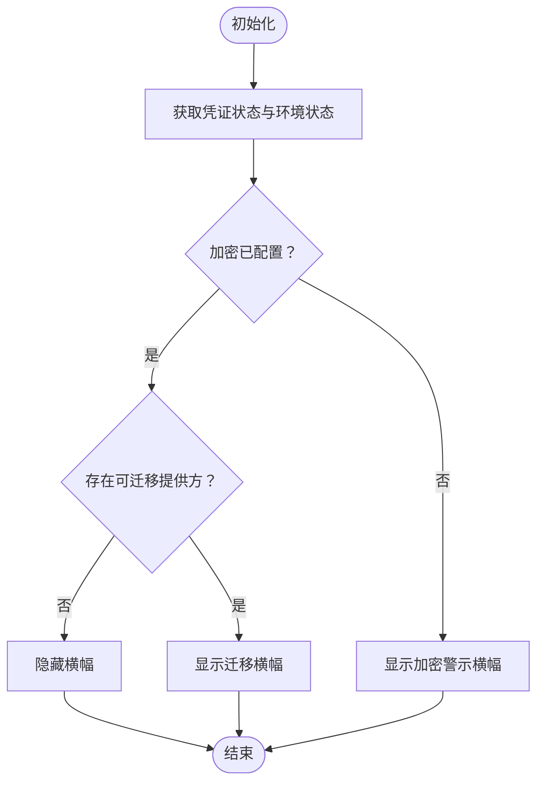
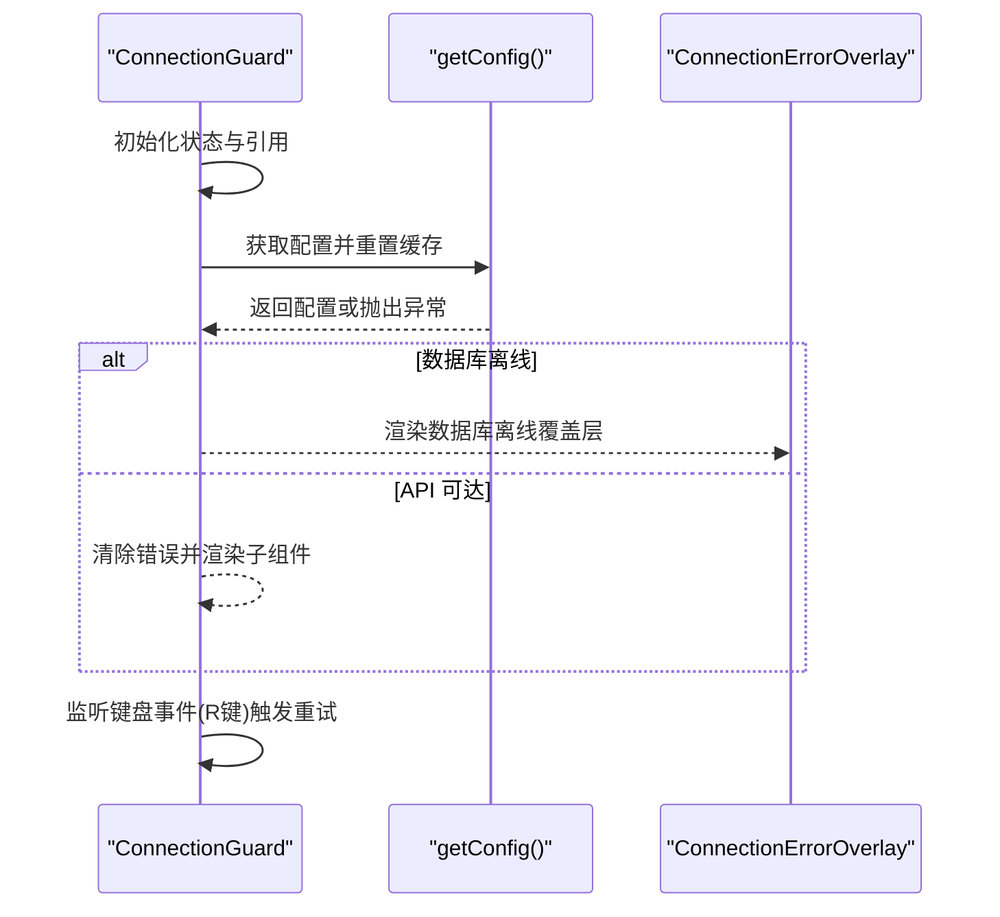
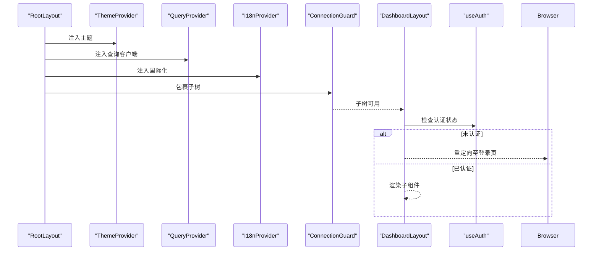
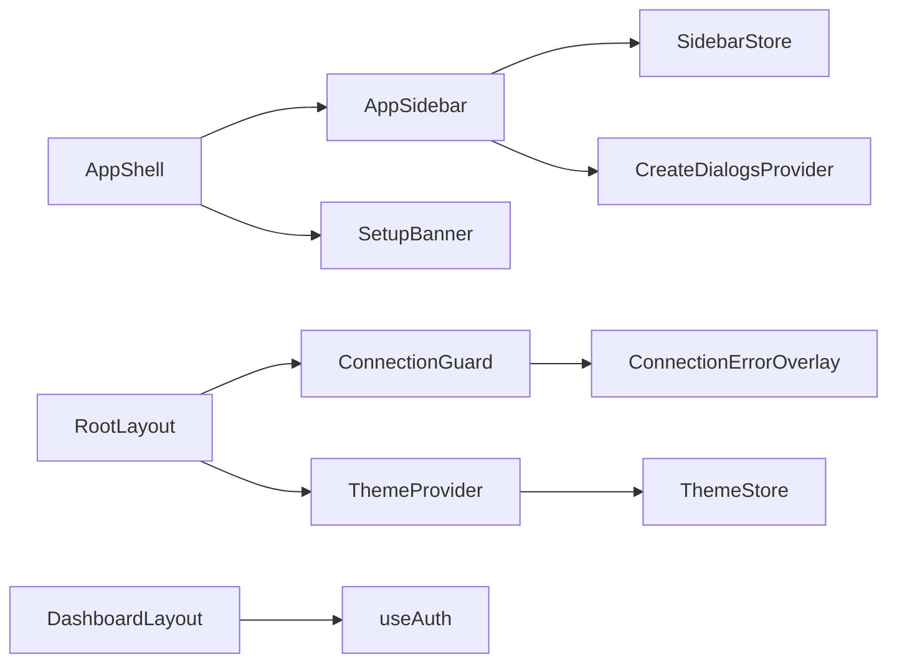

# 布局组件

<cite>
**本文引用的文件**
- [frontend/src/components/layout/AppShell.tsx](file://frontend/src/components/layout/AppShell.tsx)
- [frontend/src/components/layout/AppSidebar.tsx](file://frontend/src/components/layout/AppSidebar.tsx)
- [frontend/src/components/layout/SetupBanner.tsx](file://frontend/src/components/layout/SetupBanner.tsx)
- [frontend/src/components/common/ConnectionGuard.tsx](file://frontend/src/components/common/ConnectionGuard.tsx)
- [frontend/src/app/layout.tsx](file://frontend/src/app/layout.tsx)
- [frontend/src/app/(dashboard)/layout.tsx](file://frontend/src/app/(dashboard)/layout.tsx)
- [frontend/src/lib/stores/sidebar-store.ts](file://frontend/src/lib/stores/sidebar-store.ts)
- [frontend/src/lib/stores/theme-store.ts](file://frontend/src/lib/stores/theme-store.ts)
- [frontend/src/components/providers/ThemeProvider.tsx](file://frontend/src/components/providers/ThemeProvider.tsx)
- [frontend/src/lib/hooks/use-credentials.ts](file://frontend/src/lib/hooks/use-credentials.ts)
- [frontend/src/components/errors/ConnectionErrorOverlay.tsx](file://frontend/src/components/errors/ConnectionErrorOverlay.tsx)
- [frontend/src/lib/hooks/use-auth.ts](file://frontend/src/lib/hooks/use-auth.ts)
- [frontend/src/lib/hooks/use-create-dialogs.tsx](file://frontend/src/lib/hooks/use-create-dialogs.tsx)
- [frontend/src/app/globals.css](file://frontend/src/app/globals.css)
</cite>

## 目录
1. [简介](#简介)
2. [项目结构](#项目结构)
3. [核心组件](#核心组件)
4. [架构总览](#架构总览)
5. [组件详解](#组件详解)
6. [依赖关系分析](#依赖关系分析)
7. [性能考量](#性能考量)
8. [故障排查指南](#故障排查指南)
9. [结论](#结论)
10. [附录：组合使用与最佳实践](#附录组合使用与最佳实践)

## 简介
本文件系统性梳理前端布局组件体系，涵盖应用外壳、侧边栏、设置横幅与连接保护等核心模块。文档从设计理念、实现方式、层级结构、响应式布局与导航模式入手，深入解析布局配置、主题适配与移动端优化策略，并提供可复用的组合使用示例与最佳实践，帮助开发者在保证一致性的同时提升开发效率与用户体验。

## 项目结构
布局相关代码主要集中在以下位置：
- 应用外壳与侧边栏：frontend/src/components/layout/
- 连接保护与错误覆盖层：frontend/src/components/common/ 与 frontend/src/components/errors/
- 根布局与仪表盘布局：frontend/src/app/
- 主题与状态存储：frontend/src/lib/stores/ 与 frontend/src/components/providers/
- 全局样式与主题变量：frontend/src/app/globals.css

图表来源
- [frontend/src/app/layout.tsx](file://frontend/src/app/layout.tsx#L19-L45)
- [frontend/src/app/(dashboard)/layout.tsx](file://frontend/src/app/(dashboard)/layout.tsx#L13-L63)
- [frontend/src/components/layout/AppShell.tsx](file://frontend/src/components/layout/AppShell.tsx#L10-L20)
- [frontend/src/components/layout/AppSidebar.tsx](file://frontend/src/components/layout/AppSidebar.tsx#L79-L381)
- [frontend/src/components/layout/SetupBanner.tsx](file://frontend/src/components/layout/SetupBanner.tsx#L11-L84)
- [frontend/src/components/common/ConnectionGuard.tsx](file://frontend/src/components/common/ConnectionGuard.tsx#L12-L108)
- [frontend/src/components/providers/ThemeProvider.tsx](file://frontend/src/components/providers/ThemeProvider.tsx#L10-L44)
- [frontend/src/lib/stores/theme-store.ts](file://frontend/src/lib/stores/theme-store.ts#L13-L48)
- [frontend/src/lib/stores/sidebar-store.ts](file://frontend/src/lib/stores/sidebar-store.ts#L10-L20)
- [frontend/src/app/globals.css](file://frontend/src/app/globals.css#L146-L166)

章节来源
- [frontend/src/app/layout.tsx](file://frontend/src/app/layout.tsx#L19-L45)
- [frontend/src/app/(dashboard)/layout.tsx](file://frontend/src/app/(dashboard)/layout.tsx#L13-L63)
- [frontend/src/components/layout/AppShell.tsx](file://frontend/src/components/layout/AppShell.tsx#L10-L20)
- [frontend/src/components/layout/AppSidebar.tsx](file://frontend/src/components/layout/AppSidebar.tsx#L79-L381)
- [frontend/src/components/layout/SetupBanner.tsx](file://frontend/src/components/layout/SetupBanner.tsx#L11-L84)
- [frontend/src/components/common/ConnectionGuard.tsx](file://frontend/src/components/common/ConnectionGuard.tsx#L12-L108)
- [frontend/src/components/providers/ThemeProvider.tsx](file://frontend/src/components/providers/ThemeProvider.tsx#L10-L44)
- [frontend/src/lib/stores/theme-store.ts](file://frontend/src/lib/stores/theme-store.ts#L13-L48)
- [frontend/src/lib/stores/sidebar-store.ts](file://frontend/src/lib/stores/sidebar-store.ts#L10-L20)
- [frontend/src/app/globals.css](file://frontend/src/app/globals.css#L146-L166)

## 核心组件
- 应用外壳 AppShell：统一承载侧边栏与主内容区域，负责布局容器与层级组织。
- 侧边栏 AppSidebar：提供导航分组、创建入口、主题与语言切换、登出等控制项，支持折叠与响应式显示。
- 设置横幅 SetupBanner：根据凭证与环境状态动态展示加密提示或迁移提醒，引导用户完成配置。
- 连接保护 ConnectionGuard：在应用启动时检查 API/数据库连通性，失败时以覆盖层形式呈现错误信息与排障建议。
- 根布局 RootLayout 与仪表盘布局 DashboardLayout：前者注入主题、查询、国际化、错误边界与连接保护；后者处理认证态与会话跳转逻辑。

章节来源
- [frontend/src/components/layout/AppShell.tsx](file://frontend/src/components/layout/AppShell.tsx#L10-L20)
- [frontend/src/components/layout/AppSidebar.tsx](file://frontend/src/components/layout/AppSidebar.tsx#L79-L381)
- [frontend/src/components/layout/SetupBanner.tsx](file://frontend/src/components/layout/SetupBanner.tsx#L11-L84)
- [frontend/src/components/common/ConnectionGuard.tsx](file://frontend/src/components/common/ConnectionGuard.tsx#L12-L108)
- [frontend/src/app/layout.tsx](file://frontend/src/app/layout.tsx#L19-L45)
- [frontend/src/app/(dashboard)/layout.tsx](file://frontend/src/app/(dashboard)/layout.tsx#L13-L63)

## 架构总览
下图展示了从根布局到具体页面的渲染路径，以及连接保护与主题系统的介入点：

图表来源
- [frontend/src/app/layout.tsx](file://frontend/src/app/layout.tsx#L24-L41)
- [frontend/src/app/(dashboard)/layout.tsx](file://frontend/src/app/(dashboard)/layout.tsx#L54-L62)
- [frontend/src/components/common/ConnectionGuard.tsx](file://frontend/src/components/common/ConnectionGuard.tsx#L12-L108)
- [frontend/src/components/providers/ThemeProvider.tsx](file://frontend/src/components/providers/ThemeProvider.tsx#L10-L44)
- [frontend/src/components/layout/AppShell.tsx](file://frontend/src/components/layout/AppShell.tsx#L10-L20)
- [frontend/src/components/layout/AppSidebar.tsx](file://frontend/src/components/layout/AppSidebar.tsx#L79-L381)
- [frontend/src/components/layout/SetupBanner.tsx](file://frontend/src/components/layout/SetupBanner.tsx#L11-L84)

## 组件详解

### 应用外壳 AppShell
- 设计理念：采用“侧边栏 + 主内容区”的双栏布局，通过 Flex 布局确保主内容自适应窗口高度，避免滚动条溢出。
- 关键实现：
  - 容器类名控制高度与溢出，主区域使用 Flex 布局并最小化高度，保证内容区域正确滚动。
  - 将侧边栏与设置横幅作为固定层，确保其不随主内容滚动。
- 响应式与导航：侧边栏由 AppSidebar 负责，AppShell 仅承担容器职责；导航模式由侧边栏内部维护。

图表来源
- [frontend/src/components/layout/AppShell.tsx](file://frontend/src/components/layout/AppShell.tsx#L10-L20)

章节来源
- [frontend/src/components/layout/AppShell.tsx](file://frontend/src/components/layout/AppShell.tsx#L10-L20)

### 侧边栏 AppSidebar
- 导航分组：按“采集/处理/创作/管理”四个大类组织导航项，每组之间以分隔线区分，标题在非折叠状态下显示。
- 创建入口：顶部提供“创建”下拉菜单，支持快速打开“来源/笔记本/播客”创建对话框。
- 折叠与响应式：通过状态存储控制宽度与图标显示，折叠时仅保留图标与工具提示，非折叠时显示完整文本与快捷键提示。
- 用户控制：底部集成主题切换、语言切换、登出按钮，支持平台差异（如 macOS 的快捷键显示）。
- 激活态：根据当前路由高亮对应导航项，增强导航反馈。

图表来源
- [frontend/src/components/layout/AppSidebar.tsx](file://frontend/src/components/layout/AppSidebar.tsx#L46-L75)
- [frontend/src/lib/hooks/use-create-dialogs.tsx](file://frontend/src/lib/hooks/use-create-dialogs.tsx#L16-L39)
- [frontend/src/lib/stores/sidebar-store.ts](file://frontend/src/lib/stores/sidebar-store.ts#L10-L20)

章节来源
- [frontend/src/components/layout/AppSidebar.tsx](file://frontend/src/components/layout/AppSidebar.tsx#L79-L381)
- [frontend/src/lib/hooks/use-create-dialogs.tsx](file://frontend/src/lib/hooks/use-create-dialogs.tsx#L16-L39)
- [frontend/src/lib/stores/sidebar-store.ts](file://frontend/src/lib/stores/sidebar-store.ts#L10-L20)

### 设置横幅 SetupBanner
- 动态展示策略：
  - 当加密未就绪时，显示红色警示横幅，引导用户查看文档并完成加密配置。
  - 当检测到可迁移的提供方时，显示琥珀色横幅，提供一键跳转至设置页的按钮。
- 数据来源：通过凭证状态钩子与环境状态钩子计算迁移目标，避免重复提示。
- 交互设计：横幅内容在小屏设备上采用纵向堆叠，在中大屏采用横向布局，保持可读性与操作便捷性。

图表来源
- [frontend/src/components/layout/SetupBanner.tsx](file://frontend/src/components/layout/SetupBanner.tsx#L11-L84)
- [frontend/src/lib/hooks/use-credentials.ts](file://frontend/src/lib/hooks/use-credentials.ts#L26-L41)

章节来源
- [frontend/src/components/layout/SetupBanner.tsx](file://frontend/src/components/layout/SetupBanner.tsx#L11-L84)
- [frontend/src/lib/hooks/use-credentials.ts](file://frontend/src/lib/hooks/use-credentials.ts#L26-L41)

### 连接保护 ConnectionGuard
- 启动检查：组件挂载后立即尝试获取配置，若数据库离线则报告数据库离线错误，否则尝试访问 API 并捕获异常。
- 错误覆盖层：当出现 API 不可达或数据库离线时，渲染覆盖层卡片，提供排障步骤、快速修复方案与技术细节（可折叠）。
- 重试机制：支持键盘快捷键（R 键）触发重试，避免频繁刷新页面。
- 渲染策略：检查期间返回空节点，防止内容闪烁；检查完成后根据结果决定是否渲染子组件。

图表来源
- [frontend/src/components/common/ConnectionGuard.tsx](file://frontend/src/components/common/ConnectionGuard.tsx#L12-L108)
- [frontend/src/components/errors/ConnectionErrorOverlay.tsx](file://frontend/src/components/errors/ConnectionErrorOverlay.tsx#L20-L175)

章节来源
- [frontend/src/components/common/ConnectionGuard.tsx](file://frontend/src/components/common/ConnectionGuard.tsx#L12-L108)
- [frontend/src/components/errors/ConnectionErrorOverlay.tsx](file://frontend/src/components/errors/ConnectionErrorOverlay.tsx#L20-L175)

### 根布局与仪表盘布局
- 根布局 RootLayout：注入主题提供者、查询客户端、国际化、错误边界与连接保护，确保全局一致的主题与网络状态感知。
- 仪表盘布局 DashboardLayout：在首次加载时检查认证状态，未登录则重定向至登录页并保存回跳路径；认证通过后渲染子组件、模态提供者与命令面板。

图表来源
- [frontend/src/app/layout.tsx](file://frontend/src/app/layout.tsx#L24-L41)
- [frontend/src/app/(dashboard)/layout.tsx](file://frontend/src/app/(dashboard)/layout.tsx#L18-L38)
- [frontend/src/lib/hooks/use-auth.ts](file://frontend/src/lib/hooks/use-auth.ts#L7-L67)

章节来源
- [frontend/src/app/layout.tsx](file://frontend/src/app/layout.tsx#L19-L45)
- [frontend/src/app/(dashboard)/layout.tsx](file://frontend/src/app/(dashboard)/layout.tsx#L13-L63)
- [frontend/src/lib/hooks/use-auth.ts](file://frontend/src/lib/hooks/use-auth.ts#L7-L67)

## 依赖关系分析
- AppShell 依赖 AppSidebar 与 SetupBanner，形成“容器-子组件”关系。
- AppSidebar 依赖：
  - 状态存储：sidebar-store 控制折叠状态
  - 对话框提供者：use-create-dialogs 提供创建入口
  - 国际化与主题：ThemeToggle/LanguageToggle 集成
- ConnectionGuard 依赖配置获取与错误覆盖层，负责全局网络健康检查。
- RootLayout 与 DashboardLayout 分别注入主题与认证检查，形成“外层包裹-内层业务”的分层结构。
- 主题系统通过 ThemeProvider 与 theme-store 实现持久化与系统偏好监听。

图表来源
- [frontend/src/components/layout/AppShell.tsx](file://frontend/src/components/layout/AppShell.tsx#L3-L4)
- [frontend/src/components/layout/AppSidebar.tsx](file://frontend/src/components/layout/AppSidebar.tsx#L10-L12)
- [frontend/src/lib/stores/sidebar-store.ts](file://frontend/src/lib/stores/sidebar-store.ts#L10-L20)
- [frontend/src/lib/hooks/use-create-dialogs.tsx](file://frontend/src/lib/hooks/use-create-dialogs.tsx#L16-L39)
- [frontend/src/app/layout.tsx](file://frontend/src/app/layout.tsx#L30-L41)
- [frontend/src/components/providers/ThemeProvider.tsx](file://frontend/src/components/providers/ThemeProvider.tsx#L10-L44)
- [frontend/src/lib/stores/theme-store.ts](file://frontend/src/lib/stores/theme-store.ts#L13-L48)
- [frontend/src/app/(dashboard)/layout.tsx](file://frontend/src/app/(dashboard)/layout.tsx#L18-L38)
- [frontend/src/components/common/ConnectionGuard.tsx](file://frontend/src/components/common/ConnectionGuard.tsx#L12-L108)
- [frontend/src/components/errors/ConnectionErrorOverlay.tsx](file://frontend/src/components/errors/ConnectionErrorOverlay.tsx#L20-L175)

章节来源
- [frontend/src/components/layout/AppShell.tsx](file://frontend/src/components/layout/AppShell.tsx#L3-L4)
- [frontend/src/components/layout/AppSidebar.tsx](file://frontend/src/components/layout/AppSidebar.tsx#L10-L12)
- [frontend/src/lib/stores/sidebar-store.ts](file://frontend/src/lib/stores/sidebar-store.ts#L10-L20)
- [frontend/src/lib/hooks/use-create-dialogs.tsx](file://frontend/src/lib/hooks/use-create-dialogs.tsx#L16-L39)
- [frontend/src/app/layout.tsx](file://frontend/src/app/layout.tsx#L30-L41)
- [frontend/src/components/providers/ThemeProvider.tsx](file://frontend/src/components/providers/ThemeProvider.tsx#L10-L44)
- [frontend/src/lib/stores/theme-store.ts](file://frontend/src/lib/stores/theme-store.ts#L13-L48)
- [frontend/src/app/(dashboard)/layout.tsx](file://frontend/src/app/(dashboard)/layout.tsx#L18-L38)
- [frontend/src/components/common/ConnectionGuard.tsx](file://frontend/src/components/common/ConnectionGuard.tsx#L12-L108)
- [frontend/src/components/errors/ConnectionErrorOverlay.tsx](file://frontend/src/components/errors/ConnectionErrorOverlay.tsx#L20-L175)

## 性能考量
- 懒加载与条件渲染：ConnectionGuard 在检查期间返回空节点，避免首屏闪烁；SetupBanner 仅在需要时显示，减少不必要的 DOM。
- 状态持久化：sidebar-store 与 theme-store 使用持久化中间件，降低重复初始化成本。
- 主题切换即时生效：ThemeProvider 在挂载时应用有效主题并监听系统偏好变化，避免闪烁。
- 导航激活态：AppSidebar 仅在路径匹配时高亮，减少样式计算开销。

## 故障排查指南
- API 不可达：
  - 现象：覆盖层显示服务器错误标题与描述。
  - 排障：检查 API 地址配置、网络连通性与代理设置；参考快速修复区块中的环境变量示例。
  - 重试：按下 R 键触发重试。
- 数据库离线：
  - 现象：覆盖层显示数据库错误标题与描述。
  - 排障：确认数据库服务状态与日志输出；参考快速修复区块中的命令示例。
- 加密未配置：
  - 现象：设置横幅显示红色警示，提示查看文档完成加密配置。
- 可迁移提供方：
  - 现象：设置横幅显示琥珀色迁移提示，点击“前往设置”跳转。
- 认证问题：
  - 现象：仪表盘布局在未认证时重定向至登录页。
  - 处理：完成登录后自动回跳至原路径。

章节来源
- [frontend/src/components/errors/ConnectionErrorOverlay.tsx](file://frontend/src/components/errors/ConnectionErrorOverlay.tsx#L20-L175)
- [frontend/src/components/common/ConnectionGuard.tsx](file://frontend/src/components/common/ConnectionGuard.tsx#L12-L108)
- [frontend/src/components/layout/SetupBanner.tsx](file://frontend/src/components/layout/SetupBanner.tsx#L11-L84)
- [frontend/src/app/(dashboard)/layout.tsx](file://frontend/src/app/(dashboard)/layout.tsx#L18-L38)

## 结论
该布局体系以“根布局-仪表盘布局-应用外壳-功能组件”的分层结构实现，结合连接保护与主题系统，提供了稳定、可扩展且具备良好用户体验的前端骨架。侧边栏的折叠与响应式设计、设置横幅的动态提示、以及覆盖层的排障能力共同构成了完整的运行时保障。通过状态持久化与即时主题应用，系统在性能与一致性方面表现均衡。

## 附录：组合使用与最佳实践
- 组合使用示例
  - 在页面级布局中引入 AppShell，内部嵌套 AppSidebar 与 SetupBanner，确保导航与横幅始终可见。
  - 在根布局中使用 ConnectionGuard 包裹整个应用树，保证启动阶段的网络健康检查。
  - 在仪表盘布局中使用 useAuth 与会话存储，实现登录态校验与回跳路径记录。
- 最佳实践
  - 保持侧边栏折叠状态与主题设置的持久化，避免用户每次刷新丢失偏好。
  - 将导航项与创建入口集中于 AppSidebar，减少页面重复代码。
  - 利用 SetupBanner 的动态提示机制，及时引导用户完成关键配置。
  - 在连接异常时优先展示覆盖层而非静默失败，提升可诊断性与可恢复性。
  - 使用全局样式变量与主题系统，确保组件在明暗主题下的一致表现。