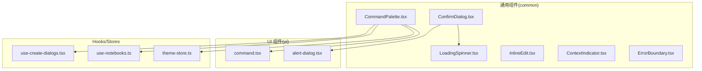
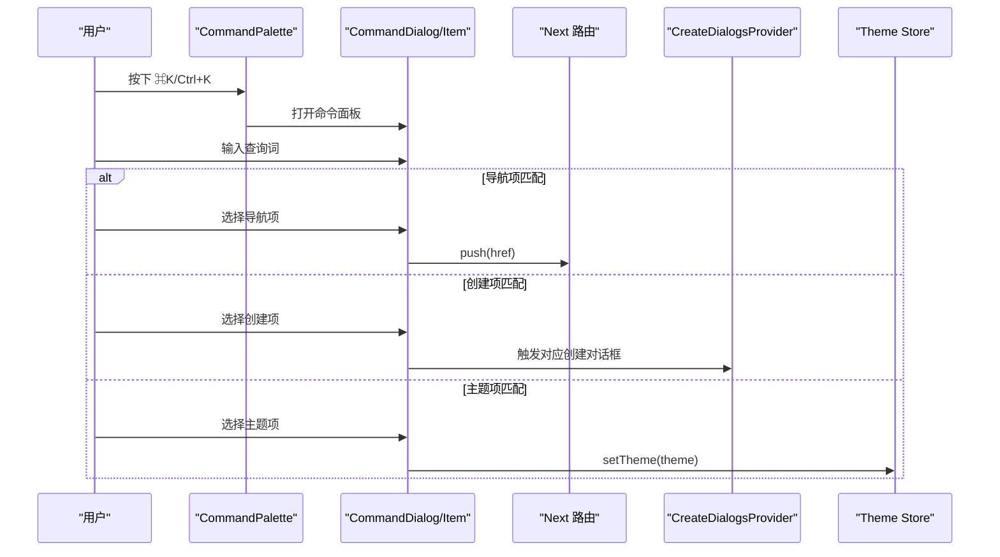
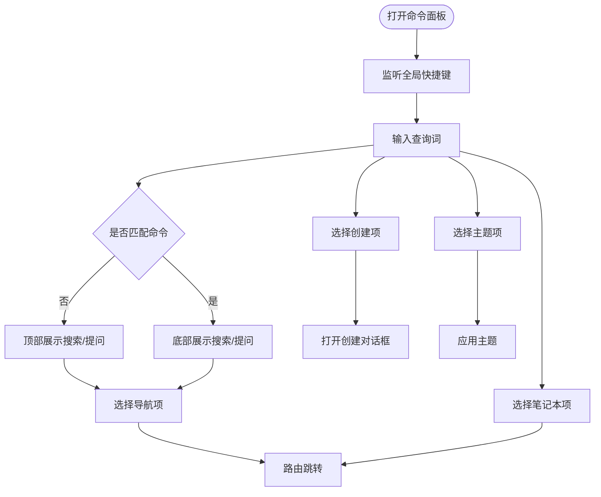
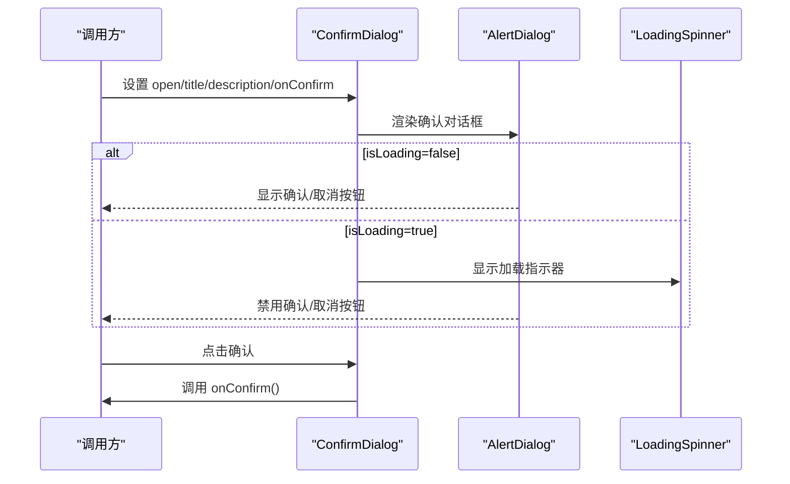
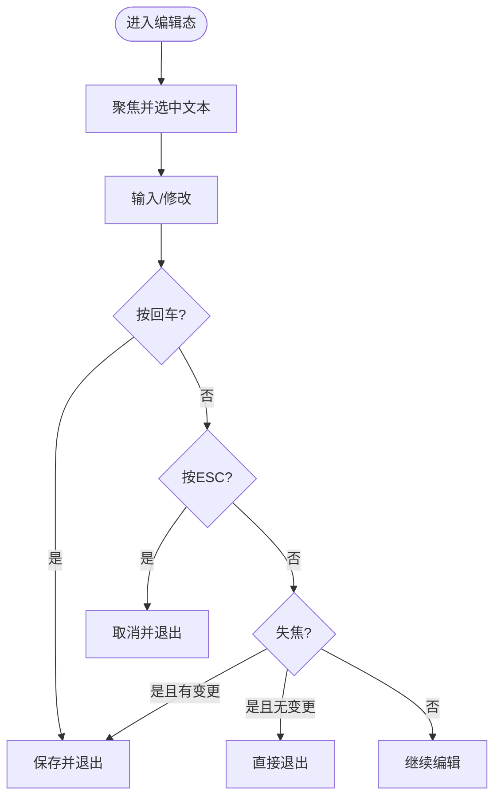
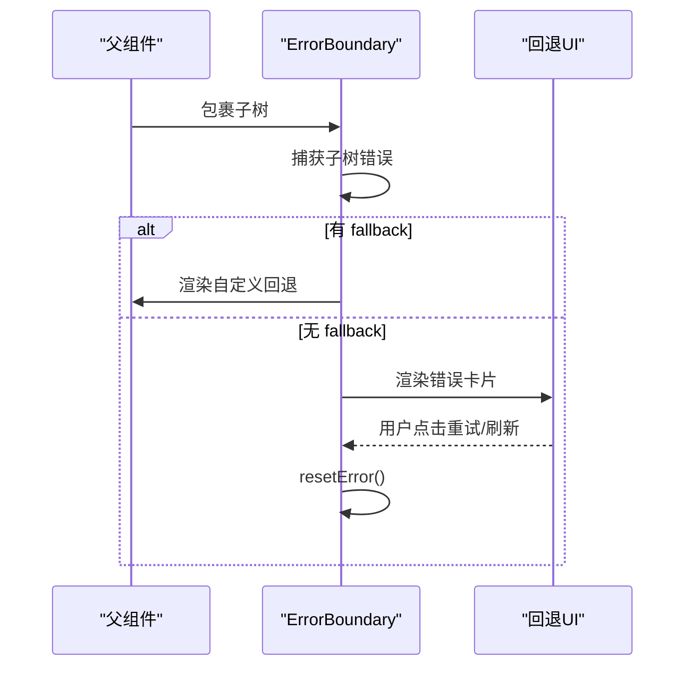
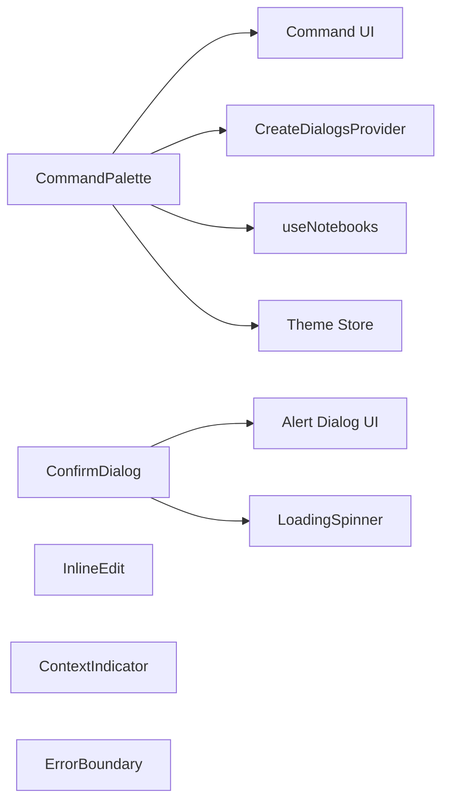

# 通用组件

<cite>
**本文引用的文件**
- [CommandPalette.tsx](file://frontend/src/components/common/CommandPalette.tsx)
- [ConfirmDialog.tsx](file://frontend/src/components/common/ConfirmDialog.tsx)
- [LoadingSpinner.tsx](file://frontend/src/components/common/LoadingSpinner.tsx)
- [InlineEdit.tsx](file://frontend/src/components/common/InlineEdit.tsx)
- [ContextIndicator.tsx](file://frontend/src/components/common/ContextIndicator.tsx)
- [ErrorBoundary.tsx](file://frontend/src/components/common/ErrorBoundary.tsx)
- [command.tsx](file://frontend/src/components/ui/command.tsx)
- [alert-dialog.tsx](file://frontend/src/components/ui/alert-dialog.tsx)
- [use-create-dialogs.tsx](file://frontend/src/lib/hooks/use-create-dialogs.tsx)
- [use-notebooks.ts](file://frontend/src/lib/hooks/use-notebooks.ts)
- [theme-store.ts](file://frontend/src/lib/stores/theme-store.ts)
- [ConfirmDialog.test.tsx](file://frontend/src/components/common/ConfirmDialog.test.tsx)
</cite>

## 目录
1. [简介](#简介)
2. [项目结构](#项目结构)
3. [核心组件](#核心组件)
4. [架构总览](#架构总览)
5. [组件详解](#组件详解)
6. [依赖关系分析](#依赖关系分析)
7. [性能与体验考量](#性能与体验考量)
8. [故障排查指南](#故障排查指南)
9. [结论](#结论)
10. [附录：使用示例与最佳实践](#附录使用示例与最佳实践)

## 简介
本文件为通用组件的综合文档，覆盖以下组件的能力与用法：
- 命令面板：全局快捷键触发、命令搜索与导航、创建入口、主题切换、笔记本直达
- 确认对话框：可选加载态、危险样式、本地化文案
- 加载指示器：尺寸与类名扩展
- 内联编辑：单行/多行、保存/取消、键盘交互、错误回滚
- 上下文指示器：来源/洞察/笔记计数、令牌/字符统计、工具提示
- 错误边界：类组件错误捕获、回退渲染、重试与刷新

文档从架构、数据流、处理逻辑、事件回调、状态管理、性能与体验等方面进行系统化说明，并提供可视化图示与实操建议。

## 项目结构
通用组件主要位于前端目录的 common 与 ui 子目录中，配合 hooks 与 stores 实现跨页面复用与状态持久化。

图表来源
- [CommandPalette.tsx](file://frontend/src/components/common/CommandPalette.tsx#L1-L294)
- [ConfirmDialog.tsx](file://frontend/src/components/common/ConfirmDialog.tsx#L1-L67)
- [LoadingSpinner.tsx](file://frontend/src/components/common/LoadingSpinner.tsx#L1-L22)
- [InlineEdit.tsx](file://frontend/src/components/common/InlineEdit.tsx#L1-L157)
- [ContextIndicator.tsx](file://frontend/src/components/common/ContextIndicator.tsx#L1-L117)
- [ErrorBoundary.tsx](file://frontend/src/components/common/ErrorBoundary.tsx#L1-L105)
- [command.tsx](file://frontend/src/components/ui/command.tsx#L1-L185)
- [alert-dialog.tsx](file://frontend/src/components/ui/alert-dialog.tsx#L1-L158)
- [use-create-dialogs.tsx](file://frontend/src/lib/hooks/use-create-dialogs.tsx#L1-L48)
- [use-notebooks.ts](file://frontend/src/lib/hooks/use-notebooks.ts#L1-L112)
- [theme-store.ts](file://frontend/src/lib/stores/theme-store.ts#L1-L61)

章节来源
- [CommandPalette.tsx](file://frontend/src/components/common/CommandPalette.tsx#L1-L294)
- [ConfirmDialog.tsx](file://frontend/src/components/common/ConfirmDialog.tsx#L1-L67)
- [LoadingSpinner.tsx](file://frontend/src/components/common/LoadingSpinner.tsx#L1-L22)
- [InlineEdit.tsx](file://frontend/src/components/common/InlineEdit.tsx#L1-L157)
- [ContextIndicator.tsx](file://frontend/src/components/common/ContextIndicator.tsx#L1-L117)
- [ErrorBoundary.tsx](file://frontend/src/components/common/ErrorBoundary.tsx#L1-L105)
- [command.tsx](file://frontend/src/components/ui/command.tsx#L1-L185)
- [alert-dialog.tsx](file://frontend/src/components/ui/alert-dialog.tsx#L1-L158)
- [use-create-dialogs.tsx](file://frontend/src/lib/hooks/use-create-dialogs.tsx#L1-L48)
- [use-notebooks.ts](file://frontend/src/lib/hooks/use-notebooks.ts#L1-L112)
- [theme-store.ts](file://frontend/src/lib/stores/theme-store.ts#L1-L61)

## 核心组件
- 命令面板：全局快捷键监听、命令分组、动态路由跳转、创建对话框联动、主题切换、笔记本列表
- 确认对话框：标题/描述/确认文案/变体/加载态/禁用态
- 加载指示器：尺寸映射、类名合并
- 内联编辑：编辑态切换、保存/取消、失焦/回车/ESC 交互、错误回滚
- 上下文指示器：来源/洞察/笔记徽章、令牌/字符统计、格式化显示
- 错误边界：类组件错误捕获、回退 UI、重试/刷新

章节来源
- [CommandPalette.tsx](file://frontend/src/components/common/CommandPalette.tsx#L58-L294)
- [ConfirmDialog.tsx](file://frontend/src/components/common/ConfirmDialog.tsx#L16-L67)
- [LoadingSpinner.tsx](file://frontend/src/components/common/LoadingSpinner.tsx#L4-L22)
- [InlineEdit.tsx](file://frontend/src/components/common/InlineEdit.tsx#L7-L157)
- [ContextIndicator.tsx](file://frontend/src/components/common/ContextIndicator.tsx#L8-L117)
- [ErrorBoundary.tsx](file://frontend/src/components/common/ErrorBoundary.tsx#L12-L105)

## 架构总览
通用组件通过 UI 基础组件（命令、确认对话框）与业务钩子/存储（创建对话框、笔记本查询、主题存储）协作，形成统一的交互层。

图表来源
- [CommandPalette.tsx](file://frontend/src/components/common/CommandPalette.tsx#L72-L135)
- [command.tsx](file://frontend/src/components/ui/command.tsx#L32-L61)
- [use-create-dialogs.tsx](file://frontend/src/lib/hooks/use-create-dialogs.tsx#L16-L38)
- [theme-store.ts](file://frontend/src/lib/stores/theme-store.ts#L13-L49)

## 组件详解

### 命令面板（CommandPalette）
- 功能特性
  - 全局快捷键监听（⌘K/Ctrl+K），仅在非可编辑元素时生效
  - 查询词高亮与命令匹配（导航、创建、主题、笔记本）
  - 顶部/底部“搜索/提问”入口，根据匹配结果动态展示
  - 导航跳转、创建对话框触发、主题切换、笔记本直达
- 配置与事件
  - 外部控制：open/onOpenChange
  - 回调：handleNavigate/handleCreate/handleTheme/handleSearch/handleAsk
  - 数据源：笔记本列表、主题状态、翻译键值
- 状态管理
  - 本地状态：open/query
  - 全局状态：主题存储、笔记本查询缓存
- 使用场景
  - 快速导航到页面或功能
  - 在无命令匹配时直接发起搜索/问答
  - 切换明暗主题
  - 快速打开新建对话框

图表来源
- [CommandPalette.tsx](file://frontend/src/components/common/CommandPalette.tsx#L72-L161)
- [use-create-dialogs.tsx](file://frontend/src/lib/hooks/use-create-dialogs.tsx#L16-L38)
- [theme-store.ts](file://frontend/src/lib/stores/theme-store.ts#L18-L29)
- [use-notebooks.ts](file://frontend/src/lib/hooks/use-notebooks.ts#L9-L14)

章节来源
- [CommandPalette.tsx](file://frontend/src/components/common/CommandPalette.tsx#L58-L294)
- [command.tsx](file://frontend/src/components/ui/command.tsx#L32-L185)
- [use-create-dialogs.tsx](file://frontend/src/lib/hooks/use-create-dialogs.tsx#L1-L48)
- [use-notebooks.ts](file://frontend/src/lib/hooks/use-notebooks.ts#L1-L112)
- [theme-store.ts](file://frontend/src/lib/stores/theme-store.ts#L1-L61)

### 确认对话框（ConfirmDialog）
- 功能特性
  - 可选加载态与禁用态，避免重复提交
  - 危险样式支持（破坏性按钮）
  - 自定义确认文案与本地化回退
- 配置与事件
  - 外部控制：open/onOpenChange
  - 回调：onConfirm
  - 属性：title/description/confirmText/confirmVariant/isLoading
- 使用场景
  - 删除资源前二次确认
  - 提交耗时操作的确认弹窗
  - 强提示风险操作（如重置）

图表来源
- [ConfirmDialog.tsx](file://frontend/src/components/common/ConfirmDialog.tsx#L16-L67)
- [alert-dialog.tsx](file://frontend/src/components/ui/alert-dialog.tsx#L9-L158)
- [LoadingSpinner.tsx](file://frontend/src/components/common/LoadingSpinner.tsx#L9-L22)

章节来源
- [ConfirmDialog.tsx](file://frontend/src/components/common/ConfirmDialog.tsx#L1-L67)
- [alert-dialog.tsx](file://frontend/src/components/ui/alert-dialog.tsx#L1-L158)
- [LoadingSpinner.tsx](file://frontend/src/components/common/LoadingSpinner.tsx#L1-L22)
- [ConfirmDialog.test.tsx](file://frontend/src/components/common/ConfirmDialog.test.tsx#L1-L53)

### 加载指示器（LoadingSpinner）
- 功能特性
  - 尺寸映射：sm/md/lg
  - 类名合并：支持自定义样式
- 使用场景
  - 对话框确认按钮加载态
  - 列表/卡片加载骨架
  - 按钮级轻量加载

章节来源
- [LoadingSpinner.tsx](file://frontend/src/components/common/LoadingSpinner.tsx#L1-L22)

### 内联编辑（InlineEdit）
- 功能特性
  - 单行/多行输入切换
  - Enter 保存、Esc 取消
  - 失焦自动保存（值变更时）
  - 错误回滚（保存失败恢复原值）
- 配置与事件
  - 外部控制：value/onSave
  - 属性：className/inputClassName/placeholder/multiline/emptyText/id/name/autocomplete
- 使用场景
  - 快速编辑标题/描述
  - 表单字段就地修改
  - 笔记/源材料的简短备注

图表来源
- [InlineEdit.tsx](file://frontend/src/components/common/InlineEdit.tsx#L41-L83)

章节来源
- [InlineEdit.tsx](file://frontend/src/components/common/InlineEdit.tsx#L1-L157)

### 上下文指示器（ContextIndicator）
- 功能特性
  - 来源/洞察/笔记数量徽章
  - 令牌/字符统计（可选）
  - 大数格式化（K/M）
  - 工具提示增强信息
- 配置与事件
  - 属性：sourcesInsights/sourcesFull/notesCount/tokenCount/charCount/className
- 使用场景
  - 搜索/聊天上下文概览
  - 提示当前包含的素材数量与规模

章节来源
- [ContextIndicator.tsx](file://frontend/src/components/common/ContextIndicator.tsx#L1-L117)

### 错误边界（ErrorBoundary）
- 功能特性
  - 类组件错误捕获与状态管理
  - 开发环境展示错误详情
  - 回退 UI：错误标题/描述/重试/刷新
  - 函数式 hook 版本用于函数组件抛错
- 配置与事件
  - 属性：children/fallback
  - 方法：resetError
- 使用场景
  - 页面级容错兜底
  - 子树异常不影响整体

图表来源
- [ErrorBoundary.tsx](file://frontend/src/components/common/ErrorBoundary.tsx#L23-L98)

章节来源
- [ErrorBoundary.tsx](file://frontend/src/components/common/ErrorBoundary.tsx#L1-L105)

## 依赖关系分析
- 命令面板依赖 UI 命令组件、创建对话框上下文、笔记本查询、主题存储；负责键盘事件与路由跳转
- 确认对话框依赖确认对话框 UI 组件与加载指示器
- 内联编辑独立性强，依赖本地状态与外部保存回调
- 上下文指示器纯展示组件
- 错误边界用于兜底渲染

图表来源
- [CommandPalette.tsx](file://frontend/src/components/common/CommandPalette.tsx#L1-L294)
- [ConfirmDialog.tsx](file://frontend/src/components/common/ConfirmDialog.tsx#L1-L67)
- [LoadingSpinner.tsx](file://frontend/src/components/common/LoadingSpinner.tsx#L1-L22)
- [InlineEdit.tsx](file://frontend/src/components/common/InlineEdit.tsx#L1-L157)
- [ContextIndicator.tsx](file://frontend/src/components/common/ContextIndicator.tsx#L1-L117)
- [ErrorBoundary.tsx](file://frontend/src/components/common/ErrorBoundary.tsx#L1-L105)
- [command.tsx](file://frontend/src/components/ui/command.tsx#L1-L185)
- [alert-dialog.tsx](file://frontend/src/components/ui/alert-dialog.tsx#L1-L158)
- [use-create-dialogs.tsx](file://frontend/src/lib/hooks/use-create-dialogs.tsx#L1-L48)
- [use-notebooks.ts](file://frontend/src/lib/hooks/use-notebooks.ts#L1-L112)
- [theme-store.ts](file://frontend/src/lib/stores/theme-store.ts#L1-L61)

章节来源
- [CommandPalette.tsx](file://frontend/src/components/common/CommandPalette.tsx#L1-L294)
- [ConfirmDialog.tsx](file://frontend/src/components/common/ConfirmDialog.tsx#L1-L67)
- [LoadingSpinner.tsx](file://frontend/src/components/common/LoadingSpinner.tsx#L1-L22)
- [InlineEdit.tsx](file://frontend/src/components/common/InlineEdit.tsx#L1-L157)
- [ContextIndicator.tsx](file://frontend/src/components/common/ContextIndicator.tsx#L1-L117)
- [ErrorBoundary.tsx](file://frontend/src/components/common/ErrorBoundary.tsx#L1-L105)
- [command.tsx](file://frontend/src/components/ui/command.tsx#L1-L185)
- [alert-dialog.tsx](file://frontend/src/components/ui/alert-dialog.tsx#L1-L158)
- [use-create-dialogs.tsx](file://frontend/src/lib/hooks/use-create-dialogs.tsx#L1-L48)
- [use-notebooks.ts](file://frontend/src/lib/hooks/use-notebooks.ts#L1-L112)
- [theme-store.ts](file://frontend/src/lib/stores/theme-store.ts#L1-L61)

## 性能与体验考量
- 命令面板
  - 使用 useMemo 缓存翻译后的命令项，减少渲染开销
  - 查询匹配采用小写预处理与短路判断，避免全量扫描
  - 关闭时重置查询，降低后续匹配成本
- 确认对话框
  - 加载态禁用按钮，避免重复提交
  - 使用本地化文案回退，保证一致性
- 内联编辑
  - 失焦保存减少频繁请求
  - 错误回滚避免脏值残留
- 上下文指示器
  - 大数格式化避免长数字拥挤
- 错误边界
  - 类组件不可使用 hooks，采用英文回退文案，确保稳定输出

[本节为通用指导，不直接分析具体文件]

## 故障排查指南
- 命令面板无法打开
  - 检查全局快捷键是否被可编辑元素拦截
  - 确认未在对话框关闭时仍保留查询
- 创建对话框未出现
  - 确认已包裹 CreateDialogsProvider
  - 检查 useCreateDialogs 返回的方法是否正确调用
- 主题切换无效
  - 检查 setTheme 是否被调用
  - 确认根节点类名与 data-theme 更新
- 确认对话框按钮禁用
  - isLoading 为 true 时按钮会禁用，需在回调完成后关闭
- 内联编辑保存失败
  - onSave 抛错时会回滚到原值，检查后端接口与权限
- 上下文指示器为空
  - 确认传入的计数参数是否大于 0
- 错误边界未生效
  - 确认子树是否抛出错误
  - fallback 组件是否正确传入

章节来源
- [CommandPalette.tsx](file://frontend/src/components/common/CommandPalette.tsx#L72-L102)
- [use-create-dialogs.tsx](file://frontend/src/lib/hooks/use-create-dialogs.tsx#L16-L38)
- [theme-store.ts](file://frontend/src/lib/stores/theme-store.ts#L18-L29)
- [ConfirmDialog.tsx](file://frontend/src/components/common/ConfirmDialog.tsx#L48-L62)
- [InlineEdit.tsx](file://frontend/src/components/common/InlineEdit.tsx#L52-L68)
- [ContextIndicator.tsx](file://frontend/src/components/common/ContextIndicator.tsx#L36-L44)
- [ErrorBoundary.tsx](file://frontend/src/components/common/ErrorBoundary.tsx#L29-L46)

## 结论
上述通用组件以简洁的 API 与稳定的交互模式覆盖了常见操作场景：快速导航、确认流程、加载反馈、就地编辑、上下文提示与错误兜底。通过 UI 基础组件与 hooks/stores 的解耦设计，既保证了复用性，也便于扩展与维护。

[本节为总结，不直接分析具体文件]

## 附录：使用示例与最佳实践
- 命令面板
  - 在根布局包裹 CreateDialogsProvider，以便在命令面板中触发创建对话框
  - 通过 useTheme 获取主题状态，实现主题切换
  - 使用 useNotebooks 获取笔记本列表，支持命令面板中的笔记本直达
- 确认对话框
  - 对于破坏性操作（删除）使用 confirmVariant="destructive"
  - 在异步回调中设置 isLoading 并在 finally 中关闭
- 内联编辑
  - 对于长文本使用 multiline=true
  - onSave 中处理幂等与错误，避免重复保存
- 上下文指示器
  - 合理传入 tokenCount/charCount，结合 formatNumber 提升可读性
- 错误边界
  - 页面级包裹 ErrorBoundary，必要时提供自定义 fallback 组件

[本节为通用指导，不直接分析具体文件]