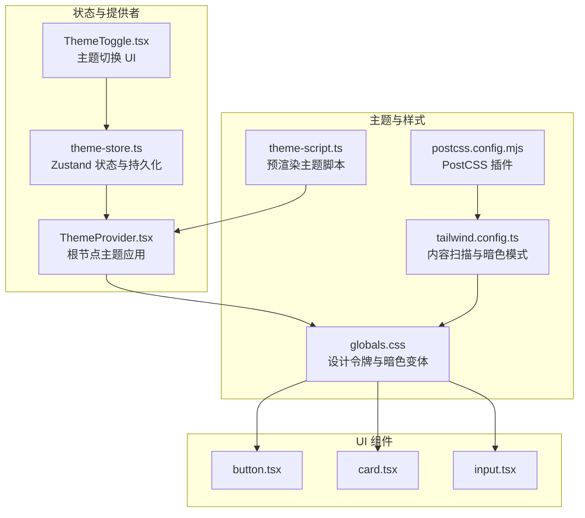
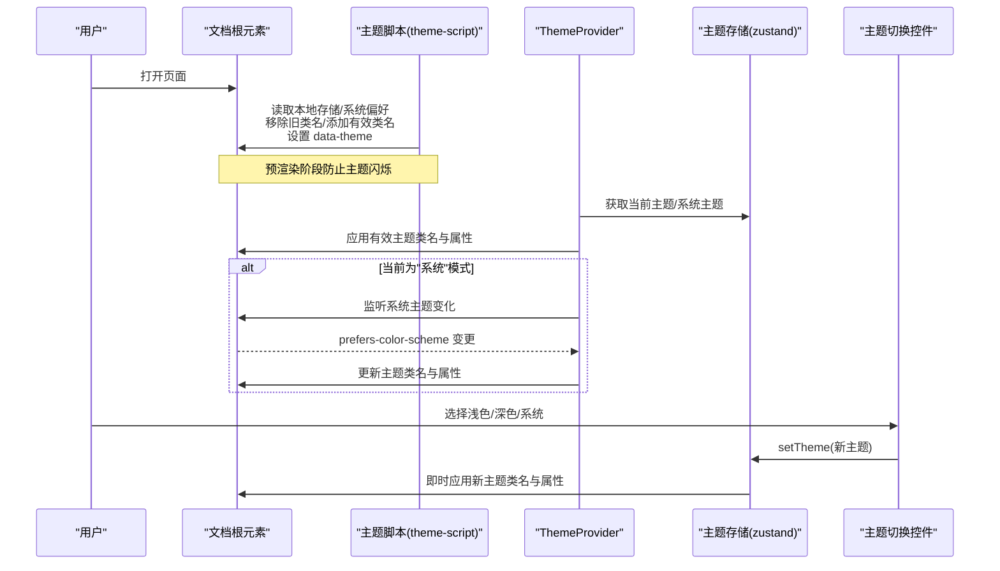
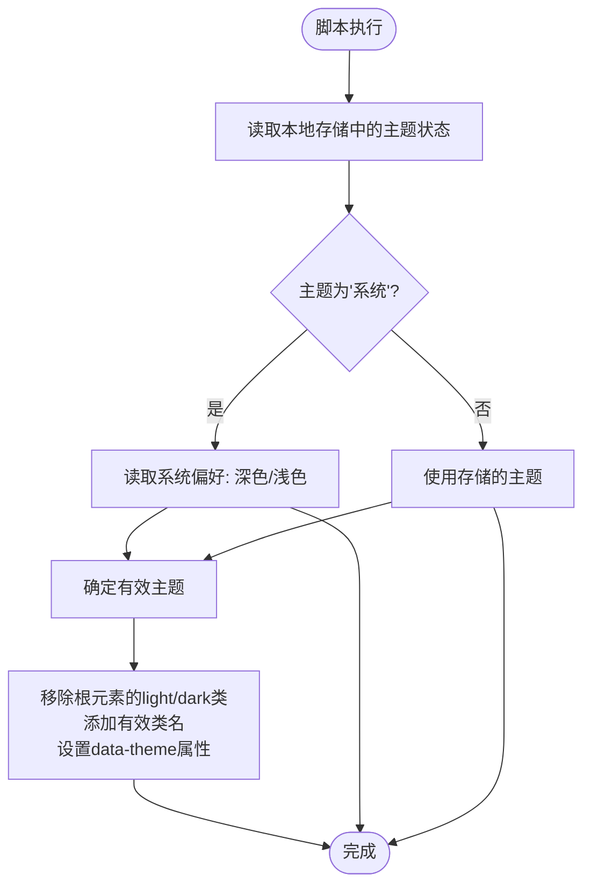
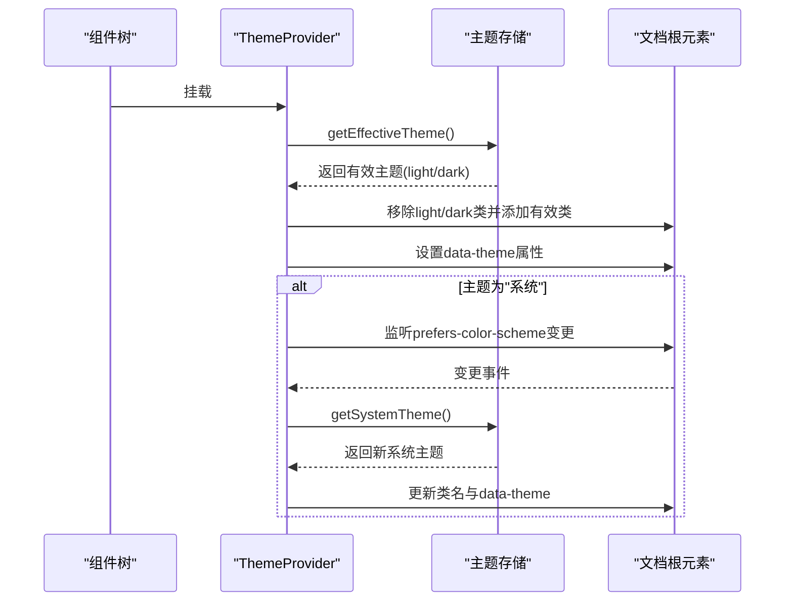
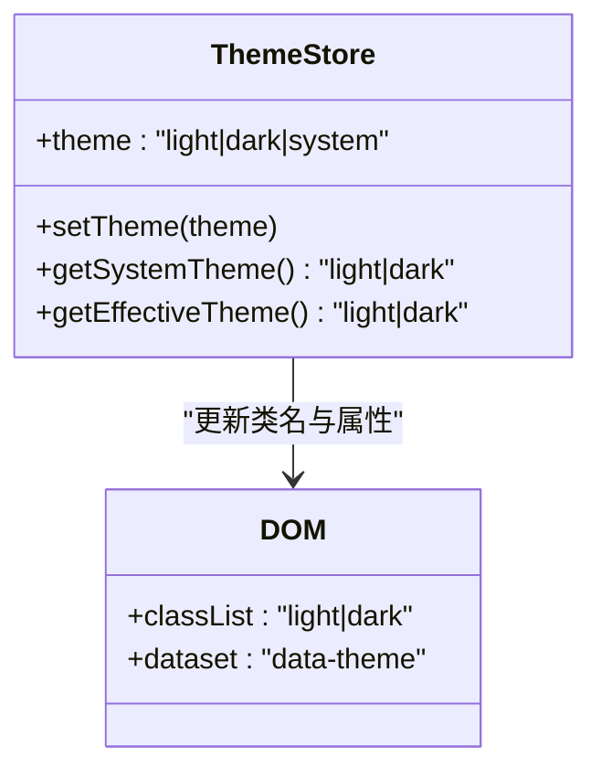
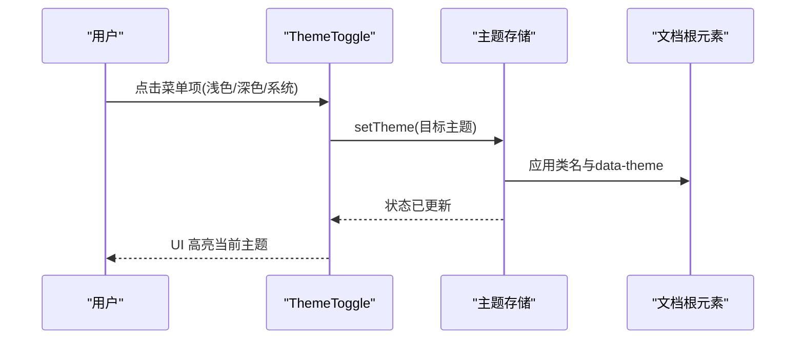
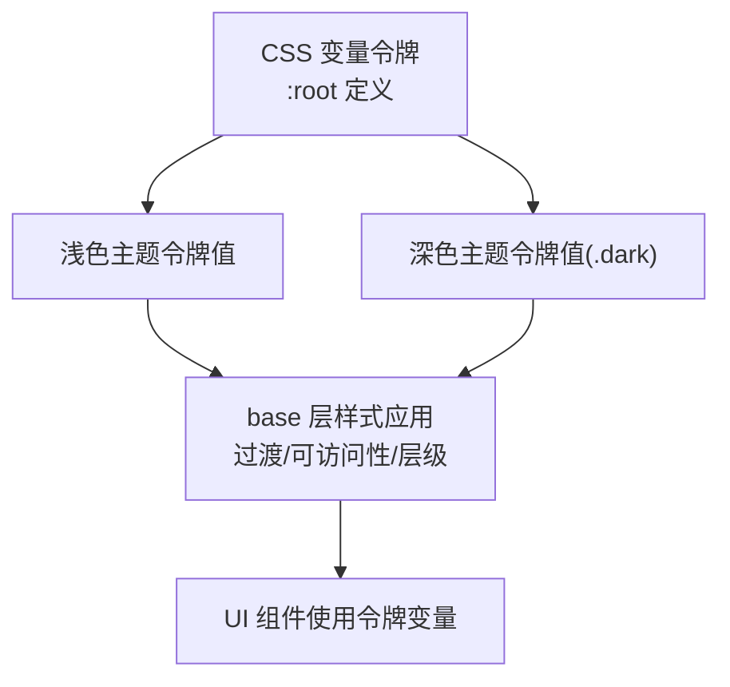
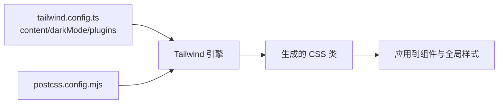
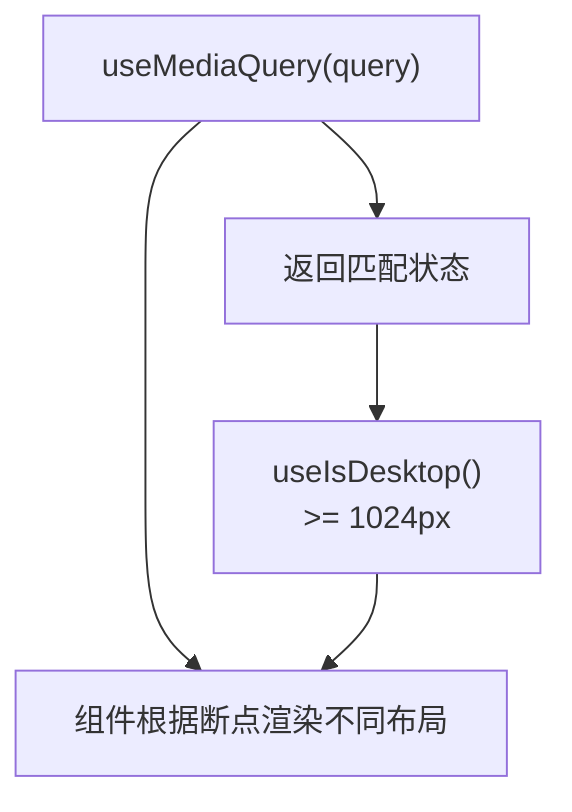
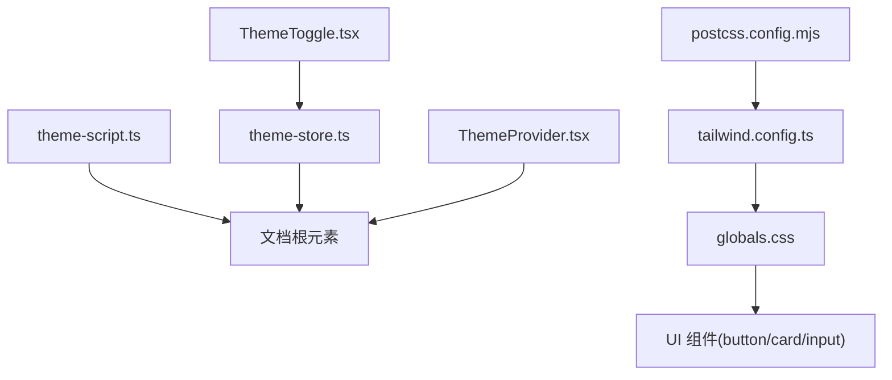

# 主题与设计系统

<cite>
**本文档引用的文件**
- [frontend/src/lib/theme-script.ts](file://frontend/src/lib/theme-script.ts)
- [frontend/tailwind.config.ts](file://frontend/tailwind.config.ts)
- [frontend/src/app/globals.css](file://frontend/src/app/globals.css)
- [frontend/src/components/providers/ThemeProvider.tsx](file://frontend/src/components/providers/ThemeProvider.tsx)
- [frontend/src/lib/stores/theme-store.ts](file://frontend/src/lib/stores/theme-store.ts)
- [frontend/src/components/common/ThemeToggle.tsx](file://frontend/src/components/common/ThemeToggle.tsx)
- [frontend/package.json](file://frontend/package.json)
- [frontend/postcss.config.mjs](file://frontend/postcss.config.mjs)
- [frontend/src/lib/hooks/use-media-query.ts](file://frontend/src/lib/hooks/use-media-query.ts)
- [frontend/src/components/ui/button.tsx](file://frontend/src/components/ui/button.tsx)
- [frontend/src/components/ui/card.tsx](file://frontend/src/components/ui/card.tsx)
- [frontend/src/components/ui/input.tsx](file://frontend/src/components/ui/input.tsx)
- [frontend/src/components/layout/AppShell.tsx](file://frontend/src/components/layout/AppShell.tsx)
</cite>

## 目录
1. [简介](#简介)
2. [项目结构](#项目结构)
3. [核心组件](#核心组件)
4. [架构总览](#架构总览)
5. [详细组件分析](#详细组件分析)
6. [依赖关系分析](#依赖关系分析)
7. [性能考量](#性能考量)
8. [故障排除指南](#故障排除指南)
9. [结论](#结论)
10. [附录](#附录)

## 简介
本文件系统性阐述 Open Notebook 前端的主题与设计系统，覆盖以下要点：
- 主题系统架构与实现机制：深色/浅色主题切换、系统偏好检测、主题持久化与手动切换
- 颜色系统与视觉设计规范：基于 oklch 的设计令牌、语义化颜色变量、组件级配色
- Tailwind CSS 配置与自定义样式：内容扫描路径、暗色模式策略、插件集成
- 响应式断点与媒体查询：桌面端断点与移动端适配
- 动画与交互：过渡动效、悬停反馈、可访问性增强
- 主题定制与品牌化：如何扩展设计令牌、替换配色方案、保持一致性

## 项目结构
前端主题与设计系统主要分布在以下位置：
- 主题脚本与初始化：frontend/src/lib/theme-script.ts
- 主题提供者与状态管理：frontend/src/components/providers/ThemeProvider.tsx、frontend/src/lib/stores/theme-store.ts
- 主题切换控件：frontend/src/components/common/ThemeToggle.tsx
- 全局样式与设计令牌：frontend/src/app/globals.css
- Tailwind 配置：frontend/tailwind.config.ts、frontend/postcss.config.mjs
- UI 组件与设计令牌映射：frontend/src/components/ui/*.tsx
- 响应式工具：frontend/src/lib/hooks/use-media-query.ts
- 应用外壳与布局：frontend/src/components/layout/AppShell.tsx

**图表来源**
- [frontend/src/lib/theme-script.ts](file://frontend/src/lib/theme-script.ts#L1-L18)
- [frontend/src/app/globals.css](file://frontend/src/app/globals.css#L1-L193)
- [frontend/tailwind.config.ts](file://frontend/tailwind.config.ts#L1-L17)
- [frontend/postcss.config.mjs](file://frontend/postcss.config.mjs#L1-L6)
- [frontend/src/lib/stores/theme-store.ts](file://frontend/src/lib/stores/theme-store.ts#L1-L61)
- [frontend/src/components/providers/ThemeProvider.tsx](file://frontend/src/components/providers/ThemeProvider.tsx#L1-L45)
- [frontend/src/components/common/ThemeToggle.tsx](file://frontend/src/components/common/ThemeToggle.tsx#L1-L63)
- [frontend/src/components/ui/button.tsx](file://frontend/src/components/ui/button.tsx#L1-L60)
- [frontend/src/components/ui/card.tsx](file://frontend/src/components/ui/card.tsx#L1-L93)
- [frontend/src/components/ui/input.tsx](file://frontend/src/components/ui/input.tsx#L1-L22)

**章节来源**
- [frontend/src/lib/theme-script.ts](file://frontend/src/lib/theme-script.ts#L1-L18)
- [frontend/src/app/globals.css](file://frontend/src/app/globals.css#L1-L193)
- [frontend/tailwind.config.ts](file://frontend/tailwind.config.ts#L1-L17)
- [frontend/postcss.config.mjs](file://frontend/postcss.config.mjs#L1-L6)
- [frontend/src/lib/stores/theme-store.ts](file://frontend/src/lib/stores/theme-store.ts#L1-L61)
- [frontend/src/components/providers/ThemeProvider.tsx](file://frontend/src/components/providers/ThemeProvider.tsx#L1-L45)
- [frontend/src/components/common/ThemeToggle.tsx](file://frontend/src/components/common/ThemeToggle.tsx#L1-L63)
- [frontend/src/components/ui/button.tsx](file://frontend/src/components/ui/button.tsx#L1-L60)
- [frontend/src/components/ui/card.tsx](file://frontend/src/components/ui/card.tsx#L1-L93)
- [frontend/src/components/ui/input.tsx](file://frontend/src/components/ui/input.tsx#L1-L22)

## 核心组件
- 主题脚本（预渲染）：在 React 水合前执行，避免主题闪烁，依据本地存储与系统偏好选择有效主题并设置根元素类名与属性。
- 主题提供者：在客户端挂载时根据当前主题计算有效主题，动态更新根元素类名与属性，并监听系统主题变化。
- 主题存储（Zustand + 持久化）：维护当前主题、系统主题检测、有效主题计算，并将主题持久化到本地存储。
- 主题切换控件：提供“浅色/深色/系统”三态切换，使用图标与无障碍标签提示。
- 设计令牌与暗色变体：通过 CSS 变量定义语义化颜色令牌，分别在浅色与深色根下定义不同值；全局样式层应用过渡与可访问性增强。
- Tailwind 配置：启用“class”驱动的暗色模式，内容扫描路径覆盖 app、components、pages，集成排版插件。

**章节来源**
- [frontend/src/lib/theme-script.ts](file://frontend/src/lib/theme-script.ts#L1-L18)
- [frontend/src/components/providers/ThemeProvider.tsx](file://frontend/src/components/providers/ThemeProvider.tsx#L1-L45)
- [frontend/src/lib/stores/theme-store.ts](file://frontend/src/lib/stores/theme-store.ts#L1-L61)
- [frontend/src/components/common/ThemeToggle.tsx](file://frontend/src/components/common/ThemeToggle.tsx#L1-L63)
- [frontend/src/app/globals.css](file://frontend/src/app/globals.css#L1-L193)
- [frontend/tailwind.config.ts](file://frontend/tailwind.config.ts#L1-L17)

## 架构总览
主题系统采用“预渲染 + 客户端同步”的双阶段策略：
- 预渲染阶段：服务端或静态生成时注入主题脚本，读取本地存储与系统偏好，设置根元素类名与 data-theme 属性，避免水合期间的闪烁。
- 客户端阶段：ThemeProvider 在挂载时再次确认有效主题，绑定系统主题变更监听，在“系统”模式下实时响应系统偏好变化；同时通过 Zustand 管理主题状态与持久化。

**图表来源**
- [frontend/src/lib/theme-script.ts](file://frontend/src/lib/theme-script.ts#L1-L18)
- [frontend/src/components/providers/ThemeProvider.tsx](file://frontend/src/components/providers/ThemeProvider.tsx#L13-L41)
- [frontend/src/lib/stores/theme-store.ts](file://frontend/src/lib/stores/theme-store.ts#L18-L29)
- [frontend/src/components/common/ThemeToggle.tsx](file://frontend/src/components/common/ThemeToggle.tsx#L39-L59)

## 详细组件分析

### 主题脚本（预渲染）
- 作用：在 React 水合之前运行，避免主题闪烁。
- 行为：从本地存储读取主题状态，若为“系统”，则结合系统偏好决定有效主题；最终在根元素上移除旧类名、添加有效类名，并设置 data-theme 属性；异常时回退到浅色主题。

**图表来源**
- [frontend/src/lib/theme-script.ts](file://frontend/src/lib/theme-script.ts#L3-L17)

**章节来源**
- [frontend/src/lib/theme-script.ts](file://frontend/src/lib/theme-script.ts#L1-L18)

### 主题提供者（客户端）
- 作用：在客户端挂载时应用主题，处理系统主题监听。
- 行为：初始化时计算有效主题并应用到根元素；当主题为“系统”时，注册系统偏好变更监听，变更时重新计算并应用。

**图表来源**
- [frontend/src/components/providers/ThemeProvider.tsx](file://frontend/src/components/providers/ThemeProvider.tsx#L13-L41)

**章节来源**
- [frontend/src/components/providers/ThemeProvider.tsx](file://frontend/src/components/providers/ThemeProvider.tsx#L1-L45)

### 主题存储（Zustand + 持久化）
- 作用：集中管理主题状态、计算系统主题与有效主题，并持久化到本地存储。
- 关键能力：
  - setTheme：更新主题并立即应用到根元素类名与 data-theme。
  - getSystemTheme：检测系统偏好（深色/浅色）。
  - getEffectiveTheme：若为“系统”则返回系统主题，否则返回存储的主题。
  - 持久化：仅持久化 theme 字段，减少存储体积。

**图表来源**
- [frontend/src/lib/stores/theme-store.ts](file://frontend/src/lib/stores/theme-store.ts#L13-L49)

**章节来源**
- [frontend/src/lib/stores/theme-store.ts](file://frontend/src/lib/stores/theme-store.ts#L1-L61)

### 主题切换控件
- 作用：提供主题切换入口，支持图标与文本两种形态。
- 行为：触发 setTheme 后即时更新主题并持久化；UI 中高亮当前选中项；使用无障碍标签提升可访问性。

**图表来源**
- [frontend/src/components/common/ThemeToggle.tsx](file://frontend/src/components/common/ThemeToggle.tsx#L39-L59)
- [frontend/src/lib/stores/theme-store.ts](file://frontend/src/lib/stores/theme-store.ts#L18-L29)

**章节来源**
- [frontend/src/components/common/ThemeToggle.tsx](file://frontend/src/components/common/ThemeToggle.tsx#L1-L63)
- [frontend/src/lib/stores/theme-store.ts](file://frontend/src/lib/stores/theme-store.ts#L1-L61)

### 设计令牌与颜色系统
- 设计令牌：通过 CSS 自定义属性定义语义化颜色令牌，如背景、前景、主色、次色、强调色、边框、输入、环形光晕等。
- 暗色变体：在 :root 与 .dark 伪类下分别定义令牌值，确保在不同主题下呈现一致的视觉层级。
- 全局样式层：在 base 层应用过渡动画、可访问性增强（如 outline-ring/50）、Radix UI 内容容器的主题继承与层级控制。
- 组件映射：UI 组件（按钮、卡片、输入框）直接使用令牌变量，保证风格统一与易于定制。

**图表来源**
- [frontend/src/app/globals.css](file://frontend/src/app/globals.css#L4-L42)
- [frontend/src/app/globals.css](file://frontend/src/app/globals.css#L44-L111)
- [frontend/src/app/globals.css](file://frontend/src/app/globals.css#L113-L193)
- [frontend/src/components/ui/button.tsx](file://frontend/src/components/ui/button.tsx#L7-L36)
- [frontend/src/components/ui/card.tsx](file://frontend/src/components/ui/card.tsx#L5-L16)
- [frontend/src/components/ui/input.tsx](file://frontend/src/components/ui/input.tsx#L5-L19)

**章节来源**
- [frontend/src/app/globals.css](file://frontend/src/app/globals.css#L1-L193)
- [frontend/src/components/ui/button.tsx](file://frontend/src/components/ui/button.tsx#L1-L60)
- [frontend/src/components/ui/card.tsx](file://frontend/src/components/ui/card.tsx#L1-L93)
- [frontend/src/components/ui/input.tsx](file://frontend/src/components/ui/input.tsx#L1-L22)

### Tailwind 配置与自定义样式
- 内容扫描：覆盖 app、components、pages 目录，确保按需生成样式。
- 暗色模式：采用“class”策略，通过根元素类名切换明暗主题。
- 插件：集成排版插件，增强 Markdown 渲染样式。
- PostCSS：使用官方 PostCSS 插件，确保构建链路正确。

**图表来源**
- [frontend/tailwind.config.ts](file://frontend/tailwind.config.ts#L4-L15)
- [frontend/postcss.config.mjs](file://frontend/postcss.config.mjs#L1-L6)

**章节来源**
- [frontend/tailwind.config.ts](file://frontend/tailwind.config.ts#L1-L17)
- [frontend/postcss.config.mjs](file://frontend/postcss.config.mjs#L1-L6)

### 响应式断点与媒体查询
- 断点策略：使用桌面端断点（Tailwind 的 lg=1024px），通过自定义 hook 提供一致的断点检测。
- 实现：useMediaQuery 接受媒体查询字符串，useIsDesktop 返回是否达到桌面断点；SSR 下默认返回 false，避免水合不匹配。

**图表来源**
- [frontend/src/lib/hooks/use-media-query.ts](file://frontend/src/lib/hooks/use-media-query.ts#L9-L32)

**章节来源**
- [frontend/src/lib/hooks/use-media-query.ts](file://frontend/src/lib/hooks/use-media-query.ts#L1-L32)

### 动画与交互
- 过渡与悬停：全局 base 层为 body、卡片、侧边栏菜单项等提供统一的过渡时间与悬停阴影；深色模式下阴影强度不同以增强层次感。
- 可访问性：焦点环（ring）与可选的 aria-invalid 状态在深浅主题下均有清晰表现。
- 动画库：引入 tw-animate-css，便于在组件中使用动画类。

**章节来源**
- [frontend/src/app/globals.css](file://frontend/src/app/globals.css#L113-L193)
- [frontend/package.json](file://frontend/package.json#L68-L68)

### 主题定制指南与品牌化
- 替换设计令牌：在 :root 与 .dark 下调整 oklch 颜色值，即可完成品牌化配色；建议保持语义化命名不变，确保组件兼容。
- 组件一致性：所有组件均使用令牌变量，无需逐个修改组件样式；如需扩展，可在全局样式中新增令牌并在组件中引用。
- 持久化与回退：主题状态已持久化，若需重置，可通过重置函数或清除本地存储键名实现。
- 系统偏好联动：保留“系统”选项以跟随系统主题；如需强制固定主题，可移除系统监听逻辑或在应用层屏蔽系统变更。

**章节来源**
- [frontend/src/app/globals.css](file://frontend/src/app/globals.css#L44-L111)
- [frontend/src/lib/stores/theme-store.ts](file://frontend/src/lib/stores/theme-store.ts#L44-L49)
- [frontend/src/components/providers/ThemeProvider.tsx](file://frontend/src/components/providers/ThemeProvider.tsx#L27-L40)

## 依赖关系分析
- 主题脚本与提供者：二者共同确保主题在水合前后一致，避免闪烁。
- 状态与 UI：ThemeToggle 通过 setTheme 触发状态更新，Zustand 立即应用到 DOM。
- 样式与组件：UI 组件直接消费设计令牌变量，形成“令牌 → 组件 → 主题”的单向依赖。
- 构建链路：Tailwind 与 PostCSS 插件负责样式生成，内容扫描确保按需产出。

**图表来源**
- [frontend/src/lib/theme-script.ts](file://frontend/src/lib/theme-script.ts#L1-L18)
- [frontend/src/lib/stores/theme-store.ts](file://frontend/src/lib/stores/theme-store.ts#L1-L61)
- [frontend/src/components/providers/ThemeProvider.tsx](file://frontend/src/components/providers/ThemeProvider.tsx#L1-L45)
- [frontend/src/components/common/ThemeToggle.tsx](file://frontend/src/components/common/ThemeToggle.tsx#L1-L63)
- [frontend/src/app/globals.css](file://frontend/src/app/globals.css#L1-L193)
- [frontend/tailwind.config.ts](file://frontend/tailwind.config.ts#L1-L17)
- [frontend/postcss.config.mjs](file://frontend/postcss.config.mjs#L1-L6)

**章节来源**
- [frontend/src/lib/theme-script.ts](file://frontend/src/lib/theme-script.ts#L1-L18)
- [frontend/src/lib/stores/theme-store.ts](file://frontend/src/lib/stores/theme-store.ts#L1-L61)
- [frontend/src/components/providers/ThemeProvider.tsx](file://frontend/src/components/providers/ThemeProvider.tsx#L1-L45)
- [frontend/src/components/common/ThemeToggle.tsx](file://frontend/src/components/common/ThemeToggle.tsx#L1-L63)
- [frontend/src/app/globals.css](file://frontend/src/app/globals.css#L1-L193)
- [frontend/tailwind.config.ts](file://frontend/tailwind.config.ts#L1-L17)
- [frontend/postcss.config.mjs](file://frontend/postcss.config.mjs#L1-L6)

## 性能考量
- 预渲染主题脚本：在水合前完成主题判定与应用，避免二次重排与闪烁。
- 最小化 DOM 操作：每次切换仅移除并添加两个类名，设置一个 data 属性，操作成本低。
- 按需样式：Tailwind 内容扫描仅覆盖实际使用的目录，减少未使用样式的生成。
- 持久化策略：仅持久化主题字段，降低存储占用与序列化开销。

[本节为通用指导，不涉及具体文件分析]

## 故障排除指南
- 主题闪烁：检查主题脚本是否在水合前执行，确认根元素类名与 data-theme 是否正确设置。
- 切换无效：确认 ThemeToggle 已调用 setTheme，且 Zustand 状态已更新；检查浏览器控制台是否有异常。
- 系统主题不生效：确认当前主题为“系统”，并检查系统偏好变更监听是否注册；在非浏览器环境（如 SSR）下，系统偏好检测会回退为浅色。
- 深浅主题差异异常：核对 :root 与 .dark 下的令牌值是否完整；检查全局 base 层样式是否被覆盖。

**章节来源**
- [frontend/src/lib/theme-script.ts](file://frontend/src/lib/theme-script.ts#L1-L18)
- [frontend/src/lib/stores/theme-store.ts](file://frontend/src/lib/stores/theme-store.ts#L18-L29)
- [frontend/src/components/providers/ThemeProvider.tsx](file://frontend/src/components/providers/ThemeProvider.tsx#L27-L40)
- [frontend/src/app/globals.css](file://frontend/src/app/globals.css#L79-L111)

## 结论
Open Notebook 的主题与设计系统以“预渲染 + 客户端同步”为核心，结合语义化设计令牌与 Tailwind 工程化配置，实现了稳定、可定制、可扩展的主题体验。通过最小化的 DOM 操作与按需样式生成，兼顾了性能与可维护性；通过持久化与系统偏好联动，提升了用户体验的一致性与自然性。

[本节为总结性内容，不涉及具体文件分析]

## 附录
- 响应式断点：桌面端断点为 1024px，可通过 useIsDesktop 快速判断。
- 动画库：tw-animate-css 已集成，可在组件中直接使用动画类。
- 应用外壳：AppShell 负责布局与侧边栏承载，主题样式在该外壳内统一生效。

**章节来源**
- [frontend/src/lib/hooks/use-media-query.ts](file://frontend/src/lib/hooks/use-media-query.ts#L30-L32)
- [frontend/package.json](file://frontend/package.json#L68-L68)
- [frontend/src/components/layout/AppShell.tsx](file://frontend/src/components/layout/AppShell.tsx#L1-L21)