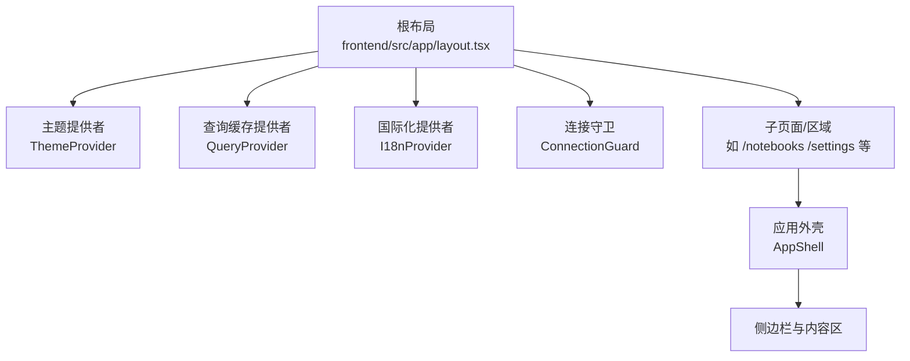
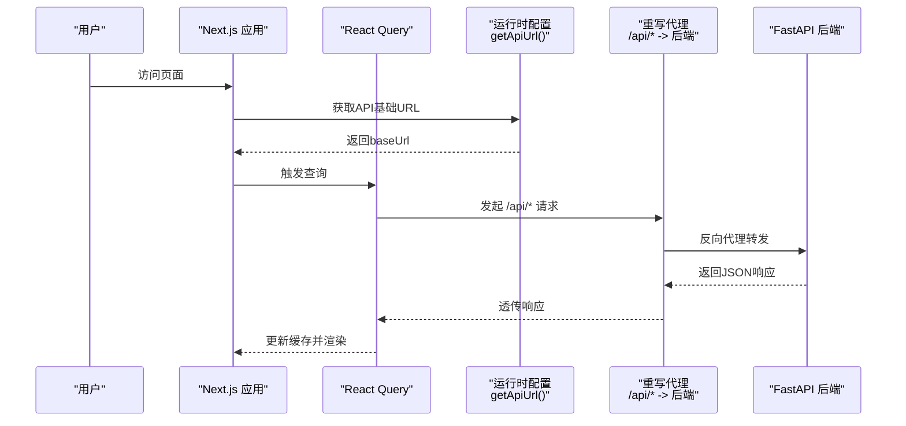
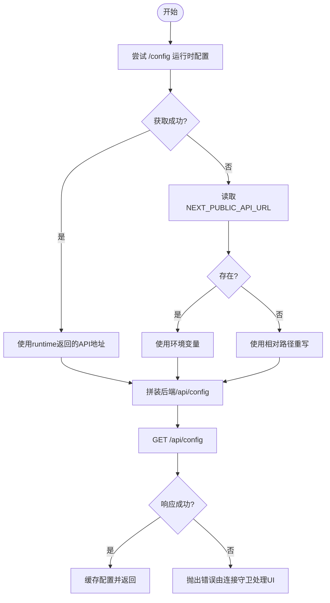
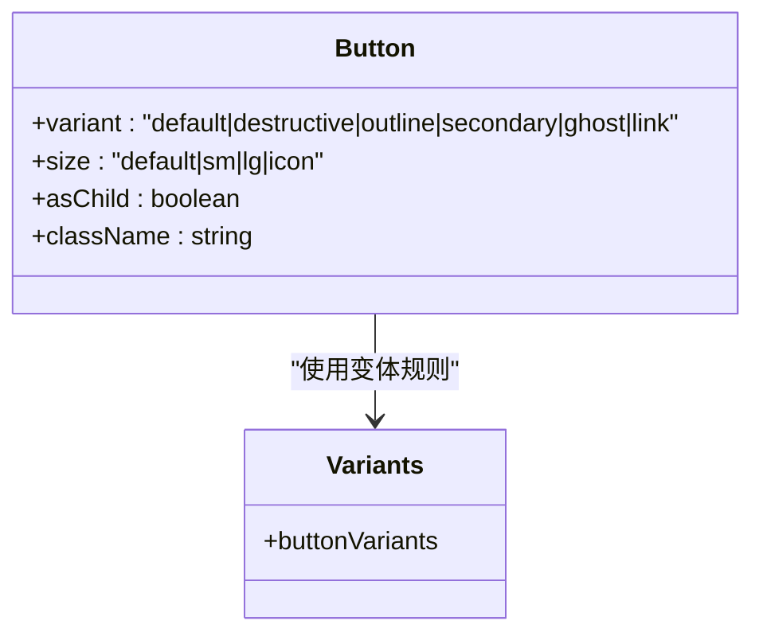
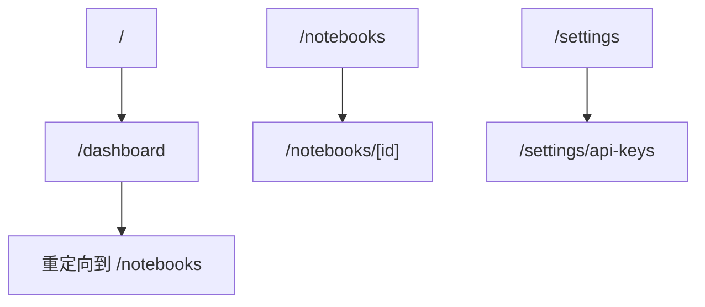
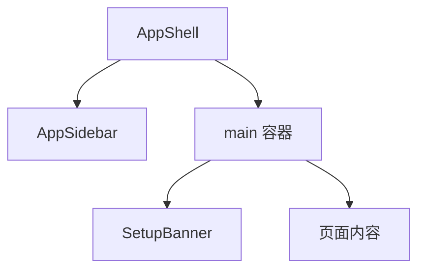
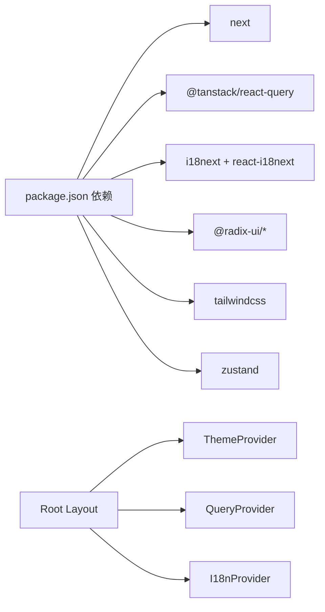

# 前端架构

<cite>
**本文引用的文件**
- [frontend/src/app/layout.tsx](file://frontend/src/app/layout.tsx)
- [frontend/src/lib/i18n.ts](file://frontend/src/lib/i18n.ts)
- [frontend/src/lib/config.ts](file://frontend/src/lib/config.ts)
- [frontend/src/components/providers/ThemeProvider.tsx](file://frontend/src/components/providers/ThemeProvider.tsx)
- [frontend/src/components/providers/QueryProvider.tsx](file://frontend/src/components/providers/QueryProvider.tsx)
- [frontend/src/lib/stores/theme-store.ts](file://frontend/src/lib/stores/theme-store.ts)
- [frontend/src/lib/api/query-client.ts](file://frontend/src/lib/api/query-client.ts)
- [frontend/src/components/providers/I18nProvider.tsx](file://frontend/src/components/providers/I18nProvider.tsx)
- [frontend/src/app/(dashboard)/page.tsx](file://frontend/src/app/(dashboard)/page.tsx)
- [frontend/src/components/layout/AppShell.tsx](file://frontend/src/components/layout/AppShell.tsx)
- [frontend/src/components/ui/button.tsx](file://frontend/src/components/ui/button.tsx)
- [frontend/package.json](file://frontend/package.json)
- [frontend/next.config.ts](file://frontend/next.config.ts)
</cite>

## 目录
1. [简介](#简介)
2. [项目结构](#项目结构)
3. [核心组件](#核心组件)
4. [架构总览](#架构总览)
5. [详细组件分析](#详细组件分析)
6. [依赖关系分析](#依赖关系分析)
7. [性能考虑](#性能考虑)
8. [故障排查指南](#故障排查指南)
9. [结论](#结论)
10. [附录](#附录)

## 简介
本文件面向Open Notebook前端，系统化阐述基于Next.js的应用架构与组件层次，覆盖状态管理、路由组织、国际化、UI组件库设计原则、前后端交互模式、主题系统、响应式与可访问性、组件开发规范以及构建与部署优化策略。目标是帮助开发者快速理解并高效扩展前端能力。

## 项目结构
前端采用Next.js App Router目录约定，按功能域划分页面与组件，根布局统一注入全局Provider，形成“根布局-页面-组件”的清晰层级。核心目录与职责概览：
- app：页面与路由定义，包含认证与仪表盘等区域
- components：通用UI与业务组件，按命名空间拆分
- lib：运行时配置、国际化、状态存储与工具函数
- public：静态资源
- 配置：next.config.ts、tailwind.config.ts、eslint配置等

图表来源
- [frontend/src/app/layout.tsx](file://frontend/src/app/layout.tsx#L19-L45)
- [frontend/src/components/layout/AppShell.tsx](file://frontend/src/components/layout/AppShell.tsx#L10-L20)

章节来源
- [frontend/src/app/layout.tsx](file://frontend/src/app/layout.tsx#L1-L46)
- [frontend/src/components/layout/AppShell.tsx](file://frontend/src/components/layout/AppShell.tsx#L1-L21)

## 核心组件
- 根布局与Provider链
  - 根布局负责注入错误边界、主题、查询缓存、国际化与连接守卫，并渲染子页面。
  - Provider顺序影响副作用与状态初始化，建议保持现有顺序以避免水合不一致。
- 主题系统
  - 使用Zustand持久化存储用户主题偏好，动态切换根节点类名与data-theme属性，监听系统主题变化。
- 国际化
  - i18next初始化语言检测与回退，I18nProvider在挂载后渲染加载遮罩，避免水合差异。
- 运行时配置
  - 动态获取API地址，优先服务端/runtime配置，其次环境变量，最后相对路径重写代理到后端。
- 查询缓存
  - React Query默认配置与查询键集合，统一管理笔记、源、会话、播客等数据的缓存生命周期与重试策略。

章节来源
- [frontend/src/app/layout.tsx](file://frontend/src/app/layout.tsx#L19-L45)
- [frontend/src/components/providers/ThemeProvider.tsx](file://frontend/src/components/providers/ThemeProvider.tsx#L10-L44)
- [frontend/src/lib/stores/theme-store.ts](file://frontend/src/lib/stores/theme-store.ts#L13-L49)
- [frontend/src/components/providers/I18nProvider.tsx](file://frontend/src/components/providers/I18nProvider.tsx#L7-L25)
- [frontend/src/lib/i18n.ts](file://frontend/src/lib/i18n.ts#L6-L22)
- [frontend/src/lib/config.ts](file://frontend/src/lib/config.ts#L22-L140)
- [frontend/src/components/providers/QueryProvider.tsx](file://frontend/src/components/providers/QueryProvider.tsx#L10-L16)
- [frontend/src/lib/api/query-client.ts](file://frontend/src/lib/api/query-client.ts#L3-L35)

## 架构总览
下图展示从浏览器到后端的请求路径与关键中间件：

图表来源
- [frontend/src/lib/config.ts](file://frontend/src/lib/config.ts#L59-L140)
- [frontend/next.config.ts](file://frontend/next.config.ts#L18-L32)
- [frontend/src/lib/api/query-client.ts](file://frontend/src/lib/api/query-client.ts#L17-L35)

## 详细组件分析

### 主题系统（ThemeProvider）
- 设计要点
  - 将有效主题类名设置到html根节点，便于CSS选择器与组件读取；同时设置data-theme属性提升兼容性。
  - 当主题为“系统”时，监听系统配色方案变化，自动同步UI主题。
  - 使用Zustand持久化存储用户偏好，保证刷新后仍保持所选主题。
- 关键流程

图表来源
- [frontend/src/components/providers/ThemeProvider.tsx](file://frontend/src/components/providers/ThemeProvider.tsx#L13-L41)
- [frontend/src/lib/stores/theme-store.ts](file://frontend/src/lib/stores/theme-store.ts#L32-L42)

章节来源
- [frontend/src/components/providers/ThemeProvider.tsx](file://frontend/src/components/providers/ThemeProvider.tsx#L10-L44)
- [frontend/src/lib/stores/theme-store.ts](file://frontend/src/lib/stores/theme-store.ts#L13-L49)

### 国际化（I18nProvider 与 i18n 初始化）
- 设计要点
  - i18next启用语言检测与本地存储缓存，回退至英文，禁用Suspense以简化水合。
  - I18nProvider在挂载后再渲染子树，避免SSR与CSR语言检测差异导致的水合不一致。
- 关键流程

图表来源
- [frontend/src/lib/i18n.ts](file://frontend/src/lib/i18n.ts#L6-L22)
- [frontend/src/components/providers/I18nProvider.tsx](file://frontend/src/components/providers/I18nProvider.tsx#L7-L25)

章节来源
- [frontend/src/lib/i18n.ts](file://frontend/src/lib/i18n.ts#L1-L25)
- [frontend/src/components/providers/I18nProvider.tsx](file://frontend/src/components/providers/I18nProvider.tsx#L1-L26)

### 运行时配置（getApiUrl 与 getConfig）
- 设计要点
  - 优先从服务端/runtime端点获取API地址，其次使用构建期环境变量，最终采用相对路径重写代理。
  - 统一从后端/api/config拉取版本信息与数据库状态，作为连接守卫与更新提示的数据来源。
- 关键流程

图表来源
- [frontend/src/lib/config.ts](file://frontend/src/lib/config.ts#L59-L140)
- [frontend/next.config.ts](file://frontend/next.config.ts#L18-L32)

章节来源
- [frontend/src/lib/config.ts](file://frontend/src/lib/config.ts#L22-L140)
- [frontend/next.config.ts](file://frontend/next.config.ts#L3-L36)

### 查询缓存（React Query）
- 设计要点
  - 默认查询缓存5分钟，GC时间10分钟，窗口聚焦时不自动刷新；变更重试2次，创建/删除等变更重试1次。
  - 提供集中化的QUERY_KEYS，确保查询键稳定且类型安全，便于跨组件共享与调试。
- 关键流程

图表来源
- [frontend/src/lib/api/query-client.ts](file://frontend/src/lib/api/query-client.ts#L3-L15)
- [frontend/src/lib/api/query-client.ts](file://frontend/src/lib/api/query-client.ts#L17-L35)

章节来源
- [frontend/src/components/providers/QueryProvider.tsx](file://frontend/src/components/providers/QueryProvider.tsx#L1-L16)
- [frontend/src/lib/api/query-client.ts](file://frontend/src/lib/api/query-client.ts#L1-L35)

### UI组件库（以Button为例）
- 设计要点
  - 使用class-variance-authority实现变体与尺寸组合，统一过渡与禁用态样式。
  - 支持asChild插槽模式，适配语义标签与链接场景；内置焦点可见性与错误态样式。
- 类关系图

图表来源
- [frontend/src/components/ui/button.tsx](file://frontend/src/components/ui/button.tsx#L7-L36)

章节来源
- [frontend/src/components/ui/button.tsx](file://frontend/src/components/ui/button.tsx#L1-L60)

### 路由与页面组织
- 页面入口
  - 仪表盘首页重定向至笔记本列表页，保证默认导航一致性。
- 区域划分
  - 使用App Router分组语法组织认证与仪表盘区域，页面按功能域拆分，便于代码复用与测试隔离。
- 关键流程

图表来源
- [frontend/src/app/(dashboard)/page.tsx](file://frontend/src/app/(dashboard)/page.tsx#L1-L5)

章节来源
- [frontend/src/app/(dashboard)/page.tsx](file://frontend/src/app/(dashboard)/page.tsx#L1-L5)

### 应用外壳与布局
- 设计要点
  - AppShell提供固定侧边栏与滚动主内容区，顶部设置横幅用于引导或提示。
  - 结合Tailwind类名实现全屏布局与溢出控制，保证在不同视口下的稳定性。
- 结构示意

图表来源
- [frontend/src/components/layout/AppShell.tsx](file://frontend/src/components/layout/AppShell.tsx#L10-L20)

章节来源
- [frontend/src/components/layout/AppShell.tsx](file://frontend/src/components/layout/AppShell.tsx#L1-L21)

## 依赖关系分析
- 外部依赖
  - Next.js、React Query、i18next、Radix UI、Tailwind CSS、Lucide React等。
- 内部依赖
  - 根布局聚合Provider，Provider之间低耦合；配置与查询键集中管理，减少重复与不一致风险。
- 依赖图

图表来源
- [frontend/package.json](file://frontend/package.json#L14-L57)
- [frontend/src/app/layout.tsx](file://frontend/src/app/layout.tsx#L4-L10)

章节来源
- [frontend/package.json](file://frontend/package.json#L1-L77)
- [frontend/src/app/layout.tsx](file://frontend/src/app/layout.tsx#L1-L46)

## 性能考虑
- 构建与输出
  - 启用standalone输出，便于Docker单文件部署与最小化容器镜像。
- 代理与重写
  - 将/api/*通过Next.js内部重写代理至后端，避免反向代理复杂度与CORS问题。
  - 提升代理客户端最大主体大小以支持大文件上传。
- 缓存与重试
  - 查询缓存与GC时间合理设置，减少不必要的网络往返；变更操作重试次数较少，避免放大后端压力。
- 国际化与主题
  - 语言检测与主题持久化均在客户端完成，减少服务端开销；主题切换即时应用到根节点，避免闪烁。

章节来源
- [frontend/next.config.ts](file://frontend/next.config.ts#L3-L36)
- [frontend/src/lib/api/query-client.ts](file://frontend/src/lib/api/query-client.ts#L3-L15)
- [frontend/src/lib/stores/theme-store.ts](file://frontend/src/lib/stores/theme-store.ts#L13-L49)
- [frontend/src/lib/i18n.ts](file://frontend/src/lib/i18n.ts#L6-L22)

## 故障排查指南
- 连接与配置
  - 若无法获取后端配置，检查运行时配置端点与重写规则；确认NEXT_PUBLIC_API_URL与INTERNAL_API_URL设置。
- 国际化水合不一致
  - 确保I18nProvider在挂载后再渲染子树；检查本地存储的语言缓存。
- 主题切换无效
  - 检查根节点类名与data-theme是否正确更新；确认系统主题监听逻辑。
- 查询缓存异常
  - 核对查询键是否稳定；检查staleTime与gcTime设置；确认重试策略与refetchOnWindowFocus行为。

章节来源
- [frontend/src/lib/config.ts](file://frontend/src/lib/config.ts#L59-L140)
- [frontend/src/components/providers/I18nProvider.tsx](file://frontend/src/components/providers/I18nProvider.tsx#L7-L25)
- [frontend/src/components/providers/ThemeProvider.tsx](file://frontend/src/components/providers/ThemeProvider.tsx#L13-L41)
- [frontend/src/lib/api/query-client.ts](file://frontend/src/lib/api/query-client.ts#L3-L15)

## 结论
该前端架构以Next.js App Router为基础，通过Provider链实现主题、国际化与查询缓存的统一管理；运行时配置与重写代理简化了部署与跨域问题；UI组件库遵循变体与尺寸分离的设计原则，兼顾可维护性与可扩展性。结合合理的缓存与重试策略，整体具备良好的性能与可运维性。

## 附录
- 组件开发指南与最佳实践
  - 使用class-variance-authority定义组件变体与尺寸，保持样式一致性。
  - 优先使用asChild插槽模式，增强语义与可访问性。
  - 在Provider中封装副作用逻辑，避免在组件内直接操作DOM或全局状态。
  - 对外暴露稳定的查询键常量，便于跨组件共享与调试。
- 部署与构建
  - 使用standalone输出与重写代理，降低部署复杂度。
  - 在CI中执行测试与lint，确保代码质量与一致性。