# 前端架构

<cite>
**本文档引用的文件**
- [frontend/src/app/layout.tsx](file://frontend/src/app/layout.tsx)
- [frontend/src/lib/i18n.ts](file://frontend/src/lib/i18n.ts)
- [frontend/src/lib/config.ts](file://frontend/src/lib/config.ts)
- [frontend/src/components/providers/ThemeProvider.tsx](file://frontend/src/components/providers/ThemeProvider.tsx)
- [frontend/src/components/providers/QueryProvider.tsx](file://frontend/src/components/providers/QueryProvider.tsx)
- [frontend/src/lib/stores/theme-store.ts](file://frontend/src/lib/stores/theme-store.ts)
- [frontend/src/lib/api/query-client.ts](file://frontend/src/lib/api/query-client.ts)
- [frontend/src/components/providers/I18nProvider.tsx](file://frontend/src/components/providers/I18nProvider.tsx)
- [frontend/src/app/(dashboard)/page.tsx](file://frontend/src/app/(dashboard)/page.tsx)
- [frontend/src/app/(dashboard)/notebooks/page.tsx](file://frontend/src/app/(dashboard)/notebooks/page.tsx)
- [frontend/src/app/(dashboard)/ip-center/page.tsx](file://frontend/src/app/(dashboard)/ip-center/page.tsx)
- [frontend/src/app/(dashboard)/ip-center/platforms/page.tsx](file://frontend/src/app/(dashboard)/ip-center/platforms/page.tsx)
- [frontend/src/app/(dashboard)/publish/page.tsx](file://frontend/src/app/(dashboard)/publish/page.tsx)
- [frontend/src/components/layout/AppShell.tsx](file://frontend/src/components/layout/AppShell.tsx)
- [frontend/src/components/ui/button.tsx](file://frontend/src/components/ui/button.tsx)
- [frontend/package.json](file://frontend/package.json)
- [frontend/next.config.ts](file://frontend/next.config.ts)
- [extensions/screen-monitor/manifest.json](file://extensions/screen-monitor/manifest.json)
- [extensions/screen-monitor/background/background.js](file://extensions/screen-monitor/background/background.js)
- [extensions/screen-monitor/content/tracker.js](file://extensions/screen-monitor/content/tracker.js)
- [extensions/screen-monitor/popup/dashboard.html](file://extensions/screen-monitor/popup/dashboard.html)
- [extensions/screen-monitor/popup/dashboard.js](file://extensions/screen-monitor/popup/dashboard.js)
- [extensions/screen-monitor/README.md](file://extensions/screen-monitor/README.md)
</cite>

## 更新摘要
**变更内容**
- 新增个人IP管理中心相关页面：ip-center/page.tsx、ip-center/platforms/page.tsx
- 新增内容发布管理页面：publish/page.tsx
- 更新仪表板页面组织结构，支持IP管理和内容发布功能
- 扩展UI组件库使用范围，支持新的业务场景

## 目录
1. [简介](#简介)
2. [项目结构](#项目结构)
3. [核心组件](#核心组件)
4. [架构总览](#架构总览)
5. [详细组件分析](#详细组件分析)
6. [新增仪表板页面](#新增仪表板页面)
7. [浏览器扩展集成](#浏览器扩展集成)
8. [依赖关系分析](#依赖关系分析)
9. [性能考虑](#性能考虑)
10. [故障排查指南](#故障排查指南)
11. [结论](#结论)
12. [附录](#附录)

## 简介
本文件面向Open Notebook前端，系统化阐述基于Next.js的应用架构与组件层次，覆盖状态管理、路由组织、国际化、UI组件库设计原则、前后端交互模式、主题系统、响应式与可访问性、组件开发规范以及构建与部署优化策略。**新增**个人IP管理中心和内容发布管理功能，提供完整的个人品牌管理解决方案。

## 项目结构
前端采用Next.js App Router目录约定，按功能域划分页面与组件，根布局统一注入全局Provider，形成"根布局-页面-组件"的清晰层级。核心目录与职责概览：
- app：页面与路由定义，包含认证与仪表板等区域
- components：通用UI与业务组件，按命名空间拆分
- lib：运行时配置、国际化、状态存储与工具函数
- public：静态资源
- **extensions**：浏览器扩展集成，包含OPC Activity Monitor扩展
- 配置：next.config.ts、tailwind.config.ts、eslint配置等

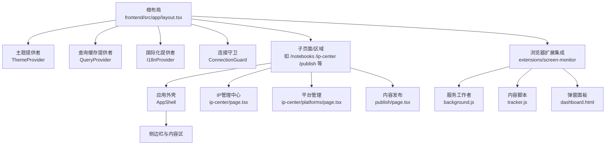

**图表来源**
- [frontend/src/app/layout.tsx](file://frontend/src/app/layout.tsx#L19-L45)
- [frontend/src/components/layout/AppShell.tsx](file://frontend/src/components/layout/AppShell.tsx#L10-L20)
- [frontend/src/app/(dashboard)/ip-center/page.tsx](file://frontend/src/app/(dashboard)/ip-center/page.tsx#L147-L436)
- [frontend/src/app/(dashboard)/ip-center/platforms/page.tsx](file://frontend/src/app/(dashboard)/ip-center/platforms/page.tsx#L255-L507)
- [frontend/src/app/(dashboard)/publish/page.tsx](file://frontend/src/app/(dashboard)/publish/page.tsx#L181-L539)

**章节来源**
- [frontend/src/app/layout.tsx](file://frontend/src/app/layout.tsx#L1-L46)
- [frontend/src/components/layout/AppShell.tsx](file://frontend/src/components/layout/AppShell.tsx#L1-L21)
- [extensions/screen-monitor/manifest.json](file://extensions/screen-monitor/manifest.json#L1-L39)

## 核心组件
- 根布局与Provider链
  - 根布局负责注入错误边界、主题、查询缓存、国际化与连接守卫，并渲染子页面。
  - Provider顺序影响副作用与状态初始化，建议保持现有顺序以避免水合不一致。
- 主题系统
  - 使用Zustand持久化存储用户主题偏好，动态切换根节点类名与data-theme属性，监听系统主题变化。
- 国际化
  - i18next初始化语言检测与回退，I18nProvider在挂载后渲染加载遮罩，避免水合差异。
- 运行时配置
  - 动态获取API地址，优先服务端/runtime配置，其次环境变量，最后相对路径重写代理到后端。
- 查询缓存
  - React Query默认配置与查询键集合，统一管理笔记、源、会话、播客等数据的缓存生命周期与重试策略。

**章节来源**
- [frontend/src/app/layout.tsx](file://frontend/src/app/layout.tsx#L19-L45)
- [frontend/src/components/providers/ThemeProvider.tsx](file://frontend/src/components/providers/ThemeProvider.tsx#L10-L44)
- [frontend/src/lib/stores/theme-store.ts](file://frontend/src/lib/stores/theme-store.ts#L13-L49)
- [frontend/src/components/providers/I18nProvider.tsx](file://frontend/src/components/providers/I18nProvider.tsx#L7-L25)
- [frontend/src/lib/i18n.ts](file://frontend/src/lib/i18n.ts#L6-L22)
- [frontend/src/lib/config.ts](file://frontend/src/lib/config.ts#L22-L140)
- [frontend/src/components/providers/QueryProvider.tsx](file://frontend/src/components/providers/QueryProvider.tsx#L10-L16)
- [frontend/src/lib/api/query-client.ts](file://frontend/src/lib/api/query-client.ts#L3-L35)

## 架构总览
下图展示从浏览器到后端的请求路径与关键中间件：

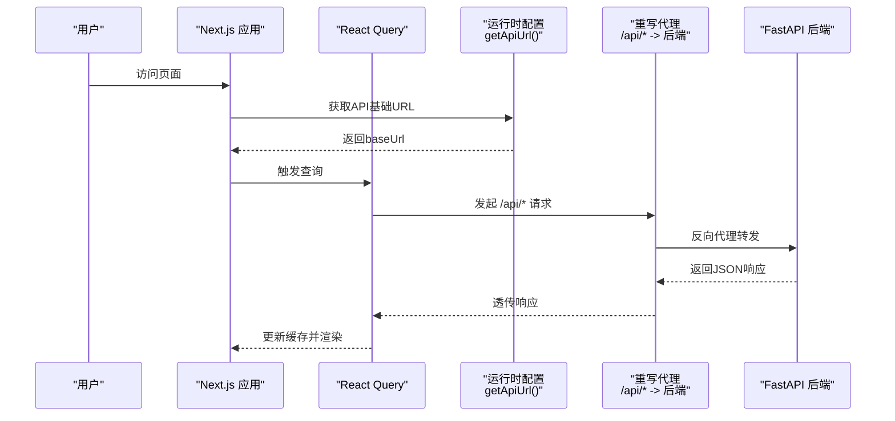

**图表来源**
- [frontend/src/lib/config.ts](file://frontend/src/lib/config.ts#L59-L140)
- [frontend/next.config.ts](file://frontend/next.config.ts#L18-L32)
- [frontend/src/lib/api/query-client.ts](file://frontend/src/lib/api/query-client.ts#L17-L35)

## 详细组件分析

### 主题系统（ThemeProvider）
- 设计要点
  - 将有效主题类名设置到html根节点，便于CSS选择器与组件读取；同时设置data-theme属性提升兼容性。
  - 当主题为"系统"时，监听系统配色方案变化，自动同步UI主题。
  - 使用Zustand持久化存储用户偏好，保证刷新后仍保持所选主题。
- 关键流程

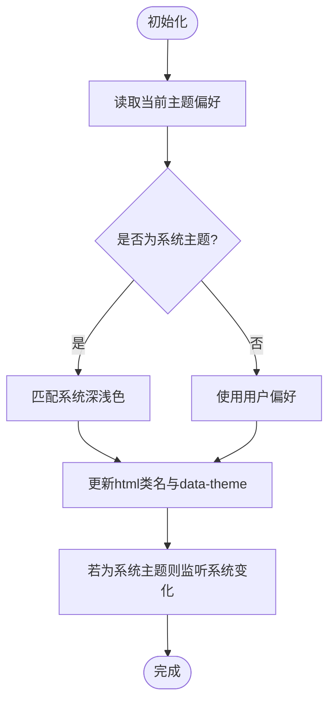

**图表来源**
- [frontend/src/components/providers/ThemeProvider.tsx](file://frontend/src/components/providers/ThemeProvider.tsx#L13-L41)
- [frontend/src/lib/stores/theme-store.ts](file://frontend/src/lib/stores/theme-store.ts#L32-L42)

**章节来源**
- [frontend/src/components/providers/ThemeProvider.tsx](file://frontend/src/components/providers/ThemeProvider.tsx#L10-L44)
- [frontend/src/lib/stores/theme-store.ts](file://frontend/src/lib/stores/theme-store.ts#L13-L49)

### 国际化（I18nProvider 与 i18n 初始化）
- 设计要点
  - i18next启用语言检测与本地存储缓存，回退至英文，禁用Suspense以简化水合。
  - I18nProvider在挂载后再渲染子树，避免SSR与CSR语言检测差异导致的水合不一致。
- 关键流程

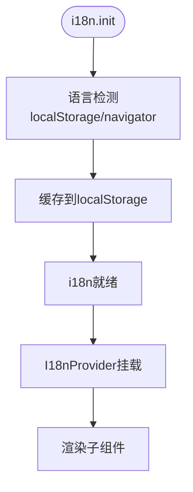

**图表来源**
- [frontend/src/lib/i18n.ts](file://frontend/src/lib/i18n.ts#L6-L22)
- [frontend/src/components/providers/I18nProvider.tsx](file://frontend/src/components/providers/I18nProvider.tsx#L7-L25)

**章节来源**
- [frontend/src/lib/i18n.ts](file://frontend/src/lib/i18n.ts#L1-L25)
- [frontend/src/components/providers/I18nProvider.tsx](file://frontend/src/components/providers/I18nProvider.tsx#L1-L26)

### 运行时配置（getApiUrl 与 getConfig）
- 设计要点
  - 优先从服务端/runtime端点获取API地址，其次使用构建期环境变量，最终采用相对路径重写代理。
  - 统一从后端/api/config拉取版本信息与数据库状态，作为连接守卫与更新提示的数据来源。
- 关键流程

**图表来源**
- [frontend/src/lib/config.ts](file://frontend/src/lib/config.ts#L59-L140)
- [frontend/next.config.ts](file://frontend/next.config.ts#L18-L32)

**章节来源**
- [frontend/src/lib/config.ts](file://frontend/src/lib/config.ts#L22-L140)
- [frontend/next.config.ts](file://frontend/next.config.ts#L3-L36)

### 查询缓存（React Query）
- 设计要点
  - 默认查询缓存5分钟，GC时间10分钟，窗口聚焦时不自动刷新；变更重试2次，创建/删除等变更重试1次。
  - 提供集中化的QUERY_KEYS，确保查询键稳定且类型安全，便于跨组件共享与调试。
- 关键流程

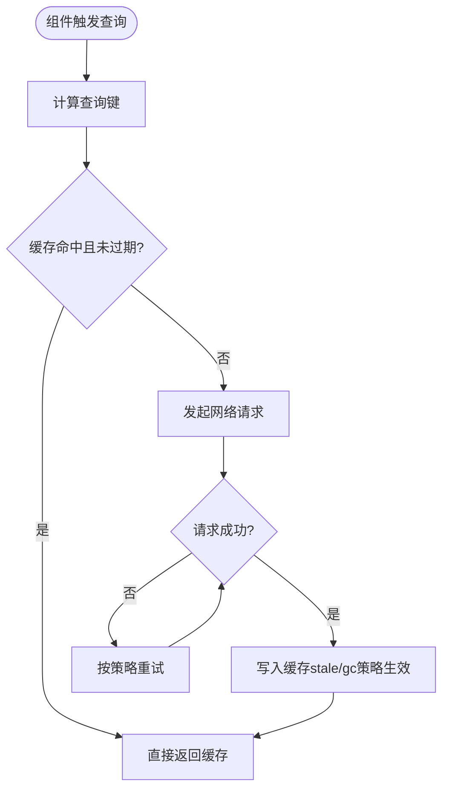

**图表来源**
- [frontend/src/lib/api/query-client.ts](file://frontend/src/lib/api/query-client.ts#L3-L15)
- [frontend/src/lib/api/query-client.ts](file://frontend/src/lib/api/query-client.ts#L17-L35)

**章节来源**
- [frontend/src/components/providers/QueryProvider.tsx](file://frontend/src/components/providers/QueryProvider.tsx#L1-L16)
- [frontend/src/lib/api/query-client.ts](file://frontend/src/lib/api/query-client.ts#L1-L35)

### UI组件库（以Button为例）
- 设计要点
  - 使用class-variance-authority实现变体与尺寸组合，统一过渡与禁用态样式。
  - 支持asChild插槽模式，适配语义标签与链接场景；内置焦点可见性与错误态样式。
- 类关系图

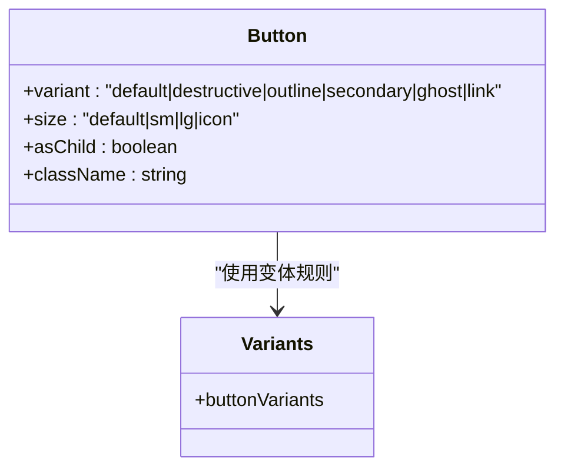

**图表来源**
- [frontend/src/components/ui/button.tsx](file://frontend/src/components/ui/button.tsx#L7-L36)

**章节来源**
- [frontend/src/components/ui/button.tsx](file://frontend/src/components/ui/button.tsx#L1-L60)

### 路由与页面组织
- 页面入口
  - 仪表盘首页重定向至笔记本列表页，保证默认导航一致性。
- 区域划分
  - 使用App Router分组语法组织认证与仪表盘区域，页面按功能域拆分，便于代码复用与测试隔离。
- 新增IP管理中心路由
  - ip-center：个人IP管理中心，包含数据看板、10维档案、内容日历、平台管理、有机体系统等功能
  - ip-center/platforms：平台账号管理页面
  - publish：内容发布管理页面
- 关键流程

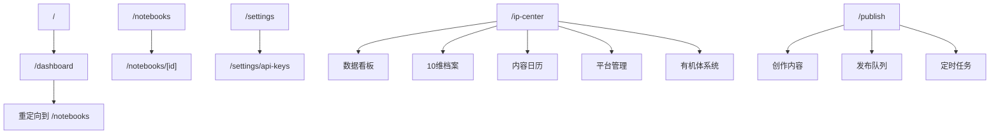

**图表来源**
- [frontend/src/app/(dashboard)/page.tsx](file://frontend/src/app/(dashboard)/page.tsx#L1-L5)
- [frontend/src/app/(dashboard)/ip-center/page.tsx](file://frontend/src/app/(dashboard)/ip-center/page.tsx#L184-L434)
- [frontend/src/app/(dashboard)/publish/page.tsx](file://frontend/src/app/(dashboard)/publish/page.tsx#L190-L475)

**章节来源**
- [frontend/src/app/(dashboard)/page.tsx](file://frontend/src/app/(dashboard)/page.tsx#L1-L5)

### 应用外壳与布局
- 设计要点
  - AppShell提供固定侧边栏与滚动主内容区，顶部设置横幅用于引导或提示。
  - 结合Tailwind类名实现全屏布局与溢出控制，保证在不同视口下的稳定性。
- 结构示意

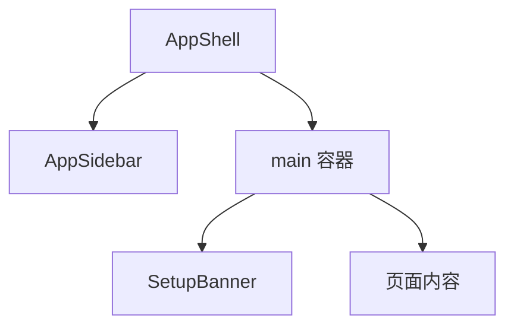

**图表来源**
- [frontend/src/components/layout/AppShell.tsx](file://frontend/src/components/layout/AppShell.tsx#L10-L20)

**章节来源**
- [frontend/src/components/layout/AppShell.tsx](file://frontend/src/components/layout/AppShell.tsx#L1-L21)

## 新增仪表板页面

### 个人IP管理中心（IP Command Center）
个人IP管理中心提供完整的个人品牌管理解决方案，包含以下核心功能模块：

#### 数据看板模块
- 快速统计：已发布内容、进行中内容、选题储备、总互动数等关键指标
- 四象限内容分布：按Q1-Q4象限展示内容分布情况
- 实时状态：展示各维度档案完整度和健康状况

#### 10维档案管理
基于10维模型的个人IP档案管理：
- 静态身份（D1）：核心价值观、定位信息
- 动态行为（D2）：内容频率、发布平台
- 价值驱动（D3）：专业领域、内容支柱
- 关系网络（D4）：受众细分、关键关系
- 知识资产（D7）：已发布内容数量、优质内容
- 认知进化（D10）：进化日志、转折点

#### 内容日历功能
- 选题管理：新建、编辑、删除选题
- 日程安排：与P0-P3系统集成，自动生成选题建议
- 内容规划：多平台内容发布时间协调

#### 平台管理集成
- 已连接平台展示：小红书、微博、公众号等平台状态
- 平台连接：支持Cookie和OAuth2认证方式
- 数据同步：自动同步各平台内容数据到P0感知层

#### 有机体系统监控
- P0-P3系统状态：感知层、价值层、关系层、进化层运行状态
- 系统指标：Agent运行数量、信号扫描、策略执行等
- 进化报告：系统学习成果和改进建议

**章节来源**
- [frontend/src/app/(dashboard)/ip-center/page.tsx](file://frontend/src/app/(dashboard)/ip-center/page.tsx#L1-L438)

### 平台账号管理
平台账号管理页面提供统一的多平台账号管理功能：

#### 已连接账号管理
- 账号状态监控：认证状态、同步状态、内容数量
- 同步控制：手动触发数据同步，查看同步历史
- 账号移除：断开平台连接，清理本地数据

#### 添加新平台
- 平台选择：支持小红书、微博、公众号、知乎、B站、Twitter、Instagram、YouTube等平台
- 认证方式：Cookie认证、OAuth2认证
- 连接状态：显示平台认证要求和连接状态

#### 内容预览
- 平台内容展示：查看各平台已发布内容
- 互动数据分析：浏览量、点赞数、评论数、分享数等
- 内容分类：按四象限模型标注内容类型

**章节来源**
- [frontend/src/app/(dashboard)/ip-center/platforms/page.tsx](file://frontend/src/app/(dashboard)/ip-center/platforms/page.tsx#L1-L510)

### 内容发布管理
内容发布管理页面提供一站式的内容发布解决方案：

#### 内容创作编辑器
- 标题编辑：支持多平台标题适配
- 正文编辑：富文本编辑，支持字数统计
- 标签管理：添加、删除标签，自动生成话题标签
- 媒体文件：支持图片、视频上传

#### 平台适配
- 多平台支持：小红书、微博、公众号、知乎、Twitter、Instagram、YouTube
- 自动适配：根据平台特性自动调整内容格式
- 字数限制：实时显示各平台字数限制和剩余字符数
- 格式优化：自动处理平台特定的格式要求

#### 发布队列管理
- 发布状态：已发布、已定时、发布中、失败等状态管理
- 历史记录：查看发布历史和结果
- 平台链接：一键跳转到各平台查看效果
- 重新发布：支持失败内容的重新发布

#### 定时任务管理
- 定时发布：设置内容发布时间和平台
- 任务监控：查看定时任务执行状态
- 立即发布：支持将定时任务提前执行
- 任务删除：取消不需要的定时发布

**章节来源**
- [frontend/src/app/(dashboard)/publish/page.tsx](file://frontend/src/app/(dashboard)/publish/page.tsx#L1-L542)

## 浏览器扩展集成

### OPC Activity Monitor概述
OPC Activity Monitor是一个Chrome/Edge浏览器扩展，旨在理解超级个体的数字行为模式。该扩展采用隐私优先的设计理念，所有数据均存储在本地浏览器中，不上传云端。

### 技术架构
扩展采用MV3 Manifest规范，包含三个核心组件：

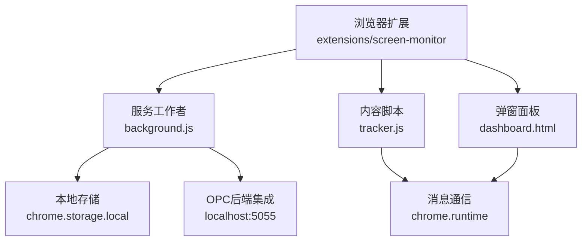

**图表来源**
- [extensions/screen-monitor/manifest.json](file://extensions/screen-monitor/manifest.json#L16-L25)
- [extensions/screen-monitor/background/background.js](file://extensions/screen-monitor/background/background.js#L65-L76)
- [extensions/screen-monitor/content/tracker.js](file://extensions/screen-monitor/content/tracker.js#L8-L13)

### 服务工作者模式（Background Service Worker）
服务工作者作为扩展的核心控制器，负责监听浏览器事件并管理活动追踪状态：

- **事件监听**：监听标签切换、URL更新、窗口焦点变化等系统事件
- **状态管理**：维护当前活动状态，包括URL、标题、域名、开始时间、分类等
- **数据持久化**：将活动记录存储在chrome.storage.local中，保留7天历史
- **周期同步**：每分钟同步数据到本地OPC后端（可选）

### 内容脚本注入（Content Script）
内容脚本在每个页面中运行，负责检测页面类型和收集用户参与指标：

- **页面类型检测**：识别视频平台、文档阅读、社交动态、代码仓库、文章阅读、编辑器等不同类型的内容
- **参与度指标**：跟踪滚动深度、复制行为、文本选择等用户行为指标
- **消息通信**：通过chrome.runtime.sendMessage与服务工作者通信
- **防重复注入**：防止同一页面多次注入相同脚本

### 弹窗面板（Dashboard）
弹窗面板提供可视化界面，展示当日活动统计和洞察分析：

- **实时状态**：显示当前活动的域名、分类、停留时长
- **统计概览**：总时长、活动次数、专注时长、切换次数等关键指标
- **分类分布**：按时间比例展示各类活动的分布情况
- **热门网站**：显示使用频率最高的网站排行
- **AI洞察**：基于统计数据生成个性化的行为分析和效率建议

### 数据流与集成
扩展与前端系统的数据集成流程：

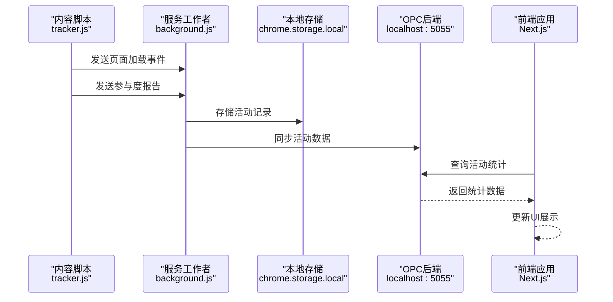

**图表来源**
- [extensions/screen-monitor/content/tracker.js](file://extensions/screen-monitor/content/tracker.js#L141-L151)
- [extensions/screen-monitor/background/background.js](file://extensions/screen-monitor/background/background.js#L184-L219)

### 隐私保护机制
- **本地存储**：所有数据存储在浏览器本地，不上传到远程服务器
- **数据清理**：自动清理7天前的历史数据，减少存储占用
- **透明控制**：用户可随时停用或卸载扩展，数据不会被第三方获取
- **最小权限**：仅申请必要的activeTab、tabs、storage、alarms权限

**章节来源**
- [extensions/screen-monitor/manifest.json](file://extensions/screen-monitor/manifest.json#L1-L39)
- [extensions/screen-monitor/background/background.js](file://extensions/screen-monitor/background/background.js#L1-L294)
- [extensions/screen-monitor/content/tracker.js](file://extensions/screen-monitor/content/tracker.js#L1-L154)
- [extensions/screen-monitor/popup/dashboard.html](file://extensions/screen-monitor/popup/dashboard.html#L1-L381)
- [extensions/screen-monitor/popup/dashboard.js](file://extensions/screen-monitor/popup/dashboard.js#L1-L304)
- [extensions/screen-monitor/README.md](file://extensions/screen-monitor/README.md#L1-L72)

## 依赖关系分析
- 外部依赖
  - Next.js、React Query、i18next、Radix UI、Tailwind CSS、Lucide React等。
  - **新增**浏览器扩展依赖：Chrome Extension APIs（chrome.runtime、chrome.storage、chrome.tabs等）。
- 内部依赖
  - 根布局聚合Provider，Provider之间低耦合；配置与查询键集中管理，减少重复与不一致风险。
  - **新增**扩展依赖：服务工作者与内容脚本之间的消息通信机制。
- 依赖图

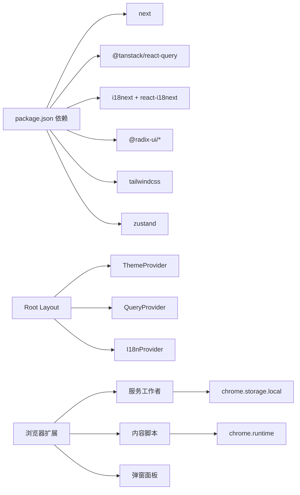

**图表来源**
- [frontend/package.json](file://frontend/package.json#L14-L57)
- [frontend/src/app/layout.tsx](file://frontend/src/app/layout.tsx#L4-L10)
- [extensions/screen-monitor/manifest.json](file://extensions/screen-monitor/manifest.json#L6-L11)

**章节来源**
- [frontend/package.json](file://frontend/package.json#L1-L77)
- [frontend/src/app/layout.tsx](file://frontend/src/app/layout.tsx#L1-L46)
- [extensions/screen-monitor/manifest.json](file://extensions/screen-monitor/manifest.json#L1-L39)

## 性能考虑
- 构建与输出
  - 启用standalone输出，便于Docker单文件部署与最小化容器镜像。
- 代理与重写
  - 将/api/*通过Next.js内部重写代理至后端，避免反向代理复杂度与CORS问题。
  - 提升代理客户端最大主体大小以支持大文件上传。
- 缓存与重试
  - 查询缓存与GC时间合理设置，减少不必要的网络往返；变更操作重试次数较少，避免放大后端压力。
- 国际化与主题
  - 语言检测与主题持久化均在客户端完成，减少服务端开销；主题切换即时应用到根节点，避免闪烁。
- **新增**浏览器扩展性能优化
  - 内容脚本使用passive事件监听器，避免阻塞页面滚动
  - 30秒间隔的定期报告，平衡数据收集频率与性能影响
  - 防抖机制处理高频事件（如文本选择），减少消息通信频率
- **新增**IP管理中心性能优化
  - 使用虚拟滚动处理大量内容数据
  - 懒加载平台配置和内容数据
  - 本地状态缓存减少重复计算

**章节来源**
- [frontend/next.config.ts](file://frontend/next.config.ts#L3-L36)
- [frontend/src/lib/api/query-client.ts](file://frontend/src/lib/api/query-client.ts#L3-L15)
- [frontend/src/lib/stores/theme-store.ts](file://frontend/src/lib/stores/theme-store.ts#L13-L49)
- [frontend/src/lib/i18n.ts](file://frontend/src/lib/i18n.ts#L6-L22)
- [extensions/screen-monitor/content/tracker.js](file://extensions/screen-monitor/content/tracker.js#L138-L139)

## 故障排查指南
- 连接与配置
  - 若无法获取后端配置，检查运行时配置端点与重写规则；确认NEXT_PUBLIC_API_URL与INTERNAL_API_URL设置。
- 国际化水合不一致
  - 确保I18nProvider在挂载后再渲染子树；检查本地存储的语言缓存。
- 主题切换无效
  - 检查根节点类名与data-theme是否正确更新；确认系统主题监听逻辑。
- 查询缓存异常
  - 核对查询键是否稳定；检查staleTime与gcTime设置；确认重试策略与refetchOnWindowFocus行为。
- **新增**IP管理中心问题排查
  - 档案数据未显示：检查Mock数据配置和API接口连接
  - 平台连接失败：验证认证信息格式和平台API可用性
  - 发布内容异常：检查平台适配规则和字数限制
- **新增**浏览器扩展问题排查
  - 扩展未显示：检查Chrome扩展管理页面中的OPC Activity Monitor是否已启用
  - 数据未记录：确认扩展权限设置，检查chrome.storage.local中的数据存储
  - OPC同步失败：验证localhost:5055服务是否正常运行，检查网络连接
  - 内容脚本未注入：查看页面控制台是否有脚本注入错误，确认manifest.json配置

**章节来源**
- [frontend/src/lib/config.ts](file://frontend/src/lib/config.ts#L59-L140)
- [frontend/src/components/providers/I18nProvider.tsx](file://frontend/src/components/providers/I18nProvider.tsx#L7-L25)
- [frontend/src/components/providers/ThemeProvider.tsx](file://frontend/src/components/providers/ThemeProvider.tsx#L13-L41)
- [frontend/src/lib/api/query-client.ts](file://frontend/src/lib/api/query-client.ts#L3-L15)
- [extensions/screen-monitor/background/background.js](file://extensions/screen-monitor/background/background.js#L215-L218)

## 结论
该前端架构以Next.js App Router为基础，通过Provider链实现主题、国际化与查询缓存的统一管理；运行时配置与重写代理简化了部署与跨域问题；UI组件库遵循变体与尺寸分离的设计原则，兼顾可维护性与可扩展性。**新增**的个人IP管理中心和内容发布管理功能进一步丰富了系统的业务能力，提供完整的个人品牌管理解决方案。**新增**的浏览器扩展集成进一步丰富了系统的数据采集能力，通过服务工作者模式和内容脚本注入实现了隐私优先的活动追踪功能。结合合理的缓存与重试策略，整体具备良好的性能与可运维性。

## 附录
- 组件开发指南与最佳实践
  - 使用class-variance-authority定义组件变体与尺寸，保持样式一致性。
  - 优先使用asChild插槽模式，增强语义与可访问性。
  - 在Provider中封装副作用逻辑，避免在组件内直接操作DOM或全局状态。
  - 对外暴露稳定的查询键常量，便于跨组件共享与调试。
  - **新增**浏览器扩展开发指南：遵循MV3规范，使用服务工作者处理后台逻辑，内容脚本专注于页面交互，合理使用消息通信机制。
  - **新增**IP管理中心开发指南：采用模块化设计，支持多维度数据管理，提供直观的可视化界面。
  - **新增**内容发布管理开发指南：实现平台适配引擎，支持多平台内容格式转换和发布流程管理。
- 部署与构建
  - 使用standalone输出与重写代理，降低部署复杂度。
  - 在CI中执行测试与lint，确保代码质量与一致性。
  - **新增**扩展打包：使用webpack或Vite构建扩展包，确保manifest.json正确配置各组件路径。
  - **新增**IP管理中心部署：支持独立部署和与主应用集成两种模式。