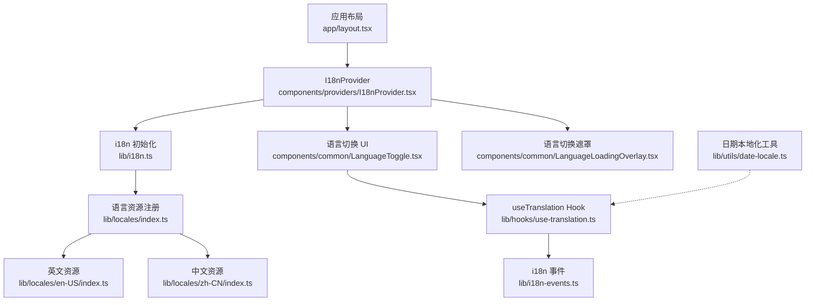
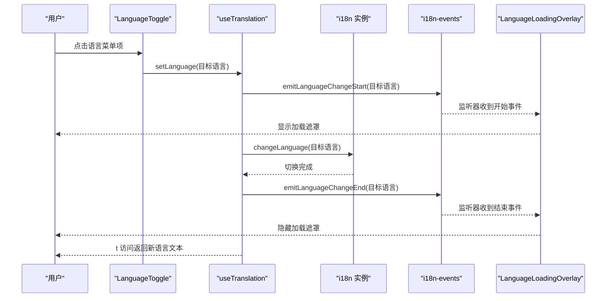
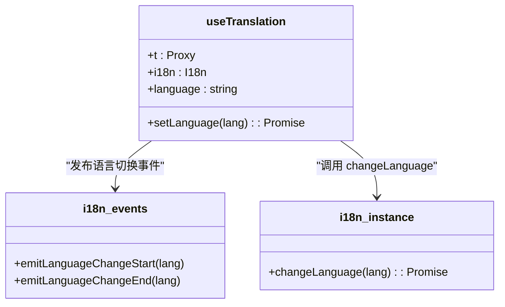
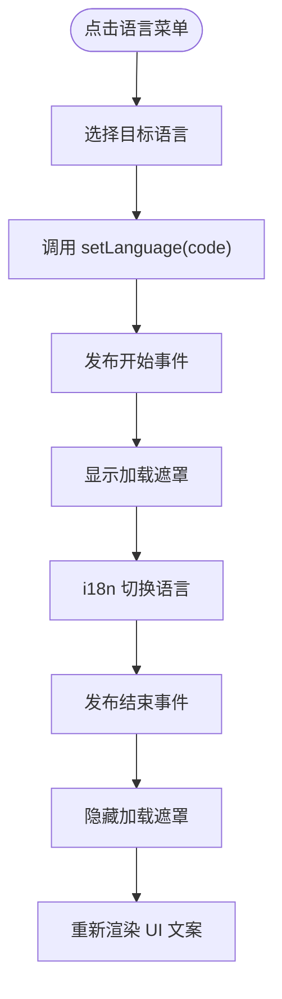
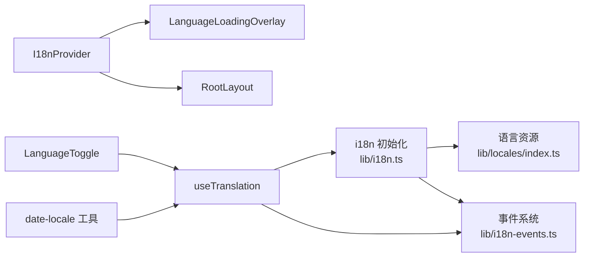

# 国际化支持

<cite>
**本文引用的文件**
- [frontend/src/lib/i18n.ts](file://frontend/src/lib/i18n.ts)
- [frontend/src/lib/locales/index.ts](file://frontend/src/lib/locales/index.ts)
- [frontend/src/lib/locales/en-US/index.ts](file://frontend/src/lib/locales/en-US/index.ts)
- [frontend/src/lib/locales/zh-CN/index.ts](file://frontend/src/lib/locales/zh-CN/index.ts)
- [frontend/src/lib/locales/CLAUDE.md](file://frontend/src/lib/locales/CLAUDE.md)
- [frontend/src/lib/hooks/use-translation.ts](file://frontend/src/lib/hooks/use-translation.ts)
- [frontend/src/lib/i18n-events.ts](file://frontend/src/lib/i18n-events.ts)
- [frontend/src/components/providers/I18nProvider.tsx](file://frontend/src/components/providers/I18nProvider.tsx)
- [frontend/src/components/common/LanguageToggle.tsx](file://frontend/src/components/common/LanguageToggle.tsx)
- [frontend/src/components/common/LanguageLoadingOverlay.tsx](file://frontend/src/components/common/LanguageLoadingOverlay.tsx)
- [frontend/src/app/layout.tsx](file://frontend/src/app/layout.tsx)
- [frontend/src/lib/utils/date-locale.ts](file://frontend/src/lib/utils/date-locale.ts)
- [frontend/src/lib/locales/index.test.ts](file://frontend/src/lib/locales/index.test.ts)
</cite>

## 目录
1. [简介](#简介)
2. [项目结构](#项目结构)
3. [核心组件](#核心组件)
4. [架构总览](#架构总览)
5. [详细组件分析](#详细组件分析)
6. [依赖关系分析](#依赖关系分析)
7. [性能考量](#性能考量)
8. [故障排查指南](#故障排查指南)
9. [结论](#结论)
10. [附录](#附录)

## 简介
本文件系统性阐述 Open Notebook 的国际化（i18n）体系，覆盖架构设计、实现机制与最佳实践。重点包括：
- 语言切换流程与事件驱动的加载覆盖
- 文本翻译与键值管理、代理式访问与类型安全
- 动态语言加载与回退策略
- 日期时间格式化与数字/货币显示的本地化
- RTL 语言支持与文本方向、字体适配建议
- 多语言开发指南与翻译维护策略

## 项目结构
前端国际化相关代码主要集中在以下位置：
- 配置与初始化：frontend/src/lib/i18n.ts
- 语言资源与类型：frontend/src/lib/locales/*
- 自定义 Hook：frontend/src/lib/hooks/use-translation.ts
- 语言切换事件：frontend/src/lib/i18n-events.ts
- Provider 与 UI 组件：frontend/src/components/providers/I18nProvider.tsx、LanguageToggle.tsx、LanguageLoadingOverlay.tsx
- 布局集成：frontend/src/app/layout.tsx
- 本地化工具：frontend/src/lib/utils/date-locale.ts
- 测试：frontend/src/lib/locales/index.test.ts

图表来源
- [frontend/src/app/layout.tsx](file://frontend/src/app/layout.tsx#L1-L46)
- [frontend/src/components/providers/I18nProvider.tsx](file://frontend/src/components/providers/I18nProvider.tsx#L1-L26)
- [frontend/src/lib/i18n.ts](file://frontend/src/lib/i18n.ts#L1-L25)
- [frontend/src/lib/locales/index.ts](file://frontend/src/lib/locales/index.ts#L1-L39)
- [frontend/src/lib/locales/en-US/index.ts](file://frontend/src/lib/locales/en-US/index.ts#L1-L200)
- [frontend/src/lib/locales/zh-CN/index.ts](file://frontend/src/lib/locales/zh-CN/index.ts#L1-L200)
- [frontend/src/lib/hooks/use-translation.ts](file://frontend/src/lib/hooks/use-translation.ts#L1-L158)
- [frontend/src/lib/i18n-events.ts](file://frontend/src/lib/i18n-events.ts#L1-L24)
- [frontend/src/components/common/LanguageToggle.tsx](file://frontend/src/components/common/LanguageToggle.tsx#L1-L77)
- [frontend/src/components/common/LanguageLoadingOverlay.tsx](file://frontend/src/components/common/LanguageLoadingOverlay.tsx#L1-L92)
- [frontend/src/lib/utils/date-locale.ts](file://frontend/src/lib/utils/date-locale.ts#L1-L25)

章节来源
- [frontend/src/app/layout.tsx](file://frontend/src/app/layout.tsx#L1-L46)
- [frontend/src/lib/i18n.ts](file://frontend/src/lib/i18n.ts#L1-L25)
- [frontend/src/lib/locales/index.ts](file://frontend/src/lib/locales/index.ts#L1-L39)

## 核心组件
- i18n 初始化与检测
  - 使用 i18next + react-i18next，启用浏览器语言自动检测与本地存储缓存，回退语言为 en-US。
  - 关闭 React Suspense，避免水合问题；禁用转义，由 React 保证 XSS 安全。
- 语言资源与类型
  - 资源集中注册于 locales/index.ts，导出资源映射与语言列表，提供类型别名 TranslationKeys 与 LanguageCode。
  - 英文作为基准语言，其他语言（如 zh-CN）逐键翻译。
- 自定义 Hook useTranslation
  - 提供基于 Proxy 的链式访问 t.common.loading，内置深度限制与循环检测，支持字符串方法代理（如 replace、split）。
  - 暴露 setLanguage，封装语言切换并发出事件。
- 语言切换事件与遮罩
  - i18n-events.ts 发布“开始/结束”语言切换事件；LanguageLoadingOverlay 在切换期间显示加载遮罩，改善体验。
- Provider 与 UI
  - I18nProvider 在挂载后渲染遮罩与子组件，避免水合不一致。
  - LanguageToggle 展示可用语言并调用 setLanguage。

章节来源
- [frontend/src/lib/i18n.ts](file://frontend/src/lib/i18n.ts#L1-L25)
- [frontend/src/lib/locales/index.ts](file://frontend/src/lib/locales/index.ts#L1-L39)
- [frontend/src/lib/hooks/use-translation.ts](file://frontend/src/lib/hooks/use-translation.ts#L1-L158)
- [frontend/src/lib/i18n-events.ts](file://frontend/src/lib/i18n-events.ts#L1-L24)
- [frontend/src/components/providers/I18nProvider.tsx](file://frontend/src/components/providers/I18nProvider.tsx#L1-L26)
- [frontend/src/components/common/LanguageToggle.tsx](file://frontend/src/components/common/LanguageToggle.tsx#L1-L77)
- [frontend/src/components/common/LanguageLoadingOverlay.tsx](file://frontend/src/components/common/LanguageLoadingOverlay.tsx#L1-L92)

## 架构总览
下图展示从用户触发语言切换到界面更新的端到端流程，以及事件驱动的加载遮罩机制。

图表来源
- [frontend/src/components/common/LanguageToggle.tsx](file://frontend/src/components/common/LanguageToggle.tsx#L1-L77)
- [frontend/src/lib/hooks/use-translation.ts](file://frontend/src/lib/hooks/use-translation.ts#L135-L148)
- [frontend/src/lib/i18n-events.ts](file://frontend/src/lib/i18n-events.ts#L1-L24)
- [frontend/src/components/common/LanguageLoadingOverlay.tsx](file://frontend/src/components/common/LanguageLoadingOverlay.tsx#L61-L72)

## 详细组件分析

### 组件 A：useTranslation Hook（代理式翻译 API）
- 设计要点
  - 通过 Proxy 将 t.common.loading 转换为内部路径查询，支持链式访问与字符串方法代理。
  - 严格深度限制与访问计数器，防止无限递归与性能问题。
  - setLanguage 封装 i18n.changeLanguage，并在前后发出事件。
- 性能与健壮性
  - memo 化与稳定依赖，减少不必要的重建。
  - 循环检测与超时保护，避免极端情况下的卡顿。
- 类型安全
  - 通过 TranslationKeys 与 locales 结构保持键一致性，测试确保各语言键集合一致。

图表来源
- [frontend/src/lib/hooks/use-translation.ts](file://frontend/src/lib/hooks/use-translation.ts#L1-L158)
- [frontend/src/lib/i18n-events.ts](file://frontend/src/lib/i18n-events.ts#L1-L24)
- [frontend/src/lib/i18n.ts](file://frontend/src/lib/i18n.ts#L1-L25)

章节来源
- [frontend/src/lib/hooks/use-translation.ts](file://frontend/src/lib/hooks/use-translation.ts#L1-L158)
- [frontend/src/lib/locales/index.test.ts](file://frontend/src/lib/locales/index.test.ts#L1-L56)

### 组件 B：语言切换 UI（LanguageToggle）
- 功能
  - 下拉菜单展示可用语言，根据当前语言高亮对应项。
  - 点击后调用 setLanguage 切换语言。
- 交互
  - 与 useTranslation 协作，使用 t.common.* 键进行文案展示。

图表来源
- [frontend/src/components/common/LanguageToggle.tsx](file://frontend/src/components/common/LanguageToggle.tsx#L1-L77)
- [frontend/src/lib/hooks/use-translation.ts](file://frontend/src/lib/hooks/use-translation.ts#L135-L148)
- [frontend/src/lib/i18n-events.ts](file://frontend/src/lib/i18n-events.ts#L1-L24)
- [frontend/src/components/common/LanguageLoadingOverlay.tsx](file://frontend/src/components/common/LanguageLoadingOverlay.tsx#L61-L72)

章节来源
- [frontend/src/components/common/LanguageToggle.tsx](file://frontend/src/components/common/LanguageToggle.tsx#L1-L77)

### 组件 C：语言切换遮罩（LanguageLoadingOverlay）
- 作用
  - 在语言切换过渡期显示加载状态，避免闪烁与不一致渲染。
- 实现
  - 监听 i18n 事件，在开始时显示，结束时隐藏；带安全超时以防异常卡死。

章节来源
- [frontend/src/components/common/LanguageLoadingOverlay.tsx](file://frontend/src/components/common/LanguageLoadingOverlay.tsx#L1-L92)
- [frontend/src/lib/i18n-events.ts](file://frontend/src/lib/i18n-events.ts#L1-L24)

### 组件 D：日期本地化工具（getDateLocale）
- 作用
  - 将语言代码映射到 date-fns 的 Locale 对象，用于日期格式化。
- 扩展
  - 新增语言时需在此映射表中注册。

章节来源
- [frontend/src/lib/utils/date-locale.ts](file://frontend/src/lib/utils/date-locale.ts#L1-L25)

### 组件 E：语言资源与类型（locales/index.ts）
- 作用
  - 注册多语言资源与语言列表，导出类型别名以约束翻译键。
- 质量保障
  - 通过测试确保各语言键集合与英文一致。

章节来源
- [frontend/src/lib/locales/index.ts](file://frontend/src/lib/locales/index.ts#L1-L39)
- [frontend/src/lib/locales/index.test.ts](file://frontend/src/lib/locales/index.test.ts#L1-L56)

## 依赖关系分析
- 组件耦合
  - I18nProvider 依赖 i18n 初始化与遮罩组件。
  - LanguageToggle 依赖 useTranslation。
  - useTranslation 依赖 i18n 实例与事件系统。
- 外部依赖
  - i18next、react-i18next、i18next-browser-languagedetector。
  - date-fns/locale 用于日期本地化。
- 可能的循环依赖
  - 当前结构清晰，Provider 位于顶层，UI 组件通过 Hook 访问翻译，未见循环导入迹象。

图表来源
- [frontend/src/lib/i18n.ts](file://frontend/src/lib/i18n.ts#L1-L25)
- [frontend/src/lib/locales/index.ts](file://frontend/src/lib/locales/index.ts#L1-L39)
- [frontend/src/lib/i18n-events.ts](file://frontend/src/lib/i18n-events.ts#L1-L24)
- [frontend/src/components/providers/I18nProvider.tsx](file://frontend/src/components/providers/I18nProvider.tsx#L1-L26)
- [frontend/src/components/common/LanguageToggle.tsx](file://frontend/src/components/common/LanguageToggle.tsx#L1-L77)
- [frontend/src/lib/hooks/use-translation.ts](file://frontend/src/lib/hooks/use-translation.ts#L1-L158)
- [frontend/src/lib/utils/date-locale.ts](file://frontend/src/lib/utils/date-locale.ts#L1-L25)

章节来源
- [frontend/src/lib/i18n.ts](file://frontend/src/lib/i18n.ts#L1-L25)
- [frontend/src/lib/locales/index.ts](file://frontend/src/lib/locales/index.ts#L1-L39)
- [frontend/src/lib/hooks/use-translation.ts](file://frontend/src/lib/hooks/use-translation.ts#L1-L158)

## 性能考量
- 渲染抖动与闪烁
  - 使用 LanguageLoadingOverlay 在语言切换期间遮罩，避免因翻译键缺失导致的闪烁。
- 代理访问的开销
  - Proxy 深度限制与访问计数器有效防止无限递归与过度计算。
- 水合与 Suspense
  - 关闭 React Suspense 避免与 i18n 加载状态冲突引发的水合问题。
- 字符串方法代理
  - 仅对常用字符串方法进行代理绑定，降低额外开销。

章节来源
- [frontend/src/components/common/LanguageLoadingOverlay.tsx](file://frontend/src/components/common/LanguageLoadingOverlay.tsx#L1-L92)
- [frontend/src/lib/hooks/use-translation.ts](file://frontend/src/lib/hooks/use-translation.ts#L26-L133)
- [frontend/src/lib/i18n.ts](file://frontend/src/lib/i18n.ts#L15-L17)

## 故障排查指南
- 语言切换无响应
  - 检查 setLanguage 是否被重复调用（当前语言相同时直接返回）。
  - 确认事件监听是否正常，开始/结束事件是否触发。
- 界面出现闪烁
  - 确保 LanguageLoadingOverlay 正常显示与隐藏，必要时检查超时逻辑。
- 翻译键缺失
  - 使用 locales/index.test.ts 的键对比逻辑定位缺失键。
- 代理访问异常或性能问题
  - 检查代理深度限制与访问计数器，避免深层嵌套与高频访问。

章节来源
- [frontend/src/lib/hooks/use-translation.ts](file://frontend/src/lib/hooks/use-translation.ts#L135-L148)
- [frontend/src/lib/i18n-events.ts](file://frontend/src/lib/i18n-events.ts#L1-L24)
- [frontend/src/lib/locales/index.test.ts](file://frontend/src/lib/locales/index.test.ts#L1-L56)

## 结论
Open Notebook 的 i18n 系统以 i18next 为核心，结合自定义 Hook 与事件驱动的加载遮罩，实现了高性能、低风险的语言切换体验。通过严格的键校验与类型约束，保障了多语言环境下的一致性与可维护性。日期与数字等本地化需求可通过 date-fns 与现有工具扩展满足。

## 附录

### 多语言开发指南
- 新增语言步骤
  - 在 locales 下新增目录与索引文件，复制英文结构并逐键翻译。
  - 在 locales/index.ts 中注册资源与语言列表。
  - 在 utils/date-locale.ts 中添加对应的 date-fns Locale 映射。
- 键值管理
  - 使用英文为基准，其他语言保持键结构一致。
  - 通过测试脚本对比键集合，确保完整性。
- 文本方向与字体适配
  - 本仓库未内置 RTL 支持与字体适配逻辑，建议在新增语言时：
    - 在根节点 html 上根据语言设置 dir="rtl"（如阿拉伯语、希伯来语）。
    - 引入针对该语言的字体族，确保符号与字符完整显示。
    - 如需滚动条或排版方向调整，可在全局样式中按语言条件注入。
- 翻译维护策略
  - 建议在 PR 中附带键对比测试，确保新增/修改键同步至所有语言。
  - 对于占位符（如 {time}、{date}），保持占位符名一致，避免破坏翻译。
  - 对 UI 文案进行可读性审查，避免过长导致布局溢出。

章节来源
- [frontend/src/lib/locales/CLAUDE.md](file://frontend/src/lib/locales/CLAUDE.md#L53-L145)
- [frontend/src/lib/locales/index.ts](file://frontend/src/lib/locales/index.ts#L1-L39)
- [frontend/src/lib/utils/date-locale.ts](file://frontend/src/lib/utils/date-locale.ts#L1-L25)