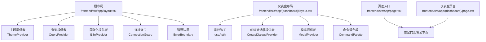
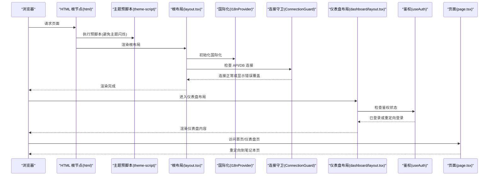
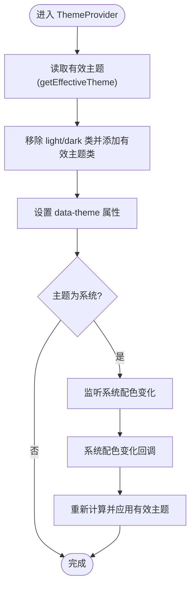
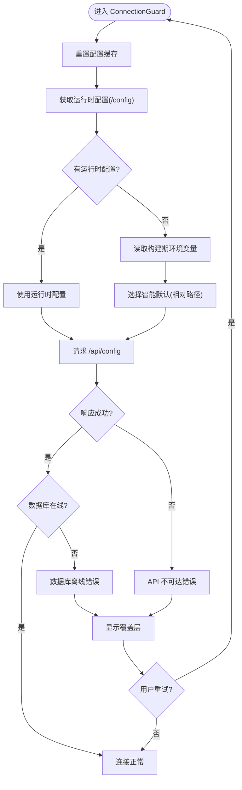
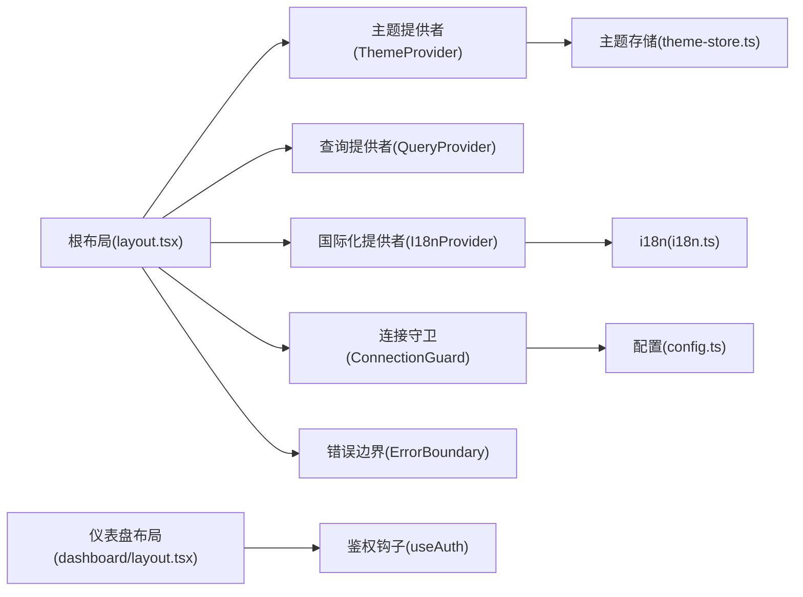

# 应用结构

<cite>
**本文引用的文件**
- [frontend/src/app/layout.tsx](file://frontend/src/app/layout.tsx)
- [frontend/src/app/(dashboard)/layout.tsx](file://frontend/src/app/(dashboard)/layout.tsx)
- [frontend/src/app/page.tsx](file://frontend/src/app/page.tsx)
- [frontend/src/app/(dashboard)/page.tsx](file://frontend/src/app/(dashboard)/page.tsx)
- [frontend/src/components/providers/ThemeProvider.tsx](file://frontend/src/components/providers/ThemeProvider.tsx)
- [frontend/src/lib/stores/theme-store.ts](file://frontend/src/lib/stores/theme-store.ts)
- [frontend/src/lib/theme-script.ts](file://frontend/src/lib/theme-script.ts)
- [frontend/src/components/providers/I18nProvider.tsx](file://frontend/src/components/providers/I18nProvider.tsx)
- [frontend/src/lib/i18n.ts](file://frontend/src/lib/i18n.ts)
- [frontend/src/components/common/ErrorBoundary.tsx](file://frontend/src/components/common/ErrorBoundary.tsx)
- [frontend/src/components/common/ConnectionGuard.tsx](file://frontend/src/components/common/ConnectionGuard.tsx)
- [frontend/src/lib/config.ts](file://frontend/src/lib/config.ts)
- [frontend/src/components/layout/AppShell.tsx](file://frontend/src/components/layout/AppShell.tsx)
- [frontend/src/lib/hooks/use-auth.ts](file://frontend/src/lib/hooks/use-auth.ts)
- [frontend/src/app/globals.css](file://frontend/src/app/globals.css)
</cite>

## 目录
1. [简介](#简介)
2. [项目结构](#项目结构)
3. [核心组件](#核心组件)
4. [架构总览](#架构总览)
5. [组件详解](#组件详解)
6. [依赖关系分析](#依赖关系分析)
7. [性能考量](#性能考量)
8. [故障排查指南](#故障排查指南)
9. [结论](#结论)
10. [附录：配置与定制指南](#附录配置与定制指南)

## 简介
本文件系统性梳理 Open Notebook 前端（Next.js）应用的整体布局架构与页面组织方式，重点覆盖：
- 根布局设计模式、元数据与全局样式的组织
- 应用启动流程、HTML 结构与国际化初始化
- 错误边界处理、连接状态管理与主题切换机制
- 应用生命周期管理与性能优化策略
- 配置与定制指南

## 项目结构
前端采用 Next.js App Router 的文件系统路由约定，页面按功能分组在命名路由组中组织，如认证相关位于 (auth)，仪表盘相关位于 (dashboard)。根布局负责注入全局样式、主题、国际化、查询缓存、错误边界与连接守卫；仪表盘布局负责鉴权校验与版本检查。

图表来源
- [frontend/src/app/layout.tsx](file://frontend/src/app/layout.tsx#L1-L46)
- [frontend/src/app/(dashboard)/layout.tsx](file://frontend/src/app/(dashboard)/layout.tsx#L1-L64)
- [frontend/src/app/page.tsx](file://frontend/src/app/page.tsx#L1-L6)
- [frontend/src/app/(dashboard)/page.tsx](file://frontend/src/app/(dashboard)/page.tsx#L1-L5)

章节来源
- [frontend/src/app/layout.tsx](file://frontend/src/app/layout.tsx#L1-L46)
- [frontend/src/app/(dashboard)/layout.tsx](file://frontend/src/app/(dashboard)/layout.tsx#L1-L64)
- [frontend/src/app/page.tsx](file://frontend/src/app/page.tsx#L1-L6)
- [frontend/src/app/(dashboard)/page.tsx](file://frontend/src/app/(dashboard)/page.tsx#L1-L5)

## 核心组件
- 根布局与全局注入：根布局负责设置元数据、字体、全局样式、主题脚本、错误边界、主题提供者、查询提供者、国际化提供者与连接守卫，并渲染子组件与通知组件。
- 主题系统：通过主题提供者与 Zustand 存储实现主题持久化与系统偏好监听，同时在服务端/客户端均执行预渲染脚本避免主题闪烁。
- 国际化：基于 i18next 初始化语言检测与资源加载，提供挂载后避免水合不一致的包装器。
- 连接守卫：在应用启动时检查后端 API 与数据库状态，出现异常时显示错误覆盖层并支持快捷键重试。
- 错误边界：捕获子树内未处理异常，提供“重试”“刷新页面”等操作，并在开发环境展示错误详情。
- 页面与壳：首页与仪表盘页进行重定向至笔记本列表；仪表盘壳组件负责侧边栏、设置横幅与主内容区。

章节来源
- [frontend/src/app/layout.tsx](file://frontend/src/app/layout.tsx#L1-L46)
- [frontend/src/components/providers/ThemeProvider.tsx](file://frontend/src/components/providers/ThemeProvider.tsx#L1-L45)
- [frontend/src/lib/stores/theme-store.ts](file://frontend/src/lib/stores/theme-store.ts#L1-L61)
- [frontend/src/lib/theme-script.ts](file://frontend/src/lib/theme-script.ts#L1-L18)
- [frontend/src/components/providers/I18nProvider.tsx](file://frontend/src/components/providers/I18nProvider.tsx#L1-L26)
- [frontend/src/lib/i18n.ts](file://frontend/src/lib/i18n.ts#L1-L25)
- [frontend/src/components/common/ConnectionGuard.tsx](file://frontend/src/components/common/ConnectionGuard.tsx#L1-L109)
- [frontend/src/components/common/ErrorBoundary.tsx](file://frontend/src/components/common/ErrorBoundary.tsx#L1-L105)
- [frontend/src/app/page.tsx](file://frontend/src/app/page.tsx#L1-L6)
- [frontend/src/app/(dashboard)/page.tsx](file://frontend/src/app/(dashboard)/page.tsx#L1-L5)
- [frontend/src/components/layout/AppShell.tsx](file://frontend/src/components/layout/AppShell.tsx#L1-L21)

## 架构总览
下图展示了从浏览器请求到页面渲染的关键路径，包括主题脚本预执行、鉴权检查、连接状态验证与国际化初始化。

图表来源
- [frontend/src/app/layout.tsx](file://frontend/src/app/layout.tsx#L1-L46)
- [frontend/src/lib/theme-script.ts](file://frontend/src/lib/theme-script.ts#L1-L18)
- [frontend/src/components/providers/I18nProvider.tsx](file://frontend/src/components/providers/I18nProvider.tsx#L1-L26)
- [frontend/src/components/common/ConnectionGuard.tsx](file://frontend/src/components/common/ConnectionGuard.tsx#L1-L109)
- [frontend/src/app/(dashboard)/layout.tsx](file://frontend/src/app/(dashboard)/layout.tsx#L1-L64)
- [frontend/src/lib/hooks/use-auth.ts](file://frontend/src/lib/hooks/use-auth.ts#L1-L68)
- [frontend/src/app/page.tsx](file://frontend/src/app/page.tsx#L1-L6)
- [frontend/src/app/(dashboard)/page.tsx](file://frontend/src/app/(dashboard)/page.tsx#L1-L5)

## 组件详解

### 根布局与全局注入
- 元数据与字体：在根布局中声明标题与描述，并引入 Google Fonts 字体。
- 全局样式：导入 Tailwind 与动画库，使用 CSS 变量定义明暗主题色彩体系。
- 主题脚本：在 head 中注入预执行脚本，依据本地存储与系统偏好设置根元素的主题类与属性，避免水合闪烁。
- Provider 层叠：错误边界包裹最外层，确保任何子树异常可被捕获；主题提供者负责 DOM 主题类与属性更新；查询提供者为数据获取与缓存提供上下文；国际化提供者保证水合一致性；连接守卫负责运行时连接检查。
- 通知组件：全局通知（Toaster）在根布局末尾渲染，便于跨路由提示。

章节来源
- [frontend/src/app/layout.tsx](file://frontend/src/app/layout.tsx#L1-L46)
- [frontend/src/app/globals.css](file://frontend/src/app/globals.css#L1-L193)
- [frontend/src/lib/theme-script.ts](file://frontend/src/lib/theme-script.ts#L1-L18)

### 主题切换机制
- 状态存储：Zustand 存储维护当前主题（light/dark/system），并提供设置主题、获取系统主题、计算有效主题的方法。
- 提供者逻辑：首次挂载时根据有效主题设置根元素类名与 data-theme 属性；当主题为系统时监听系统配色变化以动态更新。
- 预脚本：在 SSR/Hydration 前通过脚本读取本地存储的主题偏好，预先设置根元素主题，避免闪烁。
- 组件使用：提供 useTheme 钩子，便于组件读取当前主题状态与是否为深色模式。

图表来源
- [frontend/src/components/providers/ThemeProvider.tsx](file://frontend/src/components/providers/ThemeProvider.tsx#L1-L45)
- [frontend/src/lib/stores/theme-store.ts](file://frontend/src/lib/stores/theme-store.ts#L1-L61)
- [frontend/src/lib/theme-script.ts](file://frontend/src/lib/theme-script.ts#L1-L18)

章节来源
- [frontend/src/components/providers/ThemeProvider.tsx](file://frontend/src/components/providers/ThemeProvider.tsx#L1-L45)
- [frontend/src/lib/stores/theme-store.ts](file://frontend/src/lib/stores/theme-store.ts#L1-L61)
- [frontend/src/lib/theme-script.ts](file://frontend/src/lib/theme-script.ts#L1-L18)

### 国际化初始化
- 初始化流程：i18next 使用浏览器语言探测器与本地存储缓存，设置回退语言与禁用 Suspense，避免水合不一致。
- 包装器：I18nProvider 在挂载后再渲染子组件，避免 SSR 与 CSR 的语言差异导致的水合警告。

章节来源
- [frontend/src/lib/i18n.ts](file://frontend/src/lib/i18n.ts#L1-L25)
- [frontend/src/components/providers/I18nProvider.tsx](file://frontend/src/components/providers/I18nProvider.tsx#L1-L26)

### 连接状态管理
- 启动检查：ConnectionGuard 在挂载时尝试获取后端配置，区分数据库离线与 API 不可达两类错误。
- 错误覆盖：根据错误类型渲染对应覆盖层，提供重试按钮与键盘快捷键（R 键）。
- 缓存控制：每次检查前重置配置缓存，确保获取最新状态。
- 配置优先级：运行时配置（/config） > 构建期环境变量（NEXT_PUBLIC_API_URL） > 智能默认（相对路径重写）。

图表来源
- [frontend/src/components/common/ConnectionGuard.tsx](file://frontend/src/components/common/ConnectionGuard.tsx#L1-L109)
- [frontend/src/lib/config.ts](file://frontend/src/lib/config.ts#L1-L149)

章节来源
- [frontend/src/components/common/ConnectionGuard.tsx](file://frontend/src/components/common/ConnectionGuard.tsx#L1-L109)
- [frontend/src/lib/config.ts](file://frontend/src/lib/config.ts#L1-L149)

### 错误边界处理
- 捕获范围：类组件错误边界捕获子树内未处理异常，记录错误信息并在开发环境展示细节。
- 用户操作：提供“重试”与“刷新页面”两种恢复方式；支持自定义回退组件。
- 与 Provider 协作：与主题、国际化、查询等提供者组合使用，确保在复杂上下文中仍可稳定兜底。

章节来源
- [frontend/src/components/common/ErrorBoundary.tsx](file://frontend/src/components/common/ErrorBoundary.tsx#L1-L105)

### 页面与壳组件
- 页面重定向：首页与仪表盘页均重定向至笔记本列表，作为默认入口。
- 仪表盘壳：AppShell 将侧边栏与主内容区组合，配合 SetupBanner 提示初始化状态。

章节来源
- [frontend/src/app/page.tsx](file://frontend/src/app/page.tsx#L1-L6)
- [frontend/src/app/(dashboard)/page.tsx](file://frontend/src/app/(dashboard)/page.tsx#L1-L5)
- [frontend/src/components/layout/AppShell.tsx](file://frontend/src/components/layout/AppShell.tsx#L1-L21)

## 依赖关系分析
- Provider 耦合度：根布局聚合多个提供者，形成强耦合但高复用的上下文层；建议保持其职责单一，避免过度嵌套。
- 主题与国际化：ThemeStore 与 I18nProvider 分别独立管理主题与语言状态，二者通过根布局统一注入，互不直接依赖。
- 连接守卫与配置：ConnectionGuard 依赖配置模块的获取与重置能力；配置模块内部实现缓存与优先级策略，避免重复请求。
- 鉴权与路由：仪表盘布局依赖鉴权钩子进行登录态判断与重定向，结合会话存储实现登录后的路径恢复。

图表来源
- [frontend/src/app/layout.tsx](file://frontend/src/app/layout.tsx#L1-L46)
- [frontend/src/app/(dashboard)/layout.tsx](file://frontend/src/app/(dashboard)/layout.tsx#L1-L64)
- [frontend/src/components/providers/ThemeProvider.tsx](file://frontend/src/components/providers/ThemeProvider.tsx#L1-L45)
- [frontend/src/lib/stores/theme-store.ts](file://frontend/src/lib/stores/theme-store.ts#L1-L61)
- [frontend/src/components/providers/I18nProvider.tsx](file://frontend/src/components/providers/I18nProvider.tsx#L1-L26)
- [frontend/src/lib/i18n.ts](file://frontend/src/lib/i18n.ts#L1-L25)
- [frontend/src/components/common/ConnectionGuard.tsx](file://frontend/src/components/common/ConnectionGuard.tsx#L1-L109)
- [frontend/src/lib/config.ts](file://frontend/src/lib/config.ts#L1-L149)
- [frontend/src/lib/hooks/use-auth.ts](file://frontend/src/lib/hooks/use-auth.ts#L1-L68)

章节来源
- [frontend/src/app/layout.tsx](file://frontend/src/app/layout.tsx#L1-L46)
- [frontend/src/app/(dashboard)/layout.tsx](file://frontend/src/app/(dashboard)/layout.tsx#L1-L64)
- [frontend/src/lib/config.ts](file://frontend/src/lib/config.ts#L1-L149)
- [frontend/src/lib/stores/theme-store.ts](file://frontend/src/lib/stores/theme-store.ts#L1-L61)
- [frontend/src/lib/i18n.ts](file://frontend/src/lib/i18n.ts#L1-L25)
- [frontend/src/lib/hooks/use-auth.ts](file://frontend/src/lib/hooks/use-auth.ts#L1-L68)

## 性能考量
- 避免主题闪烁：通过预执行脚本在水合前设置主题，减少视觉抖动。
- 连接检查去抖：使用引用跟踪避免重复检查；仅在必要时发起网络请求。
- 缓存与重试：配置模块对请求结果进行缓存与重置，降低重复请求成本。
- 路由与重定向：首页与仪表盘页直接重定向，减少不必要的渲染。
- 样式与动画：全局样式集中管理，避免重复引入；动画库按需使用。

[本节为通用性能指导，无需特定文件引用]

## 故障排查指南
- 主题异常：确认本地存储中的主题状态；检查系统配色变化监听是否生效；验证根元素类名与 data-theme 是否正确。
- 国际化问题：确认语言探测顺序与本地存储缓存；确保 I18nProvider 在挂载后才渲染子组件。
- 连接失败：查看连接守卫的错误覆盖层提示；使用 R 键重试；检查运行时配置优先级与 API 地址。
- 页面空白：检查根布局 Provider 层叠是否正确；确认错误边界未拦截正常渲染。
- 鉴权失败：确认鉴权钩子的登录态与重定向逻辑；检查会话存储中的重定向路径。

章节来源
- [frontend/src/components/providers/ThemeProvider.tsx](file://frontend/src/components/providers/ThemeProvider.tsx#L1-L45)
- [frontend/src/components/providers/I18nProvider.tsx](file://frontend/src/components/providers/I18nProvider.tsx#L1-L26)
- [frontend/src/components/common/ConnectionGuard.tsx](file://frontend/src/components/common/ConnectionGuard.tsx#L1-L109)
- [frontend/src/lib/config.ts](file://frontend/src/lib/config.ts#L1-L149)
- [frontend/src/lib/hooks/use-auth.ts](file://frontend/src/lib/hooks/use-auth.ts#L1-L68)

## 结论
该应用通过根布局统一注入主题、国际化、错误边界与连接守卫，形成稳定的运行时基础；仪表盘布局聚焦鉴权与版本检查，保障用户体验与安全性；全局样式与预脚本协同避免主题闪烁，提升感知性能。整体架构清晰、职责分离明确，具备良好的扩展性与可维护性。

[本节为总结性内容，无需特定文件引用]

## 附录：配置与定制指南
- 主题定制
  - 修改 CSS 变量：在全局样式中调整明/暗主题下的颜色变量，确保与品牌一致。
  - 主题存储：通过主题存储提供的方法设置主题，自动应用到根元素。
- 国际化扩展
  - 新增语言资源：在国际化资源中添加新语言条目，确保语言探测顺序与缓存策略生效。
- 连接配置
  - 运行时配置：通过 /config 端点返回 API 地址，优先于构建期环境变量。
  - 默认行为：若无运行时配置与环境变量，使用相对路径重写以避免跨域与端口问题。
- 鉴权与重定向
  - 登录成功后优先从会话存储恢复路径，否则跳转到默认页面。
- 样式与动画
  - 全局样式集中管理，避免重复引入；动画库按需启用，注意性能影响。

章节来源
- [frontend/src/app/globals.css](file://frontend/src/app/globals.css#L1-L193)
- [frontend/src/lib/stores/theme-store.ts](file://frontend/src/lib/stores/theme-store.ts#L1-L61)
- [frontend/src/lib/i18n.ts](file://frontend/src/lib/i18n.ts#L1-L25)
- [frontend/src/lib/config.ts](file://frontend/src/lib/config.ts#L1-L149)
- [frontend/src/lib/hooks/use-auth.ts](file://frontend/src/lib/hooks/use-auth.ts#L1-L68)